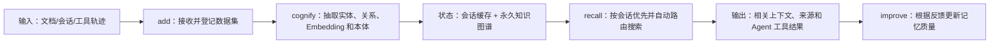

# Cognee：从多源数据构建知识图谱记忆

> **项目快照**：官方仓库 <https://github.com/topoteretes/cognee>｜项目快照日期 2026-09-03｜Stars 约 30.3k｜许可证 Apache-2.0｜仓库在快照日有提交；官方 README 当前提供 Docker 镜像、Compose profiles 和 Claude Code Memory 插件。源码实现复核见第 3.1 节。[^cognee-repository][^cognee-license]

> **需求画像**：目标是将经授权的开发会话、项目文档和业务资料转为跨会话共享 Memory，同时给 Skill 更新提供可追踪的会话和工具轨迹。硬约束是单机自部署、模型 API 可切换、尽量支持多 Agent；经验到 Skill 的候选和人工发布仍由外部治理层完成。

## 1. 项目要解决什么问题

### 目标用户与使用场景

Cognee 是面向 Agent 的开源 AI Memory 平台：接收任意格式数据，构建可自托管知识图谱，并让 Agent 跨会话召回、连接和使用上下文。[^cognee-repository]

它同时提供永久知识和会话记忆。`remember` 可把内容写入图谱；指定 `session_id` 时写入快速会话缓存，并在后台同步到图谱，适合把开发过程分成“当前会话上下文”和“项目长期知识”。[^cognee-repository]

### 当前问题

单一向量库容易丢失实体关系和跨文档结构。Cognee 将向量 Embedding、图推理和本体生成组合起来，把资料从可搜索文本变成可关联的知识网络。[^cognee-repository]

对本项目尤其重要的是，官方提供 Claude Code Memory 插件：它捕获 prompts、工具轨迹和 assistant responses，注入相关上下文，并在会话结束时启动把会话记忆同步到永久知识图谱的任务；是否最终完成取决于后台同步与服务状态。[^cognee-repository]

### 问题边界

Cognee 负责数据摄取、记忆构建、召回和 Agent 集成；它不自动判断某个会话是否应上传、不会替团队审批原始会话，也不会直接修改和发布 Skill。插件的本地/远端模式和访问控制仍需按部署配置验证。

## 2. 设计的核心思路

### 核心判断

Cognee 把记忆设计为可运行的数据管道：输入数据经过 add/cognify/improve 形成图谱和索引，查询阶段自动路由到会话缓存或图谱搜索。它的目标是让不同 Agent 共享同一知识基础，而不是把所有历史文本每次原样放进上下文。[^cognee-repository]

### Memory 实现方式

输入先经 `add`/`remember` 写入数据集；`cognify` 再完成切块、实体关系抽取、本体约束和 Embedding，分别落入图结构与向量索引。带 `session_id` 的内容先进入快速会话记忆，`recall/search` 按会话或长期图谱召回，`improve` 根据反馈异步修正派生知识。[^cognee-repository]

### 关键设计选择

- **DAG/管道式知识构建**：`add`、`cognify`、`search`/`recall`、`improve` 等操作分离摄取、结构化和反馈改进。[^cognee-repository]
- **会话记忆与永久图谱分层**：session memory 追求快速读写，长期图谱保存可跨会话复用的事实和关系。[^cognee-repository]
- **图 + 向量 + 本体**：同时支持语义检索和关系推理，并通过 ontology grounding 组织业务域知识。[^cognee-repository]
- **插件/MCP 多接入面**：提供 API、MCP Server、TypeScript/Rust 客户端和 Claude Code 插件，降低不同 Agent 的接入成本。[^cognee-repository][^cognee-mcp]

### 向量化与模型接口核验

Cognee 的默认语义检索路径需要 Embedding。当前配置类默认 `embedding_provider=openai`、`embedding_model=openai/text-embedding-3-large`，并在能从 LiteLLM/FastEmbed 识别模型时自动解析维度；无法识别时回退到 3072 维。官方配置接口也直接给出了 FastEmbed 的 `BAAI/bge-small-en-v1.5`/384 维示例。[^cognee-embedding-config][^cognee-config]

官方配置支持 OpenAI、FastEmbed、Ollama、LiteLLM 和 OpenAI-compatible 端点；官方模板示例包括 OpenAI `text-embedding-3-large`/3072 维、Ollama `nomic-embed-text:latest`/768 维。LanceDB 是默认向量后端，亦可切换 pgvector、Turso，或安装社区适配器接入 Qdrant、Weaviate、Milvus、ChromaDB。[^cognee-env][^cognee-vector-db]

公司 OpenAI-compatible API 可以通过 `EMBEDDING_ENDPOINT`、模型名和维度接入；DeepSeek 当前不能直接假定可作为 Embedding provider，需确认公司网关是否暴露 `/v1/embeddings` 以及目标模型的输出维度。中文资料不应沿用默认英文模型而不做评测；更换模型或维度前必须清理并重建向量索引，否则会产生形状不匹配。[^cognee-env][^cognee-embedding-config]

### 代价与取舍

图谱构建和 `improve` 会调用 LLM，质量和成本高于只存文本/向量；前端、MCP、Postgres/PGVector、Neo4j 等可选组件会增加部署选择。调研判断：Cognee 与“采集开发会话并沉淀为团队知识”的方向最接近，但插件仍需补上原始会话留存、授权策略和 Skill 变更证据模型。

## 3. 项目如何工作

### 工作流概览

### 阶段说明

| 阶段 | 接收什么 | 做什么 | 产生的状态或产物 | 证据 |
| --- | --- | --- | --- | --- |
| 数据接入 | 任意格式资料、用户消息、工具轨迹 | `add` 登记数据并建立数据集 | 待构建的数据集 | [^cognee-repository] |
| 认知构建 | 数据集内容 | `cognify` 抽取实体关系、生成 Embedding、应用本体 | 可查询图谱与向量索引 | [^cognee-repository] |
| 会话写入 | 内容和 `session_id` | 写入快速 session memory，并后台同步到图谱 | 会话上下文和长期知识任务 | [^cognee-repository] |
| 召回路由 | 查询、可选 session ID | 优先查会话记忆，必要时回退图谱；选择搜索策略 | 相关节点/文本/关系 | [^cognee-repository] |
| Agent 消费 | recall 结果 | 通过 API、MCP 或插件注入 Agent 上下文 | 带项目知识的回答/行动 | [^cognee-mcp][^cognee-claude] |
| 反馈改进 | 用户/Agent 反馈和回答 | `improve` 调整记忆结构或质量 | 更新后的图谱和检索表现 | [^cognee-repository] |

### 关键状态与产物

- **Dataset/图谱**：永久知识的组织边界，存放从资料和会话中抽取的实体、关系及向量。[^cognee-repository]
- **Session memory**：与 `session_id` 绑定的快速上下文缓存，查询时优先使用，并可在后台同步到永久图谱。[^cognee-repository]
- **Agent trace 记录**：Claude Code 插件可捕获 prompts、工具 traces 和 responses；这些记录可以作为 Skill 候选的证据来源。[^cognee-claude]
- **Feedback/improve 状态**：反馈触发的记忆改进结果；应由外部系统同时保存原始反馈和 Skill 版本，以便审计。

### 最终输出

调用方获得自然语言或结构化的召回结果，可从 API、CLI、UI、MCP 或 Claude Code 插件消费。对 Skill 更新，建议将插件采集的会话 trace 与 `session_id`、Git commit、Skill 版本绑定后，再交给外部候选生成和评审流程。

## 3.1 源码实现核验（官方源码快照）

> **核验范围与方法**：本节只阅读官方 GitHub 源码，没有安装或运行 Cognee，也没有把 README 的描述当作实现证据。Cognee 核心核验快照为 `topoteretes/cognee@78ff576559a7f75f65884c5bd90b22cdc790016e`（2026-09-05），Claude Code 集成为 `topoteretes/cognee-integrations@b35a3524b16c2146b412c8a3e5ac126d1a36daf4`（2026-09-05）。因此，以下是源码路径和函数级核验，不是本地 POC 的运行结论；未从源码确认的行为标为“未确认”。[^cognee-source-snapshot]

### API 入口与 `add`/`remember` 语义

- `cognee/api/v1/add/add.py:add` 负责解析输入、解析或创建授权 Dataset，并把目录解析、摄取和 `run_pipeline` 交给下游任务；它本身不等于“已经完成图谱构建”。[^cognee-source-add]
- `cognee/api/v1/remember/remember.py:remember` 分成三条主要路径：`MemorySource` 导入、带类型的 `MemoryEntry`、普通字符串/文件等输入。普通永久记忆在 `_remember_inner` 中按 `add → cognify → improve` 执行；默认 `self_improvement=True`，默认前台执行。[^cognee-source-remember]
- 传入 `session_id` 时，`_remember_inner` 改走 `SessionManager.add_qa`，返回 `status="session_stored"`；如果启用 `self_improvement`，另起后台任务调用 `improve(dataset, session_ids=[session_id], user=...)`。所以“写入 session cache”和“已经进入永久图谱”不是同一时刻，后台 improve 失败也不会改变已返回的 session 写入结果。[^cognee-source-remember][^cognee-source-session-manager]
- `MemorySource`、`QAEntry`、`TraceEntry`、`FeedbackEntry` 等类型有额外校验；例如 QA/Trace/Feedback entry 需要 `session_id`，而 code ingestion 不接受 `session_id`。这意味着不能把所有输入都概括为同一个 `add` 调用。[^cognee-source-remember]

### `cognify` pipeline：实体、关系、本体和索引并非一个原子函数

`cognee/api/v1/cognify/cognify.py:cognify` 会先运行迁移并解析 ontology resolver/mode，然后按每个数据项的 route 选择任务。标准 `get_default_tasks` 的源码顺序是：

1. `classify_documents`：将摄取对象分类为文档数据。
2. `extract_chunks_from_documents`：按配置的 chunker/chunk size 切块。
3. `extract_graph_and_summarize`：调用图抽取逻辑；这里的“summarize”是任务组合名称，不能据此断言一定产生独立摘要字段。
4. `add_data_points`：写入图节点/边并建立向量索引。
5. 按配置追加 `record_provenance`、`detect_contradictions` 和 `resolve_temporal_contradictions`。

`cognify_route_for` 负责把 DLT、CODE、CODE_REPO 和普通数据项路由到不同任务列表；temporal 不是该函数的 per-item route，而是由本次调用的 `temporal_cognify=True` 独立选择 temporal pipeline，抽取事件/时间戳。DLT 路由会清理旧派生物并构建 schema/外键边。所有路线最终经过 `run_pipeline` 与 `get_pipeline_executor`，可前台或后台运行。[^cognee-source-cognify]

### 实体关系抽取与 ontology grounding

- `cognee/tasks/graph/extract_graph_from_data.py:extract_graph_from_data` 对每个 chunk 调用 `extract_content_graph`，再由 `integrate_chunk_graphs` 把 LLM 输出的 `KnowledgeGraph` 转为 `DataPoint` 和边；同一图内重复 node ID 会去重，已存在的 `EdgeIdentity` 不会重复挂接。[^cognee-source-graph]
- 没有 resolver 时使用 `construct_data_points_and_edges`；配置了 resolver 时使用 `construct_data_points_and_edges_with_ontology`。后者通过 `canonicalize_extracted_graphs` 和 `_canonicalize_extracted_graph` 把实体类型/名称规范化、合并同一 canonical entity，并在 strict mode 下丢弃没有 ontology class/individual 匹配的节点；随后由 `_add_ontology_data_points`、`_add_ontology_edges` 增补本体节点和关系。[^cognee-source-ontology]
- 默认 resolver 工厂使用 RDFLib + fuzzy matching；环境配置要求 ontology 路径、resolver 和 matching strategy，当前源码只接受 `rdflib`/`fuzzy` 组合。没有有效 ontology 时，高层配置可能是不启用 resolver，strict mode 则会失败；因此“使用 ontology”不是所有安装的默认事实。[^cognee-source-ontology-resolver]

### 图、Embedding、向量索引和来源引用

`cognee/tasks/storage/add_data_points.py:add_data_points` 的实际写入顺序比“抽取后存储”更具体：先从 DataPoint 得到 graph nodes/edges 并去重，再按后端能力写图；普通非 hybrid 路径先写节点、调用 `index_data_points`，再写边、调用 `index_graph_edges`。`embed_triplets=True` 时，`_create_triplets_from_graph` 根据 `metadata["index_fields"]` 拼接 source–relationship–target 文本并额外向量化。[^cognee-source-storage]

- 图侧接口 `graph_db_interface.py` 提供 `add_nodes`、`add_edges`、`attach_node_source_refs`、`attach_edge_source_refs` 等方法；向量侧 `vector_db_interface.py` 提供 `search`、`batch_search`、`index_data_points`，并可用 `include_payload` 返回 payload。[^cognee-source-db-interfaces]
- `EmbeddingConfig` 默认是 `openai` + `openai/text-embedding-3-large`；能从 FastEmbed/LiteLLM 识别维度时使用识别值，识别失败回退到 3072，并默认批大小 36。该回退不是目标模型真实维度的验证；换 provider/model 后仍需按实际维度重建索引并实测。[^cognee-source-embedding]
- 源码提供 graph/vector 的 source reference、relational provenance、`source_pipeline`/`source_task` 和最终 `capture_graph_provenance` 写入路径；是否实际生成取决于任务配置、loader 和后端，不能把它当成所有 ingest 的默认结果。即使生成来源关联，也不等于始终保留可恢复的原始文件字节或完整原始会话：原始内容保留由具体 loader、数据库和配置决定，不能仅凭 `add_data_points` 断言。原始字节是否在每种后端都可完整导出，**未确认**。[^cognee-source-add][^cognee-source-graph][^cognee-source-storage]

### session memory、`recall` 与 `search`

- `cognee/infrastructure/session/session_manager.py:SessionManager.add_qa` 保存 `user_id`、`session_id`、question、context、answer、feedback 及可选图元素 ID，并调用 `index_session_qa`；`get_session` 使用 cache engine 返回最近 `last_n` 或全部 QA，未见该类强制的数量上限。具体持久化依赖 Redis/Fs 等 cache adapter；这不等于永久保留，adapter 的 TTL、淘汰、容量、备份和跨重启行为：**未确认**。[^cognee-source-session-manager]
- `cognee/api/v1/recall/recall.py:_search_session` 和 `_search_trace` 对 session/trace 做 token overlap 排序；`recall` 在 `scope=auto` 且只有 `session_id`、没有 Dataset 和显式 `query_type` 时先查 session，有命中可跳过 graph；带 Dataset 且未显式指定 `query_type` 时可并查，显式 `query_type` 则按 graph-only 搜索路径执行。图侧 `_run_graph` 可调用 `route_query` 自动选择类型，最终把检索交给 `authorized_search`。因此 session cache 的默认召回不是“直接对整个会话做向量语义检索”。[^cognee-source-recall]
- `cognee/api/v1/search/search.py:search` 负责授权 Dataset、检索配置和结果包装；支持 `GRAPH_COMPLETION`、`RAG_COMPLETION`、`CHUNKS`、`SUMMARIES`、`CYPHER`、`CHUNKS_LEXICAL`、`CODE`、`AGENTIC_COMPLETION` 等类型。`include_references`、payload 和 node filters 能暴露来源/节点信息，但是否能回到原始完整材料仍取决于后端存储和 ingest 产物。[^cognee-source-search]

### `improve` 实际做什么

`cognee/api/v1/improve/improve.py:improve` 不是泛化的“自动修正模型”。在本地 SDK 分支中，没有 `session_ids` 时主要进入 `memify` enrichment；带 `session_ids` 时才启用会话相关阶段，包括 `apply_feedback_weights_pipeline`、`persist_sessions_in_knowledge_graph_pipeline`、`persist_agent_trace_feedbacks_in_knowledge_graph_pipeline`、session distillation、`update_user_preferences`，可选 `build_truth_subspace`，最后再做 memify。单 session 还使用 improve lock，后台模式会立即返回运行信息，且 global context index 不在后台模式执行。远程 client 分支是否完整转发 `session_ids`、并执行这些 session stages：**未确认，需核验服务端 endpoint**；Claude Code 集成的专用 session-sync 路径另有自己的桥接逻辑。[^cognee-source-improve]

因此原文“根据反馈异步修正派生知识”在本地 session-aware 路径中应理解为：反馈权重、会话/trace 持久化、蒸馏和 enrichment 任务的组合；并非保证自动发现事实错误、自动改写所有关系或自动生成可发布 Skill。远程 endpoint 的 session 参数转发和对应阶段：**未确认**。具体抽取/富集质量依赖配置和任务，改进结果也需要外部评审。

### Claude Code Hook 的源码核验

官方集成的 hook 配置在 `integrations/claude-code/hooks/hooks.json`：`SessionStart` 初始化，`UserPromptSubmit` 召回并异步保存 prompt，`PostToolUse` 保存工具 trace，`Stop` 保存 assistant QA，`PreCompact` 生成 memory anchor，`SessionEnd` 调起最终同步。[^cognee-source-hooks-config]

- `scripts/session-start.py` 解析 backend、dataset、user/session identity，必要时启动本地服务或连接 HTTP 服务，并通过 `hookSpecificOutput` 注入连接状态和“优先使用 Cognee”指导。它还可能以后台 worker 做安装/迁移/注册；bootstrap 成功率和权限边界：**未确认**，不能由源码阅读替代 POC。[^cognee-source-hook-start]
- `scripts/store-user-prompt.py` 只先缓存 pending prompt；`scripts/store-to-session.py` 再把 PostToolUse 变成 `TraceEntry`，把 Stop 的 assistant message 与 pending prompt 配成 `QAEntry`，本地路径调用 `cognee.remember(..., session_id=..., self_improvement=False)`，远端路径调用 `remember_entry_via_http`。工具递归防护会跳过包含 `cognee` 的 Bash；capture policy 只对选定字段按配置做工具白名单过滤和有限脱敏，不等于完整隐私清理。进程崩溃、取消或 Hook 失败时，prompt 可能停留在 pending 状态，未必形成完整 QA，也未必进入图谱。[^cognee-source-hook-capture]
- `scripts/session-context-lookup.py` 在每个 prompt 前按 scope 独立、顺序调用 `cognee.recall`，先查 `session`、`trace`、`session_context`，再查 `graph`，必要时加 `code`；将结果按来源格式化为 `hookSpecificOutput.additionalContext`。Recall 有单 scope timeout 和总预算，失败通常记日志并返回空上下文，而不是阻塞回答。[^cognee-source-hook-recall]
- `scripts/pre-compact.py` 取最近 session/trace，必要时直接访问 session manager，再补 graph 查询，输出截断后的 `Cognee Memory Anchor`。空查询或缺少 session ID 时可能没有 anchor，远端环境的本地 session-manager fallback 也可能不可用。[^cognee-source-hook-precompact]
- `scripts/sync-session-to-graph.py` 在 `SessionEnd` 先启动 detached worker，再按 Dataset/session 调 `run_session_improve(..., trigger="final")` 或本地 `improve_session_local(..., trigger="final")`；默认重试，非 strict 失败不会阻塞宿主进程。也就是说 session-end 是“最终同步任务已启动/尽力完成”，不是同步完成的强一致确认。[^cognee-source-hook-sync]

### 原文、来源与限制结论

| 对象 | 源码能确认的保留内容 | 不能直接推出的能力或限制 |
| --- | --- | --- |
| 普通文档/文件 | DataPoint、图节点/边、Embedding、source refs/provenance 可由 pipeline 产生 | 不保证每种 loader/后端都保留可下载的原始字节；完整原文回放未确认 |
| session QA | `question/context/answer`、session/user 标识、可选 feedback 与图元素 ID | `SessionManager` 不负责脱敏和无限历史策略；插件在写入前会按配置截断/有限脱敏；Redis/Fs 等 adapter 的 TTL、淘汰、容量和备份策略：**未确认** |
| 工具 trace | 工具名、状态、截断后的参数/返回值、错误信息、session 关联 | 只采集配置允许的工具；不是完整终端/文件快照，选定字段和上限会丢信息 |
| 来源追踪 | graph source refs、pipeline/task provenance、recall source 标签、可选 references | 来源与原文之间的可审计闭环、删除后可恢复性、租户策略仍依赖部署；部分行为未确认 |
| Claude Code 生命周期 | 官方 hooks 已实现 prompt/tool/assistant capture、recall 注入、PreCompact anchor、SessionEnd improve | 仅直接覆盖 Claude Code；其他 Agent 的 hook/事件适配、用户逐条上传审批和 Skill PR 流程未提供 |

这组源码证据支持保留本报告的总体判断，但应把“永久保存原文”“反馈自动纠错”“SessionEnd 已完成同步”改读为有条件能力。当前最需要在 POC 中验证的是：选定 loader/后端的原始对象回放；完整 provenance 导出、远端权限/租户隔离、异步 improve 的可观测完成状态，以及未提交代码是否进入 code graph：均为**未确认**。

## 4. 与需求画像逐项对照

### 需求矩阵

| 需求项 | 优先级或硬约束 | 项目现有能力 | 证据 | 状态 | 说明 |
| --- | --- | --- | --- | --- | --- |
| 项目业务知识长期保存 | 必须 | 自托管知识图谱、Dataset、永久记忆 | [^cognee-repository] | 满足 | 需设计项目/团队数据集隔离 |
| 技术决策和经验可检索 | 必须 | 图/向量搜索、Ontology、recall | [^cognee-repository] | 满足 | 来源、版本和事实审核需补充元数据 |
| Claude Code 事件捕获 | 必须 | Claude 插件捕获 prompts、tools、responses | [^cognee-claude] | 部分满足 | 不是完整终端/文件快照；适配其他 Agent 仍需各自插件/导入器 |
| 证据来源和历史 | 必须 | trace/session 记录和知识图谱可关联 | [^cognee-claude][^cognee-repository] | 部分满足 | 原始 JSONL、用户确认和版本历史需要外部归档 |
| 多 Agent 接入 | 必须 | MCP、API、TS/Rust 客户端及 Claude 插件 | [^cognee-repository][^cognee-mcp] | 满足 | 非 MCP Agent 需适配 |
| 模型 API 可切换 | 必须 | LLM Provider 文档；环境变量配置 | [^cognee-repository][^cognee-providers] | 满足 | 公司 API/DeepSeek 兼容性需实测 |
| 单机自部署 | 必须 | pip、Docker 镜像、Compose profiles | [^cognee-repository] | 满足 | UI/MCP/Postgres/Neo4j 按需增加服务 |
| 用户主动控制原始会话上传 | 期望 | 本地插件模式或远端 Base URL 配置 | [^cognee-claude] | 部分满足 | 具体上传确认 UI/策略未确认，需外部实现 |
| Skill 候选人工发布 | 必须 | traces 与 improve 可提供素材 | [^cognee-claude][^cognee-repository] | 部分满足 | 无内置 Skill PR、审批和回归流水线 |

### 对照归纳

Cognee 是本组中最直接覆盖“开发会话采集 + 会话记忆 + 永久业务知识”的候选。其主要缺口是跨 Agent 统一协议、原始会话治理、权限与 Skill 发布，而非数据摄取能力本身。

## 5. 开源与能力边界

### 边界清单

| 能力 | 开源核心 | 商业版或 SaaS | 外部依赖 | 证据 |
| --- | --- | --- | --- | --- |
| Cognee Python 核心、API、CLI | 有，Apache-2.0 | 官方也提供云/远程配置，边界按服务条款 | Python 3.10–3.14、LLM/Embedding | [^cognee-repository][^cognee-license] |
| 知识图谱、向量和 session memory | 有 | 云端可提供托管 | 本地文件/SQLite，或 Postgres/PGVector、Neo4j profiles | [^cognee-repository] |
| UI、API Server、MCP Server | 有容器/源码入口 | 未确认企业高级权限是否完整开源 | Docker、MCP 客户端 | [^cognee-repository][^cognee-mcp] |
| Claude Code Memory 插件 | 有独立集成仓库/市场入口 | 可配置远端 Cognee Cloud | Claude Code、LLM API、Cognee API | [^cognee-claude] |
| 访问控制、审计、租户隔离 | README 宣称支持部分能力 | 云产品可能提供更多运营能力 | 配置与外部网关 | [^cognee-repository] |

### 边界判断

官方 README 给出了本地 Python、Docker Compose 和预构建镜像，不要求必须使用 SaaS。另一方面，Claude 插件的远端模式需要 `COGNEE_BASE_URL` 和 `COGNEE_API_KEY`；本地模式会启动本地 API 并自动生成 API Key，团队应明确数据是否离开开发机。[^cognee-repository][^cognee-claude]

“支持 Claude Code”不能直接推断支持所有 Agent；多 Agent 主要依靠 MCP、API 和各客户端，其他 CLI 仍要做事件适配和用户授权。

## 6. 用户如何接入和使用

### 接入前提

- Python 3.10–3.14、LLM API Key；可用 pip/uv 安装或运行预构建 Docker 镜像。[^cognee-repository]
- 选择默认轻量存储或 Compose profile 中的 Postgres/PGVector、Neo4j；规划数据集、项目、成员和会话 ID。
- Claude Code 场景安装官方 `cognee-memory` 插件；其他 Agent 可使用 MCP 或 API 接入。[^cognee-claude][^cognee-mcp]

### 最快验证路径

1. 用 `uv pip install cognee` 或 Docker Compose 启动 API；设置 `LLM_API_KEY`、模型 Base URL 等配置。[^cognee-repository][^cognee-providers]
2. 通过 `remember`/CLI 或插件写入文档、选定会话和工具轨迹；长期知识运行 add+cognify+improve，短期会话指定 `session_id`。[^cognee-repository]
3. 通过 `recall`、MCP 或插件注入上下文；将 trace、图谱来源和 Git/Skill 元数据交给外部评审流水线。

### 日常使用方式

Claude Code 插件在启动时连接 Cognee，在每次 prompt 前注入相关上下文，会话结束时同步 session memory。服务/API 用户则通过 `remember`/`recall`/`forget`/`improve` 管理知识。[^cognee-claude][^cognee-repository]

### 接入限制

插件推荐的本地模式需要运行 Cognee API；远端模式需要 API Key。文档未确认不同 Agent 的原始会话格式、隐私审批和批量导入一致性，需在 POC 中逐一验证。

## 7. 部署构成

### 运行组件

| 组件 | 必需或可选 | 职责 | 持久化数据 | 与其他组件的关系 | 证据 |
| --- | --- | --- | --- | --- | --- |
| Cognee API/CLI | 必需 | remember、recall、cognify、improve、forget | 配置、数据集/索引（按存储后端） | 调用模型与数据库 | [^cognee-repository] |
| LLM/Embedding 服务 | 必需 | 抽取、本体生成、向量和反馈改进 | 外部服务或模型缓存 | Cognee 调用 | [^cognee-providers] |
| 默认本地存储 | 可选/轻量路径 | 小规模数据和 session memory | 本地文件/SQLite 等，具体配置需确认 | API 读写 | [^cognee-repository] |
| Postgres/PGVector | 可选 Compose profile | 关系/向量持久化 | 数据集、向量、元数据 | Cognee API 访问 | [^cognee-repository] |
| Neo4j | 可选 Compose profile | 图存储和关系查询 | 图节点、边和索引 | Cognee API 访问 | [^cognee-repository] |
| UI 前端 | 可选 | 管理和可视化 | 通常无核心持久化 | 调用 API | [^cognee-repository] |
| MCP Server | 可选 | 给 MCP Agent 暴露记忆工具 | 无独立核心数据 | 调用 Cognee API | [^cognee-mcp] |
| Claude Code 插件 | 可选 | 采集 prompt/tool/response、注入和同步 | 本地会话缓存/服务器知识 | 调用本地或远端 Cognee | [^cognee-claude] |

### 最小部署路径

官方给出两条轻量路径：安装 Cognee 后运行 CLI/API，或只启动预构建 `cognee/cognee` 镜像；Compose 可按 profile 增加 UI、MCP、Postgres/PGVector 或 Neo4j。Claude Code 本地模式默认连接本机 `http://localhost:8011`，仅需 LLM API Key。[^cognee-repository][^cognee-claude]

### 生产化仍需考虑

- 对 Postgres/Neo4j、原始 trace 和 API Key 做备份、访问隔离、删除和审计；配置 `ENABLE_BACKEND_ACCESS_CONTROL` 时需验证当前认证行为。[^cognee-server]
- `AUTO_FEEDBACK` 会增加每次查询的 LLM 调用；会话 memory 关闭会失去会话上下文，官方建议按场景配置。[^cognee-repository]
- 官方未给出本项目场景的最低 CPU、内存或吞吐要求，需实测；单机应先从默认存储或单一数据库 profile 开始。

## 8. 适配结论与能力缺口

### 适配结论

**条件匹配。** Cognee 同时提供长期图谱、会话缓存、Agent trace 和 Claude Code 插件，适合作为快速验证“开发会话沉淀为共享 Memory”的候选；但完整的多 Agent 采集、原始会话授权、证据归档和 Skill 人工发布仍要在其外部实现。

### 已满足能力

- `remember`/`recall`/`forget`/`improve` 分层操作，会话 memory 与永久知识图谱并存。[^cognee-repository]
- 官方插件可捕获 Claude Code 的 prompt、工具轨迹和回复，并在会话结束同步。[^cognee-claude]
- Docker/Compose profile 覆盖 API、UI、MCP、Postgres/PGVector 和 Neo4j，能在单机按需组合。[^cognee-repository]
- API、MCP、TypeScript/Rust 客户端提供多 Agent 扩展面。[^cognee-mcp][^cognee-repository]

### 能力缺口

- **跨 Agent 会话适配**：除 Claude Code 外，需要自行实现 Cursor/Codex/其他 CLI 的 trace 解析或 MCP Hook。
- **原始会话治理**：插件捕获不等于用户确认、原始 JSONL 归档、脱敏和可撤回上传。
- **Skill 更新流程**：需要把 trace 与图谱事实生成候选 Markdown/代码差异，交给人工评审和回归任务。
- **团队权限模型**：项目/成员/个人记忆隔离、审计和数据生命周期要按公司要求配置/补齐。

### 需要自研或外部补齐

- 统一会话事件格式、会话选择/上传确认和原始对象存储。
- 以 Cognee dataset/session/metadata 映射项目、成员、Agent、Skill 版本。
- Skill 候选生成、Git 评审、验证和冲突处理。

### 否决风险

当前未发现硬性否决项；需要优先确认插件的本地数据边界、当前版本权限配置，以及单机启用图谱后端的资源和稳定性。

---

[^cognee-repository]: [Cognee 官方 GitHub 仓库与 README](https://github.com/topoteretes/cognee)
[^cognee-license]: [Cognee Apache-2.0 许可证](https://github.com/topoteretes/cognee/blob/main/LICENSE)
[^cognee-mcp]: [Cognee MCP Server](https://github.com/topoteretes/cognee/tree/main/cognee-mcp)
[^cognee-claude]: [Cognee Integrations 官方仓库（Claude Code 插件）](https://github.com/topoteretes/cognee-integrations/tree/main/integrations/claude-code)
[^cognee-providers]: [Cognee LLM Provider 文档](https://docs.cognee.ai/configuration/llm-providers)
[^cognee-server]: [Cognee Server/访问控制说明](https://github.com/topoteretes/cognee/tree/main/deployment)
[^cognee-embedding-config]: [Cognee EmbeddingConfig 与维度解析](https://github.com/topoteretes/cognee/blob/main/cognee/infrastructure/databases/vector/embeddings/config.py)
[^cognee-config]: [Cognee 配置 API：Embedding provider/model/dimensions](https://github.com/topoteretes/cognee/blob/main/cognee/api/v1/config/config.py)
[^cognee-env]: [Cognee 官方环境变量模板：Embedding 示例](https://github.com/topoteretes/cognee/blob/main/.env.template)
[^cognee-vector-db]: [Cognee 向量数据库支持与适配器](https://github.com/topoteretes/cognee/blob/main/cognee/infrastructure/databases/vector/supported_databases.py)
[^cognee-source-snapshot]: [Cognee 核心源码快照](https://github.com/topoteretes/cognee/tree/78ff576559a7f75f65884c5bd90b22cdc790016e)；[Claude Code 集成源码快照](https://github.com/topoteretes/cognee-integrations/tree/b35a3524b16c2146b412c8a3e5ac126d1a36daf4)
[^cognee-source-add]: [`add.py:add`](https://github.com/topoteretes/cognee/blob/78ff576559a7f75f65884c5bd90b22cdc790016e/cognee/api/v1/add/add.py#L35)
[^cognee-source-remember]: [`remember.py:typed entry dispatch` / `remember` / `_remember_inner`](https://github.com/topoteretes/cognee/blob/78ff576559a7f75f65884c5bd90b22cdc790016e/cognee/api/v1/remember/remember.py#L148-L1431)
[^cognee-source-cognify]: [`cognify.py:cognify` / `get_default_tasks` / route task selection](https://github.com/topoteretes/cognee/blob/78ff576559a7f75f65884c5bd90b22cdc790016e/cognee/api/v1/cognify/cognify.py#L106-L555)
[^cognee-source-graph]: [`extract_graph_from_data.py:integrate_chunk_graphs` / `extract_graph_from_data`](https://github.com/topoteretes/cognee/blob/78ff576559a7f75f65884c5bd90b22cdc790016e/cognee/tasks/graph/extract_graph_from_data.py#L86-L256)
[^cognee-source-ontology]: [`construct_data_points_and_edges_with_ontology.py`](https://github.com/topoteretes/cognee/blob/78ff576559a7f75f65884c5bd90b22cdc790016e/cognee/modules/ontology/construct_data_points_and_edges_with_ontology.py#L133-L437)
[^cognee-source-ontology-resolver]: [`get_default_ontology_resolver.py`](https://github.com/topoteretes/cognee/blob/78ff576559a7f75f65884c5bd90b22cdc790016e/cognee/modules/ontology/get_default_ontology_resolver.py)
[^cognee-source-storage]: [`add_data_points.py:add_data_points`](https://github.com/topoteretes/cognee/blob/78ff576559a7f75f65884c5bd90b22cdc790016e/cognee/tasks/storage/add_data_points.py#L69-L456)
[^cognee-source-db-interfaces]: [`graph_db_interface.py`](https://github.com/topoteretes/cognee/blob/78ff576559a7f75f65884c5bd90b22cdc790016e/cognee/infrastructure/databases/graph/graph_db_interface.py#L103-L230)；[`vector_db_interface.py`](https://github.com/topoteretes/cognee/blob/78ff576559a7f75f65884c5bd90b22cdc790016e/cognee/infrastructure/databases/vector/vector_db_interface.py#L98-L300)
[^cognee-source-embedding]: [`embeddings/config.py:EmbeddingConfig`](https://github.com/topoteretes/cognee/blob/78ff576559a7f75f65884c5bd90b22cdc790016e/cognee/infrastructure/databases/vector/embeddings/config.py#L20-L130)
[^cognee-source-session-manager]: [`session_manager.py:SessionManager.add_qa` / `get_session`](https://github.com/topoteretes/cognee/blob/78ff576559a7f75f65884c5bd90b22cdc790016e/cognee/infrastructure/session/session_manager.py#L38-L520)
[^cognee-source-recall]: [`recall.py:_search_session` / `recall` / `_run_graph`](https://github.com/topoteretes/cognee/blob/78ff576559a7f75f65884c5bd90b22cdc790016e/cognee/api/v1/recall/recall.py#L162-L820)
[^cognee-source-search]: [`search.py:search`](https://github.com/topoteretes/cognee/blob/78ff576559a7f75f65884c5bd90b22cdc790016e/cognee/api/v1/search/search.py#L41-L300)
[^cognee-source-improve]: [`improve.py:improve`](https://github.com/topoteretes/cognee/blob/78ff576559a7f75f65884c5bd90b22cdc790016e/cognee/api/v1/improve/improve.py#L39-L540)
[^cognee-source-hooks-config]: [`hooks.json`](https://github.com/topoteretes/cognee-integrations/blob/b35a3524b16c2146b412c8a3e5ac126d1a36daf4/integrations/claude-code/hooks/hooks.json#L3-L97)
[^cognee-source-hook-capture]: [`store-user-prompt.py`](https://github.com/topoteretes/cognee-integrations/blob/b35a3524b16c2146b412c8a3e5ac126d1a36daf4/integrations/claude-code/scripts/store-user-prompt.py#L134-L210)；[`store-to-session.py`](https://github.com/topoteretes/cognee-integrations/blob/b35a3524b16c2146b412c8a3e5ac126d1a36daf4/integrations/claude-code/scripts/store-to-session.py#L116-L438)
[^cognee-source-hook-start]: [`session-start.py`](https://github.com/topoteretes/cognee-integrations/blob/b35a3524b16c2146b412c8a3e5ac126d1a36daf4/integrations/claude-code/scripts/session-start.py#L1161-L1595)
[^cognee-source-hook-recall]: [`session-context-lookup.py`](https://github.com/topoteretes/cognee-integrations/blob/b35a3524b16c2146b412c8a3e5ac126d1a36daf4/integrations/claude-code/scripts/session-context-lookup.py#L216-L782)
[^cognee-source-hook-precompact]: [`pre-compact.py`](https://github.com/topoteretes/cognee-integrations/blob/b35a3524b16c2146b412c8a3e5ac126d1a36daf4/integrations/claude-code/scripts/pre-compact.py#L88-L316)
[^cognee-source-hook-sync]: [`sync-session-to-graph.py`](https://github.com/topoteretes/cognee-integrations/blob/b35a3524b16c2146b412c8a3e5ac126d1a36daf4/integrations/claude-code/scripts/sync-session-to-graph.py#L167-L505)
