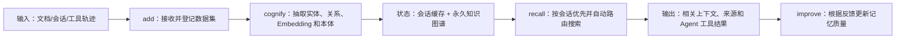

# Cognee：从多源数据构建知识图谱记忆

> **项目快照**：官方仓库 <https://github.com/topoteretes/cognee>｜核验日期 2026-09-03｜Stars 约 30.3k｜许可证 Apache-2.0｜仓库在核验日有提交；官方 README 当前提供 Docker 镜像、Compose profiles 和 Claude Code Memory 插件。[^cognee-repository][^cognee-license]

> **需求画像**：目标是将经授权的开发会话、项目文档和业务资料转为跨会话共享 Memory，同时给 Skill 更新提供可追踪的会话和工具轨迹。硬约束是单机自部署、模型 API 可切换、尽量支持多 Agent；经验到 Skill 的候选和人工发布仍由外部治理层完成。

## 1. 项目要解决什么问题

### 目标用户与使用场景

Cognee 是面向 Agent 的开源 AI Memory 平台：接收任意格式数据，构建可自托管知识图谱，并让 Agent 跨会话召回、连接和使用上下文。[^cognee-repository]

它同时提供永久知识和会话记忆。`remember` 可把内容写入图谱；指定 `session_id` 时写入快速会话缓存，并在后台同步到图谱，适合把开发过程分成“当前会话上下文”和“项目长期知识”。[^cognee-repository]

### 当前问题

单一向量库容易丢失实体关系和跨文档结构。Cognee 将向量 Embedding、图推理和本体生成组合起来，把资料从可搜索文本变成可关联的知识网络。[^cognee-repository]

对本项目尤其重要的是，官方提供 Claude Code Memory 插件：它捕获 prompts、工具轨迹和 assistant responses，注入相关上下文，并在会话结束时把会话记忆同步到永久知识图谱。[^cognee-repository]

### 问题边界

Cognee 负责数据摄取、记忆构建、召回和 Agent 集成；它不自动判断某个会话是否应上传、不会替团队审批原始会话，也不会直接修改和发布 Skill。插件的本地/远端模式和访问控制仍需按部署配置验证。

## 2. 设计的核心思路

### 核心判断

Cognee 把记忆设计为可运行的数据管道：输入数据经过 add/cognify/improve 形成图谱和索引，查询阶段自动路由到会话缓存或图谱搜索。它的目标是让不同 Agent 共享同一知识基础，而不是把所有历史文本每次原样放进上下文。[^cognee-repository]

### 关键设计选择

- **DAG/管道式知识构建**：`add`、`cognify`、`search`/`recall`、`improve` 等操作分离摄取、结构化和反馈改进。[^cognee-repository]
- **会话记忆与永久图谱分层**：session memory 追求快速读写，长期图谱保存可跨会话复用的事实和关系。[^cognee-repository]
- **图 + 向量 + 本体**：同时支持语义检索和关系推理，并通过 ontology grounding 组织业务域知识。[^cognee-repository]
- **插件/MCP 多接入面**：提供 API、MCP Server、TypeScript/Rust 客户端和 Claude Code 插件，降低不同 Agent 的接入成本。[^cognee-repository][^cognee-mcp]

### 代价与取舍

图谱构建和 `improve` 会调用 LLM，质量和成本高于只存文本/向量；前端、MCP、Postgres/PGVector、Neo4j 等可选组件会增加部署选择。调研判断：Cognee 与“采集开发会话并沉淀为团队知识”的方向最接近，但插件仍需补上原始会话留存、授权策略和 Skill 变更证据模型。

## 3. 项目如何工作

### 工作流概览

### 阶段说明

| 阶段 | 接收什么 | 做什么 | 产生的状态或产物 | 证据 |
| --- | --- | --- | --- | --- |
| 数据接入 | 任意格式资料、用户消息、工具轨迹 | `add` 登记数据并建立数据集 | 待构建的数据集 | [^cognee-repository] |
| 认知构建 | 数据集内容 | `cognify` 抽取实体关系、生成 Embedding、应用本体 | 可查询图谱与向量索引 | [^cognee-repository] |
| 会话写入 | 内容和 `session_id` | 写入快速 session memory，并后台同步到图谱 | 会话上下文和长期知识任务 | [^cognee-repository] |
| 召回路由 | 查询、可选 session ID | 优先查会话记忆，必要时回退图谱；选择搜索策略 | 相关节点/文本/关系 | [^cognee-repository] |
| Agent 消费 | recall 结果 | 通过 API、MCP 或插件注入 Agent 上下文 | 带项目知识的回答/行动 | [^cognee-mcp][^cognee-claude] |
| 反馈改进 | 用户/Agent 反馈和回答 | `improve` 调整记忆结构或质量 | 更新后的图谱和检索表现 | [^cognee-repository] |

### 关键状态与产物

- **Dataset/图谱**：永久知识的组织边界，存放从资料和会话中抽取的实体、关系及向量。[^cognee-repository]
- **Session memory**：与 `session_id` 绑定的快速上下文缓存，查询时优先使用，并可在后台同步到永久图谱。[^cognee-repository]
- **Agent trace 记录**：Claude Code 插件可捕获 prompts、工具 traces 和 responses；这些记录可以作为 Skill 候选的证据来源。[^cognee-claude]
- **Feedback/improve 状态**：反馈触发的记忆改进结果；应由外部系统同时保存原始反馈和 Skill 版本，以便审计。

### 最终输出

调用方获得自然语言或结构化的召回结果，可从 API、CLI、UI、MCP 或 Claude Code 插件消费。对 Skill 更新，建议将插件采集的会话 trace 与 `session_id`、Git commit、Skill 版本绑定后，再交给外部候选生成和评审流程。

## 4. 与需求画像逐项对照

### 需求矩阵

| 需求项 | 优先级或硬约束 | 项目现有能力 | 证据 | 状态 | 说明 |
| --- | --- | --- | --- | --- | --- |
| 项目业务知识长期保存 | 必须 | 自托管知识图谱、Dataset、永久记忆 | [^cognee-repository] | 满足 | 需设计项目/团队数据集隔离 |
| 技术决策和经验可检索 | 必须 | 图/向量搜索、Ontology、recall | [^cognee-repository] | 满足 | 来源、版本和事实审核需补充元数据 |
| 完整开发会话接收 | 必须 | Claude 插件捕获 prompts、tools、responses | [^cognee-claude] | 满足 | 适配其他 Agent 仍需各自插件/导入器 |
| 证据来源和历史 | 必须 | trace/session 记录和知识图谱可关联 | [^cognee-claude][^cognee-repository] | 部分满足 | 原始 JSONL、用户确认和版本历史需要外部归档 |
| 多 Agent 接入 | 必须 | MCP、API、TS/Rust 客户端及 Claude 插件 | [^cognee-repository][^cognee-mcp] | 满足 | 非 MCP Agent 需适配 |
| 模型 API 可切换 | 必须 | LLM Provider 文档；环境变量配置 | [^cognee-repository][^cognee-providers] | 满足 | 公司 API/DeepSeek 兼容性需实测 |
| 单机自部署 | 必须 | pip、Docker 镜像、Compose profiles | [^cognee-repository] | 满足 | UI/MCP/Postgres/Neo4j 按需增加服务 |
| 用户主动控制原始会话上传 | 期望 | 本地插件模式或远端 Base URL 配置 | [^cognee-claude] | 部分满足 | 具体上传确认 UI/策略未确认，需外部实现 |
| Skill 候选人工发布 | 必须 | traces 与 improve 可提供素材 | [^cognee-claude][^cognee-repository] | 部分满足 | 无内置 Skill PR、审批和回归流水线 |

### 对照归纳

Cognee 是本组中最直接覆盖“开发会话采集 + 会话记忆 + 永久业务知识”的候选。其主要缺口是跨 Agent 统一协议、原始会话治理、权限与 Skill 发布，而非数据摄取能力本身。

## 5. 开源与能力边界

### 边界清单

| 能力 | 开源核心 | 商业版或 SaaS | 外部依赖 | 证据 |
| --- | --- | --- | --- | --- |
| Cognee Python 核心、API、CLI | 有，Apache-2.0 | 官方也提供云/远程配置，边界按服务条款 | Python 3.10–3.14、LLM/Embedding | [^cognee-repository][^cognee-license] |
| 知识图谱、向量和 session memory | 有 | 云端可提供托管 | 本地文件/SQLite，或 Postgres/PGVector、Neo4j profiles | [^cognee-repository] |
| UI、API Server、MCP Server | 有容器/源码入口 | 未确认企业高级权限是否完整开源 | Docker、MCP 客户端 | [^cognee-repository][^cognee-mcp] |
| Claude Code Memory 插件 | 有独立集成仓库/市场入口 | 可配置远端 Cognee Cloud | Claude Code、LLM API、Cognee API | [^cognee-claude] |
| 访问控制、审计、租户隔离 | README 宣称支持部分能力 | 云产品可能提供更多运营能力 | 配置与外部网关 | [^cognee-repository] |

### 边界判断

官方 README 给出了本地 Python、Docker Compose 和预构建镜像，不要求必须使用 SaaS。另一方面，Claude 插件的远端模式需要 `COGNEE_BASE_URL` 和 `COGNEE_API_KEY`；本地模式会启动本地 API 并自动生成 API Key，团队应明确数据是否离开开发机。[^cognee-repository][^cognee-claude]

“支持 Claude Code”不能直接推断支持所有 Agent；多 Agent 主要依靠 MCP、API 和各客户端，其他 CLI 仍要做事件适配和用户授权。

## 6. 用户如何接入和使用

### 接入前提

- Python 3.10–3.14、LLM API Key；可用 pip/uv 安装或运行预构建 Docker 镜像。[^cognee-repository]
- 选择默认轻量存储或 Compose profile 中的 Postgres/PGVector、Neo4j；规划数据集、项目、成员和会话 ID。
- Claude Code 场景安装官方 `cognee-memory` 插件；其他 Agent 可使用 MCP 或 API 接入。[^cognee-claude][^cognee-mcp]

### 接入过程

1. 用 `uv pip install cognee` 或 Docker Compose 启动 API；设置 `LLM_API_KEY`、模型 Base URL 等配置。[^cognee-repository][^cognee-providers]
2. 通过 `remember`/CLI 或插件写入文档、选定会话和工具轨迹；长期知识运行 add+cognify+improve，短期会话指定 `session_id`。[^cognee-repository]
3. 通过 `recall`、MCP 或插件注入上下文；将 trace、图谱来源和 Git/Skill 元数据交给外部评审流水线。

### 日常使用方式

Claude Code 插件在启动时连接 Cognee，在每次 prompt 前注入相关上下文，会话结束时同步 session memory。服务/API 用户则通过 `remember`/`recall`/`forget`/`improve` 管理知识。[^cognee-claude][^cognee-repository]

### 接入限制

插件推荐的本地模式需要运行 Cognee API；远端模式需要 API Key。文档未确认不同 Agent 的原始会话格式、隐私审批和批量导入一致性，需在 POC 中逐一验证。

## 7. 部署构成

### 运行组件

| 组件 | 必需或可选 | 职责 | 持久化数据 | 与其他组件的关系 | 证据 |
| --- | --- | --- | --- | --- | --- |
| Cognee API/CLI | 必需 | remember、recall、cognify、improve、forget | 配置、数据集/索引（按存储后端） | 调用模型与数据库 | [^cognee-repository] |
| LLM/Embedding 服务 | 必需 | 抽取、本体生成、向量和反馈改进 | 外部服务或模型缓存 | Cognee 调用 | [^cognee-providers] |
| 默认本地存储 | 可选/轻量路径 | 小规模数据和 session memory | 本地文件/SQLite 等，具体配置需确认 | API 读写 | [^cognee-repository] |
| Postgres/PGVector | 可选 Compose profile | 关系/向量持久化 | 数据集、向量、元数据 | Cognee API 访问 | [^cognee-repository] |
| Neo4j | 可选 Compose profile | 图存储和关系查询 | 图节点、边和索引 | Cognee API 访问 | [^cognee-repository] |
| UI 前端 | 可选 | 管理和可视化 | 通常无核心持久化 | 调用 API | [^cognee-repository] |
| MCP Server | 可选 | 给 MCP Agent 暴露记忆工具 | 无独立核心数据 | 调用 Cognee API | [^cognee-mcp] |
| Claude Code 插件 | 可选 | 采集 prompt/tool/response、注入和同步 | 本地会话缓存/服务器知识 | 调用本地或远端 Cognee | [^cognee-claude] |

### 最小部署路径

官方给出两条轻量路径：安装 Cognee 后运行 CLI/API，或只启动预构建 `cognee/cognee` 镜像；Compose 可按 profile 增加 UI、MCP、Postgres/PGVector 或 Neo4j。Claude Code 本地模式默认连接本机 `http://localhost:8011`，仅需 LLM API Key。[^cognee-repository][^cognee-claude]

### 生产化仍需考虑

- 对 Postgres/Neo4j、原始 trace 和 API Key 做备份、访问隔离、删除和审计；配置 `ENABLE_BACKEND_ACCESS_CONTROL` 时需验证当前认证行为。[^cognee-server]
- `AUTO_FEEDBACK` 会增加每次查询的 LLM 调用；会话 memory 关闭会失去会话上下文，官方建议按场景配置。[^cognee-repository]
- 官方未给出本项目场景的最低 CPU、内存或吞吐要求，需实测；单机应先从默认存储或单一数据库 profile 开始。

## 8. 适配结论与能力缺口

### 适配结论

**条件匹配。** Cognee 同时提供长期图谱、会话缓存、Agent trace 和 Claude Code 插件，适合作为快速验证“开发会话沉淀为共享 Memory”的候选；但完整的多 Agent 采集、原始会话授权、证据归档和 Skill 人工发布仍要在其外部实现。

### 已满足能力

- `remember`/`recall`/`forget`/`improve` 分层操作，会话 memory 与永久知识图谱并存。[^cognee-repository]
- 官方插件可捕获 Claude Code 的 prompt、工具轨迹和回复，并在会话结束同步。[^cognee-claude]
- Docker/Compose profile 覆盖 API、UI、MCP、Postgres/PGVector 和 Neo4j，能在单机按需组合。[^cognee-repository]
- API、MCP、TypeScript/Rust 客户端提供多 Agent 扩展面。[^cognee-mcp][^cognee-repository]

### 能力缺口

- **跨 Agent 会话适配**：除 Claude Code 外，需要自行实现 Cursor/Codex/其他 CLI 的 trace 解析或 MCP Hook。
- **原始会话治理**：插件捕获不等于用户确认、原始 JSONL 归档、脱敏和可撤回上传。
- **Skill 更新流程**：需要把 trace 与图谱事实生成候选 Markdown/代码差异，交给人工评审和回归任务。
- **团队权限模型**：项目/成员/个人记忆隔离、审计和数据生命周期要按公司要求配置/补齐。

### 需要自研或外部补齐

- 统一会话事件格式、会话选择/上传确认和原始对象存储。
- 以 Cognee dataset/session/metadata 映射项目、成员、Agent、Skill 版本。
- Skill 候选生成、Git 评审、验证和冲突处理。

### 否决风险

当前未发现硬性否决项；需要优先确认插件的本地数据边界、当前版本权限配置，以及单机启用图谱后端的资源和稳定性。

---

[^cognee-repository]: [Cognee 官方 GitHub 仓库与 README](https://github.com/topoteretes/cognee)
[^cognee-license]: [Cognee Apache-2.0 许可证](https://github.com/topoteretes/cognee/blob/main/LICENSE)
[^cognee-mcp]: [Cognee MCP Server](https://github.com/topoteretes/cognee/tree/main/cognee-mcp)
[^cognee-claude]: [Cognee Integrations 官方仓库（Claude Code 插件）](https://github.com/topoteretes/cognee-integrations/tree/main/integrations/claude-code)
[^cognee-providers]: [Cognee LLM Provider 文档](https://docs.cognee.ai/configuration/llm-providers)
[^cognee-server]: [Cognee Server/访问控制说明](https://github.com/topoteretes/cognee/tree/main/deployment)
