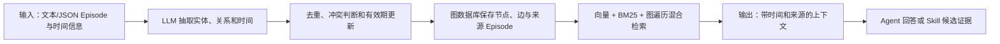

# Graphiti：带时间和来源追踪的上下文知识图谱

> **项目快照**：官方仓库 <https://github.com/getzep/graphiti>｜核验日期 2026-09-03｜Stars 约 30.5k｜许可证 Apache-2.0｜仓库在核验日有提交，最新 Release `mcp-v1.1.0` 发布于 2026-09-01。[^graphiti-repository][^graphiti-license][^graphiti-release]

> **需求画像**：目标是把项目业务知识、技术决策和开发经验保存为可追溯、可查询的共享 Memory，并支持知识随新会话增量更新。硬约束是单机自部署、模型 API 可切换、尽量适配多种 Agent；会话采集、用户上传确认和 Skill 评审可由外部组件负责。

## 1. 项目要解决什么问题

### 目标用户与使用场景

Graphiti 是构建和查询 Agent 上下文图谱的框架。它面向数据持续变化、需要查询当前状态和历史状态的 Agent 应用，例如将用户交互、企业数据和外部信息持续加入同一知识图谱。[^graphiti-repository]

对本项目而言，它可把“某版本 Skill 规定了什么”“某次会话确认了哪条业务规则”“后来哪条规则被替代”表示为实体、关系、时间窗口和来源 Episode。

### 当前问题

静态向量 RAG 主要保存文档片段，难以回答事实何时生效、何时被替换以及事实来自哪条原始记录。Graphiti 为事实保存有效时间，并保留产生该事实的原始 Episode。[^graphiti-repository]

批量重建不适合频繁变更的项目知识。Graphiti 支持增量写入，新 Episode 可以立即并入图谱，不要求全量重新计算。[^graphiti-repository]

### 问题边界

Graphiti 是图谱核心库和 MCP/REST 示例服务，不提供完整的团队会话采集、上传审批、权限后台、Skill PR 或业务事实审核流程。Zep 的托管 Context Graph 是商业产品，不能与 Graphiti 的自部署开源核心混为一谈。[^graphiti-zep-boundary]

## 2. 设计的核心思路

### 核心判断

Graphiti 用“实体 + 带有效期的事实关系 + 原始 Episode + 可选本体”代替单一文档向量库，使 Agent 可以同时按语义、关键词、图关系和时间查询上下文。[^graphiti-repository]

### Memory 实现方式

每次 `add_episode` 先在内存中构造或读取原始 `EpisodicNode`，完成抽取、去重和属性处理后再统一写入；批量 `add_episode_bulk` 则会在抽取前先保存 Episode 节点。边同时记录 `valid_at`、`invalid_at` 等时间状态。节点、边和 Episode 建立向量/全文索引，查询时融合语义、关键词、图遍历和重排；新事实通过失效旧边完成增量更新。[^graphiti-repository]

### 关键设计选择

- **时间事实管理**：旧事实不直接删除，而是失效并保留历史，支持“现在为真”和“某个时间点为真”的查询。[^graphiti-repository]
- **Episode 溯源**：每个派生节点或边都能回溯到产生它的原始数据，适合把记忆条目链接到会话证据。[^graphiti-repository]
- **增量图构建**：新数据实时整合，避免静态 GraphRAG 的批量重算。[^graphiti-repository]
- **混合检索**：语义 Embedding、BM25 和图遍历组合，减少仅依赖 LLM 摘要重排。[^graphiti-repository]
- **可规定也可学习的本体**：可用 Pydantic 预先定义实体/边类型，也可让结构随数据出现。[^graphiti-repository]

### 向量化与模型接口核验

Graphiti 的语义检索需要 Embedding；核心 `EmbedderConfig` 的默认维度来自 `EMBEDDING_DIM` 环境变量，未设置时为 1024。默认 OpenAI embedder 模型是 `text-embedding-3-small`，但核心代码只负责按配置截取/写入向量，不会替团队自动迁移已有索引。[^graphiti-embedder-client][^graphiti-openai-embedder]

官方实现提供 OpenAI、Azure OpenAI、Google Gemini 和 Voyage embedder；README 示例明确展示了 OpenAI-compatible/Ollama 的 `nomic-embed-text`，并把维度设为 768。向量实际存储在所选 Neo4j、FalkorDB、Neptune 等图后端的向量索引中，写入和查询必须使用同一维度。[^graphiti-repository][^graphiti-embedder-gemini][^graphiti-embedder-voyage]

公司 API 或 DeepSeek 只有在暴露 OpenAI-compatible `/v1/embeddings` 时才可作为 OpenAI embedder 的候选；DeepSeek 的常规聊天 API 不能推定提供 Embedding。中文场景应选择已验证的多语言模型，并在建库前固定模型与维度；Graphiti 官方未给出中文召回质量基线，需实测。改变维度还要同步图数据库索引配置，否则会出现向量长度不一致。[^graphiti-repository][^graphiti-embedder-client]

### 代价与取舍

每个关系的抽取、去重和时间判断依赖结构化输出能力较好的 LLM；图数据库和索引运维也比单纯向量库复杂。调研判断：Graphiti 的来源和时间模型特别适合团队知识，但需要在写入前设计项目、Skill、会话和成员的图模型，否则会形成难治理的“万能图”。

## 3. 项目如何工作

### 工作流概览

### 阶段说明

| 阶段 | 接收什么 | 做什么 | 产生的状态或产物 | 证据 |
| --- | --- | --- | --- | --- |
| Episode 接入 | 文本或结构化 JSON，以及 group/time 元数据 | 作为原始事实流写入 Graphiti | 原始 Episode | [^graphiti-repository] |
| 实体/关系抽取 | Episode 内容 | LLM 按本体或学习结构抽取节点、边、摘要和时间 | 待合并实体与事实 | [^graphiti-repository] |
| 增量合并 | 新事实与已有图 | 去重、建立关系、判定旧事实失效时间 | 当前图与历史有效期 | [^graphiti-repository] |
| 索引维护 | 节点、边和文本 | 生成向量并维护关键词索引、图结构 | 混合检索索引 | [^graphiti-repository] |
| 查询 | 自然语言查询、时间/分组过滤 | 组合语义、BM25 和图遍历并可按图距离重排 | 相关节点、边和 Episode | [^graphiti-quickstart] |
| 下游消费 | 查询结果和来源 | 注入 Agent 或形成 Skill 候选 | 有证据的上下文 | 调研判断 |

### 关键状态与产物

- **Entity 节点**：人、产品、政策、概念等对象及其随时间演化的摘要。[^graphiti-repository]
- **Fact/Relationship 边**：实体三元组及有效时间窗口；事实被替代时保留历史而改变当前有效性。[^graphiti-repository]
- **Episode**：原始输入数据，是派生事实的溯源锚点。对会话闭环，可把完整原始会话或其外部对象 ID 作为 Episode 元数据。[^graphiti-repository]
- **Ontology**：Pydantic 定义的实体/边类型或从数据中学习的结构，决定业务知识的可查询边界。[^graphiti-repository]

### 最终输出

调用方获得混合检索结果，可进一步读取节点、关系和来源 Episode。对 Skill 更新来说，结果可以回答“旧规则是什么、何时被哪个会话替代、证据在哪”，但候选 Markdown/代码修改和评审仍由外部系统生成。

### 源码实现核验：记忆抽取与持久化

> **核验口径**：以下不是对 README 的转述，而是对官方仓库 `getzep/graphiti` 在 `main` 分支提交 `547422865cca9fb5a82915c074d899428c145ff4`（2026-09-04 UTC）的静态源码核验；未安装、未运行。源码中没有明确支持的能力标为“未确认”，不能把接口字段自动等同于已持久化能力。[^graphiti-source-commit]

#### 1. Episode 写入链路

- **单条写入入口**是 `graphiti_core/graphiti.py` 的 `Graphiti.add_episode(...) -> AddEpisodeResults`。输入包括 `name`、`episode_body`、`source_description`、`reference_time`，以及 `source`、`group_id`、可选 UUID、实体/边本体、前序 Episode 和 saga 参数；返回 `episode`、`episodic_edges`、`nodes`、`edges`、`communities`、`community_edges`。函数实际先在内存中构造 `EpisodicNode`，再依次执行 `extract_nodes`、`resolve_extracted_nodes`、`_extract_and_resolve_edges`、节点属性抽取，最后进入 `_process_episode_data`。因此“单条 add_episode 先持久化原始 Episode，再抽取”并不成立；单条路径是在抽取/解析后统一写入。[^graphiti-source-graphiti]
- `EpisodicNode` 的核心字段是 `uuid`、`name`、`group_id`、`source`、`source_description`、`content`、`created_at`、`valid_at` 和 `entity_edges`。新建 Episode 的 `created_at` 取本次处理开始时的时间，通常早于最终图写入；传入已有 UUID 时沿用已读取对象的值。`valid_at` 来自调用方 `reference_time`。源码没有把 Episode 更新解释为版本化对象；同 UUID 的 `MERGE`/覆盖语义应按具体后端查询理解。[^graphiti-source-nodes][^graphiti-source-episode-query]
- `_process_episode_data` 调用 `build_episodic_edges`，为每个被保留的实体建立 `Episodic -[:MENTIONS]-> Entity` 边；同时把本次传入的实体边 UUID 列表写入 Episode 的 `entity_edges`。当 `store_raw_episode_content=False` 时，`content` 在保存前被清空。saga 的 `HAS_EPISODE`、`NEXT_EPISODE` 边是在这次核心批量写入之后另行保存，因此不应把 saga 关系视为与全部写入始终同一原子事务。[^graphiti-source-graphiti][^graphiti-source-edge-ops]
- **批量入口**是 `Graphiti.add_episode_bulk(bulk_episodes: list[RawEpisode], ...) -> AddBulkEpisodeResults`。`RawEpisode` 只有 `name`、可选 `uuid`、`content`、`source_description`、`source` 和 `reference_time`。批量路径会先通过 `add_nodes_and_edges_bulk` 保存 Episode 节点，再取上下文、抽取/去重实体和边，最后再次保存解析后的节点和边；所以后续 LLM 或解析失败时，前一阶段已写入的 Episode 可能保留。源码建议 Episode 按顺序追加并等待前一个完成，批量规模也需由调用方限流。[^graphiti-source-graphiti][^graphiti-source-bulk]
- `add_nodes_and_edges_bulk` 在默认驱动路径中打开 driver session，并用 `execute_write(add_nodes_and_edges_bulk_tx, ...)` 在一个写事务中提交 Episode、实体节点、`MENTIONS` 边和实体边；这只覆盖该次 bulk save，不覆盖抽取阶段，也不覆盖随后单独保存的 saga 关系。具体 `graph_operations_interface` 实现的事务细节未确认。[^graphiti-source-bulk]

#### 2. 实体与关系抽取

- 单条 `add_episode` 的默认代码路径是分离抽取：`graphiti_core/utils/maintenance/node_operations.py::extract_nodes(...) -> (list[EntityNode], node_episode_index_map)`，再由 `edge_operations.py::extract_edges(...) -> list[EntityEdge]` 生成关系。前序 Episode 只作为 LLM 上下文；节点抽取会生成节点名称、标签和空摘要，边抽取会校验端点名称、事实文本、自环和日期字段，并把 `episode_indices` 映射成 Episode UUID；`relation_type` 主要由结构化响应模型和提示词约束，当前函数未显式校验其是否属于允许的关系类型集合。[^graphiti-source-node-extract][^graphiti-source-edge-extract]
- `EntityEdge` 保存 `source_node_uuid`、`target_node_uuid`、关系 `name`、事实 `fact`、`episodes`、`reference_time` 及 `valid_at`、`invalid_at`、`expired_at`。边对象的 `created_at` 在抽取阶段设置，通常早于最终图写入；`reference_time` 默认取被归因 Episode 的 `valid_at`，不是事实生效时间本身。空事实、找不到端点以及解析为同一节点的自环会被丢弃。[^graphiti-source-edge-model][^graphiti-source-edge-extract]
- 另有 `combined_extraction.py::extract_nodes_and_edges(...)` 路径，一次 LLM 结构化输出同时得到实体和边，再用 `BatchEdgeTimestamps` 额外抽取时间；它会按边归因 Episode，并删除没有任何边连接的孤立节点。该函数是 bulk/组合抽取能力，不能据此断言单条 `add_episode` 默认总是单次联合抽取。批量时间返回数量不匹配或时间解析失败时，源码记录 warning/debug，仍可能返回没有完整时间字段的边。[^graphiti-source-combined]

#### 3. 去重、冲突和失效

- **节点去重**：`resolve_extracted_nodes(...)` 先为节点名称生成 Embedding，在同一 `group_id` 内最多取 15 个候选，余弦阈值常量为 `0.6`；随后用 `dedup_helpers.py` 的规范化名称、候选索引和相似度逻辑确定可直接解析的节点，未解决的节点交给一次 `NodeResolutions` LLM 结构化判断。输出是“解析后的节点列表、抽取 UUID 到规范 UUID 的映射、重复节点对”，函数本身不写数据库。规范节点主要复用已有 UUID；源码可做标签提升，但没有在此处合并任意属性、摘要或时间字段。[^graphiti-source-node-resolve][^graphiti-source-dedup]
- **边去重**：`resolve_extracted_edges(...)` 先按“源 UUID、目标 UUID、规范化 fact”对本批边保留首个条目，再查同端点已有边和更宽的失效候选。`resolve_extracted_edge(...)` 对完全相同端点和 fact 走无 LLM 快速复用路径；非精确匹配时调用 `dedupe_edges.resolve_edge`，其 `EdgeDuplicate` 输出 `duplicate_facts`（只能指向同端点候选）和 `contradicted_facts`（可指向两类候选）。输出三元组分别是解析边、被失效边和本次新边。LLM 返回越界索引时只记录 warning 并忽略，不会自动修复判断。[^graphiti-source-edge-resolve][^graphiti-source-dedupe-edge]
- **冲突失效不是删除**：当新事实的 `valid_at` 晚于候选事实且时间区间没有被既有 `invalid_at` 保护时，`resolve_edge_contradictions` 把旧边的 `invalid_at` 设为新事实的 `valid_at`，并把 `expired_at` 设为当前时间；如果候选的 `valid_at` 晚于新边，新边也可能被立即标记 `invalid_at`/`expired_at`。对进入完整解析路径、且被作为当前 `resolved_edge` 处理的边，已有 `invalid_at` 而没有 `expired_at` 时会尝试补当前时间；完全重复边的快速复用路径会直接返回，因此不能保证所有边都被补值。这些只是内存对象的状态更新，随后随 `resolved_edges + invalidated_edges` 一起保存。[^graphiti-source-edge-resolve]
- 因而 Graphiti 的“冲突解决”是**面向事实边、依赖 LLM 分类和时间比较的增量失效**，不是数据库唯一约束，也不是对任意属性的通用合并。相同端点、不同事实的边是否构成矛盾取决于 LLM 的结构化判断和可用候选集；该判断质量、候选召回和时间抽取失败都是限制。[^graphiti-source-edge-resolve][^graphiti-source-dedupe-edge]

#### 4. 时间字段和来源持久化的真实边界

| 对象 | 源码字段/写入位置 | 真实含义 | 核验限制 |
| --- | --- | --- | --- |
| `EpisodicNode` | `created_at`、`valid_at` | 对象构造/处理开始时间（通常早于最终持久化）、原始事件/文档参考时间 | 没有自动推断更精细的事件时间 |
| `EntityEdge` | `created_at`、`reference_time`、`valid_at`、`invalid_at`、`expired_at` | 边对象抽取时间（通常早于最终持久化）、来源 Episode 的参考时间、事实生效/失效时间、图中执行失效的时间 | 时间抽取是 LLM 辅助且可失败；字段为空并不等于事实永远有效 |
| Episode 来源 | `source`、`source_description`、`name`、`content`、`group_id`、`entity_edges`，以及 `MENTIONS` 边 | 保留来源类型/文字描述、原始正文（可配置关闭）、分组和派生边关联 | 没有核心字段保证外部文件 ID、提交者、权限、不可变对象版本或原始存储地址 |

`EpisodicNode` 模型虽然声明了 `episode_metadata`（客户自定义过滤元数据），但默认 `EpisodicNode.save()` 的 `episode_args`、Episode 保存查询模板和返回投影均未包含该字段；通过 `graph_operations_interface` 的替代实现是否持久化它，当前源码未确认。因此不能把该字段当成默认后端可用的来源索引。[^graphiti-source-nodes][^graphiti-source-episode-query]

#### 5. Embedding、全文和图检索

- **Embedding 写入**：`add_nodes_and_edges_bulk_tx` 在 `EntityNode.name_embedding` 或 `EntityEdge.fact_embedding` 为空时，分别调用 `EntityNode.generate_name_embedding` 和 `EntityEdge.generate_embedding`；Episode 本身没有 Embedding 字段。向量字段分别是节点名称和边事实，后端维度由配置的 Embedder 决定。[^graphiti-source-bulk][^graphiti-source-nodes][^graphiti-source-edge-model]
- **全文索引**：`graph_queries.py::get_fulltext_indices` 为 Episode 建 `content/source/source_description/group_id` 索引，为实体建 `name/summary/group_id` 索引，为关系建 `name/fact/group_id` 索引；Neo4j 使用 `episode_content`、`node_name_and_summary`、`edge_name_and_fact` 等索引名，其他后端由各自查询语法实现。源码事实是后端全文检索索引，不应把“BM25”理解成 Graphiti 自己实现的一套独立评分器。[^graphiti-source-queries]
- **高层搜索**：`search(...) -> SearchResults` 接收 query、group IDs、`SearchConfig`、`SearchFilters`，可并行返回 `edges`、`nodes`、`episodes`、`communities` 及对应分数。实体/边按配置组合全文、余弦相似度和 BFS 图遍历，并可使用 RRF、MMR、cross-encoder 或中心节点距离重排；Neo4j 的 BFS 沿 `RELATES_TO`/`MENTIONS` 路径扩展。Episode 搜索当前实现调用 `episode_fulltext_search`，不提供 Episode 余弦或 BFS 检索路径。[^graphiti-source-search][^graphiti-source-neo4j-search]
- **过滤限制**：`group_ids` 会进入检索；边的 `SearchFilters` 支持 `valid_at`、`invalid_at`、`created_at`、`expired_at` 等时间谓词，节点检索当前主要处理 `node_labels`。Episode 全文检索在当前 concrete 实现中忽略 `search_filter`，因此不会应用这些时间谓词。空 query 直接返回空 `SearchResults`；仅在实体、边或社区配置需要余弦相似度或 MMR 时才为 query 调用 Embedder。[^graphiti-source-search][^graphiti-source-filters]

#### 6. 源码核验后的结论

Graphiti 的持久化事实可以具体落到三层：`EpisodicNode` 保存原始输入及其时间/来源描述，`EntityNode` 保存抽取实体与名称向量，`EntityEdge` 保存带 Episode UUID 的事实、事实向量和时间状态；`MENTIONS` 边把 Episode 连到实体，边上的 `episodes` 列表把事实反向关联到来源 Episode。真正的原始来源治理仍在 Graphiti 之外：默认实现没有把外部会话对象、成员身份、授权记录和不可变附件存成一套独立审计模型。

源码同时给出三个不能忽略的限制：一是单条写入的完整操作不是一个可证明的端到端事务，批量路径还会在抽取前先保存 Episode；二是节点/边去重和边冲突分类依赖候选召回、Embedding 和结构化 LLM 输出；三是 Episode 只有全文检索路径，时间字段虽被保存并可用于部分边/节点过滤，但“按任意时点重建完整上下文”仍需调用方组合查询和验证。[^graphiti-source-commit][^graphiti-source-bulk][^graphiti-source-search]

## 4. 与需求画像逐项对照

### 需求矩阵

| 需求项 | 优先级或硬约束 | 项目现有能力 | 证据 | 状态 | 说明 |
| --- | --- | --- | --- | --- | --- |
| 项目业务知识长期保存 | 必须 | 时间上下文图谱和增量写入 | [^graphiti-repository] | 满足 | 需自行设计实体、关系和分组 |
| 技术决策和经验可检索 | 必须 | 关系、时间有效期、混合检索 | [^graphiti-repository] | 满足 | 事实抽取质量与本体设计决定效果 |
| 完整开发会话接收 | 必须 | Episode 可接收文本/JSON | [^graphiti-quickstart] | 部分满足 | 不提供 Claude Code 等本地会话扫描和人工上传流程 |
| 证据来源和历史 | 必须 | Episode provenance + 时间窗口 | [^graphiti-repository] | 满足 | 原始会话本体需外部存储/权限系统 |
| 多 Agent 接入 | 必须 | MCP Server、FastAPI、Python API | [^graphiti-mcp] | 部分满足 | 其他 Agent 需 MCP/REST 或 SDK 适配 |
| 模型 API 可切换 | 必须 | OpenAI、Anthropic、Gemini、Groq、OpenAI-compatible | [^graphiti-repository] | 满足 | DeepSeek/公司 API 走 OpenAI-compatible，需验证结构化输出 |
| 单机自部署 | 必须 | Python 库 + Neo4j/FalkorDB Docker Compose | [^graphiti-repository] | 满足 | 图数据库是额外常驻依赖 |
| 用户主动控制原始会话上传 | 期望 | Graphiti 只处理调用方提交的 Episode | [^graphiti-repository] | 部分满足 | 选择/确认逻辑需外部实现 |
| Skill 候选人工发布 | 必须 | provenance 可作为证据层 | [^graphiti-repository] | 部分满足 | 无内置候选、Git PR 和回归验证 |

### 对照归纳

Graphiti 在“共享业务知识、技术决策、经验的时间变化和来源追踪”上匹配度高。它的主要补齐项不是记忆模型，而是把本地会话变成可授权 Episode，并围绕查询结果建立 Skill 变更治理。

## 5. 开源与能力边界

### 边界清单

| 能力 | 开源核心 | 商业版或 SaaS | 外部依赖 | 证据 |
| --- | --- | --- | --- | --- |
| Graphiti 核心框架 | 有，Apache-2.0 | Zep Context Graph 提供托管服务 | Python、图数据库、模型/Embedding | [^graphiti-license][^graphiti-repository] |
| 时间图、Episode、混合检索 | 有 | Zep 提供生产托管、治理和低延迟服务 | Neo4j/FalkorDB/Neptune 之一 | [^graphiti-repository][^graphiti-zep-boundary] |
| MCP Server | 仓库提供实现 | 无需等价购买 SaaS | MCP 客户端、Graphiti 后端 | [^graphiti-mcp] |
| REST API Server | 仓库 `server` 目录提供 FastAPI 服务 | 无 | FastAPI、图数据库、模型 | [^graphiti-server] |
| 企业权限、Dashboard、SLA | 未确认/需自建 | Zep Cloud 提供 | 身份、网关、审计系统 | [^graphiti-zep-boundary] |

### 边界判断

官方明确区分：Graphiti 是自托管框架，Zep 是管理 Context Graph 的商业基础设施；Graphiti 需要自带第三方图数据库、用户/会话管理和开发者工具。[^graphiti-zep-boundary]

Graphiti 的匿名遥测默认启用但可用 `GRAPHITI_TELEMETRY_ENABLED=false` 关闭；公司内网部署应把该配置和出网策略纳入上线检查。[^graphiti-telemetry]

## 6. 用户如何接入和使用

### 接入前提

- Python 3.10+、Graphiti Core 和一个图后端：Neo4j 5.26、FalkorDB 1.1.2 或 Neptune；Kuzu 已标记为弃用。[^graphiti-repository]
- 支持结构化输出的 LLM 和 Embedding；OpenAI-compatible Base URL 可接 DeepSeek、公司服务或本地 Ollama/vLLM，但要确认 JSON Schema 兼容性。[^graphiti-repository]
- 设计项目/成员/Agent/Skill/会话的 `group_id`、实体类型和权限映射。

### 最快验证路径

1. 用 Docker Compose 启动 Neo4j 或 FalkorDB，安装 `graphiti-core` 及对应 extra，并初始化索引/约束。[^graphiti-repository][^graphiti-quickstart]
2. 将经用户授权的会话摘要、完整会话或结构化决策包装成 Episode，调用 `add_episode` 写入图谱；保留原始文件 ID、Skill 版本和分支元数据。[^graphiti-quickstart]
3. 以自然语言、时间和分组过滤查询，再通过 MCP/REST 给 Agent 使用；把带来源结果交给候选生成器和 Git 评审流。

### 日常使用方式

开发会话结束后追加 Episode；新业务规则会更新实体和事实有效期。Agent 查询“当前约束”或“某次变更前的约束”，同时获得来源 Episode，便于人工复核。

### 接入限制

图模型、权限和 Episode 规模需要项目自行设计；Graphiti 不提供成员管理、原始会话对象存储或脱敏策略。OpenAI-compatible 模型若不可靠支持结构化输出，可能导致抽取/去重失败。[^graphiti-repository]

## 7. 部署构成

### 运行组件

| 组件 | 必需或可选 | 职责 | 持久化数据 | 与其他组件的关系 | 证据 |
| --- | --- | --- | --- | --- | --- |
| Graphiti Core | 必需 | Episode 写入、抽取、图更新、检索 | 主要持久化在图后端 | 调用模型并访问图数据库 | [^graphiti-repository] |
| Neo4j 或 FalkorDB | 必需（选一） | 节点、边、Episode 和索引存储 | 图数据、索引、约束 | 被 Graphiti/MCP/REST 访问 | [^graphiti-repository] |
| LLM API | 必需 | 实体/关系/时间抽取和去重 | 通常外部 | Graphiti 调用 | [^graphiti-repository] |
| Embedding/关键词索引 | 必需的检索部分 | 语义和 BM25 检索 | 向量/索引 | 由图后端或 Graphiti 维护 | [^graphiti-repository] |
| MCP Server | 可选 | 给 MCP Agent 提供 Episode、实体和搜索工具 | 无独立核心数据 | 访问 Graphiti 图后端 | [^graphiti-mcp] |
| FastAPI REST Server | 可选 | HTTP 接入层 | 依后端 | 被外部采集器/Agent 调用 | [^graphiti-server] |
| 遥测 | 可选（可关闭） | 发送匿名配置统计 | 本地匿名 ID | PostHog 出网 | [^graphiti-telemetry] |

### 最小部署路径

最小自部署路径是单机运行 Graphiti Python 服务与 Neo4j/FalkorDB，配置模型 API，执行 quickstart 建索引、写 Episode、查询；若 Agent 支持 MCP，可再启动仓库内 MCP Server。官方提供 Neo4j 默认 Compose 和 FalkorDB profile。[^graphiti-repository]

### 生产化仍需考虑

- 图数据库备份、索引重建、用户/项目隔离、TLS、鉴权和原始 Episode 的保留/删除策略。
- 外部模型调用的数据边界、结构化输出稳定性及限流；官方未给出本项目场景的最低 CPU、内存或吞吐要求，需实测。
- 关闭遥测并审查所有 MCP/REST 出口，避免把会话内容写入不受控的图分组。

## 8. 适配结论与能力缺口

### 适配结论

**条件匹配。** Graphiti 对业务知识和技术经验的时间、关系、来源表达非常契合，且模型和图后端可替换、支持单机部署；但原始会话采集、权限、团队运营和 Skill 发布闭环必须自建。

### 已满足能力

- Episode provenance、时间有效期、增量更新和混合检索。[^graphiti-repository]
- Neo4j/FalkorDB 等可自托管后端与 Docker Compose 入口。[^graphiti-repository]
- MCP、REST、Python API 可作为多 Agent 接入面。[^graphiti-mcp][^graphiti-server]
- OpenAI-compatible 端点可接 DeepSeek、公司 API 和本地模型，但需验证结构化输出。[^graphiti-repository]

### 能力缺口

- **会话采集与授权**：需要各 Agent 本地 Hook/解析器和用户确认机制。
- **原始证据存储**：Graphiti 的 Episode 适合索引和溯源，不替代原始会话对象存储、加密和细粒度权限。
- **Skill 治理**：需将图谱查询结果变成有范围、版本和验证任务的 Skill 候选。
- **运维与权限**：图数据库备份、租户隔离和审计不由核心框架完整提供。

### 需要自研或外部补齐

- 多 Agent 会话归一化、原始文件对象存储和授权上传服务。
- 项目/成员/Skill/会话图本体及访问策略。
- 候选生成、Git PR、回归测试和事实冲突人工审核。

### 否决风险

当前未发现硬性否决项；若团队无法运维 Neo4j/FalkorDB 或不愿自建权限/采集层，则 Graphiti 的图模型优势会被部署和治理成本抵消。

---

[^graphiti-repository]: [Graphiti 官方 GitHub 仓库与 README](https://github.com/getzep/graphiti)
[^graphiti-license]: [Graphiti Apache-2.0 许可证](https://github.com/getzep/graphiti/blob/main/LICENSE)
[^graphiti-release]: [Graphiti Releases](https://github.com/getzep/graphiti/releases)
[^graphiti-quickstart]: [Graphiti Quick Start](https://help.getzep.com/graphiti/graphiti/quick-start)
[^graphiti-mcp]: [Graphiti MCP Server README](https://github.com/getzep/graphiti/tree/main/mcp_server)
[^graphiti-server]: [Graphiti FastAPI Server README](https://github.com/getzep/graphiti/tree/main/server)
[^graphiti-zep-boundary]: [Graphiti README 中 Graphiti 与 Zep 的边界](https://github.com/getzep/graphiti#graphiti-and-zep)
[^graphiti-telemetry]: [Graphiti Telemetry 说明](https://github.com/getzep/graphiti#telemetry)
[^graphiti-embedder-client]: [Graphiti EmbedderConfig：EMBEDDING_DIM 默认值](https://github.com/getzep/graphiti/blob/main/graphiti_core/embedder/client.py)
[^graphiti-openai-embedder]: [Graphiti OpenAI Embedder：默认模型与 Base URL](https://github.com/getzep/graphiti/blob/main/graphiti_core/embedder/openai.py)
[^graphiti-embedder-gemini]: [Graphiti Gemini Embedder：模型与输出维度配置](https://github.com/getzep/graphiti/blob/main/graphiti_core/embedder/gemini.py)
[^graphiti-embedder-voyage]: [Graphiti Voyage Embedder：模型配置](https://github.com/getzep/graphiti/blob/main/graphiti_core/embedder/voyage.py)
[^graphiti-source-commit]: [Graphiti 官方源码核验提交 `547422865cca9fb5a82915c074d899428c145ff4`](https://github.com/getzep/graphiti/commit/547422865cca9fb5a82915c074d899428c145ff4)
[^graphiti-source-graphiti]: [`graphiti_core/graphiti.py`：`add_episode`、`add_episode_bulk`、`_process_episode_data`](https://github.com/getzep/graphiti/blob/547422865cca9fb5a82915c074d899428c145ff4/graphiti_core/graphiti.py#L680-L1482)
[^graphiti-source-nodes]: [`graphiti_core/nodes.py`：`EpisodicNode`、`EntityNode` 及保存/Embedding](https://github.com/getzep/graphiti/blob/547422865cca9fb5a82915c074d899428c145ff4/graphiti_core/nodes.py#L318-L560)
[^graphiti-source-edge-model]: [`graphiti_core/edges.py`：`EntityEdge` 字段、保存和事实 Embedding](https://github.com/getzep/graphiti/blob/547422865cca9fb5a82915c074d899428c145ff4/graphiti_core/edges.py#L263-L359)
[^graphiti-source-episode-query]: [`graphiti_core/models/nodes/node_db_queries.py`：Episode 保存查询与返回投影](https://github.com/getzep/graphiti/blob/547422865cca9fb5a82915c074d899428c145ff4/graphiti_core/models/nodes/node_db_queries.py#L30-L121)
[^graphiti-source-bulk]: [`graphiti_core/utils/bulk_utils.py`：事务批量写入、RawEpisode 和批量去重](https://github.com/getzep/graphiti/blob/547422865cca9fb5a82915c074d899428c145ff4/graphiti_core/utils/bulk_utils.py)
[^graphiti-source-node-extract]: [`graphiti_core/utils/maintenance/node_operations.py`：`extract_nodes`](https://github.com/getzep/graphiti/blob/547422865cca9fb5a82915c074d899428c145ff4/graphiti_core/utils/maintenance/node_operations.py#L70-L333)
[^graphiti-source-edge-extract]: [`graphiti_core/utils/maintenance/edge_operations.py`：`extract_edges`](https://github.com/getzep/graphiti/blob/547422865cca9fb5a82915c074d899428c145ff4/graphiti_core/utils/maintenance/edge_operations.py#L117-L322)
[^graphiti-source-edge-ops]: [`graphiti_core/utils/maintenance/edge_operations.py`：Episode provenance、边解析与时间失效](https://github.com/getzep/graphiti/blob/547422865cca9fb5a82915c074d899428c145ff4/graphiti_core/utils/maintenance/edge_operations.py#L52-L847)
[^graphiti-source-node-resolve]: [`graphiti_core/utils/maintenance/node_operations.py`：`resolve_extracted_nodes`](https://github.com/getzep/graphiti/blob/547422865cca9fb5a82915c074d899428c145ff4/graphiti_core/utils/maintenance/node_operations.py#L627-L707)
[^graphiti-source-dedup]: [`graphiti_core/utils/maintenance/dedup_helpers.py`：规范化、相似度候选和解析状态](https://github.com/getzep/graphiti/blob/547422865cca9fb5a82915c074d899428c145ff4/graphiti_core/utils/maintenance/dedup_helpers.py)
[^graphiti-source-edge-resolve]: [`graphiti_core/utils/maintenance/edge_operations.py`：`resolve_extracted_edges`、`resolve_extracted_edge` 和冲突失效](https://github.com/getzep/graphiti/blob/547422865cca9fb5a82915c074d899428c145ff4/graphiti_core/utils/maintenance/edge_operations.py#L325-L847)
[^graphiti-source-dedupe-edge]: [`graphiti_core/prompts/dedupe_edges.py`：`EdgeDuplicate` 结构化输出约束](https://github.com/getzep/graphiti/blob/547422865cca9fb5a82915c074d899428c145ff4/graphiti_core/prompts/dedupe_edges.py)
[^graphiti-source-combined]: [`graphiti_core/utils/maintenance/combined_extraction.py`：联合抽取和批量时间解析](https://github.com/getzep/graphiti/blob/547422865cca9fb5a82915c074d899428c145ff4/graphiti_core/utils/maintenance/combined_extraction.py#L41-L313)
[^graphiti-source-search]: [`graphiti_core/search/search.py`：高层搜索、混合召回和 Episode 搜索](https://github.com/getzep/graphiti/blob/547422865cca9fb5a82915c074d899428c145ff4/graphiti_core/search/search.py#L98-L761)
[^graphiti-source-neo4j-search]: [`graphiti_core/driver/neo4j/operations/search_ops.py`：Neo4j 全文、向量和 BFS 查询](https://github.com/getzep/graphiti/blob/547422865cca9fb5a82915c074d899428c145ff4/graphiti_core/driver/neo4j/operations/search_ops.py)
[^graphiti-source-queries]: [`graphiti_core/graph_queries.py`：范围索引、全文索引和余弦相似度表达式](https://github.com/getzep/graphiti/blob/547422865cca9fb5a82915c074d899428c145ff4/graphiti_core/graph_queries.py#L28-L179)
[^graphiti-source-filters]: [`graphiti_core/search/search_filters.py`：时间和边/节点过滤字段](https://github.com/getzep/graphiti/blob/547422865cca9fb5a82915c074d899428c145ff4/graphiti_core/search/search_filters.py)
