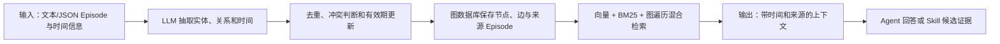

# Graphiti：带时间和来源追踪的上下文知识图谱

> **项目快照**：官方仓库 <https://github.com/getzep/graphiti>｜核验日期 2026-09-03｜Stars 约 30.5k｜许可证 Apache-2.0｜仓库在核验日有提交，最新 Release `mcp-v1.1.0` 发布于 2026-09-01。[^graphiti-repository][^graphiti-license][^graphiti-release]

> **需求画像**：目标是把项目业务知识、技术决策和开发经验保存为可追溯、可查询的共享 Memory，并支持知识随新会话增量更新。硬约束是单机自部署、模型 API 可切换、尽量适配多种 Agent；会话采集、用户上传确认和 Skill 评审可由外部组件负责。

## 1. 项目要解决什么问题

### 目标用户与使用场景

Graphiti 是构建和查询 Agent 上下文图谱的框架。它面向数据持续变化、需要查询当前状态和历史状态的 Agent 应用，例如将用户交互、企业数据和外部信息持续加入同一知识图谱。[^graphiti-repository]

对本项目而言，它可把“某版本 Skill 规定了什么”“某次会话确认了哪条业务规则”“后来哪条规则被替代”表示为实体、关系、时间窗口和来源 Episode。

### 当前问题

静态向量 RAG 主要保存文档片段，难以回答事实何时生效、何时被替换以及事实来自哪条原始记录。Graphiti 为事实保存有效时间，并保留产生该事实的原始 Episode。[^graphiti-repository]

批量重建不适合频繁变更的项目知识。Graphiti 支持增量写入，新 Episode 可以立即并入图谱，不要求全量重新计算。[^graphiti-repository]

### 问题边界

Graphiti 是图谱核心库和 MCP/REST 示例服务，不提供完整的团队会话采集、上传审批、权限后台、Skill PR 或业务事实审核流程。Zep 的托管 Context Graph 是商业产品，不能与 Graphiti 的自部署开源核心混为一谈。[^graphiti-zep-boundary]

## 2. 设计的核心思路

### 核心判断

Graphiti 用“实体 + 带有效期的事实关系 + 原始 Episode + 可选本体”代替单一文档向量库，使 Agent 可以同时按语义、关键词、图关系和时间查询上下文。[^graphiti-repository]

### 关键设计选择

- **时间事实管理**：旧事实不直接删除，而是失效并保留历史，支持“现在为真”和“某个时间点为真”的查询。[^graphiti-repository]
- **Episode 溯源**：每个派生节点或边都能回溯到产生它的原始数据，适合把记忆条目链接到会话证据。[^graphiti-repository]
- **增量图构建**：新数据实时整合，避免静态 GraphRAG 的批量重算。[^graphiti-repository]
- **混合检索**：语义 Embedding、BM25 和图遍历组合，减少仅依赖 LLM 摘要重排。[^graphiti-repository]
- **可规定也可学习的本体**：可用 Pydantic 预先定义实体/边类型，也可让结构随数据出现。[^graphiti-repository]

### 向量化与模型接口核验

Graphiti 的语义检索需要 Embedding；核心 `EmbedderConfig` 的默认维度来自 `EMBEDDING_DIM` 环境变量，未设置时为 1024。默认 OpenAI embedder 模型是 `text-embedding-3-small`，但核心代码只负责按配置截取/写入向量，不会替团队自动迁移已有索引。[^graphiti-embedder-client][^graphiti-openai-embedder]

官方实现提供 OpenAI、Azure OpenAI、Google Gemini 和 Voyage embedder；README 示例明确展示了 OpenAI-compatible/Ollama 的 `nomic-embed-text`，并把维度设为 768。向量实际存储在所选 Neo4j、FalkorDB、Neptune 等图后端的向量索引中，写入和查询必须使用同一维度。[^graphiti-repository][^graphiti-embedder-gemini][^graphiti-embedder-voyage]

公司 API 或 DeepSeek 只有在暴露 OpenAI-compatible `/v1/embeddings` 时才可作为 OpenAI embedder 的候选；DeepSeek 的常规聊天 API 不能推定提供 Embedding。中文场景应选择已验证的多语言模型，并在建库前固定模型与维度；Graphiti 官方未给出中文召回质量基线，需实测。改变维度还要同步图数据库索引配置，否则会出现向量长度不一致。[^graphiti-repository][^graphiti-embedder-client]

### 代价与取舍

每个关系的抽取、去重和时间判断依赖结构化输出能力较好的 LLM；图数据库和索引运维也比单纯向量库复杂。调研判断：Graphiti 的来源和时间模型特别适合团队知识，但需要在写入前设计项目、Skill、会话和成员的图模型，否则会形成难治理的“万能图”。

## 3. 项目如何工作

### 工作流概览

### 阶段说明

| 阶段 | 接收什么 | 做什么 | 产生的状态或产物 | 证据 |
| --- | --- | --- | --- | --- |
| Episode 接入 | 文本或结构化 JSON，以及 group/time 元数据 | 作为原始事实流写入 Graphiti | 原始 Episode | [^graphiti-repository] |
| 实体/关系抽取 | Episode 内容 | LLM 按本体或学习结构抽取节点、边、摘要和时间 | 待合并实体与事实 | [^graphiti-repository] |
| 增量合并 | 新事实与已有图 | 去重、建立关系、判定旧事实失效时间 | 当前图与历史有效期 | [^graphiti-repository] |
| 索引维护 | 节点、边和文本 | 生成向量并维护关键词索引、图结构 | 混合检索索引 | [^graphiti-repository] |
| 查询 | 自然语言查询、时间/分组过滤 | 组合语义、BM25 和图遍历并可按图距离重排 | 相关节点、边和 Episode | [^graphiti-quickstart] |
| 下游消费 | 查询结果和来源 | 注入 Agent 或形成 Skill 候选 | 有证据的上下文 | 调研判断 |

### 关键状态与产物

- **Entity 节点**：人、产品、政策、概念等对象及其随时间演化的摘要。[^graphiti-repository]
- **Fact/Relationship 边**：实体三元组及有效时间窗口；事实被替代时保留历史而改变当前有效性。[^graphiti-repository]
- **Episode**：原始输入数据，是派生事实的溯源锚点。对会话闭环，可把完整原始会话或其外部对象 ID 作为 Episode 元数据。[^graphiti-repository]
- **Ontology**：Pydantic 定义的实体/边类型或从数据中学习的结构，决定业务知识的可查询边界。[^graphiti-repository]

### 最终输出

调用方获得混合检索结果，可进一步读取节点、关系和来源 Episode。对 Skill 更新来说，结果可以回答“旧规则是什么、何时被哪个会话替代、证据在哪”，但候选 Markdown/代码修改和评审仍由外部系统生成。

## 4. 与需求画像逐项对照

### 需求矩阵

| 需求项 | 优先级或硬约束 | 项目现有能力 | 证据 | 状态 | 说明 |
| --- | --- | --- | --- | --- | --- |
| 项目业务知识长期保存 | 必须 | 时间上下文图谱和增量写入 | [^graphiti-repository] | 满足 | 需自行设计实体、关系和分组 |
| 技术决策和经验可检索 | 必须 | 关系、时间有效期、混合检索 | [^graphiti-repository] | 满足 | 事实抽取质量与本体设计决定效果 |
| 完整开发会话接收 | 必须 | Episode 可接收文本/JSON | [^graphiti-quickstart] | 部分满足 | 不提供 Claude Code 等本地会话扫描和人工上传流程 |
| 证据来源和历史 | 必须 | Episode provenance + 时间窗口 | [^graphiti-repository] | 满足 | 原始会话本体需外部存储/权限系统 |
| 多 Agent 接入 | 必须 | MCP Server、FastAPI、Python API | [^graphiti-mcp] | 部分满足 | 其他 Agent 需 MCP/REST 或 SDK 适配 |
| 模型 API 可切换 | 必须 | OpenAI、Anthropic、Gemini、Groq、OpenAI-compatible | [^graphiti-repository] | 满足 | DeepSeek/公司 API 走 OpenAI-compatible，需验证结构化输出 |
| 单机自部署 | 必须 | Python 库 + Neo4j/FalkorDB Docker Compose | [^graphiti-repository] | 满足 | 图数据库是额外常驻依赖 |
| 用户主动控制原始会话上传 | 期望 | Graphiti 只处理调用方提交的 Episode | [^graphiti-repository] | 部分满足 | 选择/确认逻辑需外部实现 |
| Skill 候选人工发布 | 必须 | provenance 可作为证据层 | [^graphiti-repository] | 部分满足 | 无内置候选、Git PR 和回归验证 |

### 对照归纳

Graphiti 在“共享业务知识、技术决策、经验的时间变化和来源追踪”上匹配度高。它的主要补齐项不是记忆模型，而是把本地会话变成可授权 Episode，并围绕查询结果建立 Skill 变更治理。

## 5. 开源与能力边界

### 边界清单

| 能力 | 开源核心 | 商业版或 SaaS | 外部依赖 | 证据 |
| --- | --- | --- | --- | --- |
| Graphiti 核心框架 | 有，Apache-2.0 | Zep Context Graph 提供托管服务 | Python、图数据库、模型/Embedding | [^graphiti-license][^graphiti-repository] |
| 时间图、Episode、混合检索 | 有 | Zep 提供生产托管、治理和低延迟服务 | Neo4j/FalkorDB/Neptune 之一 | [^graphiti-repository][^graphiti-zep-boundary] |
| MCP Server | 仓库提供实现 | 无需等价购买 SaaS | MCP 客户端、Graphiti 后端 | [^graphiti-mcp] |
| REST API Server | 仓库 `server` 目录提供 FastAPI 服务 | 无 | FastAPI、图数据库、模型 | [^graphiti-server] |
| 企业权限、Dashboard、SLA | 未确认/需自建 | Zep Cloud 提供 | 身份、网关、审计系统 | [^graphiti-zep-boundary] |

### 边界判断

官方明确区分：Graphiti 是自托管框架，Zep 是管理 Context Graph 的商业基础设施；Graphiti 需要自带第三方图数据库、用户/会话管理和开发者工具。[^graphiti-zep-boundary]

Graphiti 的匿名遥测默认启用但可用 `GRAPHITI_TELEMETRY_ENABLED=false` 关闭；公司内网部署应把该配置和出网策略纳入上线检查。[^graphiti-telemetry]

## 6. 用户如何接入和使用

### 接入前提

- Python 3.10+、Graphiti Core 和一个图后端：Neo4j 5.26、FalkorDB 1.1.2 或 Neptune；Kuzu 已标记为弃用。[^graphiti-repository]
- 支持结构化输出的 LLM 和 Embedding；OpenAI-compatible Base URL 可接 DeepSeek、公司服务或本地 Ollama/vLLM，但要确认 JSON Schema 兼容性。[^graphiti-repository]
- 设计项目/成员/Agent/Skill/会话的 `group_id`、实体类型和权限映射。

### 接入过程

1. 用 Docker Compose 启动 Neo4j 或 FalkorDB，安装 `graphiti-core` 及对应 extra，并初始化索引/约束。[^graphiti-repository][^graphiti-quickstart]
2. 将经用户授权的会话摘要、完整会话或结构化决策包装成 Episode，调用 `add_episode` 写入图谱；保留原始文件 ID、Skill 版本和分支元数据。[^graphiti-quickstart]
3. 以自然语言、时间和分组过滤查询，再通过 MCP/REST 给 Agent 使用；把带来源结果交给候选生成器和 Git 评审流。

### 日常使用方式

开发会话结束后追加 Episode；新业务规则会更新实体和事实有效期。Agent 查询“当前约束”或“某次变更前的约束”，同时获得来源 Episode，便于人工复核。

### 接入限制

图模型、权限和 Episode 规模需要项目自行设计；Graphiti 不提供成员管理、原始会话对象存储或脱敏策略。OpenAI-compatible 模型若不可靠支持结构化输出，可能导致抽取/去重失败。[^graphiti-repository]

## 7. 部署构成

### 运行组件

| 组件 | 必需或可选 | 职责 | 持久化数据 | 与其他组件的关系 | 证据 |
| --- | --- | --- | --- | --- | --- |
| Graphiti Core | 必需 | Episode 写入、抽取、图更新、检索 | 主要持久化在图后端 | 调用模型并访问图数据库 | [^graphiti-repository] |
| Neo4j 或 FalkorDB | 必需（选一） | 节点、边、Episode 和索引存储 | 图数据、索引、约束 | 被 Graphiti/MCP/REST 访问 | [^graphiti-repository] |
| LLM API | 必需 | 实体/关系/时间抽取和去重 | 通常外部 | Graphiti 调用 | [^graphiti-repository] |
| Embedding/关键词索引 | 必需的检索部分 | 语义和 BM25 检索 | 向量/索引 | 由图后端或 Graphiti 维护 | [^graphiti-repository] |
| MCP Server | 可选 | 给 MCP Agent 提供 Episode、实体和搜索工具 | 无独立核心数据 | 访问 Graphiti 图后端 | [^graphiti-mcp] |
| FastAPI REST Server | 可选 | HTTP 接入层 | 依后端 | 被外部采集器/Agent 调用 | [^graphiti-server] |
| 遥测 | 可选（可关闭） | 发送匿名配置统计 | 本地匿名 ID | PostHog 出网 | [^graphiti-telemetry] |

### 最小部署路径

最小自部署路径是单机运行 Graphiti Python 服务与 Neo4j/FalkorDB，配置模型 API，执行 quickstart 建索引、写 Episode、查询；若 Agent 支持 MCP，可再启动仓库内 MCP Server。官方提供 Neo4j 默认 Compose 和 FalkorDB profile。[^graphiti-repository]

### 生产化仍需考虑

- 图数据库备份、索引重建、用户/项目隔离、TLS、鉴权和原始 Episode 的保留/删除策略。
- 外部模型调用的数据边界、结构化输出稳定性及限流；官方未给出本项目场景的最低 CPU、内存或吞吐要求，需实测。
- 关闭遥测并审查所有 MCP/REST 出口，避免把会话内容写入不受控的图分组。

## 8. 适配结论与能力缺口

### 适配结论

**条件匹配。** Graphiti 对业务知识和技术经验的时间、关系、来源表达非常契合，且模型和图后端可替换、支持单机部署；但原始会话采集、权限、团队运营和 Skill 发布闭环必须自建。

### 已满足能力

- Episode provenance、时间有效期、增量更新和混合检索。[^graphiti-repository]
- Neo4j/FalkorDB 等可自托管后端与 Docker Compose 入口。[^graphiti-repository]
- MCP、REST、Python API 可作为多 Agent 接入面。[^graphiti-mcp][^graphiti-server]
- OpenAI-compatible 端点可接 DeepSeek、公司 API 和本地模型，但需验证结构化输出。[^graphiti-repository]

### 能力缺口

- **会话采集与授权**：需要各 Agent 本地 Hook/解析器和用户确认机制。
- **原始证据存储**：Graphiti 的 Episode 适合索引和溯源，不替代原始会话对象存储、加密和细粒度权限。
- **Skill 治理**：需将图谱查询结果变成有范围、版本和验证任务的 Skill 候选。
- **运维与权限**：图数据库备份、租户隔离和审计不由核心框架完整提供。

### 需要自研或外部补齐

- 多 Agent 会话归一化、原始文件对象存储和授权上传服务。
- 项目/成员/Skill/会话图本体及访问策略。
- 候选生成、Git PR、回归测试和事实冲突人工审核。

### 否决风险

当前未发现硬性否决项；若团队无法运维 Neo4j/FalkorDB 或不愿自建权限/采集层，则 Graphiti 的图模型优势会被部署和治理成本抵消。

---

[^graphiti-repository]: [Graphiti 官方 GitHub 仓库与 README](https://github.com/getzep/graphiti)
[^graphiti-license]: [Graphiti Apache-2.0 许可证](https://github.com/getzep/graphiti/blob/main/LICENSE)
[^graphiti-release]: [Graphiti Releases](https://github.com/getzep/graphiti/releases)
[^graphiti-quickstart]: [Graphiti Quick Start](https://help.getzep.com/graphiti/graphiti/quick-start)
[^graphiti-mcp]: [Graphiti MCP Server README](https://github.com/getzep/graphiti/tree/main/mcp_server)
[^graphiti-server]: [Graphiti FastAPI Server README](https://github.com/getzep/graphiti/tree/main/server)
[^graphiti-zep-boundary]: [Graphiti README 中 Graphiti 与 Zep 的边界](https://github.com/getzep/graphiti#graphiti-and-zep)
[^graphiti-telemetry]: [Graphiti Telemetry 说明](https://github.com/getzep/graphiti#telemetry)
[^graphiti-embedder-client]: [Graphiti EmbedderConfig：EMBEDDING_DIM 默认值](https://github.com/getzep/graphiti/blob/main/graphiti_core/embedder/client.py)
[^graphiti-openai-embedder]: [Graphiti OpenAI Embedder：默认模型与 Base URL](https://github.com/getzep/graphiti/blob/main/graphiti_core/embedder/openai.py)
[^graphiti-embedder-gemini]: [Graphiti Gemini Embedder：模型与输出维度配置](https://github.com/getzep/graphiti/blob/main/graphiti_core/embedder/gemini.py)
[^graphiti-embedder-voyage]: [Graphiti Voyage Embedder：模型配置](https://github.com/getzep/graphiti/blob/main/graphiti_core/embedder/voyage.py)
