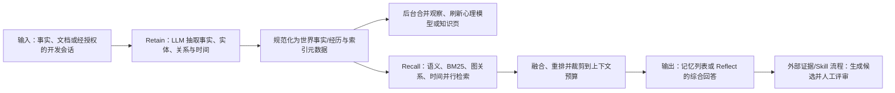

# Hindsight：Retain、Recall、Reflect 的学习型 Agent Memory

> **项目快照**：官方仓库 <https://github.com/vectorize-io/hindsight>｜核验日期 2026-09-04｜Stars 22,259｜许可证 MIT｜最近维护：`main` 分支最近提交为 2026-09-03。[^hindsight-repository][^hindsight-license][^hindsight-commits]

> **需求画像**：目标是在多个开发 Agent 之间共享项目业务知识、技术决策和经验证的开发经验，并为 Skill 更新提供可追溯的证据。硬约束是可在一台内网服务器上自托管、模型 API 可切换、能够接入不同 Agent；原始会话的人工选择上传、候选 Skill 的人工评审和 Git 发布由外部流程负责。

## 1. 项目要解决什么问题

### 目标用户与使用场景

Hindsight 面向需要长期记忆和持续学习能力的对话 Agent、自治 Agent 以及编码 Agent。项目把记忆分为世界事实、Agent 经历、由多条记忆合并出的观察和更高层的心理模型，并以 bank 作为用户、Agent 或项目的隔离记忆空间。[^hindsight-readme]

对本项目，最直接的场景是为每个代码仓库建立一个 bank：在开发任务结束后写入经过授权的会话、工具调用结果或决策摘要；下一次 Claude Code、Codex、Cursor 等 Agent 开始任务时，先按仓库和问题召回相关经验，必要时让 Reflect 对多条证据做综合解释。

### 当前问题

只使用 RAG 或简单向量相似度时，开发术语、时间关系、实体关系和因果关系容易被拆散。Hindsight 同时使用语义、关键词、图关系和时间过滤，并将结果融合和重排，以提高跨会话查找业务事实和历史经验的能力。[^hindsight-recall]

“记住”与“从经历中学习”不是同一个动作。项目通过后台观察合并和 Reflect 将多次经历归纳为带证据的观察或心理模型，避免每次会话都从平铺的历史记录重新推理。[^hindsight-observations][^hindsight-reflect]

多种编码 Agent 的会话入口不同。Hindsight 提供 SDK、REST、MCP、LLM wrapper 和编码 Agent 集成，使接入方可以从显式 API 控制写入和查询，也可以用集成包自动注入项目记忆。[^hindsight-integrations]

### 问题边界

Hindsight 是记忆服务和 Agent 集成层，不是公司的会话资产管理系统。Retain 会将输入分析成结构化事实、实体、关系和时间数据；官方文档同时提供文档存储和重新处理能力，但 Recall/Reflect 主要返回结构化记忆，不等于完整的会话回放、权限审批和资产管理界面。[^hindsight-retain]

它也不负责识别某个 Skill 是否失效、生成 Skill 文件差异、创建 Git PR 或验证发布后的提效效果。上述闭环需要外部会话选择、证据管理、候选生成和代码评审流程。

## 2. 设计的核心思路

### 核心判断

Hindsight 的核心主张是“让 Agent 学习，而不只是记住”：输入通过 Retain 变成可关联的事实和经历，Recall 负责可控检索，Reflect 负责基于已检索记忆进行更深层的综合；观察和心理模型在后台持续整理。[^hindsight-readme][^hindsight-operations]

### Memory 实现方式

`Retain` 将对话、文档或 Agent 事件抽取为事实、实体、关系、时间和经历，并按 Memory Bank 隔离；这些结构化记忆进入向量与全文检索路径。`Recall` 返回相关事实/经历，`Reflect` 以检索结果为依据生成综合回答，后台再把观察和心理模型整理为后续可检索记忆。[^hindsight-retain][^hindsight-operations]

### 关键设计选择

- **三操作分离**：Retain、Recall、Reflect 分别承担写入、结构化记忆检索和带立场的综合回答。调用方可在低延迟查事实时只用 Recall，也可以在需要解释“为什么”时使用 Reflect。[^hindsight-operations]
- **多种记忆类型**：世界事实用于项目规则，经历用于 Agent 做过什么，观察用于证据支持的归纳，心理模型或知识页用于可直接加载的长期理解。[^hindsight-memory-types]
- **混合检索**：语义向量、BM25 关键词、实体/时间/因果图和时间范围并行检索，随后用 reciprocal rank fusion 与交叉编码器重排。这样既保留业务词的精确匹配，也能处理自然语言表达差异。[^hindsight-recall]
- **Bank 隔离与可配置性**：bank 是隔离的记忆单元，可承载项目或 Agent 范围，并有背景上下文和 Reflect 的 disposition 配置；这给项目级知识和个人记忆提供了边界。[^hindsight-banks]
- **多入口接入**：Python、Node.js、Go、CLI、REST、MCP、LiteLLM/OpenAI/Anthropic wrapper 和编码 Agent 集成共享同一服务，使 Agent 适配集中在入口层。[^hindsight-clients][^hindsight-integrations]

### 向量化与模型接口核验

Hindsight 的 Recall 语义检索需要 Embedding；官方 Models 文档给出的默认模型是 `BAAI/bge-small-en-v1.5`，并说明 Embedding 与 Cross-Encoder 首次运行会从 Hugging Face 自动下载。官方页面没有确认默认模型的固定向量维度，因此部署时应以运行时返回维度和数据库 schema 为准。[^hindsight-models]

向量模型与 LLM 是分开的配置面：LLM 支持 OpenAI、Anthropic、Gemini、Ollama、LM Studio、DeepSeek、OpenAI-compatible 和 LiteLLM 等 provider；Embedding 默认走本地 Hugging Face 模型，官方没有在该页确认一个可直接切换的 DeepSeek Embedding provider。公司 API 可以作为 LLM 或兼容 Embedding 端点，但 DeepSeek 常规聊天接口不能推定支持 Embedding。[^hindsight-models][^hindsight-configuration]

向量、全文、实体和时间索引最终由 PostgreSQL/pgvector 等存储服务承载；中文项目不宜直接沿用英文默认模型，应改用经过中文评测的本地或兼容远程模型，并在建库前固定模型和维度。更换 Embedding 后需要全量重建向量数据，Cross-Encoder 也应作为独立的重排模型验证，不要把 LLM 名称当成 Embedding 能力。[^hindsight-storage][^hindsight-models]

### 代价与取舍

结构化提取、实体消歧、观察合并和 Reflect 都可能调用 LLM；写入不再是简单的原文落盘，因而会增加延迟、模型成本和结果审核要求。Recall 的多路检索需要 PostgreSQL 中同时维护向量、全文、关系和 JSON 数据，运维模型比单文件 Markdown 更复杂。调研判断：Hindsight 的学习型记忆适合要从开发经历中归纳规律的团队，但“原始会话可回放”和“Skill 变更可审计”仍必须由另一层提供。

## 3. 项目如何工作

### 工作流概览

### 阶段说明

| 阶段 | 接收什么 | 做什么 | 产生的状态或产物 | 证据 |
| --- | --- | --- | --- | --- |
| 输入与 Retain | 事实、对话、文档或 Agent 事件 | 通过 API/SDK 接受内容，LLM 提取关键事实、时间、实体和关系 | 待规范化的记忆事实与经历 | [^hindsight-retain] |
| 规范化与建模 | 抽取结果及已有实体 | 归一化实体，建立关系和时间序列，并写入稀疏/稠密表示与元数据 | 世界事实、经历、实体关系和搜索索引 | [^hindsight-readme][^hindsight-retain] |
| 后台学习 | 同一 bank 中的相关事实 | 合并相关事实为证据支持的观察，刷新心理模型或知识页 | 带证据的观察、心理模型或可投影 Markdown 的知识页 | [^hindsight-observations][^hindsight-mental-models] |
| Recall | 查询、bank、过滤器和预算 | 并行执行语义、关键词、图和时间检索，再融合和重排 | 相关记忆列表及其元数据 | [^hindsight-recall] |
| Reflect | 查询与召回上下文 | 对既有记忆作更深分析，形成 disposition-aware 的答案或新连接 | 解释、建议或项目风险/经验总结 | [^hindsight-reflect] |
| 外部消费 | 记忆结果、原始会话 ID 和 Skill 版本 | 由外部治理层关联证据，生成候选 Skill 差异并走 Git 评审 | 可审计的候选 PR 和验证结果 | 调研判断 |

### 关键状态与产物

- **Bank**：隔离的记忆存储单元，可以按项目、用户或 Agent 建立；跨 bank 不应泄漏记忆。[^hindsight-banks]
- **世界事实与经历**：Retain 根据内容将信息送入事实或经历路径，并以实体、关系、时间和向量表示保存。经历适合表示“Agent 曾经如何处理问题”，事实适合表示项目规则和外部知识。[^hindsight-memory-types]
- **观察**：后台把相关事实整合为去重的信念；每条观察保留支持证据、精确引文和 proof count，后续新证据会强化、削弱或扩展它，而不是静默覆盖。[^hindsight-observations]
- **心理模型与知识页**：心理模型是针对 bank 的持续问题答案；知识页是可组织、可搜索、可投影为普通 Markdown 的长期文档。[^hindsight-mental-models]
- **检索索引**：PostgreSQL 中的 pgvector、tsvector、关系查询和 JSONB 元数据共同支撑混合检索；官方没有把独立向量数据库列为必需组件。[^hindsight-storage]

### 最终输出

调用方可以获得受 bank、元数据、时间和查询约束的结构化记忆列表，也可以获得 Reflect 基于这些记忆生成的综合回答。对 Skill 更新场景，建议 Recall 输出连同记忆 ID、证据引文和关联会话 ID进入候选生成器；Reflect 可负责总结失败模式，但不能绕过人工评审直接修改 Skill。

## 4. 与需求画像逐项对照

### 需求矩阵

| 需求项 | 优先级或硬约束 | 项目现有能力 | 证据 | 状态 | 说明 |
| --- | --- | --- | --- | --- | --- |
| 项目业务知识长期保存 | 必须 | Bank、事实、观察、心理模型和知识页 | [^hindsight-memory-types][^hindsight-mental-models] | 满足 | 需要按仓库/项目设计 bank 与元数据边界 |
| 技术决策和经验证的经验可检索 | 必须 | 经历、观察、实体关系、时间和混合检索 | [^hindsight-experiences][^hindsight-recall] | 满足 | 来源会话和决策状态需由外部系统保存 |
| 接收完整开发会话 | 必须 | Retain 可接收对话、文档和 Agent 内容，并保留文档对象供重新处理；编码 Agent 集成可导入会话 | [^hindsight-retain][^hindsight-coding-agents] | 部分满足 | 本地会话发现、用户选择、版本化回放和权限审批不属于核心 API，需外置会话治理 |
| 多 Agent 接入 | 必须 | 提供 Claude Code、Codex、Cursor、Copilot CLI、OpenHands 等编码 Agent 集成，以及 SDK/REST/MCP | [^hindsight-coding-agents][^hindsight-integrations] | 满足 | 未列出的 Agent 仍需自定义适配器或走标准 API/MCP |
| 模型 API 可切换 | 必须 | 支持 DeepSeek、OpenAI-compatible endpoint、本地 Ollama/LM Studio、LiteLLM 等 | [^hindsight-configuration][^hindsight-models] | 满足 | 公司 API 可按 OpenAI-compatible 配置；Embedding 需单独选择支持的 provider |
| 单机自部署 | 必须 | 单容器嵌入 pg0，或 Docker + PostgreSQL/pgvector | [^hindsight-installation][^hindsight-storage] | 满足 | 高吞吐 worker、Helm/Kubernetes 是可选扩展，不是 POC 最小路径 |
| 用户主动控制原始会话上传 | 期望 | SDK/REST 可显式调用 Retain；自动编码 Agent 集成可不启用 | [^hindsight-integrations][^hindsight-operations] | 部分满足 | 选择、审批、脱敏和上传前预览需由本地客户端/网关实现 |
| Skill 候选可追溯、人工发布 | 必须 | 观察保留证据引文；webhook 可通知 retain/consolidation 生命周期 | [^hindsight-observations][^hindsight-production] | 部分满足 | Skill diff、评审人、Git PR 与回归验证不属于 Hindsight 核心 |
| 隐私和跨项目隔离 | 必须 | Bank 隔离；可选 Memory Defense 检测并阻断或脱敏 45 类秘密/PII 模式 | [^hindsight-banks][^hindsight-defense] | 部分满足 | 需另建访问权限、原始会话保留与人工授权策略；检测不能替代数据治理 |

### 对照归纳

Hindsight 原生匹配共享业务知识、开发经历检索、多 Agent 接入、模型切换和单机部署。关键缺口是原始完整会话的归档与人工上传控制，以及 Skill 更新所需的候选、Git 评审和回归验证。它适合作为“记忆与学习引擎”，不能单独成为会话资产和 Skill 治理平台。

## 5. 开源与能力边界

### 边界清单

| 能力 | 开源核心 | 商业版或 SaaS | 外部依赖 | 证据 |
| --- | --- | --- | --- | --- |
| Hindsight API、Retain/Recall/Reflect | 有，仓库以 MIT 发布 | Hindsight Cloud 提供托管 API | LLM、Embedding、PostgreSQL/pgvector | [^hindsight-license][^hindsight-operations][^hindsight-storage] |
| Python/Node/Go/CLI/REST 客户端 | 有 | Cloud 仅改变服务地址与运维方式 | 对应语言运行时 | [^hindsight-clients] |
| MCP、LLM wrapper 与编码 Agent 集成 | 有，集成包和配置在仓库/官方文档中 | Cloud 可免自建服务器 | 目标 Agent 的插件/MCP 能力 | [^hindsight-integrations][^hindsight-coding-agents] |
| 单机嵌入式 pg0 | 有，适合开发测试 | 无需 Cloud | 本地磁盘 | [^hindsight-installation] |
| PostgreSQL + pgvector 生产存储 | 有 | Oracle AI Database、Cloud/Enterprise 是额外选项 | PostgreSQL 与 pgvector | [^hindsight-storage] |
| 备份、团队协作、99.9% SLA | 自托管需自行实现 | Hindsight Cloud 提供 | Cloud 服务 | [^hindsight-cloud] |
| Memory Defense | 有，可按 bank 选择阻断或脱敏 | Cloud 也可使用 | Hindsight 的规则扫描 | [^hindsight-defense] |

### 边界判断

官方文档将 Hindsight Cloud 描述为托管基础设施、Dashboard、备份、团队协作和 SLA；这些不能等价为 MIT 自托管核心自动具备的运营能力。[^hindsight-cloud]

同样，“支持 Claude Code、Codex、Cursor”等是官方集成包对 Agent 入口的支持，不等价于能读取所有版本的本地会话文件或提供原始会话回放。对公司的隐私边界，应将 Retain 调用放在人工确认后的上传路径，并把原始文件保存在独立受控的对象存储或文件系统中。

## 6. 用户如何接入和使用

### 接入前提

- 选择 Docker 单容器（内置 pg0）或 Docker Compose + PostgreSQL/pgvector，并准备一个可调用的 LLM；Embedding 可使用本地模型或远程 provider。[^hindsight-installation][^hindsight-configuration]
- 为项目建立稳定的 bank ID 和元数据字段，用于区分仓库、分支、Agent、成员、会话以及 Skill 版本。
- 在 Claude Code、Codex、Cursor 等 Agent 中选择官方编码 Agent 集成、MCP，或直接使用 SDK/REST；未列出的 Agent 需要归一化事件适配器。[^hindsight-coding-agents][^hindsight-integrations]

### 接入过程

1. 使用 `docker run`/Docker Compose 启动 API；开发测试可直接使用内置 pg0，生产路径配置外部 PostgreSQL 并启用 pgvector。[^hindsight-quickstart][^hindsight-installation]
2. 配置 `HINDSIGHT_API_LLM_PROVIDER`、模型、API key 和 base URL；公司 OpenAI-compatible API 使用 `openai` provider 指向自定义 endpoint，DeepSeek 使用 `deepseek` provider。Embedding 不要默认复用 DeepSeek，因为官方说明 DeepSeek 不提供 embeddings endpoint。[^hindsight-configuration][^hindsight-models]
3. 在人工选择并确认的会话上传路径中调用 `retain(bank_id, content, context, timestamp)`；会话开始调用 `recall`，需要解释性总结时调用 `reflect`，并将结果与外部原始会话 ID关联。[^hindsight-operations]
4. 将记忆证据交给外部经验提取器，生成 Skill 修改候选；候选经负责人审阅后进入 Git PR 与回归任务。

### 日常使用方式

编码 Agent 启动时可以通过 per-repo bank 自动获得项目记忆，或由本地插件显式调用 Recall/MCP。任务完成后，用户可以只上传选中的会话；Hindsight 将其转为事实、经历和关联索引，后续按项目、时间、实体和关键词召回。Reflect 适合周期性总结“哪些方案有效、哪些失败以及原因”。[^hindsight-coding-agents][^hindsight-mcp]

### 接入限制

Hindsight 官方集成覆盖多个 Agent，但项目仍需核验目标 Agent 的本地会话格式、Hook 时机和权限模型；没有证据表明所有 Agent 版本都能自动读取或保存完整原始记录。自动集成适合快速验证，严格隐私控制则应使用显式 SDK/REST 路径。

即使使用 Hindsight 的文档存储，原始会话资产的保留周期、用户授权、删除请求、版本化回放和 Skill 版本关联仍需自行治理；项目的 Recall/Reflect 结果主要面向结构化记忆消费。

## 7. 部署构成

### 运行组件

| 组件 | 必需或可选 | 职责 | 持久化数据 | 与其他组件的关系 | 证据 |
| --- | --- | --- | --- | --- | --- |
| Hindsight API | 必需 | 提供 Retain、Recall、Reflect、REST/MCP 与后台任务入口 | 主要业务状态在 PostgreSQL | 被 Agent 客户端调用；访问 LLM 与数据库 | [^hindsight-services] |
| PostgreSQL + pgvector | 必需（生产路径） | 统一存储向量、全文、关系、JSONB 和事务数据 | 事实、经历、观察、实体关系、索引和配置 | API 通过数据库连接读写；pgvector 提供 HNSW | [^hindsight-storage] |
| 内置 pg0 | 可选（开发/小型 POC） | 在 Hindsight 进程旁提供嵌入式 PostgreSQL | 本地 `~/.hindsight/data` 或容器挂载卷 | API 直接使用，无需外部数据库服务 | [^hindsight-installation] |
| LLM provider | 必需 | 抽取、规范化、Reflect 与后台整理 | 远端服务通常不由 Hindsight 持久化 | API 调用公司 endpoint、DeepSeek、云模型或本地服务 | [^hindsight-configuration][^hindsight-models] |
| Embedding provider | 必需的语义检索路径 | 生成记忆和查询向量 | 本地模型缓存或远程服务状态 | API 将向量写入 PostgreSQL/pgvector | [^hindsight-configuration] |
| Reranker | 可选 | 对多路召回结果重排 | 通常为本地模型缓存或远程服务 | Recall 在融合后调用 | [^hindsight-configuration] |
| Dedicated worker | 可选 | 将后台 consolidation 等任务从 API 进程拆出 | 任务状态仍在 PostgreSQL | worker 轮询 PostgreSQL 任务 | [^hindsight-services] |
| Control Plane UI | 可选 | Web 管理界面 | 通过 API 访问业务数据 | 与 API 分开运行，默认端口 9999 | [^hindsight-quickstart] |
| Prometheus/Grafana | 可选 | 监控 LLM 调用、token、延迟与服务指标 | 指标时序数据 | 抓取 API/worker 指标 | [^hindsight-production] |
| 外部会话归档与 Skill 治理层 | 必需（本项目闭环） | 保存原始会话、授权、证据链、候选和 Git PR | 原始会话文件、审计记录、候选 diff | 在 Retain 前筛选，在 Recall/Reflect 后生成候选 | 调研判断 |

### 最小部署路径

最小 POC 可以运行官方 Hindsight Docker 镜像，挂载持久化数据卷，使用内置 pg0，并将 API 暴露在 8888；UI 9999 可按需启用。也可以使用 `pip install hindsight-api` 在单一进程运行。[^hindsight-quickstart][^hindsight-installation]

团队共享的单机路径是 Hindsight API + PostgreSQL/pgvector + 可切换 LLM/Embedding provider；若后台任务量上升，再将 worker 拆成单独容器。官方没有为本项目场景给出 CPU、内存或吞吐最低值，需用真实会话量实测。

### 生产化仍需考虑

- 为 API、MCP 和管理界面配置认证、TLS、反向代理及按 bank/项目的访问控制。
- 备份 PostgreSQL，同时独立备份原始会话和 Skill 候选；测试恢复时要验证记忆证据 ID仍能指向原文。
- 配置 LLM/Embedding 超时、重试、并发、成本和数据出境策略。DeepSeek 可作为 LLM，但 Embedding 需要本地或其他 provider。[^hindsight-configuration]
- 明确原始会话人工授权、删除和保留策略；Memory Defense 是规则检测辅助，不是完整 DLP 或权限系统。[^hindsight-defense]
- 高吞吐时再考虑 dedicated workers、读副本或 Kubernetes；单服务器试点不需要先引入这些组件。[^hindsight-services]

## 8. 适配结论与能力缺口

### 适配结论

**条件匹配。** Hindsight 直接覆盖多 Agent 记忆接入、业务知识/开发经历的结构化保存与混合检索，并提供单机 Docker、可切换模型和 bank 隔离；但原始完整会话归档、用户授权上传、Skill 候选 Git 治理不在核心能力内，必须接入外部会话与评审层。

### 已满足能力

- Retain/Recall/Reflect 形成从会话输入、经验提取、检索到深度总结的完整记忆工作流。[^hindsight-operations]
- 世界事实、经历、观察、心理模型和知识页适合分别承载业务规则、技术决策与可复用开发经验。[^hindsight-memory-types][^hindsight-observations]
- 官方集成覆盖 Claude Code、Codex、Cursor 等编码 Agent，并提供 SDK、REST、MCP 和 wrapper。[^hindsight-coding-agents][^hindsight-integrations]
- API 可配置 DeepSeek、公司 OpenAI-compatible endpoint、本地模型和其他 provider；PostgreSQL 单库承载主要检索能力。[^hindsight-configuration][^hindsight-storage]
- MIT 开源核心支持单机自托管，开发路径可以使用内置 pg0，生产路径可使用外部 PostgreSQL/pgvector。[^hindsight-license][^hindsight-installation]

### 能力缺口

- **会话资产治理**：Retain 能接收会话并保存文档对象，但不提供本地 Claude Code 会话发现、人工选择、权限审批、版本化回放和组织级保留策略；需额外保存稳定 ID并实现治理入口。
- **会话事件归一化**：不同 Agent 的消息、工具调用、补丁和测试结果需要适配为统一事件或带上下文的 Retain 输入。
- **Skill 更新闭环**：需外部生成候选 Skill diff、关联 Recall/Reflect 证据、人工评审、Git PR 和回归验证。
- **团队治理**：需补充组织成员权限、项目隔离、数据保留、审计和删除流程；bank 隔离不等于完整组织权限模型。
- **事实质量治理**：LLM 抽取与观察合并可能形成错误或过时归纳，业务负责人仍需审阅关键规则和经验。

### 需要自研或外部补齐

- 本地会话发现、预览、人工选择和授权上传客户端；将 Claude Code、Codex、Cursor 等格式转换为统一事件。
- 原始会话对象存储/文件仓库、证据片段索引和访问审计，并与 Hindsight 记忆 ID 对齐。
- Skill 候选生成器、差异评审界面或 Git 集成，以及基于真实任务的效果回归。

### 否决风险

当前未发现硬性否决项。主要风险是将 Hindsight 的结构化学习记忆误当成完整会话仓库，或在没有人工证据审查的情况下把 Reflect 结论直接写入共享 Skill。

---

[^hindsight-repository]: [Hindsight 官方 GitHub 仓库](https://github.com/vectorize-io/hindsight)
[^hindsight-license]: [Hindsight MIT 许可证](https://github.com/vectorize-io/hindsight/blob/main/LICENSE)
[^hindsight-commits]: [Hindsight main 分支提交记录](https://github.com/vectorize-io/hindsight/commits/main)
[^hindsight-readme]: [Hindsight README：项目定位与核心概念](https://github.com/vectorize-io/hindsight/blob/main/README.md)
[^hindsight-memory-types]: [Hindsight README：Memory Types](https://github.com/vectorize-io/hindsight#memory-types)
[^hindsight-experiences]: [Hindsight 官方首页：Memory Types 与层级](https://hindsight.vectorize.io/)
[^hindsight-operations]: [Hindsight 官方文档：Retain、Recall、Reflect](https://hindsight.vectorize.io/developer/api/main-methods)
[^hindsight-retain]: [Hindsight 官方文档：Ingest Data / Retain](https://hindsight.vectorize.io/developer/api/retain)
[^hindsight-recall]: [Hindsight 官方文档：Recall](https://hindsight.vectorize.io/developer/api/recall)
[^hindsight-reflect]: [Hindsight 官方文档：Reflect](https://hindsight.vectorize.io/developer/api/reflect)
[^hindsight-observations]: [Hindsight 官方文档：Observations](https://hindsight.vectorize.io/developer/observations)
[^hindsight-mental-models]: [Hindsight 官方文档：Mental Models](https://hindsight.vectorize.io/developer/mental-models)
[^hindsight-banks]: [Hindsight 官方文档：Memory Banks](https://hindsight.vectorize.io/developer/api/memory-banks)
[^hindsight-storage]: [Hindsight 官方文档：Storage](https://hindsight.vectorize.io/developer/storage)
[^hindsight-services]: [Hindsight 官方文档：Services](https://hindsight.vectorize.io/developer/services)
[^hindsight-installation]: [Hindsight 官方文档：Installation](https://hindsight.vectorize.io/developer/installation)
[^hindsight-quickstart]: [Hindsight 官方文档：Quick Start](https://hindsight.vectorize.io/developer/api/quickstart)
[^hindsight-configuration]: [Hindsight 官方文档：Configuration](https://hindsight.vectorize.io/developer/configuration)
[^hindsight-models]: [Hindsight 官方文档：Models](https://hindsight.vectorize.io/developer/models)
[^hindsight-clients]: [Hindsight README：SDK、CLI 与 REST 客户端](https://github.com/vectorize-io/hindsight#quick-start)
[^hindsight-integrations]: [Hindsight README：Integrations 与 MCP](https://github.com/vectorize-io/hindsight#adding-hindsight-to-your-agent)
[^hindsight-coding-agents]: [Hindsight 官方文档：Coding Agents](https://hindsight.vectorize.io/sdks/integrations/coding-agents)
[^hindsight-mcp]: [Hindsight 官方文档：MCP Server](https://hindsight.vectorize.io/developer/mcp-server)
[^hindsight-defense]: [Hindsight 官方文档：Memory Defense](https://hindsight.vectorize.io/developer/memory-defense)
[^hindsight-production]: [Hindsight README：Running in Production](https://github.com/vectorize-io/hindsight#running-in-production)
[^hindsight-cloud]: [Hindsight 官方文档：Self-hosted、Cloud 与 Enterprise](https://vectorize.io/hindsight)
[^hindsight-models]: [Hindsight 官方 Models：默认 Embedding、Cross-Encoder 与 provider](https://hindsight.vectorize.io/developer/models)
