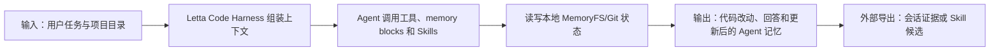

# Letta Code：带持续学习记忆的开发 Agent Harness

> **项目快照**：官方仓库 <https://github.com/letta-ai/letta-code>｜核验日期 2026-09-03｜Stars 约 3.2k｜许可证 Apache-2.0｜仓库在核验日有提交，最新 Release 为 `v0.31.11`（2026-09-01）。[^letta-code-repository][^letta-code-license][^letta-code-release]

> **需求画像**：目标是让开发 Agent 跨会话保持项目上下文，并把实践经验转化为可复用的记忆或 Skill。硬约束是支持可切换模型、尽量覆盖多 Agent、单机可运行；共享业务知识、原始会话留存和 Skill 评审可由外部系统补齐。

## 1. 项目要解决什么问题

### 目标用户与使用场景

Letta Code 是面向终端、桌面和远程环境的 memory-first coding agent。它把一个长期 Agent 的身份、记忆、工具和 Skill 放在持续存在的运行时里，适用于需要反复回到同一代码库工作的开发者。[^letta-code-repository]

### 当前问题

普通聊天式 Agent 每次会话都要重新解释项目约定。Letta Code 让 Agent 可以保存、修改和检索自己的上下文，使 Agent 随使用积累经验。官方特性表将“自我改进与学习”描述为通过 memory blocks 和 skill learning 重写上下文。[^letta-code-repository]

开发者还需要在本地 CLI、桌面应用或远程机器之间保持 Agent 状态。Letta Code 提供本地 CLI、`letta server` 远程环境、桌面和消息渠道，但部分跨设备能力依赖 Constellation/登录服务。[^letta-code-repository]

### 问题边界

Letta Code 是完整的 Agent Harness，不是通用的团队会话数据仓库。它不会自动把所有成员的 Claude Code 原始会话导入，也不会把某次经验转换为团队 Skill 的 Git PR；需要外部采集与评审流程。

## 2. 设计的核心思路

### 核心判断

Letta Code 把记忆视为 Agent 运行时状态的一部分，而不是每次请求外挂一段 RAG 文本。Agent 能通过工具和 Skill 读写记忆，在长期运行中修改自己的工作上下文。[^letta-code-repository][^letta-docs]

### 关键设计选择

- **记忆优先的 Harness**：Agent 由模型、上下文、工具、权限、Skill 和持久化状态共同组成，适合长生命周期 Agent。[^letta-code-repository]
- **MemoryFS/Git 持久化**：本地 Agent 的 memory 存在 `~/.letta/lc-local-backend/memfs/<agent-id>/memory` 下的 Git 仓库，记忆天然具有文件化、版本化的形态。[^letta-code-repository]
- **Skill 与自我学习**：Skill 既可作为预制能力，也可在 Agent 学习中扩展；这和“经验候选→Skill 更新”的目标有概念上的连接。[^letta-code-repository][^letta-docs-skills]
- **模型无关**：官方说明支持 Claude、GPT、Gemini、GLM、Kimi 等模型，模型选择通过配置/命令完成。[^letta-code-repository]

### 代价与取舍

运行时把很多控制权交给 Agent 自己，记忆质量依赖工具调用、提示和模型行为；它不会自动保证业务事实正确或多人并发编辑无冲突。调研判断：Letta Code 对“一个 Agent 的连续学习”很强，但要做团队共享 Memory，还需要统一存储、权限、导入和评审层。

## 3. 项目如何工作

### 工作流概览

### 阶段说明

| 阶段 | 接收什么 | 做什么 | 产生的状态或产物 | 证据 |
| --- | --- | --- | --- | --- |
| 启动 Agent | 项目目录、模型配置、Agent ID | CLI 初始化或恢复长期 Agent | 可运行的 Agent 运行时 | [^letta-code-repository] |
| 上下文组装 | 当前任务、系统上下文、memory blocks、Skills | 按运行时策略将相关状态暴露给模型 | 当前回合上下文 | [^letta-docs] |
| 工具执行 | 模型工具调用 | 读代码、修改文件、运行命令或调用外部工具 | 工具结果和代码变更 | [^letta-code-repository] |
| 记忆自编辑 | Agent 发现的新约定/经验 | 通过记忆工具或 Skill 修改持久化上下文 | MemoryFS/Git 中的新版本 | [^letta-code-repository][^letta-docs-memory] |
| 结束与复用 | 已完成会话状态 | 下次启动恢复 Agent 记忆；外部系统可另行导出 | 连续 Agent 状态或候选经验 | 调研判断 |

### 关键状态与产物

- **Memory blocks**：始终或按策略注入上下文的结构化/文本记忆块，用来保存身份、项目约定和工作状态。官方文档将其作为 Letta 记忆系统的核心概念。[^letta-docs-memory]
- **Archival/长期记忆**：不必每回合放入上下文，可通过检索工具访问的历史信息；具体后端和策略以运行时版本为准。[^letta-docs-memory]
- **MemoryFS Git 仓库**：本地 Letta Code Agent 的记忆文件与版本状态，能作为导出和回滚依据，但不等价于团队知识库。[^letta-code-repository]
- **Skills**：可复用的能力说明和工作流，部分 Skill 可由 Agent 学习或自配置。[^letta-docs-skills]

### 最终输出

用户得到代码、命令结果和持续存在的 Agent 状态。若要服务 Skill 更新，应在会话结束时通过 Hook/插件读取变更、工具调用和 MemoryFS diff，再产生带证据的 Skill 候选，而不能直接把 Agent 自己修改的 Skill 视作已审核规则。

## 4. 与需求画像逐项对照

### 需求矩阵

| 需求项 | 优先级或硬约束 | 项目现有能力 | 证据 | 状态 | 说明 |
| --- | --- | --- | --- | --- | --- |
| 项目业务知识长期保存 | 必须 | 长期 Agent 记忆、MemoryFS、memory blocks | [^letta-code-repository][^letta-docs-memory] | 满足 | 需约定项目级共享 Agent 或外部同步策略 |
| 技术决策和经验可检索 | 必须 | Agent 记忆与归档记忆工具 | [^letta-docs-memory] | 部分满足 | 版本、来源、冲突和团队审核不由核心自动解决 |
| 接收完整开发会话 | 必须 | 自身运行时有会话状态 | [^letta-code-repository] | 部分满足 | 没有面向外部 Claude Code 会话的通用导入和人工上传工作流 |
| 多 Agent 接入 | 必须 | Letta Code 支持多模型/渠道，自身是独立 Harness | [^letta-code-repository] | 部分满足 | 不是 Claude Code/Codex/Cursor 会话统一采集器，需要适配层 |
| 模型 API 可切换 | 必须 | 支持 Claude、GPT、Gemini、GLM、Kimi 等 | [^letta-code-repository] | 满足 | 公司 API/DeepSeek 的自定义 Base URL 需 POC 验证 |
| 单机自部署 | 必须 | 本地 CLI；`letta server` 可运行服务 | [^letta-code-repository] | 部分满足 | 本地个人运行轻；团队共享服务、数据库和权限边界需另建 |
| 用户主动控制原始会话上传 | 期望 | 本地运行不强制外传 | [^letta-code-repository] | 部分满足 | 需外部导出工具提供明确选择/确认 |
| Skill 候选可追溯、人工发布 | 必须 | Skill 文件和 Git 化记忆可提供素材 | [^letta-code-repository][^letta-docs-skills] | 部分满足 | 没有内置候选评审、PR、回归验证闭环 |

### 对照归纳

Letta Code 最直接覆盖的是“持续存在的开发 Agent 和记忆优先运行时”。它可以成为个人试点的采集端或经验产生端，但作为团队 Memory 服务时会遇到共享、权限、导出和服务部署问题。

## 5. 开源与能力边界

### 边界清单

| 能力 | 开源核心 | 商业版或 SaaS | 外部依赖 | 证据 |
| --- | --- | --- | --- | --- |
| Letta Code CLI 与 Harness | 有，Apache-2.0 | Letta Cloud/Constellation 提供托管和跨环境能力 | Node.js 22.19+、模型 API | [^letta-code-license][^letta-code-repository] |
| 本地 Agent 记忆 | 有 | 云端可同步/跨机器访问 | 本地文件系统、Git | [^letta-code-repository] |
| App Server/远程环境 | 有运行命令和部署仓库 | 云端控制面和登录体验 | Docker/网络/持久卷；部分能力依赖登录 | [^letta-code-repository][^letta-deployment] |
| Skills、渠道和自我学习 | 有部分开源实现 | 云端产品可能提供额外集成 | 各渠道凭据、模型 API | [^letta-docs-skills][^letta-code-repository] |

### 边界判断

Letta 主仓库当前说明：历史 V1 Server 已退役，源代码在 `archive` 分支且不再维护；当前代码集中在 `letta-code`。因此不能把旧 Docker Server 文档当作当前完整团队服务的无条件保证。[^letta-landing]

`letta server` 的官方部署仓库描述的是连接 Letta Cloud 的远程环境，容器需要持久卷保存认证状态；这与完全内网、自建控制面不是一回事。[^letta-deployment]

## 6. 用户如何接入和使用

### 接入前提

- 安装 Node.js（当前 `letta-code` 的 `package.json` 要求 Node.js >=22.19.0）和 `@letta-ai/letta-code`；选择可用模型提供商和凭据。[^letta-code-package]
- 规划 Agent ID、项目目录和 MemoryFS 的持久化位置；团队共享还需设计同步/服务端存储。
- 如果导出给 Skill 流程，需要增加 Hook 或事件转发器，记录用户确认的会话范围。

### 接入过程

1. `npm install -g @letta-ai/letta-code`，在目标代码库运行 `letta`，创建或恢复本地 Agent。[^letta-code-repository]
2. 按模型配置选择 Claude、GPT、Gemini、DeepSeek 或公司兼容 API；在会话中以 Skill 和记忆工具积累项目上下文。[^letta-code-repository]
3. 通过 MemoryFS Git diff、工具日志和代码变更生成经验候选，写入团队知识/评审系统，而不是自动覆盖共享 Skill。

### 日常使用方式

开发者在同一个项目目录反复运行 CLI，Agent 读取已有 MemoryFS，按需读写 memory blocks 和 Skills。若运行 `letta server`，远程环境可由桌面或聊天界面访问，但认证、网络和持久卷按部署方式配置。[^letta-code-repository][^letta-deployment]

### 接入限制

Letta Code 不提供把其他 Agent（Claude Code、Codex、Cursor）的原始会话统一导入的稳定标准；需要对各 Agent 的 JSONL/Trace/Hook 进行适配。其团队共享记忆的原生云能力和自托管能力边界也需在 POC 中确认。

## 7. 部署构成

### 运行组件

| 组件 | 必需或可选 | 职责 | 持久化数据 | 与其他组件的关系 | 证据 |
| --- | --- | --- | --- | --- | --- |
| Letta Code CLI/Harness | 必需（本地路径） | 交互式 Agent、工具和 Skill 执行 | 配置、会话状态、MemoryFS | 调用模型 API，操作项目目录 | [^letta-code-repository] |
| Node.js/Bun 运行时 | 必需 | 执行 CLI 及其依赖 | 包缓存 | 被 CLI 使用 | [^letta-code-package][^letta-code-repository] |
| MemoryFS Git 仓库 | 必需的本地记忆路径 | 保存 Agent 记忆和版本 | `~/.letta/.../memory` | CLI 读写 | [^letta-code-repository] |
| `letta server` | 可选 | 将运行时暴露为远程环境 | `/root/.letta` 等持久卷 | 与云端/自建 Letta Base URL 连接 | [^letta-deployment] |
| 模型 API | 必需 | 推理、记忆编辑和工具决策 | 通常不在本地 | CLI/Harness 调用 | [^letta-code-repository] |
| 外部导出/团队 Memory 服务 | 本项目场景可选 | 汇总成员会话与业务知识 | 原始会话、证据、候选 PR | 读取 CLI/Hook 输出 | 调研判断 |

### 最小部署路径

个人 POC 的最小路径是本机安装 npm 包、配置模型 API、在代码库运行 `letta`；不需要额外数据库。远程路径需要容器/主机、持久卷和 Letta 服务地址，官方部署仓库的默认方式还包括与 Letta Cloud 的 OAuth/WebSocket 连接。[^letta-code-repository][^letta-deployment]

### 生产化仍需考虑

- 需要明确 MemoryFS 是否允许多人共享、如何解决 Git 合并冲突，以及原始会话和记忆的访问隔离。
- 需要给 Agent 自编辑 Memory/Skill 增加审批和回滚策略；不能仅依赖模型自我约束。
- 官方未给出本项目场景的最低 CPU、内存或并发指标，需实测；自托管内网控制面是否完整也需核验当前版本。

## 8. 适配结论与能力缺口

### 适配结论

**条件匹配。** Letta Code 很适合作为个人/项目级持续学习 Agent 的试点，能直接展示记忆和 Skill 学习的用户价值；若目标是团队集中收集多种 Agent 的完整会话并形成共享 Memory，它需要外部采集、服务化存储和治理层。

### 已满足能力

- memory-first Agent、MemoryFS Git 持久化和 Skill 学习机制。[^letta-code-repository][^letta-docs-skills]
- 支持多模型供应商，具备 API 切换方向。[^letta-code-repository]
- 本地 CLI 启动路径轻，适合快速验证“记忆是否提升开发连续性”。[^letta-code-repository]

### 能力缺口

- **统一会话收集**：自身会话与 Claude Code 等外部会话不是同一采集协议。
- **集中共享与权限**：本地 MemoryFS 偏单 Agent；团队级共享需要服务端和身份/项目隔离。
- **Skill 治理闭环**：Skill 学习能力不等于带来源、评审、Git 合并和回归验证的发布流水线。

### 需要自研或外部补齐

- 本地用户选择会话、生成导出包的插件/Hook。
- 会话事件归一化、原始对象存储和团队 Memory API。
- Skill 候选审查、Git PR、回归任务和效果评估。

### 否决风险

若试点的硬要求是“单台内网服务器集中运行并跨成员共享原始会话”，当前官方资料无法确认 `letta-code` 提供不依赖 Letta Cloud 的完整控制面；应先验证自托管 API、认证和多租户边界。

---

[^letta-code-repository]: [Letta Code 官方 GitHub 仓库](https://github.com/letta-ai/letta-code)
[^letta-code-license]: [Letta Code Apache-2.0 许可证](https://github.com/letta-ai/letta-code/blob/main/LICENSE)
[^letta-code-release]: [Letta Code Releases](https://github.com/letta-ai/letta-code/releases)
[^letta-code-package]: [Letta Code package.json](https://github.com/letta-ai/letta-code/blob/main/package.json)
[^letta-landing]: [Letta 官方仓库当前说明](https://github.com/letta-ai/letta)
[^letta-docs]: [Letta 官方文档](https://docs.letta.com/)
[^letta-docs-memory]: [Letta Memory 文档](https://docs.letta.com/concepts/memory)
[^letta-docs-skills]: [Letta Skills 文档](https://docs.letta.com/guides/skills)
[^letta-deployment]: [Letta Code Server Deployment](https://github.com/letta-ai/letta-code-server-deployment)
