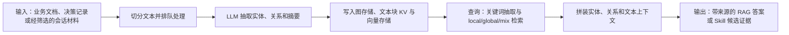

# LightRAG：图结构与向量检索的业务知识 Memory

> **项目快照**：官方仓库 <https://github.com/HKUDS/LightRAG>｜核验日期 2026-09-04｜Stars 39,362｜许可证 MIT｜main 分支最近提交 2026-09-03；README 记录 2026-07 的 Smart Heading 等持续更新。[^lightrag-repository][^lightrag-license][^lightrag-maintenance]

> **需求画像**：目标是把项目业务术语、规则、技术决策及会话中确认的经验组织成可追溯的共享知识，供多个开发 Agent 检索；硬约束是单机可部署、模型 API 可切换并能通过 REST/SDK 接入不同 Agent。接受外部采集和 Skill 治理层补齐原始会话上传、候选生成与人工发布；不要求本项目原生完成 Agent Memory。

## 1. 项目要解决什么问题

### 目标用户与使用场景

LightRAG 是一个轻量的知识图谱 RAG 框架，面向需要在文档之间保留实体、关系和上下文的知识库应用。它提供 Python SDK、REST API/WebUI、多种 LLM/Embedding 提供商和可替换存储后端。[^lightrag-readme][^lightrag-api]

对本项目而言，可把经过筛选的业务文档、技术决策记录和会话总结作为输入；系统从文本中抽取实体与关系，形成项目知识图谱和向量索引，再按 `local`、`global` 或 `mix` 等查询模式返回上下文给 Agent。

### 当前问题

普通 chunk 向量检索容易把实体关系拆散，难以回答“某业务规则影响哪些模块”或“某次技术决策与哪些约束关联”等跨文档问题。LightRAG 用图结构保存实体及关系，同时保留文本块和向量索引。[^lightrag-readme]

图 RAG 的全量重建和多跳推理通常成本较高。LightRAG 通过较轻量的实体/关系抽取、双层检索、增量更新和选择性删除降低索引与查询成本。[^lightrag-readme]

团队还需要知识来源可追溯。官方 SDK 支持在插入时提供 `file_paths`，并在图实体、关系和文本块上保留 source ID/文件信息；文档删除会重建仍被其他文档引用的图元素。[^lightrag-core]

### 问题边界

LightRAG 是 RAG/知识图谱基础设施，不是完整的 Agent Memory：它不自动读取各开发 Agent 的本地会话目录，不维护个人用户画像、跨会话偏好或记忆遗忘策略，也不提供用户选择完整原始会话的上传审批。

它也不会从一次会话自动判断 Skill 缺口并生成 Git 补丁。会话采集、证据筛选、经验归纳、候选评审和 Skill 发布要由外部流程完成；LightRAG 适合承载其结构化知识和来源检索部分。

## 2. 设计的核心思路

### 核心判断

LightRAG 的核心是“双层知识”：一层是由实体和关系组成的知识图，另一层是文本块、实体和关系的向量索引。查询时按问题提取关键词，在图上定位局部/全局上下文，再与向量结果合并交给 LLM 生成答案。[^lightrag-readme][^lightrag-operate]

### 关键设计选择

- **图与向量双存储**：图保留语义依赖和跨文档关系，向量保留相似文本、实体描述和关系描述，兼顾精确实体查询与语义召回。[^lightrag-readme][^lightrag-storage]
- **多查询模式**：`local` 聚焦实体及邻近关系，`global` 聚焦图中高层关系，`hybrid`/`mix` 合并图与文本，`naive` 提供不使用图的传统向量基线。[^lightrag-readme]
- **增量写入和选择性删除**：文档插入可异步排队；删除文档时根据来源重建仍存活的实体、关系和向量，适合不断更新的知识库。[^lightrag-core][^lightrag-file-pipeline]
- **存储后端可替换**：默认 JSON/KV、NetworkX 和 NanoVectorDB 适合测试；生产可用 PostgreSQL、MongoDB、OpenSearch，或用 Neo4j/Milvus/Qdrant 等分别承载图和向量。[^lightrag-readme][^lightrag-storage]
- **模型绑定可切换**：官方列出 OpenAI/OpenAI-compatible、Ollama、Gemini、Bedrock、Azure 等 LLM，以及多种 Embedding；角色可拆分为 EXTRACT、QUERY、KEYWORD、VLM。[^lightrag-readme][^lightrag-provider]

### 向量化与模型接口核验

LightRAG 的文档、实体和关系语义检索都依赖 Embedding；服务通过 `EMBEDDING_BINDING`、`EMBEDDING_MODEL`、`EMBEDDING_DIM` 和 `EMBEDDING_TOKENIZER` 配置向量化函数。官方说明这些参数是部署者提供的模型配置，并没有为所有 binding 声明一个统一默认模型或统一维度；OpenAI-compatible 示例中常见 `text-embedding-3-small`、`bge-m3` 或多语言 E5，但实际维度必须以所选服务返回值为准。[^lightrag-provider][^lightrag-readme]

官方 binding 覆盖 `openai`/`azure_openai`（兼容 OpenAI `/embeddings`）、`ollama`、`gemini`、`jina` 和 `voyageai` 等；Ollama/Gemini 还有专门的 provider 参数，向量存储可落本地 NanoVectorDB、PostgreSQL/pgvector、Milvus、Qdrant、OpenSearch 等。改变模型或维度后，官方提供 `rebuild_vdb` 清理并重建所有向量存储。[^lightrag-provider][^lightrag-storage][^lightrag-readme]

公司 API 可走 OpenAI-compatible binding，DeepSeek 只有在提供 `/v1/embeddings` 的兼容网关中才可作为 Embedding；DeepSeek 聊天 API不能直接替代。中文项目应选择多语言模型并固定 `EMBEDDING_DIM`，同时验证 tokenizer、查询/文档前缀和后端索引上限；官方未给出中文效果保证，需用业务会话回放实测。[^lightrag-provider][^lightrag-readme]

### 代价与取舍

实体关系抽取发生在每个文本块上，索引阶段会产生较多 LLM 调用；图结构的价值依赖抽取准确性、实体归一化和关系合并策略。官方明确指出默认内存存储只适合小规模测试，生产应选择数据库后端。[^lightrag-readme]

调研判断：LightRAG 对项目规则和模块关系很有帮助，但它的知识对象是“文档/实体/关系”，不是“用户/会话/偏好”。如果把它用于 Skill 更新，必须在外部把会话事件、Skill 版本、证据片段映射成可索引文档和来源字段，不能把图查询直接当成经验治理。

## 3. 项目如何工作

### 工作流概览

### 阶段说明

| 阶段 | 接收什么 | 做什么 | 产生的状态或产物 | 证据 |
| --- | --- | --- | --- | --- |
| 文档输入 | 文本、文件内容、来源路径和 workspace | API/SDK 接收内容，分块并记录文档状态；可异步入队 | 文档记录、文本块和处理队列状态 | [^lightrag-core][^lightrag-file-pipeline] |
| 实体关系抽取 | 文本块、Extract LLM 配置 | 让 LLM 抽取实体、类型、描述、关系、关键词和来源 | 实体、边、描述、source ID | [^lightrag-readme][^lightrag-operate] |
| 索引持久化 | 抽取结果、文本块 | 生成向量并写入 KV、向量和图存储；可缓存 LLM 结果 | 图数据、向量索引、LLM 缓存、文档状态 | [^lightrag-storage][^lightrag-docker] |
| 查询召回 | 用户问题、workspace、查询模式和 top-k | 关键词抽取后查询图节点/边及文本向量；`mix` 合并多类上下文，可 rerank | entities、relationships、text chunks 和来源 | [^lightrag-readme][^lightrag-api] |
| 生成输出 | 召回上下文、Query LLM 和用户提示 | 将上下文交给 LLM 生成答案或仅返回上下文 | RAG 答案、引用信息或调试上下文 | [^lightrag-api] |
| 外部治理 | 答案、来源片段、会话元数据 | 外部服务判断经验是否可复用并生成 Skill 候选 | 待评审候选、Git PR 和验证任务 | 调研判断 |

### 关键状态与产物

- **文本块与文档状态**：记录原文片段、文件路径、处理阶段和失败状态；可用于重试、删除和来源定位。[^lightrag-file-pipeline]
- **实体与关系图**：实体包含名称、类型、描述和来源；关系包含端点、描述、关键词、权重和来源 ID。官方支持创建、编辑、删除和合并实体/关系。[^lightrag-core]
- **向量索引**：文本块、实体和关系分别可产生 Embedding；查询模式可把它们与图邻域结合。变更 Embedding 模型或维度通常需要清理并重新索引。[^lightrag-readme][^lightrag-storage]
- **Workspace 隔离**：`workspace` 通过目录、表字段、集合前缀、Neo4j label 或 OpenSearch index 前缀隔离知识库，适合按项目/团队拆分。[^lightrag-workspace]
- **LLM 缓存与来源**：抽取结果缓存可辅助增量更新和删除重建；插入时提供 `file_paths` 能让答案关联原始文件。[^lightrag-core]

### 最终输出

REST API/WebUI 或 SDK 返回答案、召回上下文、图关系和来源信息。对 Skill 更新，应让外部分析器消费 `only_need_context` 或带引用的查询结果，关联原始会话对象后再生成候选，而不是将模型回答直接写入 Skill。

## 4. 与需求画像逐项对照

### 需求矩阵

| 需求项 | 优先级或硬约束 | 项目现有能力 | 证据 | 状态 | 说明 |
| --- | --- | --- | --- | --- | --- |
| 项目业务知识长期保存 | 必须 | 文档摄取、实体关系图、文本/向量索引和多种持久化后端 | [^lightrag-storage][^lightrag-readme] | 满足 | 需选择生产存储并按 workspace 隔离 |
| 技术决策与经验可检索 | 必须 | 图关系 + 多模式检索 + 来源字段 | [^lightrag-core][^lightrag-readme] | 部分满足 | 决策模板、经验置信度和评审状态需外部建模 |
| 接收完整开发会话 | 必须 | SDK/API 可接收文本或文件 | [^lightrag-api][^lightrag-core] | 部分满足 | 没有 Agent 会话发现、选择、授权上传和原始会话管理 |
| 多 Agent 接入 | 必须 | REST API、Python SDK、OpenAI-compatible LLM；仓库提供第三方 Agent 示例 | [^lightrag-api][^lightrag-readme] | 部分满足 | 需要为 Claude Code/Codex/Cursor 编写会话事件适配器；并非原生 Agent Memory |
| 模型 API 可切换 | 必须 | 多 LLM/Embedding provider、OpenAI-compatible、角色级配置 | [^lightrag-provider][^lightrag-docker] | 满足 | 公司 API/DeepSeek 需验证兼容参数和 Embedding 维度 |
| 一台服务器自部署 | 必须 | 官方 Docker Compose、单进程 Server、可选单后端 PostgreSQL | [^lightrag-docker][^lightrag-readme] | 部分满足 | 最小默认栈简单；生产 full compose 可能包含多数据库和本地模型服务 |
| 用户主动确认原始会话上传 | 期望 | API 只处理调用方提交的数据 | [^lightrag-api] | 部分满足 | 审批、撤回、脱敏和对象存储需要外部实现 |
| Skill 候选可追溯、人工发布 | 必须 | 文档来源、图关系来源 ID、查询上下文可返回 | [^lightrag-core][^lightrag-api] | 部分满足 | 无 Skill diff、评审、Git 合并和验证流程 |

### 对照归纳

LightRAG 在“业务知识图谱化、来源检索、模型切换、REST/SDK 接入”方面匹配度高；但它不是长期用户 Memory，缺少个人画像、会话生命周期和授权上传。单机 POC 可以从一个 `lightrag` 服务和默认本地持久化开始，生产则应选择合适的数据库后端并控制 full compose 的依赖规模。

## 5. 开源与能力边界

### 边界清单

| 能力 | 开源核心 | 商业版或 SaaS | 外部依赖 | 证据 |
| --- | --- | --- | --- | --- |
| LightRAG Python 核心、REST Server、WebUI | 有，MIT | 官方未声明必须购买商业版 | Python/uv 或 PyPI、Node/Bun（源码构建 WebUI） | [^lightrag-license][^lightrag-repository][^lightrag-frontend] |
| 图、KV、向量和文档状态存储适配器 | 有多种实现 | 无官方托管数据库要求 | PostgreSQL/pgvector、Neo4j、Milvus、Qdrant、MongoDB、OpenSearch 等按配置选择 | [^lightrag-storage][^lightrag-docker] |
| LLM/Embedding/Reranker | 接口和 provider 集成开源 | 无内置专有模型 | OpenAI-compatible/公司 API/DeepSeek、Ollama 或其他模型服务；本地模型需自行提供 | [^lightrag-provider][^lightrag-readme] |
| 多模态解析 | LightRAG pipeline 支持相关配置 | 无官方托管解析服务承诺 | MinerU、Docling、VLM 和模型权重；可能需额外容器/GPU | [^lightrag-file-pipeline][^lightrag-readme] |
| 评估与 tracing | README 列出 RAGAS、Langfuse 集成 | 无平台控制台作为开源核心承诺 | 外部 RAGAS/Langfuse 服务可选 | [^lightrag-readme] |

### 边界判断

LightRAG 的 MIT 许可证覆盖仓库代码，但数据库、模型、MinerU/Docling、Langfuse 等依赖有各自许可证和运行边界。官方默认的 JSON/KV、NetworkX、NanoVectorDB 会把数据放在服务内存并以本地文件持久化，明确只用于测试/评估；不能把默认栈当成团队生产数据库。[^lightrag-readme]

调研判断：它没有“商业版锁定核心能力”的明显障碍，但完整多模态和生产存储会引入外部服务，部署审查必须逐项确认。更重要的是，LightRAG 的开源能力是 RAG 知识库，不应宣传为已具备用户级长期记忆或会话经验治理。

## 6. 用户如何接入和使用

### 接入前提

- 选择 PyPI Server、源码运行或官方 Docker Compose；准备 LLM 与 Embedding 配置。官方支持 Ollama、OpenAI/OpenAI-compatible、Azure、Gemini、Bedrock 等 provider。[^lightrag-docker][^lightrag-provider]
- 决定默认小规模文件存储，或配置 PostgreSQL/pgvector、Neo4j、Milvus、Qdrant、MongoDB、OpenSearch 等生产后端；四类存储分别对应 KV、向量、图和文档状态。[^lightrag-storage]
- 为每个项目分配 workspace，并为会话摘要、决策文档、Skill 候选记录保存来源 ID、文件路径、版本和时间。

### 接入过程

1. 使用 `pip install "lightrag-hku[api]"`、源码 `uv sync` 或 `docker compose up` 启动 Server；复制 `env.example` 到 `.env`。[^lightrag-readme][^lightrag-docker]
2. 设置 LLM/Embedding provider、Base URL、模型、Embedding 维度、查询模式和存储后端；若使用中文资料，应选择合适的多语言 Embedding，并在建库前固定模型。
3. 外部会话适配器在用户确认后提交完整会话或总结文档，同时提供 `file_paths`/source ID；Agent 通过 REST `/query`、WebUI 或 SDK 查询 `mix`/`local`/`global` 上下文。
4. 将查询上下文和来源交给外部经验分析器，由其生成 Skill 修改候选、发起 Git PR 并执行回归验证。

### 日常使用方式

知识管理员上传业务规则、决策记录和经授权会话；开发 Agent 在任务开始或遇到领域问题时调用 API；管理员可用 WebUI 查看文档状态和知识图。文档删除、实体编辑/合并和向量重建应由受控运维流程执行。[^lightrag-core][^lightrag-api]

### 接入限制

LightRAG 不读取 Claude Code/Codex/Cursor 本地目录，也没有用户画像和“自动记忆”写入接口；原始会话保存、权限、审计、保留期和候选评审必须由外部系统提供。SDK 文档还提示部分能力未暴露在 REST，且 SDK 适合嵌入/研究用途，团队服务优先使用 REST API。[^lightrag-sdk]

## 7. 部署构成

### 运行组件

| 组件 | 必需或可选 | 职责 | 持久化数据 | 与其他组件的关系 | 证据 |
| --- | --- | --- | --- | --- | --- |
| LightRAG Server | 必需 | HTTP API、WebUI、文档处理与查询编排 | `data/rag_storage`、输入文档、提示词、文档状态 | 调用 LLM/Embedding 并访问四类存储 | [^lightrag-docker][^lightrag-api] |
| LLM 服务 | 必需 | 实体关系抽取、关键词、查询答案，可分角色 | 外部服务策略；缓存可在 KV | Server 按 provider/Base URL 调用 | [^lightrag-provider][^lightrag-readme] |
| Embedding 服务/模型 | 必需 | 文本块、实体、关系和查询向量化 | 向量存储；本地模型缓存可选 | Server 写入/查询向量后端 | [^lightrag-provider][^lightrag-storage] |
| KV + 文档状态存储 | 必需 | LLM 缓存、文本块、抽取结果、文档生命周期 | JSON 文件或 PostgreSQL/MongoDB/Redis/OpenSearch | 与图/向量处理共享 workspace | [^lightrag-storage][^lightrag-docker] |
| 图存储 | 必需 | 实体节点和关系边 | NetworkX 文件、Neo4j、PostgreSQL、OpenSearch 等 | 查询 local/global/mix 图上下文 | [^lightrag-storage] |
| 向量存储 | 必需 | 文本、实体、关系相似检索 | NanoVectorDB、pgvector、Milvus、Qdrant、OpenSearch 等 | 为查询模式提供候选 | [^lightrag-storage] |
| Reranker | 可选 | 重排混合检索结果 | 通常无业务数据；模型缓存可选 | 位于召回与上下文拼装之间 | [^lightrag-readme][^lightrag-docker] |
| MinerU/Docling/VLM | 可选 | 多模态文件解析和图像/表格理解 | 解析 sidecar、模型缓存 | 文档输入前置或 pipeline 阶段 | [^lightrag-file-pipeline] |
| 外部会话与 Skill 治理层 | 目标场景必需但项目外 | 会话选择、原始归档、候选生成和 Git 评审 | 原始会话、证据、候选、审计 | 调用 LightRAG API，连接 Git | 调研判断 |

### 最小部署路径

官方最小路径是一个 `lightrag` Server 容器/进程、LLM API、Embedding API 和默认本地文件存储，挂载 `data/rag_storage` 与 `data/inputs`，通过 `docker compose up` 或 `lightrag-server` 启动。默认存储只适合小规模测试；团队 POC 可先用它验证实体关系和查询路径。[^lightrag-docker][^lightrag-readme]

### 生产化仍需考虑

- 官方推荐生产选择 PostgreSQL 作为四类存储的一体化后端，或分别引入 Neo4j/Milvus/Qdrant 等；full Compose 示例还可能包含 Postgres、Neo4j、Milvus、etcd、MinIO、vLLM Embedding/Reranker 等多个服务。[^lightrag-readme][^lightrag-docker]
- 服务默认监听 `0.0.0.0` 时必须配置 `LIGHTRAG_API_KEY` 或账号认证；容器 Compose 文件明确提示没有认证时公开所有端点。[^lightrag-docker]
- 官方未给出本项目场景的 CPU、内存、吞吐基线；抽取 LLM、Embedding、Reranker 和文档解析的资源应按会话规模实测。改变 Embedding 模型/维度需清理对应数据并重新索引。[^lightrag-readme][^lightrag-storage]
- 需要备份源文档、四类存储、workspace 和 LLM 缓存；删除文档和实体关系是影响图一致性的运维操作，应先停写并验证恢复。

## 8. 适配结论与能力缺口

### 适配结论

**条件匹配。** LightRAG 很适合做“项目业务知识图谱 + 向量检索”底座，可通过 REST/SDK 连接多种 Agent 和可切换模型；但不是完整 Agent Memory，也不负责原始开发会话采集、用户画像、授权上传或 Skill 变更治理。部署从单 Server + 本地存储容易起步，生产数据库组合需要额外运维。

### 已满足能力

- 以实体、关系、文本块和向量共同表达跨文档业务知识，并支持 local/global/mix 多模式查询。[^lightrag-readme][^lightrag-operate]
- 支持 source ID、文件路径、workspace 隔离、实体/关系编辑合并及文档删除重建，具备建立来源链的基础。[^lightrag-core][^lightrag-workspace]
- 提供 Python SDK、REST API 和 WebUI，可接入不同 Agent；LLM、Embedding 和可选 Reranker 的 provider 可配置。[^lightrag-api][^lightrag-provider]
- MIT 开源、官方 Docker Compose 和 PyPI 路径适合一台服务器先做 POC；小规模可使用本地默认存储。[^lightrag-license][^lightrag-docker]

### 能力缺口

- **不是完整 Agent Memory**：没有用户画像、偏好记忆、自动遗忘和以会话为中心的生命周期；需要外部 Memory 或数据模型补齐。
- **会话采集与授权**：不扫描本地 Agent 目录，不提供用户确认上传、撤回、脱敏或原始会话对象存储。
- **经验与 Skill 治理**：不会自动判断 Skill 失效、生成差异或创建/合并 Git PR；图关系只能提供证据基础。
- **生产部署复杂度**：选择多数据库和本地模型后，单机服务数量、备份和升级路径显著增加；默认本地存储不能直接承担团队生产数据。

### 需要自研或外部补齐

- Claude Code/Codex/Cursor 等 Agent 的会话适配器、用户授权上传和原始会话归档。
- 将会话事件/决策/Skill 版本转换成带来源的文档、实体和关系，并设计 workspace 与权限策略。
- 单独的长期用户 Memory（如画像/偏好）及候选经验审核层；LightRAG 只负责知识检索。
- Skill 候选、Git PR、评审、回归测试、指标和发布流水线。

### 否决风险

当前未发现硬性否决项；进入 POC 前必须验证中文业务语料的实体关系抽取质量、DeepSeek/公司 API 的 OpenAI 兼容性、源文件删除后的图重建一致性，以及单机选择 PostgreSQL 或 full Compose 后的可运维边界。

---

[^lightrag-repository]: [LightRAG 官方 GitHub 仓库](https://github.com/HKUDS/LightRAG)
[^lightrag-license]: [LightRAG MIT 许可证](https://github.com/HKUDS/LightRAG/blob/main/LICENSE)
[^lightrag-maintenance]: [LightRAG main 分支最近提交与维护记录](https://github.com/HKUDS/LightRAG/commits/main/)
[^lightrag-readme]: [LightRAG 官方 README：架构、查询模式、模型与存储](https://github.com/HKUDS/LightRAG/blob/main/README.md)
[^lightrag-api]: [LightRAG API Server 官方文档](https://github.com/HKUDS/LightRAG/blob/main/docs/LightRAG-API-Server.md)
[^lightrag-core]: [LightRAG 官方 ProgramingWithCore 文档](https://github.com/HKUDS/LightRAG/blob/main/docs/ProgramingWithCore.md)
[^lightrag-operate]: [LightRAG 官方核心操作源码（索引与查询）](https://github.com/HKUDS/LightRAG/blob/main/lightrag/operate.py)
[^lightrag-storage]: [LightRAG 官方存储类型与配置文档](https://github.com/HKUDS/LightRAG/blob/main/docs/LightRAG-API-Server.md#storage-types-supported)
[^lightrag-provider]: [LightRAG 官方 LLM/Embedding Provider 配置](https://github.com/HKUDS/LightRAG/blob/main/docs/LLMProviderOptions.md)
[^lightrag-docker]: [LightRAG 官方 Docker 部署文档](https://github.com/HKUDS/LightRAG/blob/main/docs/DockerDeployment.md)
[^lightrag-file-pipeline]: [LightRAG 官方文件处理流水线文档](https://github.com/HKUDS/LightRAG/blob/main/docs/FileProcessingPipeline.md)
[^lightrag-workspace]: [LightRAG 官方 Workspace 隔离说明](https://github.com/HKUDS/LightRAG/blob/main/docs/LightRAG-API-Server.md#data-isolation-between-lightrag-instances)
[^lightrag-sdk]: [LightRAG 官方 SDK 与 REST 使用边界](https://github.com/HKUDS/LightRAG/blob/main/docs/ProgramingWithCore.md)
[^lightrag-frontend]: [LightRAG 官方前端构建说明](https://github.com/HKUDS/LightRAG/blob/main/docs/FrontendBuildGuide.md)
