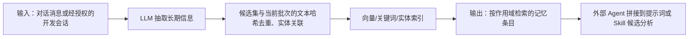

# Mem0：面向 Agent 的可插拔长期记忆层

> **项目快照**：官方仓库 <https://github.com/mem0ai/mem0>｜核验日期 2026-09-03｜Stars 约 64.6k｜许可证 Apache-2.0｜仓库在核验日有提交，最新 Release 为 `ts-v3.1.8`（2026-09-02）。[^mem0-repository][^mem0-license][^mem0-release]

> **需求画像**：目标是在多种开发 Agent 之间共享项目业务知识、技术决策和经过验证的经验，并支持从会话中提取可追溯的 Skill 更新候选。硬约束是可单机自部署、模型 API 可切换、后续能接入 Claude Code/Codex/Cursor 等不同 Agent；本轮接受通过适配器接入，Skill 只能生成候选而不能自动发布。

## 1. 项目要解决什么问题

### 目标用户与使用场景

Mem0 面向需要跨轮次、跨会话保持用户或 Agent 上下文的应用开发者。它以库、服务和云平台三种形态提供统一记忆 API，支持用户级、会话级和 Agent 级记忆。[^mem0-overview][^mem0-repository]

对于本项目，最接近的用法是在每次开发会话结束时提交选定消息，按项目、成员、Agent 和会话建立作用域；下一次会话开始时以任务描述检索相关业务约束、历史决策或失败经验。

### 当前问题

长会话直接塞进上下文会增加成本并淹没当前任务。Mem0 通过 `add`/`search` API 把持续信息抽取为较短的记忆条目，避免应用方自行维护摘要和召回索引。[^mem0-usage]

团队知识与个人记忆的生命周期不同。Python OSS API 使用 `user_id`、`run_id` 和 `agent_id` 作为作用域过滤条件；本项目的外部 `session_id` 需要映射到 Mem0 的 `run_id`，因而可分别实现个人、项目和 Agent 共享空间。[^mem0-repository][^mem0-source-main]

### 问题边界

Mem0 是记忆基础设施，不是开发会话采集器，也不负责发现某段本地 Claude Code 会话是否值得上传。原始会话筛选、脱敏、人工确认、Skill 候选评审和 Git 发布仍需在外部流程完成。

## 2. 设计的核心思路

### 核心判断

Mem0 的主张是：把对话中的长期有用事实交给一个独立记忆层处理，在写入时提取、对检索候选和当前批次按文本哈希去重并建索引，在读取时按查询召回；已有记忆的修改和删除通过显式 API 完成，而不是让每个 Agent 自己管理完整历史。其开源实现既可嵌入应用，也有带 API Key、Dashboard 和审计能力的自托管 FastAPI 服务。[^mem0-overview][^mem0-server][^mem0-source-main]

### Memory 实现方式

调用方通过 `add(messages)` 送入对话，LLM 抽取候选事实，随后做实体识别、Embedding 和基于文本哈希的去重，并按 `user_id`、`agent_id`、`run_id` 写入历史与向量库。`search` 将语义、BM25 和实体匹配结果融合后返回长期事实；`update`/`delete` 是显式 API，当前 `add(infer=True)` 路径不会因冲突自动更新或删除已有记忆，不保留完整 Agent transcript 作为主要检索对象。[^mem0-overview][^mem0-core][^mem0-source-main]

### 关键设计选择

- **多级作用域**：用户、会话和 Agent 维度的 ID 让同一 API 能覆盖个人偏好、一次任务上下文和跨 Agent 共享知识。[^mem0-repository]
- **混合检索**：基础路径是向量检索；可选 NLP 依赖提供 BM25 关键词匹配和实体抽取，用语义、关键词和实体信号补足开发术语的精确召回。[^mem0-repository]
- **模型与存储可替换**：官方文档列出多种 LLM、Embedding 和向量数据库配置，默认值是 OpenAI 模型，但不是架构上的唯一选择。[^mem0-models]
- **库与服务并存**：小规模 POC 可以 `pip install mem0ai` 直接嵌入；团队共享可运行自托管服务，统一鉴权、Dashboard 和 API。[^mem0-overview][^mem0-server]

### 向量化与模型接口核验

Mem0 OSS 的语义记忆路径需要 Embedding；官方 README 明确把 OpenAI `text-embedding-3-small` 列为默认 Embedding 模型，并建议混合搜索至少使用 Qwen 600M 或可比模型。官方配置页没有把一个固定向量维度写死在 Memory API 中，但明确提醒更换模型造成的维度不匹配会导致搜索错误，因此向量集合必须与当前模型输出维度一致。[^mem0-repository][^mem0-configuration]

Python OSS 支持 OpenAI、Gemini、Azure OpenAI、Ollama、Hugging Face、Vertex AI、AWS Bedrock 等 embedder；向量存储可选 Qdrant、pgvector、Chroma、Pinecone、Redis、Weaviate、Milvus、Elasticsearch 等。TypeScript OSS 的 embedder/向量存储枚举略有不同，不能把 Platform 的 Graph Memory 当作 OSS 能力。[^mem0-configuration]

公司 API 可按 OpenAI-compatible 方式验证，DeepSeek 只有在网关提供 Embedding 端点和实际模型时才能接入；DeepSeek 聊天 API 本身不能替代 Embedding。中文开发会话不应直接沿用英文默认模型，应在建库前选择多语言 Embedding，并以模型输出维度配置向量库；切换模型后需重建相关集合。[^mem0-configuration][^mem0-repository]

### 代价与取舍

抽取需要调用 LLM，因此每次写入会增加延迟和模型成本；当前默认写入路径不自动合并已有记忆，显式更新和删除由管理 API 完成。记忆的正确性取决于抽取提示和外部审核策略，不能将每条输出直接视为业务事实。调研判断：Mem0 更像“可插拔记忆服务”，而不是会主动理解整个代码仓库或自动产出 Skill 补丁的知识治理系统。

## 3. 项目如何工作

### 工作流概览



### 阶段说明

| 阶段 | 接收什么 | 做什么 | 产生的状态或产物 | 证据 |
| --- | --- | --- | --- | --- |
| 写入输入 | 消息列表、用户/会话/Agent ID | 通过 `Memory.add` 接收新事实 | 待处理记忆记录 | [^mem0-usage] |
| 抽取与去重 | 待处理消息及已有记忆 | LLM 只抽取新增候选；本地按文本哈希去重，并做实体关联 | 新增候选或空结果；显式 `update`/`delete` 另走管理 API | [^mem0-repository][^mem0-source-main] |
| 建索引 | 已确认记忆条目 | 生成 Embedding；可选 BM25 和实体信号 | 可检索记忆及作用域元数据 | [^mem0-models] |
| 召回输出 | 查询、过滤器、`top_k` | 组合相似度与过滤条件返回结果 | 相关记忆列表 | [^mem0-usage] |
| 应用消费 | 记忆列表和当前任务 | 外部 Agent 将条目放入上下文或交给分析器 | 带上下文的回答、报告或 Skill 候选 | 调研判断 |

### 关键状态与产物

- **记忆条目**：从对话中提取出的短文本及作用域字段，供下一次 `search` 使用。它不是原始会话的替代品；原始会话和证据片段应由外部归档系统保存。[^mem0-usage]
- **索引数据**：默认使用 Embedding/向量数据库，增强路径还包括关键词和实体信息。具体后端按配置选择，官方没有将某一种数据库作为唯一必需后端。[^mem0-models]
- **服务审计数据**：自托管 Server 提供 API Key、Dashboard 和请求审计日志，便于团队控制访问和追踪调用。[^mem0-server]

### 最终输出

调用方获得按用户、`run_id` 或 Agent 过滤的相关记忆。对 Skill 更新场景，建议将外部 `session_id` 映射为 Mem0 的 `run_id`，并同时与会话原始文件的不可逆 ID 绑定；外部分析器再把召回条目和原始证据组合为“修改候选”，进入人工评审。

### 源码实现核验：记忆抽取与持久化

以下结论按 Mem0 官方仓库 `main` 分支提交 `dae67f74f5cc7bf138c7d7d6f9cec5ce4b4373b3` 的源码阅读得出，未安装或运行项目。这里把“LLM 参与冲突处理”和“记忆层提供显式更新/删除 API”分开：当前源码的默认 `add(infer=True)` 是 **add-only 抽取**，不能按旧版提示词描述推断为自动的 ADD/UPDATE/DELETE 合并流程。[^mem0-source-main][^mem0-source-prompts]

#### 关键源码位置

| 官方源码路径 | 关键类/函数 | 核验到的职责 |
| --- | --- | --- |
| `mem0/memory/main.py` | `Memory.add`、`_add_to_vector_store`、`_create_memory` | 规范化作用域和 metadata；在 `infer=True` 时检索已有候选、调用 LLM 抽取、Embedding、按哈希去重并写入向量库；`infer=False` 则把每条非 system 消息直接作为记忆。 |
| `mem0/memory/main.py` | `Memory.search`、`_search_vector_store` | 生成查询向量，执行语义检索；可选执行 keyword/BM25 和实体匹配，再融合排序、过滤过期记忆并返回。 |
| `mem0/memory/main.py` | `Memory.update`、`_update_memory`、`Memory.delete`、`_delete_memory`、`Memory.history` | 显式更新、删除和历史查询；这些操作使用已有 memory ID，不是 `add` 中的冲突决策。 |
| `mem0/configs/prompts.py` | `ADDITIVE_EXTRACTION_PROMPT`、`generate_additive_extraction_prompt` | 当前新增记忆抽取提示词和输入组装；要求 JSON 的 `memory` 数组，条目可带 `text`、`attributed_to`、`linked_memory_ids`。 |
| `mem0/configs/prompts.py` | `DEFAULT_UPDATE_MEMORY_PROMPT`、`get_update_memory_messages` | 仍定义 ADD/UPDATE/DELETE/NONE 的通用更新提示词，但本次检索未发现它被当前 `Memory.add` 抽取路径调用；不能把这段提示词当作当前默认数据流的实现证据。 |
| `mem0/memory/storage.py` | `SQLiteManager`、`save_messages`、`get_last_messages`、`add_history`、`batch_add_history`、`get_history` | 持久化最近会话消息和 memory 变更历史；不是原始会话/来源对象存储。 |
| `mem0/embeddings/base.py` | `EmbeddingBase.embed`、`embed_batch` | Embedding 接口，`memory_action` 区分 `add`、`search`、`update`；批量接口默认逐条调用。 |
| `mem0/vector_stores/base.py`、`mem0/vector_stores/qdrant.py` | `VectorStoreBase`、`Qdrant.search`/`keyword_search`/`insert`/`update`/`delete` | 向量、可选稀疏 BM25、payload 和过滤器的后端接口；Qdrant 集合的 dense vector 维度来自配置。 |
| `mem0/utils/scoring.py` | `score_and_rank` | 将语义分数、归一化 BM25 分数和实体 boost 融合排序；阈值先作用于语义候选。 |

#### 1. 消息如何经 Agent/LLM 变成 Memory

1. `Memory.add` 先把 `user_id`、`agent_id`、`run_id` 规范化为作用域过滤器，并把非身份 metadata 复制到待写入 payload；至少一个作用域 ID 是必需的。字符串消息会被转成消息列表，视觉消息会先经 `parse_vision_messages` 处理。
2. 普通 `infer=True` 路径在 `_add_to_vector_store` 中读取该作用域 SQLite 会话最近 **10 条**消息，使用 `parse_messages` 把 system/user/assistant 内容整理成文本；然后对本次消息做一次查询 Embedding，并从向量库检索最多 10 条已有候选，给 LLM 做去重和关联的上下文。[^mem0-source-main][^mem0-source-utils]
3. LLM 请求由 `ADDITIVE_EXTRACTION_PROMPT`、可选的 `AGENT_CONTEXT_SUFFIX` 和 `generate_additive_extraction_prompt(...)` 组成，调用的是可插拔 LLM 的 `generate_response(...)`，并要求 JSON object。期望输出近似为：[^mem0-source-main][^mem0-source-prompts]

   ```json
   {"memory": [{"text": "自包含事实", "attributed_to": "user", "linked_memory_ids": ["已有记忆编号"]}]}
   ```

   `id`/`linked_memory_ids` 在提示词中用于关联上下文，但当前落库的新 memory 仍由源码生成新的 UUID；不能把模型返回的序号当作最终 memory ID。
4. 响应先经 `remove_code_blocks`，再 `json.loads`；JSON 解析失败时用 `extract_json` 从文本中截取 JSON。LLM 调用失败会包装为 `LLMError`；格式错误会记录，空响应则按“没有抽取到记忆”处理，同时仍保存输入消息。
5. 每条有效抽取文本用 `EmbeddingBase.embed_batch(..., "add")` 批量向量化，批量失败时逐条 fallback。随后生成 UUID、MD5 文本 hash、BM25 用的 `text_lemmatized`、`data`、创建/更新时间和作用域 metadata，批量 `vector_store.insert`；插入失败还会退回逐条插入。
6. 抽取后的文本还会批量实体抽取和实体关联，最后调用 `SQLiteManager.save_messages(messages, session_scope)` 保存本次原始消息的简化副本。没有有效抽取结果时也会保存消息，但不会生成 vector memory。

`infer=False` 不调用抽取 LLM，而是对每条非 system 消息直接 Embedding 并调用 `_create_memory`；消息的 `role` 和可用的 `name`（作为 `actor_id`）会进入该记忆的 metadata。`memory_type=procedural_memory` 且存在 `agent_id` 时走 `_create_procedural_memory`：LLM 按 `PROCEDURAL_MEMORY_SYSTEM_PROMPT` 生成执行过程摘要，再把摘要作为一条记忆向量化；这不是普通事实抽取。

#### 2. 更新、删除与冲突处理的真实边界

- **`add` 中的冲突处理是本地候选集去重，不是 LLM 冲突裁决。** `_add_to_vector_store` 只收集本次向量检索返回候选的 hash，并对每个新文本计算 `md5(text.encode())`；已检索候选中同 hash 的记忆或同一批次重复文本会跳过。这只是最多 10 个候选范围内的去重，不是全库精确去重。它不会因为“新事实与旧事实矛盾”而自动 UPDATE 或 DELETE 旧记录，也不会执行 `DEFAULT_UPDATE_MEMORY_PROMPT` 的 ADD/UPDATE/DELETE/NONE 事件流。
- **显式 `Memory.update`** 先按 ID 读取旧 payload；替换文本时用 `embed(..., "update")`，保留 `created_at`、刷新 `updated_at`、重算 hash 和 BM25 文本，合并 metadata 并拒绝修改身份字段，再调用 vector store 的 `update`，写入一条 `UPDATE` history。文本改变时会清理并重建实体链接；实体清理/重建失败不回滚向量更新。
- **显式 `Memory.delete`** 先确认 ID 存在，再删除向量并写入 `DELETE` history（旧文本保留、新文本为 `None`、`is_deleted=1`），随后尽力清理实体链接。`delete_all` 也只是按作用域分页列出后逐条调用 `_delete_memory`，没有跨后端原子批量删除。
- 向量库写入、SQLite history 写入和实体索引不是一个事务；批量失败时的逐条 fallback 可能留下部分成功状态。`history(memory_id)` 只查 SQLite，不验证向量库当前是否还有该 memory，因此删除后历史仍可读（前提是 history DB 未损坏）。

#### 3. Embedding、检索和排序

- `EmbeddingBase` 的接口是 `embed(text, memory_action)` 与 `embed_batch(texts, memory_action="add")`。源码把 `"add"`、`"search"`、`"update"` 传给配置的 embedder，但具体模型是否对不同 action 做不同处理由 provider 实现决定；基础接口没有固定维度。[^mem0-source-embeddings]
- `Memory.search` 将查询文本做 lemmatization、实体抽取并以 `embed(query, "search")` 得到向量；`_search_vector_store` 先做语义向量检索，后端支持时再做 `keyword_search`。`score_and_rank` 将语义、归一化 BM25 和实体 boost 相加后归一化排序，最后截取 `top_k`；`threshold` 先过滤语义分数过低的候选，BM25/实体分数不能把它们重新带回结果。可选 reranker 是后续步骤，不是默认必然存在。[^mem0-source-main][^mem0-source-scoring][^mem0-source-vector-base]
- Qdrant 适配器用配置的 `embedding_model_dims` 创建 cosine dense collection，并可创建名为 `bm25` 的稀疏向量槽；payload 中的 `text_lemmatized`/`data` 被用于关键词索引。更换 Embedding 模型而不重建与新维度匹配的 collection，会导致向量维度不兼容；官方源码没有在 Memory API 层自动迁移旧集合。[^mem0-source-qdrant]

#### 4. 历史、消息与来源持久化

- `MemoryConfig.history_db_path` 默认是 `~/.mem0/history.db`（也受 `MEM0_DIR` 影响）。`SQLiteManager.history` 表记录 `id`、`memory_id`、`old_memory`、`new_memory`、`event`、创建/更新时间、`is_deleted`、`actor_id` 和 `role`；`get_history` 按时间顺序返回全部变更，没有 retention limit。[^mem0-source-config][^mem0-source-storage]
- `messages` 表记录 `id`、`session_scope`、`role`、`content`、`name` 和 `created_at`。`save_messages` 会插入本次消息，但随后只保留该 scope 最新 10 条；它没有原始会话文件 ID、消息来源 URL、分支、模型、工具调用、脱敏状态或引用片段字段，且同一保存批次共用一个时间戳。[^mem0-source-storage]
- 向量 payload 能保存任意非身份 metadata，因此调用方可以把 `source`、原始会话不可逆 ID 或文件路径作为普通 metadata 写入；源码没有特殊的来源对象、引用链或证据校验机制。历史表也不会自动复制这些任意 metadata，所以“source 存在 payload”不等于“每一次 UPDATE/DELETE 都有可追溯原始证据”。
- `MemoryItem` 主要暴露 `id`、`memory`、`hash`、`metadata`、`score`、`created_at`、`updated_at`；不存在独立的必填 `source` 字段。因而本项目要实现可审计 Skill 候选，仍需在 Mem0 外部保存完整原始会话、消息片段、模型/提示版本、来源关联和人工评审状态。[^mem0-source-config]

#### 核验后的结论与限制

1. “LLM 抽取 + Embedding + 语义/BM25/实体检索”是当前 OSS 主路径；“冲突时自动 UPDATE/DELETE”不是当前 `add(infer=True)` 的实际行为，而是显式管理 API 或未被该路径调用的旧/通用更新提示词能力。
2. Mem0 的 history 是 memory 变更日志，SQLite messages 是受限的最近消息上下文，不是完整 Agent transcript 或来源证据库；默认只保留每个 session scope 最近 10 条消息。
3. 来源信息可以通过 metadata 自行附带，但没有一等来源模型、引用链和跨向量库/SQLite 的事务；这正是开发会话 Skill 候选场景必须外置的证据治理部分。
4. 因此报告前文的“更新/删除由记忆层完成”应理解为显式 `update`/`delete` API，而不是抽取阶段的自动冲突合并；本节源码核验优先于旧版提示词或论文中的抽象描述。

## 4. 与需求画像逐项对照

### 需求矩阵

| 需求项 | 优先级或硬约束 | 项目现有能力 | 证据 | 状态 | 说明 |
| --- | --- | --- | --- | --- | --- |
| 项目业务知识长期保存 | 必须 | 多级记忆与持久化检索 | [^mem0-repository] | 满足 | 需设计项目级 ID/过滤规则 |
| 技术决策和经验可检索 | 必须 | 文本记忆条目、向量/关键词检索 | [^mem0-usage][^mem0-models] | 部分满足 | 决策冲突、来源和证据链需外部元数据治理 |
| 接收完整开发会话 | 必须 | `add` 接受消息列表 | [^mem0-usage] | 部分满足 | 没有本地 Claude Code 会话发现、上传审批和原始文件归档流程 |
| 多 Agent 接入 | 必须 | Python/Node SDK、HTTP API、多个框架集成 | [^mem0-repository] | 满足 | 各 Agent 仍需自行做事件格式适配 |
| 模型 API 可切换 | 必须 | 支持多种 LLM 与 Embedding 配置 | [^mem0-models] | 满足 | 公司 API/DeepSeek 需验证 OpenAI 兼容参数和模型名 |
| 单机自部署 | 必须 | 自托管 FastAPI Server + Docker Compose | [^mem0-server] | 满足 | 依赖数量需按实际 compose 配置核验 |
| 用户主动控制原始会话上传 | 期望 | API 本身不强制自动上传 | [^mem0-overview] | 部分满足 | 上传确认和权限流程需要在客户端/网关实现 |
| Skill 候选可追溯、人工发布 | 必须 | 记忆 API 可保存候选摘要 | [^mem0-usage] | 部分满足 | 原始片段、评审状态、Git 变更和验证结果需外置 |

### 对照归纳

Mem0 直接覆盖“把整理后的业务知识和经验存起来、跨 Agent 检索出来”以及单机服务化。缺口集中在原始开发会话的采集与治理、来源链和 Skill 变更工作流；因此不能单独承担完整闭环。

## 5. 开源与能力边界

### 边界清单

| 能力 | 开源核心 | 商业版或 SaaS | 外部依赖 | 证据 |
| --- | --- | --- | --- | --- |
| Python/Node 记忆库 | 有，Apache-2.0 | 平台 SDK 另行提供 | 配置的 LLM、Embedding、向量存储 | [^mem0-license][^mem0-overview] |
| 自托管 API 与 Dashboard | 有，仓库 `server` 目录 | 云平台提供零运维托管和高级功能 | Docker、数据库/向量后端、模型 API | [^mem0-server] |
| 多级记忆、搜索和更新 | 有 | 云平台有额外高级能力 | LLM 与 Embedding | [^mem0-repository][^mem0-models] |
| 请求审计、API Key | 自托管 Server 有基础能力 | SaaS 有更完整运营能力 | 自建鉴权/反向代理可补充 | [^mem0-server] |

### 边界判断

“有 Cloud Platform”不能等价为必须购买云服务；官方同时给出 OSS 库和自托管 Server。反过来，库形态不自带团队权限、会话上传审批或审计 UI；这些能力只有在自托管 Server 或外部治理层中才成立。[^mem0-overview][^mem0-server]

## 6. 用户如何接入和使用

### 接入前提

- 选择 Python/Node SDK 或自托管 HTTP Server；准备可配置的 LLM、Embedding 和存储后端凭据。[^mem0-models]
- 若使用增强混合检索，安装 NLP extra 和对应 spaCy 模型；这会增加本地依赖。[^mem0-repository]
- 为用户、项目、Agent、会话和原始会话文件建立稳定作用域 ID。

### 最快验证路径

1. 以库模式安装 `mem0ai`，或在 `server` 目录按官方说明执行 `make bootstrap`/`docker compose up -d`，得到 API 和 Dashboard。[^mem0-server]
2. 配置公司 API 或 DeepSeek 的 Base URL、模型名、Embedding，以及向量/数据库后端；用 `Memory.add` 写入经授权的消息。[^mem0-models][^mem0-usage]
3. 在 Agent 启动前用 `search(query, filters, top_k)` 召回，结束后将经过筛选的消息写回；将候选经验和原始证据 ID 交给外部评审服务。

### 日常使用方式

调用方在会话前检索项目/用户范围的知识，在会话后写入新的事实或决策。管理员通过 Server Dashboard、API Key 和审计日志管理团队使用情况。[^mem0-server]

### 接入限制

Mem0 没有声明原生读取各类 IDE/CLI 会话文件，也没有声明 Claude Code/Codex/Cursor 统一事件协议；需要编写本地采集器和 Agent 适配器。官方支持的模型列表和具体 Base URL 参数应在 POC 中用公司 API/DeepSeek 各验证一次。[^mem0-models]

## 7. 部署构成

### 运行组件

| 组件 | 必需或可选 | 职责 | 持久化数据 | 与其他组件的关系 | 证据 |
| --- | --- | --- | --- | --- | --- |
| Mem0 SDK/Server | 必需（选一） | 提供记忆写入、更新和搜索 API | 记忆元数据、请求日志（Server） | 调用 LLM/Embedding 与存储后端 | [^mem0-overview][^mem0-server] |
| PostgreSQL + pgvector 或其他向量后端 | 依部署配置 | 持久化向量和记忆数据 | 向量、条目、作用域 | 被 Server/SDK 访问 | [^mem0-server][^mem0-models] |
| LLM 服务 | 必需 | 抽取记忆；当前默认写入路径不自动合并，可参与检索增强 | 通常无本地持久化 | 由 SDK/Server 调用 | [^mem0-models][^mem0-source-main] |
| Embedding 服务/模型 | 必需的检索路径 | 生成查询和记忆向量 | 模型缓存（可选） | 被向量后端使用 | [^mem0-models] |
| Dashboard 与认证 | Server 可选/随 Server 提供 | 管理、API Key 和审计 | 账号与审计数据 | 访问 Server API | [^mem0-server] |
| NLP 依赖（BM25/实体） | 可选 | 增强关键词与实体检索 | 本地模型缓存 | SDK 处理写入/查询 | [^mem0-repository] |

### 最小部署路径

最小 POC 可以在应用进程中安装库，接入可切换的 LLM、Embedding 与持久化后端；团队共享场景可按官方 Server 目录运行 Docker Compose，再通过 API Key 调用。官方自托管说明明确给出本地 `docker compose up -d` 和浏览器向导。[^mem0-server]

### 生产化仍需考虑

- 为原始会话和记忆条目分开设定保留、删除、项目隔离和访问审计策略。
- 需要对 LLM/Embedding Base URL、超时、重试和成本做统一配置；官方未给出本项目场景的最低 CPU、内存或吞吐要求，需实测。
- 为 PostgreSQL/向量数据建立备份与恢复演练；将候选变更和 Git 验证结果放在可审计系统，不仅依赖记忆条目。

## 8. 适配结论与能力缺口

### 适配结论

**条件匹配。** Mem0 的开源记忆 API、自托管 Server、多级作用域和可替换模型能满足共享业务知识的核心路径；但它不负责读取本地开发会话、保存完整原始证据、生成 Skill 差异或走人工发布，因此必须增加采集和治理层。

### 已满足能力

- 记忆写入、更新和按作用域检索，可承载项目级业务知识与经验条目。[^mem0-usage]
- Python/Node 与 HTTP 接入方式适合多 Agent 适配。[^mem0-repository]
- 官方提供自托管 Server、认证、Dashboard 和 Docker Compose 路径。[^mem0-server]
- LLM、Embedding 和部分存储后端可配置，适配公司 API/DeepSeek 的方向明确。[^mem0-models]

### 能力缺口

- **会话采集与授权上传**：需本地读取 Claude Code 等会话格式，并在上传前由用户选择；Mem0 本身只接收调用方提供的消息。
- **来源和版本治理**：需保存消息片段、原始文件 ID、提取时间、项目分支、Skill 版本和评审人。
- **Skill 更新闭环**：需另建候选生成、Git PR、回归任务和效果指标，避免把自动抽取结果直接当规则发布。
- **冲突与事实审核**：业务知识更新的有效性、过期和冲突策略需由项目治理层定义。

### 需要自研或外部补齐

- 本地会话选择/上传客户端与多 Agent 事件归一化适配器。
- 原始会话对象存储、检索证据页和权限审计。
- Skill 候选生成器及 Git 评审/验证流水线。

### 否决风险

当前未发现硬性否决项；主要风险是把“记忆检索”误当成“开发经验治理”，导致没有原始证据和可验证的 Skill 变更。

---

[^mem0-repository]: [Mem0 官方 GitHub 仓库](https://github.com/mem0ai/mem0)
[^mem0-license]: [Mem0 Apache-2.0 许可证](https://github.com/mem0ai/mem0/blob/main/LICENSE)
[^mem0-release]: [Mem0 Releases](https://github.com/mem0ai/mem0/releases)
[^mem0-overview]: [Mem0 OSS Overview](https://docs.mem0.ai/open-source/overview)
[^mem0-server]: [Mem0 Self-Hosted Server README](https://github.com/mem0ai/mem0/blob/main/server/README.md)
[^mem0-usage]: [Mem0 官方基本用法](https://github.com/mem0ai/mem0#basic-usage)
[^mem0-models]: [Mem0 Supported LLMs and Embeddings](https://docs.mem0.ai/components/llm-models)
[^mem0-paper]: [Mem0 技术论文](https://arxiv.org/abs/2504.19413)
[^mem0-configuration]: [Mem0 OSS 配置：Embedder、向量存储与维度兼容性](https://github.com/mem0ai/mem0/blob/main/docs/open-source/configuration.mdx)
[^mem0-core]: [Mem0 Memory 核心编排源码](https://github.com/mem0ai/mem0/blob/main/mem0/memory/main.py)
[^mem0-source-main]: [Mem0 `mem0/memory/main.py`（源码核验，commit `dae67f7`）](https://github.com/mem0ai/mem0/blob/dae67f74f5cc7bf138c7d7d6f9cec5ce4b4373b3/mem0/memory/main.py)
[^mem0-source-prompts]: [Mem0 `mem0/configs/prompts.py`（抽取与更新提示词，commit `dae67f7`）](https://github.com/mem0ai/mem0/blob/dae67f74f5cc7bf138c7d7d6f9cec5ce4b4373b3/mem0/configs/prompts.py)
[^mem0-source-storage]: [Mem0 `mem0/memory/storage.py`（SQLite history/messages，commit `dae67f7`）](https://github.com/mem0ai/mem0/blob/dae67f74f5cc7bf138c7d7d6f9cec5ce4b4373b3/mem0/memory/storage.py)
[^mem0-source-config]: [Mem0 `mem0/configs/base.py`（MemoryConfig/MemoryItem，commit `dae67f7`）](https://github.com/mem0ai/mem0/blob/dae67f74f5cc7bf138c7d7d6f9cec5ce4b4373b3/mem0/configs/base.py)
[^mem0-source-embeddings]: [Mem0 `mem0/embeddings/base.py`（EmbeddingBase，commit `dae67f7`）](https://github.com/mem0ai/mem0/blob/dae67f74f5cc7bf138c7d7d6f9cec5ce4b4373b3/mem0/embeddings/base.py)
[^mem0-source-vector-base]: [Mem0 `mem0/vector_stores/base.py`（VectorStoreBase，commit `dae67f7`）](https://github.com/mem0ai/mem0/blob/dae67f74f5cc7bf138c7d7d6f9cec5ce4b4373b3/mem0/vector_stores/base.py)
[^mem0-source-qdrant]: [Mem0 `mem0/vector_stores/qdrant.py`（Qdrant backend，commit `dae67f7`）](https://github.com/mem0ai/mem0/blob/dae67f74f5cc7bf138c7d7d6f9cec5ce4b4373b3/mem0/vector_stores/qdrant.py)
[^mem0-source-scoring]: [Mem0 `mem0/utils/scoring.py`（混合排序，commit `dae67f7`）](https://github.com/mem0ai/mem0/blob/dae67f74f5cc7bf138c7d7d6f9cec5ce4b4373b3/mem0/utils/scoring.py)
[^mem0-source-utils]: [Mem0 `mem0/memory/utils.py`（消息/JSON 解析，commit `dae67f7`）](https://github.com/mem0ai/mem0/blob/dae67f74f5cc7bf138c7d7d6f9cec5ce4b4373b3/mem0/memory/utils.py)
