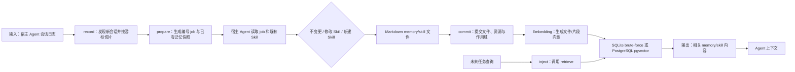

# MemU：面向主动记忆与多 Agent 的记忆编排

> **项目快照**：官方仓库 <https://github.com/NevaMind-AI/memU>｜核验日期 2026-09-05｜Stars 约 14.4k｜许可证 Apache-2.0。最新稳定发布为 `v1.5.1`（2026-03-23），最新标记版本为 prerelease `v2.0.0-beta.0`（2026-07-23）；本报告同时参考截至 2026-09-04 的 `main` commit `385bdb3`。发布标签与持续演进的 `main` 不能无条件视为同一版本。[^memu-repository][^memu-license][^memu-release][^memu-main-commit]

> **需求画像**：目标是在 Claude Code 等开发 Agent 之间保存项目业务知识、技术决策和经过验证的开发经验，并把有价值的经历转化为可复用 Skill。必须优先支持单机/内网部署、可切换模型接口和多个 Agent；原始会话是否上传、候选 Skill 的人工评审与最终发布由外部治理流程控制。

## 1. 项目要解决什么问题

### 目标用户与使用场景

MemU 面向需要跨会话、跨 Agent 和跨设备复用个人记忆的 Agent 使用者。官方将它定义为“存储为 Wiki 的个人记忆”，核心产物是可被 Agent 继续使用的 memory/skill 文件，而不是只在一次对话中有效的上下文窗口。[^memu-readme]

对本项目最接近的场景是：开发者使用 Claude Code、Codex、Cursor 或其他 Agent 完成任务；宿主适配器读取本地会话历史，定时生成待处理任务；Agent 从会话中提炼项目知识、工具使用经验和 Skill Markdown；之后新的 Agent 会话在回答前检索并注入相关记忆。README 当前列出 Claude Code、Codex、Cursor、OpenClaw、Hermes、WorkBuddy、Cola 和 generic agent 等宿主。[^memu-readme][^memu-hosts]

### 当前问题

开发 Agent 的会话通常保存在本地目录，任务完成后其中的约束、踩坑和有效操作难以被后续会话复用。MemU 通过宿主适配器扫描会话历史，把一次会话加工成可供 Agent 判断的 job，而不是要求开发者手工复制整段聊天记录。[^memu-claude-bridge]

单纯保存原始日志会带来上下文过长、检索噪声和难以阅读的问题。在 host bridging 和 developer memorize 的 Skill 自演化阶段，MemU 让外部 Agent 先决定是否值得保存、应创建或修改哪个 Markdown Skill，再由 MemoryService 负责保存、向量化和检索已产生的文件。MemoryService 本身是 embedding-only，不做聊天式总结；但 v2.0.0-beta.0 同时加入了多 provider 的 LLM/VLM、富文档、音频和视频处理能力，不能把这一限制扩展为整个 memU 包都没有 LLM/VLM 处理组件。[^memu-readme][^memu-service][^memu-developer]

跨 Agent 复用还需要稳定的接入缝隙。MemU 将“record”（读取宿主会话、生成自演化 job）和“inject”（在宿主指令文件中加入检索规则）分成两条 seam，并为不同宿主提供独立二进制或 generic adapter。[^memu-skill][^memu-readme]

### 问题边界

MemU 不是完整的团队会话管理平台。它提供宿主本地日志的发现、记忆文件提交和检索，但没有在本地核心路径中提供成员目录、统一 Web 会话浏览、上传审批、SSO 或组织级审计；官方自托管说明将本地模式定位为 private、single-device，并要求配置 Embedding key。当前 Cloud 路径还对 workspace resource 有单独边界：Cloud 接受该输入以保持 API 兼容，但不会持久化或检索 workspace resources。[^memu-readme][^memu-cloud-adr]

它也不保证“原始会话文件”就是长期记忆的最终产物。Claude Code 适配器会按游标读取 `~/.claude/projects/<project>/<session>.jsonl` 的新增片段，经过清洗后作为临时提炼输入；当前路径不会自动持久化或回放完整原始 transcript。是否保存原文、原文如何归档以及来源如何关联，需要在 MemU 外部建立规则。[^memu-readme][^memu-claude-bridge][^memu-claude-sessions]

## 2. 设计的核心思路

### 核心判断

MemU 的核心判断是：让连接的 Agent 负责“理解和写作”，让轻量 MemoryService 负责“存储、Embedding 和检索”。这样记忆内容保留为可读的 Markdown，检索路径可以跨宿主共享，系统本身不必在每次查询时再次调用 LLM。[^memu-service][^memu-readme]

### Memory 实现方式

宿主 Agent 通过 adapter/job 从会话中判断要保存的事实或 Skill，并写成 Markdown 文件；`MemoryService` 为文件和片段建立元数据、作用域与 Embedding，保存到 SQLite 或 PostgreSQL/pgvector。后续 Agent 用 `retrieve` 做向量检索；底层检索 API 返回文件记录，而宿主侧 `retrieve` 对可映射 track 通常返回镜像文件的 `path`，需要时再读取完整内容，无法映射的文件才内联返回 `content`。MemoryService 不负责聊天式总结或事实判断。对外部输入也可使用 developer memorize API，把规范化消息、tool call 和 tool result 交给 prepare/commit 流程；该流程仍把原始 transcript 作为临时提炼输入，而不是原文归档。[^memu-service][^memu-readme][^memu-developer][^memu-input]

### 关键设计选择

- **Wiki/Markdown 作为记忆载体**：memory 和 skill 以有名称、有描述、有正文的文件形态进入系统，用户可以查看或修改文件；`commit_results` 将 Agent 实际产生的文件变化提交到存储并建立索引。[^memu-readme][^memu-agentic]
- **record 与 inject 分离**：record 由定时桥接任务扫描宿主会话，生成自演化 job；inject 通过修改宿主的 `CLAUDE.md`、`AGENTS.md` 等指令文件，让未来任务先调用 retrieve。两条 seam 可以分别验证和替换。[^memu-skill][^memu-claude-bridge]
- **Agent 主导的 Skill 演化**：job 会让 Agent 读取已有 Skill，并选择不做任何修改、patch 既有 Skill 或创建新 Skill；提交阶段只把 Agent 真正写入或修改的文件送回 MemU。[^memu-readme][^memu-claude-bridge]
- **渐进检索但不增加查询 LLM**：`progressive_retrieve` 对文件和资源层使用向量相似度排名，当前配置说明明确表示不做路由、充分性判断或查询摘要；结果可按 track 过滤，例如 `memory` 或 `skill`。[^memu-settings][^memu-agentic]
- **存储后端可替换**：in-memory 适合测试，SQLite 是本地默认路径，PostgreSQL + pgvector 用于并发访问和较大规模存储；数据库工厂和服务组合根将存储与 Embedding 客户端分离。[^memu-readme][^memu-service][^memu-settings]
- **混合检索是架构提案，不应当作当前实现**：ADR 0007（2026-07-01，状态为 Proposed）提议三条 memory line 共用记录、切片、Embedding、混合搜索和 Markdown 渲染内核，并规划 L2 的 Embedding + BM25 融合；截至核验的源码，`progressive_retrieve` 仍以向量检索为主，不能据此宣称 BM25 已在当前 MemoryService 路径落地。[^memu-adr][^memu-agentic]

### 向量化模型、接口与检索后端

MemU 的核心 MemoryService 是 Embedding-only：写入或查询时调用 Embedding client，不调用 LLM/chat。默认 provider 是 `openai`，默认模型是 `text-embedding-3-small`；当前 `defaults.py` 还登记了以下 provider 和默认模型：[^memu-service][^memu-embedding-defaults]

| provider     | 官方默认 Embedding 模型                    | 官方默认 endpoint/API key 环境变量                          | 备注                         |
| ------------ | ------------------------------------ | --------------------------------------------------- | -------------------------- |
| `openai`     | `text-embedding-3-small`             | `https://api.openai.com/v1` / `OPENAI_API_KEY`      | 默认配置                       |
| `jina`       | `jina-embeddings-v3`                 | `https://api.jina.ai/v1` / `JINA_API_KEY`           | 使用 provider 默认 endpoint    |
| `voyage`     | `voyage-3.5`                         | `https://api.voyageai.com/v1` / `VOYAGE_API_KEY`    | README 明确列为可选 provider     |
| `doubao`     | `doubao-embedding-large-text-250515` | `https://ark.cn-beijing.volces.com` / `ARK_API_KEY` | 火山引擎兼容路径                   |
| `openrouter` | `openai/text-embedding-3-small`      | `https://openrouter.ai` / `OPENROUTER_API_KEY`      | 通过 OpenRouter 路由 Embedding |

配置通过 `MEMU_EMBED_PROVIDER`、`MEMU_EMBED_MODEL`、`MEMU_BASE_URL` 和 `MEMU_API_KEY` 覆盖默认值；Python API 也接受命名 `embedding_profiles`。Embedding client 有 `sdk` 和 `httpx` 两种 transport，后者通过通用 HTTP 请求和 endpoint override 适配列出的 provider。[^memu-readme][^memu-settings][^memu-gateway]

因此，公司内部的 OpenAI-compatible Embedding 服务可以按 `provider=openai`、自定义 `base_url` 和模型名接入，前提是服务实现 MemU 所需的 embeddings 请求格式。DeepSeek 不能仅因为支持聊天 API 就视为可用 Embedding provider：当前官方 provider 默认表没有 `deepseek`，需验证公司网关是否为 DeepSeek 或其他模型提供 OpenAI-compatible `/embeddings` 端点；如果没有，必须另选 Jina、Voyage、豆包、OpenRouter 或自建兼容 Embedding 服务。[^memu-embedding-defaults][^memu-settings]

存储层决定向量搜索形态。SQLite 和 in-memory 使用 brute-force cosine；PostgreSQL 配置会自动选择 pgvector，适合多个宿主共享较大存储。README 当前没有把 Qdrant、Milvus 或 Elasticsearch 列为内置后端，因此引入这些组件需要自行实现 Database 接口或把它们放在外部检索层。[^memu-readme][^memu-settings][^memu-agents]

### 代价与取舍

Agent 主导的提炼保留了自然语言 Skill 和业务判断，但质量依赖执行自演化 job 的模型、提示和权限配置；MemoryService 本身不会替用户判断事实是否正确。调研判断：这适合快速试点“开发经历如何成为 Skill 候选”，但不等于自动产生可直接发布的生产 Skill。

SQLite 的 brute-force cosine 适合单机和小规模存储，规模增大或多人并发时要切换 PostgreSQL + pgvector；切换后仍需管理 PostgreSQL 服务和向量维度一致性。官方未给出本项目场景的容量、吞吐或内存基准，不能从 Stars 或“轻量”描述推导资源数字。[^memu-readme][^memu-settings]

## 3. 项目如何工作

### 工作流概览

### 开发者 memorize API

除宿主 adapter 外，当前开发者接口提供 `memu memorize prepare <payload.json|-> --json` 与 `memu memorize commit --json`。调用方可以把选定会话转换为 `MemorizeInput`（schema 1.0），其中包含 message、tool call 和 tool result；memory projection 主要使用消息，skill projection 使用全部事件。prepare 仍由外部 Agent 执行生成或修改文件，成功 commit 后临时 transcript projection 会被清理，因此该入口允许调用方控制会话边界，但不等于 MemU 保存完整原始 transcript。[^memu-developer][^memu-input][^memu-lifecycle]

### 阶段说明

| 阶段 | 接收什么 | 做什么 | 产生的状态或产物 | 证据 |
| --- | --- | --- | --- | --- |
| 会话发现 | Claude Code 等宿主的本地日志 | 适配器按游标读取新增文件或新增行，并维护宿主会话状态 | 待处理会话集合、session manifest；不是完整原始 transcript 归档 | [^memu-readme][^memu-claude-bridge][^memu-claude-sessions] |
| 外部会话输入 | 调用方选定并规范化的 `MemorizeInput` | `memorize prepare` 校验 payload，生成临时提炼输入和 job | schema 1.0 payload、临时 transcript projection | [^memu-developer][^memu-input][^memu-lifecycle] |
| Job 准备 | 新会话、现有 memory/skill 快照 | `prepare` 按会话生成自包含 job，写入宿主工作目录 | `jobs/1.txt`、`jobs/2.txt` 等 | [^memu-claude-bridge][^memu-developer] |
| Agent 自演化 | job 指令、相关 Skill、代码工作区 | 连接的 Agent 判断是否提炼记忆、修改 Skill 或跳过 | Markdown memory、`SKILL.md`、资源描述 | [^memu-readme][^memu-claude-bridge] |
| 提交与索引 | Agent 实际变更的文件 | `commit` 计算快照差异，调用 `commit_results` 写入文件/资源并生成 Embedding | RecallFile、RecallFileSegment、资源记录及向量 | [^memu-agentic][^memu-service] |
| 未来检索 | 查询文本、scope、top_k | 查询向量与文件/资源层相似度排名，按 track 和作用域过滤 | 相关 memory/skill 文件内容 | [^memu-settings][^memu-agentic] |
| 上下文注入 | 检索结果 | 宿主指令文件要求 Agent 在回答前运行对应 adapter 的 `retrieve` | 当前任务可消费的记忆片段 | [^memu-readme][^memu-skill] |

### 关键状态与产物

- **宿主 session manifest**：记录已读取的会话位置，使定时 `prepare` 只处理新增内容。Claude Code 适配器的日志来源是 `~/.claude/projects/<project>/<session>.jsonl`；Codex、Cursor 等宿主有各自路径。它记录增量处理状态，不代表原始 transcript 已被完整归档。[^memu-readme][^memu-claude-bridge][^memu-claude-sessions]
- **自演化 job**：位于 `~/.memu/hosts/<host>/jobs/` 的编号文件，携带本次任务需要的路径和上下文。job 允许“什么也不做”，因此没有新知识时不会强行生成记忆。[^memu-claude-bridge]
- **RecallFile 与 RecallFileSegment**：文件是可返回的较粗粒度记忆对象，片段是用于 Embedding/排名的搜索单元；服务入口会把提交、渐进检索和文件列表暴露给宿主。`commit_results.resource` 可携带 workspace resource，但当前 Cloud 后端接受该字段仅为保持 API 兼容，不会持久化或检索 workspace resource。[^memu-service][^memu-agentic][^memu-cloud-adr]
- **track 与作用域**：文件可按 `memory`、`skill` 等 track 区分；`UserConfig` 默认含 `user_id`、`agent_id`，查询 filter 会依据配置的 user model 校验。项目级隔离不能仅凭 README 的“跨 Agent”宣传推定，需要设计并传递稳定的 project scope；host CLI 的 `retrieve` 主要接受 query，复杂的 `where` 过滤属于 Python API/自建 wrapper 能力。[^memu-settings][^memu-agents]
- **Embedding profile**：可为不同用途配置命名 Embedding profile；profile 包含 provider、Base URL、API key、模型、批大小和 transport。`RecallFile`、`RecallFileSegment` 和 `Resource` 模型保存 embedding 数组，但不保存 provider、model 或 dimension 元数据；变更模型时必须由外部流程管理历史索引重建和维度兼容。[^memu-settings][^memu-gateway][^memu-models]

### 最终输出

正常使用时，未来 Agent 得到与当前问题相关的 memory 或 skill Markdown，并将其放入自己的上下文。对本项目而言，最有价值的输出不是一条不可追溯的摘要，而是“可读 Skill 文件 + 来源会话/任务标识 + 可在后续会话检索的索引”。不过来源会话、审批状态和 Git PR 关系需要由团队在 MemU 之外保存，不能从 RecallFile 自动推断。

### 3.1 源码实现核验（官方 `main`）

> 本节按官方仓库 `main` 的提交 `385bdb30cda7f5265368934b8008ce2b73283283` 核验，重点区分“概念上的 record/inject seam”和源码中真正存在的函数。源码没有一个名为 `Agentic write` 的独立 API；所谓 Agentic write 是外部 Agent 执行 job、写 Markdown，再由 MemU 读取变更并提交的组合流程。[^memu-source-cli][^memu-source-pipeline][^memu-source-instructions]

#### 术语与真实入口

| 报告中的概念 | 官方源码真实入口 | 实际职责 | 不应作的推断 |
| --- | --- | --- | --- |
| record | `src/memu/hosts/bridging/transcripts.py::prepare_transcripts`；宿主命令由 `src/memu/hosts/host_cli.py::_cmd_prepare` 接入 | 发现会话、按宿主游标读取新增记录、生成 memory/full 两种临时 JSONL，并把新游标写到 `.pending` | 不是一个独立的 `record()` API，也不是原始会话归档服务 |
| prepare | `src/memu/hosts/bridging/pipeline.py::prepare`；开发者输入路径另有 `app/memorize/lifecycle.py::prepare_memorize` | 镜像当前 RecallFile、建立内容快照、生成编号 job；或把 `MemorizeInput` 投影为临时 transcript 后生成 job | 不负责让 LLM 自动总结；中间的自演化是外部 Agent 工作 |
| commit | `pipeline.py::commit`、`app/memorize/lifecycle.py::commit_memorize` | 对 Markdown 工作区做快照 diff，读取 RecallFile/Resource，调用 `commit_results`，成功后推进状态并清理临时文件 | 不是事务性 Git commit，也没有人工审批或质量门禁 |
| retrieve | `src/memu/hosts/retrieval.py::retrieve`，内部调用 `AgenticMixin.progressive_retrieve` | 单次查询 Embedding 后返回 segments/files/resources，并把可镜像的文件写回 `~/.memu/memory` 或 `~/.memu/skill` | 不是 LLM 重排、意图路由或摘要生成 |
| inject | `src/memu/hosts/instruction.py::install`、`patch`、`install_skill`；真正执行查询的仍是 `retrieval.py::retrieve` | 在 `CLAUDE.md`/`AGENTS.md` 等宿主指令中安装受 marker 管理的检索规则，或安装 `memu-retrieve/SKILL.md` | 没有一个独立的 `inject()` 函数；inject 是“指令文件指向 retrieve”的接入 seam |

#### record/prepare：两种输入路径和游标语义

宿主 bridging 路径的核心在 `prepare_transcripts`。它按 `TranscriptSource.discover()` 的最新修改时间倒序扫描，调用 `read_incremental(path, previous)` 解释每个会话的游标；对已有且未变化的区域会停止向更旧文件扩展，对有新增记录的会话按 `max_jobs` 截取，最后以旧到新的顺序写出 `<idx>.jsonl`（仅消息）和 `<idx>_full.jsonl`（消息加工具调用/结果）。`_split` 只保留 `RecordKind.MESSAGE` 和 `RecordKind.TOOL`，其他类型丢弃。[^memu-source-transcripts][^memu-source-base]

Claude Code 的 `ClaudeCodeTranscriptSource` 将 `~/.claude/projects` 作为根目录，递归发现顶层和 subagent JSONL；`classify` 交给 `classify_claude_record`，`sanitize` 从记录和嵌套 message 中移除若干私有元数据。当前实现把文本或普通 user message 视为 conversation，把 `tool_use`/`tool_result` 视为 tool；仅含 `thinking` 的记录会被排除，但同时含 `text` 与 `thinking` 的多块记录按 conversation 保留，投影中仍可能包含原始 `thinking` block；`isMeta`、system、summary 等记录则不是挖掘输入。它仍然是对宿主本地日志的筛选投影，不是完整日志的独立副本。[^memu-source-claude-session][^memu-source-claude-records]

游标不会在 `prepare` 阶段直接成为 durable 状态：`prepare_transcripts` 将推进后的 manifest 写入 `session_manifest_pending`，`pipeline.commit` 只有在 `backend.commit_results` 成功后才用 `os.replace` 将其提升为正式 manifest。成功提交后，`pipeline.commit` 删除 `jobs/*.txt`、`sessions/*.jsonl` 和资源临时日志；中途失败则保留这些材料，以便下一轮 leftovers 重试。这是“成功后推进游标”的可靠性设计，但不是原始 transcript 保留策略。[^memu-source-transcripts][^memu-source-pipeline]

开发者显式输入路径则使用 `MemorizeInput`：schema 版本固定为 `1.0`，至少一个 `MessageInput`，还可包含 `ToolCallInput` 和 `ToolResultInput`。`project_memory` 只保留 user/assistant 消息，`project_skill` 保留全部有序事件；`materialize_memorize_input` 将两种投影写为 `input/1.jsonl` 和 `input/1_full.jsonl`。`commit_memorize` 成功后删除这些 JSONL、job、resource 文件和 active-run marker，因此它们是提炼工作区，不是 canonical transcript store。[^memu-source-input][^memu-source-materialize][^memu-source-lifecycle]

#### Agentic write：Agent 写作，MemU 只接收结果

`prepare_instruction_jobs` 生成的 memory/skill job 是实际的 Agent 写作契约：

- memory job 读取只含消息的 transcript 和已有 memory 文件，按“do nothing / patch existing / create new”三选一；
- skill job 读取含工具调用和工具结果的 full transcript，按同样的三选一规则创建或修改 Skill，并额外扫描 Agent 在本次会话中创建或更新的资源路径；
- memory job 编号在前，skill job 编号在后，资源描述 job 最后，数字顺序是有意的依赖关系；“不产生文件”是正常结果，不会强迫每次会话生成记忆。

写作约束主要来自模板，而非 Python 类型系统：文件应为带简单 YAML-like frontmatter 的 Markdown，至少包含 `name` 和 `description`。`write_recall_file` 将已有结果镜像为 `---/name/description/--- + body`；`read_recall_file` 再以逐行 `key:value` 方式读回，track 从父目录推断，文件正文不经过完整 YAML schema 校验。[^memu-source-instructions][^memu-source-recall-files]

因此，外部 Agent 拥有“是否写、写哪个文件、如何组织正文”的判断权，而 `MemoryService` 不调用聊天 LLM，也不验证事实、重复问题、证据充分性或 Skill 可执行性。源码中没有来源片段、反例、回归任务、人工 reviewer、Git PR 或发布状态的内置字段/门禁；这些必须在 job 模板之外建立治理层。[^memu-source-service][^memu-source-agentic]

#### commit/RecallFile/RecallFileSegment：文件级与搜索级分离

`AgenticMixin.commit_results` 的顺序是 **plan → 一次性准备 Embedding → write**。它对同一批提交中的重复文本去重并批量请求 Embedding；Embedding provider 失败时不会启动写入，便于整体重试。但每个 repository 调用各自提交事务，数据库写入中途失败没有全局 rollback，先写成功的文件/片段会保留。[^memu-source-agentic]

写入规则由 `_plan_recall_files`、`_plan_segments`、`_write_recall_files` 和 `_commit_segment_texts_for_file` 实现：

- 新 `RecallFile` 的文件级向量使用 `name: description`；已有文件只有 description 改变时才重嵌入，content 每次都会按提交值更新。
- `skill` track 生成一个 `name: ...\ndescription: ...` 的整文件 segment。
- `memory` track 按正文逐行生成 segment，跳过空行和 Markdown heading，并按首次出现顺序去重；消失的旧 segment 删除，未变化的 segment 保留原向量，只有新增文本需要 Embedding。
- `RecallFile` 的 key 是 `(track, name)`；同一请求内重复 key 取最后一项。`track` 是普通字符串，默认 `memory`，不是受限 enum。

模型定义在 `src/memu/database/models.py`：`RecallFile` 有 `name/track/description/content/embedding`，`RecallFileSegment` 有 `recall_file_id/track/text/embedding`。Segment 没有 ordinal/位置字段，track 是冗余保存且随文件重切片重建；Resource、RecallFile、RecallFileSegment 的 embedding 都只是 `list[float] | None`，没有 provider、model、dimension、归一化版本或生成时间元数据。[^memu-source-agentic][^memu-source-models]

#### retrieve/inject：无 LLM 的渐进召回和受控指令安装

`progressive_retrieve` 先将 query Embedding 一次，然后按配置检索 segment 和 workspace resource：segment 命中按向量分数返回，file 结果只是把命中的 segment 按所属 RecallFile 做最高分 roll-up，不再进行第二次文件级语义搜索；不做意图分类、充分性判断或摘要。`retrieval.retrieve` 再通过 `_shape_for_agent` 将内部 UUID 换成 `source_file`，对已知 track 的文件使用原子写入镜像并返回 `path`，而不是把完整 content 放进每次注入；无法映射的 track/name 才保留 inline content。[^memu-source-agentic][^memu-source-retrieval]

`instruction.install` 只替换或追加 memU 自己的 marker block，marker 外的用户指令保持不动，并为旧版本目标提供迁移/删除逻辑；支持 skills 的宿主把详细流程写入 `memu-retrieve/SKILL.md`，`CLAUDE.md` 只保留两句指针。安装时先写 skill 再写指令，卸载时反向进行，以避免出现“指令指向不存在的 skill”。但这仍是提示词级注入：源码没有证明宿主一定执行了 retrieve，也没有把召回内容隔离到不可篡改的系统消息或权限域。[^memu-source-instruction]

#### Embedding 的真实边界

`MemoryService` 在 `service.py` 中组合 pluggable database 和 `ClientPool`，只建立 Embedding client；其类文档明确声明 MemoryService 是 embedding-only，唯一的模型调用是索引和向量搜索所需的 Embedding。当前 provider 默认表在 `embedding/defaults.py` 中登记 `openai`、`jina`、`voyage`、`doubao`、`openrouter`，没有 DeepSeek；provider 默认模型和 endpoint/key 环境变量由该表及 `EmbeddingConfig` 解析。[^memu-source-service][^memu-source-embedding-defaults]

这意味着：

1. 查询路径至少需要一次可用的 Embedding 调用；关闭 file/resource layer 只能改变检索层，不能把 query embedding 变成零依赖。
2. 公司 OpenAI-compatible `/embeddings` 网关可以沿 `provider=openai` + 自定义 base URL 接入，但必须验证请求格式、批量限制、返回向量数和维度；聊天模型接口不能代替 Embedding。
3. 由于模型记录没有 embedding provenance，切换 provider/model/dimension 的索引迁移、重建和兼容性检查必须由外部流程负责，不能从 RecallFile 本身追溯。

#### 源码核验后的治理限制

- **没有完整原始会话归档。** 原始 Claude Code JSONL 留在宿主目录；MemU 只筛选、脱敏并写临时 projection，成功 commit 后清理 projection。若要求用户逐条选择、保存、下载、删除和回放完整原文，需要单独的 uploader/object store/审计模型。
- **没有语义质量和人工发布门禁。** Agent 可以选择 no-op，也可以直接 patch/create Markdown；`commit_results` 只验证可提交的数据形态和 Embedding/storage 流程，不验证事实真伪、来源完整性、反例、测试通过或 Skill 是否安全可复用。
- **来源与权限字段不足。** RecallFile/Segment 没有 session/message/tool-call provenance、项目/commit、有效期、审批状态或 reviewer 字段；`where` 只按配置的 user model 校验，track 也不是 ACL。共享 PostgreSQL 不能自动变成团队多租户权限系统。
- **提交的失败语义不对称。** Embedding 失败发生在写入前，整批不写；数据库写入失败可能留下部分结果。调用方需要幂等 key、失败重试和对账，而不能只依据 CLI 退出码判断“没有任何数据落库”。
- **输入是 Agent 将要读取和执行的内容。** job 模板要求外部 Agent 读取 transcript、已有 Markdown 并执行资源验证命令；源码没有为 transcript 内容提供独立的可信边界、隔离执行环境或人工确认，因此应把会话内容和生成的 Markdown 当作不可信输入，限制宿主权限。
- **retrieve 不是保证性注入。** `instruction.py` 只维护指令文件/skill；提示词允许空结果时由 Agent 正常继续，宿主未执行该指令时也不会有 MemU 层面的强制保证。检索命令或后端异常则由 CLI 报错并重新抛出，是否继续由宿主 Agent 决定。因此不能把“安装了 inject”当作“每次回答都使用了 Memory”。

对本项目的结论是：MemU 的源码确实落地了“宿主增量记录 → job 驱动 Agent 写 Markdown → 快照 diff commit → Embedding 分层检索 → 指令文件引导 retrieve”的 sidecar 管线；但原始会话证据、跨项目/跨成员授权、来源链、人工 Skill 发布和 Embedding 迁移治理仍在管线之外。报告中应把 `record`/`inject` 写成接入 seam，把 `prepare`/`commit` 写成真实生命周期函数，而不要把 MemU 描述成已经提供集中会话归档和自动 Skill 审核的平台。[^memu-source-pipeline][^memu-source-retrieval][^memu-source-agentic]

## 4. 与需求画像逐项对照

### 需求矩阵

| 需求项 | 优先级或硬约束 | 项目现有能力 | 证据 | 状态 | 说明 |
| --- | --- | --- | --- | --- | --- |
| 项目业务知识长期保存 | 必须 | memory Wiki/Markdown、文件和片段索引 | [^memu-readme][^memu-agentic] | 满足 | 需由 Agent 在 job 中提炼；业务知识目录和审核规则需团队定义 |
| 技术决策和开发经验可检索 | 必须 | skill track、memory track、向量检索和作用域过滤 | [^memu-settings][^memu-readme] | 部分满足 | 存储与召回具备，但决策类型、验证证据和来源字段需在 Skill 规范中补充 |
| 接收完整开发会话 | 必须 | 宿主适配器增量读取 Claude Code 等 JSONL/SQLite 会话；developer memorize 也可接收规范化事件 | [^memu-readme][^memu-claude-bridge][^memu-developer][^memu-input] | 部分满足 | 支持读取或临时处理会话，不等于接收、保留或回放完整原始 transcript；原始归档、上传审批和完整回放需外部实现 |
| 支持多个 Agent | 必须 | Claude Code、Codex、Cursor、OpenClaw、Hermes、WorkBuddy、Cola、generic adapter | [^memu-readme][^memu-hosts] | 满足 | 能力依赖宿主、平台和版本且并不对称；例如 Linux Codex 当前偏 retrieval、部分宿主能力仍未验证，generic adapter 需要调用方提供适配逻辑 |
| 模型 API 可切换 | 必须 | Embedding provider、model、Base URL、API key、SDK/httpx 可配置 | [^memu-readme][^memu-settings][^memu-embedding-defaults] | 部分满足 | OpenAI-compatible Embedding 可接公司 API；DeepSeek Embedding 未列为内置 provider，需验证兼容端点或另选模型 |
| 单机/一台服务器部署 | 必须 | CLI + SQLite/brute-force cosine；可选 PostgreSQL + pgvector | [^memu-readme][^memu-settings] | 满足 | 本地单机路径简单；团队共享服务器需要补认证和客户端/服务边界，官方未提供完整组织服务方案 |
| 用户主动选择原始会话上传 | 期望 | 没有现成预览/审批 UI，但调用方可将选定边界转换为 `MemorizeInput` 后调用 developer memorize | [^memu-developer][^memu-input][^memu-claude-bridge] | 部分满足 | 选择、授权和原始上传治理仍需外部实现；canonical payload 只作为临时提炼输入，不能替代原文归档 |
| Skill 候选可追溯、人工发布 | 必须 | Skill Markdown 可提交、可读、可由 Git 管理；job 输出可允许不变更 | [^memu-readme][^memu-claude-bridge] | 部分满足 | 没有内置证据卡片、评审状态、Git PR、回归测试和发布门禁，需要外部治理 |
| 隐私、权限和跨项目隔离 | 必须 | 本地模式、宿主级工作目录、user/agent scope filter | [^memu-readme][^memu-settings][^memu-agents] | 部分满足 | 本地隐私路径较清晰；共享 PostgreSQL 的成员、项目授权、审计、删除和加密需自建 |

### 对照归纳

MemU 直接覆盖“本地 Agent 会话进入记忆管线、Skill Markdown 形成可复用经验、多个宿主检索同一记忆内核、单机 SQLite 起步”这几项。它对“完整原始会话集中管理”和“团队级 Skill 发布治理”只提供接入缝隙，不提供完整产品能力。

向量化方面，MemU 不是无模型方案：MemoryService 在写入和查询时需要 Embedding provider；可切换 provider 和 Base URL，但官方默认列表不包含 DeepSeek Embedding。若团队只允许 DeepSeek 聊天模型而没有兼容 Embedding 服务，不能把 MemU 的向量检索需求视为已经满足。

## 5. 开源与能力边界

### 边界清单

| 能力 | 开源核心 | 商业版或 SaaS | 外部依赖 | 证据 |
| --- | --- | --- | --- | --- |
| memU CLI、Python MemoryService、宿主适配器 | 有，仓库以 Apache-2.0 发布 | 官方同时提供 MemU Cloud 入口，但本地核心不以 Cloud 为必需 | Python 运行时、宿主 Agent | [^memu-license][^memu-readme] |
| 本地 SQLite/in-memory 存储与 brute-force cosine | 有 | 无必须商业版声明 | 本地文件系统、SQLite/Python 包 | [^memu-readme][^memu-settings] |
| PostgreSQL + pgvector 后端 | 有可选安装路径 | 无必须商业版声明 | PostgreSQL、pgvector、`memu-cli[postgres]` | [^memu-readme] |
| OpenAI/Jina/Voyage/豆包/OpenRouter Embedding provider | 有 provider backend 和配置 | 外部 provider 费用或配额不属于 memU | 各 provider API 与 API key | [^memu-embedding-defaults][^memu-gateway] |
| Claude Code/Codex/Cursor 等 record/inject | 有宿主 adapter 和安装说明 | 无必须商业版声明 | 对应 Agent CLI、会话日志、权限/调度器 | [^memu-readme][^memu-claude-bridge] |
| Agent 自演化、LLM 提炼、Skill 写作 | host bridging 与 developer memorize 的 job 流程开源；该阶段实际写作由外部 Agent/executor 完成 | MemU Cloud 可提供云端体验，但本地流程可使用自有 Agent | Claude/其他可运行宿主、其凭据和模型 | [^memu-readme][^memu-claude-bridge][^memu-developer] |
| 团队认证、SSO、成员/项目权限、审批、审计 | 未提供为本地核心能力 | Cloud/服务端边界需按版本和服务条款另行核验 | 反向代理、SSO、权限和审计系统 | [^memu-readme][^memu-agents] |
| 中央 Web 会话浏览与原始文件归档 | 当前公开核心接口主要是 CLI/Python/adapter；workspace resource 的 Cloud 持久化/检索未提供 | Cloud 接受 resource 以保持 API 兼容，但不持久化或检索该类 resource | 自建对象存储、数据库和 UI | [^memu-readme][^memu-cloud-adr] |

### 边界判断

“跨设备、跨 Agent”描述的是 MemU 记忆层和宿主 adapter 生态，不代表仓库已经提供面向团队的集中会话管理服务。自托管模式的公开路径是本地 store（默认 SQLite）或 PostgreSQL DSN；README 没有把一个多租户 Web API、权限中心或会话审批 UI 列为本地最小部署的一部分。[^memu-readme]

此外，在 host bridging 和 developer memorize 的记忆/Skill 自演化路径中，`MemoryService` 明确不做 LLM/chat 调用；实际判断和写作由连接的 Agent/executor 按 job 完成，因而模型切换和提示治理主要属于宿主 Agent 层。这一限定不代表整个 memU v2 包没有 LLM/VLM 处理组件。[^memu-service][^memu-claude-bridge][^memu-developer]

## 6. 用户如何接入和使用

### 接入前提

- 安装 `memu-cli`，使 `memu` 及宿主 adapter 二进制位于非交互 shell 的 `PATH`；目标版本需按 release 或 `main` 的 Python 要求选择运行时（`v2.0.0-beta.0` 的 `pyproject.toml` 要求 Python 3.13+，当前 `main` 的要求可能不同）。官方安装入口使用 `pip install --upgrade memu-cli`，也支持 npm launcher 或 uvx。[^memu-readme][^memu-skill][^memu-beta-pyproject]
- 选择本地或 Cloud memory mode；本地模式需要一个可用的 Embedding API key。默认 Embedding 是 OpenAI `text-embedding-3-small`，也可通过 provider/model/base URL 配置切换。[^memu-readme][^memu-embedding-defaults]
- 对 Claude Code，准备可被调度器以 headless 方式调用的 `claude` CLI、可读取的 `~/.claude/projects/.../*.jsonl`，以及允许 adapter 修改 `~/.claude/CLAUDE.md` 和访问 `~/.memu` 的权限。桌面应用登录状态不能直接替代独立 CLI 的 headless 凭据。[^memu-claude-bridge]
- 若多人共享 PostgreSQL，规划 `user_id`、`agent_id`、project scope、数据库凭据、备份和访问控制；不要把一个可写共享 DSN 直接暴露给所有开发者。

### 最快验证路径

1. 安装 `memu-cli`，运行对应 adapter 的 `init`/`doctor`，选择 local backend，并设置 `MEMU_DB`、`MEMU_EMBED_PROVIDER`、`MEMU_EMBED_MODEL`、`MEMU_BASE_URL` 和 API key。[^memu-readme][^memu-skill]
2. 选择宿主 adapter，例如 `memu-claude-code`；执行 `<adapter> docs install` 完成安装，使用 `<adapter> docs task` 查看调度说明，并在支持的宿主上使用 `<adapter> schedule install` 注册任务。Claude Code 流程使用 `prepare → self-evolve → commit`。[^memu-skill][^memu-claude-bridge]
3. 如果调用方已经有选定的会话边界，也可以将 message、tool call 和 tool result 转换为 `MemorizeInput`，运行 `memu memorize prepare <payload.json|-> --json`，再由外部 Agent 执行 job 并运行 `memu memorize commit --json`。[^memu-developer][^memu-input][^memu-lifecycle]
4. 让连接的 Agent 读取 job 和既有 memory/skill，必要时修改或创建 Markdown；把会话 ID、项目、Skill 名称和验证任务写入 frontmatter 或外部索引。[^memu-claude-bridge][^memu-developer]
5. 用 `retrieve "..."` 检查 Embedding、向量库和注入链路；切换 Embedding provider 后，应使用相同数据集回归检索，并确认维度与历史索引兼容。[^memu-settings][^memu-agentic]
6. 将生成的 Skill 交给团队 Skill 仓库的来源核验、人工评审、Git PR 和固定任务回归门禁；该门禁不属于 MemU 自动流程。

### 日常使用方式

宿主侧定期扫描增量会话，`prepare` 产生 job；Agent 可以选择不创建记忆，也可以写入新的 memory 或 Skill。调用方也可以通过 developer memorize API 显式提交规范化事件。未来任务开始时，注入到宿主指令文件中的规则会要求 Agent 调用 `memu-<host> retrieve`，相关内容随后加入当前上下文。[^memu-readme][^memu-claude-bridge][^memu-developer]

如果只需要手工检索，可以直接使用 `memu-claude-code retrieve`、`memu-codex retrieve` 或 generic `memu-agent retrieve`。host CLI 的 `retrieve` 主要接受 query；如果需要按项目、成员或 Agent 隔离并使用 `where` 条件，调用方应在 Python API 或自建 wrapper 中配置 UserConfig，不能只依赖文件名约定。[^memu-readme][^memu-settings][^memu-agents]

### 接入限制

MemU 的会话挖掘由本地宿主 adapter 和调度器完成，当前公开设计不是一个“把所有开发者会话上传到中央服务后统一浏览”的平台。若试点需要集中管理原始 JSONL，必须增加本地选择器、上传 API、原文对象存储和权限审计；这属于外部组合。

宿主 Agent 需要能够执行自演化 job。Claude Code 的调度文档要求 headless 认证和明确的命令/文件权限；在 Windows 上还要使用其 `schedule install` helper，不能简单把长 prompt 塞进 `schtasks /TR`。[^memu-claude-bridge]

DeepSeek 作为聊天模型能否承担自演化步骤取决于能否通过 generic adapter 运行并遵循 job 提示；官方 MemU 文档没有确认 DeepSeek Harness 之外的所有 DeepSeek agent 形态。DeepSeek 作为 Embedding provider 则更不能默认视为支持，必须单独验证 embeddings endpoint。

## 7. 部署构成

### 运行组件

| 组件 | 必需或可选 | 职责 | 持久化数据 | 与其他组件的关系 | 证据 |
| --- | --- | --- | --- | --- | --- |
| `memu-cli` 与宿主 adapter 二进制 | 必需 | init、doctor、prepare、retrieve、commit 和配置管理 | `~/.memu/config.env`、宿主工作目录 | 本地 Agent/调度器调用；连接 MemoryService | [^memu-readme][^memu-skill] |
| Claude Code/Codex/Cursor 等宿主 Agent | 需要记忆提炼时必需 | 读取 job、判断经验、写 memory/skill Markdown | Agent 自身会话目录与配置 | adapter 读取其日志并注入 retrieve 规则 | [^memu-readme][^memu-claude-bridge] |
| 宿主 bridging scheduler | record 场景必需；手动试点可暂时省略 | 定期运行 prepare、Agent self-evolve、commit | job、manifest、bridge log | 调用宿主 CLI 和 memU adapter | [^memu-claude-bridge] |
| SQLite metadata/vector store | 本地默认必需 | 保存文件、片段、作用域和向量；brute-force cosine | `MEMU_DB` 指向的 `.sqlite3` | MemoryService 写入和查询 | [^memu-readme][^memu-settings] |
| PostgreSQL + pgvector | 可选 | 并发访问和较大规模的 metadata/vector 存储 | PostgreSQL 数据目录、备份 | 替换本地 SQLite；`MEMU_DB` 使用 PostgreSQL DSN | [^memu-readme][^memu-settings] |
| Embedding provider | 必需 | 为记忆文件/片段和查询生成 dense vector | 保存 embedding 数组；RecallFile 模型不含 provider、model、dimension 元数据 | commit 和 retrieve 调用 provider，模型迁移需外部管理 | [^memu-service][^memu-embedding-defaults][^memu-models] |
| Agent LLM provider | Skill 提炼时必需 | 读取 job、总结会话、写 Markdown Skill | provider 状态不由 MemoryService 持久化 | 宿主 Agent 直接调用；不是 MemoryService 内部调用 | [^memu-service][^memu-claude-bridge] |
| 外部认证/网关/审计 | 团队共享时必需 | 成员身份、项目授权、TLS、审计、原始会话上传控制 | 网关配置、审计日志和凭据 | 位于开发者 adapter 与共享数据库/自建 API 之间 | [^memu-readme][^memu-agents] |

### 最小部署路径

最小本地路径是一台开发机安装 `memu-cli`、一个宿主 Agent、一个本地 SQLite 文件和一个可访问的 Embedding provider。无需 Docker、独立向量数据库、Redis 或消息队列；`inmemory` 还可用于测试和一次性会话。[^memu-readme]

若试点要求共享同一 Memory，可在一台内网服务器运行 PostgreSQL + pgvector，把 DSN 配置给开发者侧的 memU adapter；每位开发者仍需在本地安装 adapter、读取自己的会话并运行宿主 Agent。官方公开材料没有给出一个完整的“中央多租户 memU server + Web 管理台”最小路径，因此中央 API、认证和审计需团队自建。

### 生产化仍需考虑

- 为每个成员、项目和 Agent 建立稳定 scope，并验证 `where` 过滤不会越权；不要用单一共享用户标识代替项目隔离。[^memu-settings][^memu-agents]
- 备份 SQLite 或 PostgreSQL 数据、`~/.memu/config.env`、宿主 manifest、memory/skill 文件和原始会话来源索引；恢复时同时验证历史向量与当前 Embedding 模型兼容。
- 设定原始会话的保留、删除和人工授权流程。MemU 的默认定时 record 会读取宿主日志，不应在没有成员知情的情况下直接将原文发送到外部 API。
- 监控 scheduler 是否执行、manifest 是否前进、job 是否积压、commit 是否成功、Embedding provider 是否可用和 retrieve 是否返回结果。官方未给出本项目场景的 CPU、内存、并发或容量要求，需以真实开发会话压测。
- 在 Windows、macOS、Linux 分别验证宿主路径、headless 认证、调度器和文件编码；Claude Code 官方说明要求 Windows 使用专门的 schedule helper。[^memu-claude-bridge]
- 在 Skill 发布前保存来源会话 ID、关键证据、变更 diff、评审者和回归任务；MemU 只负责记忆文件和索引，不负责公司的发布门禁。

## 8. 适配结论与能力缺口

### 适配结论

**条件匹配。** MemU 对“多个 Agent 共享可读记忆、从开发会话提炼 Skill、单机快速启动、Embedding provider 可切换”的核心思路高度贴合；但团队集中会话管理、DeepSeek Embedding 兼容性、权限审计、原始会话人工上传和 Skill 评审发布都需要外部补齐。它适合作为 Claude Code 本地会话到 Skill 候选的试点评估对象；若目标是立即提供组织级会话平台，则不能把 MemU 单独视为完整方案。

### 已满足能力

- 有 Claude Code、Codex、Cursor 等宿主 adapter，明确区分 session record 和 retrieve inject，能够覆盖多 Agent 试点。[^memu-readme][^memu-hosts]
- `prepare → Agent self-evolve → commit` 与“开发会话 → 经验候选 → Skill”流程结构一致，且 Agent 可以选择不生成内容，避免所有会话都被强行总结。[^memu-readme][^memu-claude-bridge]
- MemoryService 以文件/片段/作用域为核心，支持本地 SQLite、PostgreSQL + pgvector 和 Embedding profile，数据流与存储后端相对清晰。[^memu-service][^memu-settings]
- 官方列出 OpenAI、Jina、Voyage、豆包和 OpenRouter Embedding provider，并允许自定义模型、Base URL、API key 和 HTTP transport；公司 OpenAI-compatible Embedding 服务具备接入路径。[^memu-embedding-defaults][^memu-gateway]
- 本地最小路径只有 CLI、宿主 Agent、SQLite 和外部 Embedding API，适合在一台服务器或开发机上快速验证；官方没有要求 Docker Compose、Redis 或重型向量平台。[^memu-readme]

### 能力缺口

- **原始会话管理**：adapter 能发现和读取本地日志，但长期提交结果主要是提炼后的 Markdown；没有集中原文浏览、上传审批、下载回放和原文删除 UI。
- **团队治理**：没有内置 SSO、成员/项目权限、细粒度审计、TLS 和多租户管理；共享 PostgreSQL 只能解决存储并发，不能替代治理层。
- **DeepSeek Embedding**：官方 provider 表未登记 DeepSeek；需要一个兼容 OpenAI embeddings API 的 DeepSeek/公司网关，或改用 Jina、Voyage、豆包、OpenRouter 等支持 provider。[^memu-embedding-defaults]
- **Skill 证据链**：job 可以产生 Skill，但 MemU 不强制保存“来源会话片段、失败模式、验证任务、评审结果和 Git PR”字段；这些材料必须在外部规范化。
- **容量与可靠性基线**：SQLite brute-force cosine 的适用规模、PostgreSQL + pgvector 的资源要求以及大量宿主同时调度的吞吐均未由官方给出，需用试点数据实测。

### 需要自研或外部补齐

- 开发者本地的会话选择/预览/授权上传工具，将选定的完整 Claude Code JSONL 与 MemU 产生的 memory/skill 建立不可变来源 ID。
- 一个面向团队的 API/网关，负责认证、项目 scope、原始会话对象存储、下载权限、删除和审计，再通过受控服务访问共享 MemU store。
- 统一的多 Agent transcript schema 和 adapter 测试集，覆盖 Claude Code、Codex、Cursor、DeepSeek Harness 等日志格式、工具调用、补丁、测试和失败事件。
- Skill 候选治理：生成带证据的 Git diff，关联来源会话和回归任务，经负责人评审后合并到 Skill 仓库；禁止把 MemU 的自动产物直接发布为生产 Skill。
- Embedding 兼容性与迁移脚本：验证公司 API/DeepSeek 端点、向量维度、批量限制、错误重试和模型切换后的重建索引。

### 否决风险

当前未发现必须否决 MemU 进入单机试点评估的硬性风险。进入团队共享场景前，仍需确认目标 Embedding API（尤其 DeepSeek/公司网关）能否稳定提供兼容接口，以及共享数据库是否已补齐项目级权限和原始会话授权；否则会把一个适合个人/单机的记忆 sidecar 误当成组织会话平台。

---

[^memu-repository]: [NevaMind-AI/memU 官方仓库与 Stars](https://github.com/NevaMind-AI/memU)
[^memu-license]: [memU 官方 Apache License 2.0](https://github.com/NevaMind-AI/memU/blob/main/LICENSE.txt)
[^memu-release]: [memU 官方 Releases 与变更记录](https://github.com/NevaMind-AI/memU/releases)
[^memu-readme]: [memU 官方 README：定位、宿主适配、配置与存储后端](https://github.com/NevaMind-AI/memU/blob/main/README.md)
[^memu-skill]: [memU 官方 SKILL.md：record/inject 安装路由](https://github.com/NevaMind-AI/memU/blob/main/SKILL.md)
[^memu-hosts]: [memU 官方 hosts 源码目录](https://github.com/NevaMind-AI/memU/tree/main/src/memu/hosts)
[^memu-claude-bridge]: [memU 官方 Claude Code BRIDGING_TASK.md](https://github.com/NevaMind-AI/memU/blob/main/src/memu/hosts/claude_code/BRIDGING_TASK.md)
[^memu-service]: [memU 官方 MemoryService 源码](https://github.com/NevaMind-AI/memU/blob/main/src/memu/app/service.py)
[^memu-agentic]: [memU 官方 AgenticMixin 与提交/检索入口](https://github.com/NevaMind-AI/memU/blob/main/src/memu/app/agentic.py)
[^memu-settings]: [memU 官方配置模型：Embedding、检索和数据库](https://github.com/NevaMind-AI/memU/blob/main/src/memu/app/settings.py)
[^memu-embedding-defaults]: [memU 官方 Embedding provider 默认模型与 endpoint](https://github.com/NevaMind-AI/memU/blob/main/src/memu/embedding/defaults.py)
[^memu-gateway]: [memU 官方 Embedding gateway：SDK/httpx client](https://github.com/NevaMind-AI/memU/blob/main/src/memu/embedding/gateway.py)
[^memu-adr]: [memU 官方 ADR 0007：三条 memory line 与混合检索](https://github.com/NevaMind-AI/memU/blob/main/docs/adr/0007-three-independent-memory-lines-wiki-graph.md)
[^memu-agents]: [memU 官方 AGENTS.md：服务边界、后端和作用域约束](https://github.com/NevaMind-AI/memU/blob/main/AGENTS.md)
[^memu-main-commit]: [memU main 最新提交（截至 2026-09-04）](https://github.com/NevaMind-AI/memU/commit/385bdb30cda7f5265368934b8008ce2b73283283)
[^memu-developer]: [memU 官方 Developer Memorize API](https://github.com/NevaMind-AI/memU/blob/main/docs/developer.md)
[^memu-input]: [memU MemorizeInput schema](https://github.com/NevaMind-AI/memU/blob/main/src/memu/app/memorize/input.py)
[^memu-lifecycle]: [memU Memorize 生命周期源码](https://github.com/NevaMind-AI/memU/blob/main/src/memu/app/memorize/lifecycle.py)
[^memu-claude-sessions]: [memU Claude Code transcript 处理源码](https://github.com/NevaMind-AI/memU/blob/main/src/memu/hosts/claude_code/sessions.py)
[^memu-models]: [memU 数据库模型源码](https://github.com/NevaMind-AI/memU/blob/main/src/memu/database/models.py)
[^memu-cloud-adr]: [memU ADR 0012：Cloud backend 与 workspace resource 边界](https://github.com/NevaMind-AI/memU/blob/main/docs/adr/0012-cloud-backed-agentic-backend.md)
[^memu-beta-pyproject]: [memU v2.0.0-beta.0 的 Python 版本要求](https://github.com/NevaMind-AI/memU/blob/v2.0.0-beta.0/pyproject.toml)
[^memu-source-cli]: [memU 官方 host CLI：prepare/commit/retrieve/install-instruction 命令注册](https://github.com/NevaMind-AI/memU/blob/385bdb30cda7f5265368934b8008ce2b73283283/src/memu/hosts/host_cli.py)
[^memu-source-pipeline]: [memU 官方 bridging pipeline：prepare/commit、游标提升与临时文件清理](https://github.com/NevaMind-AI/memU/blob/385bdb30cda7f5265368934b8008ce2b73283283/src/memu/hosts/bridging/pipeline.py)
[^memu-source-transcripts]: [memU 官方通用 transcript bridge：prepare_transcripts、_split 与 pending cursor](https://github.com/NevaMind-AI/memU/blob/385bdb30cda7f5265368934b8008ce2b73283283/src/memu/hosts/bridging/transcripts.py)
[^memu-source-base]: [memU 官方 TranscriptSource/RecordKind 契约与增量读取](https://github.com/NevaMind-AI/memU/blob/385bdb30cda7f5265368934b8008ce2b73283283/src/memu/hosts/base.py)
[^memu-source-claude-session]: [memU 官方 Claude Code transcript source：发现、分类和 sanitize](https://github.com/NevaMind-AI/memU/blob/385bdb30cda7f5265368934b8008ce2b73283283/src/memu/hosts/claude_code/sessions.py)
[^memu-source-claude-records]: [memU 官方 Claude Code record 分类实现](https://github.com/NevaMind-AI/memU/blob/385bdb30cda7f5265368934b8008ce2b73283283/src/memu/hosts/claude_records.py)
[^memu-source-input]: [memU 官方 MemorizeInput、project_memory 和 project_skill](https://github.com/NevaMind-AI/memU/blob/385bdb30cda7f5265368934b8008ce2b73283283/src/memu/app/memorize/input.py)
[^memu-source-materialize]: [memU 官方 developer input projection：materialize_memorize_input](https://github.com/NevaMind-AI/memU/blob/385bdb30cda7f5265368934b8008ce2b73283283/src/memu/app/memorize/materialize.py)
[^memu-source-lifecycle]: [memU 官方 developer memorize lifecycle：prepare_memorize/commit_memorize](https://github.com/NevaMind-AI/memU/blob/385bdb30cda7f5265368934b8008ce2b73283283/src/memu/app/memorize/lifecycle.py)
[^memu-source-instructions]: [memU 官方 self-evolve job templates：memory/skill Agent 写作规则](https://github.com/NevaMind-AI/memU/blob/385bdb30cda7f5265368934b8008ce2b73283283/src/memu/hosts/bridging/instructions.py)
[^memu-source-recall-files]: [memU 官方 Markdown recall file mirror：write_recall_file/read_recall_file](https://github.com/NevaMind-AI/memU/blob/385bdb30cda7f5265368934b8008ce2b73283283/src/memu/hosts/bridging/recall_files.py)
[^memu-source-agentic]: [memU 官方 AgenticMixin：progressive_retrieve/commit_results 与 segment 规划](https://github.com/NevaMind-AI/memU/blob/385bdb30cda7f5265368934b8008ce2b73283283/src/memu/app/agentic.py)
[^memu-source-models]: [memU 官方 RecallFile/RecallFileSegment/Resource 模型](https://github.com/NevaMind-AI/memU/blob/385bdb30cda7f5265368934b8008ce2b73283283/src/memu/database/models.py)
[^memu-source-retrieval]: [memU 官方 retrieve seam：_shape_for_agent 与 host-facing 输出](https://github.com/NevaMind-AI/memU/blob/385bdb30cda7f5265368934b8008ce2b73283283/src/memu/hosts/retrieval.py)
[^memu-source-instruction]: [memU 官方 inject seam：instruction install/patch/install_skill/refresh](https://github.com/NevaMind-AI/memU/blob/385bdb30cda7f5265368934b8008ce2b73283283/src/memu/hosts/instruction.py)
[^memu-source-service]: [memU 官方 MemoryService：embedding-only service composition root](https://github.com/NevaMind-AI/memU/blob/385bdb30cda7f5265368934b8008ce2b73283283/src/memu/app/service.py)
[^memu-source-embedding-defaults]: [memU 官方 Embedding provider defaults](https://github.com/NevaMind-AI/memU/blob/385bdb30cda7f5265368934b8008ce2b73283283/src/memu/embedding/defaults.py)
