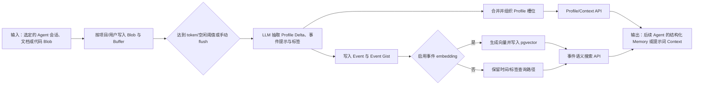

# Memobase：以 Profile 与事件时间线构建可控用户 Memory

> **项目快照**：官方仓库 https://github.com/memodb-io/memobase｜核验日期 2026-09-04｜Stars 约 2.9k｜许可证 Apache-2.0｜最近发布/维护状态：官方仓库 `main` 分支最新可见提交为 2026-01-11 的 `fix: increase max_tokens in llm_sanity_check for improved testing`，仓库页面未显示 GitHub Release。[^project-repository][^project-license][^project-release]

> **需求画像**：目标是在开发会话和项目资料中沉淀可控的业务知识、技术决策及已验证经验，并在后续 Agent 会话中按需召回。必须支持可配置的结构化 Memory、事件时间线、可切换的模型 API、单台内网服务器部署和来源可追踪的接入方式；原始会话是否上传、如何审批和如何把经验转成 Skill 候选，允许在项目外补齐。

## 1. 项目要解决什么问题

### 目标用户与使用场景

Memobase 面向需要长期记住用户属性和互动事件的 LLM 应用，例如个性化助手、教育工具、虚拟陪伴和聊天机器人。它把长期记忆作为独立后端，通过 API 为应用管理用户、输入数据、生成用户 Profile，并提供可直接放入提示词的 Context。[^project-repository][^api-overview]

对于本调研的开发提效场景，可以把“用户”映射成项目、团队或开发者，把 Claude Code、Codex、Cursor 等 Agent 的一段会话映射成 `ChatBlob`，把业务规则、接口约束和技术决策映射到 Profile 槽位，把带时间的开发事件映射到事件时间线。这是基于 Memobase 数据模型的调研判断，不是仓库声明的原生开发会话产品能力。

### 当前问题

第一，长对话中的关键信息不适合每次都把原文塞回上下文。Memobase通过预先生成的结构化 Profile 和事件摘要，把长期信息整理成可查询、可限制长度的结果；官方说明将这种方式定位为减少在线分析和控制提示词成本。[^performance-cost]

第二，事实会随新的互动而变化。Memobase不是把每条消息永久当作独立检索片段，而是使用按用户组织的 Profile 槽位，并在缓冲区达到阈值或空闲超时后批量更新长期记忆。[^project-repository][^best-practices]

第三，稳定属性和时间性事件的访问方式不同。Profile API返回结构化属性，Context API可以一次组装 Profile 与最新事件；事件还可以保存时间戳、标签和可选的向量表示，用于按时间或语义查询。[^api-overview][^best-practices]

### 问题边界

Memobase的官方定位是用户 Profile 记忆后端，不是开发会话采集器、代码仓库知识库、Skill 版本管理平台，也不是会话审计或人工评审系统。仓库支持 `chat`、`doc`、`code` 等 Blob 类型，但官方文档没有声明能够直接读取 Claude Code 本地会话目录、解析多种 Agent 私有格式或识别 Skill 失败模式。[^blob-model][^project-repository]

它也不等同于通用 RAG 或知识图谱。官方明确说明项目重点不是 RAG/search；事件搜索依赖可选的 embedding，结构化 Profile 才是主要输出。因此，把它用于项目业务知识时，仍需在入口处设计文档来源、项目范围和事实审核机制。[^performance-cost][^server-readme]

## 2. 设计的核心思路

### 核心判断

Memobase的核心判断是：对长期个性化上下文，应该把原始互动先按用户缓冲，再提取为受配置约束的 Profile，同时保留可按时间访问的事件记录；在线请求优先读取已编译的结构化结果，而不是临时让 Agent 重新分析全部历史。[^project-repository][^profile-fundamentals]

### 关键设计选择

- **Profile 槽位优先于无结构记忆**：通过 `topic`、`sub_topic` 和描述定义要收集的属性；默认提供常见槽位，也可以在 `config.yaml` 中增加或完全覆盖槽位。这样可以把“业务术语”“领域规则”“接口约束”等知识限制在显式 schema 内，减少无边界记忆。[^profile-fundamentals][^best-practices]
- **Blob 与用户解耦**：输入统一抽象为用户的 Blob，支持 Chat、Summary、Doc、Code、Image、Transcript 等类型；应用可以选择一次插入整段会话，也可以在会话结束时提交摘要或代码说明。源码中的 `BlobData`、`GeneralBlob` 和 `BufferZone` 分别承载输入类型、持久化数据和待处理缓冲。[^blob-model][^database-model]
- **缓冲后批处理**：插入数据先进入每个用户的 buffer；当 token 数达到配置上限、空闲时间超过配置值，或应用显式调用 `flush` 时，服务才执行 Profile 更新流程。官方将批处理作为降低 LLM 分析成本和插入延迟的设计。[^project-repository][^best-practices][^performance-cost]
- **Profile、Event 与 Event Gist 分层**：Profile保存可归纳的用户事实；Event保存一次处理后的事件数据和时间；Event Gist是更细粒度的事件摘要，可配合 embedding 做时间线语义检索。源码的数据表和 API 响应模型明确区分这三种产物。[^database-model][^response-model][^event-controller]
- **模型和 Embedding 接口可配置**：服务端用 `llm_base_url`、`llm_api_key`、`best_llm_model` 配置 LLM，并支持 OpenAI SDK 兼容服务；事件 embedding 可选 OpenAI-compatible、Jina、Ollama，亦可关闭。[^server-readme][^config-env]

### 向量化与模型接口核验

Memobase 的 Profile 抽取和事件时间线可以在关闭 `enable_event_embedding` 时运行；只有事件/Event Gist 的语义查询需要 Embedding。官方配置样例给出 LM Studio 的 `text-embedding-qwen3-embedding-8b`、`embedding_dim: 4096`，但没有声明这是全局默认值；使用其他模型时应显式配置实际输出维度。[^server-readme][^config-env]

官方支持 OpenAI-compatible SDK、Jina Embedding 和 Ollama Embedding，并将向量写入 PostgreSQL/pgvector；没有证据表明 Memobase 内置了可供任意模型自动发现的 Embedding 目录。公司兼容 API 可以按 OpenAI 形态接入，DeepSeek 只有在网关同时暴露 Embedding 接口和模型时才可使用。[^server-readme][^config-env]

中文会话的 Profile 抽取可单独使用中文 LLM，但事件语义检索仍取决于 Embedding 的多语言能力；官方没有给出中文召回基线。切换模型或维度前应新建/重建 pgvector 数据，避免旧 Event 向量与新查询向量不兼容；若只验证 Profile/时间标签，可先关闭 Embedding 减少依赖。[^database-model][^event-controller][^config-env]

### 代价与取舍

Profile 槽位带来可控性和较稳定的召回，但它要求在配置阶段先定义知识分类；没有被槽位覆盖的项目事实可能只能作为事件或 Blob 保存，不能自动获得同等的结构化治理。这是调研判断，官方只保证自定义 Profile 配置能力。[^profile-fundamentals]

缓冲与异步 flush 降低了每次写入的开销，却引入最终一致性：刚插入的会话可能尚未进入 Profile。官方建议在会话结束时手动 `flush`，而对于需要原文审计的场景，默认处理后会删除 Blob，必须主动调整配置保留原始输入。[^project-repository][^best-practices]

Memobase的 API 是按项目和用户组织的，模型调用发生在服务端。它可以切换到公司内部 OpenAI-compatible API 或 Ollama，但如果配置外部 LLM/embedding，原始开发会话会离开内网；数据出境、密钥托管和日志脱敏不由 Memory 核心自动解决。[^server-readme][^config-env]

## 3. 项目如何工作

### 工作流概览

开发者或适配器将选定的会话、文档或代码说明封装为项目内用户的 Blob。服务先写入 PostgreSQL 中的 Blob 和 Redis/数据库驱动的缓冲状态，再由 flush 触发 LLM 抽取、合并、组织 Profile，同时生成带时间信息的 Event；可选 embedding 用于事件或 Event Gist 的语义搜索。最终应用通过 Profile API、Event API 或 Context API 把结果注入后续 Agent 提示词。[^project-repository][^server-readme][^database-model]

### 阶段说明

| 阶段 | 接收什么 | 做什么 | 产生的状态或产物 | 证据 |
| --- | --- | --- | --- | --- |
| 会话接入 | `ChatBlob`、`DocBlob`、`CodeBlob` 或其他 Blob | 客户端以 `user` 为边界插入 Blob；消息可带 alias、`created_at` 和自定义字段 | `GeneralBlob` 记录原始 Blob；应用可取得 Blob ID | [^project-repository][^blob-model] |
| 缓冲 | 新 Blob 与 token 大小 | 按用户维护 buffer，累计近期互动，等待阈值、空闲超时或手动 flush | `BufferZone` 及其状态；原始 Blob 默认可在处理后删除 | [^project-repository][^best-practices][^database-model] |
| 信息抽取 | 待 flush 的聊天/文档内容与 Profile 配置 | 调用配置的 LLM，按 Profile 槽位生成 Profile Delta，并提取事件提示、标签等 | Profile 更新候选、Event 数据 | [^response-model][^server-readme][^profile-fundamentals] |
| Profile 合并 | 当前 Profile 与本轮抽取结果 | 对同一 topic/sub-topic 的内容进行合并、组织和更新；槽位限制影响结果范围 | `UserProfile`，带 content、attributes、created_at、updated_at | [^database-model][^profile-fundamentals] |
| 事件持久化 | 本轮事件数据与消息时间 | 保存事件时间、事件数据和可选的事件细粒度 gist；按配置为事件生成 embedding | `UserEvent`、`UserEventGist`，可按时间、标签或向量检索 | [^database-model][^event-controller][^best-practices] |
| 上下文消费 | 用户/项目 ID、主题过滤、token 限制、时间范围 | 查询 Profile 与近期/相关事件，或用 Context API格式化 | 结构化 Profile JSON、事件列表或可直接注入 Prompt 的 Context 字符串 | [^api-overview][^best-practices][^project-repository] |

### 关键状态与产物

- **Blob**：进入系统的通用输入。`ChatBlob`含 OpenAI-compatible 的 user/assistant 消息；`DocBlob`和`CodeBlob`可以携带文档或代码说明。官方 README说明默认处理完成后会删除 Blob，只保留抽取出的相关 Memory；如需原始会话留存，需要修改配置。[^project-repository][^blob-model]
- **BufferZone**：按用户、项目和 Blob 维护的待处理缓冲记录，含 token 大小和状态。它是“写入”和“长期记忆更新”之间的中间状态，支持在会话结束时由接入层调用 `flush`。[^database-model][^best-practices]
- **UserProfile**：以文本 `content` 和 JSON `attributes` 保存的长期事实，属性通常包含 `topic` 与 `sub_topic`，并带创建、更新时间。它适合放稳定业务规则、团队约束或开发者偏好，但需要按项目配置槽位和访问范围。[^database-model][^response-model]
- **UserEvent**：以 JSON 保存一条时间性事件，可包含 `profile_delta`、`event_tip` 和 `event_tags`，并带事件时间；它能保存“某次会话中发生了什么”而不必把所有内容合并成稳定 Profile。[^response-model][^event-controller]
- **UserEventGist**：从事件生成的细粒度摘要，可单独向量化并按相似度检索。源码支持 `UserEventGist` 与 `UserEvent` 的关联和级联删除；这适合找回“某次失败修复”一类事件，但不是代码 diff 或 Skill 版本的审计记录。[^database-model][^event-gist-controller]

### 最终输出

调用方可以用 Profile API 取得结构化事实，自行格式化到系统提示词；也可以用 Context API 取得包含 Profile 和最新事件的预格式化字符串，并设置最大 token、主题过滤和时间范围。事件 API还可以按时间、标签或 embedding 相似度查询。[^best-practices][^api-overview][^event-controller]

对 Skill 更新闭环，合理的消费方式是：适配器在一次开发任务结束后读取经过授权的会话，向 Memobase写入项目范围的 Chat/Doc/Code Blob；审核工具通过 Profile/Event API 找出候选业务知识和典型失败事件，再把人工确认后的候选写入 Skill 仓库。最后一步是外围治理流程，Memobase本身不自动生成或发布 Skill。

## 4. 与需求画像逐项对照

### 需求矩阵

| 需求项 | 优先级或硬约束 | 项目现有能力 | 证据 | 状态 | 说明 |
| --- | --- | --- | --- | --- | --- |
| 沉淀项目业务知识、术语和规则 | 必须 | 可配置 Profile topic/sub-topic，按用户生成结构化属性 | [^profile-fundamentals][^best-practices] | 部分满足 | 适合有明确槽位的知识；项目级共享范围、术语审批和来源字段需要外围设计。 |
| 保存技术决策及其演化 | 必须 | 可用 Profile 或 Event 保存文本、属性和时间 | [^database-model][^response-model] | 部分满足 | 有时间字段，但官方未确认专门的决策记录、冲突版本或引用链模型。 |
| 沉淀已验证开发经验，供 Skill 更新 | 必须 | 可输入 Chat/Doc/Code Blob，并可检索事件 | [^blob-model][^event-controller] | 部分满足 | 不能原生识别 Skill 缺口、生成 Git 修改候选、绑定测试证据或发起审批。 |
| 接收完整原始开发会话 | 必须 | `ChatBlob`可承载完整 user/assistant 消息；Blob默认处理后删除，可配置保留 | [^project-repository][^blob-model] | 部分满足 | 能存输入，但 Claude Code JSONL、工具调用、文件 diff、权限和人工上传确认需自研适配器与策略。 |
| 支持多个 Agent | 期望 | 输入消息采用 OpenAI-compatible role/content，Blob类型较通用 | [^blob-model][^project-repository] | 部分满足 | 没有原生 Claude Code、Codex、Cursor 适配器；统一事件模型需由接入层提供。 |
| 用户选择后再上传/可控隐私 | 期望 | API token、项目/用户边界，Blob可配置是否保留 | [^api-overview][^server-readme] | 部分满足 | 访问认证存在，但本地筛选、明确确认、脱敏预览和上传审计未由核心提供。 |
| 模型 API 可切换 | 必须 | `llm_base_url`支持 OpenAI SDK 兼容服务；embedding支持 OpenAI-compatible/Jina/Ollama，可关闭 | [^server-readme][^config-env] | 满足 | 公司兼容 API、DeepSeek 兼容网关和本地服务可作为验证对象；需单独确认模型的结构化输出兼容性。 |
| 事件时间线与相关事件查询 | 必须 | UserEvent/UserEventGist带时间，支持时间范围、标签和可选向量检索 | [^best-practices][^event-controller][^database-model] | 满足 | 事件语义查询在启用 embedding 时成立；关闭 embedding 后仍可走时间/标签路径。 |
| 一台内网服务器部署 | 必须 | 官方 Compose包含 API、PostgreSQL/pgvector、Redis；可使用已有 DB/Redis 运行核心 | [^server-readme][^docker-compose] | 满足 | 运行组件数量有限，适合单机试点；官方未给出最低 CPU、内存或吞吐要求，需实测。 |
| Docker Compose 快速验证 | 期望 | 官方提供 `.env`、`config.yaml`样例和 `docker-compose build && docker-compose up` | [^server-readme][^docker-compose] | 满足 | 需要准备 LLM API，启用事件 embedding时还需 embedding 服务；配置和数据备份由团队负责。 |
| 来源可追踪、可回放、可审计 | 必须 | Blob、Profile、Event具有 UUID 和时间字段，Event与Gist有关联 | [^database-model][^response-model] | 部分满足 | 可作为来源索引的基础，但官方没有把原始会话片段、消息序号、代码 diff、Skill版本和审批记录组成完整 provenance。 |
| 开源可自部署且许可可用于内部试点 | 必须 | 核心仓库公开，LICENSE为 Apache-2.0；官方文档同时提供托管 API/平台入口 | [^project-license][^server-readme] | 满足 | 自部署核心可运行；托管服务、Inspector/Playground等附加项目不应与核心能力混为一谈。 |

### 对照归纳

Memobase天然匹配“结构化项目 Memory + 时间性事件 + 可切换模型 + 单机部署”的主线。它尤其适合把项目业务知识按受控 Profile 槽位组织，把开发过程中的具体任务作为事件时间线保留。

它不能单独完成“采集个人 Claude Code 会话”和“更新 Skill”的端到端闭环。硬约束中的原始会话接入、来源链、人工授权和 Skill 评审都需要外部适配层、数据治理层和 Git 工作流。因此，需求矩阵更支持把 Memobase当作 Memory 后端，而不是完整的会话经验平台。

## 5. 开源与能力边界

### 边界清单

| 能力 | 开源核心 | 商业版或 SaaS | 外部依赖 | 证据 |
| --- | --- | --- | --- | --- |
| Memobase API、用户、Blob、Profile、Event | 有，仓库和服务端代码公开 | 官方另有云端 API/平台入口；云端具体套餐边界未在本报告确认 | PostgreSQL、Redis；LLM API | [^project-repository][^server-readme][^api-overview] |
| Profile 槽位配置与 Profile 生成 | 有，`config.yaml`和服务端逻辑公开 | 云端可提供托管配置，但核心能力不以商业版为前提 | LLM API | [^profile-fundamentals][^server-readme] |
| 事件时间、标签、Event Gist | 有，服务端控制器、模型和 API公开 | 未确认是否有云端专属增强 | PostgreSQL；启用语义检索时需要 embedding API/服务 | [^database-model][^event-controller][^server-readme] |
| 原始 Blob 留存 | 有配置开关/数据库模型 | 未确认云端保留策略 | PostgreSQL 存储 | [^project-repository][^server-readme] |
| Web Inspector 与 Playground | 官方 README指向独立开源项目 `Memobase-Inspector`、`Memobase-Playground` | 官方也提供在线 Demo；云端部署边界需另行核验 | Memobase API、前端运行环境 | [^project-repository] |
| Claude Code/其他 Agent 会话采集 | 无原生采集器，需自研适配 | 未确认托管服务是否提供专用连接器 | 本地会话目录、适配器、上传端 | [^project-repository][^blob-model] |
| Skill 候选生成、评审、Git 发布 | 无 | 未确认 | 需要团队自建分析与 Git 流程 | [^project-repository] |

### 边界判断

Apache-2.0许可允许内部使用、修改和分发，但需要保留许可证和相关声明；它不自动授予 Memobase商标、云服务账号或第三方模型服务的使用权。许可证边界与运行依赖应分别审查。[^project-license]

官方仓库同时链接云端 API、Inspector、Playground 和在线 Demo。调研判断是：在单机内网试点中，应只把仓库提供的服务端、PostgreSQL/pgvector、Redis和自选模型接口视为自托管基线；云端项目的账号、数据路径和商业条款不能推定为开源核心的一部分。[^project-repository][^server-readme]

## 6. 用户如何接入和使用

### 接入前提

- 准备一台可运行 Docker Compose 的内网服务器；官方 Compose以 `pgvector/pgvector:pg17`、`redis:7.4`和本地构建的 API 为服务组件。[^docker-compose]
- 准备一个 LLM API。服务端要求填写 `llm_api_key`，并可通过 `llm_base_url`切换到 OpenAI SDK 兼容服务；事件 embedding默认启用时还需 embedding 配置，或显式关闭 `enable_event_embedding`。[^server-readme][^config-env]
- 定义项目范围、用户映射和 Profile 槽位。若把项目作为共享 Memory，接入层应先约定 `project_id`、团队/项目用户 ID、topic/sub-topic 和访问角色；这些治理约定不是 Memobase默认的业务语义。
- 为会话上传准备适配器。它需要读取用户明确选定的会话，映射不同 Agent 的角色、工具调用、时间戳、文件变更和 Skill 元数据；Memobase的 `ChatBlob`基本消息只声明 `user`、`assistant`、`content`、alias和创建时间。[^blob-model]

### 接入过程

1. 在 `src/server`复制 `.env.example`为 `.env`，设置 PostgreSQL、Redis、API 端口、项目标识和访问 token；复制 `api/config.yaml.example`，设置 LLM、Profile 槽位和可选 embedding。[^server-readme][^config-env]
2. 启动 `docker-compose build && docker-compose up`，等待 PostgreSQL 和 Redis 健康检查通过；也可以复用已有 PostgreSQL/Redis，仅用官方 Memobase容器运行核心 API。[^server-readme][^docker-compose]
3. 用 `MemoBaseClient`或 HTTP API 创建/获取用户，按项目用户 ID 插入经过授权的 `ChatBlob`、`DocBlob`或`CodeBlob`；每条消息尽量保留 `created_at`，以便构建事件时间线。[^project-repository][^best-practices]
4. 在开发会话关闭、任务完成或达到批处理边界时调用 `flush`，等待 Profile/Event 更新完成；若要保留原始会话供审计，应在配置中关闭默认的 Blob 清理行为，并设置数据库备份与保留策略。[^project-repository][^best-practices]
5. 后续 Agent 请求调用 Profile API 或 Context API，按主题、token 数和时间范围控制注入内容；经验分析器可用 Event/Gist API 查询候选事件，再将人工确认结果写入 Skill 仓库。[^best-practices][^api-overview]

### 日常使用方式

开发者仍在本地使用自己的 Agent。一个本地 CLI/Hook 或轻量上传工具展示会话列表和摘要，用户选择某次会话后才调用 Memobase API。这一层负责确认上传、鉴别项目、记录 Agent 类型、串联原始会话文件和提交/测试结果。

进入 Memory 后，Profile用于回答“项目长期遵守什么规则”，Event用于回答“某次任务发生了什么、什么时候发生”，Event Gist用于在大量事件中找相似案例。调用方可以只取某个 topic，避免把整个团队知识注入每次 Agent 提示词。[^best-practices][^event-controller]

### 接入限制

Memobase输入协议不是 Claude Code 原始会话协议。工具调用、权限确认、命令输出、代码 diff、测试报告和 Skill 版本信息需要由接入适配器编码到 Blob 的 `fields`、文本内容或外围对象存储中；官方未确认这些字段会被 Profile 抽取器按专门语义理解。[^blob-model]

原始会话是否删除是服务端配置行为，而“用户是否明确授权上传”发生在服务端之前。若要满足隐私原则，必须在本地实现候选筛选、预览、确认、取消和上传审计；不能仅依赖 API token或默认 Blob 清理。[^project-repository][^api-overview]

## 7. 部署构成

### 运行组件

| 组件 | 必需或可选 | 职责 | 持久化数据 | 与其他组件的关系 | 证据 |
| --- | --- | --- | --- | --- | --- |
| `memobase-server-api` | 必需 | 提供用户、Blob、Profile、Event、Context 等 API，调用 LLM/embedding并执行 Memory 更新 | 配置文件挂载；业务数据写入 PostgreSQL，缓冲状态使用服务配置的 Redis/数据库连接 | 依赖 PostgreSQL 与 Redis；被客户端和适配器调用 | [^server-readme][^docker-compose] |
| PostgreSQL + pgvector | 必需（官方 Compose） | 保存项目、用户、Blob、Buffer、Profile、Event、Event Gist等关系数据；pgvector保存事件向量 | `DATABASE_LOCATION`挂载目录 | API通过 `DATABASE_URL`访问；embedding检索由 API发起 SQL/向量查询 | [^docker-compose][^database-model] |
| Redis 7.4 | 必需（官方 Compose） | 提供服务运行所需的 Redis 连接和缓冲/异步处理支撑 | `REDIS_LOCATION`挂载目录 | API通过 `REDIS_URL`访问，Compose以健康检查控制启动顺序 | [^docker-compose][^server-readme] |
| LLM API | 必需 | 从 Blob/Buffer抽取、合并和组织 Profile/Event 信息 | 由外部服务或内网模型服务按其策略保存；Memobase不声明替代其数据治理 | API通过 `llm_base_url`和密钥访问，可使用 OpenAI-compatible 服务 | [^server-readme][^config-env] |
| Embedding API/服务 | 可选，但启用事件语义检索时必需 | 为 UserEvent/UserEventGist和查询生成向量 | 向量落 PostgreSQL；模型服务的请求日志取决于外部部署 | API可接 OpenAI-compatible、Jina、Ollama；关闭后不能做 embedding 搜索 | [^server-readme][^config-env][^event-controller] |
| 本地会话接入适配器 | 本调研场景必需，Memobase官方核心未提供 | 读取并筛选 Claude Code/其他 Agent 会话，封装为 Blob，执行用户授权和元数据映射 | 原始会话仍在开发者本地或团队指定对象存储；Memobase Blob是否保留由配置决定 | 调用 Memobase API；为经验分析与 Skill Git 流程提供来源链接 | [^project-repository][^blob-model] |
| Inspector/Playground | 可选 | 提供用户表、用量图表、测试 Playground或完整聊天示例 | 依赖各自项目配置 | 通过 Memobase API连接；可不部署 | [^project-repository] |

### 最小部署路径

官方最小自托管路径是 `src/server`下的 Compose：API 容器、PostgreSQL/pgvector 容器和 Redis 容器；配置 `.env`、`api/config.yaml`后构建并启动。官方也说明，在已有 PostgreSQL和 Redis时，可以只运行 `ghcr.io/memodb-io/memobase`核心容器。[^server-readme][^docker-compose]

对单台服务器试点，建议先关闭事件 embedding或把 embedding 指向公司内网兼容服务，只验证“项目 Profile + 事件时间线 + Context API”；需要事件语义搜索时再启用 embedding。这是部署路径的调研建议，不代表官方默认配置的唯一方式。官方未给出最低 CPU、内存、磁盘或吞吐要求，资源占用和并发上限必须实测。[^server-readme][^config-env]

### 生产化仍需考虑

- 替换示例中的默认密码和 `ACCESS_TOKEN`，将 API 放在内网反向代理之后，并补充 TLS、访问控制、项目隔离和密钥轮换；示例配置中的 `ACCESS_TOKEN="secret"`只能用于本地验证。[^config-env][^api-overview]
- 为 PostgreSQL和 Redis目录做备份、恢复演练和容量监控；同时决定原始 Blob、Profile、Event、Event Gist的保留期。默认删除 Blob有隐私收益，但会削弱完整会话回放能力。[^project-repository][^docker-compose]
- 对发往公司 API、DeepSeek 或其他外部兼容接口的内容做数据分级，明确哪些原始会话可上传；Memobase配置支持切换端点，但没有替团队完成数据出境审批或内容脱敏。[^server-readme]
- 记录 Profile 更新所引用的会话 ID、时间范围和 Agent 类型。官方模型有 UUID 和时间戳，但完整的消息级 provenance、人工确认和 Skill 提交记录需在外围数据库或 Git 中维护。[^database-model][^response-model]

## 8. 适配结论与能力缺口

### 适配结论

**条件匹配。**

Memobase直接提供了本试点需要的结构化 Profile、事件时间线、按主题/时间/token 控制的上下文，以及可切换的 OpenAI-compatible LLM 接口；官方 Compose也能在一台服务器上运行。需求矩阵同时显示，它没有原生开发会话采集、多 Agent 格式适配、来源审计、Skill 候选生成和人工评审发布能力。因此，只有在补齐会话适配器与治理流程后，才能作为“Memory 后端”进入 Skill 更新闭环。[^server-readme][^profile-fundamentals][^best-practices]

### 已满足能力

- 通过 Profile topic/sub-topic 和 `config.yaml`限制 Memory 范围，适合把业务术语、规则和技术约束分成项目可控的槽位。[^profile-fundamentals][^best-practices]
- 通过 UserEvent、Event Gist、创建时间、标签和可选 embedding保存并查询事件时间线。[^database-model][^event-controller][^best-practices]
- 通过 `llm_base_url`和 embedding provider配置切换公司兼容 API、DeepSeek兼容网关或本地服务；具体模型的结构化输出质量仍需 POC 验证。[^server-readme][^config-env]
- 通过官方 Compose运行 API、PostgreSQL/pgvector和 Redis，部署规模与一台内网服务器的试点边界相符。[^docker-compose][^server-readme]
- 通过 Apache-2.0开源核心自部署，避免把 Memory 核心强制绑定到 Memobase云端；云端和附加 UI需另行确认。[^project-license][^project-repository]

### 能力缺口

- **Agent 会话适配**：需要把 Claude Code JSONL以及未来的 Codex、Cursor 等格式统一为带 Agent 类型、工具调用、文件、命令、测试和 Skill 元数据的内部事件，再映射到 Memobase Blob/Event。
- **项目级共享 Memory**：Memobase的基本边界是 project/user，需约定团队共享用户、个人用户和项目空间的映射，防止个人偏好或敏感会话泄露到共享 Profile。官方建议一个应用用户可以映射多个 Memobase 用户，但没有替本试点定义项目知识权限。[^best-practices]
- **来源与回放**：Profile/Event的 UUID和时间字段可做索引，但没有现成的消息片段、代码 diff、提交、测试结果、Skill版本和人工确认的完整证据链。
- **Skill 更新闭环**：需要外部分析器从 Event/Gist 找候选经验，生成带证据的 Markdown/Skill patch，并通过负责人评审、Git 合并和回归任务验证；Memobase不自动修改或发布 Skill。
- **冲突和事实治理**：Profile合并会更新结构化内容，但本试点仍需定义业务规则冲突、过期、撤销、审批和“事实/建议/个人偏好”的区分。

### 需要自研或外部补齐

- 一个本地优先的会话选择器：扫描各 Agent 的本地会话，显示摘要/时间/项目/风险，用户确认后上传完整原始会话，并保留上传审计。
- 一个统一 Agent 事件规范和 Memobase 适配器：至少包含 `session_id`、`agent`、`message`、`tool_call`、`file_change`、`test_result`、`skill_id`、`created_at` 和原始文件位置。
- 一个项目 Profile 配置包：定义业务术语、规则、架构决策和经验候选的 topic/sub-topic；必要时把长期稳定知识写进 Profile，把任务案例保留为 Event。
- 一个证据查询与评审工作台：展示 Event/Gist、原始会话和关联 Git/CI 证据，输出待评审 Skill 修改，而不是直接写入 Memory 或 Skill。
- 一套模型与数据路由策略：把抽取模型、embedding模型和外部端点做成可切换配置，并针对敏感会话、成本和中文抽取质量做验证。

### 否决风险

当前未发现会让 Memobase无法进入单机 Memory POC 的硬性否决项。需要在进入团队试点前验证三项风险：第一，内部/DeepSeek兼容 API 对其 Profile 抽取提示和结构化输出是否稳定；第二，项目共享用户模型是否足以隔离团队、个人和项目数据；第三，原始会话留存与事件抽取的性能、成本和隐私策略是否可接受。若试点要求“安装后即自动采集所有 Agent 会话并直接产出可合并 Skill”，则 Memobase不匹配该完整目标，只能作为其中的 Memory 层。

---

[^project-repository]: [Memobase 官方 GitHub 仓库](https://github.com/memodb-io/memobase)
[^project-license]: [Memobase LICENSE（Apache License 2.0）](https://github.com/memodb-io/memobase/blob/main/LICENSE)
[^project-release]: [Memobase 官方 main 分支提交历史](https://github.com/memodb-io/memobase/commits/main/)
[^api-overview]: [Memobase 官方文档：API Overview](https://docs.memobase.io/api-reference/overview)
[^profile-fundamentals]: [Memobase 官方文档：Profile Fundamentals](https://docs.memobase.io/features/profile/profile)
[^best-practices]: [Memobase 官方文档：Best Practices & Tips](https://docs.memobase.io/practices/tips)
[^performance-cost]: [Memobase 官方文档：Performance and Cost](https://docs.memobase.io/cost)
[^server-readme]: [Memobase 官方仓库：服务端部署说明](https://github.com/memodb-io/memobase/blob/main/src/server/readme.md)
[^docker-compose]: [Memobase 官方仓库：server/docker-compose.yml](https://github.com/memodb-io/memobase/blob/main/src/server/docker-compose.yml)
[^config-env]: [Memobase 官方仓库：服务端配置样例](https://github.com/memodb-io/memobase/blob/main/src/server/api/config.yaml.example)
[^blob-model]: [Memobase 官方仓库：Blob 输入模型](https://github.com/memodb-io/memobase/blob/main/src/server/api/memobase_server/models/blob.py)
[^database-model]: [Memobase 官方仓库：SQLAlchemy 数据模型](https://github.com/memodb-io/memobase/blob/main/src/server/api/memobase_server/models/database.py)
[^response-model]: [Memobase 官方仓库：API 响应与 Event/Profile 模型](https://github.com/memodb-io/memobase/blob/main/src/server/api/memobase_server/models/response.py)
[^event-controller]: [Memobase 官方仓库：Event 控制器](https://github.com/memodb-io/memobase/blob/main/src/server/api/memobase_server/controllers/event.py)
[^event-gist-controller]: [Memobase 官方仓库：Event Gist 控制器](https://github.com/memodb-io/memobase/blob/main/src/server/api/memobase_server/controllers/event_gist.py)
