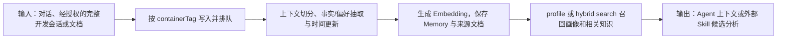

# Supermemory：事实演化、用户画像与混合检索 Memory

> **项目快照**：官方仓库 <https://github.com/supermemoryai/supermemory>｜核验日期 2026-09-04｜Stars 29,207｜许可证 MIT｜main 分支最近提交 2026-09-02；GitHub Releases 的本地服务器最新可见预发布版本为 `server-v0.0.7-rc.2`（2026-07-22）。[^supermemory-repository][^supermemory-license][^supermemory-release]

> **需求画像**：目标是在开发 Agent 之间共享项目业务知识、技术决策和经验证的经验，并从被选择的开发会话中提取可追溯的 Skill 更新候选。硬约束是可在一台内网服务器或本地进程运行、模型 API 可切换、能接入 Claude Code/Codex/Cursor 等不同 Agent；接受先由外部采集器完成会话筛选，Skill 只生成候选并经过人工评审后发布。

## 1. 项目要解决什么问题

### 目标用户与使用场景

Supermemory 面向需要跨会话记住事实、偏好、项目上下文和文档内容的 AI 应用与 Agent。官方 API 通过 `add` 写入对话或文档，通过 `profile` 获得静态事实、动态上下文和相关搜索结果，并通过 `search` 访问 Memory 与 RAG。[^supermemory-readme][^supermemory-api]

对本项目而言，它可作为“已授权会话的记忆加工层”：外部客户端将完整会话作为文档提交，以项目或仓库作为 `containerTag`，由 Supermemory 抽取稳定业务事实、技术决策和用户画像；下一次 Agent 会话按项目范围召回上下文。

### 当前问题

仅保存向量块无法表示事实随时间变化。Supermemory 将“我住在纽约”与后续“我搬到旧金山”作为需要更新和过期处理的知识，而不是始终并列的检索片段。[^supermemory-concepts]

仅靠搜索无法稳定提供用户背景。`profile` 接口把静态事实和近期动态聚合成可直接注入系统提示词的用户上下文，减少每个 Agent 自己拼接历史的工作。[^supermemory-readme]

业务文档和个体记忆通常需要一起检索。官方默认的 hybrid search 将 RAG 文档结果和个性化 Memory 放到同一次查询中，适合把团队规则与当前开发者偏好同时交给 Agent。[^supermemory-search]

### 问题边界

Supermemory 不负责自动发现开发者本地 Claude Code 会话，也不定义跨 Agent 的统一会话文件格式。其 `add` API 接受调用方提供的内容，采集、筛选、授权上传、脱敏和原始会话归档仍需外部客户端或网关实现。

它也不是 Skill 发布系统。抽取出的记忆或候选经验没有天然等同于经过评审的 Skill 规则；证据片段、评审状态、Git PR 和回归测试需要由外部治理流程保存。

## 2. 设计的核心思路

### 核心判断

Supermemory 将记忆视为会演化的事实图，而不是只读的向量数据库：写入时从对话和文档抽取事实，处理时间变化、矛盾和自动遗忘；读取时把用户画像与混合检索结果合并返回。[^supermemory-readme][^supermemory-concepts]

### 关键设计选择

- **统一 Memory 结构与 ontology**：对话、上传文件、连接器内容和抽取出的 Memory 共享一套容器/空间范围，避免个人上下文和知识库被拆成互不相通的系统。[^supermemory-readme]
- **静态画像与动态画像分离**：`profile.static` 适合稳定偏好、职责和长期事实，`profile.dynamic` 适合近期工作状态；调用方可以一次获取两者再拼进 Agent 提示词。[^supermemory-readme]
- **Memory 与 RAG 合并检索**：默认 hybrid 模式同时检索个性化 Memory 和文档知识；也能选择 `memories` 模式只取长期事实。[^supermemory-search]
- **本地模型与外部模型可替换**：自托管版本默认使用本地 Xenova 向量模型，并支持 Anthropic、OpenAI、Gemini、Groq 及任意 OpenAI 兼容端点；因此可将公司 API 或 DeepSeek 作为配置项。[^supermemory-selfhost-config]

### 向量化与模型接口核验

Supermemory local 默认使用本地 ONNX Embedding：`Xenova/bge-base-en-v1.5`，768 维，不需要 API Key；官方明确警告该默认模型是 English-only。多语言示例使用 `Xenova/bge-m3`、1024 维。远程选项包括 OpenAI `text-embedding-3-small`/1536 维、Gemini `text-embedding-004`/768 维，以及以 Ollama 的 `nomic-embed-text`/768 维走 OpenAI-compatible 接口。[^supermemory-embeddings]

向量由 local server 内部维护并写入本地数据目录的图/索引存储；Embedding provider 通过 `SUPERMEMORY_EMBEDDING_PROVIDER`、`MODEL`、`DIMENSIONS`、`BASE_URL` 配置。官方要求模型和维度与已有数据一致，变更后必须使用新数据目录或重新摄取，维度不匹配时服务器拒绝启动。[^supermemory-embeddings][^supermemory-selfhost-config]

公司 API 可使用 `openai` 或兼容远程 provider，DeepSeek 只有在暴露 `/v1/embeddings` 并提供实际向量模型时才可接入；DeepSeek 聊天 API 不等于 Embedding API。中文会话不应保留英文默认模型，应在首次建库前切换多语言模型并评测中英混合术语、代码标识符和 BM25 回退效果。[^supermemory-embeddings]

### 代价与取舍

事实抽取、摘要和上下文切分需要 LLM，记忆质量、延迟和费用取决于所配置的模型；官方明确指出自托管使用调用方提供的模型，而托管平台使用其优化的专有抽取模型。[^supermemory-selfhost-config]

调研判断：统一 Memory 结构降低了 Agent 接入成本，但也会把个人、项目和团队知识的权限、保留期及冲突解决责任推给 `containerTag`/space 设计和外部治理。默认英文本地 Embedding 对中文业务知识不理想，需在首次建库前选择多语言模型。[^supermemory-embeddings]

## 3. 项目如何工作

### 工作流概览

### 阶段说明

| 阶段 | 接收什么 | 做什么 | 产生的状态或产物 | 证据 |
| --- | --- | --- | --- | --- |
| 写入 | 文本、对话、URL、HTML、文件和作用域标签 | `add`/documents API 接收内容；自托管写入请求异步进入 ingestion queue | 原始文档记录、排队状态和 `containerTag` | [^supermemory-api][^supermemory-selfhost-config] |
| 抽取 | 文档内容、已有 Memory 和模型配置 | 进行摘要、上下文切分、事实抽取；判断新增、更新、矛盾或过期事实 | 记忆条目、静态/动态画像及来源关联 | [^supermemory-readme][^supermemory-concepts] |
| 建索引 | 文档片段与 Memory | 用本地或远程 Embedding 建立语义索引，并保留文件/文档元数据 | 可搜索的 Memory 与知识库索引 | [^supermemory-embeddings] |
| 召回 | 查询 `q`、`containerTag`、搜索模式和过滤器 | 执行 `profile` 或 hybrid/memories search，组合画像和相似结果 | 排序后的画像、Memory、文档结果 | [^supermemory-search][^supermemory-api] |
| 应用消费 | 召回结果、当前任务和可选原始会话 ID | Agent 将结果注入提示词；外部分析器关联证据并生成 Skill 修改候选 | 带上下文的 Agent 任务或待评审候选 | 调研判断 |

### 关键状态与产物

- **原始文档/会话**：`add` 接收的内容是后续抽取和追溯的来源。官方 API 支持文本、对话、URL、HTML 和文件；但如何选择本地 Claude Code 文件以及是否上传由调用方决定。[^supermemory-api]
- **Memory 条目**：从来源中提取的长期事实、偏好、决策或项目上下文，支持时间变化、矛盾处理和过期。它是压缩后的知识，不应替代原始会话证据。[^supermemory-concepts]
- **用户画像**：`profile.static` 保存稳定事实，`profile.dynamic` 保存近期活动；`profile` 可同时返回画像和相关搜索结果。[^supermemory-readme]
- **容器/空间范围**：`containerTag`/space 用于按用户、项目、仓库或团队划分数据；团队权限和多成员角色不属于本地单机版的完整能力。[^supermemory-local-enterprise]

### 最终输出

应用得到可直接注入 Agent 的画像和检索结果。对 Skill 更新闭环，建议外部服务额外保存 `source_document_id`、会话原始文件哈希、Skill 版本和评审状态，再把 Supermemory 的事实与原始会话片段一起生成候选修改。

## 4. 与需求画像逐项对照

### 需求矩阵

| 需求项 | 优先级或硬约束 | 项目现有能力 | 证据 | 状态 | 说明 |
| --- | --- | --- | --- | --- | --- |
| 项目业务知识长期保存 | 必须 | 文档摄取、Memory 抽取、容器范围和持久化数据目录 | [^supermemory-selfhost-overview][^supermemory-api] | 满足 | 需要按项目/仓库设计 containerTag 或 space |
| 技术决策和已验证经验可检索 | 必须 | Memory 与文档 hybrid search；可保留来源文档 | [^supermemory-search][^supermemory-api] | 部分满足 | 决策模板、来源证据和 Skill 评审字段需要外部治理 |
| 接收完整开发会话 | 必须 | `add` 接受对话/文本/文件 | [^supermemory-api] | 部分满足 | 没有本地 Claude Code 会话发现、选择与授权上传流程 |
| 多 Agent 接入 | 必须 | SDK、HTTP API、MCP/插件以及 Claude Code、Codex、OpenCode 等集成 | [^supermemory-readme][^supermemory-selfhost-overview] | 部分满足 | 集成多以 Supermemory API/托管 MCP 为中心，事件字段仍需适配器归一化 |
| 模型 API 可切换 | 必须 | Anthropic、OpenAI、Gemini、Groq、OpenAI-compatible；Embedding 可本地或远程 | [^supermemory-selfhost-config][^supermemory-embeddings] | 满足 | DeepSeek 需以 OpenAI 兼容端点和实际模型名验证 |
| 一台服务器/本地自托管 | 必须 | 单二进制、自带图引擎、文件存储和本地 Embedding | [^supermemory-selfhost-overview][^supermemory-selfhost-quickstart] | 满足 | 官方未给出团队并发的资源基线，需实测 |
| 原始会话上传由用户确认 | 期望 | API 不强制自动上传 | [^supermemory-api] | 部分满足 | 选择、审批、脱敏和撤回需放在客户端或网关 |
| Skill 候选可追溯、人工发布 | 必须 | 可返回相关 Memory/来源供外部分析 | [^supermemory-api] | 部分满足 | 没有 Git 候选、评审和回归发布闭环 |

### 对照归纳

Supermemory 直接覆盖“把业务知识和经验记住，并按项目和用户召回”的主路径，也符合可切换模型和单机 POC 方向。会话采集授权、跨 Agent 原始事件格式、证据链和 Skill 变更治理仍须外置，因此它不能单独构成完整的 Skill 更新系统。

## 5. 开源与能力边界

### 边界清单

| 能力 | 开源核心 | 商业版或 SaaS | 外部依赖 | 证据 |
| --- | --- | --- | --- | --- |
| Supermemory SDK、API 客户端及仓库代码 | 有，MIT | 无需购买才能阅读和修改仓库代码 | Node/Bun 或 Python 运行时、模型 API | [^supermemory-repository][^supermemory-license] |
| Supermemory local 单机服务器 | 官方文档提供免费开源的单二进制 | 企业版提供组织权限、观测和规模化托管 | 下载的服务器二进制、LLM、可选 Embedding | [^supermemory-selfhost-overview][^supermemory-local-enterprise] |
| Memory 抽取、画像、混合检索 | local 有完整 Memory API | 托管平台使用专有长周期抽取模型，质量和成本优化不随 local 提供 | 自托管需自备 LLM；Embedding 可本地/远程 | [^supermemory-selfhost-config][^supermemory-local-enterprise] |
| Connectors、托管 MCP、团队鉴权与控制台 | local 无 | 仅平台/Enterprise 提供 | OAuth、平台服务、组织账号 | [^supermemory-local-enterprise][^supermemory-selfhost-config] |
| 图可视化组件 | `@supermemory/memory-graph` MIT 开源 | 平台 UI 可直接使用 | React、浏览器 | [^supermemory-graph] |

### 边界判断

官方把 local 描述为与平台相同 API 的单机二进制，但 local-vs-enterprise 文档明确列出连接器、MCP、组织权限、控制台观测和专有抽取模型属于平台/Enterprise。[^supermemory-local-enterprise]

调研判断：当前 GitHub 主仓库公开结构主要是 `apps`、`packages` 和文档，local server 以 Release 二进制方式交付；仓库未提供与 LightRAG 类似的完整 Docker Compose 自建栈。采用前应核对目标 Release 的二进制来源、源码可重建性和企业内部许可证审查要求，不能因为 README 使用“open source”就假设平台所有能力和模型均可自托管。

## 6. 用户如何接入和使用

### 接入前提

- 选择 Supermemory SDK/HTTP API 或 local server；需要一个 LLM 提供摘要、上下文切分和 Memory 抽取，Embedding 可采用默认本地模型或远程兼容服务。[^supermemory-selfhost-config]
- 为项目、仓库、开发者和 Agent 设计稳定的 `containerTag`/space；不要把个人隐私和团队业务知识无区分地写入同一个范围。
- 对 Claude Code、Codex、Cursor 等会话编写适配器，将消息、工具调用、代码改动、测试结果和 Skill 使用记录统一成提交给 `add` 的结构。

### 接入过程

1. 运行 `curl -fsSL https://supermemory.ai/install | bash`、`npx supermemory local` 或使用 SDK；local 首次启动在本地目录建立数据和 API Key。[^supermemory-selfhost-quickstart]
2. 配置一个公司 API、DeepSeek 或其他 OpenAI-compatible LLM 的 `OPENAI_BASE_URL`、API Key 和模型名；为中文语料在首次建库前选择 `Xenova/bge-m3` 等多语言 Embedding 或远程模型。[^supermemory-selfhost-config][^supermemory-embeddings]
3. 由用户选择并授权一段完整会话后调用 `add`，写入项目范围；新会话开始调用 `profile`/`search`，把召回结果交给 Agent 或 Skill 候选分析器。

### 日常使用方式

写入是异步 ingestion，搜索可立即服务；Agent 可按项目标签取画像和相关 Memory，管理员通过本机日志和数据目录维护单机实例。[^supermemory-selfhost-config]

### 接入限制

本地版是单机、单 API Key 的服务，官方没有提供组织级角色、细粒度团队权限、连接器同步或完整控制台。中文 Embedding、数据迁移、原始会话撤回和跨 Agent 事件适配需要在 POC 中自行验证。

## 7. 部署构成

### 运行组件

| 组件 | 必需或可选 | 职责 | 持久化数据 | 与其他组件的关系 | 证据 |
| --- | --- | --- | --- | --- | --- |
| `supermemory-server` 单二进制 | 必需（local） | HTTP Memory API、抽取调度、画像和搜索 | `SUPERMEMORY_DATA_DIR` 下的图引擎数据、认证密钥和模型缓存 | 调用 LLM，使用本地 Embedding 或远程 Embedding | [^supermemory-selfhost-overview][^supermemory-selfhost-config] |
| 内置 Supermemory graph engine | 必需（随 local） | 保存文档、Memory 关系和索引 | 与数据目录同处 | 被 server 进程嵌入 | [^supermemory-selfhost-overview] |
| 本地 Embedding 模型 | 默认必需的检索组件 | 将文档、Memory 和查询编码为向量 | 模型缓存与向量数据 | 在 server 内运行 | [^supermemory-embeddings] |
| LLM API | Memory 抽取必需 | 摘要、上下文切分、事实提取与更新 | 官方未规定 LLM 侧持久化 | server 通过 OpenAI-compatible/Anthropic 等接口调用 | [^supermemory-selfhost-config] |
| 远程 Embedding | 可选 | 提供多语言或其他向量模型 | 外部服务侧按其策略保存 | 替代本地 Embedding | [^supermemory-embeddings] |
| 外部会话采集/Skill 治理服务 | 目标场景必需但项目外 | 选择会话、权限确认、保存原始证据、生成 PR | 原始会话、审计记录、候选和验证结果 | 调用 Supermemory API 并与 Git 平台连接 | 调研判断 |

### 最小部署路径

官方最小路径是安装单二进制并运行 `supermemory-server`；首次启动创建本地图引擎、默认本地 Embedding、数据目录和 API Key，只需配置一个 LLM。也可把 `baseURL` 指向 `http://localhost:6767`，沿用 SDK 的 Memory API。[^supermemory-selfhost-quickstart][^supermemory-selfhost-overview]

### 生产化仍需考虑

- local 默认单机单 API Key，不等于团队级鉴权；需要反向代理、TLS、成员身份、项目隔离、删除/保留策略和审计日志。
- 官方给出默认 1 GB ingestion memory headroom 和并发参数，但没有给出目标数据量、并发用户或完整吞吐基线；需按中文会话、LLM 延迟和上传峰值实测。[^supermemory-selfhost-config]
- 备份整个 `SUPERMEMORY_DATA_DIR`；变更 Embedding 模型或维度前必须新建数据目录或全量重摄取，不能直接混用旧向量。[^supermemory-embeddings]
- 需要将本地服务器版本固定并核对 Release；不能以 hosted 平台的连接器、MCP 或专有模型能力作为单机部署假设。

## 8. 适配结论与能力缺口

### 适配结论

**条件匹配。** Supermemory 的事实演化、画像、混合检索、模型切换和单机 local 路径适合承载项目业务知识与跨 Agent 上下文；但没有原生开发会话发现、统一事件协议、证据治理和 Skill 发布闭环，且团队级权限与部分能力属于平台/Enterprise。

### 已满足能力

- 可从对话和文档抽取长期事实，处理更新、矛盾与过期，并按项目范围召回。[^supermemory-concepts][^supermemory-search]
- `profile` 能同时返回静态画像、动态上下文和搜索结果，适合在开发 Agent 启动时注入。[^supermemory-readme]
- local 使用单二进制和本地数据目录，支持本地 Embedding、公司 API、DeepSeek 兼容端点及完全离线的 OpenAI-compatible 服务。[^supermemory-selfhost-overview][^supermemory-selfhost-config]
- API 与 SDK 接入方式不依赖某一个 Agent，已有 Claude Code、Codex 和 OpenCode 的插件/配置可作为适配参考。[^supermemory-selfhost-overview][^supermemory-readme]

### 能力缺口

- **会话发现与用户授权**：需扫描各 Agent 本地目录、让用户选择完整会话、确认上传和撤回；Supermemory 只处理已提交内容。
- **多 Agent 事件归一化**：需要把 Claude Code/Codex/Cursor 的消息、工具调用、补丁和测试结果映射为统一来源文档与元数据。
- **来源与 Skill 治理**：需要保存原始文件哈希、片段位置、Skill 版本、候选状态、评审人与验证任务；Memory 条目本身不足以证明规则正确。
- **团队访问控制**：local 的单 API Key 不足以直接支撑项目组多角色访问，需要外部网关和权限层。

### 需要自研或外部补齐

- 本地会话选择/上传客户端和适配器网关。
- 原始会话对象存储、证据查看、删除和审计。
- Skill 候选生成、人工评审、Git PR 和回归验证流水线。
- 多语言 Embedding 配置、模型切换迁移和成本/延迟监控。

### 否决风险

当前未发现硬性否决项；进入 POC 前必须确认目标 Release 的 local 二进制与源码可审查范围、中文向量召回效果、团队鉴权方案，以及单机数据目录备份/恢复是否满足公司要求。

---

[^supermemory-repository]: [Supermemory 官方 GitHub 仓库](https://github.com/supermemoryai/supermemory)
[^supermemory-license]: [Supermemory MIT 许可证](https://github.com/supermemoryai/supermemory/blob/main/LICENSE)
[^supermemory-release]: [Supermemory GitHub Releases](https://github.com/supermemoryai/supermemory/releases)
[^supermemory-readme]: [Supermemory 官方 README：Memory、Profile、Hybrid Search 与本地运行](https://github.com/supermemoryai/supermemory/blob/main/README.md)
[^supermemory-api]: [Supermemory 官方 API 参考](https://github.com/supermemoryai/supermemory/blob/main/skills/supermemory/references/api-reference.md)
[^supermemory-search]: [Supermemory 官方概念文档：搜索与 Memory/RAG](https://supermemory.ai/docs/concepts/memory-vs-rag)
[^supermemory-concepts]: [Supermemory 官方概念文档：Memory 与事实更新](https://supermemory.ai/docs/concepts/memory-vs-rag)
[^supermemory-selfhost-overview]: [Supermemory local 官方自托管概览](https://github.com/supermemoryai/supermemory/blob/main/apps/docs/self-hosting/overview.mdx)
[^supermemory-selfhost-quickstart]: [Supermemory local 官方快速开始](https://github.com/supermemoryai/supermemory/blob/main/apps/docs/self-hosting/quickstart.mdx)
[^supermemory-selfhost-config]: [Supermemory local 官方配置说明](https://github.com/supermemoryai/supermemory/blob/main/apps/docs/self-hosting/configuration.mdx)
[^supermemory-embeddings]: [Supermemory local 官方 Embedding 说明](https://github.com/supermemoryai/supermemory/blob/main/apps/docs/self-hosting/embeddings.mdx)
[^supermemory-local-enterprise]: [Supermemory 官方 Local 与 Enterprise 边界](https://github.com/supermemoryai/supermemory/blob/main/apps/docs/self-hosting/local-vs-enterprise.mdx)
[^supermemory-graph]: [Supermemory Memory Graph 组件 README](https://github.com/supermemoryai/supermemory/tree/main/packages/memory-graph)
