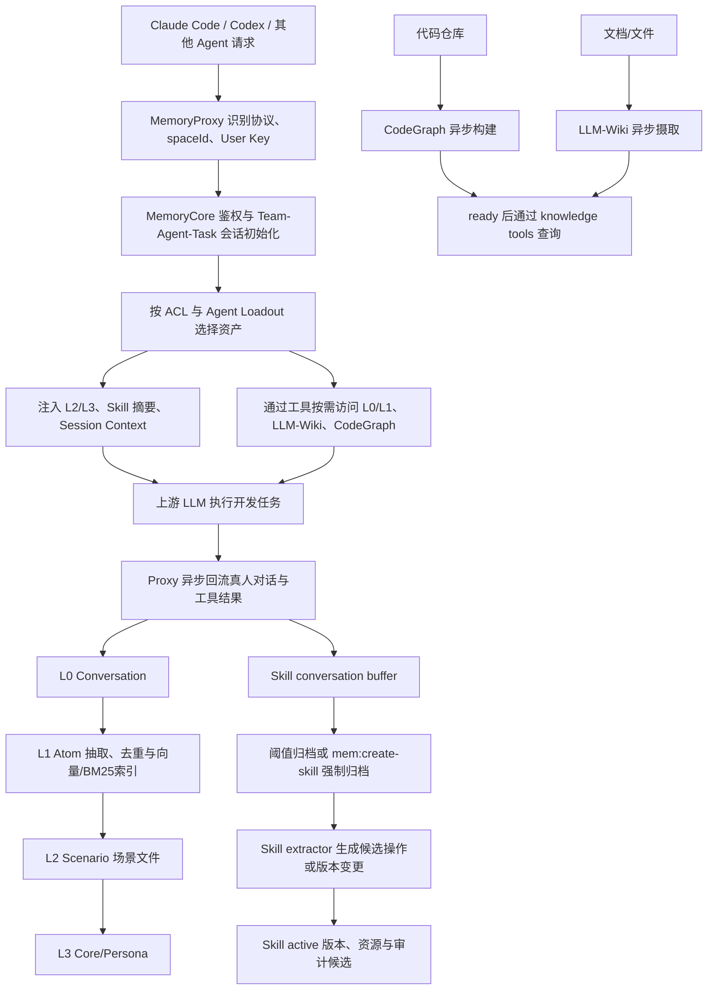

# TencentDB-Agent-Memory：面向 Agent 团队的长期记忆与 Skill 平台

> **项目快照**：官方仓库为 `TencentCloud/TencentDB-Agent-Memory`；用户指定的 `Tencent/TencentDB-Agent-Memory` 路径通过 GitHub API 返回同一官方仓库。核验时默认分支为 `feat/server_team`，约 25,975 Stars，仓库最近一次提交为 2026-09-03；最新稳定 Release 为 `v2.0.1`（2026-08-25）。仓库的 `LICENSE` 文件明确为 MIT；GitHub 元数据的许可证字段显示为 `Other`，本报告以仓库许可证正文为准。[腾讯云官方仓库与仓库元数据][^tdai-ai-repo][^tdai-ai-recent-commit]
>
> **核验范围**：仅查阅官方 GitHub 仓库、README/README_CN、INSTALL/部署文件、LICENSE、Release、官方 SDK、官方客户端接入文档和必要源码；未安装、未启动、未调用该项目。
>
> **需求画像**：本调研要评估一个默认可本地或单机自托管的 Memory 层，能按项目、Team、Agent、成员和任务范围沉淀长期知识，能从经授权的开发会话提取业务 Memory 与 Skill 候选，能切换 LLM/Embedding 接口，并把原始会话、派生 Memory、Skill 和治理边界分开表达。[已确认的 AI Memory 调研 Brief][^tdai-ai-brief]

## 1. 项目要解决什么问题

### 目标用户与使用场景

TencentDB-Agent-Memory 面向使用多个 coding Agent 的个人开发者、团队和 Agent 编排层。它针对的不是一次对话中的上下文窗口，而是“同一个人、项目或团队在多次会话中不断重复解释”的问题：Agent 需要重新阅读文档和代码，重新发现已经验证过的做法，或者在不同 Agent 之间无法继承前一位 Agent 的经验。[项目 README 的产品定位与四类资产说明][^tdai-ai-readme-cn]

项目将这些工作痕迹组织成四类资产：Chat Memory 保存偏好、事实、决策和交互历史；Skill 保存可复用的操作流程；LLM-Wiki（仓库和资产类型中也称 Wiki）把文档转成结构化页面与链接图谱；CodeGraph 保存代码文件、符号、调用关系和影响路径。Memory Hub 再为这些资产加上 Team、Agent、Owner、版本、状态、可见性和装配关系，使经验可以在团队中流动，而不是只能留在某个 Agent 的本地历史里。[项目 README：Memory assets not chat log warehouse；v3 Meta API][^tdai-ai-readme-assets][^tdai-ai-memorycore-api]

### 当前问题

**会话连续性不足。** Chat Memory 的 L0→L1→L2→L3 分层，意图让原始对话先被保留，再逐层抽取事实、场景和长期画像；后续 Agent 可以先获得稳定的 L2/L3 上下文，再按需检索具体的 L1/L0，而不必每次把完整聊天历史重新塞进提示词。[MemoryCore README 与实现][^tdai-ai-memorycore-readme][^tdai-ai-memorycore-record][^tdai-ai-memorycore-scene][^tdai-ai-memorycore-persona]

**开发经验难以复用。** 项目把完成的真人对话和工具调用提交到 Skill 会话缓冲区，按工具调用次数、字节数或压缩条件触发归档，再交给 Skill 提取器生成或更新 Skill。Skill 以带版本的 `SKILL.md` 和资源文件存在，能够被搜索、绑定和导出。[Skill 会话归档实现；Skill API 与格式][^tdai-ai-skill-add][^tdai-ai-skill-extractor][^tdai-ai-skill-api][^tdai-ai-skill-format]

**文档和代码理解成本高。** 文档、方案和运维文件可以进入 Wiki 构建流程；仓库可以进入 CodeGraph，之后 Agent 通过搜索符号、探索文件、查询 callers/callees 和 impact 来理解或评估修改范围，而不是一次性读取全部代码。[MemoryKnowledge API 与工具实现][^tdai-ai-knowledge-api][^tdai-ai-knowledge-mcp][^tdai-ai-knowledge-codegraph]

**团队共享与隐私容易冲突。** 项目把资产 Owner、Team、Agent 固定装配和 ACL 作为独立控制面。README 明确区分 `private`、`team`、`restricted` 和面向 Agent 的定向装配；默认新建的 Chat Memory 和 Skill 倾向私有，共享需要显式操作。[README 的 Memory Hub 与隐私边界；Panel API][^tdai-ai-readme-hub][^tdai-ai-panel-api]

### 问题边界

它不是 Agent 运行时、任务调度器或通用项目管理系统。MemoryCore 负责 Memory、Skill 和元数据 HTTP API，但不托管或调度 Agent；MemoryKnowledge 负责 Wiki/CodeGraph 的构建和查询；MemoryProxy 负责兼容协议的转发、会话初始化、注入和回流；Agent 仍由 Claude Code、Codex、Hermes、OpenClaw 或其他外部 Runtime 运行。[MemoryCore README；MemoryProxy README][^tdai-ai-memorycore-readme][^tdai-ai-proxy-readme]

它也不是完整的原始会话合规归档、人工审批或 Skill 发布平台。源码和 API 有会话写入、Skill 抽取、版本和生成日志，但 Skill 状态模型主要是 `active`/`archived`，没有被确认的持久化 `draft`、`review` 或 `approved` 状态；Memory Hub 的“审核”更多表现为资产、权限、版本和装配管理，独立人工批准流未确认。[Skill 类型与工具源码；Panel API][^tdai-ai-skill-types][^tdai-ai-skill-tools][^tdai-ai-panel-api]

## 2. 设计的核心思路

### 核心判断

TencentDB-Agent-Memory 的核心判断是：面向 Agent 的“记忆”不应只是聊天记录仓库，而应是可被召回、装配、复用和治理的资产层。它把“原始证据”“机器提炼的上下文”“可复用流程”“文档/代码知识”拆成不同资产，并通过 Proxy 将这些资产接到多个 Agent 上。[官方 README：Memory assets not chat log warehouse][^tdai-ai-readme-assets]

该设计同时采用两条路径：

1. **记忆路径**：对话进入 L0，再异步提炼为 L1 原子记忆、L2 场景文件和 L3 Core/Persona；召回按层次、身份和预算返回。
2. **知识资产路径**：文档进入 LLM-Wiki，代码进入 CodeGraph；Agent 先发现可用工具，再按需读取页面、文件、符号和影响路径。

二者由 Memory Hub 的 Team/Agent/Asset/ACL/Loadout 关系连接起来，由 MemoryProxy 在每一轮模型请求前后执行注入和回流。[官方技术实现说明；Memory Proxy 注入实现][^tdai-ai-readme-tech][^tdai-ai-proxy-pipeline]

### 关键设计选择

- **选择一：L0→L1→L2→L3 的分层记忆。** L0 保留原始消息，L1 保存事实、偏好、约束和事件，L2 以场景或项目组织记忆，L3 保存长期画像和稳定模式。分层让短期证据、可执行事实和长期上下文可以分别检索、编辑和清理；L2/L3 可以直接进入 system prompt，L0/L1 更多通过工具或按需搜索进入上下文。[MemoryCore API 与提取源码][^tdai-ai-memorycore-api][^tdai-ai-memorycore-record][^tdai-ai-memorycore-scene][^tdai-ai-memorycore-persona]

- **选择二：混合检索而非只用 Embedding。** SQLite 后端同时使用 FTS5/BM25 和 sqlite-vec；Tencent Cloud VectorDB 后端支持 dense、sparse BM25 和原生 hybrid search。没有远程 Embedding 时仍可使用 BM25；配置 Embedding 后，远程接口需要兼容 OpenAI 的 `/embeddings` 形状并提供模型与维度，改变 provider/model/dimension 后需要重建向量索引。[MemoryCore store 与 embedding 源码][^tdai-ai-memorycore-sqlite][^tdai-ai-memorycore-tcvdb][^tdai-ai-memorycore-embedding]

- **选择三：固定装配加 ACL。** Hub 先按 Team、User、Agent、可见性和 ACL 筛选资产，再由 Agent Fixed Asset/Loadout 指定哪些资产固定进入某个 Agent。这样可避免把团队全部知识无差别注入每一轮，也把“谁拥有”“谁可读”“谁可用”“谁可分配”分成不同权限。[v3 Meta API 与 Panel API][^tdai-ai-memorycore-api][^tdai-ai-panel-api]

- **选择四：通过协议代理适配多个 Agent。** Proxy 同时处理 Anthropic Messages、OpenAI Chat Completions 和 Codex 使用的 Responses API；客户端通常只需替换 Base URL 和业务 User Key。不同客户端保留各自的 session ID、用户输入抽取和初始化协议，资产层仍由同一套 Core/Hub 提供。[MemoryProxy README；客户端接入文档][^tdai-ai-proxy-readme][^tdai-ai-agent-generic][^tdai-ai-agent-claude][^tdai-ai-agent-codex]

- **选择五：异步构建与可观测溯源。** L1/L2/L3 抽取、Skill 归档和 Wiki/CodeGraph 构建都允许异步处理；资产有 `pending`、`processing`、`ready`、`failed` 等状态。MemoryCore 还提供 Memory Prompt 和 Memory Generation Log API，可记录 Prompt ID、版本、来源、SHA-256 及输入/输出与 Memory 引用关系。[MemoryCore API；Knowledge API；生成日志实现][^tdai-ai-memorycore-api][^tdai-ai-knowledge-api][^tdai-ai-memory-generation-log]

### 代价与取舍

**官方事实。** Wiki 和 CodeGraph 在完成前不能按完整结果使用；CodeGraph 当前只接受 HTTPS 仓库，并且源码明确没有 SSH/私有仓库认证。自动 Skill/记忆路由仍在迭代，当前主要依靠人工绑定和固定装配。Proxy 的默认 Skill LLM 写权限关闭，避免模型直接改写 Skill，但这也意味着自动沉淀不能直接等同于自动发布。[README 限制；源抓取与 Proxy 配置源码][^tdai-ai-readme-limitations][^tdai-ai-knowledge-git][^tdai-ai-proxy-config]

**调研判断。** 该系统以“可复用资产”和“即时上下文效率”为优先，牺牲了端到端的审批、可回归验证和统一发布治理。L0/L1 的混合搜索和生成日志有利于追溯，但导入 Session 后原始 JSONL 是否完整保留、Skill 候选是否形成持久队列、是否可以一键生成 Git PR，官方材料均未确认。要把它用于“开发会话→业务 Memory→Skill 候选”的组织流程，仍需外部适配器承担会话授权、候选审批、来源引用和回归验证。

## 3. 项目如何工作

### 工作流概览



### 阶段说明

| 阶段 | 接收什么 | 做什么 | 产生的状态或产物 | 证据 |
| --- | --- | --- | --- | --- |
| 1. 身份与会话注册 | Agent 请求、`spaceId`、业务 User Key、可选 Team/Agent/Task/Conversation ID | Proxy 调用 `/v3/meta/auth/verify`，根据路径和 Header 解析实例与会话；首次请求可交互选择 Team、Agent、Task，也可使用 Header 自动预选 | `user_id`、session binding、Team/Agent/Task 上下文 | Proxy README；Claude Code/Codex 接入文档[^tdai-ai-proxy-readme][^tdai-ai-agent-claude][^tdai-ai-agent-codex] |
| 2. 资产筛选与注入 | Team/Agent/Task 身份、固定装配、ACL、Skill/Knowledge 可用性 | 按可见性、Owner、ACL 和 Agent Loadout 选择资产；将 L2/L3、Skill 摘要、Agent/Task context 注入 system/instructions；为 L0/L1 和 Knowledge 暴露只读工具 | 本轮请求的边界化上下文、工具定义 | README 技术实现；Proxy 注入器[^tdai-ai-readme-tech][^tdai-ai-proxy-pipeline][^tdai-ai-proxy-readme] |
| 3. 上游推理与开发执行 | 已注入的请求体和原始 Agent 协议 | Proxy 原样转发 Anthropic、OpenAI Chat 或 Responses 请求；模型继续使用外部 Agent 的工具和工作区 | Agent 的回复、工具调用、任务结果 | Proxy README；协议与客户端文档[^tdai-ai-proxy-readme][^tdai-ai-agent-generic] |
| 4. L0 回流 | 完成一轮的真人 user text 和 assistant response | 过滤中间工具请求，抽取最后一个用户消息和非空助手响应，异步写入 Core 的 Conversation/Skill conversation 接口 | L0 消息、Skill 会话缓冲、时间和身份维度 | `recorder.ts`；Skill bridge/handler[^tdai-ai-proxy-recorder][^tdai-ai-proxy-skill-bridge] |
| 5. L1 提取与检索索引 | L0 消息、背景消息、当前 scene、抽取 Prompt、可选 Embedding | LLM 生成结构化场景和原子记忆，校验类型、优先级、来源 ID；可做向量相似去重；写入 SQLite/TCVDB 和 FTS/BM25 索引 | L1 Atom、去重决策、generation log、可检索索引 | L1 extractor；SQLite/TCVDB store[^tdai-ai-memorycore-record][^tdai-ai-memorycore-sqlite][^tdai-ai-memory-generation-log] |
| 6. L2/L3 归纳 | L1 记忆、现有场景索引/文件、checkpoint、已变化场景 | L2 LLM 在 `scene_blocks/` 中创建、更新、合并或软删除 Markdown；L3 根据变更场景生成 Persona/Core，并刷新 scene navigation | `scene_blocks/`、`index.md`、`persona.md`、checkpoint | Scene extractor；Persona generator[^tdai-ai-memorycore-scene][^tdai-ai-memorycore-persona] |
| 7. Skill 归档与提取 | 完成会话切片、工具调用、任务/Agent/Team 身份 | 缓冲消息，达到阈值后归档；Skill extractor 预取相似 Skill，调用 review tools 产生 create/update/patch/files 写入候选 | Skill candidate/audit candidate、active immutable version、资源 manifest；无已确认的审批状态 | Skill add、extractor、Skill types[^tdai-ai-skill-add][^tdai-ai-skill-extractor][^tdai-ai-skill-types] |
| 8. Wiki/CodeGraph 构建 | 文档源文件或 HTTPS 仓库 URL/branch | Wiki 分块、LLM 抽取、合并页面并重建索引；CodeGraph 浅克隆仓库并构建符号/关系索引；二者均异步进入 ready | `draft/pending/processing/ready/failed`；页面、index.db、CodeGraph 查询实例 | Knowledge README/API、Wiki/CodeGraph service、Git fetcher[^tdai-ai-knowledge-api][^tdai-ai-knowledge-wiki][^tdai-ai-knowledge-codegraph][^tdai-ai-knowledge-git] |
| 9. Hub 治理与消费 | Asset 元数据、Owner、Team/Agent、ACL、固定装配请求 | 创建或更新 Team/Agent/Task，管理成员和 User Key，分配/解绑资产，查看状态、版本和使用情况 | Agent Loadout、ACL、资产状态和面板可视化 | Panel API；Meta API[^tdai-ai-panel-api][^tdai-ai-memorycore-api] |

### 关键状态与产物

- **L0 Conversation**：原始对话消息按 `team_id`、`user_id`、`agent_id`、`session_id` 和可选 `task_id` 隔离。它是可追溯证据，但官方导入文档没有确认原始 JSONL 是否以完整原样长期保留。[隔离实现与 Conversation API][^tdai-ai-memorycore-isolation][^tdai-ai-memorycore-api]

- **L1 Atom**：支持 `episodic`、`persona`、`instruction` 等类型，记录 content、priority、scene、session、source/metadata、版本和时间。抽取失败时有 fail-soft 路径，但去重失败可降级为全部新写入，不能把生成结果视为无误事实。[L1 extractor 与 SQLite schema][^tdai-ai-memorycore-record][^tdai-ai-memorycore-sqlite]

- **L2 Scenario**：是存放在 `scene_blocks/` 的 Markdown 场景文件，带索引与导航。LLM 可以创建、更新、合并或软删除场景；生成失败时本地实现会恢复备份。[Scene extractor][^tdai-ai-memorycore-scene]

- **L3 Core/Persona**：是长期画像或核心认知文档。首次生成读取全部场景，增量生成只读取自上次运行后变化的场景；成功后才推进 checkpoint。[Persona generator][^tdai-ai-memorycore-persona]

- **Skill**：由带 YAML front matter 的 `SKILL.md`、版本快照和资源 manifest 组成。Skill 版本是不可变快照，有 `active`/`archived` 状态和乐观锁；现有模型没有持久化 review/approval 状态。[Skill 格式与类型][^tdai-ai-skill-format][^tdai-ai-skill-types]

- **LLM-Wiki**：原始源文件在 `raw/sources/`，派生页面在 `wiki/`，Wiki 目录中还有 `index.db`；页面有 `sources`、front matter 和链接关系，只有 `ready` 后才可完整搜索和取图。[Wiki service 与 ingestion][^tdai-ai-knowledge-wiki][^tdai-ai-knowledge-wiki-ingest]

- **CodeGraph**：按 `dataRoot/service_id/team_id/code_graph_id/` 管理克隆/索引工作目录，元数据记录 repo URL、branch、commitHash、stats、状态和 Owner/Agent/Task 关系。查询工具包括 `search`、`explore`、`callers`、`callees`、`impact`、`node`、`status`、`files`。[CodeGraph service、API 与 Git fetcher][^tdai-ai-knowledge-codegraph][^tdai-ai-knowledge-api][^tdai-ai-knowledge-git]

- **Memory Generation Log**：可记录 Memory Prompt ID、版本、来源、内容 SHA-256、输入/输出和 Memory 引用关系。它强化了派生 Memory 的可追溯性，但官方说明没有保存 Prompt 正文快照。[MemoryCore v3 API][^tdai-ai-memorycore-api]

### 最终输出

对 Agent 而言，最终输出不是一个独立的“记忆文件”，而是一组被 Proxy 装配的上下文与工具：L2/L3 和匹配 Skill 可直接进入 system/instructions，L0/L1 通过搜索或模型工具按需取得，Wiki/CodeGraph 通过 `/v3/tools/list` 发现能力并通过 `/v3/tools/call` 或 MCP 工具调用。对团队而言，最终输出是可绑定、可检索、可版本化和受 ACL 控制的资产。[README 技术实现；Knowledge API/MCP][^tdai-ai-readme-tech][^tdai-ai-knowledge-api][^tdai-ai-knowledge-mcp]

## 3.1 源码实现核验：L0-L3、Skill、Proxy、Wiki/CodeGraph 与检索后端

本节按官方仓库 `feat/server_team` 分支的源码重新核验，未安装依赖、未启动服务、未执行测试。源码核验也对前文的概括作两点重要校正：`MemoryProxy/src/tdai/recorder.ts` 主要负责 L0 对话写入，并不直接实现 Skill buffer；Proxy 的实际资产注入由各个 `injection/injectors/*` 完成，而 `injection/pipeline.ts` 本身是通用 hook 编排器。[官方 L0 recorder 与 auto-capture][^tdai-ai-l0-recorder][^tdai-ai-auto-capture][^tdai-ai-proxy-injection-index]

### L0-L3：真实入口、持久化形态与抽取边界

| 层级 | 官方源码路径与关键函数 | 源码确认的实现 | 能力缺口或重要限制 |
| --- | --- | --- | --- |
| L0 Conversation | `MemoryCore/src/core/conversation/l0-recorder.ts`：`recordConversation`、`readConversationRecords`、`readConversationMessages`；`MemoryCore/src/core/hooks/auto-capture.ts`：`performAutoCapture` | `recordConversation`只保留 `user`/`assistant` 消息，清理图片 base64、过滤 `shouldCaptureL0` 不应捕获的内容，并按本地日期写入 `conversations/YYYY-MM-DD.jsonl`；有 `StorageAdapter` 时使用 `appendFile`，否则写本地文件。`performAutoCapture` 由 `agent_end` 类 hook 调用，通过 `CheckpointManager.captureAtomically` 做时间游标和并发去重，然后 `scheduler.notifyConversation` 通知后续管线；L0 还可同步或延迟写入 `vectorStore.upsertL0`。[L0 实现][^tdai-ai-l0-recorder][^tdai-ai-auto-capture] | 这不是字节级原始会话归档：图片、代码块和被过滤消息可能已被改写或丢弃；`shouldCaptureL0` 是捕获过滤，不是业务授权、脱敏或保留审批。L0 记录与 L1/L2/L3 调度是分开的，`recordConversation` 本身不调用抽取器。 |
| L1 Atom | `MemoryCore/src/core/record/l1-extractor.ts`：`extractL1Memories`、`shouldExtractL1`、`callLlmExtraction`、`parseExtractionResult`、`batchDedup`、`applyDecisions`、`writeMemory` | 过滤消息后，以最近消息加背景消息构造 Prompt，调用注入的 `llmRunner` 或禁用工具的 `CleanContextRunner`；解析场景数组，规范化 `persona/episodic/instruction/work_fact/work_task/work_method/work_artifact` 类型和 priority，并将记录写入 `StorageAdapter`、generation log 及可用的向量索引。去重决策支持 `store/update/merge/skip`；解析失败返回空场景，去重失败降级为直接新增，单条写入失败不阻断其他记录。 | LLM 失败返回 `success:false`，解析和去重均有 fail-soft 路径；因此 `storedCount` 不能被解释为已验证事实。去重依赖向量召回/Embedding/LLM 时仍会受外部模型、维度和网络故障影响。 |
| L2 Scenario | `MemoryCore/src/core/scene/scene-extractor.ts`：`SceneExtractor.extract`、`parsePersonaUpdateSignal`；配套 `scene-index.ts`、`scene-navigation.ts`、`filename-normalizer.ts` | 默认最多 15 个场景；读取 checkpoint 和 `scene_blocks` 索引，调用带工具的 LLM 直接创建或编辑 Markdown 场景文件，再清理空文件、`[DELETED]` 标记和 META-only 文件，规范化文件名、重建索引并刷新 Persona 导航。容量接近上限时由 Prompt 要求 LLM 先合并；删除是软标记后物理清理。 | 类中没有独立的 merge API，合并依赖 LLM 遵守 Prompt；本地文件模式有 scene backup，传入 `StorageAdapter` 时不做本地备份。成功表示处理了输入 Memory，不等于场景内容已经通过人工审阅。 |
| L3 Core/Persona | `MemoryCore/src/core/persona/persona-generator.ts`：`generateLocalPersona`、`generate` | 首次生成读取全部场景；增量生成按 `last_persona_time` 只读取更新过的场景，同时把现有 Persona 放入 Prompt。LLM 通过工具写 Persona 文件，之后移除旧导航、转义 XML、重新生成导航；只有 `generate` 在成功后才推进 checkpoint，失败或无变化跳过时不推进。 | L3 是 LLM 生成的长期画像/操作原则，不是由规则引擎验证的用户事实；StorageAdapter 模式没有本地 Persona backup。Proxy 注入时还会把 L3 截断到 6,000 字符。 |

因此，更准确的分层描述是：L0 是**经捕获过滤和清理后的证据副本**；L1 是带去重和索引的抽取结果；L2/L3 是由 LLM 直接改写文件的派生知识。它们具有来源字段和 generation log，但源码没有把“授权证明、原始完整 transcript、人工确认状态”作为同一条不可变链路保存。

### Skill conversation buffer、archive 与 extractor

- **Buffer 与阈值**：`MemoryCore/src/core/skill/conversation-add/add-handler.ts` 的 `SkillConversationAddHandler.handle` 校验 `instance_id/session_id/space_id/user_id/team_id/agent_id` 和消息角色，读取 `data-current` 与 `meta` 后调用 `prepareArchivePayload`。默认累计 `10` 次 `tool_call` 或 `40 KiB` 时归档；单次请求达到 `40 KiB` 会强制走压缩/oversize 路径。`buffer-storage.ts` 的当前/归档文件虽使用 `.jsonl` 后缀，实际保存的是一个包含 `messages` 数组的 JSON 对象；`prepare-archive.ts` 允许压缩或截断，因此 archive 不保证逐字节保留输入。[Buffer 与 archive 实现][^tdai-ai-skill-buffer]
- **归档与排队**：`MemoryCore/src/core/skill/conversation-add/trigger-service.ts` 的 `SkillTriggerService.archive` 先写 `data-<timestamp>.jsonl`，再在 agent 级 `_tasks.json` 登记 `SkillTaskEntry`，最后通过 `AgentTaskQueue` 入队；任务锁与抽取锁用于协调 worker。`extract-worker.ts` 取出 archive，调用 `SkillExtractor.extract`，成功后删除任务；可重试错误延迟重试，永久错误达到上限后进入 `_tasks_dlq.json`。归档写入成功而任务写入失败时可能留下 orphan archive。[Skill archive 与 worker][^tdai-ai-skill-trigger][^tdai-ai-skill-worker]
- **Skill extractor**：`MemoryCore/src/core/skill/skill-extractor.ts` 的 `SkillExtractor.extract` 把消息格式化为 transcript，并用 head/tail 截断（默认头部 8,000、尾部 32,000 字符）；可先调用 `skill_list/search` 预取相似 Skill，再以最多 16 次迭代运行带 Skill 工具的 extractor。成功的 `skill_create/update/patch/files_write` 工具调用追加 `ExtractedSkillCandidate` 到 `auditSink`，返回 `{ candidates, text }`；候选不是 extractor 自己另建的 durable candidate 表。[Skill extractor 与工具][^tdai-ai-skill-extractor][^tdai-ai-skill-tools][^tdai-ai-skill-sink]
- **强制归档命令**：`MemoryProxy/src/mem-command/commands/create-skill.ts` 调用 `forceArchiveSkill`；Proxy 的 `routes/session-force-archive.ts` 暴露 `POST /v3/session/force-archive-skill`，解析当前 session identity 后调用 Core `forceArchive`。Core 对应的 `POST /v3/skill/conversation/force-archive` 读取当前 buffer，有消息就调用 `trigger.archive` 并清空 buffer。它是“立即归档”，不是绕过 extractor 的直接发布。[强制 Skill archive 路径][^tdai-ai-proxy-force-archive][^tdai-ai-core-skill-handlers]
- **写权限与治理边界**：`MemoryProxy/src/skill/skill-bridge.ts` 的 `skill_create/update/patch/files/write` 受 `skillRuntime.allowLlmWrite` 控制，默认 `false`；`skill-extractor.ts` 的审计候选由 `skill-core-sink.ts` 做幂等 asset 登记/回执，源码未显示持久化 candidate/review 状态。`MemoryCore/src/core/skill/types.ts` 的 `SkillStatus` 只有 `active`/`archived`，没有 `draft/review/approved/rejected`。因此“候选”与“已发布 active 版本”不能混为一谈；一旦显式开启 LLM 写权限，工具调用可以直接写入 Skill 版本，但项目仍没有内置 Git PR、回归测试或人工批准门。

### MemoryProxy：回流与注入的实际路径

- **请求前注入编排**：`MemoryProxy/src/injection/index.ts` 的 `getInjectionPipeline`/`buildPipelineBundle` 注册协议适配器、hook registry、配置启用的 injectors，并缓存 bundle。真正的 TDAI/Skill/Knowledge 资产注入器分别是 `tdai-profile-memory-injector.ts`、`tdai-l1-recall-injector.ts`、`skill-injector.ts`、`skill-tools-injector.ts` 和 `knowledge-tools-injector.ts`；通用 `pipeline.ts` 只负责 hook 点执行、缓存 block 合并和协议序列化。[Proxy injector wiring][^tdai-ai-proxy-injection-index]
- **L2/L3**：`TdaiProfileMemoryInjector` 在 `system.suffix` 的 `memory` slot 注入 L3 Persona（移除 Scene Navigation 后最多 6,000 字符）和 L2 场景路径/摘要（摘要最多 200 字符），不自动加载 L2 正文；正文需随后经 memory tools 读取。固定资产/借用 Agent 上下文由 `resolveFixedAssetCtxs` 解析，并行调用 `readL3ForCtx`、`listL2ForCtx`。
- **L1/L0**：`TdaiL1RecallInjector` 可以把当前 user query 的 L1 结果放在 `user.before`，默认全局最多 5 条并合并最多两个 borrowed-agent 上下文；但在当前 `buildPipelineBundle` 中没有注册该 injector，`recallL1` 配置仍存在却不代表自动 L1 recall 已启用。当前可确认的稳定路径是 `TdaiToolsInjector` 暴露只读 memory tools，按需调用 L0/L1；`MemoryProxy/src/tdai/client.ts` 的 `addConversation` 才负责 `POST /v3/conversation/add`。[Proxy L1 injector 与 TDAI client][^tdai-ai-proxy-l1-injector][^tdai-ai-proxy-tdai-client]
- **回流时机**：`MemoryProxy/src/tdai/recorder.ts` 的 `recordTdaiTurn` 只取最新有效 user message 和非空 assistant 内容，调用 `addConversation` 写 L0，不直接调用 Skill buffer。`handler.ts`、`anthropicHandler.ts` 和 `codexHandler.ts` 的主请求路径另行调用 `triggerSkillExtractIfReady`：非流式结束后通常 fire-and-forget 写 L0 但等待 Skill 触发；流式由 `completeStream` 通过 `withL0Retry`/`trackWrite` 跟踪 L0 写入，再等待 Skill 触发；FORK/SIDEQUERY 跳过两者。由此可见，L0 写入、Skill buffer 追加和抽取排队不是一个事务。
- **Skill/Knowledge 注入**：`SkillInjector` 在 `system.before_tools` 的 session-init cache 中注入可用 Skill catalog，完整 Skill 通过 `skill_view` 工具按需加载；`KnowledgeToolsInjector` 同样在 `system.before_tools` 注入 Wiki/CodeGraph 的 discovery/tool instructions，并按 Team/Agent/space 与 `assetCapabilities` 过滤。默认 `allowLlmWrite=false`，Skill 工具主要是读取和建议。

### SQLite、FTS、Embedding 与 VectorDB

- `MemoryCore/src/core/store/sqlite.ts` 使用 Node 22 `node:sqlite` `DatabaseSync` 和 `sqlite-vec`。核心表包括 `l0_conversations`、`l1_records`、可选的 `l0_vec`/`l1_vec`、`l0_fts`/`l1_fts`、`embedding_meta` 以及审计、Prompt、generation reference 等表。FTS5 写入与关系表/向量写入在删除-插入事务中同步；查询用 SQLite BM25 rank 转换为高分优先，向量相似度为 `1 - cosine distance`，并按 team/user/agent/task/session 做隔离过滤。FTS 不可用时会记录错误但不阻断元数据/向量写入；`dimensions=0` 可关闭向量表而保留 FTS/metadata。[SQLite/FTS/sqlite-vec 实现][^tdai-ai-sqlite-store]
- `sqlite-vec` 的向量表按 `embedding_meta` 记录 provider/model/dimension。更换 provider、model 或 dimension 会删除旧向量表、保留元数据并标记 `needsReindex`；L0 可先只写 metadata/FTS 后异步 `updateL0Embedding`。`MemoryCore/src/core/store/embedding.ts` 的远程接口是 OpenAI-compatible `POST <baseUrl>/embeddings`，默认分批最多 256 条、可选发送 `dimensions`；远程失败默认不重试，本地 `node-llama-cpp` provider 固定 768 维并需显式 `startWarmup()`。
- `MemoryCore/src/core/store/tcvdb.ts` 使用 Tencent Cloud VectorDB：dense 维度固定为 1024，BM25LocalEncoder（`MemoryCore/src/core/store/bm25-local.ts`）产生 sparse vector；dense+sparse 用 RRF（`k=60`），dense-only、sparse-only（dense placeholder `[1]`）和无信号返回空结果分别处理。首选 `DISK_FLAT`，遇到 VectorDB 15113 或同类错误回退 `HNSW(M=16, efConstruction=200)`。该后端要求查询文本，调用方传入的 Float32 embedding 不直接用于搜索。
- `MemoryCore/src/core/store/search-utils.ts` 确认了通用 `rrfMerge` 公式 `1/(k+rank+1)`；它是排序工具，不等于每个后端都具备同样的检索质量。Embedding 模型兼容矩阵、质量基准、自动无损迁移和远程失败重试均未在源码中提供。

### LLM-Wiki 与 CodeGraph：哪些是本仓库实现，哪些由外部引擎承担

- **Wiki**：`MemoryKnowledge/src/engines/wiki/ingest-v2/index.ts` 的 `ingestSource` 先扫描页面，再对超过 28,000 字符的源文件分块；两阶段模式先生成分析计划，再生成 FILE blocks，最后由 `mergePage` 串行合并，locked 页面可跳过写入。`MemoryKnowledge/src/engines/wiki/index-db.ts` 创建每个 Wiki 独立 `index.db`，其中明确有 `wiki_fts`（FTS5 标题/正文）、`page_meta` 和 `graph_edge`；`graph-search.ts` 的 `graphMultiHopSearch` 用 graphology 做最多 200 节点的 BFS，按 `score * decay` 和 `minScore` 扩散。`wiki-service.ts` 的 `pageLs` 只有在 `ready` 状态才返回页面，raw/page 写入本身不会自动触发 ingest。[Wiki index 与 graph search][^tdai-ai-wiki-index-db][^tdai-ai-wiki-graph-search]
- **CodeGraph**：`MemoryKnowledge/src/store/code-graph-service.ts` 只负责 CodeGraph 资产生命周期、BuildQueue、`pending → processing → ready/failed` 和 `stats_json` 元数据；`MemoryKnowledge/src/store/sqlite-store.ts` 的 `knowledge_code_graph` 也只保存 repo/branch/commit/stats/status 等资产元数据，不保存 symbols/edges。实际代码图能力由外部 npm 依赖 `@colbymchenry/codegraph`（见 `MemoryKnowledge/package.json`）承担；本仓库的 `MemoryKnowledge/src/engines/code/index.ts` 只暴露 `openIndex`、`indexProject`、`syncIndex`、`executeTool`、`getStats`、`closeIndex`，`bridge.ts` 将 `search/explore/node/callers/callees/impact/files/status` 等工具名转发给外部 `ToolHandler`。因此报告可以说“项目集成 CodeGraph 查询”，但不能把 parser、symbol 提取、edge 构建或查询算法描述成本仓库已实现的核心源码。
- **源码抓取限制**：`MemoryKnowledge/src/source-fetcher/git-fetcher.ts` 只接受 HTTPS，默认拦截 RFC1918、link-local、loopback 等地址，使用 `--depth 1 --branch` 浅克隆；没有 SSH key、私有仓库 credential 或企业 Git provider 认证流程。SSRF 检查可配置关闭，但 HTTPS 限制始终保留。

### 源码核验后的能力缺口

1. **原始证据不是原样归档**：L0 会过滤/清理消息，Skill archive 还可能压缩或 oversize 截断；当前代码没有把代理原始 JSONL、清理后 L0、L1/L2/Skill 逐条绑定成不可变证据链。
2. **会话授权与脱敏不在核心路径**：`recordConversation` 的过滤不是业务授权；远程 LLM/Embedding、TCVDB/COS 和 HTTPS clone 前没有统一的组织策略、字段级脱敏或审批模型。
3. **Skill 候选治理缺失**：候选主要是 extractor/audit 回执，Skill 状态只有 `active/archived`；没有 durable candidate、`draft → review → approved/rejected`、评审人、Git PR 或回归门禁。
4. **回流不是事务**：L0 `addConversation`、Skill buffer `conversation/add`/archive、异步 extractor 由不同调用和队列驱动；跨服务失败可能产生只写 L0、只留 archive 或 orphan archive 的中间状态。
5. **自动召回范围有限**：Proxy 当前注册 L2/L3 profile、Skill catalog、Knowledge tools 和 L0/L1 read tools；`TdaiL1RecallInjector` 未实际注册，L2 只注入路径/摘要，复杂召回需模型主动调用工具。
6. **CodeGraph 的核心实现不在仓库**：本仓库提供生命周期、抓取和工具桥接，但 symbols/relations/parser/indexer 依赖外部 `@colbymchenry/codegraph`；同时 HTTPS-only 限制不适合未经改造的私有 SSH 仓库。
7. **索引迁移与质量保证有限**：Embedding 配置变化会触发向量重建标记；远程 Embedding 默认零重试；源码提供 FTS/BM25、sqlite-vec 和 RRF 机制，但未提供企业模型质量基准、召回评测或自动迁移门禁。

这组源码证据支持“它是可组合的 Memory/Skill/Knowledge 基础层”，但不支持把它描述成“原始会话合规仓、自动审批发布系统、内置 CodeGraph parser 或端到端事务记忆系统”。

## 4. 与需求画像逐项对照

### 需求矩阵

| 需求项 | 优先级或硬约束 | 项目现有能力 | 证据 | 状态 | 说明 |
| --- | --- | --- | --- | --- | --- |
| 项目级长期 Memory | 必须 | Chat Memory 具备 L0/L1/L2/L3；v3 按 Team、Agent、User 隔离，Task 可作为可选业务维度 | MemoryCore v3 API、isolation.ts[^tdai-ai-memorycore-api][^tdai-ai-memorycore-isolation] | **满足** | 适合作为项目/团队长期 Memory 层；需要外部适配器把项目 ID稳定映射到 Team/Agent/Task。 |
| 按 Agent、成员或项目范围检索 | 必须 | Team/User/Agent/Session/Task 过滤、Asset ACL、Agent Fixed Asset/Loadout、`list-accessible` 和搜索接口 | Meta API、Panel API、SQLite/TCVDB store[^tdai-ai-memorycore-api][^tdai-ai-panel-api][^tdai-ai-memorycore-sqlite][^tdai-ai-memorycore-tcvdb] | **满足** | Task 是可选过滤维度，不应替代 session；查询未提供的维度不会施加过滤，调用方必须完整传递身份。 |
| 从经授权的开发会话提取知识或经验 | 必须 | Proxy 回流真人对话；支持 Claude Code/Codex Session 导入；Core 有 L1 抽取、L2/L3 归纳和 Skill 会话归档 | Proxy recorder、客户端 asset-import、L1/Skill extractor[^tdai-ai-proxy-recorder][^tdai-ai-agent-claude-import][^tdai-ai-agent-codex-import][^tdai-ai-memorycore-record][^tdai-ai-skill-add] | **部分满足** | 有写入入口，但“经授权”的会话选择、脱敏、审批和证据保留需由调用方/治理层控制；导入后 raw 形态未确认。 |
| 生成 Skill 候选而非直接无审发布 | 必须 | Skill extractor 返回 action/name/description/confidence/reason/file metadata 等候选信息；同时可通过工具 create/update/patch/files 写入版本 | `skill-extractor.ts`、`skill-tools.ts`、Skill types[^tdai-ai-skill-extractor][^tdai-ai-skill-tools][^tdai-ai-skill-types] | **部分满足** | 候选/审计结果存在，但没有被确认的持久化候选队列、人工 approval 状态或 Git PR 流程；模型写权限默认关闭可降低风险，仍需外部审批层。 |
| 原始证据、派生 Memory、Skill 分开 | 必须 | L0 与 L1/L2/L3 分层；Skill 独立 store/version/resource；Wiki/CodeGraph 独立知识资产 | Core API、Skill model、Knowledge schema[^tdai-ai-memorycore-api][^tdai-ai-skill-types][^tdai-ai-knowledge-schema] | **满足** | 逻辑分层清晰；导入 Session 是否保存完整原文和如何关联到 Skill 的来源需要额外核验或实现。 |
| 可切换 LLM 接口 | 必须 | Memory/Hub 可配置 OpenAI-compatible 或 Anthropic 协议；Knowledge 可用 proxy/custom LLM binding；Proxy 上游按 Agent 配置 | global-images `.env`、Knowledge config、Proxy config[^tdai-ai-deploy-env][^tdai-ai-knowledge-config][^tdai-ai-proxy-config] | **满足** | Base URL、API Key、Model 可替换；默认请求形状和模型能力由供应商负责，报告未确认所有模型兼容性。 |
| 可切换 Embedding 接口 | 必须 | 远程 OpenAI-compatible `/embeddings`，可设置 provider/model/dimensions/sendDimensions；本地 provider 固定 768 维；无远程 Embedding 时可用 BM25 | `embedding.ts`、SQLite/TCVDB store[^tdai-ai-memorycore-embedding][^tdai-ai-memorycore-sqlite][^tdai-ai-memorycore-tcvdb] | **满足** | Remote 维度必须与模型匹配；更换 provider/model/dimension 需重建索引；没有确认的模型兼容矩阵。 |
| 单机或一台内网服务器部署 | 硬约束 | `start-all.sh` 拉起三项 Docker 服务，Named volume 持久化 Core 与 Knowledge；也支持源码/独立 Gateway | global-images README、启动脚本、Dockerfile[^tdai-ai-global-deploy-readme][^tdai-ai-global-start][^tdai-ai-global-core][^tdai-ai-global-hub][^tdai-ai-global-proxy] | **满足** | 最小部署不要求 SaaS；需 Docker、Bash、四个可用端口和两组 LLM 配置。 |
| 默认本地、上传前有边界 | 硬约束 | Core/Hub/Proxy 可配置本地地址和本地卷；LLM/Embedding/CodeGraph 源仓库是否上传取决于配置与调用 | MemoryCore/Knowledge/Proxy 配置与 Git fetcher[^tdai-ai-memorycore-readme][^tdai-ai-knowledge-config][^tdai-ai-knowledge-git] | **部分满足** | 可本地运行，但项目没有替治理层自动做“上传前授权”或统一数据分类；远程 LLM、远程 VDB/COS 和公开 HTTPS clone 可能离开本机。 |
| 许可证和开源核心边界清楚 | 必须 | 仓库 LICENSE 为 MIT；Core、Knowledge、Panel、Proxy、SDK、脚本和部署文件在仓库内 | LICENSE、仓库树、Release v2.0.1[^tdai-ai-license][^tdai-ai-repo][^tdai-ai-release-201] | **满足** | 商业版/SaaS 是否存在以及与仓库能力的差异，官方材料未确认；公开 Docker 镜像不等于商业服务承诺。 |
| Team/成员/Agent 权限与治理 | 必须 | User Key、Team、Team Member、Agent、Task、Asset、ACL、Fixed Asset/Loadout、可见性与 Owner 校验 | v3 Meta API、Panel API[^tdai-ai-memorycore-api][^tdai-ai-panel-api] | **部分满足** | 资产权限基础较完整；独立审批、SSO、审计保留、组织级策略和细粒度原始会话治理未确认。 |
| 记忆来源追踪与可回溯 | 必须 | L0 session/source 字段、L1 metadata/source ID、generation log、Prompt 版本和 SHA-256、Wiki source files/front matter | Core API、L1 extractor、Wiki service、generation log[^tdai-ai-memorycore-api][^tdai-ai-memorycore-record][^tdai-ai-knowledge-wiki][^tdai-ai-memory-generation-log] | **部分满足** | 派生过程有记录，但 Generation Log 不保存 Prompt 正文快照；Session 导入后的原始证据保留形式未确认。 |
| 通过 SDK/HTTP/MCP/Hook 接入多个 Agent | 期望 | TypeScript/Python SDK、v3 HTTP API、Proxy；Knowledge 提供 MCP tools；Claude Code/Codex 等有专门 adapter | SDK、Proxy、Knowledge MCP、客户端文档[^tdai-ai-sdk-ts][^tdai-ai-sdk-py][^tdai-ai-knowledge-mcp][^tdai-ai-agent-claude][^tdai-ai-agent-codex] | **满足** | MCP 不是 Proxy 主链必需项；Claude Code/Codex 走协议代理，其他 Agent 可使用通用契约。 |
| 支持中文模型和公司 Embedding 网关 | 待确认项 | Base URL、模型名和 OpenAI-compatible 协议可配置；Embedding dimensions 可配置 | `.env`、embedding source[^tdai-ai-deploy-env][^tdai-ai-memorycore-embedding] | **部分满足** | 接口层可接入，但中文质量、网关特殊 Header、响应协议和维度兼容性必须单独验证，不能从配置能力推导。 |
| Skill 候选可进入 Git/回归验证流程 | 可接受缺口 | Skill 支持版本、资源、导出 ZIP 和乐观锁；没有被确认的 Git PR、审批或回归执行器 | Skill API、Skill types、Release[^tdai-ai-skill-api][^tdai-ai-skill-types][^tdai-ai-release-201] | **部分满足** | 可以作为候选资产底座，但 Git 流程、测试样例、回归门禁需外部补齐。 |

### 对照归纳

TencentDB-Agent-Memory 与需求画像的天然匹配点是：多 Agent 共享的 Team/Agent 作用域、L0→L3 长期 Memory、独立 Skill/Wiki/CodeGraph 资产、HTTP/SDK/Proxy 接入、单机 Docker 部署，以及可选的 BM25/向量/混合检索。它已经把“开发会话产生的数据”和“之后要装配给 Agent 的资产”分开了，适合做一个可组合的 Memory 基础层。

主要附加条件在治理而不在检索：会话授权、原始记录保留策略、候选审批、Skill 的 Git 发布和回归验证、上传前脱敏，以及公司 LLM/Embedding 网关的实际兼容性都需要外部适配。尤其不能把 Skill extractor 的候选/审计结果或 `active` Skill 版本直接解释为已经通过人工审批的业务规则。

## 5. 开源与能力边界

### 边界清单

| 能力 | 开源核心 | 商业版或 SaaS | 外部依赖 | 证据 |
| --- | --- | --- | --- | --- |
| MemoryCore Gateway 与 L0-L3 Pipeline | 有 | 未确认 | 配置的 LLM；可选 Embedding、SQLite/TCVDB | Core README、源码、LICENSE[^tdai-ai-memorycore-readme][^tdai-ai-memorycore-record][^tdai-ai-license] |
| Skill store、版本、资源和会话归档 | 有 | 未确认 | LLM；本地 SQLite/TCVDB 或远端存储 | Skill API、SkillCore、Skill types[^tdai-ai-skill-api][^tdai-ai-skill-core][^tdai-ai-skill-types] |
| LLM-Wiki 与 CodeGraph 服务 | 有 | 未确认 | LLM；代码源为 HTTPS；本地 SQLite/文件系统 | Knowledge README/API/source fetcher[^tdai-ai-knowledge-api][^tdai-ai-knowledge-wiki][^tdai-ai-knowledge-git] |
| Memory Hub Panel 与 Team/Agent 管理 | 有 | 未确认 | MemoryCore、Knowledge、配置的 LLM | Panel API、global-images 脚本[^tdai-ai-panel-api][^tdai-ai-global-hub] |
| MemoryProxy 双协议/Responses 代理与注入 | 有 | 未确认 | 上游 LLM、MemoryCore；可选 Redis/COS/SQLite/FS | Proxy README/config/source[^tdai-ai-proxy-readme][^tdai-ai-proxy-config] |
| TypeScript/Python SDK | 有 | 未确认 | HTTP Gateway、凭据 | SDK README/源码[^tdai-ai-sdk-ts][^tdai-ai-sdk-py] |
| 一键 Docker 镜像 | 部署脚本开源；镜像可从公开 Docker Hub 获取 | 未确认 | Docker；公开镜像标签和基础镜像 | global-images README、Dockerfile[^tdai-ai-global-deploy-readme][^tdai-ai-memorycore-docker] |
| 单机 SQLite/BM25 | 有 | 未确认 | Node.js 22+、sqlite-vec/FTS5、本地文件系统 | Core store 源码与部署文档[^tdai-ai-memorycore-sqlite][^tdai-ai-memorycore-readme] |
| 腾讯云 VectorDB/COS 的服务化扩展 | 有适配代码 | 未确认 | Tencent Cloud VectorDB、COS、凭据/配置服务；多副本还需 Redis | TCVDB store、部署文档、Proxy storage config[^tdai-ai-memorycore-tcvdb][^tdai-ai-deployment-guide][^tdai-ai-proxy-config] |
| ClickHouse/Langfuse/Opik/计费上报 | 有客户端/配置入口 | 未确认 | 对应外部服务，默认多为关闭 | Proxy config、Knowledge config[^tdai-ai-proxy-config][^tdai-ai-knowledge-config] |
| 人工审批、原始会话合规归档、Skill Git 发布与回归门禁 | 未确认/未见核心实现 | 未确认 | 需外部治理层 | Skill types/tools、Panel API、客户端导入文档[^tdai-ai-skill-types][^tdai-ai-skill-tools][^tdai-ai-panel-api][^tdai-ai-agent-claude-import] |

### 边界判断

仓库是 MIT 开源项目，核心服务、面板、代理、SDK、Dockerfile、部署脚本和主要管线源码均可见；没有在官方材料中看到必须购买或调用未公开托管后端才能运行最小单机路径的声明。最小路径可以用本地 SQLite、文件卷和用户自选的 LLM API；但“LLM API 可配置”不代表模型本身或其数据留存策略属于该项目的开源边界。

服务化扩展需要把外部组件算入系统边界：TCVDB 负责向量/混合检索，COS 可作为 Proxy 多节点存储，Redis 用于共享状态/限流/队列，Shark 可用于动态下发凭据，ClickHouse/Langfuse/Opik 用于观测或用量。它们都有适配或配置，但不应被描述为 TencentDB-Agent-Memory 自带的开源存储或治理能力。[Core/Proxy 的部署与配置材料][^tdai-ai-deployment-guide][^tdai-ai-proxy-config]

官方没有确认商业版、SaaS 版、企业 SSO、加密服务、SLA、跨地域灾备、数据保留承诺或托管控制面。因此这些能力均写作“未确认”，不能以公开镜像、Stars 或 README 的团队叙述替代证据。

## 6. 用户如何接入和使用

### 接入前提

- **运行时**：最短路径使用 macOS/Linux、Docker Desktop/colima/OrbStack、Bash 和 Git；源码运行至少需要 Node.js `>=22.16.0`。一键脚本要求 `8420`、`8125`、`8424`、`8096` 端口可用。[部署 README 与 INSTALL_CN][^tdai-ai-global-deploy-readme][^tdai-ai-install-cn]
- **LLM**：准备 Memory/Hub 内部的一组 `MEMORY_LLM_BASE_URL`、`MEMORY_LLM_API_KEY`、`MEMORY_LLM_MODEL`，以及 Proxy 上游的一组 `PROXY_UPSTREAM_URL`、`PROXY_UPSTREAM_API_KEY`、`PROXY_UPSTREAM_MODEL`。协议可配置为 OpenAI-compatible 或 Anthropic（具体组件支持范围以对应配置为准）。[`.env.example`][^tdai-ai-deploy-env]
- **身份**：首次启动会创建管理员身份；日常 Agent 推荐使用普通业务用户的 User Key，而不是管理员 key。v3 API 和 Proxy 还需要 `x-tdai-service-id`、Team/Agent/User 等身份维度。[INSTALL_CN、MemoryCore v3 API][^tdai-ai-install-cn][^tdai-ai-memorycore-api]
- **资产准备**：在 Hub 中创建 Team 和 Agent；必要时创建 Task，并为 Agent 分配 Chat Memory、Skill、Wiki 或 CodeGraph。没有完成初始化或跳过初始化时，Proxy 可能旁路请求并不注入资产。[Claude Code/Codex 接入文档][^tdai-ai-agent-claude][^tdai-ai-agent-codex]
- **客户端**：Claude Code 使用 Anthropic Messages；Codex 使用 Responses API 和 `wire_api = "responses"`；其他 Agent 依据 generic contract 选择 Anthropic、Chat Completions 或 Responses 路由。[通用 Agent 接入；Claude Code；Codex][^tdai-ai-agent-generic][^tdai-ai-agent-claude][^tdai-ai-agent-codex]
- **数据边界**：远程 LLM/Embedding、CodeGraph 的 HTTPS clone、TCVDB/COS 等是否使用由部署者配置；在真实组织环境中应先由外部策略层决定哪些会话和源文件允许上传。项目本身没有确认一套统一的上传审批或脱敏策略。

### 最快验证路径

以下是官方材料支持的最短静态接入路径；本报告未实际执行：

1. 克隆仓库，进入 `deploy/global-images/`，复制 `.env.example` 为 `.env`，填写两组 LLM 参数和需要修改的端口/密钥。[一键部署 README][^tdai-ai-global-deploy-readme]
2. 执行 `./start-all.sh`。脚本按 `memory-core` → `memory-hub` → `proxy` 启动容器，执行端口和 LLM 预检，并在首次启动时生成管理员 key；数据分别进入 Core 与 Panel named volume。[部署启动脚本][^tdai-ai-global-start][^tdai-ai-global-core][^tdai-ai-global-hub][^tdai-ai-global-proxy]
3. 打开 `http://localhost:8125/`，创建/确认 Team、Agent、业务用户和资产绑定；Knowledge Swagger 地址是 `http://localhost:8424/docs`。[INSTALL_CN][^tdai-ai-install-cn]
4. 使用业务用户 key 配置 Claude Code，例如：

   ```bash
   export ANTHROPIC_BASE_URL=http://127.0.0.1:8096/claude-code/default
   export ANTHROPIC_AUTH_TOKEN="<业务用户 user_key>"
   claude --model <PROXY_UPSTREAM_MODEL>
   ```

   Claude Code 首轮按官方流程选择 Team、Agent、Task，之后 Proxy 注入资产并回流会话。[Claude Code 接入文档][^tdai-ai-agent-claude]

5. Codex 使用官方的 `~/.codex/config.toml`，把 `wire_api` 设为 `responses`，`base_url` 指向 `http://127.0.0.1:8096/codex/default`，并在首次会话从 Plan 模式完成 Team/Agent/Task 初始化；之后切回 Agent 模式。[Codex 接入文档][^tdai-ai-agent-codex]

6. 用 Hub 导入一个公开 HTTPS 仓库或文档源，等待 Wiki/CodeGraph 状态为 `ready`；用一次明确授权的开发会话验证 L0 回流和跨会话检索。若要触发 Skill 提取，使用会话内 `mem:create-skill` 或等待 Skill buffer 达到归档阈值。这里只能确认项目提供这些入口，不能把一次抽取结果视为通过审核的发布版本。[资产导入文档；Skill 归档文档][^tdai-ai-agent-claude-import][^tdai-ai-agent-codex-import][^tdai-ai-skill-add]

### 日常使用方式

- **Agent 消费记忆**：每轮请求由 Proxy 读取已绑定资产；L2/L3 直接进入 system/instructions，L0/L1 及 Wiki/CodeGraph 以只读工具或 `/v3/tools/list`、`/v3/tools/call` 方式按需检索。
- **用户管理资产**：在 Hub 中创建 Team、添加成员、创建 Agent/Task、查看资产状态和版本、设置可见性、ACL、固定装配和优先级；Skill 可编辑、导出和按版本读取，Chat Memory 可查询、编辑和批量清理。[Panel API、Skill API][^tdai-ai-panel-api][^tdai-ai-skill-api]
- **开发会话回流**：Proxy 每轮真人对话结束后异步写 L0，并把会话切片提交到 Skill conversation buffer；Core 后台再进行 L1/L2/L3 或 Skill 抽取。若当前会话不应沉淀，需关闭 extraction、使用旁路/系统用户或由外部适配器过滤，不能仅依赖模型自行判断。[Proxy README/config/source][^tdai-ai-proxy-readme][^tdai-ai-proxy-config][^tdai-ai-proxy-recorder]
- **Knowledge 消费**：Wiki 搜索依赖 BM25 并支持图谱跳数和衰减；CodeGraph 提供符号、调用者、被调用者、影响范围、文件树和源码探索。未 `ready` 时通常返回空结果或不可用状态。[Knowledge API/MCP][^tdai-ai-knowledge-api][^tdai-ai-knowledge-mcp]

### 接入限制

- CodeGraph 官方源码只接受 HTTPS 仓库并默认进行私网/回环 SSRF 拦截；SSH key、私有仓库认证和相关凭据流程未实现或未确认。[Git fetcher][^tdai-ai-knowledge-git]
- Codex 必须使用 Responses API，Default mode 会旁路初始化与注入；compact、trace summary、realtime 等辅助请求也不进入完整记忆链路。[Codex README][^tdai-ai-agent-codex]
- Claude Code 的 compact/title-generation 等辅助请求旁路注入；跳过 Team/Agent/Task 初始化会禁用资产注入。[Claude Code README][^tdai-ai-agent-claude]
- Wiki/CodeGraph 为异步构建，需等待 `ready`；Wiki ingest 期间重复请求会返回 busy/conflict，CodeGraph sync 也有并发拒绝。[Knowledge API/service][^tdai-ai-knowledge-api][^tdai-ai-knowledge-wiki]
- Skill 的模型写工具默认受 `skillRuntime.allowLlmWrite=false` 控制；没有确认的人工审核/候选队列。[Proxy config、Skill tools][^tdai-ai-proxy-config][^tdai-ai-skill-tools]
- 官方导入文档明确了 Skill 和 Session 的扫描来源及选择方式，但没有确认导入后的 raw JSONL 是否可完整回放、字段映射到业务 Memory 的细节，或自动导入项目文档/代码的统一规则。[Claude/Codex asset-import][^tdai-ai-agent-claude-import][^tdai-ai-agent-codex-import]

## 7. 部署构成

### 运行组件

| 组件 | 必需或可选 | 职责 | 持久化数据 | 与其他组件的关系 | 证据 |
| --- | --- | --- | --- | --- | --- |
| `memory-core` | 最小三件套必需；也可独立 Gateway | L0-L3、Skill、Meta、鉴权、Prompt/Generation Log、Memory 检索；默认监听容器 `8420` | Named volume `${MEMORY_CORE_VOLUME}` 挂载 `/data/tdai-memory`；SQLite `vectors.db`、L0/L1、元数据和本地文件；另有宿主机 `.admin-key` | Hub、Proxy 通过网络调用；Agent 可直接用 SDK/HTTP | Core README、Dockerfile、启动脚本[^tdai-ai-memorycore-readme][^tdai-ai-memorycore-docker][^tdai-ai-global-core] |
| `memory-hub` / Panel | 团队治理和 Knowledge 需要；只用 Core API 时可不启动 | Panel UI、Team/Agent/Asset 操作、Wiki/CodeGraph 控制和状态展示；端口 `8125`、`8424` | `${PANEL_VOLUME}` 挂载 `/data/knowledge`；Knowledge SQLite、raw source、Wiki 页面、`index.db`、代码工作目录 | 依赖 `memory-core`；Knowledge LLM 可直接使用自定义 LLM 配置 | INSTALL_CN、Knowledge config/service、启动脚本[^tdai-ai-install-cn][^tdai-ai-knowledge-config][^tdai-ai-knowledge-wiki][^tdai-ai-global-hub] |
| `proxy` / MemoryProxy | 多 Agent 透明接入时必需；SDK/裸 HTTP 可绕过 | Anthropic/OpenAI/Responses 转发、用户鉴权、session init、资产注入、L0/Skill 回流、限流/用量 | 配置文件挂载；会话和缓存可选 SQLite、FS、COS、Redis 或内存；global-images 最小卷主要持久化 Core/Hub 数据 | 调用 Core 鉴权/记忆/Skill，调用 Hub/Knowledge 发现和读取资产，连接上游 LLM | Proxy README/config、启动脚本[^tdai-ai-proxy-readme][^tdai-ai-proxy-config][^tdai-ai-global-proxy] |
| 上游 LLM | Memory 提取、L2/L3、Skill/Wiki 生成和实际 Agent 回复所需 | 提供生成/抽取能力；Memory 与 Proxy 可以使用相同或不同端点 | 外部服务自身的留存策略不由项目控制 | Core/Hub 通过 `MEMORY_LLM_*`，Proxy 通过 `PROXY_UPSTREAM_*` | `.env.example`、Knowledge config[^tdai-ai-deploy-env][^tdai-ai-knowledge-config] |
| Embedding provider | 可选；BM25 可在没有远程 Embedding 时工作 | 语义或混合检索；远程 OpenAI-compatible、或本地 provider | 向量存在 SQLite/sqlite-vec 或 TCVDB；本地模型缓存路径可配置 | Core store 使用；模型/维度改变时需重建索引 | embedding、SQLite、TCVDB 源码[^tdai-ai-memorycore-embedding][^tdai-ai-memorycore-sqlite][^tdai-ai-memorycore-tcvdb] |
| SQLite + 文件系统 | 单机默认路径必需 | Memory 元数据/向量/FTS；L2/L3、Knowledge 原始和派生文件 | Core `vectors.db`/本地目录；Knowledge `knowledge.db`、`index.db` 和 `dataRoot` | 无需独立数据库服务，适合单机；同步访问受单库能力限制 | Core/Knowledge config/store/service[^tdai-ai-memorycore-sqlite][^tdai-ai-knowledge-config][^tdai-ai-knowledge-wiki] |
| Tencent Cloud VectorDB | 可选服务化后端 | Memory/Skill 的 dense/sparse/hybrid 向量检索和服务端持久化 | 远端 collections，按配置数据库和隔离字段存储 | Core 通过 TCVDB client；需要 URL、用户名、API key、database | TCVDB store[^tdai-ai-memorycore-tcvdb] |
| COS | 可选，主要用于 Proxy 多节点或对象持久化 | Proxy storage、跨节点缓存/状态对象；不是最小单机依赖 | COS 对象和生命周期规则 | 需要外部凭据或 Shark 动态下发；多节点配置不一致会影响缓存 | Proxy config/deployment guide[^tdai-ai-proxy-config][^tdai-ai-deployment-guide] |
| Redis | 可选；多实例 Proxy/Service 模式建议或要求 | 共享 session、限流、队列、分布式锁和状态 | Redis key/value；TTL 由配置决定 | 多副本共享状态需要统一 Redis；单机可选 SQLite/FS/本地状态 | Proxy config、Core deployment guide[^tdai-ai-proxy-config][^tdai-ai-deployment-guide] |
| ClickHouse/Langfuse/Opik | 可选观测 | 用量、trace、LLM span、工具调用等上报 | 外部服务各自存储 | 不参与最小 Memory 读写闭环，默认多数关闭 | Proxy/Knowledge config[^tdai-ai-proxy-config][^tdai-ai-knowledge-config] |
| 外部 Agent Runtime | 必需但不属于项目 | Claude Code、Codex、Hermes、OpenClaw、CodeBuddy 等执行任务、工具和工作区 | Agent 自己的 session/workspace；导入源由各客户端管理 | 通过 Proxy、SDK、HTTP 或适配器与 Memory 服务连接 | Agent README、MemoryCore README[^tdai-ai-agent-generic][^tdai-ai-memorycore-readme] |

### 最小部署路径

官方一键部署的最小组合是 `memory-core + memory-hub + proxy` 三个 Docker 容器，加上两个可用的 LLM 配置组和本地 named volumes。Core 负责记忆与元数据，Hub 同时提供 Panel 和 Knowledge，Proxy 提供 Claude Code/Codex 等 Agent 的统一接入。最小路径不要求单独部署 Redis、TCVDB、COS、ClickHouse 或 SaaS；但这些服务会在规模化、多副本或腾讯云后端路径中出现。[global-images 部署材料；MemoryCore/Proxy 配置][^tdai-ai-global-deploy-readme][^tdai-ai-deploy-env][^tdai-ai-memorycore-readme][^tdai-ai-proxy-config]

若只验证 MemoryCore，可以独立运行 Gateway 和 SQLite；若只运行 Hub，官方脚本要求 Core 已在 `8420` 可访问。停止 `./stop-all.sh` 会保留容器卷和管理员 key；`./stop-all.sh --purge` 会删除 Core/Panel 卷、网络、Proxy/Core 配置目录和 admin key，属于不可逆清理。[启动/停止脚本][^tdai-ai-global-start][^tdai-ai-global-stop]

## 8. 适配结论与能力缺口

### 适配结论

**条件匹配。**

它直接匹配“多 Agent 共享的项目级长期 Memory 基础层”这一部分：L0-L3 分层、Team/Agent/User/Task 隔离、混合检索、Skill/Wiki/CodeGraph 独立资产、Proxy/SDK/HTTP 接入和单机 Docker 部署都已有开源实现。它也能承接开发会话回流，并把完成会话送入 L1/L2/L3 与 Skill 提取流程。

之所以不是“直接匹配”，是因为目标需求还要求把开发会话转化为可追溯的业务 Memory 和“Skill 更新候选”，并且强调原始证据、派生知识和 Skill 的治理边界。TencentDB-Agent-Memory 提供了抽取器、generation log、Skill 版本和权限基础，但没有确认的候选审批队列、原始会话授权/保留策略、自动生成 Git 变更、回归验证门禁或完整的组织级审计闭环。

### 已满足能力

- **长期 Memory 核心**：L0 原始会话到 L1/L2/L3 的分层模型，支持项目/Team/Agent/User/Session/Task 维度。
- **多 Agent 接入**：Claude Code、Codex、CodeBuddy、WorkBuddy、DeepSeek Harness、Hermes、OpenClaw、OpenCode 等已有官方接入文档或适配代码；其他平台可按协议契约接入。
- **资产化知识**：Chat Memory、Skill、LLM-Wiki、CodeGraph 都是独立资产，并有 Owner、状态、版本、可见性或装配关系。
- **检索组合**：BM25/FTS、向量和 hybrid/RRF 路径均有源码支撑；未配置远程 Embedding 时仍可使用关键词检索。
- **单机自托管**：Docker 三件套、本地 SQLite、文件卷和可选源码 Gateway 路径已公开；不以 SaaS 为前提。
- **模型接口切换**：LLM Base URL/Model/API Key 和 Embedding provider/model/dimensions 可配置；远程 Embedding 兼容 OpenAI 形状。
- **团队资产基础治理**：Team/Member/Agent/Task/User Key、ACL、可见性、固定装配、版本和使用统计接口已经存在。
- **一定的来源追踪**：L0/L1 source/session 字段、Prompt 版本、generation log、Wiki source files、CodeGraph commitHash 等可作为溯源基础。

### 能力缺口

- **候选不是完整治理对象**：Skill extractor 的候选/审计结果与 Skill 持久化写入路径存在，但没有确认的持久化 `candidate` 表、`draft/review/approved/rejected` 状态或人审队列。影响是无法仅靠项目保证“提取出的流程先审后发”。
- **没有内置 Skill Git 发布和回归验证闭环**：Skill 支持版本、资源和 ZIP 导出，但没有被确认的 Git branch/PR、测试样例绑定、回归执行和发布门禁。需要外部 Git 适配器和 CI。
- **原始会话证据边界不完整**：Proxy 可写 L0，客户端导入可扫描 Session，但导入后的原始 JSONL 是否完整保存、如何与 L1/Skill 逐条关联、如何授权和删除，官方材料未确认。
- **上传前治理不完整**：可配置本地、远程 LLM、Embedding、TCVDB/COS 和 HTTPS clone，但没有统一的“哪些消息可上传”的策略层、脱敏规则或审批界面。
- **权限与组织治理仍需验证**：ACL/Owner/Visibility/Loadout 已有；SSO、企业目录、跨团队策略、不可抵赖审计、密钥轮换、加密 at rest、备份/灾备和容量上限未确认。
- **自动记忆路由尚未完成**：README 明确人工绑定资产可用，但全自动路由仍在迭代。面向复杂项目时，外部适配器需要维护资产选择和召回策略。
- **私有代码源能力有限**：CodeGraph 当前 HTTPS-only，私有仓库和 SSH 凭据接入未完成；在内网代码库场景需要先解决安全的源抓取方式。
- **Embedding 兼容性需要现场验证**：远程维度必须匹配模型，某些端点可能拒绝 `dimensions` 字段，可用 `sendDimensions=false`；没有官方模型兼容矩阵、质量基准或自动迁移保证。
- **跨 Agent 语义并非完全统一**：各客户端 session ID、辅助请求旁路条件、初始化协议和注入位置不同；Codex 的 Responses API、Claude Code 的 AskUserQuestion 流程都需要专门适配。

### 需要自研或外部补齐

- **会话授权适配器**：在 Claude Code/Codex/其他 Agent 旁边选择允许沉淀的会话、消息范围和源文件，保存授权者、时间、项目、Agent 和删除策略。
- **原始证据仓**：将经授权的原始 JSONL/事件保存到独立的加密或受控存储，给每个 L1/L2/Skill 记录稳定的 source reference、消息范围和哈希；不要让派生 Memory 替代原始证据。
- **候选治理层**：把 Skill extractor 的候选结果规范化为 `candidate` 对象，增加 `draft → review → approved/rejected → published` 状态、评审人、理由、关联 Memory/Session 和冲突检测。
- **Git/CI 发布适配器**：从已批准候选生成 Skill 分支、测试样例、变更说明和 PR，执行回归验证后再调用 Skill create/update 或导入版本；保留 `expected_version` 以避免覆盖并发版本。
- **项目语义映射**：约定 `project_id → team_id`、开发角色 → agent_id、业务事项 → task_id、会话 → session_id 的稳定规则，避免只依赖默认桶或缺失身份导致过宽召回。
- **数据策略与安全层**：在 LLM/Embedding/CodeGraph 上传之前做敏感字段扫描、脱敏、端点白名单、网络出口控制、密钥轮换、备份和删除验证；对远程 TCVDB/COS/Redis 设置明确租户与保留策略。
- **可观测与质量评估**：利用 generation log、Proxy trace 和 Skill 版本记录抽取失败、重复率、召回命中、候选采用率、回归通过率和人工撤回率；当前项目没有给出完整的业务 Skill 评测协议。

### 否决风险

当前未发现必须使用未公开 SaaS、未公开核心引擎或商业许可证才能运行最小单机版本的硬性否决项。需要在进入实施前单独确认的高风险边界是：组织是否允许把原始开发会话/私有代码发送给配置的远程 LLM，CodeGraph 是否必须读取私有 SSH 仓库，以及业务是否要求强制的人审、Git PR 和不可篡改审计；这些不是当前开源项目已经明确交付的能力。

---

## 官方一手来源

[^tdai-ai-brief]: AI Memory 调研 Brief（本地已确认版本 1.0）
[^tdai-ai-repo]: [TencentCloud/TencentDB-Agent-Memory 官方仓库](https://github.com/TencentCloud/TencentDB-Agent-Memory)
[^tdai-ai-recent-commit]: [官方仓库最近提交](https://github.com/TencentCloud/TencentDB-Agent-Memory/commits/feat/server_team/)
[^tdai-ai-readme-cn]: [官方 README_CN](https://github.com/TencentCloud/TencentDB-Agent-Memory/blob/feat/server_team/README_CN.md)
[^tdai-ai-readme-assets]: [README_CN：Memory assets, not chat log warehouse](https://github.com/TencentCloud/TencentDB-Agent-Memory/blob/feat/server_team/README_CN.md)
[^tdai-ai-readme-hub]: [README_CN：Memory Hub、Team、Loadout 与隐私边界](https://github.com/TencentCloud/TencentDB-Agent-Memory/blob/feat/server_team/README_CN.md)
[^tdai-ai-readme-tech]: [README_CN：Technical implementation](https://github.com/TencentCloud/TencentDB-Agent-Memory/blob/feat/server_team/README_CN.md)
[^tdai-ai-readme-limitations]: [README_CN：Notes / limitations](https://github.com/TencentCloud/TencentDB-Agent-Memory/blob/feat/server_team/README_CN.md)
[^tdai-ai-release-201]: [官方 Release v2.0.1](https://github.com/TencentCloud/TencentDB-Agent-Memory/releases/tag/v2.0.1)
[^tdai-ai-license]: [官方 LICENSE（MIT）](https://github.com/TencentCloud/TencentDB-Agent-Memory/blob/feat/server_team/LICENSE)
[^tdai-ai-install-cn]: [官方 INSTALL_CN.md](https://github.com/TencentCloud/TencentDB-Agent-Memory/blob/feat/server_team/INSTALL_CN.md)
[^tdai-ai-global-deploy-readme]: [官方 global-images 部署 README](https://github.com/TencentCloud/TencentDB-Agent-Memory/blob/feat/server_team/deploy/global-images/README.md)
[^tdai-ai-deploy-env]: [官方 global-images .env.example](https://github.com/TencentCloud/TencentDB-Agent-Memory/blob/feat/server_team/deploy/global-images/.env.example)
[^tdai-ai-global-start]: [官方 start-all.sh](https://github.com/TencentCloud/TencentDB-Agent-Memory/blob/feat/server_team/deploy/global-images/start-all.sh)
[^tdai-ai-global-stop]: [官方 stop-all.sh](https://github.com/TencentCloud/TencentDB-Agent-Memory/blob/feat/server_team/deploy/global-images/stop-all.sh)
[^tdai-ai-global-core]: [官方 start-memory-core.sh](https://github.com/TencentCloud/TencentDB-Agent-Memory/blob/feat/server_team/deploy/global-images/start-memory-core.sh)
[^tdai-ai-global-hub]: [官方 start-memory-hub.sh](https://github.com/TencentCloud/TencentDB-Agent-Memory/blob/feat/server_team/deploy/global-images/start-memory-hub.sh)
[^tdai-ai-global-proxy]: [官方 start-proxy.sh](https://github.com/TencentCloud/TencentDB-Agent-Memory/blob/feat/server_team/deploy/global-images/start-proxy.sh)
[^tdai-ai-memorycore-readme]: [官方 MemoryCore README_CN](https://github.com/TencentCloud/TencentDB-Agent-Memory/blob/feat/server_team/MemoryCore/README_CN.md)
[^tdai-ai-memorycore-api]: [官方 MemoryCore v3 API 文档](https://github.com/TencentCloud/TencentDB-Agent-Memory/blob/feat/server_team/MemoryCore/v3-api-memorycore-doc.md)
[^tdai-ai-memorycore-docker]: [官方 MemoryCore Dockerfile](https://github.com/TencentCloud/TencentDB-Agent-Memory/blob/feat/server_team/MemoryCore/Dockerfile)
[^tdai-ai-memorycore-isolation]: [官方 MemoryCore isolation.ts](https://github.com/TencentCloud/TencentDB-Agent-Memory/blob/feat/server_team/MemoryCore/src/core/store/isolation.ts)
[^tdai-ai-memorycore-record]: [官方 MemoryCore l1-extractor.ts](https://github.com/TencentCloud/TencentDB-Agent-Memory/blob/feat/server_team/MemoryCore/src/core/record/l1-extractor.ts)
[^tdai-ai-memorycore-scene]: [官方 MemoryCore scene-extractor.ts](https://github.com/TencentCloud/TencentDB-Agent-Memory/blob/feat/server_team/MemoryCore/src/core/scene/scene-extractor.ts)
[^tdai-ai-memorycore-persona]: [官方 MemoryCore persona-generator.ts](https://github.com/TencentCloud/TencentDB-Agent-Memory/blob/feat/server_team/MemoryCore/src/core/persona/persona-generator.ts)
[^tdai-ai-memorycore-sqlite]: [官方 MemoryCore sqlite.ts](https://github.com/TencentCloud/TencentDB-Agent-Memory/blob/feat/server_team/MemoryCore/src/core/store/sqlite.ts)
[^tdai-ai-memorycore-tcvdb]: [官方 MemoryCore tcvdb.ts](https://github.com/TencentCloud/TencentDB-Agent-Memory/blob/feat/server_team/MemoryCore/src/core/store/tcvdb.ts)
[^tdai-ai-memorycore-embedding]: [官方 MemoryCore embedding.ts](https://github.com/TencentCloud/TencentDB-Agent-Memory/blob/feat/server_team/MemoryCore/src/core/store/embedding.ts)
[^tdai-ai-memory-generation-log]: [官方 MemoryCore memory-generation-log 实现](https://github.com/TencentCloud/TencentDB-Agent-Memory/tree/feat/server_team/MemoryCore/src/core/memory-generation-log)
[^tdai-ai-skill-api]: [官方 MemoryCore Skill API 文档](https://github.com/TencentCloud/TencentDB-Agent-Memory/blob/feat/server_team/MemoryCore/v3-api-memorycore-doc.md)
[^tdai-ai-skill-add]: [官方 Skill conversation-add/add-handler.ts](https://github.com/TencentCloud/TencentDB-Agent-Memory/blob/feat/server_team/MemoryCore/src/core/skill/conversation-add/add-handler.ts)
[^tdai-ai-skill-extractor]: [官方 Skill skill-extractor.ts](https://github.com/TencentCloud/TencentDB-Agent-Memory/blob/feat/server_team/MemoryCore/src/core/skill/skill-extractor.ts)
[^tdai-ai-skill-core]: [官方 Skill skill-core.ts](https://github.com/TencentCloud/TencentDB-Agent-Memory/blob/feat/server_team/MemoryCore/src/core/skill/skill-core.ts)
[^tdai-ai-skill-types]: [官方 Skill types.ts](https://github.com/TencentCloud/TencentDB-Agent-Memory/blob/feat/server_team/MemoryCore/src/core/skill/types.ts)
[^tdai-ai-skill-tools]: [官方 Skill skill-tools.ts](https://github.com/TencentCloud/TencentDB-Agent-Memory/blob/feat/server_team/MemoryCore/src/core/skill/skill-tools.ts)
[^tdai-ai-skill-format]: [官方 MemoryCore SKILL.md](https://github.com/TencentCloud/TencentDB-Agent-Memory/blob/feat/server_team/MemoryCore/SKILL.md)
[^tdai-ai-knowledge-api]: [官方 MemoryKnowledge v3 API 文档](https://github.com/TencentCloud/TencentDB-Agent-Memory/blob/feat/server_team/MemoryKnowledge/v3-api-memoryknowledge-doc.md)
[^tdai-ai-knowledge-config]: [官方 MemoryKnowledge config.ts](https://github.com/TencentCloud/TencentDB-Agent-Memory/blob/feat/server_team/MemoryKnowledge/src/config.ts)
[^tdai-ai-knowledge-schema]: [官方 MemoryKnowledge schema.ts](https://github.com/TencentCloud/TencentDB-Agent-Memory/blob/feat/server_team/MemoryKnowledge/src/db/schema.ts)
[^tdai-ai-knowledge-wiki]: [官方 MemoryKnowledge wiki-service.ts](https://github.com/TencentCloud/TencentDB-Agent-Memory/blob/feat/server_team/MemoryKnowledge/src/store/wiki-service.ts)
[^tdai-ai-knowledge-wiki-ingest]: [官方 MemoryKnowledge Wiki ingest-v2/index.ts](https://github.com/TencentCloud/TencentDB-Agent-Memory/blob/feat/server_team/MemoryKnowledge/src/engines/wiki/ingest-v2/index.ts)
[^tdai-ai-knowledge-codegraph]: [官方 MemoryKnowledge code-graph-service.ts 与 CodeGraph API](https://github.com/TencentCloud/TencentDB-Agent-Memory/blob/feat/server_team/MemoryKnowledge/src/store/code-graph-service.ts)
[^tdai-ai-knowledge-git]: [官方 MemoryKnowledge git-fetcher.ts](https://github.com/TencentCloud/TencentDB-Agent-Memory/blob/feat/server_team/MemoryKnowledge/src/source-fetcher/git-fetcher.ts)
[^tdai-ai-knowledge-mcp]: [官方 MemoryKnowledge MCP tools.ts](https://github.com/TencentCloud/TencentDB-Agent-Memory/blob/feat/server_team/MemoryKnowledge/src/mcp/tools.ts)
[^tdai-ai-proxy-readme]: [官方 MemoryProxy README_CN](https://github.com/TencentCloud/TencentDB-Agent-Memory/blob/feat/server_team/MemoryProxy/README_CN.md)
[^tdai-ai-proxy-config]: [官方 MemoryProxy config.example.yaml](https://github.com/TencentCloud/TencentDB-Agent-Memory/blob/feat/server_team/MemoryProxy/config.example.yaml)
[^tdai-ai-proxy-pipeline]: [官方 MemoryProxy injection/pipeline.ts](https://github.com/TencentCloud/TencentDB-Agent-Memory/blob/feat/server_team/MemoryProxy/src/injection/pipeline.ts)
[^tdai-ai-proxy-recorder]: [官方 MemoryProxy tdai/recorder.ts](https://github.com/TencentCloud/TencentDB-Agent-Memory/blob/feat/server_team/MemoryProxy/src/tdai/recorder.ts)
[^tdai-ai-proxy-skill-bridge]: [官方 MemoryProxy skill/skill-bridge.ts](https://github.com/TencentCloud/TencentDB-Agent-Memory/blob/feat/server_team/MemoryProxy/src/skill/skill-bridge.ts)
[^tdai-ai-panel-api]: [官方 MemoryPanel panel-api-doc.md](https://github.com/TencentCloud/TencentDB-Agent-Memory/blob/feat/server_team/MemoryPanel/panel-api-doc.md)
[^tdai-ai-agent-generic]: [官方 agents/README.md 通用接入契约](https://github.com/TencentCloud/TencentDB-Agent-Memory/blob/feat/server_team/agents/README.md)
[^tdai-ai-agent-claude]: [官方 Claude Code 接入文档](https://github.com/TencentCloud/TencentDB-Agent-Memory/blob/feat/server_team/agents/claude-code/README.md)
[^tdai-ai-agent-codex]: [官方 Codex 接入文档](https://github.com/TencentCloud/TencentDB-Agent-Memory/blob/feat/server_team/agents/codex/README.md)
[^tdai-ai-agent-claude-import]: [官方 Claude Code asset-import 文档](https://github.com/TencentCloud/TencentDB-Agent-Memory/blob/feat/server_team/agents/claude-code/asset-import.md)
[^tdai-ai-agent-codex-import]: [官方 Codex asset-import 文档](https://github.com/TencentCloud/TencentDB-Agent-Memory/blob/feat/server_team/agents/codex/asset-import.md)
[^tdai-ai-sdk-ts]: [官方 TypeScript SDK](https://github.com/TencentCloud/TencentDB-Agent-Memory/tree/feat/server_team/sdk/memory-core/typescript)
[^tdai-ai-sdk-py]: [官方 Python SDK](https://github.com/TencentCloud/TencentDB-Agent-Memory/tree/feat/server_team/sdk/memory-core/python)
[^tdai-ai-deployment-guide]: [官方 README.deployment.md](https://github.com/TencentCloud/TencentDB-Agent-Memory/blob/feat/server_team/README.deployment.md)
[^tdai-ai-l0-recorder]: [官方 MemoryCore l0-recorder.ts](https://github.com/TencentCloud/TencentDB-Agent-Memory/blob/feat/server_team/MemoryCore/src/core/conversation/l0-recorder.ts)
[^tdai-ai-auto-capture]: [官方 MemoryCore auto-capture.ts](https://github.com/TencentCloud/TencentDB-Agent-Memory/blob/feat/server_team/MemoryCore/src/core/hooks/auto-capture.ts)
[^tdai-ai-skill-trigger]: [官方 Skill trigger-service.ts](https://github.com/TencentCloud/TencentDB-Agent-Memory/blob/feat/server_team/MemoryCore/src/core/skill/conversation-add/trigger-service.ts)
[^tdai-ai-skill-worker]: [官方 Skill extract-worker.ts](https://github.com/TencentCloud/TencentDB-Agent-Memory/blob/feat/server_team/MemoryCore/src/core/skill/conversation-add/extract-worker.ts)
[^tdai-ai-skill-buffer]: [官方 Skill buffer-storage.ts 与 prepare-archive.ts](https://github.com/TencentCloud/TencentDB-Agent-Memory/tree/feat/server_team/MemoryCore/src/core/skill/conversation-add)
[^tdai-ai-skill-sink]: [官方 Skill skill-core-sink.ts](https://github.com/TencentCloud/TencentDB-Agent-Memory/blob/feat/server_team/MemoryCore/src/core/skill/conversation-add/skill-core-sink.ts)
[^tdai-ai-proxy-injection-index]: [官方 MemoryProxy injection/index.ts](https://github.com/TencentCloud/TencentDB-Agent-Memory/blob/feat/server_team/MemoryProxy/src/injection/index.ts)
[^tdai-ai-proxy-profile-injector]: [官方 MemoryProxy tdai-profile-memory-injector.ts](https://github.com/TencentCloud/TencentDB-Agent-Memory/blob/feat/server_team/MemoryProxy/src/injection/injectors/tdai-profile-memory-injector.ts)
[^tdai-ai-proxy-l1-injector]: [官方 MemoryProxy tdai-l1-recall-injector.ts](https://github.com/TencentCloud/TencentDB-Agent-Memory/blob/feat/server_team/MemoryProxy/src/injection/injectors/tdai-l1-recall-injector.ts)
[^tdai-ai-proxy-skill-injector]: [官方 MemoryProxy skill-injector.ts](https://github.com/TencentCloud/TencentDB-Agent-Memory/blob/feat/server_team/MemoryProxy/src/injection/injectors/skill-injector.ts)
[^tdai-ai-proxy-knowledge-injector]: [官方 MemoryProxy knowledge-tools-injector.ts](https://github.com/TencentCloud/TencentDB-Agent-Memory/blob/feat/server_team/MemoryProxy/src/injection/injectors/knowledge-tools-injector.ts)
[^tdai-ai-proxy-tdai-client]: [官方 MemoryProxy tdai/client.ts](https://github.com/TencentCloud/TencentDB-Agent-Memory/blob/feat/server_team/MemoryProxy/src/tdai/client.ts)
[^tdai-ai-proxy-force-archive]: [官方 MemoryProxy session-force-archive.ts 与 create-skill.ts](https://github.com/TencentCloud/TencentDB-Agent-Memory/tree/feat/server_team/MemoryProxy/src)
[^tdai-ai-proxy-handlers]: [官方 MemoryProxy handler.ts、anthropicHandler.ts、codexHandler.ts](https://github.com/TencentCloud/TencentDB-Agent-Memory/tree/feat/server_team/MemoryProxy/src)
[^tdai-ai-core-skill-handlers]: [官方 MemoryCore skill-handlers.ts](https://github.com/TencentCloud/TencentDB-Agent-Memory/blob/feat/server_team/MemoryCore/src/gateway/skill-handlers.ts)
[^tdai-ai-sqlite-store]: [官方 MemoryCore sqlite.ts](https://github.com/TencentCloud/TencentDB-Agent-Memory/blob/feat/server_team/MemoryCore/src/core/store/sqlite.ts)
[^tdai-ai-embedding]: [官方 MemoryCore embedding.ts](https://github.com/TencentCloud/TencentDB-Agent-Memory/blob/feat/server_team/MemoryCore/src/core/store/embedding.ts)
[^tdai-ai-tcvdb-store]: [官方 MemoryCore tcvdb.ts 与 bm25-local.ts](https://github.com/TencentCloud/TencentDB-Agent-Memory/tree/feat/server_team/MemoryCore/src/core/store)
[^tdai-ai-search-utils]: [官方 MemoryCore search-utils.ts](https://github.com/TencentCloud/TencentDB-Agent-Memory/blob/feat/server_team/MemoryCore/src/core/store/search-utils.ts)
[^tdai-ai-wiki-index-db]: [官方 MemoryKnowledge wiki/index-db.ts](https://github.com/TencentCloud/TencentDB-Agent-Memory/blob/feat/server_team/MemoryKnowledge/src/engines/wiki/index-db.ts)
[^tdai-ai-wiki-graph-search]: [官方 MemoryKnowledge wiki/graph-search.ts](https://github.com/TencentCloud/TencentDB-Agent-Memory/blob/feat/server_team/MemoryKnowledge/src/engines/wiki/graph-search.ts)
[^tdai-ai-code-engine]: [官方 MemoryKnowledge code engine/index.ts 与 bridge.ts](https://github.com/TencentCloud/TencentDB-Agent-Memory/tree/feat/server_team/MemoryKnowledge/src/engines/code)
[^tdai-ai-codegraph-service]: [官方 MemoryKnowledge code-graph-service.ts](https://github.com/TencentCloud/TencentDB-Agent-Memory/blob/feat/server_team/MemoryKnowledge/src/store/code-graph-service.ts)
[^tdai-ai-knowledge-sqlite]: [官方 MemoryKnowledge sqlite-store.ts](https://github.com/TencentCloud/TencentDB-Agent-Memory/blob/feat/server_team/MemoryKnowledge/src/store/sqlite-store.ts)
