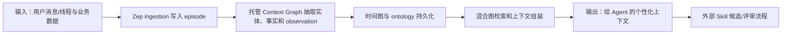

# Zep：托管 Context Graph 生态与开源边界案例

> **项目快照**：官方仓库 <https://github.com/getzep/zep>｜核验日期 2026-09-03｜Stars 约 4.9k｜许可证 Apache-2.0｜当前仓库在核验日有维护，但仓库自述为 Zep Cloud 示例/集成集合；旧 Community Edition 已移至 `legacy` 且不再支持。[^zep-repository][^zep-license]

> **需求画像**：目标是寻找能够自部署、接入多种 Agent、沉淀业务知识并支撑 Skill 更新的开源 Memory 项目。硬约束是单机可部署、模型 API 可切换和不把团队原始会话强制交给外部 SaaS；Zep 本报告主要用于理解其 Context Graph 设计及开源边界，实际自部署适配必须单独验证。

## 1. 项目要解决什么问题

### 目标用户与使用场景

当前 `getzep/zep` 仓库定位为 Zep Cloud 的 examples、framework integrations、bulk ingestion 和评估工具集合，用于帮助开发者接入 Zep 的托管 Agent Memory 平台。[^zep-repository]

Zep 的产品思路是从聊天历史、业务数据和用户行为组装相关上下文，使 Agent 获得个性化、及时的知识；官方文档把它描述为 temporal Context Graph。[^zep-docs]

### 当前问题

普通会话历史不能直接表达事实的变化、用户/实体关系和来源。Zep 产品通过上下文图谱、用户/线程/消息管理和知识图检索，解决长期记忆和上下文组装问题。[^zep-docs][^graphiti-zep]

对于 Skill 更新研究，Zep 的有价值部分是图谱、线程、episode、observation 和 ontology 等概念，以及其多语言 SDK/集成组织方式。[^zep-repository]

### 问题边界

当前仓库不是 Zep 产品或服务，并不提供可直接自托管的当前 Context Graph Engine。Community Edition 已 deprecated；将仓库的示例代码视为完整开源 Memory Server 会误导部署判断。[^zep-repository]

## 2. 设计的核心思路

### 核心判断

Zep 的核心是以时间知识图谱为中心组装上下文：用户消息和业务数据进入图谱，图谱根据当前/历史事实、关系和查询返回上下文。生产产品使用专有 Context Graph Engine，Graphiti 是其开源框架对应物。[^graphiti-zep][^zep-repository]

### Memory 实现方式

Zep 的公开产品/API 材料将消息、线程和业务数据描述为可进入托管的 Episode/Observation 图谱，并以时间、关系和用户/线程范围组装上下文；但本报告没有把这些产品描述扩展为已核验的内部算法。当前 `getzep/zep` 仓库的可核验部分主要是示例、集成、ingestion 和远程 API 适配，不能证明托管服务端的抽取、图存储或检索实现，也不能当作可自托管实现。[^zep-docs][^zepctl][^graphiti-zep][^zep-repository]

### 关键设计选择

- **用户/线程/消息作为一等对象**：产品 API 具备用户、session/thread 和消息管理，便于按会话上下文组织数据。[^zep-repository][^zep-docs]
- **图谱与 Observation**：CLI/API 目录包含 graph、episode、observation、ontology 和 thread-summary 等概念，体现从原始输入到派生知识的分层。[^zepctl]
- **多语言 SDK 和集成**：官方仓库维护 Python、TypeScript、Go SDK 以及多种 Agent framework integrations。[^zep-repository]
- **托管性能与治理**：Zep Cloud 提供生产检索、Dashboard、审计、SLA 和企业支持，这些不等价于 Apache-2.0 仓库能力。[^graphiti-zep]

### 向量化与模型接口核验

当前 `getzep/zep` 仓库是 Cloud examples/integrations 集合，未提供当前 Context Graph Engine 的自托管 Embedding 配置、默认模型、向量维度或可替换向量库；这些能力属于托管产品边界，不能从 SDK 示例推定。[^zep-repository][^zep-docs]

如果团队借鉴其开源 Graphiti 核心，Graphiti 默认使用 OpenAI `text-embedding-3-small`，核心默认维度为 1024，并提供 OpenAI/Azure/Gemini/Voyage embedder 及 OpenAI-compatible/Ollama 接入。这里的模型与维度是 Graphiti 的开源实现事实，不是 Zep Cloud 的自托管承诺。[^graphiti-zep][^zep-graphiti-embedder]

因此公司 API/DeepSeek 是否可用于 Zep 本身应标记为“未确认”；只有在实际使用 Zep Cloud/Graphiti 接口时，分别确认其 Embedding 数据出境、模型选择和维度约束。中文检索、模型切换、旧向量迁移及向量后端均需以目标产品合同/运行配置为准，不能把 Zep 仓库的 Apache-2.0 许可证等价为完整内网方案。[^zep-docs][^graphiti-zep]

### 代价与取舍

托管服务降低了图数据库、索引和权限运维，但要求使用 Zep Cloud API 和其数据边界；当前开源仓库无法提供同等自部署体验。调研判断：对本项目，Zep 更适合作为 Graphiti/Context Graph 的产品化对照，不适合作为单机内网首选。

## 2.1 源码实现核验：Zep 当前仓库与 Graphiti 替代证据

本次核验把源码证据分成三层：`getzep/zep` 当前 `main` 的活动目录、其中明确标为不再支持的 `legacy/`，以及独立的 `getzep/graphiti` 开源仓库。**目录中出现 `graph`、`episode`、`observation` 或 `search` 这些名称，并不等于当前 Zep 仓库包含受支持的 Context Graph Engine。**

### `getzep/zep` 当前仓库能直接核验到什么

- 根 README 将仓库定位为 Zep Cloud 的 example code、framework integrations 和 tools，并明确说仓库不是 Zep 的产品或服务；Community Edition 已移入 `legacy/` 且不再支持。[^zep-repository] `legacy/` 仍能看到历史 `server_ce.go` 和 Graphiti service 客户端代码，但它们不构成当前产品实现证据。[^zep-legacy-server][^zep-legacy-graphiti]
- `ingestion/src/zep_ingest/transforms/contextualizer.py` 的 `LLMContextualizer` 接收已有的 Episode chunk，为文档片段补充上下文并返回新的 chunk；它没有实现实体/关系抽取、图存储或时间事实合并。[^zep-contextualizer]
- `mcp/zep-mcp-server/internal/handlers/search.go`、`episodes.go` 和 `nodes.go` 分别构造请求后调用 `client.Graph.Search`、`client.Graph.Episode.GetByUserID` 和 `client.Graph.Node.GetByUserID`，本地代码只做参数校验和结果格式化。它们是访问 Zep API 的 MCP 接入层，不是本地图检索或存储实现。[^zep-mcp-search][^zep-mcp-episodes][^zep-mcp-nodes]
- 因而，在本次核验的活动目录与路径中，可以确认 SDK/示例、批量 ingestion、MCP API 适配和评估工具；但未发现受支持的当前 Memory/Context Graph Server、其抽取器、Observation 数据模型、时间图更新器或检索引擎。该结论限定于已核验路径和核验时点，不把未检查目录概括为仓库级不存在。

### 能力逐项核验与不可核验部分

| 要核验的实现 | `getzep/zep` 当前仓库 | `legacy/` 能说明什么 | 可用的 Graphiti 源码替代证据 |
| --- | --- | --- | --- |
| Memory/Context Graph 抽取 | **不能核验**。当前 ingestion 是上下文补写，MCP 是远程 API 转发；未见当前服务端抽取实现 | `legacy/src` 确有历史 Community Edition 的 API、store 和 Graphiti service 代码，但只能证明旧实现曾存在，不能证明当前 Cloud 的实现或支持状态 | `graphiti.py` 的 `add_episode`、`_extract_and_resolve_nodes`、`_extract_and_resolve_edges`，以及 `prompts/extract_nodes_and_edges.py` 直接展示实体/关系抽取与去重流程。[^graphiti-graphiti-source][^graphiti-extraction-source] |
| Episode | 当前仓库的示例、SDK/MCP 可以提交或读取远程 Episode；不能核验 Cloud 内部如何建模、抽取和持久化 | 旧 CE 以 message/session/memory 为主，不能把它当作当前 Graphiti 风格的 `EpisodicNode` 证据 | `nodes.py` 的 `EpisodicNode` 和 `graphiti.py` 的 `add_episode` 明确展示原始 Episode 节点、`valid_at` 和派生图数据的关系。[^graphiti-nodes-source][^graphiti-graphiti-source] |
| Observation | 独立 `zepctl` 的 CLI/API 表面或 Zep Cloud 远程响应可以暴露 observation 概念，但当前活动源码没有对应的本地抽取与持久化模型；Cloud Observation 语义不能从客户端反推 | legacy 代码不能证明 Cloud Observation 的字段、生命周期或兼容性 | Graphiti 没有同名 `Observation` 模型；它提供 `EpisodicNode`、`EntityNode` 和 `EntityEdge` 的独立节点/边分层，只能作功能对照，不能视为 Zep Observation 的等价实现。[^graphiti-nodes-source][^graphiti-edges-source] |
| 时间图谱与事实失效 | **不能核验当前 Zep Cloud 内部算法**；MCP 搜索只把查询交给远端 API | legacy 中的时间/事实代码属于不再支持的历史 CE，不能用来推断当前产品 | `edges.py` 保存 `valid_at`、`invalid_at`、`expired_at`；`edge_operations.py` 的 `resolve_extracted_edge`/`resolve_edge_contradictions` 展示新事实使旧事实失效的源码路径。[^graphiti-edges-source][^graphiti-edge-operations-source] |
| 图、向量、全文检索与重排 | 当前仓库只能核验远程 `client.Graph.Search` 接入，不能核验 Cloud 的索引、召回融合、评分或重排实现 | legacy 的 search 包只能作为历史 CE 证据，不是当前实现 | `search.py` 与 `search_config.py` 明确列出 cosine、BM25、BFS、Episode/Community 检索以及 RRF/MMR/cross-encoder 等组合方式。[^graphiti-search-source][^graphiti-search-config-source] |

### 边界结论

因此，本报告可以确认的是：**在当前 `getzep/zep` 公开活动代码和本次核验路径内，主要可见 Zep Cloud 的客户端、示例、集成、ingestion 和 MCP 工具；Zep Cloud 的核心 Context Graph/Memory Engine、Observation 抽取与存储、时间图谱更新以及生产检索实现无法由这些路径核验。** `legacy/` 中存在历史服务代码也不能改变这一结论，因为官方已将 Community Edition 标为不再支持。若需要源码级、可自部署的替代证据，应引用独立 Graphiti 仓库的上述文件；那证明的是 Graphiti 的开源实现能力，不证明 Zep Cloud 内部实现与其完全同构或具备同等商业治理能力。

## 3. 项目如何工作

### 工作流概览

### 阶段说明

| 阶段 | 接收什么 | 做什么 | 产生的状态或产物 | 证据 |
| --- | --- | --- | --- | --- |
| 会话接入 | 用户、线程、消息和业务数据 | SDK/ingestion API 登记输入 | thread/episode 原始记录 | [^zep-repository][^zep-docs] |
| 图谱构建 | 原始输入 | 托管引擎抽取实体、关系和观察 | Context Graph、observation | [^zepctl][^graphiti-zep] |
| 时间更新 | 新事实与旧事实 | 维护事实当前状态和历史关系 | 时间有效知识 | [^graphiti-zep] |
| 检索组装 | 查询与用户/线程范围 | 图、向量和全文检索组装上下文 | 相关上下文 | [^zep-docs] |
| Agent 消费 | 上下文和 SDK 结果 | 注入应用 Agent 或框架 | 个性化回答/行动 | [^zep-repository] |
| 下游治理 | 结果、thread/episode ID | 外部系统生成 Skill 候选和评审 | 可追溯变更 | 调研判断 |

### 关键状态与产物

- **Thread/Message**：会话边界和原始消息；适合绑定开发会话 ID，但当前开源仓库只是示例/客户端。[^zep-repository]
- **Episode**：知识摄取原始事件，作为派生观察和事实的来源。[^zepctl]
- **Observation/Graph**：从输入生成的派生实体、事实和关系，用于检索。[^zepctl]
- **Ontology/Thread summary**：约束知识结构和摘要策略，帮助上下文组装。[^zepctl]

### 最终输出

Zep Cloud SDK 返回面向 Agent 的上下文。对于 Skill 更新，可利用 thread/episode/observation ID 作为证据引用；但原始会话、候选生成和 Git 发布必须在团队自有系统完成。

## 4. 与需求画像逐项对照

### 需求矩阵

| 需求项 | 优先级或硬约束 | 项目现有能力 | 证据 | 状态 | 说明 |
| --- | --- | --- | --- | --- | --- |
| 项目业务知识长期保存 | 必须 | Zep Cloud Context Graph | [^zep-docs] | 满足 | 依赖托管服务；当前仓库不提供同等引擎 |
| 技术决策和经验可检索 | 必须 | 图谱、thread/episode/observation、SDK | [^zepctl][^zep-repository] | 部分满足 | 自部署持久化和访问控制未提供 |
| 完整开发会话接收 | 必须 | 消息/线程 API 示例 | [^zep-repository] | 部分满足 | Claude Code 选择上传和原始归档需自建 |
| 证据来源和历史 | 必须 | Context Graph 时间事实与 episode 概念 | [^graphiti-zep][^zepctl] | 部分满足 | 托管产品能力不能迁移为当前 OSS Server |
| 多 Agent 接入 | 必须 | 多框架 integrations、多语言 SDK | [^zep-repository] | 满足 | 具体集成通过 Zep Cloud API |
| 模型 API 可切换 | 必须 | 产品/SDK 支持 provider 配置，但当前仓库无完整服务实现 | [^zep-docs] | 部分满足 | 公司 API/DeepSeek 需在产品/Graphiti 层验证 |
| 单机自部署 | 必须 | Community Edition 已 deprecated；当前仓库为示例集 | [^zep-repository] | 不满足 | 不能把旧 legacy 当受支持生产路径 |
| 用户主动控制原始会话上传 | 期望 | 调用方决定调用 API | [^zep-repository] | 部分满足 | 产品权限/上传审批需自建或依赖云端 |
| Skill 候选人工发布 | 必须 | benchmark/eval/ingestion 可提供思路 | [^zep-repository] | 部分满足 | 没有团队 Skill Git 发布闭环 |

### 对照归纳

Zep Cloud 的 Memory 产品能力很完整，但当前开源仓库不满足“单机内网自部署”的硬约束。若研究目标是选择可落地 OSS，应把 Zep 的图谱设计映射到 Graphiti，而不是把 Zep Cloud 仓库直接部署。

## 5. 开源与能力边界

### 边界清单

| 能力 | 开源核心 | 商业版或 SaaS | 外部依赖 | 证据 |
| --- | --- | --- | --- | --- |
| Examples、integrations、ingestion 工具 | 有，Apache-2.0 | 用于连接 Zep Cloud | Python/TS/Go 运行时、Zep API Key | [^zep-repository][^zep-license] |
| Zep Context Graph Engine | 无（专有） | Zep Cloud/企业部署 | Zep 账号、API、网络 | [^graphiti-zep] |
| Community Edition Server | 仅 legacy，已不支持 | 无当前 OSS 等价物 | 旧依赖不应生产使用 | [^zep-repository] |
| Graphiti 开源框架 | 独立 Apache-2.0 项目 | Zep 产品内部使用 Graphiti 思路/能力 | 自建图数据库与服务 | [^graphiti-zep] |
| Dashboard、审计、SLA | 不在当前示例仓库 | Zep Cloud 提供 | 托管平台 | [^graphiti-zep] |

### 边界判断

官方 README 明确写出：仓库不是 Zep 产品或服务；Community Edition 被移到 `legacy` 并不再支持。该事实足以否决其作为本次单机 Memory 主选，但不否定其作为 Graphiti 和托管 Context Graph 的设计参考。[^zep-repository]

## 6. 用户如何接入和使用

### 接入前提

- 注册 Zep Cloud、获取 API Key，安装 `zep-cloud` 或对应语言 SDK。[^zep-docs]
- 选择 framework integration、ingestion 工具或 MCP/CLI；准备将开发会话转换为 thread/message/episode。
- 若要求内网和可控数据边界，需改选 Graphiti 或自建等价服务。

### 最快验证路径

1. 通过 SDK 创建用户/线程并写入消息或业务数据；或使用仓库 `ingestion` 工具导入 Slack、文档、Email、JSON/CSV 等。[^zep-repository]
2. 查询图谱节点、边、episode 或 observation，组装给 Agent 的上下文。[^zepctl]
3. 将结果和来源 ID 导出给外部 Skill 候选/评审系统；原始会话保留在公司自有存储。

### 日常使用方式

应用 Agent 每轮写入消息，并从 Zep Cloud 请求相关上下文。管理员使用托管平台的项目、API、日志和图谱工具；当前 OSS 仓库没有完整自托管管理面。[^graphiti-zep][^zep-repository]

### 接入限制

外部 SaaS 依赖与数据合规是关键限制；当前仓库的 examples/integrations 不能替代 Context Graph Engine。若接 DeepSeek/公司 API，需确认服务端模型配置，不应只依据客户端 SDK 推定支持。

## 7. 部署构成

### 运行组件

| 组件 | 必需或可选 | 职责 | 持久化数据 | 与其他组件的关系 | 证据 |
| --- | --- | --- | --- | --- | --- |
| Zep Cloud API | 当前产品路径必需 | 用户、线程、消息、图谱和检索 | 托管 Context Graph | 被 SDK/集成调用 | [^zep-docs] |
| Zep SDK/Integration | 必需 | 应用/Agent 接入 API | 客户端配置 | 调用 Zep Cloud | [^zep-repository] |
| Zep ingestion | 可选 | 批量导入文档、Slack、Email、JSON/CSV | 临时/任务状态 | 写入 Zep Cloud | [^zep-repository] |
| Zep CLI `zepctl` | 可选 | 管理 graph、episode、observation、ontology | 本地凭据配置 | 访问 Zep API | [^zepctl] |
| 本地原始会话归档/Skill 系统 | 本项目场景必需的外部组件 | 保存完整会话和候选变更 | 公司对象存储/Git | 与 Zep ID 关联 | 调研判断 |

### 最小部署路径

当前受支持的最小路径是注册 Zep Cloud、配置 API Key、安装 SDK 并调用 API；这不符合“单机内网自部署”基线。理论上的旧 Community Edition 位于 legacy 且不支持，不应作为 POC 最小路径。[^zep-repository][^zep-docs]

### 生产化仍需考虑

- 评估原始会话是否允许发送外部 SaaS、数据驻留、删除和审计；这些由托管平台条款和配置决定。
- 如果采用 Graphiti 替代，需要增加图数据库、MCP/REST、权限和备份；Graphiti 的部署评估见对应报告。
- 官方未给出当前 OSS 示例仓库的单机资源要求；云端性能指标不能直接外推到自建系统。

## 8. 适配结论与能力缺口

### 适配结论

**仅供借鉴。** Zep 的时间 Context Graph、thread/episode/observation 分层和多 Agent 集成方式值得用于设计团队 Memory，但当前开源仓库不是产品服务，Community Edition 已停维，不能满足单机内网自部署硬约束。

### 已满足能力

- Context Graph 的时间事实、来源和上下文组装模型。[^graphiti-zep]
- 多语言 SDK、Agent framework integrations、ingestion 和评估工具的组织方式。[^zep-repository]
- 可参考的线程、Episode、Observation、Ontology 数据分层。[^zepctl]

### 能力缺口

- **自部署核心**：当前仓库没有受支持的 Context Graph Engine/Server。
- **数据控制**：依赖 Zep Cloud，无法默认保证原始会话留在内网。
- **Skill 治理**：没有从会话证据到 Skill PR 的闭环。

### 需要自研或外部补齐

- 若坚持自建，需采用 Graphiti 或重建图谱、检索、用户/线程管理和服务层。
- 建立本地会话授权、原始归档、审计和 Git Skill 评审。

### 否决风险

“必须在一台内网服务器自部署”是当前明确否决项；除非 Zep 未来重新发布受支持的 OSS Server，否则不应作为主 POC 组合。

---

[^zep-repository]: [Zep 官方 GitHub 仓库（Examples & Integrations）](https://github.com/getzep/zep)
[^zep-license]: [Zep 仓库 Apache-2.0 许可证](https://github.com/getzep/zep/blob/main/LICENSE)
[^zep-docs]: [Zep 官方快速开始文档](https://help.getzep.com/v2/quickstart)
[^zepctl]: [Zep 官方 zepctl CLI](https://github.com/getzep/zepctl)
[^graphiti-zep]: [Graphiti README 中的 Zep 与 Graphiti 边界](https://github.com/getzep/graphiti#graphiti-and-zep)
[^zep-graphiti-embedder]: [Graphiti 官方 Embedder 实现（Zep 开源对应框架）](https://github.com/getzep/graphiti/tree/main/graphiti_core/embedder)
[^zep-contextualizer]: [Zep ingestion 的 LLMContextualizer 源码](https://github.com/getzep/zep/blob/main/ingestion/src/zep_ingest/transforms/contextualizer.py)
[^zep-mcp-search]: [Zep MCP Server 图搜索 handler 源码](https://github.com/getzep/zep/blob/main/mcp/zep-mcp-server/internal/handlers/search.go)
[^zep-mcp-episodes]: [Zep MCP Server Episode handler 源码](https://github.com/getzep/zep/blob/main/mcp/zep-mcp-server/internal/handlers/episodes.go)
[^zep-mcp-nodes]: [Zep MCP Server Node handler 源码](https://github.com/getzep/zep/blob/main/mcp/zep-mcp-server/internal/handlers/nodes.go)
[^zep-legacy-server]: [Zep legacy Community Edition server 源码](https://github.com/getzep/zep/blob/main/legacy/src/api/server_ce.go)
[^zep-legacy-graphiti]: [Zep legacy Graphiti service 源码](https://github.com/getzep/zep/blob/main/legacy/src/lib/graphiti/service_ce.go)
[^graphiti-graphiti-source]: [Graphiti Graphiti 类与 Episode/抽取流程源码](https://github.com/getzep/graphiti/blob/main/graphiti_core/graphiti.py)
[^graphiti-extraction-source]: [Graphiti 实体与关系抽取提示/模型源码](https://github.com/getzep/graphiti/blob/main/graphiti_core/prompts/extract_nodes_and_edges.py)
[^graphiti-nodes-source]: [Graphiti 节点与 EpisodicNode 模型源码](https://github.com/getzep/graphiti/blob/main/graphiti_core/nodes.py)
[^graphiti-edges-source]: [Graphiti EntityEdge 与时间字段源码](https://github.com/getzep/graphiti/blob/main/graphiti_core/edges.py)
[^graphiti-edge-operations-source]: [Graphiti 事实冲突与时间失效处理源码](https://github.com/getzep/graphiti/blob/main/graphiti_core/utils/maintenance/edge_operations.py)
[^graphiti-search-source]: [Graphiti 混合检索实现源码](https://github.com/getzep/graphiti/blob/main/graphiti_core/search/search.py)
[^graphiti-search-config-source]: [Graphiti 检索配置与方法源码](https://github.com/getzep/graphiti/blob/main/graphiti_core/search/search_config.py)
