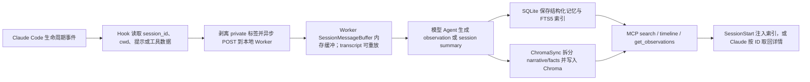

# claude-mem：面向 Claude Code 的本地会话记忆与压缩检索

> **项目快照**：官方仓库 <https://github.com/thedotmack/claude-mem>｜核验日期 2026-09-05｜Stars 约 93k｜许可证 Apache-2.0。最新发布版为 `v13.24.0`（2026-09-03）；README 已说明产品品牌改为 Grok Mem，但 npm 包名和 Claude Code 插件仍保留 `claude-mem`。本报告的源码实现核验以 2026-09-05 拉取的 `main` commit `ad3dcaa` 为准；版本标签与持续演进分支不能无条件视为同一版本。[^claude-mem-repository][^claude-mem-license][^claude-mem-release][^claude-mem-main-commit][^claude-mem-source-commit]

> **需求画像**：目标是在开发者本地自动收集 Claude Code 的用户提示、工具调用、文件上下文和会话总结，在后续会话中按项目检索并注入历史经验。必须尽量保留开发过程的可追溯性，支持 Claude Code Hooks、SQLite/全文检索和可选向量检索；模型服务需要能够在公司 API、Anthropic、Gemini、OpenRouter 或 OpenAI-compatible 网关之间切换。部署基线是单机优先、数据默认本地保存，并允许团队后续自研“筛选并经用户确认上传完整原始会话”的流程；该上传流程不是本项目现成的硬约束。

## 1. 项目要解决什么问题

### 目标用户与使用场景

claude-mem 面向使用 Claude Code 或其他受支持开发 Agent 的个人开发者。它把一次会话中发生的工具操作、用户提示、代码探索和问题解决过程转化为可检索的长期上下文，让 Agent 在新会话、清空上下文或上下文压缩后仍能知道项目最近做过什么。官方将其描述为“跨会话持久化上下文”，并强调观察、压缩和重新注入三个动作。[^claude-mem-repository]

对本次试点而言，最相关的场景是：开发者完成一项任务后，系统在本地异步生成结构化观察和总结；下一次处理类似问题时，Claude 可以先查找历史索引，再取回具体事实。团队可以从这些观察中人工筛选高价值的失败模式、业务规则和 Skill 改进线索。

### 当前问题

第一，Claude Code 的上下文窗口是会话级的，跨会话不会天然保留项目历史。claude-mem 在 `SessionStart` 时把近期上下文以 `additionalContext` 的形式注入当前会话。[^hooks-architecture]

第二，直接把所有历史会话原文塞入新提示会造成上下文和费用浪费。项目的 MCP 搜索设计采用“索引、时间线、详情”三层渐进披露：先返回带 ID 的紧凑结果，再查看目标附近的时间线，最后只取选中的完整观察。官方文档给出的目标是减少无关 token，而不是每次加载全部历史。[^search-architecture]

第三，开发过程中的工具调用数量很大，其中一部分对经验沉淀没有价值。项目在 Hook 层支持跳过低价值工具，并把观察发送到本地 Worker 异步处理，使 Hook 不等待模型压缩完成。[^hooks-architecture]

第四，原始提示、工具输入和工具输出可能包含密钥或个人信息。项目提供 `<private>...</private>` 标签，并在 Hook 边缘和 Worker 存储前再次剥离；这是一种用户主动标记的本地保护机制，不等价于企业级数据分类或审批流程。[^hooks-architecture][^security-policy]

### 问题边界

**分类说明：** claude-mem 通过开发会话事件完成 Memory 写入，但其主要持久化和输出对象是可召回的结构化 Memory，而不是完整原始会话归档。因此，本报告归入 Memory 项目；Hook 和 transcript watcher 是它的输入适配层，不是它的主要产品形态。

本报告主要描述 claude-mem 的 legacy 本地 Worker 路径。当前公开仓库另包含 Server-beta：它使用 Postgres、Valkey/BullMQ、API Key 和团队/项目作用域，可作为单独的自托管 beta runtime 评估；但它不等同于成熟 SaaS 或企业产品。Hosted/CMEM Pro、托管运营、成熟 Dashboard、计费和企业 UX 仍需按版本和服务边界单独判断。[^claude-mem-license][^claude-mem-server][^claude-mem-team]

它也不等于完整的项目知识库。观察是由模型根据开发过程生成的结构化记录，业务知识的准确性、冲突处理、版本归属和最终是否写入共享 Skill，仍需要团队额外治理。

## 2. 设计的核心思路

### 核心判断

claude-mem 的核心判断是：开发过程中的“观察”比未经整理的完整 transcript 更适合长期检索；把工具事件异步压缩为标题、叙事、事实、文件和概念，再通过渐进式检索交给 Agent，可以同时保留线索和控制上下文成本。[^architecture-overview][^search-architecture]

### 关键设计选择

- **用 Claude Code 生命周期 Hook 捕获事件**：`SessionStart` 注入历史，`UserPromptSubmit` 初始化会话并保存提示，`PreToolUse`（当前配置匹配 `Read`）提供文件上下文，`PostToolUse` 捕获工具观察，`Stop` 触发总结。事件通过统一的 `worker-service.cjs hook claude-code <event>` 分发；另有 transcript watcher 和 Cursor/Grok Bot 等外部集成路径，不能把所有输入都归为同一 Hook。[^hooks-json][^configuration][^claude-mem-transcript]
- **用本地 Worker 与 Hook 解耦**：Hook 进程只做输入读取、隐私标签剥离和本地 HTTP 调用；Worker 使用 Express API、Session Manager、数据库和模型 Agent 异步处理观察。官方架构强调 Hook 侧 fire-and-forget，避免模型处理阻塞开发会话。[^hooks-architecture]
- **结构化存储与全文检索优先**：SQLite 保存会话、提示、观察和总结，开启 WAL；SQLite FTS5 负责关键词检索。当前活动观察队列由进程内 `SessionMessageBuffer` 管理，旧版 `pending_messages` 表仍存在于兼容 schema、迁移或旧 API 中，但不能视为当前队列的可靠持久化层。[^database-architecture][^search-architecture][^claude-mem-buffer]
- **Chroma 作为可选语义检索层**：每条观察的 narrative 和每个 fact 被拆成独立文档写入 Chroma。`ChromaSync` 支持按传入项目名派生 collection，但当前 Worker/回填路径使用 `new ChromaSync('claude-mem')`，默认形成共享的 `cm__claude-mem` collection，再通过 `project` 等 metadata 过滤。[^architecture-overview][^chroma-sync]
- **MCP 工具本身只做协议翻译**：当前 MCP Server 的核心渐进检索工具是 `important_workflow`、`search`、`timeline`、`get_observations`，另有 `session_start_context`、代码结构检索、corpus 和 Server runtime 专用工具；业务逻辑集中在 Worker HTTP API，工具设计把渐进式披露写进调用流程。[^search-architecture][^claude-mem-source-mcp]

### 代价与取舍

自动压缩降低了长期检索的 token 成本，但会引入模型摘要错误、遗漏上下文和“模型认为重要但团队认为不重要”的风险。claude-mem 保存用户提示及结构化观察到本地 SQLite；transcript watcher 只解析 JSONL 事件并转成会话/观察事件，不复制完整原始文件，内置导出也主要面向 observations、summaries、prompts 和 metadata。[^hooks-architecture][^database-architecture][^claude-mem-transcript][^claude-mem-export]

本地 Chroma 采用 `uvx` 启动的 `chroma-mcp` 子进程；claude-mem 通过 `chroma-mcp` 间接使用其 embedding backend，源码固定 `chroma-mcp==0.2.6` 并为本地运行时提供 `onnxruntime>=1.20`、`protobuf<7` 覆盖。部署会带来 Python/uv/ONNX 运行时、首次模型下载、跨平台兼容和进程回收问题。当前源码已提供 Chroma `local`/`remote` 模式及 host/port/SSL/tenant/database/API key 设置，但没有直接配置 Embedding provider/model/base URL 的一等入口；更换 embedding 仍属于 Chroma 服务端或 `chroma-mcp` 后端职责。[^chroma-manager][^embedding-customization][^claude-mem-chroma-remote][^claude-mem-source-chroma-manager]

调研判断：legacy 本地路径适合个人连续使用和单机试点评估；如果要把多名成员的经验汇聚到共享 Memory，应单独评估公开的 Server-beta，并补齐身份、项目隔离、上传审批、知识审核和集中存储，不能直接把每个人的 `~/.claude-mem` 目录拼接起来。

## 3. 项目如何工作

### 工作流概览

### 阶段说明

| 阶段 | 接收什么 | 做什么 | 产生的状态或产物 | 证据 |
| --- | --- | --- | --- | --- |
| 生命周期捕获 | Claude Code 的 `session_id`、`cwd`、用户提示和工具事件 | Hook 按事件调用统一 Worker 命令；`PostToolUse` 可异步执行 | 会话初始化、提示记录、工具观察请求 | [^hooks-json][^configuration] |
| 边缘隐私处理 | 用户提示、`tool_input`、`tool_response` | 在发送和持久化前剥离 `<private>` 内容，并跳过配置中的低价值工具 | 可送入 Worker 的清理后事件 | [^hooks-architecture][^security-policy] |
| 会话排队 | 清理后的事件和会话 ID | Worker 通过本地 HTTP API 登记会话；当前活动观察由进程内 `SessionMessageBuffer` 缓冲，只有配置并运行 transcript watcher/replay 时才有 transcript 恢复来源 | `sdk_sessions`、`user_prompts` 与内存中的待处理消息；`pending_messages` 主要是兼容/旧路径 | [^worker-service][^database-architecture][^claude-mem-buffer][^claude-mem-transcript][^claude-mem-source-transcript-watcher] |
| 模型观察与总结 | 待处理工具事件、会话上下文 | 由 Claude Agent SDK 或可选 Gemini/OpenRouter 提供商异步生成 XML/结构化响应 | observation 的标题、叙事、事实、文件、概念，以及 session summary | [^hooks-architecture][^configuration] |
| 结构化持久化 | 模型生成结果 | 写入 SQLite；使用 FTS5 建立关键词检索字段和索引 | 本地 `claude-mem.db` 中的可追溯记录 | [^database-architecture] |
| 语义索引同步 | observation 的 narrative 和 facts | `ChromaSync` 将一个观察拆成多个文档并发送给 `chroma-mcp`；当前 Worker 默认使用共享 `cm__claude-mem` collection，并通过 metadata 过滤项目 | Chroma collection 和向量文档 | [^chroma-sync][^chroma-manager] |
| 渐进式检索 | Claude 的自然语言查询、项目和类型过滤 | MCP Server 将调用翻译为 Worker HTTP 请求，先搜索索引，再取时间线和完整详情 | 紧凑索引、时间线、选中观察详情 | [^search-architecture] |
| 上下文注入 | 当前项目和启动事件 | `SessionStart` 查询近期总结/观察，格式化为 `additionalContext` | 新会话可见的历史索引 | [^hooks-architecture][^configuration] |

### 关键状态与产物

- **会话状态**：`sdk_sessions` 记录 Claude session、项目、状态、创建时间和完成时间；提示、观察和总结通过会话 ID 关联。项目要求使用 IDE 提供的 `session_id`，不自行生成替代 ID。[^database-architecture][^hooks-architecture]
- **用户提示**：`user_prompts` 保存经过 `<private>` 清理和长度限制的用户提示本地副本，使问题描述可以被检索；`sdk_sessions.user_prompt` 还有单独的会话级字段，隐私标签的 raw-prompt 回退边界见源码核验小节。安全文档明确提醒，这些内容默认只写入本地，但后续模型压缩调用仍可能发送到所选供应商。[^hooks-architecture][^security-policy][^claude-mem-source-prompt-storage][^claude-mem-source-session-store]
- **观察**：观察包含类型、标题、叙事、事实、文件和概念等结构化字段，并使用 `content_hash` 等字段辅助去重和更新；它是项目长期检索的主要颗粒度。[^architecture-overview][^database-architecture]
- **总结**：`session_summaries` 保存本次会话的请求、完成情况和学到的内容，SessionStart 会优先使用近期总结建立上下文索引。[^architecture-overview][^hooks-architecture]
- **全文索引**：SQLite FTS5 的虚拟表用于关键词检索，查询会转成安全的 FTS5 表达式；官方文档说明典型查询目标是毫秒级响应，但实际速度仍需按数据量和机器验证。[^search-architecture]
- **向量集合**：`ChromaSync` 支持按传入项目名派生 `cm__<project>` 形式的集合；但当前 Worker/回填路径使用 `new ChromaSync('claude-mem')`，默认形成共享的 `cm__claude-mem` collection，并通过 `project` 等 metadata 过滤。一个 observation 的 narrative 和 facts 采用稳定 ID 分别写入，便于重试、更新和去重。[^chroma-sync]

### 最终输出

对开发者而言，最终输出有两种形态。第一种是新会话启动时注入的近期上下文索引，帮助 Claude 知道最近有哪些会话和观察；第二种是 MCP 搜索结果，Claude 根据索引 ID 取回时间线或完整观察，作为当前任务的参考。[^search-architecture][^hooks-architecture]

对 Skill 更新试点而言，完整观察可以作为人工复盘材料：团队成员先通过项目、日期、类型和关键词定位候选记录，再由负责人读取详情，判断是否形成业务知识、失败模式或 Skill 修改建议。项目本身不会自动完成“候选经验评审—Git 合并—回归验证”。

### 3.1 源码实现核验（main @ `ad3dcaa`）

以下结论不是根据 README 的概念图推断，而是对官方 `main` 源码中实际类、函数和 Hook 配置的静态核验。它也补充了 legacy 本地 Worker 与 Server runtime 之间的边界。

#### Hook 与 transcript watcher 是两条输入路径

| 路径 | 真实文件与类/函数 | 实际行为 | 核验结论 |
| --- | --- | --- | --- |
| Claude Code 生命周期 Hook | `plugin/hooks/hooks.json`；`src/cli/handlers/context.ts` 的 `contextHandler`；`session-init.ts` 的 `sessionInitHandler`；`observation.ts` 的 `observationHandler`；`file-context.ts` 的 `fileContextHandler`；`summarize.ts` 的 `summarizeHandler` | `SessionStart(startup\|clear\|compact)` 启动 Worker 并调用 `/api/context/inject`；`UserPromptSubmit` 调用 `/api/sessions/init`；`PostToolUse(*)` 异步调用 `/api/sessions/observations`；`PreToolUse(Read)` 查询按文件关联的观察；`Stop` 从 transcript 中取最后一段 assistant 文本并调用 `/api/sessions/summarize`。 | “Hook 自动收集”成立，但默认采集的是事件字段和结构化观察链，不是把 Claude Code transcript 文件整体复制进 claude-mem。[^claude-mem-source-hooks][^claude-mem-source-handlers] |
| 可配置 transcript watcher | `src/services/transcripts/watcher.ts` 的 `FileTailer`、`TranscriptWatcher`；`processor.ts` 的 `TranscriptEventProcessor`；`cli.ts` 的 `runTranscriptCommand` | watcher 使用 `fs.watch`、文件 offset 和 `*.jsonl` 扫描增量读取；每行 `JSON.parse` 后按 schema 的 `session_init`、`user_message`、`tool_use`、`tool_result`、`session_end` 等 action 分派。`tool_use/tool_result` 最终进入 `ingestObservation`，`session_end` 排队总结。 | 这是独立的、schema 驱动的输入适配器；`config.ts` 的样例配置默认 `watches: []`，必须初始化/配置并运行 `claude-mem transcript watch`，不能说它必然随 Claude Code 插件默认启动。watch state 只保存文件 offset，不保存原始 JSONL。[^claude-mem-source-transcript-watcher][^claude-mem-source-transcript-processor][^claude-mem-source-transcript-cli][^claude-mem-source-transcript-config][^claude-mem-source-transcript-state] |

#### `SessionMessageBuffer` 是进程内队列，不是可恢复的 SQLite 队列

`src/services/worker/SessionMessageBuffer.ts` 的 `SessionMessageBuffer` 用 `Map<sessionDbId, BufferedMessage[]>` 保存观察/总结消息；`enqueue()` 以 `toolUseId` 在当前 Worker 生命周期内去重，`drain()` 逐条 claim，观察生成器空闲三分钟后触发 abort，`confirm()`/`resetClaimed()` 只用于同一进程内的生成器控制。`SessionManager.getMessageIterator()` 将其接给观察生成器。源码注释明确写出：旧 `pending_messages` 持久化队列已被替换，Worker 崩溃时内存缓冲丢失；只有在配置并运行 transcript watcher 或显式执行 transcript replay 时，transcript 才能作为恢复来源，默认 Hook 路径没有持久化队列恢复能力。`pending_messages` 表仍出现在 `SessionStore` 的 schema/migration/清理兼容代码中，但不是当前观察生成的可靠恢复队列。[^claude-mem-source-buffer][^claude-mem-source-session-manager]

#### observation/summary 的真实生成、解析和持久化链

1. `src/services/worker/http/shared.ts` 的 `ingestObservation()` 先做项目/工具过滤、`PrivacyCheckValidator.checkUserPromptPrivacy()`，再对 `toolInput` 和 `toolResponse` 执行 `stripMemoryTags()`，最后调用 `SessionManager.queueObservation()`；`SessionRoutes.handleSessionInitByClaudeId()` 保存清理后的 user prompt 并启动生成器。[^claude-mem-source-ingest][^claude-mem-source-session-routes][^claude-mem-source-privacy]
2. `src/services/worker/ClaudeProvider.ts` 的 `createMessageGenerator()` 将 `buildInitPrompt()`/`buildContinuationPrompt()`、`buildObservationPrompt()` 和 `buildSummaryPrompt()` 作为合成 user message 送入 `@anthropic-ai/claude-agent-sdk` 的 `query()`。观察提示要求一个或多个 `<observation>`，总结提示要求唯一根标签 `
`；超大字段默认按 16,000 字符 head/tail 截断，在提交观察生成请求前还可调用 `optimizeObservationFields()` 压缩 tool input/output。观察者进程使用 `--no-session-persistence`，不是把观察者自身 transcript 当作长期记忆。[^claude-mem-source-provider][^claude-mem-source-prompts]
3. `src/sdk/parser.ts` 的 `parseAgentXml()` 只接受 `<observation>`、`
` 或 `<skip_summary>`；`src/services/worker/agents/ResponseProcessor.ts` 的 `processAgentResponse()` 在拿到 memory session ID 后调用 `SessionStore.storeObservations()`，保存 observation 字段（title、narrative、facts、concepts、files）和 summary 字段（request、investigated、learned、completed、next_steps、notes），随后异步触发 Chroma 同步。也就是说，长期主数据是模型抽取后的结构化结果，不是工具输入/输出原文的逐条归档。[^claude-mem-source-parser][^claude-mem-source-response-processor]

#### SQLite、FTS5 与 Chroma 的实际分工

- **SQLite/WAL**：`DatabaseManager.initialize()` 打开 `DB_PATH`，以同一连接初始化 `SessionStore` 和 `SessionSearch`，并由 `applySqliteConnectionPragmas()` 设置 `busy_timeout`、foreign keys、`synchronous=NORMAL`、WAL 等。legacy Worker 的 `SessionStore` 主表是 `sdk_sessions`、`user_prompts`、`observations`、`session_summaries`；Server-owned 的 `memory_items_fts` 是另一套 schema，不能与个人 Worker 的表混称。[^claude-mem-source-db-manager][^claude-mem-source-session-store][^claude-mem-source-sqlite-connection][^claude-mem-source-server-schema]
- **FTS5**：`SessionSearch` 先探测 FTS5；可用时建立外部内容表 `observations_fts` 和 `session_summaries_fts`，通过 insert/update/delete trigger 与主表同步，并用 `MATCH` 查询。user prompt 的查询路径仍是转义后的 `LIKE`，所以“所有 SQLite 文本都由 FTS5 检索”并不准确。FTS5 不可用或 Chroma 未初始化时，搜索会降级到 SQLite 过滤/关键词路径。[^claude-mem-source-session-search][^claude-mem-source-search-manager]
- **Chroma**：`DatabaseManager` 默认构造 `new ChromaSync('claude-mem')`，所以本地 Worker 默认 collection 名为 `cm__claude-mem`，项目和 `platform_source` 通过 metadata 过滤。`ChromaSync.formatObservationDocs()` 把 narrative、可选 text、每个 fact 拆成独立文档；summary 的 request/investigated/learned/completed/next_steps/notes 和 user prompt 也分别建文档，ID 为稳定的 `obs_*`、`summary_*`、`prompt_*`。`ChromaMcpManager` 通过 MCP stdio 调用 `chroma-mcp==0.2.6`；local 模式用持久化 data dir，remote 模式读取 `CLAUDE_MEM_CHROMA_HOST/PORT/SSL/TENANT/DATABASE/API_KEY` 连接已有 Chroma。claude-mem 自身没有 `EMBED_PROVIDER/MODEL/DIMENSION` 配置，也不直接实例化 embedding 模型；embedding 行为属于 `chroma-mcp` 后端。[^claude-mem-source-chroma-sync][^claude-mem-source-chroma-manager][^claude-mem-source-settings]
- **混合检索**：`SearchManager.search()`/`SearchOrchestrator` 在有 query 且 Chroma 可用时先做语义查询，再按 metadata 和时间窗口用 SQLite hydrate；Chroma 连接/查询失败会回退 FTS5，平台范围查询出现 Chroma 零结果时也有 scoped FTS fallback。无 query 的 filter-only 查询直接走 SQLite。[^claude-mem-source-search-manager][^claude-mem-source-search-orchestrator]

#### MCP 渐进检索与 SessionStart 注入的实际实现

- `src/servers/mcp-server.ts` 的 `important_workflow` 在工具说明中推荐三层顺序：`search(query)` 返回带 ID 的索引；`timeline(anchor|query)` 返回锚点前后的时间线；`get_observations(ids)` 批量取选中观察详情。它是调用约定而非源码中的强制状态机；这些工具仍可按各自参数独立调用。MCP 还有 `session_start_context`，它只是调用同一个 `/api/context/inject`，并不是另一套记忆数据库。当前 server 还同时暴露 `smart_search`、`smart_outline`、`smart_unfold`、corpus 以及 Server runtime 专用的 `observation_*` 工具，因此“只暴露四个 MCP 工具”已不再是当前源码事实。[^claude-mem-source-mcp]
- `contextHandler` 将 `/api/context/inject` 的文本放进 Claude Code Hook 的 `hookSpecificOutput.additionalContext`；`ContextBuilder.generateContextWithStats()` 以只读 SQLite 查询多项目 observations/summaries，按 context settings 生成 timeline、最近 summary、可选完整 observation 字段和 token economics，再返回注入文本。默认注入是受配置限制的索引/时间线，不是所有历史详情；`full=true` 才把数量上限放开。[^claude-mem-source-context-handler][^claude-mem-source-context-builder][^claude-mem-source-context-config]

#### 隐私与“原始 transcript”限制（必须单独看待）

- `<private>...</private>` 是显式标记式过滤，不是自动 secret/PII 检测。`stripMemoryTags()` 会在 prompt、tool input、tool response 和 Stop hook 的最后 assistant 文本进入观察/总结链前移除这些标签；在正常 Hook 顺序下，完全由 `<private>...</private>` 包裹的 prompt 不写入 `user_prompts`，随后观察/总结也会被跳过。但 `PrivacyCheckValidator` 把“找不到 user_prompts 行”解释为 Worker 启动竞态并允许 ingest，因此竞态下不能把该跳过逻辑当作绝对保证。Hook 还把普通 prompt 在 session-init 边界限制为 256 KiB，存入 `user_prompts` 的文本由 `normalizeStoredPromptText()` 再限制为 4,000 字符。[^claude-mem-source-tags][^claude-mem-source-session-routes][^claude-mem-source-prompt-storage][^claude-mem-source-privacy]
- 这个保护**不是绝对的“原文从不落盘”保证**：`handleSessionInitByClaudeId()` 先以 raw prompt 调用 `createSDKSession()`；`normalizeStoredPromptText()` 在剥离结果为空时回退到 trimmed raw prompt。因此，一个完全包在 `<private>` 中的 prompt 可能仍先出现在 `sdk_sessions.user_prompt`，随后才因 `cleanedPrompt` 为空而不写入 `user_prompts`、不生成 observation/summary。这是当前源码应明确披露的隐私边界。[^claude-mem-source-session-routes][^claude-mem-source-session-store][^claude-mem-source-prompt-storage]
- 配置后的 transcript watcher 可读取不同 Agent 的 JSONL；Claude Code Stop hook 则读取 Claude Code 提供的 transcript path 并只提取最后 assistant turn/model。源码只保存 offset、session metadata、cleaned prompt、结构化 observation/summary 和 Chroma 文档；没有看到把完整原始 JSONL 复制到 SQLite、Chroma 或 export JSON 的实现。`export-memories.ts` 导出的是 observations、summaries、prompts 和 session metadata，而不是原始 transcript 文件。若要审计级回放，仍需团队另建“按会话选择、脱敏、哈希、授权上传”的原始 transcript 归档层。[^claude-mem-source-transcript-watcher][^claude-mem-source-transcript-processor][^claude-mem-source-transcript-parser][^claude-mem-source-transcript-state][^claude-mem-source-export]

综上，报告中的“异步观察 + SQLite/FTS5 + 可选 Chroma + MCP 渐进检索 + SessionStart 注入”主判断得到源码支持；需要修正的精确表述是：transcript watcher 默认不是 Hook 必经路径，`SessionMessageBuffer` 是内存队列，Chroma 的 remote 连接已有显式设置但 embedding provider 仍不由 claude-mem 配置，MCP 工具已超出四个核心工具，而且 `<private>` 不能承诺所有原始敏感文本绝不进入 `sdk_sessions.user_prompt`。

## 4. 与需求画像逐项对照

### 需求矩阵

| 需求项 | 优先级或硬约束 | 项目现有能力 | 证据 | 状态 | 说明 |
| --- | --- | --- | --- | --- | --- |
| 收集 Claude Code 开发会话 | 必须 | 通过 Setup、SessionStart、UserPromptSubmit、PreToolUse、PostToolUse、Stop Hook 采集生命周期事件；另有 transcript watcher 解析 JSONL 事件 | [^hooks-json][^configuration][^claude-mem-transcript] | 满足 | 默认采集的是提示、工具事件和结构化结果；watcher 也不复制完整原始 transcript，项目主流程不应直接等同于完整原始会话归档。 |
| 保留会话来源和项目归属 | 必须 | 使用 IDE 提供的 `session_id`，SQLite 记录项目、会话和子记录关联 | [^hooks-architecture][^database-architecture] | 满足 | 适合作为后续候选经验的来源 ID；跨成员集中汇聚时还需要成员身份和仓库版本字段。 |
| 异步处理，不阻塞开发 | 必须 | Hook 通过本地 HTTP fire-and-forget，Worker 异步调用模型和写库 | [^hooks-architecture] | 满足 | Hook 仍有超时和 Worker 可用性边界；需要在试点中验证极端冷启动和模型限流。 |
| 结构化提取开发经验 | 必须 | 由模型生成 observation、facts、narrative、文件和 session summary | [^architecture-overview][^hooks-architecture] | 满足 | 结构化结果可供人工筛选，但准确性和知识治理不由项目保证。 |
| SQLite 本地持久化 | 必须 | `~/.claude-mem/claude-mem.db`，SQLite WAL + FTS5 | [^database-architecture] | 满足 | 默认单用户本地数据目录；共享服务需要另行设计隔离和备份。 |
| 关键词检索 | 必须 | Worker 通过 SQLite FTS5 查询观察索引 | [^search-architecture] | 满足 | Chroma 不可用时仍可使用。 |
| 向量语义检索 | 期望 | ChromaSync 调用本地或远程 Chroma MCP；本地默认路径由 chroma-mcp 提供 ONNX embedding backend | [^chroma-sync][^chroma-manager][^claude-mem-chroma-remote][^claude-mem-source-chroma-manager] | 部分满足 | 语义检索需要 Python/uv/chroma-mcp 和模型初始化，或已有远程 Chroma；当前没有直接配置 Embedding provider/model/base URL 的一等入口。 |
| 生成模型 API 可切换 | 必须 | `CLAUDE_MEM_PROVIDER` 支持 Claude、Gemini、OpenRouter；OpenRouter 当前源码支持自定义 OpenAI-compatible base URL | [^configuration][^openrouter-provider] | 满足 | 公司 API 或 DeepSeek 可通过 Anthropic-compatible/LiteLLM 网关，或 OpenAI-compatible 的 OpenRouter provider base URL 接入；需要验证响应格式、模型能力和费用。 |
| Embedding 模型 API 可切换 | 必须 | 配置中没有 `CLAUDE_MEM_EMBED_*` 设置；本地默认 embedding backend 由 chroma-mcp 提供 | [^chroma-manager][^embedding-customization][^claude-mem-source-chroma-manager] | 不满足 | 可关闭 Chroma 使用 SQLite FTS5；要用公司或 DeepSeek 的向量模型，需要修改/替换 chroma-mcp/远程 Chroma 的 embedding backend，并保证建库和查询使用同一维度与模型。 |
| 支持多个 Agent | 期望 | 仓库包含 Claude Code、Codex、Cursor、OpenCode、OpenClaw 等适配/Hook 路径 | [^claude-mem-repository][^configuration] | 部分满足 | Claude Code 路径最完整；不同 Agent 的事件语义和 transcript 结构不同，团队仍需统一事件模型和适配器。 |
| 本地隐私控制 | 必须 | 状态文件默认写入本地目录、Worker 默认绑定 127.0.0.1，支持 `<private>` 标签；Cloud Sync 可选 | [^security-policy][^hooks-architecture][^claude-mem-cloud] | 满足 | 未配置 Cloud Sync 时本地保存是默认路径，但模型供应商调用仍可能收到压缩上下文；启用 Cloud Sync 后，观察、总结和完整用户 prompt 会同步到配置的 Hub，私有标签也依赖用户正确标记。 |
| 用户确认后上传完整原始会话 | 期望 | 提供本地数据、搜索和导出/导入相关能力，但没有现成的逐会话审批上传流 | [^claude-mem-license][^worker-service][^claude-mem-export] | 部分满足 | 内置 watcher 和导出主要处理结构化事件、观察、总结、提示和 metadata；完整原始 JSONL 的选择、哈希、打包、脱敏和上传仍需外部实现。 |
| 单机部署 | 必须 | `npx claude-mem install` 本地安装 Node/Bun/uv 相关运行时、Worker、SQLite 和可选 Chroma MCP | [^installation][^claude-mem-repository] | 满足 | 个人路径不需要 Postgres/Redis；启用 server-beta 团队服务则会引入 Postgres、Valkey 和多个容器，不属于最小个人部署。 |
| 经验可追溯到原始会话 | 必须 | 观察和总结有 session/observation ID，并可按 ID 取回详情 | [^database-architecture][^search-architecture] | 部分满足 | 能追溯到 claude-mem 保存的事件和观察；若要求审计级完整原文、代码快照和提交版本，需要补充原始 transcript 与 Git 元数据。 |
| 直接更新 Skill 并自动发布 | 期望 | 未提供自动生成候选 PR 或发布机制 | [^claude-mem-license][^claude-mem-repository] | 不满足 | 适合把观察作为证据输入，Skill 修改仍应走人工评审和 Git 验证闭环。 |

### 对照归纳

claude-mem 对“个人本地会话持续收集、压缩、检索和启动时注入”匹配度高，尤其适合评估开发过程是否能沉淀为可检索观察。它的主要缺口是没有直接配置 Embedding API 的一等入口、完整原始会话归档和逐会话上传审批；公开 Server-beta 可作为团队路径单独评估，但不能把它与 legacy 本地 Worker 或成熟 SaaS 能力混为一谈。

如果先采用 SQLite FTS5，并把 Chroma 作为可选增强，legacy 本地路径可以在单机上启动。若要求使用公司的向量模型，则需要改造 Chroma/远程 Chroma 的 embedding backend，并不能把当前默认 ONNX 模型描述成 claude-mem 的直接可配置能力。

## 5. 开源与能力边界

### 边界清单

| 能力 | 开源核心 | 商业版或 SaaS | 外部依赖 | 证据 |
| --- | --- | --- | --- | --- |
| Claude Code 插件、Hook、Worker、SQLite、MCP 工具 | 有，Apache-2.0 | 无需商业版即可运行个人本地路径 | Claude Code 插件机制、Node/Bun、SQLite | [^claude-mem-license][^hooks-json] |
| 本地结构化观察与会话总结 | 有 | 无需商业版 | Claude Agent SDK 或可选 Gemini/OpenRouter API | [^hooks-architecture][^configuration] |
| SQLite FTS5 搜索 | 有 | 无需商业版 | Bun SQLite | [^database-architecture][^search-architecture] |
| Chroma 向量索引 | 有 | 无需商业版 | `chroma-mcp`、Python/uv、ONNX Runtime 和本地模型 | [^chroma-manager][^security-policy] |
| Embedding 模型替换 | 未确认/当前无正式配置 | 未确认 | 需要自行改造 chroma-mcp 或替换向量层 | [^embedding-customization] |
| Claude、Gemini、OpenRouter 生成提供商 | 有 | Hosted/CMEM Pro 是可选服务 | 对应供应商凭据和网络 | [^configuration][^claude-mem-repository] |
| OpenAI-compatible 自定义生成端点 | 有，走当前 OpenRouter provider 的 base URL | 未确认 | 公司网关、DeepSeek、LM Studio、LiteLLM 等 | [^openrouter-provider][^configuration] |
| 本地 Web Viewer、HTTP API、MCP 检索 | 有 | Hosted Server/团队服务另行区分 | 本地 Worker | [^worker-service][^claude-mem-license] |
| Cloud Sync、Server-beta 与团队能力 | Server-beta 的基础 Postgres、Valkey/BullMQ、API Key、团队/项目路由代码已公开；Cloud Sync 为可选出站路径 | Hosted/CMEM Pro、托管运营、成熟企业 UX 和服务边界需另行核验 | cmem.ai Hub、Postgres、Valkey/BullMQ、网络与凭据 | [^claude-mem-server][^claude-mem-team][^claude-mem-cloud][^claude-mem-license] |
| 个人上传审批、脱敏审计、Skill PR 自动化 | 无 | 未确认 | 需要自研组织治理层和 Git 集成 | [^claude-mem-license] |

### 边界判断

Apache-2.0 覆盖公开仓库中的开源代码，但不能把 Hosted/CMEM Pro 的托管运营、成熟企业 UX 或服务条款自动等同于本地能力。个人路径可审查代码、Hook、Worker、SQLite、MCP 和 Chroma；当前公开仓库也包含 Server-beta 的 Postgres、Valkey/BullMQ、API Key、团队/项目路由，但它仍是 beta runtime，不能从个人模式或公开代码直接推导出成熟企业服务。[^claude-mem-license][^claude-mem-server][^claude-mem-team]

生成模型切换和 Embedding 模型切换是两个不同边界。当前源码允许通过提供商设置改变“观察压缩/总结”调用；Chroma 的向量生成由 `chroma-mcp` embedding backend 决定。claude-mem 已能直接配置本地/远程 Chroma 的连接参数，但没有 Embedding provider/model/base URL 的一等设置；若替换 embedding backend，仍需在 Chroma 服务端或 `chroma-mcp` 层配置，并处理已有 collection 的重建和迁移。[^configuration][^chroma-manager][^embedding-customization][^claude-mem-chroma-remote][^claude-mem-source-chroma-manager]

## 6. 用户如何接入和使用

### 接入前提

- Claude Code 需要支持插件和生命周期 Hook；仓库也提供 Cursor、Codex、OpenCode 等其他适配路径，但本报告以 Claude Code 主路径为准。[^claude-mem-repository][^configuration]
- 个人安装路径需要 Node.js 20+、Bun、uv 和 SQLite；官方 README 说明 Bun 和 uv 可由安装器处理，SQLite 随运行时使用。[^claude-mem-repository]
- 至少需要一个生成/压缩模型提供商：Claude subscription/API/gateway、Gemini API 或 OpenRouter；如果使用 Claude gateway，可设置 `ANTHROPIC_BASE_URL` 和 `ANTHROPIC_AUTH_TOKEN`。[^configuration]
- 如果开启默认 Chroma 语义检索，还需要能够运行 `uvx chroma-mcp==0.2.6`，并允许首次下载 ONNX 模型和 Python 依赖；远程 Chroma 需要另行配置服务端 embedding backend。[^chroma-manager][^claude-mem-chroma-remote]

### 最快验证路径

1. **安装插件和本地依赖**：运行 `npx claude-mem install`，或在 Claude Code 中添加官方 Marketplace 并安装 `claude-mem`。安装器写入 Hook 配置、数据目录和 Worker 启动信息。[^claude-mem-repository][^installation]
2. **选择生成模型提供商**：在 `~/.claude-mem/settings.json` 设置 `CLAUDE_MEM_PROVIDER` 及对应 API Key/模型。公司 Anthropic-compatible 网关可沿 Claude SDK 路径配置；DeepSeek 或其他 OpenAI-compatible 服务可配置 OpenRouter provider 的自定义 base URL、API Key 和模型名。[^configuration][^openrouter-provider]
3. **确认本地目录和端口**：默认数据根为 `~/.claude-mem`，Worker 默认绑定 `127.0.0.1`，端口为每用户计算的默认端口，也可通过 `CLAUDE_MEM_WORKER_PORT` 覆盖。[^configuration][^worker-service]
4. **验证 Hook 和 Worker**：重启 Claude Code，检查 Worker 健康状态和本地数据库；官方提供 `worker:status`、`worker:logs`、上下文 Hook 测试和 SQLite 查询示例。[^troubleshooting][^getting-started]
5. **决定向量路径**：初次试点可以保留 Chroma 默认配置；如遇平台、启动或资源问题，可设置 `CLAUDE_MEM_CHROMA_ENABLED=false`，只使用 SQLite + FTS5，并把语义检索适配作为后续工作。[^settings-source][^chroma-issues]

### 日常使用方式

正常开发时用户不需要手动提交每条记录。Hook 会在会话开始时注入近期上下文，在用户提交提示时登记会话，在工具执行后异步生成观察，在 Stop 时生成总结。Claude 需要检索历史时，使用 MCP 的 `search` 获取紧凑索引，再使用 `timeline` 和 `get_observations` 读取必要详情。[^hooks-architecture][^search-architecture]

团队如果要服务 Skill 更新，可以约定每周从 Viewer 或 MCP 搜索中挑选高价值记录：例如同一测试错误反复出现、用户纠正了业务规则、Agent 多次绕过某个 Skill，或者某次修复形成了可复用的验证步骤。人工评审时保存 observation ID、项目、时间和必要上下文，再生成 Skill 候选变更。

### 接入限制

当前 Hook 采集的是事件和结构化观察链，并非一个带权限审批的原始 transcript 归档系统。若团队要求“用户主动选择某一个完整开发会话后才上传”，需要增加本地 Viewer/CLI 导出、确认页、脱敏检查、压缩打包和上传 API；项目现有本地存储可以作为来源，但不会自动提供这条治理链。

Embedding 也不能只通过 `CLAUDE_MEM_PROVIDER` 切换。生成模型可以使用 DeepSeek 等 OpenAI-compatible API，而向量模型仍由 Chroma MCP 的 embedding backend 负责；当前 claude-mem 可通过 `CLAUDE_MEM_CHROMA_MODE` 等设置连接本地或远程 Chroma，但要接公司 Embedding API，仍需改造/配置 Chroma MCP 服务端并统一 collection 创建、读取和旧向量重建策略。[^embedding-customization][^chroma-manager][^claude-mem-source-chroma-manager]

## 7. 部署构成

### 运行组件

| 组件 | 必需或可选 | 职责 | 持久化数据 | 与其他组件的关系 | 证据 |
| --- | --- | --- | --- | --- | --- |
| Claude Code 插件 Hook | 必需（Claude Code 模式） | 接收生命周期事件，启动 Worker，注入上下文和转发观察 | Hook 配置在 Claude 配置/插件目录 | 调用本地 Worker HTTP 或 Worker 命令 | [^hooks-json][^configuration] |
| Node.js/Bun Worker Service | 必需 | Express HTTP API、会话管理、模型 Agent、搜索、Viewer、进程管理 | PID、日志、运行状态；业务数据落 SQLite/Chroma | 被 Hook、MCP Server 和 Viewer 调用 | [^worker-service][^claude-mem-repository] |
| SQLite 3 + FTS5 | 必需 | 保存 sessions、prompts、observations、summaries 和全文索引 | `~/.claude-mem/claude-mem.db` | Worker 读写；MCP 搜索通过 Worker 查询 | [^database-architecture][^search-architecture] |
| 模型提供商 | 必需 | 压缩观察、生成总结、抽取结构化字段 | 项目本地保存配置；供应商侧是否留存取决于其政策 | Worker 通过 Claude SDK、Gemini 或 OpenRouter 调用 | [^configuration][^security-policy] |
| `uvx` + `chroma-mcp` | 可选但默认启用语义层 | 通过 MCP stdio 提供 Chroma collection、写入和查询 | `~/.claude-mem/chroma/` 及 Chroma SQLite | ChromaSync 由 Worker 调用 | [^chroma-manager][^architecture-overview] |
| chroma-mcp embedding backend（本地路径含 ONNX Runtime 依赖） | Chroma 本地模式时必需 | 默认本地 Embedding 计算 | uv/Chroma 缓存和向量数据目录 | 被 chroma-mcp 加载，生成向量；具体模型由该后端负责 | [^chroma-manager][^embedding-customization][^claude-mem-source-chroma-manager] |
| MCP Server | Claude Code 插件路径中必需 | 以 stdio 暴露四个核心渐进检索工具 `important_workflow`、`search`、`timeline`、`get_observations`，以及 `session_start_context`、smart/corpus 和 runtime 专用工具 | 无独立业务存储 | 把 MCP JSON-RPC 翻译为 Worker HTTP API | [^search-architecture][^claude-mem-source-mcp] |
| Web Viewer | 可选 | 查看实时记忆流、观察、总结、项目和日志 | 无独立业务存储 | 由 Worker 在本地端口提供 | [^worker-service][^claude-mem-repository] |
| Postgres + Valkey/BullMQ Server-beta | 可选，团队服务路径 | 多用户 Server-beta 的集中存储和生成队列 | Postgres、Valkey 数据卷 | Docker Compose 中由 Server/Worker 分离使用 | [^docker-compose][^server-vision] |

### 最小部署路径

个人 Claude Code 路径的最小组合是：Claude Code 插件 Hook + Node.js/Bun Worker + SQLite + 一个可用的生成模型提供商。`npx claude-mem install` 会负责插件安装和依赖准备，数据默认写在本机用户目录；MCP Server 随插件接入，Worker 通过本地端口提供 HTTP API。[^installation][^claude-mem-repository]

保留默认 Chroma 时，最小路径还需由 Worker 用 `uvx` 启动 `chroma-mcp==0.2.6`，使用持久化 Chroma 数据目录和默认 ONNX 模型。关闭 `CLAUDE_MEM_CHROMA_ENABLED` 后，SQLite + FTS5 仍提供关键词搜索、时间线和详情查询，但会失去语义向量检索；Server-beta Compose 则明确关闭 Chroma，主要使用租户范围内的 Postgres 和全文检索路径。[^chroma-manager][^chroma-issues][^docker-compose][^claude-mem-server]

官方 `docker-compose.yml` 描述的是 Server-beta 团队部署，而不是个人安装的最短路径。它包含 Postgres、Valkey、HTTP Server 和 BullMQ Worker，并明确关闭 Chroma；因此不能用该 Compose 文件代表单机个人模式的依赖量。[^docker-compose]

### 生产化仍需考虑

- **数据隔离与备份**：legacy 本地路径通常以每位成员自己的 `~/.claude-mem` 数据目录为边界；如果集中部署，应设计项目/成员租户、备份、恢复、删除和数据保留策略。Server-beta 另有 API Key 与团队/项目路由，不能把它与 legacy Worker 的边界混写。[^security-policy][^worker-service][^claude-mem-server][^claude-mem-team]
- **原始会话上传审批**：需要新增候选发现、用户确认、隐私扫描、文件打包、授权上传、审计记录和失败重试；不能把模型调用或 Cloud Sync 当作用户审批的替代品。[^claude-mem-license][^security-policy]
- **Embedding 资源和模型一致性**：官方未给出完整资源预算，需实测首次 ONNX 模型下载、Python 启动、批量写入、向量库增长和多项目并发；更换模型时必须重建或隔离 collection，不能混用不同维度的向量。[^embedding-customization][^chroma-issues]
- **跨平台运行**：官方 Issue 记录过 Windows、macOS arm64 和 Python/ONNX 运行时问题；试点应至少在团队主流操作系统上验证冷启动、Hook 超时和 Chroma 进程清理。[^chroma-issues][^chroma-windows]
- **模型数据外发**：未配置 Cloud Sync 时，本地状态默认留在本机，但 Claude、Gemini、OpenRouter 或自定义网关仍可能收到用于观察压缩的提示/上下文；启用 Cloud Sync 后，观察、总结和完整用户 prompt 还会同步到配置的 Hub。公司 API 网关和 cmem.ai Hub 都需要明确日志、保留和脱敏政策。[^security-policy][^claude-mem-cloud]
- **Worker 可用性**：legacy Worker 默认监听回环地址；其具体路由认证边界需逐路由核验，不能笼统推断所有本地 HTTP 路由均无认证。若改成远程 Chroma 或 Server-beta，应补充 TLS、鉴权、网络隔离和密钥管理；Server-beta 默认使用 API Key。[^security-policy][^worker-service][^claude-mem-server]

## 8. 适配结论与能力缺口

### 适配结论

**条件匹配。**

claude-mem 直接满足个人 Claude Code 会话事件采集、本地 SQLite 持久化、结构化观察、异步压缩、MCP 检索和启动时上下文注入；它也提供多 Agent 适配方向，并允许生成模型通过 Claude、Gemini、OpenRouter 或 OpenAI-compatible 网关切换。[^hooks-architecture][^configuration][^openrouter-provider]

但本次目标还要求关注团队会话沉淀、Embedding API 切换、完整原始会话可追溯和用户确认上传。当前生成模型的 API 切换不能改变 Chroma embedding backend；claude-mem 没有直接的 Embedding provider/model/base URL 设置，团队共享、审批上传和 Skill 自动更新也需要外部治理层。因此不能给出“直接匹配”。[^chroma-manager][^embedding-customization][^claude-mem-source-chroma-manager][^claude-mem-license]

### 已满足能力

- 通过 Claude Code 生命周期 Hook 自动收集用户提示、工具事件、会话开始/结束和文件读取上下文，并使用原始 `session_id` 关联记录。[^hooks-json][^hooks-architecture]
- 通过 Worker 异步调用模型，生成可检索的 observation 和 session summary，减少 Hook 对开发会话的阻塞。[^hooks-architecture]
- 通过 SQLite + FTS5 提供可靠的本地关键词搜索；Chroma 失败时可以保留这条降级路径。[^database-architecture][^chroma-issues]
- 通过 MCP 三层渐进式披露控制检索粒度，适合让 Agent 先筛选经验，再读取完整细节。[^search-architecture]
- 默认本地存储、回环监听和 `<private>` 标签为个人试点提供了可操作的隐私起点。[^security-policy][^hooks-architecture]
- 生成/压缩模型支持 Claude、Gemini、OpenRouter，当前源码还允许 OpenRouter provider 指向自定义 OpenAI-compatible base URL，可覆盖公司网关和 DeepSeek 等服务。[^configuration][^openrouter-provider]

### 能力缺口

- **Embedding 模型和 API 无直接配置入口**：当前 claude-mem 没有官方 `CLAUDE_MEM_EMBED_PROVIDER`、模型、维度和 API Base URL 设置；它只负责启动/连接 Chroma，embedding backend 属于 `chroma-mcp` 或远程 Chroma 服务。对中文业务知识或公司 Embedding API，召回质量、旧 collection 重建和合规性都需要额外验证。[^chroma-manager][^embedding-customization][^claude-mem-chroma-remote][^claude-mem-source-chroma-manager]
- **完整原始会话归档不是主数据模型**：transcript watcher 解析 JSONL 事件并转成会话/观察，内置导出主要处理 observations、summaries、prompts 和 metadata；团队若要求可回放的完整 Claude transcript、工具原始输入输出、代码快照和 Git commit 关联，需要独立读取原始 JSONL、保存哈希并补充授权归档流程。[^hooks-architecture][^database-architecture][^claude-mem-transcript][^claude-mem-export]
- **多人共享治理需要按 runtime 区分**：legacy 本地目录和 Worker 以单用户为主；公开 Server-beta 已包含 API Key、团队/项目作用域的代码，但仍需核对 beta 的租户隔离、审计、备份和统一删除策略。[^security-policy][^claude-mem-license][^claude-mem-server][^claude-mem-team]
- **缺少 Skill 更新闭环**：观察可以提供证据，但项目不会自动判断 Skill 缺口、生成候选 Patch、创建 PR 或执行回归任务。需要由团队的 Skill 仓库和评审流程承接。[^claude-mem-license]
- **Chroma 与活动队列的可靠性需要核验**：`uvx`、Python、ONNX 首次冷启动和跨平台进程生命周期可能影响 Hook 体验；当前内存缓冲在 Worker 崩溃时可能丢失未确认消息，只有额外配置并运行 transcript watcher/replay 才能把 transcript 作为恢复来源；官方 Issue 也记录过语义搜索失败时回退 FTS 的情况。[^chroma-issues][^chroma-windows][^claude-mem-buffer][^claude-mem-transcript][^claude-mem-source-transcript-watcher]

### 需要自研或外部补齐

- 增加一个原始 transcript 归档适配器：独立读取 Claude Code JSONL，按用户选择生成完整会话包，保存 session ID、项目、时间、Agent、工具事件、Git 状态、原始内容和 SHA-256；现有 watcher 只提供事件解析，不替代该归档。
- 在 claude-mem 本地目录上增加候选浏览和用户确认层：用户先按项目/时间/类型筛选，再显式确认导出；上传服务负责鉴权、审计、版本、保留期和成员隔离。
- 在直接配置缺失的前提下选择 Embedding 路径：使用 SQLite + FTS5，或通过远程 Chroma/改造 chroma-mcp 接入公司 OpenAI-compatible Embedding provider，并为模型/维度变更提供重建索引命令。
- 将 observation ID 和原始会话 ID接入 Skill 更新工作流：人工选择证据，生成带来源的候选 Skill 修改，通过 Git PR 评审并用固定任务或测试验证。
- 若要集中服务多人，单独评估 Server-beta 的 Postgres、Valkey、API Key、队列和容器部署；不要把个人本地 Worker 直接暴露到内网作为共享平台。[^docker-compose][^server-vision]

### 否决风险

- 如果 Embedding API 切换是硬性要求，当前开源实现没有直接的 embedding provider/model/base URL 配置入口；可采用本地 Chroma backend、关闭语义检索，或自行配置远程 Chroma/embedding backend，并承担 collection 重建和迁移治理。[^embedding-customization][^claude-mem-chroma-remote][^claude-mem-source-chroma-manager]
- 如果公司要求原始会话永不离开开发者机器，必须禁用会把上下文发送给外部模型提供商的路径，并使用公司内网模型或离线模型；项目自身的本地存储并不能阻止上游模型调用外发。[^security-policy]
- 如果目标是立即集中管理全组成员的完整会话并提供权限审计，个人插件模式不应直接作为最终系统；应先把它定位为本地采集端，再配套集中接收和治理服务。[^claude-mem-license][^docker-compose]

当前未发现阻止个人单机评估的其他硬性否决项。legacy 本地路径、公开 Server-beta 和可选 Cloud Sync 必须分开评估；如果公司要求原始会话永不出站，应使用内网/离线模型并关闭未经审查的 Cloud Sync 和外部模型路径。

---

[^claude-mem-repository]: [claude-mem 官方 GitHub 仓库](https://github.com/thedotmack/claude-mem)
[^claude-mem-license]: [官方许可证说明与开源/商业边界](https://github.com/thedotmack/claude-mem/blob/main/docs/license.md)
[^claude-mem-release]: [官方仓库最新提交记录](https://github.com/thedotmack/claude-mem/commits/main/)
[^hooks-json]: [Claude Code 官方 Hook 配置](https://raw.githubusercontent.com/thedotmack/claude-mem/main/plugin/hooks/hooks.json)
[^configuration]: [官方配置文档](https://github.com/thedotmack/claude-mem/blob/main/docs/public/configuration.mdx)
[^hooks-architecture]: [官方 Hook 生命周期与架构文档](https://docs.claude-mem.ai/architecture/hooks)
[^search-architecture]: [官方搜索架构与 MCP 三层检索文档](https://docs.claude-mem.ai/architecture/search-architecture)
[^architecture-overview]: [官方架构总览](https://github.com/thedotmack/claude-mem/blob/main/docs/architecture-overview.md)
[^database-architecture]: [官方 SQLite/FTS5 数据库架构文档](https://docs.claude-mem.ai/architecture/database)
[^worker-service]: [官方 Worker Service 文档](https://docs.claude-mem.ai/architecture/worker-service)
[^chroma-sync]: [官方 ChromaSync 源码](https://raw.githubusercontent.com/thedotmack/claude-mem/main/src/services/sync/ChromaSync.ts)
[^chroma-manager]: [官方 Chroma MCP 管理器源码（含默认模型和运行时依赖）](https://raw.githubusercontent.com/thedotmack/claude-mem/main/src/services/sync/ChromaMcpManager.ts)
[^settings-source]: [官方设置默认值源码](https://raw.githubusercontent.com/thedotmack/claude-mem/main/src/shared/SettingsDefaultsManager.ts)
[^openrouter-provider]: [官方 OpenRouter/OpenAI-compatible Provider 源码](https://raw.githubusercontent.com/thedotmack/claude-mem/main/src/services/worker/OpenRouterProvider.ts)
[^embedding-customization]: [官方讨论：Embedding function 尚无可配置入口](https://github.com/thedotmack/claude-mem/discussions/3030)
[^security-policy]: [官方安全策略、数据存储与隐私说明](https://github.com/thedotmack/claude-mem/security)
[^installation]: [官方安装文档](https://docs.claude-mem.ai/installation)
[^getting-started]: [官方快速开始与本地数据查询示例](https://docs.claude-mem.ai/usage/getting-started)
[^troubleshooting]: [官方故障排查文档](https://github.com/thedotmack/claude-mem/blob/main/docs/public/troubleshooting.mdx)
[^chroma-issues]: [官方 Issue：Chroma/ONNX 运行失败时回退 SQLite FTS](https://github.com/thedotmack/claude-mem/issues/2371)
[^chroma-windows]: [官方 Issue：Windows 上 Chroma MCP 语义检索问题](https://github.com/thedotmack/claude-mem/issues/1225)
[^docker-compose]: [官方 Server-beta Docker Compose 部署清单](https://raw.githubusercontent.com/thedotmack/claude-mem/main/docker-compose.yml)
[^server-vision]: [官方 Server 架构与团队部署说明](https://github.com/thedotmack/claude-mem/blob/main/docs/server-architecture-and-team-vision.md)
[^claude-mem-main-commit]: [claude-mem main 最新提交（截至 2026-09-05）](https://github.com/thedotmack/claude-mem/commit/ad3dcaa2fca74a33c81fd7485917c9f2a56d936)
[^claude-mem-buffer]: [官方 SessionMessageBuffer 源码](https://github.com/thedotmack/claude-mem/blob/main/src/services/worker/SessionMessageBuffer.ts)
[^claude-mem-transcript]: [官方 transcript watcher 与处理器](https://github.com/thedotmack/claude-mem/blob/main/src/services/transcripts/processor.ts)
[^claude-mem-export]: [官方 Memory 导出脚本](https://github.com/thedotmack/claude-mem/blob/main/scripts/export-memories.ts)
[^claude-mem-cloud]: [官方 Cloud Sync 文档](https://github.com/thedotmack/claude-mem/blob/main/docs/public/cloud-sync.mdx)
[^claude-mem-server]: [官方 Server-beta 文档与路由](https://github.com/thedotmack/claude-mem/blob/main/docs/server.md)
[^claude-mem-team]: [官方 Server 架构与团队说明](https://github.com/thedotmack/claude-mem/blob/main/docs/server-architecture-and-team-vision.md)
[^claude-mem-chroma-remote]: [官方 Chroma 远程模式与配置说明](https://github.com/thedotmack/claude-mem/blob/main/docs/public/configuration.mdx)
[^claude-mem-source-commit]: [本次源码核验基线：官方 main commit ad3dcaa](https://github.com/thedotmack/claude-mem/commit/ad3dcaa2fca74a33c81fd7485917c9f2a56d936)
[^claude-mem-source-hooks]: [源码：Claude Code Hook 配置](https://github.com/thedotmack/claude-mem/blob/ad3dcaa2fca74a33c81fd7485917c9f2a56d936/plugin/hooks/hooks.json)
[^claude-mem-source-handlers]: [源码：Hook handlers（context/session-init/observation/file-context/summarize）](https://github.com/thedotmack/claude-mem/tree/ad3dcaa2fca74a33c81fd7485917c9f2a56d936/src/cli/handlers)
[^claude-mem-source-transcript-watcher]: [源码：FileTailer 与 TranscriptWatcher](https://github.com/thedotmack/claude-mem/blob/ad3dcaa2fca74a33c81fd7485917c9f2a56d936/src/services/transcripts/watcher.ts)
[^claude-mem-source-transcript-processor]: [源码：TranscriptEventProcessor 的 schema/action 分派](https://github.com/thedotmack/claude-mem/blob/ad3dcaa2fca74a33c81fd7485917c9f2a56d936/src/services/transcripts/processor.ts)
[^claude-mem-source-transcript-cli]: [源码：transcript init/watch/validate CLI](https://github.com/thedotmack/claude-mem/blob/ad3dcaa2fca74a33c81fd7485917c9f2a56d936/src/services/transcripts/cli.ts)
[^claude-mem-source-transcript-config]: [源码：transcript watcher 配置与默认空 watches](https://github.com/thedotmack/claude-mem/blob/ad3dcaa2fca74a33c81fd7485917c9f2a56d936/src/services/transcripts/config.ts)
[^claude-mem-source-transcript-state]: [源码：transcript watcher offset state](https://github.com/thedotmack/claude-mem/blob/ad3dcaa2fca74a33c81fd7485917c9f2a56d936/src/services/transcripts/state.ts)
[^claude-mem-source-buffer]: [源码：SessionMessageBuffer](https://github.com/thedotmack/claude-mem/blob/ad3dcaa2fca74a33c81fd7485917c9f2a56d936/src/services/worker/SessionMessageBuffer.ts)
[^claude-mem-source-session-manager]: [源码：SessionManager 的内存缓冲接入](https://github.com/thedotmack/claude-mem/blob/ad3dcaa2fca74a33c81fd7485917c9f2a56d936/src/services/worker/SessionManager.ts)
[^claude-mem-source-ingest]: [源码：ingestObservation 与 privacy/tag 处理](https://github.com/thedotmack/claude-mem/blob/ad3dcaa2fca74a33c81fd7485917c9f2a56d936/src/services/worker/http/shared.ts)
[^claude-mem-source-session-routes]: [源码：SessionRoutes 的 init/summarize 路径](https://github.com/thedotmack/claude-mem/blob/ad3dcaa2fca74a33c81fd7485917c9f2a56d936/src/services/worker/http/routes/SessionRoutes.ts)
[^claude-mem-source-privacy]: [源码：PrivacyCheckValidator](https://github.com/thedotmack/claude-mem/blob/ad3dcaa2fca74a33c81fd7485917c9f2a56d936/src/services/worker/validation/PrivacyCheckValidator.ts)
[^claude-mem-source-provider]: [源码：ClaudeProvider 的 Agent SDK query 与消息生成器](https://github.com/thedotmack/claude-mem/blob/ad3dcaa2fca74a33c81fd7485917c9f2a56d936/src/services/worker/ClaudeProvider.ts)
[^claude-mem-source-prompts]: [源码：observation/summary prompt 构造](https://github.com/thedotmack/claude-mem/blob/ad3dcaa2fca74a33c81fd7485917c9f2a56d936/src/sdk/prompts.ts)
[^claude-mem-source-parser]: [源码：XML observation/summary parser](https://github.com/thedotmack/claude-mem/blob/ad3dcaa2fca74a33c81fd7485917c9f2a56d936/src/sdk/parser.ts)
[^claude-mem-source-response-processor]: [源码：ResponseProcessor 的解析、SQLite 存储和同步](https://github.com/thedotmack/claude-mem/blob/ad3dcaa2fca74a33c81fd7485917c9f2a56d936/src/services/worker/agents/ResponseProcessor.ts)
[^claude-mem-source-db-manager]: [源码：DatabaseManager 初始化 SQLite/FTS/Chroma](https://github.com/thedotmack/claude-mem/blob/ad3dcaa2fca74a33c81fd7485917c9f2a56d936/src/services/worker/DatabaseManager.ts)
[^claude-mem-source-session-store]: [源码：legacy Worker SessionStore schema 与 session/prompt 写入](https://github.com/thedotmack/claude-mem/blob/ad3dcaa2fca74a33c81fd7485917c9f2a56d936/src/services/sqlite/SessionStore.ts)
[^claude-mem-source-sqlite-connection]: [源码：SQLite connection pragmas](https://github.com/thedotmack/claude-mem/blob/ad3dcaa2fca74a33c81fd7485917c9f2a56d936/src/services/sqlite/connection.ts)
[^claude-mem-source-server-schema]: [源码：Server-owned memory_items FTS5 schema](https://github.com/thedotmack/claude-mem/blob/ad3dcaa2fca74a33c81fd7485917c9f2a56d936/src/storage/sqlite/schema.ts)
[^claude-mem-source-session-search]: [源码：SessionSearch 的 FTS5 表、trigger 与 MATCH 查询](https://github.com/thedotmack/claude-mem/blob/ad3dcaa2fca74a33c81fd7485917c9f2a56d936/src/services/sqlite/SessionSearch.ts)
[^claude-mem-source-search-manager]: [源码：SearchManager 的 Chroma/FTS fallback 与渐进查询](https://github.com/thedotmack/claude-mem/blob/ad3dcaa2fca74a33c81fd7485917c9f2a56d936/src/services/worker/SearchManager.ts)
[^claude-mem-source-chroma-sync]: [源码：ChromaSync 文档拆分、metadata 与 collection](https://github.com/thedotmack/claude-mem/blob/ad3dcaa2fca74a33c81fd7485917c9f2a56d936/src/services/sync/ChromaSync.ts)
[^claude-mem-source-chroma-manager]: [源码：ChromaMcpManager 的 local/remote MCP 启动与 pin](https://github.com/thedotmack/claude-mem/blob/ad3dcaa2fca74a33c81fd7485917c9f2a56d936/src/services/sync/ChromaMcpManager.ts)
[^claude-mem-source-settings]: [源码：Chroma 与 context 默认设置](https://github.com/thedotmack/claude-mem/blob/ad3dcaa2fca74a33c81fd7485917c9f2a56d936/src/shared/SettingsDefaultsManager.ts)
[^claude-mem-source-search-orchestrator]: [源码：SearchOrchestrator 的语义检索与 SQLite fallback](https://github.com/thedotmack/claude-mem/blob/ad3dcaa2fca74a33c81fd7485917c9f2a56d936/src/services/worker/search/SearchOrchestrator.ts)
[^claude-mem-source-mcp]: [源码：MCP server 工具声明与三层检索 workflow](https://github.com/thedotmack/claude-mem/blob/ad3dcaa2fca74a33c81fd7485917c9f2a56d936/src/servers/mcp-server.ts)
[^claude-mem-source-context-handler]: [源码：SessionStart contextHandler 与 additionalContext](https://github.com/thedotmack/claude-mem/blob/ad3dcaa2fca74a33c81fd7485917c9f2a56d936/src/cli/handlers/context.ts)
[^claude-mem-source-context-builder]: [源码：ContextBuilder 的只读查询与注入渲染](https://github.com/thedotmack/claude-mem/blob/ad3dcaa2fca74a33c81fd7485917c9f2a56d936/src/services/context/ContextBuilder.ts)
[^claude-mem-source-context-config]: [源码：ContextConfigLoader 的注入限制](https://github.com/thedotmack/claude-mem/blob/ad3dcaa2fca74a33c81fd7485917c9f2a56d936/src/services/context/ContextConfigLoader.ts)
[^claude-mem-source-tags]: [源码：private/system 标签剥离](https://github.com/thedotmack/claude-mem/blob/ad3dcaa2fca74a33c81fd7485917c9f2a56d936/src/utils/tag-stripping.ts)
[^claude-mem-source-prompt-storage]: [源码：prompt 存储清理与 4,000 字符上限](https://github.com/thedotmack/claude-mem/blob/ad3dcaa2fca74a33c81fd7485917c9f2a56d936/src/services/sqlite/prompt-storage.ts)
[^claude-mem-source-transcript-parser]: [源码：Stop hook transcript parser（只提取最后 assistant turn/model）](https://github.com/thedotmack/claude-mem/blob/ad3dcaa2fca74a33c81fd7485917c9f2a56d936/src/shared/transcript-parser.ts)
[^claude-mem-source-export]: [源码：export-memories 只导出结构化 memories 与 metadata](https://github.com/thedotmack/claude-mem/blob/ad3dcaa2fca74a33c81fd7485917c9f2a56d936/scripts/export-memories.ts)
