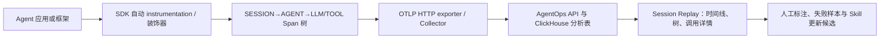

# AgentOps：以 Session Replay 和 Agent Span 记录开发经验

> **项目快照**：官方仓库 [AgentOps-AI/agentops](https://github.com/AgentOps-AI/agentops)｜核验日期 2026-09-03｜Stars 约 5.6k｜许可证：仓库 SDK 为 MIT，`app/` 自托管应用 README 标注 Elastic License 2.0（ELv2）｜最新可见 Release 为 0.4.21（2026-08-29），主分支随后仍有提交。[^agentops-repository][^agentops-license][^agentops-release]

> **需求画像**：团队希望收集不同开发 Agent 的完整执行轨迹，能回看模型、工具和错误上下文，并把高价值失败样本转成 Skill 更新候选。部署优先单台内网服务器、模型/导出接口可切换；需要明确原始会话采集、业务 Memory 和 Git 评审哪些需要另补。

## 1. 项目要解决什么问题

### 目标用户与使用场景

AgentOps 面向开发、调试和运营 AI Agent 的工程团队。开发者在 Agent 代码中初始化 SDK，平台将一次执行组织为 Session，并在 Dashboard 中按时间线、树形层级和细节面板查看 LLM、Tool、Agent 与 Workflow 事件。[^agentops-introduction][^agentops-spans]

### 当前问题

一次 Agent 任务通常跨越多次 LLM 调用、工具调用、函数执行和子 Agent。只有终端日志时，开发者很难知道哪个步骤消耗了时间、成本或引入了错误。AgentOps 通过层级 Span 和 Session Replay 保留这些上下文，并提供跨 Session 的统计与成本信息。[^agentops-readme][^agentops-spans]

开发经验需要可复盘的证据。Session Drilldown 将 LLM 调用显示为对话式历史，将事件显示在 waterfall 上；这使评审者可以把“模型误解”“工具失败”“重试过多”等判断关联回具体调用。[^agentops-introduction]

### 问题边界

AgentOps 是 Agent 可观测性和回放平台，不是 Claude Code 本地目录的会话管理器，也不是长期业务知识 Memory。官方集成列出 Anthropic SDK、CrewAI、AG2、LangGraph、OpenAI Agents SDK 等，但没有声明可直接读取 Claude Code CLI 的本地 JSONL transcript；该部分需要自定义适配器或等待官方集成。[^agentops-readme]

## 2. 设计的核心思路

### 核心判断

AgentOps 把一次执行建模为一个根 `SESSION` Span，再以 `AGENT`、`WORKFLOW`、`OPERATION/TASK`、`LLM` 和 `TOOL` 形成父子树；事件和属性沿这棵树进入 OTLP 后端，Dashboard 据此实现回放和统计。[^agentops-spans]

### 关键设计选择

- **声明式 Span 层级**：`@session`、`@agent`、`@workflow`、`@operation`、`@task` 和 `@tool` 装饰器把函数、类和工具映射成有类型的 Span，减少逐个调用点埋点的工作量。[^agentops-decorators]
- **自动 instrumentation + OTLP**：SDK 默认自动跟踪支持的 LLM 提供商，并用 OpenTelemetry `TracerProvider`、批量 Span Processor 和 OTLP exporter 发送 traces；应用也可以传入自定义 exporter endpoint。[^agentops-spans][^agentops-core]
- **Session Replay 作为分析入口**：Dashboard 将 Span 树、时间 waterfall、LLM 输入/输出和运行元数据组合为 Session Drilldown，使一次任务可被复盘而不仅是聚合指标。[^agentops-introduction]

### 代价与取舍

装饰器和自动 instrumentation 能快速覆盖常见 Agent 框架，但“完整开发会话”仍取决于适配器实际记录了哪些输入、输出和工具事件；未被支持的 Agent 只能手动建 Span。长 prompt、工具结果和代码 diff 需要面对 Span 属性大小、隐私和保留策略，这些并非 AgentOps 的业务知识治理能力。

自托管应用的依赖边界也比 SDK 大：官方自托管架构包含 FastAPI API、Next.js Dashboard、OpenTelemetry Collector、Supabase（认证与 PostgreSQL）和 ClickHouse，Redis、对象存储、Stripe、Sentry 等可选。[^agentops-selfhosting][^agentops-app-compose]

## 3. 项目如何工作

### 工作流概览

### 阶段说明

| 阶段 | 接收什么 | 做什么 | 产生的状态或产物 | 证据 |
| --- | --- | --- | --- | --- |
| 事件产生 | Agent 函数、类、LLM 和工具调用 | 自动 instrumentation 或装饰器创建带类型 Span | `SESSION` 根节点及子 Span | [^agentops-decorators][^agentops-spans] |
| 上下文关联 | 当前 OpenTelemetry context、父 Span | 维护父子关系、开始/结束时间、状态和属性 | 可追踪的单次执行 trace | [^agentops-spans][^agentops-core] |
| 批量导出 | 已结束 Span、metrics | Batch Processor 组织批次，并通过 OTLP exporter 发送 | OTLP trace/metric 请求 | [^agentops-core] |
| 接收持久化 | Collector/API 请求 | API 处理认证与业务数据，ClickHouse 保存 traces/metrics，Supabase 保存主数据和身份 | 可查询的 Session、Span 和统计 | [^agentops-selfhosting][^agentops-app-compose] |
| 回放分析 | Session trace | Dashboard 按树、waterfall 和细节面板展示 LLM/Tool/错误 | Session Replay、成本和错误上下文 | [^agentops-introduction] |
| 经验复用 | 被标记的失败或成功 Session | 人工提炼失败模式，外接数据集/Git 流程 | Skill 修改候选和验证样例（需外部流程） | [^agentops-readme] |

### 关键状态与产物

- **Span**：包含唯一 ID、名称、Span Kind、开始/结束时间、状态和属性；`SESSION` 是一次执行的根容器，其他 Span 通常挂在其下。[^agentops-spans]
- **Trace/Session**：把同一次 Agent 执行的所有 Span 组织成可回看的整体；初始化 SDK 时可自动启动 Session，也可关闭自动启动后手动创建。[^agentops-core-concepts]
- **Session Replay**：Dashboard 中的 Session Drilldown、waterfall、LLM 对话和事件详情，是人工分析原始执行证据的主要消费方式。[^agentops-introduction]
- **自定义属性和标签**：装饰器支持自定义名称、属性、异步函数和生成器；可将 `repository`、`skill_version`、任务类型等项目字段作为查询线索，但字段治理需要团队约定。[^agentops-readme][^agentops-decorators]

### 最终输出

用户获得可按 Session 查看的一次 Agent 执行回放、Span 树、模型输入/输出、Tool 调用、错误、耗时、token 和成本分析。平台本身不自动生成 Skill diff；团队需要从回放中选出证据，再把候选修改交给 Git 评审和回归测试。

## 4. 与需求画像逐项对照

### 需求矩阵

| 需求项 | 优先级或硬约束 | 项目现有能力 | 证据 | 状态 | 说明 |
| --- | --- | --- | --- | --- | --- |
| 多种 Agent/框架接入 | 必须 | Python SDK 与多个 Agent 框架、Anthropic/OpenAI 等提供商集成；TypeScript SDK 处于 Alpha/持续演进状态 | [^agentops-readme] | 满足 | Claude Code CLI 本身未被官方集成清单确认，需单列适配 |
| 完整消息、工具和执行轨迹 | 必须 | LLM、Tool、Agent、Workflow 等 Span，Session Replay 展示调用细节 | [^agentops-spans][^agentops-introduction] | 部分满足 | 能否得到完整原始 transcript 取决于 instrumentation，不等同于本地会话原文 |
| Session 检索与回放 | 期望 | Session Drawer、waterfall、树和详情面板 | [^agentops-introduction] | 满足 | 回放的是已导入的 telemetry |
| 用户决定上传原始会话 | 期望，当前非硬约束 | SDK exporter endpoint 可配置，可由接入程序选择发送时机 | [^agentops-core][^agentops-sdk-reference] | 部分满足 | 没有官方本地会话选择/审批 UI；审批和原始文件上传需自研 |
| 单台内网服务器部署 | 必须 | Docker Compose 路径；API、Dashboard、Collector 可放同一主机 | [^agentops-docker] | 部分满足 | 官方要求 Supabase/PostgreSQL 与 ClickHouse；全部自托管时组件较多 |
| 模型 API/导出接口可切换 | 期望 | OTLP exporter endpoint、custom exporter 可配置；观测层与模型供应商解耦 | [^agentops-sdk-reference][^agentops-core] | 满足 | DeepSeek/公司 API 的实际调用配置由 Agent 应用或兼容 SDK 负责 |
| 共享业务知识 Memory | 必须 | Session metadata、attributes 和标签可承载线索 | [^agentops-readme] | 部分满足 | 没有声明长期 Memory、冲突处理、版本和知识检索机制 |
| Skill 候选、评审和验证 | 必须 | 可从 Session Replay 人工筛选证据 | [^agentops-introduction] | 部分满足 | 没有 Skill diff、Git PR、审批和回归评估闭环 |
| 原始会话隐私和权限 | 必须 | 自托管、认证、Supabase Auth、角色能力出现在应用架构中 | [^agentops-selfhosting][^agentops-app-compose] | 部分满足 | 内容采集范围、用户主动确认、脱敏和删除策略需部署方设计 |
| 社区验证与许可证 | 必须 | 约 5.6k Stars；仓库 SDK MIT，app README 标 ELv2 | [^agentops-repository][^agentops-license][^agentops-app-readme] | 部分满足 | 需要按使用的 SDK/app 目录分别做许可证审查 |

### 对照归纳

AgentOps 天然匹配“把 Agent 执行组织成 Session 并回放”的目标，且已有多框架接入和 OTLP 传输。缺口集中在 Claude Code 本地 transcript、原始会话授权上传、业务 Memory 与 Skill Git 治理。若只把它作为可观测性层，适配成本可控；若期望开箱即用的团队开发会话知识库，则不能视为直接匹配。

## 5. 开源与能力边界

### 边界清单

| 能力 | 开源核心 | 商业版或 SaaS | 外部依赖 | 证据 |
| --- | --- | --- | --- | --- |
| AgentOps Python SDK、装饰器与集成 | 有，根仓库 LICENSE 为 MIT | AgentOps 托管平台可选 | Python、OpenTelemetry、被观测 Agent SDK | [^agentops-license][^agentops-readme] |
| Session/Span 采集与 OTLP 导出 | SDK 开源 | 托管 OTLP endpoint 可选 | AgentOps API 或自建 OTLP endpoint | [^agentops-core][^agentops-sdk-reference] |
| 自托管 API 与 Dashboard | `app/` 目录开源，但其 README 标注 ELv2 | AgentOps SaaS | Supabase、ClickHouse、Collector | [^agentops-app-readme][^agentops-selfhosting] |
| Session Replay、分析 UI | app 中提供 | 托管服务可用 | Dashboard、API、ClickHouse | [^agentops-app-readme][^agentops-introduction] |
| 用户认证与主数据 | 代码可见，依赖 Supabase Auth/PostgreSQL | Supabase Cloud 可选 | Supabase 或自建替代实现 | [^agentops-selfhosting] |
| 对外托管 AgentOps 服务 | 未作为无条件能力确认 | 商业托管服务存在 | SaaS/商业条款 | [^agentops-app-readme] |

### 边界判断

根 LICENSE 的 MIT 许可不能自动覆盖 `app/` 的应用代码；当前 `app/README.md` 明确写出 ELv2，并限制将其作为第三方托管服务提供。内部自托管试点通常可以继续评估，但必须记录实际使用目录、修改范围和公司法务对 ELv2 的意见。[^agentops-license][^agentops-app-readme]

## 6. 用户如何接入和使用

### 接入前提

- Agent 应用可安装 `agentops` SDK，并能配置 API key、项目或服务名称及 OTLP/exporter endpoint。[^agentops-readme][^agentops-sdk-reference]
- 已有 AgentOps Cloud 账号，或部署自托管 API、Dashboard、Collector、ClickHouse 和 Supabase；自托管还要配置 JWT、数据库和 URL。[^agentops-selfhosting][^agentops-docker]
- 对 Claude Code、Cursor、Codex 等本地 Agent，需将会话事件映射为 Session/LLM/Tool/Operation Span；官方没有声明本地 CLI transcript 自动导入。

### 接入过程

1. 安装 SDK，调用 `agentops.init()`；默认 Session 可自动启动，或关闭自动启动后按业务边界手动创建。[^agentops-core-concepts]
2. 对 Agent 类、工作流和关键函数添加 `@agent`、`@workflow`、`@operation`/`@task` 等装饰器；支持的提供商则启用自动 instrumentation。[^agentops-decorators]
3. 配置 API key、导出 endpoint 和自定义属性，例如仓库、分支、`skill_version`、任务类型和用户确认状态；执行结束调用 `end_session` 或让上下文管理器结束 Span。[^agentops-readme][^agentops-sdk-reference]
4. 在 Dashboard 的 Session Drilldown 中查看 waterfall、Span 树、LLM/Tool 详情和错误，人工挑选经验样本，再外接 Markdown/数据库和 Git PR 流程。

### 日常使用方式

开发者照常运行 Agent。SDK 在调用过程中产生层级 Span；评审者按项目、标签或 Session 进入回放，比较成功与失败任务，并把可复用的业务规则、失败模式和验证步骤整理成 Skill 候选。

### 接入限制

AgentOps 没有官方 Claude Code hook、个人目录扫描或“选择一个完整会话再上传”的工作流。若直接把 JSONL 全部塞入 Span，可能造成内容过大、敏感信息扩散和查询负担；应定义事件映射、采集模式、原文存储和删除策略。SDK 的模型集成也不等价于模型 API 网关，DeepSeek/公司 API 需要在 Agent 侧配置。

## 7. 部署构成

### 运行组件

| 组件 | 必需或可选 | 职责 | 持久化数据 | 与其他组件的关系 | 证据 |
| --- | --- | --- | --- | --- | --- |
| AgentOps API（FastAPI） | 必需 | 认证、业务 API、数据处理 | 主数据、配置及 API 相关数据 | 接受 Dashboard 与 SDK/Collector 请求 | [^agentops-app-readme][^agentops-selfhosting] |
| AgentOps Dashboard（Next.js） | 必需（仅 API/OTLP 采集可不部署） | Session Replay、查询和管理 UI | 通常无主要 trace 存储 | 调用 API，展示 ClickHouse 查询结果 | [^agentops-app-readme][^agentops-docker] |
| OpenTelemetry Collector | 接入或自托管时必需/可选 | OTLP 接收、转发和观测数据管道 | 官方清单未声明业务持久化 | SDK → Collector → AgentOps/ClickHouse | [^agentops-selfhosting][^agentops-docker] |
| ClickHouse | 必需 | traces/metrics 分析存储 | `otel_*` trace/metric 表 | API/查询层读取 | [^agentops-app-readme][^agentops-app-compose] |
| Supabase Auth + PostgreSQL | 必需（官方自托管架构） | 用户认证、主数据库 | 用户、项目、权限和业务数据 | API 使用服务角色与数据库连接 | [^agentops-selfhosting][^agentops-app-readme] |
| Supabase Storage/S3 | 可选或按功能需要 | 文件、日志等对象存储 | 上传文件和日志对象 | API 通过 Supabase 凭据访问 | [^agentops-selfhosting][^agentops-app-compose] |
| Redis | 可选 | rate limit/session cache | 缓存 | API 使用；不参与核心 trace 持久化 | [^agentops-backend] |
| Stripe、Sentry、PostHog、GitHub OAuth | 可选 | 计费、错误监控、产品分析、登录 | 由外部服务保存 | API/Dashboard 按功能调用 | [^agentops-app-readme] |

### 最小部署路径

官方 Docker 路径从 `app/` 启动 API 和 Dashboard，并以额外 Compose 文件加入 OpenTelemetry Collector；ClickHouse 可自托管，Supabase 可以使用云项目或在本地启动。只验证 Session Replay 时，Stripe、Sentry、PostHog 和 Redis 可不启用，但 API 仍需要认证/主数据库与 ClickHouse 配置。[^agentops-docker][^agentops-app-readme]

### 生产化仍需考虑

- 全部放在一台服务器时，需要同时维护 API、Dashboard、Collector、ClickHouse、PostgreSQL/Supabase 及可能的对象存储；官方没有给出本试点规模的 CPU、内存和磁盘要求，需实测。
- `app/compose.yaml` 使用 host network，并暴露 API 8000、Dashboard 3000；内网部署仍应在反向代理补 TLS、访问控制、审计和备份。[^agentops-app-compose]
- 原始 prompt、completion、tool result 和代码路径可能进入 telemetry；需要按会话授权、内容保留、删除、导出和租户隔离制定策略。
- ClickHouse 与 PostgreSQL/Supabase 的备份必须分别验证；不能只备份 Dashboard 容器就认为会话可恢复。

## 8. 适配结论与能力缺口

### 适配结论

**条件匹配。**

AgentOps 对“多 Agent 轨迹、层级 Span、Session Replay 和成本/错误分析”有直接能力，SDK 与 exporter 也允许接入不同模型调用环境。但 Claude Code 原始会话导入、用户授权上传、共享业务 Memory 和 Skill 的 Git 评审均不在现成闭环内；完整自托管还要求 Supabase/PostgreSQL、ClickHouse 和 Collector，多于轻量单体服务。

### 已满足能力

- Session→Agent→Operation/LLM/Tool 的执行树和回放界面；
- 多个 Agent 框架和模型 SDK 的现成 instrumentation；
- OTLP 标准化采集、可配置 exporter endpoint 和自托管入口；
- Session 级耗时、成本、token、错误与多 Agent 可视化；
- 内部单机可通过 Docker Compose 组合运行（前提是接受多组件和数据库依赖）。

### 能力缺口

- 没有官方 Claude Code/Cursor/Codex 本地 transcript hook 和完整 JSONL 导入；
- 没有“本地筛选→用户确认→上传原始会话”的 UI/审批机制；
- 没有面向术语、规则、边界和决策的长期业务 Memory；
- 没有从失败 Session 自动生成 Skill patch、Git PR、负责人审批和回归测试；
- app 与 SDK 的许可证不同，ELv2 对对外托管方式存在约束。

### 需要自研或外部补齐

- Claude Code 等 Agent 的 transcript/hook 到 AgentOps Span 的适配器，统一 Session、Tool、LLM、文件变更、测试和 Skill 版本字段；
- 本地会话选择、权限确认、原文对象存储、脱敏/删除与上传审计；
- 业务 Memory 的知识模型、来源引用、冲突处理与召回层；
- Session 标签→经验候选→Skill Git 分支/PR→回归任务的治理桥接。

### 否决风险

如果公司要求整个平台必须采用 MIT/Apache 许可，或计划把修改后的 AgentOps app 作为对外竞争性托管服务，ELv2 是硬性风险。若仅作内部自托管的 Agent 可观测性层，当前未发现其他硬性否决项，但应先验证 Claude Code 事件映射和单机数据库运维边界。

### 下一步验证项

1. 选一条真实 Claude Code 会话，验证能否稳定映射为 Session、LLM、Tool、文件编辑和测试 Span。
2. 对 prompt、completion、tool result、diff 和 secret 设定内容采集策略，测试大事件的存储与查询行为。
3. 在一台服务器上按官方 Compose 组合启动 API、Dashboard、Collector、ClickHouse 和 PostgreSQL/Supabase，记录实际占用与备份恢复时间。
4. 验证 `skill_version`、任务类型和评审标签能否贯穿回放，再将标记样本导出为 Skill 回归任务。

---

[^agentops-repository]: [AgentOps 官方 GitHub 仓库](https://github.com/AgentOps-AI/agentops)
[^agentops-license]: [AgentOps 根仓库 MIT LICENSE](https://github.com/AgentOps-AI/agentops/blob/main/LICENSE)
[^agentops-release]: [AgentOps 官方 Release 0.4.21](https://github.com/AgentOps-AI/agentops/releases/tag/0.4.21)
[^agentops-readme]: [AgentOps 官方 README：功能、集成与 Session Replay](https://github.com/AgentOps-AI/agentops/blob/main/README.md)
[^agentops-app-readme]: [AgentOps 官方 app README：架构、自托管与 ELv2 说明](https://github.com/AgentOps-AI/agentops/blob/main/app/README.md)
[^agentops-selfhosting]: [AgentOps 官方自托管架构说明](https://docs.agentops.ai/v2/self-hosting/overview)
[^agentops-backend]: [AgentOps 官方 Backend Setup Guide](https://docs.agentops.ai/v2/self-hosting/backend-setup)
[^agentops-docker]: [AgentOps 官方 Docker Guide](https://docs.agentops.ai/v2/self-hosting/docker-guide)
[^agentops-app-compose]: [AgentOps 官方 app/compose.yaml](https://github.com/AgentOps-AI/agentops/blob/main/app/compose.yaml)
[^agentops-core]: [AgentOps 官方 SDK tracing core 源码](https://github.com/AgentOps-AI/agentops/blob/main/agentops/sdk/core.py)
[^agentops-sdk-reference]: [AgentOps 官方 SDK Reference](https://docs.agentops.ai/v2/usage/sdk-reference)
[^agentops-core-concepts]: [AgentOps 官方 Core Concepts：Session 与 OpenTelemetry](https://docs.agentops.ai/v2/concepts/core-concepts)
[^agentops-spans]: [AgentOps 官方 Spans 文档](https://docs.agentops.ai/v2/concepts/spans)
[^agentops-decorators]: [AgentOps 官方 Decorators 文档](https://docs.agentops.ai/v2/concepts/decorators)
[^agentops-introduction]: [AgentOps 官方 Introduction：Session Drilldown 与 Waterfall](https://docs.agentops.ai/v2/introduction)

