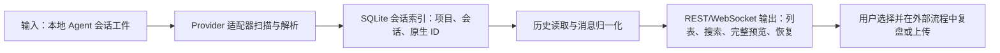

# CloudCLI UI：跨 Agent 本地会话发现与预览

> **项目快照**：官方仓库 https://github.com/siteboon/claudecodeui ｜核验日期 2026-09-03｜Stars 约 13.6k｜许可证 AGPL-3.0-or-later｜最近发布 v1.37.2（2026-08-18），主分支 2026-09-03 仍有提交。[^project-repository][^project-license][^project-release]

> **需求画像**：目标是把分散在开发者本地目录中的 Claude Code 等 Agent 会话集中发现、按项目整理、检索和预览，以便用户主动挑选有价值的完整会话，再交给后续经验提取或人工上传流程。必须支持多 Agent、保留原始会话上下文、可在单机部署；可以接受项目本身不提供中央知识库、自动脱敏、上传审批和 Skill 变更治理。

## 1. 项目要解决什么问题

### 目标用户与使用场景

CloudCLI UI 面向使用 AI 编程 CLI 的开发者。开发者可以在浏览器或移动端打开一个本地运行的 UI，按项目查看已有会话，恢复某次对话，继续运行 Agent，或查看完整历史与元数据。官方定位是 Claude Code、Cursor CLI、Codex 等 CLI 的桌面/移动 Web UI，而不是新的模型服务。[^project-repository][^session-management-doc]

在本调研场景中，它最相关的用途是“个人本地会话收集入口”：开发者在自己的机器上运行它，自动看到本地 Agent 产生的会话，再由开发者选择值得复盘的会话。这个过程可以减少成员自己翻找个人目录的成本，但不会自动把会话提交到团队中央平台。

### 当前问题

第一类摩擦是会话入口分散。Claude、Codex、Cursor 和 OpenCode 使用各自的本地历史文件或数据库；CloudCLI UI 通过 Provider-specific synchronizer 扫描这些位置，并把会话索引到一个统一的项目/会话侧边栏。[^provider-guide][^architecture-doc]

第二类摩擦是恢复和预览需要回到原 Agent CLI。项目提供浏览器聊天、Shell、文件树和 Git 视图，并把 UI 创建的会话映射回 Provider 原生会话。因此，开发者可以从移动端或浏览器查看历史、继续对话，而不需要手动定位原始日志文件。[^chat-doc][^session-management-doc]

第三类摩擦是多 Agent 的交互格式不一致。项目让每个 Provider 自己解析历史和实时事件，再转换为统一的消息类型；这样 UI 可以用同一套渲染逻辑显示用户消息、Agent 文本、思考、工具调用、工具结果和完成状态。[^provider-guide][^message-types]

### 问题边界

CloudCLI UI 不是会话经验知识库。它没有在开源核心中声明把会话抽取为业务术语、技术决策、失败模式或 Skill 修改候选，也没有对应的审核、版本和 Git 发布闭环。

它也不是团队中央会话采集平台。自托管模式的会话仍在运行 CloudCLI 的机器上；官方“Team sharing”、审计日志和隔离环境属于 CloudCLI Cloud 等产品能力，README 的自托管对比表明确列出自托管没有 Team sharing。[^project-repository]

## 2. 设计的核心思路

### 核心判断

CloudCLI UI 的核心判断是：不要复制或重新定义各 Agent 的会话格式，而是在本地读取 Provider 原生会话存储，建立轻量索引和统一消息外壳，再通过统一 API/WebSocket 为 UI 提供发现、预览和恢复能力。

### 关键设计选择

- **Provider Facet/Adapter**：每个 Provider 暴露 runtime、models、auth、mcp、skills、sessions 和 sessionSynchronizer 七个能力面。会话历史解析与会话文件扫描分离，新增 Agent 时按 Provider 合同增加适配器并注册到 `providerRegistry`。这使 Claude 的 JSONL、Codex 的 JSONL、Cursor 的 JSONL 和 OpenCode 的 SQLite 可以并存，而不强迫它们使用同一种原始格式。[^provider-guide][^provider-registry]
- **稳定的应用会话 ID 与原生会话 ID 分离**：SQLite 的 `sessions` 表同时保存应用侧 `session_id`、Provider 原生 `provider_session_id`、项目路径和可选的 `jsonl_path`。应用侧 ID 供前端和 API 使用，原生 ID 用于恢复 CLI/SDK 会话；这样运行中 Provider 才返回 ID 时，也不会让 UI 发生可见的会话 ID 切换。[^architecture-doc][^database-schema]
- **本地增量同步 + 文件监听**：启动时扫描各 Provider 的会话工件写入 SQLite，并维护 `scan_state.last_scanned_at`；运行中用 Chokidar 监听会话目录或 OpenCode 数据库，单文件同步后向前端广播 `session_upserted` 增量。[^session-sync-service][^sessions-watcher]
- **Provider 消息归一化**：Provider 先按自己的历史格式解析，再创建统一的 `NormalizedMessage`；共享层还会把不同 Provider 的清单和询问用户工具调用归一为 `TodoWrite`、`AskUserQuestion` 等公共形状。[^message-types][^message-unification]

### 代价与取舍

这种设计保留了原 Agent 的可恢复性和上下文，但会把系统强绑定到各 Provider 的本地存储布局和 CLI/SDK 行为。Provider 升级导致 JSONL 字段、SQLite 表或会话 ID 规则变化时，需要同步更新适配器。官方 Provider 指南也明确要求新增 Provider 分别实现会话、同步和运行接口，而不是假定一个通用历史格式。[^provider-guide]

统一消息模型主要服务于 UI 渲染和实时传输，并不等于统一的经验数据模型。它包含 `tool_use`、`tool_result`、`thinking` 等事件以及可选的子 Agent 活动、Memory 引用字段，但开源核心没有把这些字段进一步抽取成可治理的团队知识或 Skill 变更。[^message-types]

## 3. 项目如何工作

### 工作流概览

### 阶段说明

| 阶段 | 接收什么 | 做什么 | 产生的状态或产物 | 证据 |
| --- | --- | --- | --- | --- |
| 本地发现 | Provider 原生会话文件或数据库 | 各 `sessionSynchronizer` 扫描 Provider 存储；Claude 扫描 `~/.claude/projects/**/*.jsonl`，Codex 扫描 `~/.codex/sessions/**/*.jsonl`，Cursor 扫描 `~/.cursor/projects/**/*.jsonl`，OpenCode 读取 `~/.local/share/opencode/opencode.db` | Provider 原生会话元数据、项目路径、标题、更新时间 | [^provider-guide][^architecture-doc] |
| 增量同步 | 初次扫描结果、文件 add/change 事件 | `sessionSynchronizerService` 并发运行各 Provider 同步器；成功后更新扫描游标；监听器对单个文件执行同步并合并短时间内的变更 | SQLite `sessions`/`projects` 行、`scan_state`、待广播的 `session_upserted` | [^session-sync-service][^sessions-watcher][^database-schema] |
| 历史加载 | 应用会话 ID、分页参数 | 通过应用 ID 找到 Provider 和原生 ID；Provider 读取自己的历史，将文本、思考、工具调用和结果转换成 `NormalizedMessage`；文件型历史可使用基于 mtime/size 的缓存 | 统一消息数组、分页信息、可选 token/子 Agent 元数据 | [^provider-sessions][^message-types][^history-cache] |
| 交互与预览 | 统一消息、项目和会话列表 | Express REST 提供项目/会话/技能等接口，单个 `ws` 网关承载聊天和 Shell 实时通道；前端按 Provider 无关的 `kind` 渲染对话 | 浏览器/移动端的会话列表、完整历史、实时事件和恢复入口 | [^architecture-doc][^network-doc][^chat-doc] |
| 用户筛选 | 用户看到的项目和会话 | 用户手动选择、重命名、搜索、恢复或删除某一会话；需要上传时由外部流程决定是否提交原始文件 | 一个被用户明确选中的会话；项目本身不会自动上传或抽取经验 | [^session-management-doc][^project-repository] |

### 关键状态与产物

- **Provider 原生会话工件**：Claude、Codex、Cursor 主要是 JSONL 会话文件，OpenCode 是共享 SQLite；它们仍是历史真相，CloudCLI 的 SQLite 只保存索引和应用管理字段。OpenCode 的 `jsonl_path` 保持为空，避免删除一个 UI 会话时误删共享数据库。[^provider-guide][^opencode-sync]
- **应用会话索引**：`sessions` 表保存应用 ID、Provider、原生 ID、项目路径、标题、时间戳、归档状态和可选文件路径；`projects` 表保存项目路径和展示属性；`scan_state` 保存最近一次完整扫描游标。[^database-schema][^architecture-doc]
- **统一消息**：`NormalizedMessage` 为 REST 和 WebSocket 的共同消息外壳，涵盖角色、正文、工具名/输入/结果、状态、时间戳、子 Agent 活动和可选 `memoryCitations`。后者只是 Provider 可提供的引用字段，不代表 CloudCLI 内置 Memory 知识库。[^message-types]
- **增量 UI 状态**：文件变化触发单会话 upsert 广播，前端可以只更新发生变化的侧边栏项，而不是重新获取全部项目快照。[^sessions-watcher]

### 最终输出

最终输出是一个可在浏览器或移动端使用的跨 Agent 会话工作台：按项目列出会话、查看标题/时间/元数据、搜索部分会话内容、分页加载历史、展开工具调用和子 Agent 活动，并可恢复到 Provider 原生会话。它输出的是“可发现、可预览、可恢复的会话”，不是“可直接评审合并的 Skill 变更”。[^session-management-doc][^chat-doc]

## 4. 与需求画像逐项对照

### 需求矩阵

| 需求项 | 优先级或硬约束 | 项目现有能力 | 证据 | 状态 | 说明 |
| --- | --- | --- | --- | --- | --- |
| 发现分散在本地目录的个人会话 | 必须 | 启动扫描 Provider 会话根目录，并自动出现在项目/会话列表 | [^provider-guide][^session-management-doc] | 满足 | 适用于 CloudCLI 进程所在机器；它读取原始本地目录，不替用户完成跨机器汇聚 |
| 预览完整原始开发会话 | 必须 | Provider 读取完整历史，统一为消息、工具调用、结果和思考；UI 支持查看 full history | [^provider-sessions][^session-management-doc] | 满足 | 预览由 UI 读取原始工件；需自行核验超长会话、附件和敏感字段展示策略 |
| 支持多种 Agent | 必须 | Provider registry 与 Provider facet 支持 Claude、Codex、Cursor、OpenCode；README/文档还宣传 Gemini，主分支适配器清单需以实际版本核验 | [^provider-guide][^provider-registry][^project-repository] | 部分满足 | 接入不同 Agent 的思路清楚，但每个 Agent 仍需独立适配；不能把所有宣传的 Agent 视为当前代码均已可用 |
| 统一消息模型 | 期望 | `NormalizedMessage` 与共享消息归一化层统一 REST/WebSocket 的事件形状 | [^message-types][^message-unification] | 满足 | 统一的是交互消息，不是经验、业务知识或 Skill 版本模型 |
| 保留原始会话，不静默上传 | 必须 | 自托管模式读取本地文件/数据库；官方文档没有自动上传原始会话的流程 | [^remote-server-doc][^architecture-doc] | 部分满足 | 本地运行有利于用户控制数据，但项目没有内置“用户确认后上传某一完整会话”的审批/导出工作流，需要外部补齐 |
| 模型 API 可切换到公司 API/DeepSeek | 期望 | UI 通过各 Provider CLI/SDK 和 Provider 原生认证运行，支持模型选择/自定义模型，但未确认提供通用 OpenAI-compatible base URL 或 DeepSeek 专用适配 | [^prerequisites-doc][^project-package][^provider-guide] | 未确认 | 不能把“支持 Claude/GPT 模型”推定为可切换任意兼容 API；需要 POC 验证或自研 Provider/runtime |
| 单机部署，不引入重型基础设施 | 必须 | npm/npx 单进程自托管；Express、WebSocket、better-sqlite3 和本地文件系统即可，PM2/反向代理按需增加 | [^quick-start-doc][^architecture-doc][^remote-server-doc] | 满足 | Docker Sandbox 是实验性可选路径；部署在远程服务器时还需处理 Agent CLI、工作区和权限 |
| 多人共享中央会话 | 期望 | 自托管模式按一台机器的本地工作区提供 UI；对比表将 Team sharing 列为 No | [^project-repository] | 不满足 | 需要额外的多用户目录、权限、上传和对象存储/数据库设计；CloudCLI Cloud 的团队能力不等于 AGPL 自托管核心 |
| 业务 Memory：术语、规则、技术决策 | 必须 | 没有项目知识库、向量索引、Memory 生命周期或冲突治理；消息类型中的 `memoryCitations` 只是引用元数据 | [^message-types][^architecture-doc] | 不满足 | 不应把会话索引或 Provider 配置当作共享业务 Memory |
| 为 Skill 更新沉淀失败模式和证据 | 必须 | 可查看和搜索会话，并可发现/创建 Provider 原生 `SKILL.md`；没有会话到候选 Skill 变更的抽取、评审、Git 合并和验证闭环 | [^skills-doc][^session-management-doc] | 部分满足 | 适合作为会话证据入口；候选生成、评审和发布需要外部服务或插件 |

### 对照归纳

CloudCLI UI 对“个人本地会话发现、跨 Agent 预览、单机快速试点”匹配度高；它的 Provider 适配层和统一消息层也适合作为后续会话抽取的输入边界。它对“中央团队采集、模型 API 路由、业务 Memory、Skill 更新治理”没有现成闭环，其中多用户共享和通用 API 切换不能从 UI/CLI 集成功能推断出来。

## 5. 开源与能力边界

### 边界清单

| 能力 | 开源核心 | 商业版或 SaaS | 外部依赖 | 证据 |
| --- | --- | --- | --- | --- |
| Web UI、项目/会话列表和会话恢复 | 有 | CloudCLI Cloud 提供托管环境 | 至少一个已安装并认证的 Agent CLI/SDK | [^project-repository][^prerequisites-doc] |
| Provider 适配器与统一消息 | 有（仓库 `server/modules/providers`、`server/shared`） | 未确认是否有商业增强 | 各 Provider 的 CLI/SDK、原生会话存储 | [^provider-guide][^message-types] |
| 本地 SQLite 索引 | 有 | 托管版由平台负责运行 | `better-sqlite3`、本地文件系统 | [^database-schema][^architecture-doc] |
| 浏览器/移动端访问 | 有，自托管 Web UI | CloudCLI Cloud 支持跨设备、团队环境和托管隔离 | 网络可达；远程部署建议反向代理 | [^project-repository][^remote-server-doc] |
| Docker Sandbox 隔离 | 有，仓库包含实验性 Sandbox 模板 | CloudCLI Cloud 有完整云隔离 | Docker `sbx` CLI、微 VM/模板 | [^docker-readme][^project-repository] |
| Team sharing、审计和环境隔离 | 自托管核心无 | CloudCLI Cloud 宣传提供 | CloudCLI Cloud 服务 | [^project-repository][^remote-server-doc] |
| 业务 Memory、经验抽取和 Skill 变更治理 | 未提供 | 未确认 | 需要外部 Memory/分析/评审系统或自研插件 | [^architecture-doc][^skills-doc] |
| 通用模型 API 网关或任意 OpenAI-compatible endpoint | 未确认 | 未确认 | 各 Agent 自己的账号/API 配置 | [^prerequisites-doc][^project-package] |

### 边界判断

AGPL-3.0-or-later 允许内部修改和自托管，但若修改后作为网络服务向用户提供，许可证 Section 13 触发对应源码提供义务，需让法务确认内部部署、二次开发和对外服务边界。[^project-license]

官方同时维护 CloudCLI UI 开源仓库和 CloudCLI Cloud 托管产品。托管产品的团队共享、审计、隔离和无需自建服务器不能自动算入开源核心；本调研只把仓库和官方自托管文档明确支持的能力计入矩阵。[^project-repository][^remote-server-doc]

## 6. 用户如何接入和使用

### 接入前提

- 运行机器需要 Node.js v22 或更高版本，以及至少一个已安装并完成认证的 Agent CLI；官方前提页面分别列出 Claude Code、Cursor CLI、Codex 和 Gemini CLI 的安装/认证要求。[^prerequisites-doc]
- 运行机器必须能访问会话根目录和项目工作区。默认项目发现范围是用户主目录，可用 `WORKSPACES_ROOT` 限定暴露给 CloudCLI 的路径。[^env-doc]
- 若让其他设备访问，需要让服务监听可达地址；默认端口为 3001。远程公开访问时，官方明确指出项目没有内置认证，应在 Caddy/nginx 等反向代理前增加认证层。[^remote-server-doc][^env-doc]

### 接入过程

1. 在保存 Agent 会话的机器上执行 `npx @cloudcli-ai/cloudcli`，或全局安装 npm 包后运行 `cloudcli`；打开 `http://localhost:3001`。当前 README 的包名为 `@cloudcli-ai/cloudcli`，部分官方文档页面仍显示旧包名 `@siteboon/claude-code-ui`，试点时应以目标 Release 的 `package.json` 和发布包为准。[^project-repository][^project-package][^quick-start-doc]
2. 配置 `WORKSPACES_ROOT`、端口和监听地址；若只是个人试用，让 `HOST` 保持本机或内网可达，不要直接暴露公网。[^env-doc][^remote-server-doc]
3. 登录 UI，查看自动发现的项目和会话；打开某个会话查看完整历史、时间戳、工具调用及元数据，必要时在原 Provider 上恢复。[^session-management-doc][^chat-doc]
4. 用户选定一条候选会话后，使用外部的导出/上传或人工复盘流程；CloudCLI UI 本身没有把原始会话提交到中央经验平台的标准流程。

### 日常使用方式

开发者可以在项目侧边栏中按项目筛选会话，重命名、归档、删除或恢复；聊天 UI 通过 WebSocket 接收实时事件，Shell 模式则提供与 Agent CLI 相同的终端体验。若修改 Claude 的技能、MCP 或权限，官方文档说明自托管 UI 会直接写回 Provider 原生配置，因此可以在 UI 和本地 CLI 之间共享这些设置。[^session-management-doc][^chat-doc][^tools-doc]

对 Skill 更新试点，可以约定一个人工动作：开发者在 CloudCLI 中打开高价值会话，确认需要共享的完整原始会话，再将文件或导出内容交给团队指定的上传/评审工具。这个动作是外部治理流程，不是 CloudCLI UI 的内置能力。

### 接入限制

CloudCLI UI 的发现范围以运行服务的主机文件系统为边界；要汇聚多名成员的个人目录，必须逐台部署、把会话显式复制/上传，或在每台机器运行采集代理。直接把所有成员的 home 目录挂到一个共享服务上会扩大权限和隐私风险。

项目没有内置企业 SSO、细粒度团队授权或会话上传审批；官方远程自托管文档要求在外部反向代理补认证。插件虽然可以扩展 UI 和后端，但插件被视为可信 Node.js 代码，且官方安全文档列出没有文件系统沙箱、网络限制和加密存储等局限。[^remote-server-doc][^plugin-security-doc]

## 7. 部署构成

### 运行组件

| 组件 | 必需或可选 | 职责 | 持久化数据 | 与其他组件的关系 | 证据 |
| --- | --- | --- | --- | --- | --- |
| CloudCLI Node.js/Express 服务 | 必需 | 提供 REST API、静态前端、会话管理和 Provider 路由 | 进程日志、配置 | 连接 SQLite，调用 Agent runtime，挂载 WebSocket | [^architecture-doc][^network-doc] |
| React/Vite 前端构建产物 | 必需（生产构建时由后端托管） | 项目/会话侧边栏、聊天、文件、Git、技能和设置 UI | 浏览器端临时状态；部分用户偏好写服务端 | 同源访问 Express API；开发模式由 Vite 单独提供 | [^architecture-doc][^network-doc] |
| 单个 `ws` WebSocket 网关 | 必需（聊天/Shell 实时能力） | `/ws` 负责聊天流，`/shell` 负责交互终端；另有插件和 Browser Use 路由 | 内存中的运行状态、回放缓冲 | 挂在同一个 HTTP server 上，不需单独端口 | [^architecture-doc][^network-doc] |
| better-sqlite3 数据库 | 必需 | 保存用户、API Key、项目、会话索引、配置、偏好和扫描游标 | 默认 `~/.cloudcli/auth.db`，可用 `DATABASE_PATH` 改变 | Express 服务通过共享单例连接；不需要 PostgreSQL/向量数据库 | [^database-connection][^database-schema][^env-doc] |
| Provider CLI/SDK 与原生会话目录 | 必需（按选择的 Agent） | 执行 Agent、读取/写入原生会话和配置 | `~/.claude`、`~/.codex`、`~/.cursor`、OpenCode 数据目录等 | Provider adapter 读取历史并调用 runtime | [^provider-guide][^prerequisites-doc] |
| Chokidar 文件监听 | 必需（运行中自动更新） | 监听 Provider 会话文件/数据库变化，触发单文件同步和广播 | 无独立持久化 | 与 session synchronizer、WebSocket 广播服务连接 | [^sessions-watcher] |
| PM2/systemd | 可选 | 守护进程、崩溃重启和开机启动 | 进程管理器状态/日志 | 监控 Node.js 服务 | [^remote-server-doc][^installation-overview-doc] |
| Caddy/nginx/Traefik 反向代理 | 远程或公网部署可选 | TLS、认证、压缩、请求日志和访问入口 | 证书、代理日志 | 代理到 CloudCLI `localhost:3001` | [^remote-server-doc][^env-doc] |
| Docker Sandbox/sbx | 可选、实验性 | 以微 VM/模板隔离 Agent 和工作区 | Sandbox 状态、挂载的工作区和 SQLite | 替代直接在宿主机运行 Agent；需要 Docker `sbx` CLI | [^docker-readme][^project-repository] |
| CloudCLI 插件进程 | 可选 | 增加自定义 Tab、后端服务、会话分析等 | 插件目录、`~/.claude-code-ui/plugins.json` 等 | 由主服务启动并通过本地 RPC/WebSocket 代理 | [^plugin-security-doc][^project-repository] |

### 最小部署路径

单机试点的最小路径是：在存放 Agent 会话的主机安装 Node.js v22 和至少一个 Agent CLI，使用 npm/npx 启动一个 CloudCLI Node.js 服务；服务使用本地 SQLite 保存索引，直接读取本机 Provider 会话目录，浏览器访问 3001 端口。官方没有要求 PostgreSQL、Redis、对象存储或向量数据库。[^quick-start-doc][^prerequisites-doc][^architecture-doc]

如果需要持续运行，可在同一台服务器上增加 PM2/systemd；如果需要内网多设备访问，绑定内网地址并限制 `WORKSPACES_ROOT`；如果需要公网访问，再增加反向代理和认证层。Docker Sandbox 需要额外安装 `sbx`，属于实验性隔离路径，不是个人会话预览的最小依赖。[^remote-server-doc][^env-doc][^docker-readme]

### 生产化仍需考虑

- 自托管文档明确说明项目没有内置认证；生产化至少需要反向代理认证、TLS、访问控制和网络隔离。[^remote-server-doc]
- `auth.db` 和 Provider 原生会话都包含敏感数据；应分别制定数据库备份、会话保留、删除传播、权限隔离和密钥管理规则。官方安全文档还指出插件秘密以明文保存在本地文件，且插件没有完整文件系统/网络沙箱。[^database-connection][^plugin-security-doc]
- 官方没有给出 CPU、内存、磁盘或并发会话资源要求，需按会话数量、历史大小、实时 Agent 进程和插件数量实测；不能仅依据“单进程”估算服务器规格。
- 若把每个成员的个人目录汇聚到一台机器，需额外设计会话上传/同步协议、用户授权、脱敏策略和租户边界；这些不在 CloudCLI UI 的自托管最小部署内。
- 试点应固定目标 Release 并复核包名、Provider 列表与 Agent 版本，因为官方文档和仓库当前实现存在命名/Provider 宣传随版本变化的迹象。[^project-package][^provider-guide][^architecture-doc]

## 8. 适配结论与能力缺口

### 适配结论

**条件匹配。**

CloudCLI UI 可以直接满足“本地发现个人 Agent 会话、按项目管理、统一预览、支持多个 Provider、单机运行”的输入端需求；Provider synchronizer、SQLite 索引、统一消息模型和 WebSocket 增量更新也为后续会话分析提供了清晰的数据入口。[^provider-guide][^architecture-doc][^database-schema]

但它不是中央经验平台：自托管会话留在单机，不提供跨成员汇聚、用户确认上传、企业认证、脱敏、共享业务 Memory 或 Skill 更新治理；通用模型 API 切换也未确认。需求画像中的中央会话、业务 Memory 和 Skill 闭环必须由外部组件补齐，因此不能判为“直接匹配”。

### 已满足能力

- 自动扫描 Claude、Codex、Cursor、OpenCode 的 Provider 原生会话存储，并以项目/会话层次呈现。[^provider-guide][^session-management-doc]
- 保存应用会话 ID 与 Provider 原生 ID 的映射，支持历史恢复和实时事件关联。[^database-schema][^architecture-doc]
- 将 Provider 特有的消息、工具调用、结果和思考转换为统一消息外壳，便于下游统一消费。[^message-types][^message-unification]
- npm/npx 单机启动，SQLite 本地持久化，不需要重型中间件；可按需加 PM2 和反向代理。[^quick-start-doc][^architecture-doc][^remote-server-doc]
- 可从 UI 发现和使用本地 `SKILL.md`，能作为 Skill 迭代前的会话查看入口，但不会自动生成或发布 Skill。[^skills-doc]

### 能力缺口

- **中央会话采集与用户授权上传**：项目没有跨机器同步、选择后导出/上传、上传确认、脱敏和审计流程；这是从“个人本地 UI”到“团队经验平台”的主要缺口。
- **业务 Memory**：没有术语、规则、技术决策的结构化实体、来源、版本、冲突和召回模型；`memoryCitations` 字段不能替代 Memory 存储。[^message-types]
- **Skill 更新闭环**：没有从完整会话识别失败模式、产出候选 diff、进入负责人评审、Git 合并和回归验证的工作流；只能作为证据浏览器。
- **企业安全治理**：远程自托管无内置认证；插件可访问用户可访问的文件和网络，且秘密未加密保存，需要外部边界控制。[^remote-server-doc][^plugin-security-doc]
- **通用模型 API 切换**：Provider 认证和运行时依赖各 Agent CLI/SDK，官方资料未确认可以在 UI 中配置公司 OpenAI-compatible API 与 DeepSeek API 的统一 endpoint；若试点依赖该能力，需要先做适配验证。[^prerequisites-doc][^provider-guide]

### 需要自研或外部补齐

- 在每台开发机部署 CloudCLI UI 或增加本地采集器，提供用户选择某会话后导出原始 JSONL/SQLite 内容的明确动作；中央侧接收端负责认证、授权、租户和审计。
- 将 `NormalizedMessage` 转换为团队会话交换格式，保留 Provider、项目、应用会话 ID、原生会话 ID、时间戳、工具调用和文件引用，避免下游再次解析四种原始格式。
- 建立分析/Memory 服务：从用户确认的完整会话中抽取业务术语、规则、技术决策和经验候选，并保存来源会话、片段位置、提取模型、版本和人工状态。
- 建立 Skill 治理插件或外部服务：生成候选 `SKILL.md`/Git diff，关联证据和验证任务，经过负责人审核后提交到现有 Skill 仓库；CloudCLI 的插件系统可以作为 UI 扩展点，但不应绕过 Git 评审。[^project-repository][^plugin-security-doc]
- 为模型 API 做 Provider/runtime 适配验证，明确公司 API、DeepSeek API 的鉴权、endpoint、模型名、流式协议和错误处理；必要时增加独立的 LLM Gateway，而不要假定 CloudCLI 的模型选择器已经提供路由能力。

### 否决风险

- 若试点要求“仅部署一台服务器就自动获取每个成员个人目录中的会话”，CloudCLI UI 当前不满足：会话发现是本机文件系统范围，跨机器采集仍需同步或上传设计。
- 若公司不能接受 AGPL 网络服务义务，或不能接受自托管远程部署没有内置认证，则许可证和安全边界可能构成进入试点前的否决项。[^project-license][^remote-server-doc]
- 当前未发现会让“单人/单机本地会话发现与预览”无法验证的硬性否决项；建议先做小范围 POC，验证四类会话的发现完整性、长会话加载性能、敏感内容展示和用户主动导出体验。

---

[^project-repository]: [CloudCLI UI 官方 GitHub 仓库](https://github.com/siteboon/claudecodeui)
[^project-license]: [CloudCLI UI 官方许可证（AGPL-3.0-or-later）](https://github.com/siteboon/claudecodeui/blob/main/LICENSE)
[^project-release]: [CloudCLI UI 官方 Releases 与维护记录](https://github.com/siteboon/claudecodeui/releases)；主分支维护提交：[c1be241（2026-09-03）](https://github.com/siteboon/claudecodeui/commit/c1be241bc41586478f3d15f4dc6a5a6399d40aa1)
[^provider-guide]: [Provider Module Guide：Provider 合同、会话扫描根目录与适配器结构](https://github.com/siteboon/claudecodeui/blob/main/server/modules/providers/README.md)
[^provider-registry]: [provider.registry.ts：Provider 注册表](https://github.com/siteboon/claudecodeui/blob/main/server/modules/providers/provider.registry.ts)
[^provider-sessions]: [Claude/Codex/Provider sessions 实现目录](https://github.com/siteboon/claudecodeui/tree/main/server/modules/providers/list)
[^provider-synchronizers]: [Provider session synchronizer 实现目录](https://github.com/siteboon/claudecodeui/tree/main/server/modules/providers/list)
[^session-sync-service]: [session-synchronizer.service.ts：全量同步、扫描游标与失败处理](https://github.com/siteboon/claudecodeui/blob/main/server/modules/providers/services/session-synchronizer.service.ts)
[^sessions-watcher]: [sessions-watcher.service.ts：文件监听、单文件同步与增量广播](https://github.com/siteboon/claudecodeui/blob/main/server/modules/providers/services/sessions-watcher.service.ts)
[^database-schema]: [schema.ts：SQLite users/projects/sessions/scan_state 等表结构](https://github.com/siteboon/claudecodeui/blob/main/server/modules/database/schema.ts)
[^database-connection]: [connection.ts：SQLite 单例连接与默认数据库路径](https://github.com/siteboon/claudecodeui/blob/main/server/modules/database/connection.ts)
[^opencode-sync]: [opencode-session-synchronizer.provider.ts：读取共享 OpenCode SQLite 并保持 jsonl_path 为空](https://github.com/siteboon/claudecodeui/blob/main/server/modules/providers/list/opencode/opencode-session-synchronizer.provider.ts)
[^message-types]: [shared/types.ts：MessageKind 与 NormalizedMessage 统一消息模型](https://github.com/siteboon/claudecodeui/blob/main/server/shared/types.ts)
[^message-unification]: [message-unification.ts：跨 Provider 的清单/询问工具归一化](https://github.com/siteboon/claudecodeui/blob/main/server/shared/message-unification.ts)
[^history-cache]: [session-history-cache.service.ts：文件型会话历史缓存与分页读取](https://github.com/siteboon/claudecodeui/blob/main/server/modules/providers/services/session-history-cache.service.ts)
[^architecture-doc]: [CloudCLI UI 官方 Architecture Overview](https://cloudcli.ai/docs/cloudcli-development-resources/architecture)
[^network-doc]: [CloudCLI UI 官方 Network Architecture Guide](https://cloudcli.ai/docs/cloudcli-development-resources/network-architecture)
[^session-management-doc]: [CloudCLI UI 官方 Session Management 文档](https://cloudcli.ai/docs/features/session-management)
[^chat-doc]: [CloudCLI UI 官方 Chat Interface 文档](https://cloudcli.ai/docs/features/chat-interface)
[^skills-doc]: [CloudCLI UI 官方 Skills 文档](https://cloudcli.ai/docs/features/skills)
[^tools-doc]: [CloudCLI UI 官方 Tools & Permissions 文档](https://cloudcli.ai/docs/configuration/tools-and-permissions)
[^prerequisites-doc]: [CloudCLI UI 官方 Self-hosting Prerequisites](https://cloudcli.ai/docs/open-source-self-hosting/prerequisites)
[^quick-start-doc]: [CloudCLI UI 官方 Quick Start（npx）](https://cloudcli.ai/docs/installation/quick-start-npx)
[^installation-overview-doc]: [CloudCLI UI 官方 Installation Overview](https://cloudcli.ai/docs/open-source-self-hosting/open-source-overview)
[^remote-server-doc]: [CloudCLI UI 官方 Self-hosting on a Remote Server](https://cloudcli.ai/docs/installation/remote-server)
[^env-doc]: [CloudCLI UI 官方 Environment Variables 文档](https://cloudcli.ai/docs/configuration/environment-variables)
[^plugin-security-doc]: [CloudCLI UI 官方 Plugin Security Model](https://cloudcli.ai/docs/plugins/security-model)
[^docker-readme]: [CloudCLI UI 官方 Docker Sandbox README](https://github.com/siteboon/claudecodeui/blob/main/docker/README.md)
[^project-package]: [CloudCLI UI 官方 package.json](https://github.com/siteboon/claudecodeui/blob/main/package.json)
