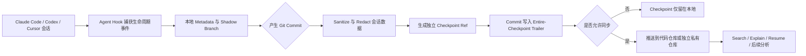
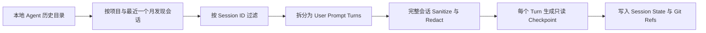

# Entire CLI：用 Git Checkpoint 连接 AI 会话与代码变更

> **项目快照**：官方仓库 `entireio/cli`｜核验日期 2026-09-03｜5,051 Stars｜MIT｜最新稳定版 v0.10.4 发布于 2026-09-02，主分支于 2026-09-03 仍有更新。[^entire-repository-snapshot][^entire-license][^entire-release]

> **需求画像**：希望从员工本地发现 Claude Code 等编码 Agent 会话，由用户筛选后共享完整会话；支持多 Agent、保护隐私、可在单机试点，并为分析开发过程和更新 Skill 提供可追溯材料。逐会话确认和原始会话上传是期望能力，但暂不作为第一阶段硬性条件。

## 1. 项目要解决什么问题

### 目标用户与使用场景

Entire CLI 面向使用 AI 编码 Agent 的开发者和团队。

这些团队已经通过 Claude Code、Codex、Cursor 等工具产生代码，但 Git 通常只保存最终代码变更，无法直接回答：

- 开发者向 Agent 提出了什么问题？
- Agent 为什么采用当前实现？
- 调用了哪些工具、修改了哪些文件？
- 哪一段对话对应哪一次代码提交？
- 后续人员怎样恢复或复用当时的上下文？

Entire 的目标是把完整 AI 会话与 Git commit 建立可查询的证据关系。[^entire-readme]

### 当前问题

Agent 会话通常存储在个人电脑的私有目录中。不同 Agent 使用不同的数据格式和目录，项目组很难统一收集，也无法从 Git 历史定位相关会话。

Git commit 能解释“代码发生了什么变化”，但 commit message 很少保存完整的分析过程、工具调用、失败尝试和测试结果。

Agent 会话结束后，上下文还容易丢失。其他成员即使看到了代码，也无法直接恢复原会话或理解当时的取舍。

### 问题边界

Entire 主要解决的是“开发会话与代码变更的采集、关联、存储和检索”，它不是：

- 项目业务知识的 Memory 系统；
- 跨项目的 LLM Trace 分析平台；
- Skill 候选生成和评审系统；
- 带逐会话内容预览的隐私审批平台；
- 原始 Agent 文件的逐字节不可变归档系统。

它能为这些系统提供证据材料，但不会独立完成后续知识提取和 Skill 更新。

## 2. 设计的核心思路

### 核心判断

Entire 的核心思路是：**AI 会话应该成为 Git provenance 的一部分，但不应该污染业务分支的提交历史。**

因此，它使用 Agent Hook 捕获会话，通过 checkpoint 保存上下文，再用 commit trailer 把 checkpoint 与业务代码提交连接起来。

### 关键设计选择

- **沿用 Agent 的 Session ID**：Entire 不重新生成会话 ID，使 Entire 中的会话可以和 Claude Code、Codex 等原始会话对应。
    
- **Checkpoint 与业务提交分开存储**：Checkpoint 保存到独立 Git refs，不进入开发分支历史。
    
- **使用 Commit Trailer 建立索引**：业务提交包含 `Entire-Checkpoint: <id>`，可以从代码提交找到相关会话，也能从 checkpoint 找到代码。
    
- **每个 Checkpoint 使用独立 Git Ref**：默认路径为 `refs/entire/checkpoints/<shard>/<id>`。不同 checkpoint 可以独立写入、推送和获取，避免共享分支产生并发冲突。[^entire-ref-backend]
    
- **工作中使用 Shadow Branch**：会话尚未形成正式 checkpoint 时，工作区快照和会话元数据保存在短期本地 shadow branch。
    
- **同时保存完整和精简 Transcript**：Checkpoint 包含经过处理的 `full.jsonl`，也可以包含用于快速消费的 `transcript.jsonl`。[^entire-checkpoint-architecture]
    

### 代价与取舍

Git refs 虽然不显示在普通业务分支中，但并不构成权限隔离。任何能够读取相关 refs 的人，都可以获取会话内容。

Checkpoint 中的 `full.jsonl` 是经过 sanitization 和 redaction 的完整会话副本，不是 Agent 原始 JSONL 文件的逐字节复制。原始 Agent transcript 仍留在 Agent 自己的目录中，Entire 不会修改它。[^entire-security]

Entire 以 commit 为重要边界。尚未提交的工作可以暂存在 shadow branch，但长期证据链主要在形成 checkpoint 后才稳定。

## 3. 项目如何工作

### 工作流概览




历史会话采用另一条入口：




### 阶段说明

| 阶段           | 接收什么                             | 做什么                                | 产生的状态或产物                                                     | 证据                                              |
| ------------ | -------------------------------- | ---------------------------------- | ------------------------------------------------------------ | ----------------------------------------------- |
| 初始化          | Git 仓库、选定 Agent                  | `entire enable` 写入配置并安装 Agent Hook | `.entire/settings.json` 和 Agent Hook                         | [^entire-readme]                                |
| 会话捕获         | Agent 生命周期事件、原始 transcript、工作区变化 | 读取并规范化 Agent 会话                    | 本地 metadata、session state                                    | [^entire-checkpoint-architecture]               |
| 临时保存         | 未提交代码、会话元数据                      | 写入短期 shadow branch                 | 临时工作区快照和会话状态                                                 | [^entire-checkpoint-architecture]               |
| Checkpoint 化 | Git commit、会话 transcript         | Sanitize、Redact、生成摘要信息             | `metadata.json`、`full.jsonl`、`transcript.jsonl`、task records | [^entire-checkpoint-architecture]               |
| 代码关联         | Checkpoint ID、业务 commit          | 在 commit message 增加 trailer        | `Entire-Checkpoint: <id>`                                    | [^entire-readme]                                |
| 同步           | 本地 checkpoint refs               | 按配置推送到一个 Git remote                | 远端 checkpoint refs                                           | [^entire-ref-backend]                           |
| 消费           | Commit、Checkpoint 或 Session ID   | 查询、解释、搜索或恢复                        | 会话回放、上下文解释、恢复命令                                              | [^entire-readme]                                |
| 历史导入         | Agent 本地历史文件                     | 按会话筛选并按用户回合建立只读 checkpoint         | Imported session 和多个只读 checkpoint                            | [^entire-import-command][^entire-import-engine] |

### 关键状态与产物

- **Agent 原始 Transcript**：例如 Claude Code 的 `~/.claude/projects/.../*.jsonl`。Entire 只读取，不修改。
    
- **本地工作副本**：`.entire/metadata/<session>/full.jsonl` 是 sanitized、尚未 redacted 的本地副本，权限为 `0600`，清理会话前会持续存在。
    
- **Shadow Branch**：保存临时会话元数据和工作区快照。元数据经过常规脱敏，但代码文件是原始 Git blob，不保证密钥已脱敏。
    
- **永久 Checkpoint**：独立 Git ref 指向一棵包含会话 metadata、完整 transcript、精简 transcript 和 subagent task records 的树。
    
- **Imported Checkpoint**：历史导入会把会话拆成用户回合；每个回合形成一个确定性 ID 的只读 checkpoint，但每个 checkpoint 都保存经过脱敏的完整会话 transcript，并用偏移量指向对应回合。[^entire-import-engine]
    

### 最终输出

Entire 最终提供的是“会话—Checkpoint—Commit—代码”的可查询证据链。

团队可以使用：

- `entire checkpoint list/explain/search` 查询会话；
- `entire session resume` 恢复支持恢复的实时会话；
- `entire blame/why` 从代码行追溯会话，但这些命令目前仍属于实验性功能；
- Git refs 或解析后的 transcript 接入后续分析平台。

## 4. 与需求画像逐项对照

### 需求矩阵

| 需求项                   | 优先级或硬约束   | 项目现有能力                                                                           | 证据                                             | 状态   | 说明                                            |
| --------------------- | --------- | -------------------------------------------------------------------------------- | ---------------------------------------------- | ---- | --------------------------------------------- |
| 读取本地 Claude Code 历史   | 期望        | 能发现 `~/.claude/projects/<project>/*.jsonl` 并导入                                   | [^entire-claude-importer]                      | 部分满足 | 默认只处理最近一个月；导入结果是只读 checkpoint                 |
| 用户选择某个 Session        | 期望        | `entire import claude-code --session <id>` 支持按 Session ID 过滤                     | [^entire-import-command]                       | 满足   | 可重复指定多个 ID                                    |
| 上传前本地预览内容             | 期望        | 有 `--dry-run`，但只报告将导入的 Session/Turn 数量                                           | [^entire-import-command]                       | 部分满足 | 没有完整会话内容预览和确认 UI                              |
| 上传完整原始会话              | 期望        | Checkpoint 保存完整的 sanitized、redacted transcript                                   | [^entire-checkpoint-architecture]              | 部分满足 | 不是原始文件逐字节归档；历史导入还会按 Turn 建立 checkpoint        |
| 只有用户明确确认后上传           | 期望，当前非硬约束 | Commit linking 默认询问；可关闭自动推送                                                      | [^entire-readme]                               | 部分满足 | `push_sessions` 默认是 `true`；没有逐 Session 上传确认流程 |
| 支持多种编码 Agent          | 必须        | 实时 Hook 支持 Claude Code、Codex、Cursor、Gemini、OpenCode、Factory Droid、Copilot CLI、Pi | [^entire-readme]                               | 满足   | Copilot 只支持 CLI；Pi 暂无 subagent capture        |
| 历史导入覆盖多 Agent         | 期望        | 仓库已有多个 importer，但不同 Agent 的完整性存在差异                                               | [^entire-import-command]                       | 部分满足 | 需要按团队实际 Agent 和版本逐一验证                         |
| 保护敏感信息                | 必须        | 默认密钥扫描；支持自定义规则、可选 PII 和 OPF                                                      | [^entire-security]                             | 部分满足 | 脱敏是 best-effort；PII 默认关闭且内置规则偏美国格式            |
| 单机快速试点                | 必须        | 核心是本地 Go CLI、Git Hook 和已有 Git 仓库                                                 | [^entire-readme]                               | 满足   | 纯本地验证不需要新增服务器                                 |
| 共享到公司内部               | 期望        | Checkpoint 可随 Git remote 同步，也可配置独立私有 checkpoint 仓库                               | [^entire-readme]                               | 满足   | 权限粒度主要继承 Git 仓库                               |
| 公司 API / DeepSeek 可切换 | 期望        | 捕获链路不调用模型；摘要委托已安装的 Agent CLI                                                     | [^entire-readme]                               | 部分满足 | 没有直接配置任意 OpenAI-compatible 摘要 API 的内建接口       |
| 为更新 Skill 提供材料        | 必须        | 保存 prompt、response、tool call、文件和 commit 关联，并支持搜索/解释                              | [^entire-readme]                               | 部分满足 | 没有候选 Skill、人工评审、回归验证和发布模型                     |
| 中央分析与评审               | 期望        | CLI 可查询本地/共享 checkpoint                                                          | [^entire-readme]                               | 部分满足 | 缺少 Langfuse 类标注、数据集、Eval 和集中分析能力              |
| 有一定社区验证               | 必须        | 核验时 5,051 Stars，持续发布                                                             | [^entire-repository-snapshot][^entire-release] | 满足   | 项目创建于 2026 年，仍属于快速演进阶段                        |

### 对照归纳

Entire 对“采集开发会话并与代码建立证据关系”高度匹配，尤其适合从 Git commit 反查产生代码的 prompt、工具调用和完整会话。

它也已经具备历史 Session 过滤和 dry-run，比单纯自动上报更接近用户控制。

主要差异集中在“原始”和“确认上传”两个词上：Entire 保存的是经过处理的完整 transcript，而不是不可变原始文件；它允许关闭自动推送，却没有完整的逐会话预览、同意记录和选择上传 UX。

## 5. 开源与能力边界

### 边界清单

|能力|开源核心|商业版或 SaaS|外部依赖|证据|
|---|---|---|---|---|
|CLI、Agent Hook、Checkpoint|是，MIT|无|Git、编码 Agent|[^entire-license][^entire-readme]|
|Git refs 存储与同步|是|无|本地 Git 与 Git remote|[^entire-ref-backend]|
|搜索、解释、恢复|CLI 中提供|跨仓体验可能依赖官方服务|可选摘要 Agent|[^entire-readme]|
|Organization、Project、Repo、Grant 管理|CLI 有客户端命令|服务端通过 Entire API 提供|Entire 登录和控制面|[^entire-readme]|
|官方控制面自托管|未确认|官方托管控制面存在|Entire API|[^entire-public-repositories]|
|独立 Checkpoint Remote|是|无|文档中的结构化配置当前以 GitHub 仓库为例|[^entire-readme]|
|自动摘要|是|无|Claude Code、Codex、Cursor、Gemini 等已安装 CLI|[^entire-readme]|
|基础密钥脱敏|是|无|内置扫描器|[^entire-security]|
|PII 和自定义规则|是，可选|无|团队配置|[^entire-security]|
|OpenAI Privacy Filter|集成逻辑开源|无|本地 `opf` 模型与可执行程序|[^entire-security]|
|匿名遥测|可关闭|PostHog 接收遥测|外部 PostHog|[^entire-security]|

### 边界判断

Entire CLI 的核心采集、Checkpoint、Git refs 和查询能力属于 MIT 开源范围，可以完全在本地和公司 Git 环境中使用。

官方 CLI 同时包含组织、项目、授权和 API 命令，但当前公开组织仓库中没有发现与官方控制面对应的完整可自托管服务端。调研判断：不能因为 CLI 中存在这些命令，就把官方跨仓控制面视为可自部署 OSS。

若试点要求所有数据完全留在公司内，应把“Git refs + CLI”作为已确认的开源能力，把官方 Dashboard、组织管理和 API 服务视为待商务或技术确认项。

## 6. 用户如何接入和使用

### 接入前提

- Git 仓库；
- Windows、macOS 或 Linux；
- 已安装并认证的受支持编码 Agent；
- 团队共享时需要一个有合适权限的 Git remote；
- 使用官方控制面时才需要 Entire 登录。

### 最快验证路径

1. 安装 Entire：
    
    - Windows 使用 Scoop；
    - macOS/Linux 使用 Homebrew 或安装脚本；
    - 开发环境也可以使用 `go install`。[^entire-readme]
2. 在项目中执行：
    
    ```
    entire enable
    ```
    
3. 选择要安装 Hook 的 Agent，或明确指定：
    
    ```
    entire enable --agent claude-code
    entire agent add codex
    ```
    
4. 正常使用编码 Agent 并提交代码。Entire 在后台捕获会话，提交时生成 checkpoint。
    
5. 使用以下命令查看材料：
    
    ```
    entire session list
    entire checkpoint list
    entire checkpoint explain <checkpoint-id>
    entire search "<问题或关键词>"
    ```
    

### 导入现有 Claude Code 历史

可以先对指定 Session 做 dry-run：

```
entire import claude-code \
  --session <session-id> \
  --dry-run
```

确认数量后再执行正式导入：

```
entire import claude-code \
  --session <session-id>
```

也可以使用 `--path` 指定其他 transcript 目录。导入范围默认是与当前仓库匹配、最近一个月的历史。[^entire-import-command][^entire-claude-importer]

### 控制同步

若不希望 checkpoint 随普通 Git push 自动发送，可在初始化时使用：

```
entire enable --skip-push-sessions
```

也可以把 checkpoint 写到与代码权限分离的私有仓库：

```
entire enable \
  --checkpoint-remote github:company/private-agent-checkpoints
```

### 日常使用方式

开发者仍然在原来的 Claude Code、Codex 或 Cursor 中工作，不需要切换到 Entire 提供的新 Agent Harness。

Entire 主要以 Git Hook 和 Agent Hook 的形式存在。团队成员在需要复盘、恢复、解释代码或提炼经验时，再使用 checkpoint 和搜索命令。

### 接入限制

- `--dry-run` 不提供完整内容预览。
- 历史导入的 Session 不能恢复，只能搜索和解释。
- 默认历史窗口是最近一个月。
- 官方没有提供完整的逐 Session 上传审批 UI。
- 单独选择 checkpoint ref 上传虽可基于 Git 实现，但没有现成的用户流程和同意记录。
- 公司 GitLab/Gitea 作为独立 checkpoint remote 的兼容性需要实际验证。

## 7. 部署构成

### 运行组件

| 组件                    | 必需或可选   | 职责                                   | 持久化数据                               | 与其他组件的关系                    | 证据                    |
| --------------------- | ------- | ------------------------------------ | ----------------------------------- | --------------------------- | --------------------- |
| Entire CLI            | 必需      | 安装 Hook、捕获会话、生成和查询 checkpoint        | 本地配置、session state、metadata         | 调用 Git 和 Agent Hook         | [^entire-readme]      |
| 编码 Agent              | 必需      | 产生会话和代码变更                            | Agent 自己的原始 transcript              | Hook 把生命周期事件交给 Entire       | [^entire-readme]      |
| 本地 Git 仓库             | 必需      | 保存代码、shadow branch 和 checkpoint refs | Git objects、refs、commit trailers    | Entire 的核心存储层               | [^entire-ref-backend] |
| `.entire/metadata`    | 必需      | 保存会话工作副本                             | Sanitized、未 redacted 的本地 transcript | Checkpoint condensation 的输入 | [^entire-security]    |
| Git Remote            | 团队共享时需要 | 共享代码及 checkpoint refs                | 远端 Git objects 和 refs               | 接收 pre-push 同步              | [^entire-readme]      |
| 独立 Checkpoint 仓库      | 可选      | 将会话和代码仓库权限分离                         | Checkpoint refs                     | 替代默认代码 remote               | [^entire-readme]      |
| 摘要 Agent CLI          | 可选      | 生成 intent、outcome、learnings 等摘要      | 摘要写入 checkpoint                     | 由 Entire 调用                 | [^entire-readme]      |
| OpenAI Privacy Filter | 可选      | 推送前补充 PII 脱敏                         | 改写后的 checkpoint commits             | 在 pre-push 阶段运行             | [^entire-security]    |
| Entire 控制面            | 可选      | 组织、项目、授权和跨仓服务                        | 官方服务端数据                             | CLI 通过登录/API 访问             | [^entire-readme]      |
| PostHog               | 可选，可关闭  | 接收匿名 CLI 使用遥测                        | 匿名命令事件                              | `telemetry=false` 可禁用       | [^entire-security]    |

### 最小部署路径

最小形态只需要：

```
开发者电脑
├── Entire CLI
├── 受支持的编码 Agent
└── 本地 Git 仓库
```

这种形态可以完成实时会话采集、历史导入、Checkpoint 保存和本地查询，不需要新增服务器。

团队共享时再增加现有公司 Git remote。若希望会话和代码分开授权，则增加独立私有 checkpoint 仓库。

### 生产化仍需考虑

- Git 仓库和 checkpoint 仓库的访问控制；
- Checkpoint refs 的备份、删除和数据保留策略；
- 离职员工、本地副本和远端 refs 的清理流程；
- PII、自定义业务密钥和中文个人信息的脱敏规则；
- `push_sessions=false` 是否被团队配置强制执行；
- Checkpoint Remote 对公司 Git 服务的兼容性；
- CLI 与不同 Agent 版本的升级兼容；
- 中央检索、标注、审计和 Eval 的额外系统；
- 官方没有给出固定 CPU、内存和容量要求，实际会话规模需要验证。

## 8. 适配结论与能力缺口

### 适配结论

**条件匹配。**

Entire CLI 非常适合解决“开发会话分散在个人电脑、会话与代码缺少关联、无法形成 Skill 更新证据”的核心问题。

但它没有完全实现“用户预览某个原始会话，再明确同意上传该会话”的目标。它提供了 Session ID 过滤、dry-run、关闭自动推送和独立 Git refs 等必要积木，仍需要补一层本地选择、审批和上传控制。

### 已满足能力

- 支持 Claude Code、Codex、Cursor 等多种编码 Agent。
- 实时保存 prompt、response、tool call、文件变更和 token 等材料。
- 将会话与 Git commit 建立双向证据关系。
- 可以读取并筛选指定 Claude Code 历史 Session。
- 可以保持 checkpoint 仅在本地。
- 可以利用现有公司 Git remote 共享会话。
- 可以把会话存到独立私有仓库。
- 社区关注度已超过当前试点门槛。
- 采集链路不依赖某个模型 API。

### 能力缺口

- **不是逐字节原始归档**：Checkpoint transcript 会经过 sanitization 和 redaction。
    
- **缺少内容预览 UI**：`--dry-run` 只显示数量，不展示即将上传的完整内容。
    
- **缺少逐会话上传确认**：默认 checkpoint 会随 Git push 同步，需要主动关闭。
    
- **权限粒度较粗**：Git refs 仍服从仓库权限，不能天然实现逐 Session ACL。
    
- **中央分析不足**：没有完整的团队标注、数据集、Eval 和跨项目分析能力。
    
- **没有 Skill 生命周期**：不会自动产生候选 Skill、证据计数、反例、评审和回归验证。
    
- **历史范围有限**：官方历史导入默认只覆盖最近一个月。
    
- **隐私并非绝对保证**：脱敏是 best-effort，内置 PII 规则还存在地区偏向。
    

### 需要自研或外部补齐

1. **本地 Session Picker**
    
    读取 Agent 原始目录，展示项目、时间、消息摘要、工具调用和敏感信息扫描结果，让用户选择具体 Session。
    
2. **同意与上传控制**
    
    记录用户、Session ID、内容 Hash、目标仓库、脱敏策略和确认时间，再执行导入或 ref push。
    
3. **原始证据存档**
    
    如果必须保存逐字节原始 transcript，应把原文件和 SHA-256 单独存入受控对象存储；Entire checkpoint 作为可检索副本和 Git provenance。
    
4. **中央分析适配器**
    
    将 `full.jsonl`、`transcript.jsonl` 和 metadata 转换为统一事件，接入 Phoenix、Langfuse 或内部分析系统。
    
5. **Skill 候选治理**
    
    增加“问题模式 → 证据会话 → 候选 Skill diff → 人工评审 → Git 合并 → 回归验证”流程。
    

### 否决风险

如果“上传内容必须是原始文件逐字节副本”和“任何上传都必须经过逐 Session 内容预览确认”升级为硬约束，Entire CLI 不能单独满足需求。

如果第一阶段允许先验证会话证据是否能产生有价值的 Skill 候选，则当前没有硬性否决项。

---

[^entire-repository-snapshot]: [GitHub 官方 API：entireio/cli 仓库快照](https://api.github.com/repos/entireio/cli)  
[^entire-license]: [Entire CLI 官方 MIT LICENSE](https://github.com/entireio/cli/blob/main/LICENSE)  
[^entire-release]: [Entire CLI 官方 Release v0.10.4](https://github.com/entireio/cli/releases/tag/v0.10.4)  
[^entire-readme]: [Entire CLI 官方 README](https://github.com/entireio/cli/blob/main/README.md)  
[^entire-checkpoint-architecture]: [Entire CLI 官方 Sessions and Checkpoints 架构](https://github.com/entireio/cli/blob/main/docs/architecture/sessions-and-checkpoints.md)  
[^entire-ref-backend]: [Entire CLI 官方 Ref-Based Checkpoint Backend](https://github.com/entireio/cli/blob/main/docs/architecture/ref-checkpoint-backend.md)  
[^entire-security]: [Entire CLI 官方 Security & Privacy](https://github.com/entireio/cli/blob/main/docs/security-and-privacy.md)  
[^entire-import-command]: [Entire CLI 历史导入命令源码](https://github.com/entireio/cli/blob/main/cmd/entire/cli/import_cmd.go)  
[^entire-import-engine]: [Entire CLI 历史导入编排源码](https://github.com/entireio/cli/blob/main/cmd/entire/cli/agentimport/agentimport.go)  
[^entire-claude-importer]: [Entire CLI Claude Code 历史发现实现](https://github.com/entireio/cli/blob/main/cmd/entire/cli/agentimport/claude.go)  
[^entire-public-repositories]: [Entire 官方 GitHub 组织公开仓库](https://github.com/orgs/entireio/repositories)