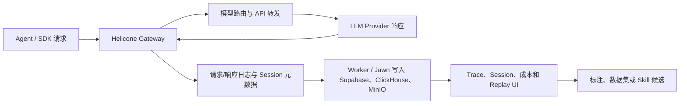

# Helicone：以 AI Gateway 代理和请求日志沉淀会话

> **项目快照**：官方仓库 `Helicone/helicone`｜核验日期 2026-09-03｜Stars 6,131｜许可证 Apache-2.0｜主分支于 2026-08-31 仍有更新；项目同时提供 Gateway、Agent tracing、会话日志和自托管 Compose。[^helicone-repository][^helicone-license][^helicone-readme]

> **需求画像**：团队希望在不改动各 Agent 核心逻辑的情况下，统一记录模型请求、响应、成本、工具链和会话，并保留模型 API 可切换能力。单机试点可以接受 Docker Compose，但不希望引入难以维护的重型平台。

## 1. 项目要解决什么问题

### 目标用户与使用场景

Helicone 面向需要统一接入多个模型供应商并观察 LLM 应用的工程团队。调用方把 OpenAI、Anthropic、Gemini 等请求发到 Gateway 或添加一行日志配置，Helicone 记录请求并在 UI 中按 session、trace 和成本查看。[^helicone-readme]

### 当前问题

不同 Agent 直接调用不同模型 API 时，日志格式、供应商切换和成本统计不一致。Helicone 通过兼容 OpenAI 的网关统一路由，并在代理层记录请求/响应。

仅有单次请求日志无法解释多步 Agent。项目提供 Agent tracing、session grouping、tool 调用和 replay 视图，使一次工作流中的多个请求可以关联分析。

### 问题边界

Helicone 重点是 API Gateway 和 LLM 请求可观测性，不是 Claude Code 本地 transcript 管理器。它通常只能看到经过网关的请求；Agent 的本地提示、Shell 输出、文件 diff 和未发给模型的上下文需要额外 instrumentation。

## 2. 设计的核心思路

### 核心判断

Helicone 把“记录”放在模型请求边界，把 Gateway 作为统一控制点：上游只需切换 base URL 或增加 header，就能获得日志、路由和成本分析。

### 关键设计选择

- **代理优先而非框架绑定**：兼容 OpenAI 风格 API，可对 OpenAI、Anthropic、Gemini、LangChain 等调用统一记录。[^helicone-readme]
- **Session/Trace 由请求元数据聚合**：通过 request headers、user/session/property 字段把多个请求组织成 Agent 会话。
- **分析与原始日志分离**：架构使用 Supabase/Postgres 保存应用数据，ClickHouse 做分析，MinIO 保存日志对象。[^helicone-architecture]
- **Gateway 同时承担路由和 fallback**：统一 API key 和模型路由，有利于切换公司 API 与 DeepSeek，但也增加了代理层故障域。

### 代价与取舍

网关接入改动小，但会把敏感 prompt、response 和凭据流量集中到代理。没有经过 Gateway 的 Claude Code 本地操作不会自动出现。自托管架构包含 Web、Worker、Jawn、Supabase、ClickHouse、MinIO 等多个服务，单机可运行但明显重于 Phoenix。[^helicone-architecture]

## 3. 项目如何工作

### 工作流概览

### 阶段说明

| 阶段 | 接收什么 | 做什么 | 产生的状态或产物 | 证据 |
| --- | --- | --- | --- | --- |
| 请求接入 | OpenAI-compatible 请求或 SDK 调用 | Gateway 校验 header、记录元数据 | 带 user/session/property 的 request | [^helicone-readme] |
| 模型转发 | 请求、路由和 provider key | 选择供应商并转发，支持 fallback | 上游响应 | [^helicone-readme] |
| 日志采集 | 请求、响应、延迟和 token | Worker/Jawn 解析和持久化 | request log、成本字段、错误 | [^helicone-architecture] |
| 聚合查询 | session、trace 和时间范围 | ClickHouse 查询分析，UI 聚合会话 | Trace/Session 视图 | [^helicone-readme] |
| 经验提取 | 标注后的请求和 replay | 导出样本、提示版本或评估数据 | 候选经验材料 | [^helicone-readme] |

### 关键状态与产物

- **Request log**：一次模型 API 请求和响应，通常包含 prompt、completion、token、延迟和成本。
- **Session/Trace**：通过请求属性把多个请求聚合成一个 Agent 工作流。
- **Dataset/Prompt**：UI 可基于生产数据做 Prompt 实验和数据集整理，但不是 Skill Git 仓库。
- **Gateway route**：模型和 provider 的路由配置，决定 API 切换和 fallback。

### 最终输出

用户得到的是请求级日志、Agent session replay、成本/延迟分析、路由和 Prompt 实验。对 Skill 更新有用的材料是“某版本 Skill 触发的请求链和失败 response”，但完整代码操作必须从 Agent 侧另行采集。

## 4. 与需求画像逐项对照

### 需求矩阵

| 需求项 | 优先级或硬约束 | 项目现有能力 | 证据 | 状态 | 说明 |
| --- | --- | --- | --- | --- | --- |
| 多 Agent 接入 | 必须 | OpenAI、Anthropic、Gemini、LangChain 等网关/SDK | [^helicone-readme] | 满足 | 未走 Gateway 的本地操作不可见 |
| 完整消息与工具轨迹 | 必须 | 请求/响应和 Agent tracing | [^helicone-readme] | 部分满足 | Shell、文件 diff 需自定义事件 |
| Session 检索与回放 | 期望 | Session、Trace 和 replay UI | [^helicone-readme] | 满足 | 聚合依赖元数据一致性 |
| 用户决定上传 | 期望，当前非硬约束 | 发送时机由 SDK/Gateway 调用方控制 | [^helicone-readme] | 部分满足 | 无本地会话选择器 |
| 单机 Docker Compose | 必须 | 官方 Compose，自托管五服务架构 | [^helicone-architecture] | 部分满足 | 组件多，运维面较大 |
| 公司 API/DeepSeek 切换 | 期望 | Gateway 路由、fallback 和统一 API | [^helicone-readme] | 满足 | provider 凭据集中管理 |
| 业务知识 Memory | 必须 | metadata、dataset、prompt 管理 | [^helicone-readme] | 部分满足 | 不是长期业务 Memory |
| Skill 候选与人工评审 | 必须 | Session replay、数据集和 Prompt 实验 | [^helicone-readme] | 部分满足 | Git 评审和回归需自研 |
| 社区验证 | 必须 | 6,131 Stars，持续维护 | [^helicone-repository] | 满足 | 需核对企业功能边界 |

### 对照归纳

Helicone 适合做“统一模型入口 + 请求级会话分析”。它对模型 API 切换很强，对 Claude Code 的完整开发会话较弱；若团队愿意增加 Agent 端事件采集，才能把请求链和代码变更拼接起来。

## 5. 开源与能力边界

### 边界清单

| 能力 | 开源核心 | 商业版或 SaaS | 外部依赖 | 证据 |
| --- | --- | --- | --- | --- |
| Gateway、Web、Worker、Jawn | 是，Apache-2.0 仓库 | Cloud 托管服务 | Node/Cloudflare 运行时 | [^helicone-license][^helicone-readme] |
| 请求日志与基础 UI | 是 | Cloud 增值能力可能不同 | Supabase、ClickHouse、MinIO | [^helicone-architecture] |
| 企业 Helm 部署 | 部分 | 官方说明 Enterprise Helm 需联系获取 | Kubernetes | [^helicone-readme] |
| 模型路由与 fallback | 核心能力 | Cloud 运营能力另计 | 各 provider API | [^helicone-readme] |

### 边界判断

Apache-2.0 适合内部自托管和改造，但官方文档把生产 Helm chart 标为 Enterprise 交付；单机试点应以仓库 Compose 为基线，不应假定所有企业运维能力均在开源仓库内。[^helicone-readme]

## 6. 用户如何接入和使用

### 接入前提

- Helicone Gateway 或 SDK；
- 各模型 provider 的 key 和路由配置；
- Agent 为请求设置 session、user、property 等元数据；
- Docker Compose 及持久化卷。

### 接入过程

1. 按官方 Compose 启动 Supabase、ClickHouse、MinIO、Jawn、Worker 和 Web。[^helicone-architecture]
2. 将 Agent 的 API base URL 指向 Gateway，或添加 Helicone SDK/header。
3. 为同一开发任务设置稳定 session ID，并将 Agent、仓库、分支、Skill 版本写入 properties。
4. 在 UI 中检索和回放 session，筛选失败请求，导出数据集供评估或 Skill 评审。

### 日常使用方式

开发者可继续使用原 Agent，但模型请求要经过 Gateway。负责人按会话、模型、成本和失败类型查看 replay；本地适配器再把文件 diff、测试和 commit 关联上传为自定义属性或外部索引。

### 接入限制

Helicone 不是本地 Claude Code transcript 导入器。它无法看到未经过模型 API 的 Shell、编辑器操作和系统提示；把完整原始会话放进请求日志还会造成字段过大、隐私暴露和检索成本上升。

## 7. 部署构成

### 运行组件

| 组件 | 必需或可选 | 职责 | 持久化数据 | 与其他组件的关系 | 证据 |
| --- | --- | --- | --- | --- | --- |
| Web | 必需 | Next.js 控制台 | UI 配置 | 访问 Jawn/查询服务 | [^helicone-architecture] |
| Worker | 必需 | 代理日志处理和异步任务 | 队列状态 | 接收 Gateway 日志并写存储 | [^helicone-architecture] |
| Jawn | 必需 | Express API 和日志收集 | API 状态 | Web、Worker 与数据库中间层 | [^helicone-architecture] |
| Supabase/Postgres | 必需 | 用户、组织、认证和应用数据 | 关系数据 | Web/Jawn 访问 | [^helicone-architecture] |
| ClickHouse | 必需 | 请求分析查询 | 日志分析数据 | Worker 写入，Web 查询 | [^helicone-architecture] |
| MinIO | 必需 | 日志对象存储 | 原始/大对象日志 | Worker 写入、分析读取 | [^helicone-architecture] |
| Gateway/Cloudflare Worker | 必需 | 请求转发与记录 | 无或短期缓存 | Agent→Provider，并异步写日志 | [^helicone-architecture] |

### 最小部署路径

官方本地路径使用 Docker Compose 启动 MinIO、ClickHouse，并通过 Supabase 提供 Postgres/认证，再运行 Jawn、Web 和 Gateway 开发进程。[^helicone-architecture]

### 生产化仍需考虑

- 五类以上服务共用单机时，ClickHouse、Postgres 和 MinIO 的磁盘增长需单独规划；
- 官方没有给出本试点规模的 CPU、内存和容量数字，需实测；
- Gateway 成为所有模型调用的关键路径，需配置超时、重试、熔断和密钥隔离；
- 原始 prompt/response 的保留、删除和脱敏策略必须先于接入；
- Supabase 的认证和邮件能力在内网部署时要替换或关闭外部依赖。

## 8. 适配结论与能力缺口

### 适配结论

**条件匹配。**

Helicone 对统一模型 API、请求记录和 session replay 有直接能力，适合验证“集中入口是否能快速得到会话数据”。但它不是完整开发会话采集器，且单机服务数量较多。

### 已满足能力

- 多模型供应商统一 Gateway；
- 请求/响应、成本、延迟和 session replay；
- Agent tracing 和 Prompt/dataset 实验；
- Apache-2.0，可自托管 Compose；
- 适合配置公司 API 与 DeepSeek 的路由切换。

### 能力缺口

- 不读取个人 Claude Code 原始会话；
- 不记录未发给模型的 Shell、文件和测试上下文；
- 没有逐会话原始上传确认；
- 没有业务 Memory 和 Skill Git 治理；
- 单机部署组件较多，运维重量高于 Phoenix/OpenLIT。

### 需要自研或外部补齐

1. Agent 本地会话适配器和事件补充 API；
2. Session 与 commit、Skill 版本关联；
3. 原始 transcript 独立存储和用户授权；
4. 失败模式抽取与 Skill PR/Eval 流程。

### 否决风险

若试点要求“一台服务器上少于三个服务”或必须无代理改动地采集 Claude Code 全部操作，Helicone 存在硬性不匹配。若只需统一 LLM 请求和经验分析，当前未发现其他硬性否决项。

### 下一步验证项

1. 用公司 API 和 DeepSeek 各跑一条请求链，验证路由与成本字段。
2. 测试 session properties 是否能稳定关联 Skill commit。
3. 估算一周开发会话写入 ClickHouse/MinIO 的容量。
4. 评估是否值得为 Claude Code 增加本地事件上传器。

---

[^helicone-repository]: [Helicone 官方 GitHub 仓库](https://github.com/Helicone/helicone)
[^helicone-license]: [Helicone 官方 Apache-2.0 LICENSE](https://github.com/Helicone/helicone/blob/main/LICENSE)
[^helicone-readme]: [Helicone 官方 README](https://github.com/Helicone/helicone/blob/main/README.md)
[^helicone-architecture]: [Helicone 官方自托管架构与本地部署](https://github.com/Helicone/helicone/blob/main/FULL_AGENT_LOOP.md)
