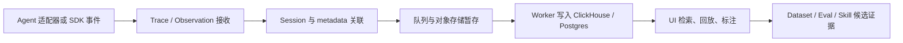

# Langfuse：以 Trace、Session 和评估闭环沉淀 Agent 会话

> **项目快照**：官方仓库 `langfuse/langfuse`｜核验日期 2026-09-03｜Stars 34,156｜许可证 MIT（`ee/` 等目录另有商业许可）｜主分支于 2026-09-03 仍有更新，仓库提供 v3 自托管文档。[^langfuse-repository][^langfuse-license][^langfuse-self-host]

> **需求画像**：团队需要接收多种 Agent 的完整调用轨迹，保留 prompt、response、工具和检索步骤，并按会话检索、标注和评估。部署优先单机 Docker Compose，模型 API 可切换，最终要为 Skill 候选更新提供可追溯证据。

## 1. 项目要解决什么问题

### 目标用户与使用场景

Langfuse 面向构建 LLM 应用和 Agent 的工程团队。开发者通过 SDK、OpenTelemetry 或网关把一次请求中的 LLM 调用、检索、工具动作和结果发送到 Langfuse，再在 UI 中按 Trace 和 Session 调试。[^langfuse-observability]

### 当前问题

多轮 Agent 执行通常跨越多个模型调用和工具调用，普通日志难以保留因果关系。Langfuse 用结构化 Trace 表示一次执行，用 Session 聚合多轮 Trace，使团队可以回放“输入—工具—模型—结果”的过程。

仅保存日志还不足以比较 Skill 或 Prompt 的改动。Langfuse 还提供人工标注、LLM-as-a-judge、数据集和实验能力，把会话转为可重复评估的样本。[^langfuse-observability][^langfuse-datasets]

### 问题边界

Langfuse 是 LLM 工程和观测平台，不负责读取 Claude Code 的本地 JSONL 目录，也不自动理解公司的业务规则。它提供捕获和分析 API，原始开发会话需要由本地适配器转换为 Trace。

## 2. 设计的核心思路

### 核心判断

Langfuse 把 Agent 执行拆成可嵌套的 Observations，并用 Trace/Session 建立时间和因果关系；再用评估、Prompt 版本和数据集把一次会话连接到持续改进。

### 关键设计选择

- **Trace 与 Observation 分层**：Trace 表示一次请求或任务，Observation 表示 generation、span、event 等具体动作，适合表达工具链和嵌套 Agent。[^langfuse-observability]
- **Session 是聚合索引而非单一消息表**：多个 Trace 可以共享 Session ID，便于从多轮交互观察完整任务。
- **事件先接收、异步写入分析存储**：自托管架构用 Web 接收数据，队列和 Worker 批量写入 ClickHouse，并用对象存储保存原始/多模态数据。[^langfuse-architecture]
- **观测数据直接进入评估体系**：Trace 可以转为 Dataset item，配合人工标签、代码评估器或 LLM 评审比较变更。[^langfuse-datasets]

### 代价与取舍

Trace 模型表达力强，但接入方必须正确设置父子关系、Session ID 和 metadata；仅把整段 transcript 作为一个字符串会损失工具级分析能力。v3 的完整自托管栈包含多个基础服务，单机可运行但维护面明显大于单进程日志库。官方低规模 Docker Compose 不提供高可用和扩缩容。[^langfuse-self-host]

## 3. 项目如何工作

### 工作流概览

### 阶段说明

| 阶段 | 接收什么 | 做什么 | 产生的状态或产物 | 证据 |
| --- | --- | --- | --- | --- |
| 事件捕获 | 模型、工具、检索和用户消息 | SDK、OTel 或 API 写入 span/generation | Trace 与 Observation | [^langfuse-observability] |
| 会话关联 | Trace ID、Session ID、用户和项目标签 | 把多次调用归入一个任务上下文 | 可筛选的 Session | [^langfuse-observability] |
| 异步持久化 | 接收事件、批次和附件 | Web 入队，Worker 消费并写存储 | ClickHouse 分析记录、对象存储文件 | [^langfuse-architecture] |
| 分析标注 | Trace、输出和用户反馈 | 查询、打分、标记错误模式 | Scores、annotations、comments | [^langfuse-datasets] |
| 评估复用 | 已标注 Trace 或 Dataset | 运行代码评估器、LLM 评审和实验 | 可比较的实验结果 | [^langfuse-datasets] |

### 关键状态与产物

- **Trace**：一次请求或 Agent 任务的根记录，包含时间、环境、用户和自定义 metadata。
- **Observation**：Trace 内的 generation、span、event 或工具步骤，保存输入、输出、耗时和 token 等字段。
- **Session**：多个 Trace 的聚合键，可对应一次多轮开发任务；它不是 Claude Code 原生 Session 的自动同步。
- **Dataset / Score**：从会话抽出的样本和人工、代码或模型评估结果，可作为 Skill 回归集。

### 最终输出

用户得到的是可搜索的 Agent 执行轨迹、会话级回放、标注结果和实验对比。对 Skill 更新而言，最有价值的输出是“某类任务在某个 Skill 版本下的失败 Trace + 修复后的评分”，而不是单纯的聊天记录。

## 4. 与需求画像逐项对照

### 需求矩阵

| 需求项 | 优先级或硬约束 | 项目现有能力 | 证据 | 状态 | 说明 |
| --- | --- | --- | --- | --- | --- |
| 多 Agent 接入 | 必须 | SDK、OpenTelemetry、100+ 集成和 LLM 网关 | [^langfuse-integrations] | 满足 | Claude Code 本地文件仍需适配器 |
| 保存完整消息与工具轨迹 | 必须 | Trace/Observation 可保存 LLM、检索、工具和自定义 span | [^langfuse-observability] | 部分满足 | 取决于采集端是否逐事件上报 |
| Session 检索与回放 | 期望 | Session 聚合、UI 检索和 Trace 详情 | [^langfuse-observability] | 满足 | 不是原生 Claude Code 历史浏览器 |
| 用户决定上传原始会话 | 期望，当前非硬约束 | API/SDK 可由调用方控制发送时机 | [^langfuse-integrations] | 部分满足 | 没有 Claude Code 本地逐会话选择 UI |
| 单机 Docker Compose | 必须 | 官方提供低规模 Docker Compose | [^langfuse-self-host] | 满足 | 多服务栈，需评估机器容量 |
| API 可切换 | 期望 | 观测层与模型供应商解耦，支持 OpenAI、Anthropic、LiteLLM 等 | [^langfuse-integrations] | 满足 | 模型调用仍由 Agent 或网关负责 |
| 业务知识 Memory | 必须 | metadata、Prompt、Dataset 可承载结构化材料 | [^langfuse-prompts] | 部分满足 | 不是业务知识图谱或长期 Memory |
| Skill 候选与人工评审 | 必须 | Scores、annotations、datasets、实验 | [^langfuse-datasets] | 部分满足 | 需要自研 Skill diff、评审和 Git 发布流程 |
| 社区验证 | 必须 | 34,156 Stars，持续维护 | [^langfuse-repository] | 满足 | Star 不等于与 Claude Code 的直接适配 |

### 对照归纳

Langfuse 对“采集、检索、标注、评估 Agent 会话”直接匹配。它对 Claude Code 本地历史、原始文件上传审批和 Skill 生命周期没有现成产品边界，需要在采集端和治理端补齐。

## 5. 开源与能力边界

### 边界清单

| 能力 | 开源核心 | 商业版或 SaaS | 外部依赖 | 证据 |
| --- | --- | --- | --- | --- |
| Trace、Session、SDK 和 UI | 是，MIT 范围 | Cloud 另有托管服务 | Postgres、ClickHouse、Redis、对象存储 | [^langfuse-license][^langfuse-self-host] |
| 自托管 Docker Compose | 是 | Enterprise 功能需 license key | Docker | [^langfuse-self-host] |
| Prompt、Dataset、基础评估 | 是/部分 | 部分 EE 功能商业化 | 可选模型 API | [^langfuse-license][^langfuse-datasets] |
| SSO、企业权限和高级管理 | 部分 | 企业版或托管版边界需按版本核对 | 邮件/身份服务 | [^langfuse-self-host] |

### 边界判断

官方明确 core 为 MIT，但 `ee/`、`web/src/ee/` 和 `worker/src/ee/` 目录使用独立许可；不能把“仓库可见”直接等同于所有企业能力均为 MIT。[^langfuse-license]

## 6. 用户如何接入和使用

### 接入前提

- 一个自托管 Langfuse 实例及其公私钥；
- Claude Code、Codex、Cursor 或其他 Agent 的事件适配器；
- 统一的 Trace、Session、Agent、项目和 Skill 版本字段；
- 对外部模型 API 的网络和凭据配置。

### 最快验证路径

1. 用官方 Docker Compose 启动 Langfuse，并创建项目和 API key。[^langfuse-self-host]
2. 在 Agent 适配器中把用户消息、模型响应、工具调用、文件变更、测试结果映射为 Observation。
3. 为一次开发任务生成稳定 Session ID，并写入仓库、分支、commit、Agent 和 Skill 版本。
4. 在 UI 中标记失败 Trace，导出为 Dataset，运行评估并把结论写回 Skill 变更流程。

### 日常使用方式

开发者继续使用原 Agent；适配器负责上报。负责人按 Session、Skill 版本、任务类型筛选会话，人工标注“业务误解、重复重试、测试遗漏”等标签，再把高价值 Trace 纳入回归集。

### 接入限制

Langfuse 没有自动扫描每个人的 `~/.claude` 目录，也没有现成的原始 JSONL 上传审批。需要自研本地读取器、用户确认界面和 JSONL→Trace 映射；若要保留原始文件，还需独立对象存储和访问控制。

## 7. 部署构成

### 运行组件

| 组件 | 必需或可选 | 职责 | 持久化数据 | 与其他组件的关系 | 证据 |
| --- | --- | --- | --- | --- | --- |
| Langfuse Web | 必需 | API、UI、Trace 接收 | 配置和部分状态 | 接收 SDK/OTel，访问各存储 | [^langfuse-compose] |
| Worker | 必需 | 异步消费和批处理 | 无独立业务数据 | 从 Redis/S3 取队列并写 ClickHouse | [^langfuse-architecture] |
| PostgreSQL | 必需 | 事务、用户、项目和配置 | 用户、项目、配置 | Web/Worker 访问 | [^langfuse-compose] |
| ClickHouse | 必需 | Trace/Observation 分析查询 | 观测事件 | Web/Worker 写入和查询 | [^langfuse-compose] |
| Redis | 必需 | 缓存、队列和延迟任务 | 队列、缓存 | Web 与 Worker 协作 | [^langfuse-architecture] |
| S3/MinIO | 必需（v3 默认路径） | 批次、原始和多模态对象 | 对象文件 | Web 写入，Worker 读取 | [^langfuse-architecture] |
| OTel Collector / SDK | 可选 | 产生和转发 Trace | 无 | Agent 到 Web 的采集层 | [^langfuse-integrations] |

### 最小部署路径

官方低规模路径是 Docker Compose 启动 Web、Worker、Postgres、ClickHouse、Redis 和 MinIO；开发 Agent 通过 SDK、OTel 或网关发送数据。[^langfuse-compose][^langfuse-self-host]

### 生产化仍需考虑

- 单机磁盘同时承载 ClickHouse、Postgres、Redis 和 MinIO，需要制定容量、备份和保留策略；
- 所有组件时区需按官方要求使用 UTC，否则查询可能异常；[^langfuse-self-host]
- 官方未给出本试点会话规模下的 CPU、内存和磁盘数字，需实测；
- 需在 Web/API 前增加内网鉴权、TLS 和项目隔离；
- 原始会话、Trace 副本和导出 Dataset 的删除权应保持一致。

## 8. 适配结论与能力缺口

### 适配结论

**条件匹配。**

Langfuse 已具备跨 Agent 的 Trace/Session、检索、标注和评估基础，适合做会话经验分析中心；但 Claude Code 本地采集、原始会话审批、业务 Memory 和 Skill Git 治理必须外接适配层。

### 已满足能力

- 多种 SDK、OpenTelemetry 和框架集成；
- 细粒度 LLM、工具和检索轨迹；
- Session 聚合、UI 调试和反馈标注；
- Dataset、实验和评估闭环；
- 单机 Docker Compose 可运行；
- 模型供应商不被观测层锁定。

### 能力缺口

- 没有 Claude Code/Codex 本地目录扫描器；
- 没有逐会话原始上传确认和同意审计；
- 业务 Memory 只提供通用 metadata、Prompt 和 Dataset 载体；
- 没有 Skill diff、Git PR、回归任务和自动发布模型；
- v3 自托管基础设施较多。

### 需要自研或外部补齐

1. 本地 Agent transcript 读取和用户选择器；
2. JSONL 到 Trace/Observation 的统一适配器；
3. 原始文件对象存储与权限策略；
4. Skill 候选生成、评审和回归验证服务；
5. 业务术语和架构决策的 Memory 索引。

### 否决风险

如果试点要求“一条命令、单进程、无需数据库”的极轻量部署，Langfuse 不合适；如果允许单机多容器并需要评估闭环，则当前未发现硬性否决项。

---

[^langfuse-repository]: [Langfuse 官方 GitHub 仓库](https://github.com/langfuse/langfuse)
[^langfuse-license]: [Langfuse 官方 LICENSE](https://github.com/langfuse/langfuse/blob/main/LICENSE)
[^langfuse-self-host]: [Langfuse 官方自托管文档](https://github.com/langfuse/langfuse-docs/blob/main/content/self-hosting/index.mdx)
[^langfuse-observability]: [Langfuse 官方 Observability 与 Session 文档](https://github.com/langfuse/langfuse-docs/blob/main/content/docs/observability/overview.mdx)
[^langfuse-datasets]: [Langfuse 官方 Dataset 文档](https://github.com/langfuse/langfuse-docs/tree/main/content/docs/datasets)
[^langfuse-architecture]: [Langfuse 官方自托管架构说明](https://github.com/langfuse/langfuse-docs/blob/main/content/self-hosting/index.mdx)
[^langfuse-integrations]: [Langfuse 官方集成说明](https://github.com/langfuse/langfuse-docs/tree/main/content/docs/integrations)
[^langfuse-prompts]: [Langfuse 官方 Prompt 管理文档](https://github.com/langfuse/langfuse-docs/tree/main/content/docs/prompts)
[^langfuse-compose]: [Langfuse 官方 Docker Compose 清单](https://github.com/langfuse/langfuse/blob/main/docker-compose.yml)
