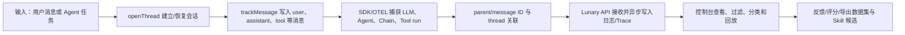

# Lunary：会话日志、反馈与开源边界案例

> **项目快照**：当前公开代码仓库 <https://github.com/appl-team/lunary>（由 `itsharex/llmonitor` fork 而来；官方组织历史仓库为已归档的 <https://github.com/lunary-ai/lunary-py>，其 README 指向的 `lunary-ai/lunary` 当前不可访问）｜核验日期 2026-09-04｜Stars 0（历史 Python SDK 21）｜许可证 Apache-2.0（当前公开仓库）｜当前公开仓库仍可浏览但社区验证不足；历史 Python SDK 于 2025-04-15 归档。[^lunary-current-repository][^lunary-legacy-repository][^lunary-license][^lunary-legacy-archive]

> **需求画像**：目标是收集项目组成员或 Agent 的完整开发会话、模型/工具轨迹、反馈和失败证据，支持人工筛选后进入经验提取与 Skill 更新流程。必须支持多种 Agent/模型、可切换模型或 OTLP 接口、单台内网服务器部署和原始数据治理；允许项目只提供通用会话记录能力，但需要明确哪些部分要自研。社区门槛原则上为不少于 1,000 Stars，因此本项目即使功能相关，也只能作为边界案例对照。

## 1. 项目要解决什么问题

### 目标用户与使用场景

Lunary 面向构建 AI 聊天机器人和 LLM 应用的开发者。官方定位包含可观测性、聊天会话、提示词管理、分类和反馈跟踪；SDK 支持 JavaScript、Python，以及 LangChain、OpenAI、LiteLLM、Flowise 等集成。[^lunary-introduction][^lunary-current-repository]

典型场景是：应用开启一个 thread，向其中写入 user/assistant/system/tool 消息，同时把模型调用和 Agent run 关联到消息；团队在控制台查看调用、错误、Token/成本和用户反馈，再筛选日志形成数据集或改进提示词。这个流程与“从开发会话中挑选有效/失败样本”相似，但官方材料面向 LLM 应用运行日志，并非 Claude Code 本地会话管理产品。

### 当前问题

第一，单看聊天最终答案无法解释 Agent 在哪个模型调用、工具或链步骤上失败。Lunary 通过 run/trace 层级记录输入、输出、错误和关联关系，并提供 Agent、Chain、Tool 等封装。[^lunary-observability]

第二，用户反馈与模型调用通常分开存放，难以回溯一条回复是否有用。Lunary 为消息返回 ID，再用反馈接口写入 thumb、comment 或自定义 score，便于后续过滤和导出。[^lunary-conversations][^lunary-feedback]

第三，多语言和多框架应用需要一个统一入口。Lunary 支持 SDK、手工事件和 OpenTelemetry；OTEL 文档称任何能输出 OTLP 的库或框架都可以把 Trace 发到 Lunary 的 OTEL endpoint。[^lunary-otel][^lunary-current-repository]

### 问题边界

Lunary 不会自动扫描 Claude Code 个人目录，不提供针对终端历史 JSONL 的发现、预览、授权上传或本地文件差异解析。其 thread/message/run 数据模型也不会自动形成项目业务 Memory 或 Skill 修改 PR。官方自托管文档还显示，Docker/Docker Compose 镜像路径仅对 Enterprise Edition 开放；免费 Community Edition 与完整容器部署之间存在商业边界。[^lunary-docker][^lunary-compose][^lunary-faq]

## 2. 设计的核心思路

### 核心判断

Lunary 的核心判断是：把 LLM 应用的可观测性拆成“会话消息（thread/message）+ 执行记录（run/trace）+ 人类反馈（feedback）”，再通过 SDK 自动或手工上报，最后在控制台以日志、Trace、分析和数据集的方式消费。消息是用户可读的会话层，run 是模型/Agent 的执行层，二者可以通过 parent/message ID 关联。

### 关键设计选择

- **Thread 是会话容器，message 是可反馈单元**：官方会话文档展示了 `openThread`、`trackMessage`，支持恢复已有 thread ID，并允许 assistant、user、system、tool 四类角色。[^lunary-conversations]
- **Run/Trace 表达执行层级**：SDK 可包装 Agent、Chain、Tool；嵌套调用自动建立关联，或者使用 parent message ID 把模型调用挂到聊天消息上。[^lunary-observability][^lunary-conversations]
- **异步 SDK 上报，不做模型请求代理**：官方 FAQ 说明 Lunary SDK 异步运行，不充当推理 API 的中间人，因此正常调用不被观测服务同步阻塞；代价是上报失败、进程退出和批量队列策略需单独验证。[^lunary-faq]
- **OTLP 和手工事件作为扩展入口**：可通过 OpenTelemetry 接收多语言 Trace，也可对 SDK 未覆盖的 LLM 手工发送事件；这为不同 Agent 提供适配空间，但要求调用方遵守属性和 session/thread 约定。[^lunary-otel][^lunary-current-repository]

### 代价与取舍

对标准 Chatbot，SDK 封装能快速得到会话、反馈和 Trace；对开发 Agent，业务方必须自行定义哪些 shell、编辑器、文件 diff 和人工确认转换为消息或 run。Lunary 数据模型偏应用事件和控制台分析，不等同于不可变的原始会话档案；若要保留完整 Claude Code JSONL，需要旁路对象存储或会话投影服务。调研判断是，Lunary 的“任何模型”宣传指 SDK/事件接入层的模型无关性，不代表所有 Agent 类型已有原生适配。

## 3. 项目如何工作

### 工作流概览

### 阶段说明

| 阶段 | 接收什么 | 做什么 | 产生的状态或产物 | 证据 |
| --- | --- | --- | --- | --- |
| 打开会话 | 新任务或已有 thread ID | 创建或恢复 thread，可附加 tags | 稳定的 thread ID 和会话元数据 | [^lunary-conversations] |
| 记录消息 | user/assistant/system/tool 内容 | `trackMessage` 写入消息并返回 message ID | 可供反馈和关联的 message 记录 | [^lunary-conversations] |
| 捕获执行 | LLM、Agent、Chain、Tool 调用 | SDK wrapper、自动集成或 OTEL instrumentation 上报输入、输出、错误和 Token | run/trace 及父子执行关系 | [^lunary-observability][^lunary-otel] |
| 关联与摄取 | message ID、parent ID、OTLP attributes | 将模型/Agent run 与 thread/message 归并到可查询项目 | 项目内的日志、Trace、成本/延迟指标 | [^lunary-conversations][^lunary-otel] |
| 标注反馈 | thumb、comment 或 score | 将人工或程序评分关联到某条回复/run | 反馈、标签和可筛选样本 | [^lunary-feedback] |
| 消费与导出 | 已记录的 runs/messages/feedback | 控制台检索、分类、提示词管理，或通过 API 导出/创建数据集 | 复盘样本、JSONL/数据集或供外部 Skill 流程使用的候选 | [^lunary-feedback][^lunary-api] |

### 关键状态与产物

- **Thread/message**：Thread 是可恢复的对话容器；message 保存角色和内容，并有可用于反馈和 parent 关联的 ID。[^lunary-conversations]
- **Run/trace**：Run 可以代表 LLM 请求、Agent、Chain、Tool、embedding 或 chat 事件；Trace 将复杂 Agent 的步骤串起来。官方 API 提供获取、更新可见性/标签、反馈、分数和导出 runs 的端点。[^lunary-concepts][^lunary-api]
- **Feedback/tag/dataset**：反馈可以是用户 thumb/comment，也可以是应用直接打分；日志可按反馈等条件筛选并导出用于后续数据集或模型改进。[^lunary-feedback][^lunary-faq]
- **OTLP span**：OTEL 接收器按标准属性映射模型、Token、session/user/tag 等信息；它是跨语言入口，但只有被上报的 Span 属性会被保存，不会凭空恢复未插桩的终端动作。[^lunary-otel]

### 最终输出

应用开发者在 Lunary 控制台中获得日志、Trace、会话、反馈、成本/Token/延迟分析和提示词/数据集操作；API 也可导出 runs。对本试点，最终应把选中的 thread/run 原始数据和来源 ID导出到隔离的经验处理流程，由负责人审核后生成 Skill 候选。Lunary 本身没有“自动更新 Skill 并提交 Git PR”的输出。

## 4. 与需求画像逐项对照

### 需求矩阵

| 需求项 | 优先级或硬约束 | 项目现有能力 | 证据 | 状态 | 说明 |
| --- | --- | --- | --- | --- | --- |
| 采集完整会话消息 | 必须 | Thread/message 支持 user、assistant、system、tool 角色和恢复 thread | [^lunary-conversations] | 部分满足 | 可记录应用层消息；Claude Code 原始 JSONL、终端输出和文件 diff 需适配器 |
| 保存 Agent/工具/模型轨迹 | 必须 | Agent、Chain、Tool wrapper 和 OTEL traces；run 可关联 parent | [^lunary-observability][^lunary-otel] | 部分满足 | 已支持的 SDK/OTEL 属性较完整，未插桩的开发代理步骤不会自动出现 |
| 多 Agent/模型接入 | 必须 | JS/Python、LangChain、OpenAI、LiteLLM、Flowise、OTLP/手工事件 | [^lunary-current-repository][^lunary-otel] | 部分满足 | “任意模型”可通过手工事件；原生开发 Agent 覆盖未确认 |
| 反馈、评分和失败样本筛选 | 必须 | message feedback、run score、tags、过滤和导出 | [^lunary-feedback][^lunary-api] | 满足 | 需由团队定义哪些反馈代表 Skill 缺口或有效经验 |
| 模型/API endpoint 可切换 | 必须 | SDK `LUNARY_API_URL` 可改为自托管地址，OTLP endpoint/headers 可配置 | [^lunary-sdk-reference][^lunary-otel] | 部分满足 | Lunary 负责记录，不负责统一代理公司模型与 DeepSeek；模型切换在 Agent/网关侧完成 |
| 单台内网服务器部署 | 必须 | 本地源码运行需要 PostgreSQL、backend、frontend；Docker Compose 需要 Enterprise 私有镜像 | [^lunary-current-repository][^lunary-compose] | 部分满足 | 组件数量可放单机，但可复现容器部署受商业版和镜像访问限制 |
| 用户确认后上传原始会话 | 期望 | SDK/API/OTLP 可由调用方控制发送目的地 | [^lunary-sdk-reference][^lunary-otel] | 不满足 | 没有本地会话发现、预览、审批和一次性原始上传 UX |
| 追溯经验来源并形成 Skill 候选 | 必须 | run/message ID、tags、feedback、export 提供来源线索 | [^lunary-api][^lunary-feedback] | 部分满足 | 候选抽取、证据片段、评审、Git 合并和回归验证需外部实现 |
| 社区验证不少于 1,000 Stars | 必须 | 当前可访问平台仓库 0 Stars，历史 Python SDK 21 Stars 且已归档 | [^lunary-current-repository][^lunary-legacy-repository] | 不满足 | 明确不进入主推荐清单，只作为功能/开源边界案例 |
| 原始数据隐私与治理 | 必须 | 自托管时客户同时承担 Data Processor/Controller；支持 opt-out/删除流程 | [^lunary-security][^lunary-gdpr] | 部分满足 | 自托管部署、TLS、RBAC、备份、审计和保留期仍需团队负责 |

### 对照归纳

Lunary 的 thread/message/run/feedback 数据模型与“会话复盘”相近，尤其适合先验证低成本的消息记录、反馈标注和 Trace 查询。然而两个硬约束明显削弱了其选型价值：社区门槛不满足，且官方 Docker Compose 自托管路径属于 Enterprise。对于公司试点，若能接受源码本地运行或商业版授权，Lunary 可用于验证数据模型；若要求成熟社区和可自由复制的 Compose 部署，则不应进入主组合。

## 5. 开源与能力边界

### 边界清单

| 能力 | 开源核心 | 商业版或 SaaS | 外部依赖 | 证据 |
| --- | --- | --- | --- | --- |
| 平台源码、JS/Python SDK 和 Apache-2.0 许可 | 当前公开仓库声称有 | — | Node.js、Python、PostgreSQL | [^lunary-current-repository][^lunary-license] |
| Thread/message、SDK 集成、手工事件 | 文档和源码中可见 | Hosted Lunary Cloud 可直接使用 | Lunary API 或自托管 API | [^lunary-current-repository][^lunary-conversations] |
| OpenTelemetry 摄取 | 官方文档提供 endpoint 和属性映射 | Cloud endpoint；自托管 endpoint 由部署版本决定 | OpenTelemetry SDK/exporter | [^lunary-otel] |
| 本地源码运行 | README 给出 clone、PostgreSQL、迁移和 dev 流程 | Cloud 免运维 | PostgreSQL 15+、npm | [^lunary-current-repository] |
| Docker/Docker Compose 自托管 | 文档明确镜像路径需要 Enterprise license | Enterprise 私有 Docker repository | PostgreSQL 15+、backend、frontend、enrichers、ml、autoheal | [^lunary-compose][^lunary-docker] |
| 提示词、评估、Playground、企业权限和支持 | 部分能力边界未逐项确认 | Cloud/Enterprise 提供托管、支持和部分高级能力 | 可选外部模型 API、SMTP | [^lunary-compose][^lunary-introduction] |
| Claude Code 原始历史会话与 Skill 生命周期 | 无官方实现 | 未确认 | 需要自研适配器、对象存储、Git/评审系统 | 调研判断 |

### 边界判断

“开源平台”与“可免费 Docker 自托管”在 Lunary 当前文档中不是同一件事：FAQ 表示 Community Edition 可免费自托管，但 Docker/Docker Compose 文档又明确要求 Enterprise Edition 和私有镜像仓库。应把它解释为源码级 Community 路径与付费容器化发行路径的差异，并在 POC 前向官方确认当前版本的许可证和镜像可用范围。[^lunary-faq][^lunary-compose]

此外，官方组织的历史仓库路径已经发生变化：`lunary-py` 显示“Now located at” `lunary-ai/lunary`，但该地址当前返回 404；公开可访问的 `appl-team/lunary` 是从 `itsharex/llmonitor` fork 的仓库且 Stars 为 0。这个身份和社区信号不足以支持“1,000+ Stars 的成熟主推荐项目”结论，必须在分享中单独标注。

## 6. 用户如何接入和使用

### 接入前提

- 创建 Lunary project，并准备 public/private key 或自托管 API URL；Python SDK 文档列出 `LUNARY_API_URL` 可改为本地/自托管地址。[^lunary-sdk-reference]
- 使用 JavaScript/Python SDK、支持的框架集成，或直接使用 OpenTelemetry SDK/OTLP exporter；OTEL 路径需约定 `gen_ai.*`、`lunary.*` 和 thread/session 属性。[^lunary-otel]
- 若使用当前源码运行，准备 Node.js/npm 和 PostgreSQL 15+；若用 Docker Compose，需 Enterprise license、私有镜像访问 token 和 PostgreSQL 15+。[^lunary-current-repository][^lunary-compose]

### 接入过程

1. 选择 SDK、框架集成或 OTEL 入口，配置 `LUNARY_API_URL`/OTLP endpoint 与认证 headers；为项目、Agent、成员、环境和原始会话定义稳定标识。
2. 在一次任务开始时创建或恢复 thread；将 user、assistant、system、tool 消息写入 thread，并把 Agent、Chain、Tool、LLM run 通过 parent/message ID 关联。
3. 在应用或本地会话适配器中捕获错误、重试、人工反馈、文件 diff 和工具输出；其中文件/终端事件需通过自定义事件或外部原始会话存储补齐。
4. 在控制台或 API 中筛选高反馈/失败/重试样本，导出 run/message 和来源 ID，交给经验提取与 Skill 候选流程；候选仍须人工评审并通过 Git 发布。

### 日常使用方式

开发者运行 Agent 时，SDK 异步上报消息和执行数据；负责人按 thread、trace、tag、用户/成员、错误、成本、延迟和反馈筛选会话，查看具体 run 的输入输出和父子链。若需要复盘某次完整开发任务，外部会话投影服务用 thread/run ID 找回原始 JSONL、代码 diff 和终端事件，再把已获授权的内容导出给 Skill 更新流程。

### 接入限制

Lunary 的原生集成清单偏 LLM 应用，不是 Claude Code 的终端插件；若 Agent 使用任意 shell 或文件工具，必须手工发事件或自行埋点。SDK/API 的“异步”特性有利于不阻塞模型调用，但不能保证在崩溃前所有本地缓冲都已上报。自托管源码开发流程与 Enterprise Docker Compose 不是同一条路径，升级、迁移、镜像、数据库备份和权限配置需要单独验证。

## 7. 部署构成

### 运行组件

| 组件 | 必需或可选 | 职责 | 持久化数据 | 与其他组件的关系 | 证据 |
| --- | --- | --- | --- | --- | --- |
| Agent/业务应用 + Lunary SDK 或 OTEL SDK | 必需（采集时） | 产生 thread/message/run/Span 和反馈事件 | SDK 本地队列/应用日志，长期数据由 API 保存 | 调用 Lunary backend 或 OTLP endpoint | [^lunary-sdk-reference][^lunary-otel] |
| Lunary backend/API | 必需 | 鉴权、事件摄取、run/message/feedback API 和业务逻辑 | 依赖 PostgreSQL 保存平台数据 | 接受 SDK/OTLP，供 frontend/API 查询 | [^lunary-current-repository][^lunary-compose] |
| Lunary frontend | 必需（控制台） | 展示日志、Trace、会话、反馈、提示词和分析 | 通常无核心业务持久化 | 调用 backend API | [^lunary-current-repository][^lunary-compose] |
| PostgreSQL 15+ | 必需 | 保存项目、用户、thread/message、run、反馈、提示词和配置 | 平台核心数据库 | backend、迁移脚本和 enrichers 访问 | [^lunary-current-repository][^lunary-compose] |
| `enrichers` 实时评估服务 | 可选/Compose 配置包含 | 对数据做实时评估或丰富 | 结果写回 PostgreSQL | backend 依赖它，它依赖 `ml` | [^lunary-compose] |
| `ml` 服务 | 可选/高级功能需要 | 提供 enrichers 所需的 ML 能力 | 通过 PostgreSQL 读取/写入结果 | `enrichers` 调用 ML endpoint | [^lunary-compose] |
| `autoheal` | 可选 | 监听 Docker 容器健康状态并自动重启 | 无业务数据；需要 Docker socket | 监控 backend/frontend/enrichers/ml 容器 | [^lunary-compose] |
| 原始会话对象存储/投影与 Skill 流程 | 试点所需外部补充 | 保存 Claude Code JSONL、文件 diff、授权记录并生成候选 | 原始会话、元数据、审计和候选 | 通过 run/thread ID 与 Lunary 关联 | 调研判断 |

### 最小部署路径

官方源码 README 的最小本地路径是 clone 仓库、准备 PostgreSQL 15+、配置 backend/frontend `.env`、执行 `npm install`、数据库迁移和 `npm run dev`；backend 默认 3333，frontend 默认 8080。[^lunary-current-repository] 官方 Docker Compose 路径则至少包含 backend、frontend、PostgreSQL，以及配置中列出的 enrichers、ml 和 autoheal，并要求 Enterprise 私有镜像与 license key。[^lunary-compose]

### 生产化仍需考虑

- PostgreSQL 数据库备份、迁移回滚、TLS、密钥轮换、网络隔离、组织/项目 RBAC、审计日志和删除策略由部署方负责；自托管时数据处理者和控制者责任都在客户。[^lunary-security][^lunary-gdpr]
- 原始提示词、代码、工具参数和用户信息需限制采集字段并设置保留期；若把外部模型 API key 放入 Playground 或评估配置，需单独隔离权限。官方未给出本试点规模的 CPU、内存或磁盘要求，必须实测。
- Compose 的 `ml`、`enrichers` 和自动修复容器增加了单机进程数；如果只需要日志与 Trace，应先确认是否可以裁剪可选服务，不能默认把完整 Compose 当作最小生产配置。镜像版本、许可证和私有仓库可用性需在 POC 前向官方确认。

## 8. 适配结论与能力缺口

### 适配结论

**仅供借鉴。**

功能上，Lunary 的 thread/message/run/feedback 模型适合启发“会话与执行分层”“消息与反馈关联”“按失败/反馈筛选样本”的设计；OTLP 入口也有助于跨 Agent 接入。但当前官方仓库身份存在迁移歧义，公开可访问平台仓库为 0 Stars，历史 SDK 仅 21 Stars 且已归档，违反 1,000 Stars 社区门槛；Docker Compose 自托管又依赖 Enterprise 私有镜像。因此不应作为本试点的主推荐部署项目。

### 已满足能力

- thread/message/run/trace/feedback 提供了一套清晰的会话、执行和反馈分层模型。[^lunary-conversations][^lunary-observability]
- Python、JavaScript、LangChain、OpenAI、LiteLLM、Flowise 与 OTLP/手工事件提供多种接入方式。[^lunary-current-repository][^lunary-otel]
- API 支持检索、更新标签/分数/反馈和导出 runs，为后续经验筛选提供来源 ID 和数据出口。[^lunary-api]
- Apache-2.0 代码快照和源码本地运行路径适合阅读架构、验证数据模型。[^lunary-license][^lunary-current-repository]

### 能力缺口

- **社区与仓库可信度**：当前可访问仓库 0 Stars，历史官方 SDK 归档且迁移目标不可访问，不能满足成熟项目筛选门槛。
- **Claude Code 会话采集**：无官方本地目录发现、原始 JSONL 读取、终端/文件 diff/人工确认适配。
- **用户授权上传**：无本地预览、人工确认、单次上传和授权审计工作流。
- **Skill 更新闭环**：无经验抽取、证据摘要、候选 Skill 版本、负责人评审、Git PR 和回归验证机制。
- **容器化自托管边界**：Docker/Docker Compose 需要 Enterprise 私有镜像，免费开源核心与单机可复制部署之间有未确认的商业限制。

### 需要自研或外部补齐

- Claude Code/其他 Agent → Lunary message/run/OTEL 的适配器；
- 原始 JSONL、终端日志、代码 diff 和附件的对象存储与 session projection；
- 本地会话发现、预览、授权、脱敏、删除和审计；
- 经验分类、反馈聚合、Skill 候选生成、Git 评审和回归测试；
- 若不购买 Enterprise，需维护源码构建、数据库迁移和单机部署脚本，并核实许可证允许的内部使用范围。

### 否决风险

存在明确的主推荐否决项：社区 Stars 不足 1,000，且当前官方仓库路径不稳定；Docker Compose 部署需要 Enterprise 私有镜像。若目标只是借鉴会话/反馈数据模型，当前没有阻止阅读和小规模原型的硬性风险；若目标是作为团队长期采集平台，则应先完成官方仓库身份、版本、许可证和自托管商业边界确认，否则不进入主组合。

---

[^lunary-current-repository]: [Lunary 当前公开 GitHub 仓库（appl-team/lunary）](https://github.com/appl-team/lunary)
[^lunary-legacy-repository]: [Lunary 历史 Python SDK 仓库（已归档并指向迁移地址）](https://github.com/lunary-ai/lunary-py)
[^lunary-legacy-archive]: [历史仓库归档状态与日期](https://github.com/lunary-ai/lunary-py)
[^lunary-license]: [当前公开仓库 LICENSE（Apache-2.0）](https://github.com/appl-team/lunary/blob/main/LICENSE)
[^lunary-introduction]: [Lunary 官方文档：Introduction](https://docs.lunary.ai/get-started)
[^lunary-conversations]: [Lunary 官方文档：Chats & Threads](https://docs.lunary.ai/features/conversations)
[^lunary-observability]: [Lunary 官方文档：Observability](https://docs.lunary.ai/features/observability)
[^lunary-feedback]: [Lunary 官方文档：Feedback Tracking](https://docs.lunary.ai/features/feedback)
[^lunary-otel]: [Lunary 官方文档：Observability via OpenTelemetry](https://lunary.mintlify.app/integrations/opentelemetry/overview)
[^lunary-sdk-reference]: [Lunary 官方文档：Python SDK Reference](https://docs.lunary.ai/integrations/python/reference)
[^lunary-concepts]: [Lunary 官方文档：Concepts](https://docs.lunary.ai/more/concepts)
[^lunary-api]: [Lunary 官方 API 文档索引（runs、feedback、export）](https://docs.lunary.ai/api)
[^lunary-docker]: [Lunary 官方文档：Docker 自托管](https://docs.lunary.ai/more/self-hosting/docker)
[^lunary-compose]: [Lunary 官方文档：Docker Compose 自托管](https://docs.lunary.ai/more/self-hosting/docker-compose)
[^lunary-faq]: [Lunary 官方 FAQ：自托管与 SDK 行为](https://lunary.ai/faq)
[^lunary-security]: [Lunary 官方文档：Data Security](https://docs.lunary.ai/more/security/introduction)
[^lunary-gdpr]: [Lunary 官方文档：GDPR](https://docs.lunary.ai/more/security/GDPR)
