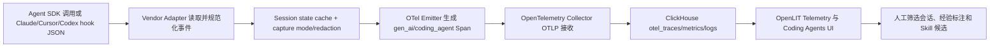

# OpenLIT：以 OpenTelemetry、ClickHouse 和 SDK 采集 Agent 会话

> **项目快照**：官方仓库 [openlit/openlit](https://github.com/openlit/openlit)｜核验日期 2026-09-03｜Stars 约 2.7k｜许可证 Apache-2.0｜最新可见 Release 为 `openlit-2.0.0`（2026-08-28），主分支包含 Claude Code、Cursor 和 Codex coding-agent hook。[^openlit-repository][^openlit-license][^openlit-release]

> **需求画像**：团队希望在本地开发 Agent 工作流中收集完整会话、prompt、工具调用、文件编辑、子 Agent 与代码影响，支持用户选择采集模式并在单台内网服务器分析。系统应跨 Agent、可切换 OTLP/API 端点，并为业务 Memory 和 Skill 经验提取保留可追溯原始证据。

## 1. 项目要解决什么问题

### 目标用户与使用场景

OpenLIT 面向构建和运营 LLM/Agent 应用的工程团队。常规 SDK 通过 Python、TypeScript 或 Go 初始化，将模型、向量库、框架和 GPU 的 telemetry 送到 OpenTelemetry 管道；其 CLI 还为 Claude Code、Cursor、Codex 等本地 coding agent 安装 vendor hook。[^openlit-readme][^openlit-coding]

### 当前问题

LLM 应用的可观测性如果只记录 token、延迟和费用，无法解释 Agent 为什么采取某个动作。OpenLIT 将 traces、metrics、logs、exceptions 和 AI 分析放到统一 Telemetry 页面，并在 trace/span 级别展示属性和生成内容。[^openlit-telemetry]

开发 Agent 的会话往往由多个短生命周期 hook 进程组成。OpenLIT 为 coding agent 定义统一 schema：适配器接收 vendor JSON，规范化 Session、ToolCall、LLMTurn、EditDecision 等事件，OTel 层补充资源属性和 trace ID，ClickHouse 读模型再按 chat thread 聚合。[^openlit-hook-guide]

### 问题边界

OpenLIT 是 OTel-native 观测、分析和 prompt/evaluation 平台，不是业务知识 Memory，也不会自动把会议或开发经验写成 Skill。Coding-agent CLI 采集的是 hook 事件和必要的 transcript 片段；它不是原始 Claude Code 目录的通用文件归档器，完整原文是否落到 span 受内容采集模式和属性上限约束。[^openlit-hook-guide]

## 2. 设计的核心思路

### 核心判断

OpenLIT 将 Agent 会话视为 OpenTelemetry trace：SDK 或 coding-agent hook 生成标准 `gen_ai.*` 语义字段和 `coding_agent.*` 扩展，Collector 接收并写入 ClickHouse，平台 UI 以同一批 OTel 表查询 traces、metrics 和 logs。[^openlit-readme][^openlit-telemetry]

### 关键设计选择

- **标准 OTel 数据平面**：Python、TypeScript、Go SDK 和 CLI 都以 OTLP 为传输边界，观测数据可以进入 OpenLIT 或现有 OTel 工具，降低 Agent/模型供应商绑定。[^openlit-readme][^openlit-install]
- **厂商适配器 + 规范化 schema**：每个 coding agent 有独立 hook adapter，统一到 Session、ToolCall、LLMTurn、EditDecision 等 canonical 事件；新增 vendor 主要沿 adapter、插件 manifest、文档和查询契约扩展。[^openlit-hook-guide][^openlit-claude-adapter]
- **内容采集分级**：`minimal` 只存计数器/标识，`metadata_only` 添加工具名、清洗后的路径和分类标签，`full` 才写 prompt/completion、工具结果和 edit diff；所有内容经 redaction helper 并由模式控制。[^openlit-hook-guide]
- **事实与查询解耦**：session state cache 保存跨 hook 进程的用户、工作目录、仓库、分支、模型、权限和会话关系；ClickHouse 读层按 `coding_agent.session.id` 和 parent conversation 聚合，UI 不依赖单次进程的生命周期。[^openlit-hook-guide]

### 代价与取舍

OTel 带来跨 Agent 的统一数据模型，但各 vendor hook 的事件语义仍需要维护；厂商升级可能改变 payload。`full` 模式最接近开发经验提取，却会增加敏感内容、存储和 ClickHouse 查询成本；`minimal`/`metadata_only` 更安全，但不足以恢复完整推理和代码修改上下文。[^openlit-hook-guide]

ClickHouse 适合高吞吐分析，但不是长期原始文件仓库。OpenLIT 当前通过 span attributes/events 表达消息和 diff，团队仍需决定长 transcript 是否外置到对象存储，以及如何把原文与 trace ID 关联。

## 3. 项目如何工作

### 工作流概览

### 阶段说明

| 阶段 | 接收什么 | 做什么 | 产生的状态或产物 | 证据 |
| --- | --- | --- | --- | --- |
| 应用/Hook 采集 | SDK 调用或 vendor hook 的 JSON payload | SDK instrumentation 或 CLI adapter 捕获 LLM、工具、编辑、子 Agent 和生命周期事件 | 原始事件和 vendor 上下文 | [^openlit-readme][^openlit-coding] |
| 规范化与身份关联 | `session_id`、conversation/parent id、cwd、repo、model、permission 等 | 映射到 canonical `Session`/`ToolCall`/`LLMTurn`/`EditDecision`，跨短进程读写 session cache | 带稳定身份的规范化事件 | [^openlit-hook-guide] |
| 内容治理 | 事件正文、路径、命令、diff | 按 `OPENLIT_CODING_CONTENT_CAPTURE` 选择 minimal/metadata/full，并用 redaction 清洗 | 允许写入 span 的属性集合 | [^openlit-hook-guide] |
| OTel 发射 | 规范化事件和 session 资源属性 | 设置 `gen_ai.*`、`coding_agent.*` 属性，按 session id 派生 trace/root span，应用采样规则 | OTLP traces/metrics/logs | [^openlit-hook-guide][^openlit-telemetry] |
| 接收持久化 | OTLP gRPC/HTTP | 内置 Collector 接收并写入 ClickHouse 表 | `otel_traces`、`otel_metrics_*`、`otel_logs` | [^openlit-telemetry][^openlit-install] |
| 读模型聚合 | ClickHouse span rows | 按 chat thread、vendor、用户和会话物化 coding-agent summary | Sessions/Users/Overview 数据 | [^openlit-hook-guide] |
| 人工分析 | UI trace、span、prompt 和 diff | 查询、过滤、查看五视图详情，筛选高价值成功/失败会话 | 可引用的经验证据和 Skill 候选（外部治理） | [^openlit-telemetry][^openlit-coding] |

### 关键状态与产物

- **Session state cache**：在 `$XDG_CACHE_HOME/openlit/sessions/<sid>.json` 保存跨短生命周期 hook 的用户、CWD、仓库 URL、分支、模型、权限、conversation/parent id 等身份事实；工具 payload、prompt body、diff 不作为跨事件缓存。[^openlit-hook-guide]
- **Coding-agent Span**：每个 span 至少带 `coding_agent.session.id`；稳定的 conversation/parent id 用于把子 Agent 折叠到用户看见的 chat row。`gen_ai.*` 与 `coding_agent.*` 共同承载模型、工具、编辑、命令和会话元数据。[^openlit-hook-guide][^openlit-claude-adapter]
- **内容采集模式**：`minimal` 只保留标识/计数；`metadata_only` 保留工具名、清洗路径和分类标签；`full` 增加 prompt/completion、tool result 和 edit diff。三种模式均受配置和 redaction 约束。[^openlit-hook-guide]
- **ClickHouse 读模型**：原始 OTel 表支撑 Telemetry 页面；coding-agent materializer 将 span 聚合为 `openlit_agents_summary` 等查询结果，驱动 Sessions、Users 和 Overview。[^openlit-hook-guide][^openlit-telemetry]

### 最终输出

OpenLIT 输出可按 vendor、chat thread、Session 和 span 查询的开发 Agent telemetry：prompt/回复（full 模式）、工具和 shell 事件、文件编辑/影响、子 Agent 关系、模型成本、错误、指标和日志。它适合产生 Skill 更新所需证据，但不会自动判断业务规则或提交 Skill PR。

## 4. 与需求画像逐项对照

### 需求矩阵

| 需求项 | 优先级或硬约束 | 项目现有能力 | 证据 | 状态 | 说明 |
| --- | --- | --- | --- | --- | --- |
| 多种 Agent 接入 | 必须 | Coding-agent CLI 原生支持 Claude Code、Cursor、Codex；SDK 支持 Python/TypeScript/Go 与大量 Agent 框架 | [^openlit-coding][^openlit-readme] | 满足 | 新 vendor 需实现 adapter/manifest/schema 映射 |
| 完整消息、工具和执行轨迹 | 必须 | hook 可记录 session、prompt、tool call、file edit、subagent、code-impact；`full` 模式写正文/结果/diff | [^openlit-coding][^openlit-hook-guide] | 部分满足 | “完整”取决于 vendor payload、capture mode 和 span 属性上限，不是原始文件归档 |
| Session 检索与回放 | 期望 | Coding Agents 页面按 chat thread 聚合；Telemetry 有 trace detail explorer、属性和日志 | [^openlit-coding][^openlit-telemetry] | 满足 | 提供可视化和详情，但不等同于终端原样重放 |
| 用户决定上传原始会话 | 期望，当前非硬约束 | CLI 由用户安装、配置 endpoint 和 vendor hook；采集模式可部署级配置 | [^openlit-coding][^openlit-hook-guide] | 部分满足 | 没有官方逐会话审批/上传 UI；需在 hook 前加选择或改为本地缓存后发送 |
| 单台内网服务器部署 | 必须 | 官方 Docker Compose 以 OpenLIT、ClickHouse、OTel Collector 三组件运行 | [^openlit-install][^openlit-compose] | 满足 | 可复用已有 ClickHouse/Collector；官方未给资源数字，需实测 |
| 模型 API/OTLP 端点可切换 | 期望 | SDK/CLI 使用标准 OTLP 配置，endpoint 可指向公司 Collector 或自建 OpenLIT；模型供应商由被观测应用配置 | [^openlit-readme][^openlit-cli-config] | 满足 | OpenLIT 不负责模型路由，DeepSeek/公司 API 在 Agent 侧配置 |
| 共享业务知识 Memory | 必须 | prompt hub、trace 属性和 logs 可存放线索 | [^openlit-readme][^openlit-telemetry] | 部分满足 | 没有声明业务事实的长期 Memory、冲突和知识版本治理 |
| Skill 候选、评审和验证 | 必须 | full trace、编辑/影响事件和人工分析可供外部提取 | [^openlit-coding][^openlit-hook-guide] | 部分满足 | 没有 Skill diff、Git PR、负责人审批和回归测试闭环 |
| 原始会话隐私和权限 | 必须 | 三档 capture mode、redaction、采样、用户级 cohort floor；支持自托管 | [^openlit-hook-guide][^openlit-install] | 部分满足 | 原始 `full` 内容仍会上传到配置的 OTLP endpoint；用户确认、密钥扫描、删除审计需补齐 |
| 社区验证与许可证 | 必须 | 约 2.7k Stars，Apache-2.0，近期发布 2.0.0 | [^openlit-repository][^openlit-license][^openlit-release] | 满足 | 许可允许内部修改和自托管，仍需遵守 NOTICE/依赖许可 |

### 对照归纳

OpenLIT 是本次画像中少数直接覆盖 Claude Code、Cursor、Codex 本地 hook 的项目，统一 schema 和 `full` capture 使其很接近“先收集开发会话，再筛选经验”的入口。它仍不是原始会话授权归档或 Memory/Skill 治理系统；这些需求要在 hook、对象存储、知识层和 Git 流程中补齐。

## 5. 开源与能力边界

### 边界清单

| 能力 | 开源核心 | 商业版或 SaaS | 外部依赖 | 证据 |
| --- | --- | --- | --- | --- |
| OpenLIT 平台、CLI、SDK | 有，Apache-2.0 | 文档称全部功能可免费自托管；SaaS/社区服务是可选路径 | Docker/Go/Python/Node 运行时 | [^openlit-license][^openlit-install] |
| Coding-agent hook（Claude Code/Cursor/Codex） | 有，仓库 CLI、插件 manifest 和 adapter 开源 | 未确认有必须商业版能力 | 各 vendor 本地 hook 机制、OpenLIT endpoint | [^openlit-coding][^openlit-hook-guide] |
| OTel Collector 与 ClickHouse 存储 | Compose 提供配置和启动方式 | 可复用已有部署 | ClickHouse、OpenTelemetry | [^openlit-install][^openlit-compose] |
| Telemetry UI、Coding Agents 页面 | 有 | 官方托管服务可选，不能把 SaaS 与核心开源混写 | OpenLIT server、ClickHouse | [^openlit-telemetry][^openlit-compose] |
| Prompt Hub、Evaluations、Guardrails 等平台能力 | README/文档列为开源功能 | 具体托管运营能力未单独确认 | 可选评估模型 API、Agent 应用 | [^openlit-readme][^openlit-install] |
| 长期业务 Memory、Skill PR 自动化 | 未提供为现成核心能力 | 未确认 | 需外部知识库、Git 与治理服务 | [^openlit-readme][^openlit-hook-guide] |

### 边界判断

OpenLIT 官方安装文档明确写明 Apache-2.0、自托管功能无需 license key 或 usage limits；因此它与有商业版限制的 Open Core 项目不同。但“full capture”是 telemetry 记录策略，并不意味着自动保存不可变原始 transcript；若要保留原文件，仍需自建对象存储/归档流程。[^openlit-install]

## 6. 用户如何接入和使用

### 接入前提

- 内网运行 OpenLIT Compose，或已有可接入的 ClickHouse 与 OTel Collector；默认平台端口为 3000，OTLP gRPC/HTTP 为 4317/4318。[^openlit-install][^openlit-compose]
- 本地 coding agent 能安装 vendor hook；CLI 当前支持 `claude-code`、`cursor`、`codex` 和 `all`，并可用 `openlit doctor` 检查配置、连通性和插件。[^openlit-coding]
- 若观测常规 Agent 应用，安装 `openlit` SDK 并按语言初始化；模型 API、公司 API 或 DeepSeek API 仍由被观测应用配置。

### 最快验证路径

1. 在内网服务器克隆仓库并执行 `docker compose up -d`，验证 OpenLIT、ClickHouse 和 Collector 正常。[^openlit-install]
2. 本地安装 OpenLIT CLI，运行 `openlit configure --endpoint http://<server>:4318 [--api-key <key>]`，再执行 `openlit coding install --vendor=all` 或选择单一 vendor。[^openlit-coding]
3. 选择 `OPENLIT_CODING_CONTENT_CAPTURE`（默认按部署策略设置 minimal/metadata_only/full），必要时设置采样和 trace ID salt；明确 full 内容的发送范围和保留策略。[^openlit-hook-guide]
4. 运行 Claude Code/Cursor/Codex 会话，在 `/coding-agents` 或 `/telemetry` 查看 trace、Session、工具/编辑/成本信息；将带 `session_id`、repository、branch、skill_version 的样本交给人工经验提取。
5. 将确认的经验整理到团队 Memory，并通过 Git PR 修改 Skill；该治理步骤是 OpenLIT 之外的流程。

### 日常使用方式

用户不需要在 Agent 应用中逐个添加 SDK：coding-agent plugin/hook 在生命周期、prompt、工具、编辑和结束事件发生时调用 CLI。CLI 短进程从 session cache 恢复身份，把每个事件发送到 OTel；评审者在 UI 中按 chat thread 或 trace 观察完整过程，再按内容模式和权限决定哪些会话可用于经验沉淀。[^openlit-hook-guide][^openlit-coding]

### 接入限制

OpenLIT 只捕获 vendor 暴露的 hook 数据；如果厂商不提供稳定的 conversation id，跨进程的会话折叠会不完整。`full` 模式的正文和 diff 仍可能包含密钥、代码或个人信息，必须依赖 redaction、访问控制和保留策略。当前没有逐会话用户确认、原始 JSONL 上传器、Memory schema 或 Skill PR 生成器。

## 7. 部署构成

### 运行组件

| 组件 | 必需或可选 | 职责 | 持久化数据 | 与其他组件的关系 | 证据 |
| --- | --- | --- | --- | --- | --- |
| OpenLIT platform/server | 必需 | Web UI、API、OTLP receiver 配置和平台功能 | `openlit-data` 卷中的 SQLite/平台数据 | 从 ClickHouse 读写平台数据，内置/连接 Collector | [^openlit-compose][^openlit-install] |
| ClickHouse | 必需（可复用已有） | 高吞吐保存 OTel traces、metrics 和 logs | `clickhouse-data` 卷、`otel_*` 表 | Collector 写入，OpenLIT UI/queries 读取 | [^openlit-compose][^openlit-telemetry] |
| OpenTelemetry Collector | 必需（可复用已有） | 接收 OTLP、处理并导出 telemetry | 官方配置未声明业务持久化 | CLI/SDK → Collector → ClickHouse | [^openlit-install][^openlit-readme] |
| OpenLIT CLI | 本地 coding-agent 接入必需 | 安装 vendor hook、读取 payload、规范化并发出 OTel | 配置和 session cache 位于用户配置/cache 目录 | Claude Code/Cursor/Codex hook → OTLP endpoint | [^openlit-coding][^openlit-hook-guide] |
| Agent SDK（Python/TS/Go） | 常规应用接入时必需 | 自动 instrumentation、生成 traces/metrics | 无本地业务持久化（除 SDK 缓冲） | 被观测应用 → Collector | [^openlit-readme] |
| vendor plugin/hook manifest | coding-agent 接入时必需 | 把 Agent 生命周期事件转给 CLI | 由各 Agent 管理；OpenLIT 保存 session cache | Agent hook → CLI | [^openlit-coding][^openlit-claude-adapter] |

### 最小部署路径

官方最小路径是 Docker Compose 启动 OpenLIT、ClickHouse 和内置 OpenTelemetry Collector；如果已有 ClickHouse 或 Collector，可配置复用而减少本机组件。开发者安装 CLI 并配置 OTLP endpoint，再为目标 vendor 安装 hook；常规 Agent 则安装对应 SDK。[^openlit-install]

### 生产化仍需考虑

- `docker-compose.yml` 为 ClickHouse 和 OpenLIT 分别配置 `clickhouse-data`、`openlit-data` 卷，并暴露 3000、4317、4318；单机需要备份两类卷和 ClickHouse 表。[^openlit-compose]
- 官方没有给出本试点规模的 CPU、内存、磁盘或 transcript 吞吐要求，必须用真实会话和所选 capture mode 实测；full 模式的 span 体积应单独压测。
- 生产环境需补 TLS、鉴权、API key/JWT、网络隔离、按项目/用户权限、数据保留和 ClickHouse TTL；采集 endpoint 控制权限不能只依赖客户端配置。
- coding-agent hook 是开发者本地执行的短进程，session cache 应设置文件权限和清理周期；原始 payload、debug tee 和 full span 需要统一审计与删除。
- 如接入多个 vendor，新增 adapter 必须同时更新规范化字段、会话聚合、物化读模型和端到端验证；否则 UI 可能出现重复会话或空列表。[^openlit-hook-guide]

## 8. 适配结论与能力缺口

### 适配结论

**条件匹配。**

OpenLIT 原生覆盖 Claude Code、Cursor、Codex hook，提供多级内容采集、OTel 标准化、ClickHouse 分析和 Session/Coding Agents UI，因此非常适合作为开发会话采集层。它并不直接解决用户选会话上传、原始文件归档、业务 Memory 或 Skill Git 评审；full capture 还带来隐私和存储治理责任。

### 已满足能力

- 多 vendor coding-agent hook 与 Python/TypeScript/Go SDK；
- Session、prompt、Tool、编辑、subagent、代码影响、错误、成本和 OTel signals 的统一采集；
- `minimal`/`metadata_only`/`full` 内容模式与 redaction/sampling；
- OpenTelemetry/OTLP 端点可切换，能接公司 Collector、DeepSeek 相关应用或自建 OpenLIT；
- Docker Compose 单机三组件路径，ClickHouse/Collector 可复用；
- Apache-2.0 开源核心，无必须 license key 或用量限制的自托管功能。

### 能力缺口

- 没有逐会话“本地筛选→用户确认→上传完整原始 JSONL”的界面和审批记录；
- full span 不是不可变原始 transcript 归档，超长内容、附件和大 diff 仍需外置存储设计；
- 没有业务知识 Memory 的实体、来源、冲突、版本和召回治理；
- 没有自动把会话证据转换为 Skill patch、Git PR、负责人审批和回归评估；
- 不负责模型路由，DeepSeek/公司模型 API 需要在被观测应用或网关层配置。

### 需要自研或外部补齐

- 用户本地会话索引/评分、选择确认、发送队列和原始 JSONL/附件对象存储；
- Claude Code 等 vendor 的敏感信息扫描与二次确认，并把授权状态写入 resource attributes；
- `trace_id/session_id` 到业务 Memory 条目、经验候选和 Skill commit 的关联模型；
- 经验审核、Git PR、回归任务和效果指标；
- 单机 ClickHouse 的 TTL、备份、权限和 full capture 容量策略。

### 否决风险

当前未发现许可证或单机部署方面的硬性否决项。若公司要求自动保留原始会话且不能接受客户端 hook 改造，或要求平台本身提供成熟的业务 Memory/Skill 发布治理，OpenLIT 不能单独满足目标。

---

[^openlit-repository]: [OpenLIT 官方 GitHub 仓库](https://github.com/openlit/openlit)
[^openlit-license]: [OpenLIT 官方 Apache-2.0 LICENSE](https://github.com/openlit/openlit/blob/main/LICENSE)
[^openlit-release]: [OpenLIT 官方 Release 2.0.0](https://github.com/openlit/openlit/releases/tag/openlit-2.0.0)
[^openlit-readme]: [OpenLIT 官方 README：架构、SDK、集成与功能](https://github.com/openlit/openlit/blob/main/README.md)
[^openlit-install]: [OpenLIT 官方自托管安装文档](https://docs.openlit.io/latest/openlit/installation)
[^openlit-compose]: [OpenLIT 官方 Docker Compose 清单](https://github.com/openlit/openlit/blob/main/docker-compose.yml)
[^openlit-telemetry]: [OpenLIT 官方 Telemetry 概览](https://docs.openlit.io/latest/openlit/observability/telemetry/overview)
[^openlit-coding]: [OpenLIT 官方 README：AI Coding Agents](https://github.com/openlit/openlit#-ai-coding-agents-claude-code-cursor-codex)
[^openlit-hook-guide]: [OpenLIT 官方 Coding-Agent Hook Authoring Guide](https://github.com/openlit/openlit/blob/main/agent-guides/coding-agents-hook.md)
[^openlit-claude-adapter]: [OpenLIT 官方 Claude Code hook adapter](https://github.com/openlit/openlit/blob/main/cli/internal/coding/hook/claudecode/handle.go)
[^openlit-cli-config]: [OpenLIT 官方 CLI 配置文档](https://docs.openlit.io/latest/cli/configuration)

