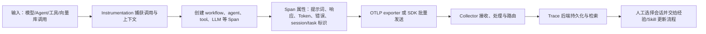

# OpenLLMetry：以 OpenTelemetry Instrumentation 作为跨 Agent 采集层

> **项目快照**：官方仓库 <https://github.com/traceloop/openllmetry>｜核验日期 2026-09-04｜Stars 约 7.4k｜许可证 Apache-2.0｜最近发布 v0.62.1（2026-06-28），仓库仍有持续提交和发布记录。[^openllmetry-repository][^openllmetry-license][^openllmetry-release]

> **需求画像**：目标是为 Claude Code、其他开发 Agent 或自研 Agent 采集可供复盘的消息、工具调用、模型调用和工作流轨迹，并把可授权的会话证据交给后续经验提取与 Skill 更新流程。必须支持多种 Agent/模型、可切换 OTLP 端点和公司内网部署；可以接受项目只提供采集层、不直接生成 Skill 候选，但不能把“有 Trace”误认为已经完成会话知识治理。

## 1. 项目要解决什么问题

### 目标用户与使用场景

OpenLLMetry 面向构建 LLM 应用的开发者。它把 OpenTelemetry 的 Trace、Span 和属性模型扩展到 LLM、Agent、向量数据库和相关框架，使开发者能够观察一次工作流中的模型调用、工具调用、检索和错误。官方将它定位为基于 OpenTelemetry 的 LLM 应用可观测性扩展，而不是一个独立的会话知识库。[^openllmetry-introduction]

对本试点而言，最有价值的场景是：在 Agent 应用或会话适配器中产生统一的 OTLP 轨迹，然后由 Collector 或其他后端保存完整输入/输出与工具信息，供人工挑选高价值会话，再做经验抽取。它也可以作为跨 Agent 的共同采集协议：只要某个 Agent 能创建 OpenTelemetry Span，就不必为每个下游分析系统重写存储接口。

### 当前问题

第一，开发 Agent 往往把一次任务拆成模型请求、工具执行、检索和重试；只记录最终答案会丢失“为什么这样做”的过程。OpenLLMetry 为这些调用创建带语义属性的 Span，使调用链可按 Trace 重建。[^openllmetry-supported]

第二，不同模型供应商和框架的 SDK 形态不同。项目将 instrumentations 拆成按供应商、向量库和框架安装的 Python/TypeScript 包，并同时提供 Traceloop SDK，减少业务代码对某一个观测后端的耦合。[^openllmetry-without-sdk][^openllmetry-repository]

第三，观测数据常被锁定在某个 SaaS。OpenLLMetry 使用标准 OTLP 配置，可将数据发送到 OpenTelemetry Collector、Grafana、SigNoz、Jaeger 或其他支持 OTLP 的后端；端点和请求头可通过环境变量或初始化参数切换。[^openllmetry-configuration][^otel-exporter]

### 问题边界

OpenLLMetry 不负责读取 Claude Code 本地目录中的历史 JSONL 会话，也不提供面向代码仓库的会话选择、用户授权上传、原始会话归档或回放 UI。官方列出的集成对象是应用中的模型/框架/向量库调用；若目标 Agent 没有可插桩的运行时，需要额外写适配器或直接创建 Span。它也不内置 Memory 冲突消解、业务知识抽取、Skill 版本评审和 Git 合并流程。上述缺口是根据官方能力边界作出的调研判断。

## 2. 设计的核心思路

### 核心判断

OpenLLMetry 的核心判断是：把 LLM 运行过程表达为标准 OpenTelemetry 数据，再用专门的语义属性补充模型、Token、提示词、响应、工具和检索信息。采集层和存储/可视化后端解耦，后端可以替换，数据可以与已有系统关联。

### 关键设计选择

- **以标准 OpenTelemetry 为传输和生命周期骨架**：官方仓库明确说明 instrumentations 输出标准 OpenTelemetry 数据；已有 OTel 应用可以只安装所需 instrumentation，而不必使用 Traceloop SDK。[^openllmetry-repository][^openllmetry-without-sdk]
- **按 LLM provider、框架和向量库拆包**：OpenAI、Anthropic、Bedrock、Gemini、LangChain、LlamaIndex、Chroma、Qdrant 等分别提供 instrumentation，业务可以只启用所需模块，并可在同一 Trace 中关联调用。[^openllmetry-supported]
- **用 workflow/task/agent/tool 语义补齐业务层级**：SDK 提供 `@workflow`、`@task` 等装饰器；自动插桩负责已支持的库，业务层需要显式标注时再增加父 Span。这使“一个开发任务”能够成为跨多个调用的上下文边界。[^openllmetry-python]
- **导出目标通过 OTLP endpoint、headers 或自定义 exporter 配置**：`TRACELOOP_BASE_URL`、`TRACELOOP_API_KEY`、`TRACELOOP_HEADERS` 和 SDK 参数允许接入不同后端；因此公司 API、内网 Collector 和外部服务可分别配置。[^openllmetry-configuration]

### 代价与取舍

标准化带来可移植性，也意味着下游系统必须理解 OTel Trace 和 OpenLLMetry 的属性约定。自动插桩只覆盖官方支持的 SDK/框架；Claude Code 这种本地开发代理会话不是其 README 的原生采集对象，若要完整保存终端输入、文件改动、权限确认和人工纠正，仍需开发 Claude Code 会话适配层。长提示词和代码片段作为 Span 属性时还需要自行制定大小限制、脱敏、采样和访问控制；官方没有为本试点给出资源规格或完整会话治理方案。

## 3. 项目如何工作

### 工作流概览

### 阶段说明

| 阶段 | 接收什么 | 做什么 | 产生的状态或产物 | 证据 |
| --- | --- | --- | --- | --- |
| 运行时插桩 | provider、框架、向量库的 SDK 调用 | 自动包装调用，或由用户调用 `instrument()` 注册 instrumentation | 带开始/结束时间、父子关系和异常状态的 Span | [^openllmetry-without-sdk][^openllmetry-supported] |
| 语义补充 | 当前 workflow、task、agent 或 tool 的业务上下文 | SDK 装饰器或手工 Span 将调用挂到任务上下文 | 可按一次工作流聚合的 Trace；Span 带模型、Token、提示词和响应属性 | [^openllmetry-python][^openllmetry-introduction] |
| 导出 | Span、Resource attributes 和 headers | 通过 OTLP/HTTP、OTLP/gRPC 或自定义 exporter 发送 | Collector 或兼容后端可接收的 OTLP 数据 | [^openllmetry-configuration][^otel-exporter] |
| 收集与路由 | OTLP traces/metrics/logs | Collector 的 receiver 接收，processor 可过滤/变换，exporter 发往后端 | 后端中的 Trace、指标和日志；可按服务/环境查询 | [^otel-collector-config][^otel-collector-docker] |
| 经验筛选 | 后端中完整或部分 Trace | 由人或外部分析程序按 task、失败、重试、人工纠正等条件选取 | 可授权进入 Skill 候选生成的会话证据 | 调研判断；OpenLLMetry 未提供会话筛选工作台 |

### 关键状态与产物

- **Span/Trace**：Span 是一次模型、Agent、工具或检索操作的结构化记录；Trace 由父子关系组成，可表达一个工作流。其保存位置不由 OpenLLMetry 固定，而由 exporter/Collector 的后端决定。[^openllmetry-introduction][^otel-collector-config]
- **Resource attributes**：服务名、环境、版本和自定义 task/session 标识可随 Span 发送，用于按项目、成员、Agent 和运行环境过滤。官方配置文档明确支持通过 `resource_attributes` 增加属性。[^openllmetry-configuration]
- **LLM 语义属性**：模型请求/响应、Token 使用量、错误以及框架和向量库信息由相应 instrumentation 记录。是否保留完整提示词和响应取决于 instrumentation 版本、后端属性限制和部署配置，不能仅凭“支持 tracing”推定为完整原始会话。

### 最终输出

最终输出是标准化的 Trace 数据和可在下游 Trace 后端中查看的调用链。对 Skill 更新闭环，OpenLLMetry 的直接产物应被视为“开发会话证据层”：需要另建会话投影（例如将 Trace 按 session/task 聚合为原始会话包）、人工授权和经验提取程序，再生成带来源的 Skill 修改候选。

## 4. 与需求画像逐项对照

### 需求矩阵

| 需求项 | 优先级或硬约束 | 项目现有能力 | 证据 | 状态 | 说明 |
| --- | --- | --- | --- | --- | --- |
| 采集模型调用、Agent/工作流和工具轨迹 | 必须 | LLM provider、框架和 workflow/task/agent/tool 可通过 instrumentation 或装饰器记录 | [^openllmetry-supported][^openllmetry-python] | 部分满足 | 对已支持库满足；Claude Code 本地会话本身需要自研适配器 |
| 保存可供复盘的完整消息和工具调用 | 必须 | Span 可携带提示词、响应、Token、错误和元数据 | [^openllmetry-introduction][^openllmetry-anthropic] | 部分满足 | 长文本保存、代码改动、终端输出、人工确认和原始 JSONL 封装需验证/补齐 |
| 接入多种 Agent/模型 | 必须 | Python/TypeScript provider 和多个框架/协议支持 | [^openllmetry-supported][^openllmetry-repository] | 满足 | 接入边界取决于具体 SDK 是否有现成 instrumentation |
| 模型/API endpoint 可切换 | 必须 | OTLP endpoint、headers、自定义 exporter 均可配置；观测后端与模型调用解耦 | [^openllmetry-configuration][^otel-exporter] | 满足 | 公司 API/DeepSeek 的业务调用仍需使用兼容 SDK 或手工 instrumentation |
| 单台内网服务器部署 | 必须 | SDK 可作为依赖嵌入应用；Collector 可用 Docker 单容器运行 | [^otel-collector-docker] | 部分满足 | OpenLLMetry 本身轻；若要查询和长期保存，还需另选 Trace 后端及存储 |
| 用户主动选择后上传原始会话 | 期望 | 标准导出机制和自定义 headers 可控制目的地 | [^openllmetry-configuration] | 不满足 | 未提供本地会话浏览、选择、审批或一次性上传流程 |
| 追溯经验来源并生成 Skill 候选 | 必须 | Trace 有时间、父子关系和自定义属性，可作为来源 ID | [^openllmetry-introduction] | 部分满足 | 经验提取、证据片段、候选生成、人工评审和 Git 合并均需外部系统 |
| 原始数据隐私和访问治理 | 必须 | 可发往内网 Collector；OTLP headers/TLS 可配置 | [^openllmetry-configuration][^otel-exporter] | 部分满足 | 脱敏、RBAC、保留期、审计和加密由 Collector/后端/公司治理层负责 |

### 对照归纳

OpenLLMetry 对“跨 Agent 采集层”和“可切换后端”天然匹配，对“会话治理和 Skill 更新”只提供可复用的轨迹基础。若试点已有 Agent 应用运行时，它可以快速增加模型和工具级 Trace；若主要数据源是 Claude Code 本地历史会话，则首先要解决会话适配和原始记录落库，而不能直接把 SDK 初始化当作采集完成。

## 5. 开源与能力边界

### 边界清单

| 能力 | 开源核心 | 商业版或 SaaS | 外部依赖 | 证据 |
| --- | --- | --- | --- | --- |
| OpenTelemetry instrumentation 与 Traceloop SDK | 有，Apache-2.0 | Traceloop Cloud 可作为托管观测后端 | Python/TypeScript 运行时及被插桩的 SDK | [^openllmetry-repository][^openllmetry-license] |
| OTLP/HTTP、OTLP/gRPC 和自定义 exporter | 有 | 不要求 Traceloop Cloud，可指向其他后端 | Collector 或兼容 OTLP 后端（若需要集中接收） | [^openllmetry-configuration][^openllmetry-without-sdk] |
| Trace/Span 查询、图表和长期存储 | OpenLLMetry 不包含完整后端 | 可使用 Traceloop Cloud 或其他商业/开源后端 | SigNoz、Grafana、Jaeger、Datadog 等任选其一 | [^openllmetry-repository] |
| 会话选择、原始上传审批、脱敏和权限 | 无专门实现 | 可能由下游平台提供 | 需要自研会话投影和治理服务 | 调研判断 |
| 经验抽取、评估和 Skill 版本发布 | 无 | 需外部评估/协作系统 | LLM API、数据集/评估工具、Git 服务 | 调研判断 |

### 边界判断

“OpenLLMetry 支持完整可观测性”描述的是应用运行时的 Trace 覆盖，不等价于“自动收集 Claude Code 的原始会话并提供回放”。Apache-2.0 允许内部修改和自研适配，但团队仍需承担收集敏感代码、提示词和工具参数的访问控制及保留策略。使用 Traceloop Cloud 会引入外部数据处理边界；如果原始会话不能离开内网，应将 endpoint 配置到内网 Collector，并明确 Collector 后端的存储与权限。

## 6. 用户如何接入和使用

### 接入前提

- 选择需要插桩的 Python/TypeScript LLM provider、Agent 框架或向量库，并确认其在官方支持列表中；不在列表的 Agent 要实现手工 Span 适配器。[^openllmetry-supported]
- 在应用中安装 `traceloop-sdk`，或直接安装所需的 `opentelemetry-instrumentation-*` 包并配置 OpenTelemetry `TracerProvider`。[^openllmetry-without-sdk]
- 准备一个 OTLP 接收地址、认证 headers/TLS 和资源属性；该地址可以是公司 Collector、Traceloop Cloud 或其他兼容后端。[^openllmetry-configuration]

### 最快验证路径

1. 在 Agent/应用依赖中安装 SDK 与所需 instrumentation，初始化 `Traceloop.init()`，或者在已有 OTel Provider 上调用对应 `instrument()`。
2. 对一次开发任务建立稳定的 `service.name`、`session.id`、`task.id` 和成员/项目属性；对未自动覆盖的 Agent loop、工具、文件操作和人工确认建立父子 Span。
3. 将 OTLP exporter 指向内网 Collector，先在 Collector 的 debug exporter 或测试后端确认父子关系、输入/输出属性、错误和 Token 数据，再接入长期存储。
4. 在会话投影层按 `session.id/task.id` 聚合 Trace，提供用户筛选和授权；只有授权的 Trace 才进入经验分析和 Skill 候选流水线。

### 日常使用方式

业务 Agent 正常执行任务时，instrumentation 自动产生 LLM/工具/检索 Span，工作流装饰器补充任务边界。运维或经验负责人通过 Trace 后端查看失败、重试和人工纠正，再把选中的 Trace 导出为候选会话包。OpenLLMetry 自身不规定查询界面和筛选规则。

### 接入限制

OpenLLMetry 不是 Claude Code 插件，也不会自动发现开发者个人目录中的历史会话。终端命令、文件差异、用户输入和权限确认若没有经过可观测的应用层调用，不能假设会出现在 Trace 中。跨语言或多进程 Agent 还需要统一 Resource/Trace context 传播；另外，采用批量 Span processor 时，进程异常可能导致尚未导出的数据丢失，需要根据试点的可靠性要求配置 flush 和重试。

## 7. 部署构成

### 运行组件

| 组件 | 必需或可选 | 职责 | 持久化数据 | 与其他组件的关系 | 证据 |
| --- | --- | --- | --- | --- | --- |
| Agent/LLM 应用内 OpenLLMetry SDK 或 standalone instrumentation | 必需（采集时） | 创建 LLM、Agent、工具、向量库和工作流 Span | 默认不负责长期持久化；导出前在进程内缓冲 | 通过 OTLP HTTP/gRPC 调用 Collector 或后端 | [^openllmetry-repository][^openllmetry-without-sdk] |
| OpenTelemetry Collector | 可选（集中接收时推荐） | OTLP receiver 接收，processor 过滤/变换，exporter 路由 | 默认无长期业务数据；可配置队列/文件缓冲 | 接收各 Agent 的 OTLP，转发一个或多个后端 | [^otel-collector-config][^otel-collector-docker] |
| Trace/日志/指标后端（如 SigNoz、Grafana、Jaeger 或 Traceloop Cloud） | 必需（查询/保存时） | 索引、存储和展示 Trace | Trace、Span 属性、指标和日志，具体由后端决定 | 接收 Collector 或 SDK 导出的 OTLP | [^openllmetry-repository][^otel-exporter] |
| 会话投影/授权服务 | 试点所需的外部补充 | 将 Trace 聚合成会话，提供人工筛选、授权上传和导出 | 原始会话包、授权记录、来源 Trace ID | 读取后端数据，向经验/Skill 流程输出 | 调研判断 |
| PostgreSQL/对象存储或后端自带存储 | 可选，取决于所选后端 | 保存索引、长文本、原始会话和附件 | 持久化 Trace、代码片段、工具输出和审计记录 | 被 Trace 后端和会话投影使用 | 所选后端官方部署文档；OpenLLMetry 未规定 |

### 最小部署路径

若只验证采集，开发 Agent 进程安装 OpenLLMetry，并在同一台服务器以 Docker 运行 OpenTelemetry Collector；Collector 使用 OTLP receiver 和 debug exporter，即可确认 Trace 到达。[^otel-collector-docker] 若需要可检索的历史数据，则再部署一个支持 OTLP 的 Trace 后端及其官方要求的数据库/对象存储；OpenLLMetry 官方没有规定唯一后端或最小资源数字。

### 生产化仍需考虑

- 原始提示词、响应、代码和工具参数可能包含敏感信息，需在 Collector processor 或上游适配器设置允许采集的字段，并限制网络、身份、TLS、RBAC、审计和保留期。
- 为每个项目/成员定义 Resource attributes 和 Trace 命名约定，避免跨 Agent 会话无法聚合；对长属性、采样、批量导出失败和进程退出 flush 做实测。
- Collector 的接收、处理、导出和健康检查需要监控；长期存储、备份、删除和原始会话导出不属于 OpenLLMetry 核心，需按所选后端补齐。官方未给出本试点规模的 CPU、内存或磁盘要求，需实测。

## 8. 适配结论与能力缺口

### 适配结论

**条件匹配。**

需求矩阵显示，OpenLLMetry 对多模型、多框架和可切换 OTLP 后端有成熟的开源基础，适合作为跨 Agent 的统一采集层；但它不能直接采集 Claude Code 本地历史会话，也没有原始会话审批、长期归档、经验抽取和 Skill 评审能力。只有把它与会话适配器、Collector/Trace 后端和治理流程组合，才能服务本试点目标。

### 已满足能力

- Apache-2.0 开源、社区规模高，Python/TypeScript instrumentation 覆盖多个模型 provider、Agent 框架、向量库和 MCP 等协议。[^openllmetry-repository][^openllmetry-supported]
- 基于 OpenTelemetry，OTLP endpoint、headers 和自定义 exporter 可切换，便于公司 API、内网后端和外部服务隔离。[^openllmetry-configuration]
- 应用侧只增加 SDK 初始化或 standalone instrumentation；Collector 可用单 Docker 进程起步，符合单机试点的运行边界。[^openllmetry-without-sdk][^otel-collector-docker]

### 能力缺口

- **Claude Code 历史会话适配**：需要解析本地会话格式或接入实时 Hook，映射用户消息、模型回复、工具调用、终端输出、文件差异和人工确认，并生成稳定的 session/task Trace。
- **完整原始会话语义**：Span 属性并不自动等于原始 JSONL；需定义大文本、附件、代码 diff 和二进制工具输出的存储模型及关联 ID。
- **用户授权和隐私治理**：需要本地发现/预览/选择、确认上传、访问控制、删除和审计；OpenLLMetry 只提供可配置的导出通道。
- **Skill 更新闭环**：需在 Trace 之上增加经验分类、证据片段、修改候选、负责人评审、Git PR 和回归任务。

### 需要自研或外部补齐

- Agent/Claude Code → OpenTelemetry 的适配器与 session/task 规范；
- 内网 Collector 配置、Trace 后端及长文本/对象存储；
- 会话投影与人工授权服务；
- 脱敏、RBAC、保留期和删除审计；
- 经验提取及 Skill 候选生成器，并将来源 Trace ID 写回候选。

### 否决风险

当前未发现使 OpenLLMetry 无法进入 POC 的硬性否决项，但有两项必须在 POC 前验证：一是 Claude Code 原始会话能否稳定映射为跨任务 Trace；二是选定 Trace 后端是否能在内网保存并检索较长的代码/工具内容。如果试点要求“安装一个项目即可直接收集个人目录历史会话并回放”，则 OpenLLMetry 不匹配这一更窄的产品目标。

---

[^openllmetry-repository]: [OpenLLMetry 官方 GitHub 仓库与 README](https://github.com/traceloop/openllmetry)
[^openllmetry-license]: [OpenLLMetry LICENSE（Apache-2.0）](https://github.com/traceloop/openllmetry/blob/main/LICENSE)
[^openllmetry-release]: [OpenLLMetry 官方 Releases](https://github.com/traceloop/openllmetry/releases)
[^openllmetry-introduction]: [OpenLLMetry 官方文档：What is OpenLLMetry?](https://docs.traceloop.com/docs/openllmetry/introduction)
[^openllmetry-supported]: [OpenLLMetry 官方文档：What's Supported?](https://traceloop.com/docs/openllmetry/tracing/supported)
[^openllmetry-without-sdk]: [OpenLLMetry 官方文档：Without OpenLLMetry SDK](https://www.traceloop.com/docs/openllmetry/tracing/without-sdk)
[^openllmetry-python]: [OpenLLMetry 官方文档：Python Getting Started](https://docs.traceloop.com/docs/openllmetry/getting-started-python)
[^openllmetry-configuration]: [OpenLLMetry 官方文档：SDK Initialization Options](https://www.traceloop.com/docs/openllmetry/configuration)
[^openllmetry-anthropic]: [OpenLLMetry 官方文档：Observability for Anthropic](https://www.traceloop.com/openllmetry/integrations/observability-for-anthropic-with-traceloop)
[^otel-exporter]: [OpenTelemetry 官方规范：OTLP Exporter](https://opentelemetry.io/docs/specs/otel/protocol/exporter/)
[^otel-collector-config]: [OpenTelemetry 官方文档：Collector Configuration](https://opentelemetry.io/docs/collector/configuration/)
[^otel-collector-docker]: [OpenTelemetry 官方文档：Install the Collector with Docker](https://opentelemetry.io/docs/collector/install/docker/)
