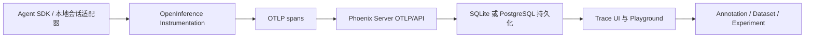

# Phoenix：以 OpenTelemetry 轨迹和评估数据集分析 Agent 会话

> **项目快照**：官方仓库 `Arize-ai/phoenix`｜核验日期 2026-09-03｜Stars 约 11.3k｜许可证 Elastic License 2.0（ELv2）｜最新 Phoenix 发布为 v20.6.0（2026-09-03），仓库仍有持续提交。[^phoenix-repository][^phoenix-license][^phoenix-release]

> **需求画像**：团队需要跨 Agent 收集完整执行轨迹，定位工具/模型失败，形成可标注数据集并比较 Skill 版本。系统应能在单机运行、模型接口可替换，并保留原始会话证据的来源。

## 1. 项目要解决什么问题

### 目标用户与使用场景

Phoenix 面向开发、评估和排障 AI 应用的工程团队。它通过 OpenTelemetry 和 OpenInference 接收 LLM、检索、工具及 Agent 框架的 spans，在 Web UI 中查看 trace、重放调用和创建数据集。官方还提供 CLI、MCP 和 Skills，让 Claude Code、Codex、Cursor 等编码 Agent 读取 trace、dataset、experiment 和 prompt。[^phoenix-readme][^phoenix-coding-agents]

### 当前问题

Agent 的一次任务通常包含多次模型调用、检索和工具执行。没有统一 trace 时，开发者只能从分散日志推断失败原因。Phoenix 用标准化 span 属性保留输入、输出、模型、延迟和调用关系。

Skill 或 Prompt 的更新还需要可比较的样本。Phoenix 提供数据集、实验、评估和 Playground，可将线上 trace 转为离线实验，观察改动是否减少失败。

### 问题边界

Phoenix 的核心仍是观测和评估后端；官方资料未确认它会扫描 Claude Code 的个人历史目录并提供逐会话审批上传。对于正在运行的 Claude Code，会话采集可通过官方 `coding-harness-tracing` 插件接入：插件利用生命周期 hooks 将每轮、工具调用、子 Agent 和 token 成本发送为 OpenInference spans。已有历史 JSONL 若要导入，仍需另写适配器。[^phoenix-claude-code]

## 2. 设计的核心思路

### 核心判断

Phoenix 把“可观测性”建立在开放的 OpenTelemetry 数据模型上，再在其上增加 LLM 语义约定、数据集和评估工作流，以降低 Agent 框架和供应商锁定。

### 关键设计选择

- **OpenTelemetry/OpenInference 优先**：使用标准 span、trace 和属性表达跨语言 Agent 执行，支持 Claude Agent SDK、OpenAI Agents SDK、LangGraph、CrewAI 等；Claude Code CLI 另有官方 hook 插件把会话生命周期转为 spans。[^phoenix-readme][^phoenix-claude-code]
- **本地优先的单体服务**：可通过 `pip install arize-phoenix` 或容器启动，默认使用 SQLite，规模增大时可切换 PostgreSQL。[^phoenix-config]
- **Trace 与 Dataset 双向流动**：线上 trace 可筛选为数据集，数据集又可驱动实验和评估，形成从生产到回归的闭环；Prompt Management、CLI 和 MCP 可让编码 Agent 参与查询与迭代。[^phoenix-readme][^phoenix-coding-agents]

### 代价与取舍

标准化带来兼容性，但已有 Claude Code 本地 transcript 并不天然是 OTel span，历史会话仍必须定义消息、工具、文件变更和测试结果的导入映射；新会话可使用官方 hook 插件。Phoenix 使用 ELv2，适合内部自托管，但不能把它作为 Apache/MIT 任意托管服务再对外提供。自托管文档列出 OAuth2、LDAP、本地账号和 RBAC，生产环境仍需按组织网络边界配置。[^phoenix-license][^phoenix-auth]

## 3. 项目如何工作

### 工作流概览

### 阶段说明

| 阶段 | 接收什么 | 做什么 | 产生的状态或产物 | 证据 |
| --- | --- | --- | --- | --- |
| 事件产生 | Agent、模型、工具和检索动作 | instrumentation 创建 span | 带父子关系的 OTel trace | [^phoenix-readme] |
| 语义规范化 | span 名称、属性和事件 | 按 OpenInference 约定写入输入/输出、模型和工具字段 | 可跨框架查询的 span | [^phoenix-openinference] |
| 接收持久化 | OTLP 请求 | Phoenix API 接收并写 SQL 数据库 | Trace、span、annotation | [^phoenix-config] |
| 人工分析 | Trace 和错误样本 | UI、CLI 或 MCP 查看、过滤、重放和标注 | Labels、comments、error cases | [^phoenix-readme][^phoenix-coding-agents] |
| 评估复用 | 选定 trace 或 Dataset | 运行实验和评估器 | 版本对比和回归结果 | [^phoenix-readme][^phoenix-datasets] |

### 关键状态与产物

- **Trace/Span**：保存一次任务的因果树及 LLM/工具调用细节。
- **Annotation**：人工或自动评估结果，用于标记业务误解、工具失败和测试遗漏。
- **Dataset**：从真实 trace 筛选的输入/输出样本，可作为 Skill 回归集。
- **Experiment**：针对不同 Prompt、模型或 Skill 版本运行的可比较结果。
- **编码 Agent 会话 trace**：官方 hook 插件按 `session_id` 聚合 turns，并保留 LLM、工具、子 Agent 和 token 成本；这是收集“个人开发会话”的现成入口，但它是 Phoenix 生态中的独立插件。[^phoenix-claude-code]

### 最终输出

Phoenix 输出可检索的执行轨迹、数据集、实验和评估结果；编码 Agent 还可通过 CLI/MCP 查询这些对象。它能回答“某个 Skill 版本在哪些任务上失败”，但不会自动生成 Skill diff；后者需要接入 Git 和评审流程。[^phoenix-coding-agents]

## 4. 与需求画像逐项对照

### 需求矩阵

| 需求项 | 优先级或硬约束 | 项目现有能力 | 证据 | 状态 | 说明 |
| --- | --- | --- | --- | --- | --- |
| 多 Agent 接入 | 必须 | OpenInference 支持多种 Agent SDK/框架 | [^phoenix-readme] | 满足 | 本地 transcript 仍需适配器 |
| 完整消息与工具轨迹 | 必须 | span 可包含 LLM、工具、检索输入输出 | [^phoenix-openinference] | 部分满足 | 字段完整性取决于 instrumentation |
| Session 检索 | 期望 | trace、session 分组以及 CLI/MCP 查询 | [^phoenix-coding-agents][^phoenix-claude-code] | 满足 | 对已接入的 Phoenix 会话可按 `session_id` 聚合；历史文件导入仍需适配 |
| 用户决定上传 | 期望，当前非硬约束 | hook 插件支持开关和按内容类别关闭日志；发送时机与选择 UI 仍由接入层控制 | [^phoenix-claude-code] | 部分满足 | 官方未确认提供历史会话选择器；可在本地适配器中实现确认后发送 |
| 单机部署 | 必须 | pip、Docker，SQLite 默认 | [^phoenix-install][^phoenix-config] | 满足 | 单机持久化简单 |
| 模型 API 可切换 | 期望 | 与模型供应商无关的 OTel 层 | [^phoenix-readme] | 满足 | 模型调用端另行配置 |
| 业务知识 Memory | 必须 | metadata、Dataset 可承载材料 | [^phoenix-readme] | 部分满足 | 不是长期 Memory 引擎 |
| Skill 候选和评审 | 必须 | Dataset、Experiment、Annotation 以及面向编码 Agent 的 Skills/CLI/MCP | [^phoenix-readme][^phoenix-coding-agents] | 部分满足 | Git 变更治理和候选生成规则仍需自研 |
| 社区验证 | 必须 | 约 11.3k Stars，2026-09-03 发布 v20.6.0 | [^phoenix-repository][^phoenix-release] | 满足 | ELv2 是重要边界 |

### 对照归纳

Phoenix 直接满足“跨 Agent 轨迹、标注、数据集和评估”的分析需求，单机路径比重型多服务平台轻。核心缺口是 Claude Code 文件导入、原始会话审批和 Skill 发布治理。

## 5. 开源与能力边界

### 边界清单

| 能力 | 开源核心 | 商业版或 SaaS | 外部依赖 | 证据 |
| --- | --- | --- | --- | --- |
| Phoenix 服务、UI 和 SDK | 是，ELv2 | Arize Cloud 可选 | Python/容器、SQL 数据库 | [^phoenix-license][^phoenix-install] |
| OpenInference instrumentation | 是 | 无需云服务 | 各 Agent SDK | [^phoenix-openinference] |
| Trace、Dataset、Experiment | 是 | Arize AX 可选（独立托管产品） | 可选评估模型 API | [^phoenix-readme][^phoenix-self-hosting] |
| 托管服务 | 否 | Arize AX 为独立托管产品 | 外部 SaaS | [^phoenix-readme][^phoenix-self-hosting] |
| 编码 Agent 访问 | 是，Phoenix 内置 `/mcp`，CLI/Skills 也开源提供 | Cloud 可选 | MCP 客户端、可选 OAuth/API key | [^phoenix-coding-agents][^phoenix-remote-mcp] |

### 边界判断

ELv2 允许内部使用、修改和部署，但限制把软件作为向第三方提供实质功能的托管或管理服务。文章中的“可自部署”不能解读成可对外提供 Phoenix-as-a-Service；自托管文档则声明 Phoenix 可在组织基础设施内运行且数据不发送给 Arize。两者分别是许可证约束和产品部署声明，不能混为一谈。[^phoenix-license][^phoenix-self-hosting]

## 6. 用户如何接入和使用

### 接入前提

- Phoenix 本地进程或容器；
- Agent SDK 的 OpenInference instrumentation，或自定义 OTLP exporter；
- 若采集 Claude Code CLI，安装官方 `coding-harness-tracing` 插件并配置 Phoenix endpoint；插件默认记录 prompts、tool details 和 tool content，可按类别关闭；[^phoenix-claude-code]
- 统一 project、repository、session、agent、skill_version 属性；
- 评估阶段可访问公司模型 API 或 DeepSeek API。

### 接入过程

1. 通过 `pip install arize-phoenix`、`uvx` 或官方容器启动 Phoenix。[^phoenix-install]
2. 为应用 Agent 和工具安装对应 OpenInference instrumentation，配置 OTLP endpoint；Claude Code CLI 则安装 `coding-harness-tracing` 插件并设置 `PHOENIX_ENDPOINT`。[^phoenix-claude-code]
3. 对已有 Claude Code JSONL 编写本地适配器；对新会话由 hook 直接产生 turn、LLM、tool 和 subagent spans，并保持 `session_id`。
4. 在 UI、CLI 或 MCP 标记失败 trace，创建 Dataset，针对新旧 Skill 运行实验并导出结果。[^phoenix-coding-agents]

### 日常使用方式

开发者仍使用原 Agent；Claude Code 插件可在本地 hook 层决定是否记录 prompt、工具详情和工具输出，也可先用 `ARIZE_DRY_RUN=true` 验证 hooks 而不发送数据。若要“用户选定某个历史会话后再上传完整原文”，需在插件之外增加本地选择与上传适配器。评审者按 Skill 版本和任务标签查看 trace，标记失败类型，把样本纳入回归数据集。[^phoenix-claude-code]

### 接入限制

官方资料未确认 Phoenix 核心提供 Claude Code 历史目录扫描、逐会话上传审批或原始文件对象存储。OTel span 有属性大小和语义约定问题，超长 transcript 需要决定是否拆分或外置保存；官方 hook 插件的内容记录开关也不能替代企业级审批审计。[^phoenix-claude-code]

## 7. 部署构成

### 运行组件

| 组件 | 必需或可选 | 职责 | 持久化数据 | 与其他组件的关系 | 证据 |
| --- | --- | --- | --- | --- | --- |
| Phoenix Server/UI | 必需 | OTLP/API 接收、查询和界面；提供内置 `/mcp` | Trace、Dataset、配置 | 接收 SDK/插件，向 CLI/MCP 客户端提供查询 | [^phoenix-install][^phoenix-remote-mcp] |
| SQLite | 默认路径 | 单机事务和 trace 存储 | `phoenix.db` 或工作目录 | Phoenix 直接访问 | [^phoenix-config] |
| PostgreSQL | 可选 | 更大规模持久化 | Trace、用户和数据集 | 替代 SQLite | [^phoenix-config] |
| OpenInference SDK 或 Claude Code tracing 插件 | 接入时必需 | 创建语义 span；插件通过 hooks 采集 CLI 会话 | 无 | Agent/CLI 内嵌并发送 OTLP | [^phoenix-openinference][^phoenix-claude-code] |

### 最小部署路径

最小路径是单进程 Phoenix + 持久化工作目录中的 SQLite，应用 Agent 通过 OpenInference/OTLP 发送数据，Claude Code 通过 tracing plugin 发送 hooks 产生的 spans。官方也提供 Docker 镜像；仓库的 Compose 示例则是 Phoenix + PostgreSQL 两个服务，需要多人或更大数据量时可采用该路径。[^phoenix-install][^phoenix-config][^phoenix-compose][^phoenix-claude-code]

### 生产化仍需考虑

- 官方配置支持 SQLite 或 PostgreSQL，但没有给出本试点规模的 CPU、内存和磁盘数字，需实测；
- 默认外部资源和遥测设置要按内网/空网要求关闭；[^phoenix-config]
- 自托管文档列出 OAuth2、LDAP、本地账号、RBAC、数据保留和网络安全配置；仍需按内网环境落实鉴权、TLS、审计、项目隔离和备份。[^phoenix-self-hosting][^phoenix-auth]
- 长会话的原文、附件和删除策略需与 span 元数据保持一致。

## 8. 适配结论与能力缺口

### 适配结论

**条件匹配。**

Phoenix 以标准 OTel/OpenInference 表达多 Agent 轨迹，单机启动轻，且有 Dataset/Eval 支撑 Skill 回归。要成为团队会话中心，还需补本地 transcript 适配、隐私确认、原始存储和 Git 治理。

### 已满足能力

- 多 Agent、跨语言和多模型供应商接入；
- Trace、工具调用和检索链路可视化；
- 真实会话转 Dataset、Experiment 和评估；
- pip、Docker、SQLite 的轻量单机路径；
- 模型 API 与观测服务解耦。

### 能力缺口

- 官方未确认 Phoenix 核心提供 Claude Code/Codex 历史目录扫描器或逐会话原始上传 UI；新发生的 Claude Code 会话已有官方 hook 插件入口；
- 不是业务 Memory；
- 官方提供面向编码 Agent 的 Skills、CLI、MCP 和 Prompt Management，但尚未确认提供团队 Skill 版本、PR 和批准工作流；
- ELv2 不适合对外提供竞争性托管服务。

### 需要自研或外部补齐

1. Agent transcript→OTel span 适配器；
2. 本地选择、敏感扫描和用户授权记录；
3. 原始 JSONL 外置对象存储；
4. Trace 标签→Skill 候选→Git PR→回归 Eval 桥接。

### 否决风险

若公司要求 Apache/MIT 许可或计划把平台作为对外托管服务，ELv2 是硬性风险。仅用于内部单机试点时，当前未发现其他硬性否决项。

### 下一步验证项

1. 用官方 `coding-harness-tracing` 插件验证一条 Claude Code 会话的 turn、工具、子 Agent、token 成本和 `session_id` 是否完整到达 Phoenix；再验证历史 JSONL 到 OpenInference span 的字段映射。
2. 测试长 prompt、工具输出和代码 diff 的存储上限。
3. 在 SQLite 单机模式下测量 1,000 条会话的查询和备份。
4. 验证 Dataset 实验结果能否按 Skill commit 进行对比。

---

[^phoenix-repository]: [Phoenix 官方 GitHub 仓库](https://github.com/Arize-ai/phoenix)
[^phoenix-license]: [Phoenix 官方 ELv2 LICENSE](https://github.com/Arize-ai/phoenix/blob/main/LICENSE)
[^phoenix-readme]: [Phoenix 官方 README](https://github.com/Arize-ai/phoenix/blob/main/README.md)
[^phoenix-install]: [Phoenix 官方安装文档](https://arize.com/docs/phoenix/self-hosting)
[^phoenix-config]: [Phoenix 官方数据库配置源码](https://github.com/Arize-ai/phoenix/blob/main/src/phoenix/config.py)
[^phoenix-openinference]: [OpenInference 官方项目](https://github.com/Arize-ai/openinference)
[^phoenix-auth]: [Phoenix 官方 RBAC 文档](https://arize.com/docs/phoenix/settings/access-control-rbac)
[^phoenix-release]: [Phoenix 官方 Releases](https://github.com/Arize-ai/phoenix/releases)
[^phoenix-self-hosting]: [Phoenix 官方 Self-Hosting 文档](https://arize.com/docs/phoenix/self-hosting)
[^phoenix-coding-agents]: [Phoenix 官方 Coding Agents 文档](https://arize.com/docs/phoenix/integrations/developer-tools/coding-agents)
[^phoenix-remote-mcp]: [Phoenix 官方 Remote MCP Server 文档](https://arize.com/docs/phoenix/integrations/remote-mcp)
[^phoenix-claude-code]: [Phoenix 官方 Claude Code tracing 文档](https://arize.com/docs/phoenix/integrations/coding-agents/claude-code)
[^phoenix-datasets]: [Phoenix 官方 Datasets & Experiments 文档](https://arize.com/docs/phoenix/datasets-and-experiments/overview-datasets)
[^phoenix-compose]: [Phoenix 官方 Docker Compose 清单](https://github.com/Arize-ai/phoenix/blob/main/docker-compose.yml)
