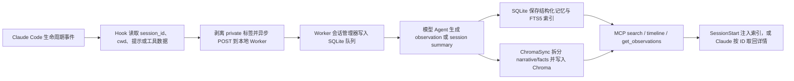

# claude-mem：面向 Claude Code 的本地会话记忆与压缩检索

> **项目快照**：官方仓库 <https://github.com/thedotmack/claude-mem>｜核验日期 2026-09-04｜Stars 93,146｜许可证 Apache-2.0｜最近维护：`main` 分支最新提交为 2026-09-03，提交内容为 README 更名说明；仓库仍保留 `claude-mem` 包名和 Claude Code 插件。[^project-repository][^project-license][^project-release]

> **需求画像**：目标是在开发者本地自动收集 Claude Code 的用户提示、工具调用、文件上下文和会话总结，在后续会话中按项目检索并注入历史经验。必须尽量保留开发过程的可追溯性，支持 Claude Code Hooks、SQLite/全文检索和可选向量检索；模型服务需要能够在公司 API、Anthropic、Gemini、OpenRouter 或 OpenAI-compatible 网关之间切换。部署基线是单机优先、数据默认本地保存，并允许团队后续自研“筛选并经用户确认上传完整原始会话”的流程；该上传流程不是本项目现成的硬约束。

## 1. 项目要解决什么问题

### 目标用户与使用场景

claude-mem 面向使用 Claude Code 或其他受支持开发 Agent 的个人开发者。它把一次会话中发生的工具操作、用户提示、代码探索和问题解决过程转化为可检索的长期上下文，让 Agent 在新会话、清空上下文或上下文压缩后仍能知道项目最近做过什么。官方将其描述为“跨会话持久化上下文”，并强调观察、压缩和重新注入三个动作。[^project-repository]

对本次试点而言，最相关的场景是：开发者完成一项任务后，系统在本地异步生成结构化观察和总结；下一次处理类似问题时，Claude 可以先查找历史索引，再取回具体事实。团队可以从这些观察中人工筛选高价值的失败模式、业务规则和 Skill 改进线索。

### 当前问题

第一，Claude Code 的上下文窗口是会话级的，跨会话不会天然保留项目历史。claude-mem 在 `SessionStart` 时把近期上下文以 `additionalContext` 的形式注入当前会话。[^hooks-architecture]

第二，直接把所有历史会话原文塞入新提示会造成上下文和费用浪费。项目的 MCP 搜索设计采用“索引、时间线、详情”三层渐进披露：先返回带 ID 的紧凑结果，再查看目标附近的时间线，最后只取选中的完整观察。官方文档给出的目标是减少无关 token，而不是每次加载全部历史。[^search-architecture]

第三，开发过程中的工具调用数量很大，其中一部分对经验沉淀没有价值。项目在 Hook 层支持跳过低价值工具，并把观察发送到本地 Worker 异步处理，使 Hook 不等待模型压缩完成。[^hooks-architecture]

第四，原始提示、工具输入和工具输出可能包含密钥或个人信息。项目提供 `<private>...</private>` 标签，并在 Hook 边缘和 Worker 存储前再次剥离；这是一种用户主动标记的本地保护机制，不等价于企业级数据分类或审批流程。[^hooks-architecture][^security-policy]

### 问题边界

claude-mem 主要解决“本地开发 Agent 过程的记忆、压缩、检索和重新注入”。它没有在开源核心中提供组织级成员目录、集中式审核工作流、会话上传审批、脱敏策略中心、Skill Pull Request 自动生成或企业权限模型。官方许可证说明中，Hosted Cloud、团队同步、企业功能、知识 Agent 和客户部署工具属于未随 Server v0.1 开源的保留区域。[^project-license]

它也不等于完整的项目知识库。观察是由模型根据开发过程生成的结构化记录，业务知识的准确性、冲突处理、版本归属和最终是否写入共享 Skill，仍需要团队额外治理。

## 2. 设计的核心思路

### 核心判断

claude-mem 的核心判断是：开发过程中的“观察”比未经整理的完整 transcript 更适合长期检索；把工具事件异步压缩为标题、叙事、事实、文件和概念，再通过渐进式检索交给 Agent，可以同时保留线索和控制上下文成本。[^architecture-overview][^search-architecture]

### 关键设计选择

- **用 Claude Code 生命周期 Hook 捕获事件**：`SessionStart` 注入历史，`UserPromptSubmit` 初始化会话并保存提示，`PreToolUse`（当前配置匹配 `Read`）提供文件上下文，`PostToolUse` 捕获工具观察，`Stop` 触发总结。事件通过统一的 `worker-service.cjs hook claude-code <event>` 分发。[^hooks-json][^configuration]
- **用本地 Worker 与 Hook 解耦**：Hook 进程只做输入读取、隐私标签剥离和本地 HTTP 调用；Worker 使用 Express API、Session Manager、数据库和模型 Agent 异步处理观察。官方架构强调 Hook 侧 fire-and-forget，避免模型处理阻塞开发会话。[^hooks-architecture]
- **结构化存储与全文检索优先**：SQLite 保存会话、提示、观察、总结和队列状态，开启 WAL；SQLite FTS5 负责关键词检索。这样即使向量服务不可用，历史索引和详情仍然可以工作。[^database-architecture][^search-architecture]
- **Chroma 作为可选语义检索层**：每条观察的 narrative 和每个 fact 被拆成独立文档写入项目集合，使用 Chroma MCP 完成向量化和相似度查询，结果再与 SQLite 结构化信息结合。[^architecture-overview][^chroma-sync]
- **MCP 工具本身只做协议翻译**：当前 MCP Server 暴露 `important_workflow`、`search`、`timeline`、`get_observations` 四个工具，业务逻辑集中在 Worker HTTP API；工具设计把渐进式披露写进调用流程。[^search-architecture]

### 代价与取舍

自动压缩降低了长期检索的 token 成本，但会引入模型摘要错误、遗漏上下文和“模型认为重要但团队认为不重要”的风险。claude-mem 保存了原始用户提示及结构化观察到本地 SQLite；它并没有把原始 transcript 自动变成经过人工确认的知识条目。[^hooks-architecture][^database-architecture]

本地 Chroma 采用 `uvx` 启动的 `chroma-mcp` 子进程和 ONNX embedding 模型，部署轻量但带来 Python/uv/ONNX 运行时、首次模型下载、跨平台兼容和进程回收问题。官方源码将 `all-MiniLM-L6-v2` 与 `onnxruntime>=1.20` 固定在 Chroma 启动路径；官方讨论也明确指出目前没有独立的嵌入模型配置项。[^chroma-manager][^embedding-customization]

调研判断：项目当前最适合个人本地连续使用和单机试点；如果要把二十名成员的经验汇聚到共享 Memory，需要补齐身份、项目隔离、上传审批、知识审核和集中存储，而不是直接把每个人的 `~/.claude-mem` 目录拼接起来。

## 3. 项目如何工作

### 工作流概览

### 阶段说明

| 阶段 | 接收什么 | 做什么 | 产生的状态或产物 | 证据 |
| --- | --- | --- | --- | --- |
| 生命周期捕获 | Claude Code 的 `session_id`、`cwd`、用户提示和工具事件 | Hook 按事件调用统一 Worker 命令；`PostToolUse` 可异步执行 | 会话初始化、提示记录、工具观察请求 | [^hooks-json][^configuration] |
| 边缘隐私处理 | 用户提示、`tool_input`、`tool_response` | 在发送和持久化前剥离 `<private>` 内容，并跳过配置中的低价值工具 | 可送入 Worker 的清理后事件 | [^hooks-architecture][^security-policy] |
| 会话排队 | 清理后的事件和会话 ID | Worker 通过本地 HTTP API 登记会话，把观察放入待处理状态 | `sdk_sessions`、`user_prompts`、`pending_messages` 行 | [^worker-service][^database-architecture] |
| 模型观察与总结 | 待处理工具事件、会话上下文 | 由 Claude Agent SDK 或可选 Gemini/OpenRouter 提供商异步生成 XML/结构化响应 | observation 的标题、叙事、事实、文件、概念，以及 session summary | [^hooks-architecture][^configuration] |
| 结构化持久化 | 模型生成结果 | 写入 SQLite；使用 FTS5 建立关键词检索字段和索引 | 本地 `claude-mem.db` 中的可追溯记录 | [^database-architecture] |
| 语义索引同步 | observation 的 narrative 和 facts | `ChromaSync` 将一个观察拆成多个文档并发送给 `chroma-mcp` | 项目对应的 Chroma collection 和向量文档 | [^chroma-sync][^chroma-manager] |
| 渐进式检索 | Claude 的自然语言查询、项目和类型过滤 | MCP Server 将调用翻译为 Worker HTTP 请求，先搜索索引，再取时间线和完整详情 | 紧凑索引、时间线、选中观察详情 | [^search-architecture] |
| 上下文注入 | 当前项目和启动事件 | `SessionStart` 查询近期总结/观察，格式化为 `additionalContext` | 新会话可见的历史索引 | [^hooks-architecture][^configuration] |

### 关键状态与产物

- **会话状态**：`sdk_sessions` 记录 Claude session、项目、状态、创建时间和完成时间；提示、观察和总结通过会话 ID 关联。项目要求使用 IDE 提供的 `session_id`，不自行生成替代 ID。[^database-architecture][^hooks-architecture]
- **用户提示**：`user_prompts` 保存原始用户提示的本地副本，使问题描述可以被全文检索。安全文档明确提醒，这些内容默认只写入本地，但后续模型压缩调用仍可能发送到所选供应商。[^hooks-architecture][^security-policy]
- **观察**：观察包含类型、标题、叙事、事实、文件和概念等结构化字段，并使用 `content_hash` 等字段辅助去重和更新；它是项目长期检索的主要颗粒度。[^architecture-overview][^database-architecture]
- **总结**：`session_summaries` 保存本次会话的请求、完成情况和学到的内容，SessionStart 会优先使用近期总结建立上下文索引。[^architecture-overview][^hooks-architecture]
- **全文索引**：SQLite FTS5 的虚拟表用于关键词检索，查询会转成安全的 FTS5 表达式；官方文档说明典型查询目标是毫秒级响应，但实际速度仍需按数据量和机器验证。[^search-architecture]
- **向量集合**：默认按项目生成 `cm__<project>` 形式的 Chroma 集合；一个 observation 的 narrative 和 facts 采用稳定 ID 分别写入，便于重试、更新和去重。[^chroma-sync]

### 最终输出

对开发者而言，最终输出有两种形态。第一种是新会话启动时注入的近期上下文索引，帮助 Claude 知道最近有哪些会话和观察；第二种是 MCP 搜索结果，Claude 根据索引 ID 取回时间线或完整观察，作为当前任务的参考。[^search-architecture][^hooks-architecture]

对 Skill 更新试点而言，完整观察可以作为人工复盘材料：团队成员先通过项目、日期、类型和关键词定位候选记录，再由负责人读取详情，判断是否形成业务知识、失败模式或 Skill 修改建议。项目本身不会自动完成“候选经验评审—Git 合并—回归验证”。

## 4. 与需求画像逐项对照

### 需求矩阵

| 需求项 | 优先级或硬约束 | 项目现有能力 | 证据 | 状态 | 说明 |
| --- | --- | --- | --- | --- | --- |
| 收集 Claude Code 开发会话 | 必须 | 通过 Setup、SessionStart、UserPromptSubmit、PreToolUse、PostToolUse、Stop Hook 采集生命周期事件 | [^hooks-json][^configuration] | 满足 | 默认采集的是提示、工具事件和结构化结果；是否保存 Claude Code 完整原始 transcript，需要结合额外 transcript watcher 或导出流程，项目主 Hook 流程本身不应直接等同于完整原始会话归档。 |
| 保留会话来源和项目归属 | 必须 | 使用 IDE 提供的 `session_id`，SQLite 记录项目、会话和子记录关联 | [^hooks-architecture][^database-architecture] | 满足 | 适合作为后续候选经验的来源 ID；跨成员集中汇聚时还需要成员身份和仓库版本字段。 |
| 异步处理，不阻塞开发 | 必须 | Hook 通过本地 HTTP fire-and-forget，Worker 异步调用模型和写库 | [^hooks-architecture] | 满足 | Hook 仍有超时和 Worker 可用性边界；需要在试点中验证极端冷启动和模型限流。 |
| 结构化提取开发经验 | 必须 | 由模型生成 observation、facts、narrative、文件和 session summary | [^architecture-overview][^hooks-architecture] | 满足 | 结构化结果可供人工筛选，但准确性和知识治理不由项目保证。 |
| SQLite 本地持久化 | 必须 | `~/.claude-mem/claude-mem.db`，SQLite WAL + FTS5 | [^database-architecture] | 满足 | 默认单用户本地数据目录；共享服务需要另行设计隔离和备份。 |
| 关键词检索 | 必须 | Worker 通过 SQLite FTS5 查询观察索引 | [^search-architecture] | 满足 | Chroma 不可用时仍可使用。 |
| 向量语义检索 | 期望 | ChromaSync 调用本地或远程 Chroma MCP；默认使用 chroma-mcp 内置 ONNX embedding | [^chroma-sync][^chroma-manager] | 部分满足 | 语义检索需要 Python/uv/chroma-mcp 和模型初始化；当前官方没有独立嵌入模型/Provider 配置，不能直接切换到公司的 Embedding API。 |
| 生成模型 API 可切换 | 必须 | `CLAUDE_MEM_PROVIDER` 支持 Claude、Gemini、OpenRouter；OpenRouter 当前源码支持自定义 OpenAI-compatible base URL | [^configuration][^openrouter-provider] | 满足 | 公司 API 或 DeepSeek 可通过 Anthropic-compatible/LiteLLM 网关，或 OpenAI-compatible 的 OpenRouter provider base URL 接入；需要验证响应格式、模型能力和费用。 |
| Embedding 模型 API 可切换 | 必须 | 配置中没有 `CLAUDE_MEM_EMBED_*` 设置；默认 Chroma 路径使用 `all-MiniLM-L6-v2` ONNX | [^chroma-manager][^embedding-customization] | 不满足 | 可关闭 Chroma 使用 SQLite FTS5；要用公司或 DeepSeek 的向量模型，需要修改/替换 chroma-mcp embedding backend，并保证建库和查询使用同一维度与模型。 |
| 支持多个 Agent | 期望 | 仓库包含 Claude Code、Codex、Cursor、OpenCode、OpenClaw 等适配/Hook 路径 | [^project-repository][^configuration] | 部分满足 | Claude Code 路径最完整；不同 Agent 的事件语义和 transcript 结构不同，团队仍需统一事件模型和适配器。 |
| 本地隐私控制 | 必须 | 状态文件写入本地目录、Worker 默认绑定 127.0.0.1，支持 `<private>` 标签 | [^security-policy][^hooks-architecture] | 满足 | 项目不主动上传本地状态，但模型供应商调用会发送被压缩的提示/观察；私有标签依赖用户正确标记。 |
| 用户确认后上传完整原始会话 | 期望 | 提供本地数据、搜索和导出/导入相关能力，但没有组织级审批上传流 | [^project-license][^worker-service] | 部分满足 | 可以把本地搜索结果作为候选，再自行增加确认、打包、脱敏和上传；该流程不是开源核心现成功能。 |
| 单机部署 | 必须 | `npx claude-mem install` 本地安装 Node/Bun/uv 相关运行时、Worker、SQLite 和可选 Chroma MCP | [^installation][^project-repository] | 满足 | 个人路径不需要 Postgres/Redis；启用 server-beta 团队服务则会引入 Postgres、Valkey 和多个容器，不属于最小个人部署。 |
| 经验可追溯到原始会话 | 必须 | 观察和总结有 session/observation ID，并可按 ID 取回详情 | [^database-architecture][^search-architecture] | 部分满足 | 能追溯到 claude-mem 保存的事件和观察；若要求审计级完整原文、代码快照和提交版本，需要补充原始 transcript 与 Git 元数据。 |
| 直接更新 Skill 并自动发布 | 期望 | 未提供自动生成候选 PR 或发布机制 | [^project-license][^project-repository] | 不满足 | 适合把观察作为证据输入，Skill 修改仍应走人工评审和 Git 验证闭环。 |

### 对照归纳

claude-mem 对“个人本地会话持续收集、压缩、检索和启动时注入”匹配度高，尤其适合快速验证开发过程是否能沉淀为可检索观察。它的主要硬约束缺口是 Embedding API 无法通过正式配置直接切换，以及完整原始会话归档、团队共享和审核上传不在开源核心中。

如果试点先接受 SQLite FTS5，并把 Chroma 作为可选增强，项目可以在单机上快速启动。若要求从第一天就使用公司的向量模型，则需要把 Chroma embedding provider 适配列为 POC 工作项，不能把当前默认 ONNX 模型描述成可配置能力。

## 5. 开源与能力边界

### 边界清单

| 能力 | 开源核心 | 商业版或 SaaS | 外部依赖 | 证据 |
| --- | --- | --- | --- | --- |
| Claude Code 插件、Hook、Worker、SQLite、MCP 工具 | 有，Apache-2.0 | 无需商业版即可运行个人本地路径 | Claude Code 插件机制、Node/Bun、SQLite | [^project-license][^hooks-json] |
| 本地结构化观察与会话总结 | 有 | 无需商业版 | Claude Agent SDK 或可选 Gemini/OpenRouter API | [^hooks-architecture][^configuration] |
| SQLite FTS5 搜索 | 有 | 无需商业版 | Bun SQLite | [^database-architecture][^search-architecture] |
| Chroma 向量索引 | 有 | 无需商业版 | `chroma-mcp`、Python/uv、ONNX Runtime 和本地模型 | [^chroma-manager][^security-policy] |
| Embedding 模型替换 | 未确认/当前无正式配置 | 未确认 | 需要自行改造 chroma-mcp 或替换向量层 | [^embedding-customization] |
| Claude、Gemini、OpenRouter 生成提供商 | 有 | Hosted/CMEM Pro 是可选服务 | 对应供应商凭据和网络 | [^configuration][^project-repository] |
| OpenAI-compatible 自定义生成端点 | 有，走当前 OpenRouter provider 的 base URL | 未确认 | 公司网关、DeepSeek、LM Studio、LiteLLM 等 | [^openrouter-provider][^configuration] |
| 本地 Web Viewer、HTTP API、MCP 检索 | 有 | Hosted Server/团队服务另行区分 | 本地 Worker | [^worker-service][^project-license] |
| Cloud Sync、团队共享、企业功能 | 开源核心不包含或边界未开放 | 由官方 Hosted/Pro 方向提供，开源许可证页明确列为保留区域 | cmem.ai 等外部服务 | [^project-license][^project-repository] |
| 个人上传审批、脱敏审计、Skill PR 自动化 | 无 | 未确认 | 需要自研组织治理层和 Git 集成 | [^project-license] |

### 边界判断

Apache-2.0 覆盖开源核心代码，但不代表官方 Hosted/Pro 的团队同步、企业权限和托管能力都包含在本地安装包中。试点如果只使用个人本地插件，可以把代码、Hook、Worker、SQLite、MCP 和 Chroma 作为可审查的开源组件；如果要集中管理多个成员，应把官方 Server-beta 与云端功能单独评估，不能从个人模式直接推导出组织能力。[^project-license]

生成模型切换和 Embedding 模型切换是两个不同边界。当前源码允许通过提供商设置改变“观察压缩/总结”调用；但 Chroma 的向量生成由 `chroma-mcp` 的 embedding function 决定，源码固定依赖 `all-MiniLM-L6-v2` 的 ONNX 运行路径，官方讨论仍把可配置 Embedding 列为缺失能力。[^configuration][^chroma-manager][^embedding-customization]

## 6. 用户如何接入和使用

### 接入前提

- Claude Code 需要支持插件和生命周期 Hook；仓库也提供 Cursor、Codex、OpenCode 等其他适配路径，但本报告以 Claude Code 主路径为准。[^project-repository][^configuration]
- 个人安装路径需要 Node.js 20+、Bun、uv 和 SQLite；官方 README 说明 Bun 和 uv 可由安装器处理，SQLite 随运行时使用。[^project-repository]
- 至少需要一个生成/压缩模型提供商：Claude subscription/API/gateway、Gemini API 或 OpenRouter；如果使用 Claude gateway，可设置 `ANTHROPIC_BASE_URL` 和 `ANTHROPIC_AUTH_TOKEN`。[^configuration]
- 如果开启默认 Chroma 语义检索，还需要能够运行 `uvx chroma-mcp==0.2.6`，并允许首次下载 ONNX 模型和 Python 依赖。[^chroma-manager]

### 接入过程

1. **安装插件和本地依赖**：运行 `npx claude-mem install`，或在 Claude Code 中添加官方 Marketplace 并安装 `claude-mem`。安装器写入 Hook 配置、数据目录和 Worker 启动信息。[^project-repository][^installation]
2. **选择生成模型提供商**：在 `~/.claude-mem/settings.json` 设置 `CLAUDE_MEM_PROVIDER` 及对应 API Key/模型。公司 Anthropic-compatible 网关可沿 Claude SDK 路径配置；DeepSeek 或其他 OpenAI-compatible 服务可配置 OpenRouter provider 的自定义 base URL、API Key 和模型名。[^configuration][^openrouter-provider]
3. **确认本地目录和端口**：默认数据根为 `~/.claude-mem`，Worker 默认绑定 `127.0.0.1`，端口为每用户计算的默认端口，也可通过 `CLAUDE_MEM_WORKER_PORT` 覆盖。[^configuration][^worker-service]
4. **验证 Hook 和 Worker**：重启 Claude Code，检查 Worker 健康状态和本地数据库；官方提供 `worker:status`、`worker:logs`、上下文 Hook 测试和 SQLite 查询示例。[^troubleshooting][^getting-started]
5. **决定向量路径**：初次试点可以保留 Chroma 默认配置；如遇平台、启动或资源问题，可设置 `CLAUDE_MEM_CHROMA_ENABLED=false`，只使用 SQLite + FTS5，并把语义检索适配作为后续工作。[^settings-source][^chroma-issues]

### 日常使用方式

正常开发时用户不需要手动提交每条记录。Hook 会在会话开始时注入近期上下文，在用户提交提示时登记会话，在工具执行后异步生成观察，在 Stop 时生成总结。Claude 需要检索历史时，使用 MCP 的 `search` 获取紧凑索引，再使用 `timeline` 和 `get_observations` 读取必要详情。[^hooks-architecture][^search-architecture]

团队如果要服务 Skill 更新，可以约定每周从 Viewer 或 MCP 搜索中挑选高价值记录：例如同一测试错误反复出现、用户纠正了业务规则、Agent 多次绕过某个 Skill，或者某次修复形成了可复用的验证步骤。人工评审时保存 observation ID、项目、时间和必要上下文，再生成 Skill 候选变更。

### 接入限制

当前 Hook 采集的是事件和结构化观察链，并非一个带权限审批的原始 transcript 归档系统。若团队要求“用户主动选择某一个完整开发会话后才上传”，需要增加本地 Viewer/CLI 导出、确认页、脱敏检查、压缩打包和上传 API；项目现有本地存储可以作为来源，但不会自动提供这条治理链。

Embedding 也不能只通过 `CLAUDE_MEM_PROVIDER` 切换。生成模型可以使用 DeepSeek 等 OpenAI-compatible API，而向量模型仍由 Chroma MCP 默认的本地 ONNX embedding function 负责；要接公司 Embedding API，需要修改 Chroma MCP 启动参数和 collection 创建/读取路径，并统一旧向量重建策略。[^embedding-customization][^chroma-manager]

## 7. 部署构成

### 运行组件

| 组件 | 必需或可选 | 职责 | 持久化数据 | 与其他组件的关系 | 证据 |
| --- | --- | --- | --- | --- | --- |
| Claude Code 插件 Hook | 必需（Claude Code 模式） | 接收生命周期事件，启动 Worker，注入上下文和转发观察 | Hook 配置在 Claude 配置/插件目录 | 调用本地 Worker HTTP 或 Worker 命令 | [^hooks-json][^configuration] |
| Node.js/Bun Worker Service | 必需 | Express HTTP API、会话管理、模型 Agent、搜索、Viewer、进程管理 | PID、日志、运行状态；业务数据落 SQLite/Chroma | 被 Hook、MCP Server 和 Viewer 调用 | [^worker-service][^project-repository] |
| SQLite 3 + FTS5 | 必需 | 保存 sessions、prompts、observations、summaries 和全文索引 | `~/.claude-mem/claude-mem.db` | Worker 读写；MCP 搜索通过 Worker 查询 | [^database-architecture][^search-architecture] |
| 模型提供商 | 必需 | 压缩观察、生成总结、抽取结构化字段 | 项目本地保存配置；供应商侧是否留存取决于其政策 | Worker 通过 Claude SDK、Gemini 或 OpenRouter 调用 | [^configuration][^security-policy] |
| `uvx` + `chroma-mcp` | 可选但默认启用语义层 | 通过 MCP stdio 提供 Chroma collection、写入和查询 | `~/.claude-mem/chroma/` 及 Chroma SQLite | ChromaSync 由 Worker 调用 | [^chroma-manager][^architecture-overview] |
| ONNX Runtime + `all-MiniLM-L6-v2` | Chroma 启用时必需 | 默认本地 Embedding 计算 | uv/Chroma 缓存和向量数据目录 | 被 chroma-mcp 加载，生成向量 | [^chroma-manager][^embedding-customization] |
| MCP Server | Claude Code 插件路径中必需 | 以 stdio 暴露 `search`、`timeline`、`get_observations` | 无独立业务存储 | 把 MCP JSON-RPC 翻译为 Worker HTTP API | [^search-architecture] |
| Web Viewer | 可选 | 查看实时记忆流、观察、总结、项目和日志 | 无独立业务存储 | 由 Worker 在本地端口提供 | [^worker-service][^project-repository] |
| Postgres + Valkey/BullMQ Server-beta | 可选，团队服务路径 | 多用户 Server-beta 的集中存储和生成队列 | Postgres、Valkey 数据卷 | Docker Compose 中由 Server/Worker 分离使用 | [^docker-compose][^server-vision] |

### 最小部署路径

个人 Claude Code 路径的最小组合是：Claude Code 插件 Hook + Node.js/Bun Worker + SQLite + 一个可用的生成模型提供商。`npx claude-mem install` 会负责插件安装和依赖准备，数据默认写在本机用户目录；MCP Server 随插件接入，Worker 通过本地端口提供 HTTP API。[^installation][^project-repository]

保留默认 Chroma 时，最小路径还需由 Worker 用 `uvx` 启动 `chroma-mcp==0.2.6`，使用持久化 Chroma 数据目录和默认 ONNX 模型。关闭 `CLAUDE_MEM_CHROMA_ENABLED` 后，SQLite + FTS5 仍提供关键词搜索、时间线和详情查询，但会失去语义向量检索。[^chroma-manager][^chroma-issues]

官方 `docker-compose.yml` 描述的是 Server-beta 团队部署，而不是个人安装的最短路径。它包含 Postgres、Valkey、HTTP Server 和 BullMQ Worker，并明确关闭 Chroma；因此不能用该 Compose 文件代表单机个人模式的依赖量。[^docker-compose]

### 生产化仍需考虑

- **数据隔离与备份**：每位成员默认拥有自己的 `~/.claude-mem` 数据目录；如果集中部署，应设计项目/成员租户、备份、恢复、删除和数据保留策略。官方本地模式没有组织级鉴权。[^security-policy][^worker-service]
- **原始会话上传审批**：需要新增候选发现、用户确认、隐私扫描、文件打包、授权上传、审计记录和失败重试；不能把模型调用或 Cloud Sync 当作用户审批的替代品。[^project-license][^security-policy]
- **Embedding 资源和模型一致性**：官方未给出完整资源预算，需实测首次 ONNX 模型下载、Python 启动、批量写入、向量库增长和多项目并发；更换模型时必须重建或隔离 collection，不能混用不同维度的向量。[^embedding-customization][^chroma-issues]
- **跨平台运行**：官方 Issue 记录过 Windows、macOS arm64 和 Python/ONNX 运行时问题；试点应至少在团队主流操作系统上验证冷启动、Hook 超时和 Chroma 进程清理。[^chroma-issues][^chroma-windows]
- **模型数据外发**：本地状态文件不由项目主动上传，但 Claude、Gemini、OpenRouter 或自定义网关会收到用于观察压缩的提示/上下文；公司 API 网关需要明确日志、保留和脱敏政策。[^security-policy]
- **Worker 可用性**：默认本地 HTTP 没有认证，Worker 默认只监听回环地址；若改成远程 Chroma 或 Server-beta，应补充 TLS、鉴权、网络隔离和密钥管理。[^security-policy][^worker-service]

## 8. 适配结论与能力缺口

### 适配结论

**条件匹配。**

claude-mem 直接满足个人 Claude Code 会话事件采集、本地 SQLite 持久化、结构化观察、异步压缩、MCP 检索和启动时上下文注入；它也提供多 Agent 适配方向，并允许生成模型通过 Claude、Gemini、OpenRouter 或 OpenAI-compatible 网关切换。[^hooks-architecture][^configuration][^openrouter-provider]

但本次目标还要求关注团队会话沉淀、Embedding API 切换、完整原始会话可追溯和用户确认上传。向量 Embedding 当前固定在 chroma-mcp 的本地 `all-MiniLM-L6-v2` ONNX 路径，生成模型的 API 切换不能解决这一问题；团队共享、审批上传和 Skill 自动更新也需要外部治理层。因此不能给出“直接匹配”。[^chroma-manager][^embedding-customization][^project-license]

### 已满足能力

- 通过 Claude Code 生命周期 Hook 自动收集用户提示、工具事件、会话开始/结束和文件读取上下文，并使用原始 `session_id` 关联记录。[^hooks-json][^hooks-architecture]
- 通过 Worker 异步调用模型，生成可检索的 observation 和 session summary，减少 Hook 对开发会话的阻塞。[^hooks-architecture]
- 通过 SQLite + FTS5 提供可靠的本地关键词搜索；Chroma 失败时可以保留这条降级路径。[^database-architecture][^chroma-issues]
- 通过 MCP 三层渐进式披露控制检索粒度，适合让 Agent 先筛选经验，再读取完整细节。[^search-architecture]
- 默认本地存储、回环监听和 `<private>` 标签为个人试点提供了可操作的隐私起点。[^security-policy][^hooks-architecture]
- 生成/压缩模型支持 Claude、Gemini、OpenRouter，当前源码还允许 OpenRouter provider 指向自定义 OpenAI-compatible base URL，可覆盖公司网关和 DeepSeek 等服务。[^configuration][^openrouter-provider]

### 能力缺口

- **Embedding 模型和 API 无正式配置入口**：当前默认是 `all-MiniLM-L6-v2` ONNX；没有官方 `CLAUDE_MEM_EMBED_PROVIDER`、模型、维度和 API Base URL 设置。对中文业务知识或公司 Embedding API，召回质量和合规性都需要额外验证。[^chroma-manager][^embedding-customization]
- **完整原始会话归档不是主数据模型**：SQLite 保存原始提示和结构化观察，但团队若要求可回放的完整 Claude transcript、工具原始输入输出、代码快照和 Git commit 关联，需要补充本地 transcript 导入/导出适配器。[^hooks-architecture][^database-architecture]
- **缺少多人共享治理**：本地数据目录和 Worker 是单用户思路；没有开源核心级的成员、项目权限、审批、租户隔离和统一删除策略。[^security-policy][^project-license]
- **缺少 Skill 更新闭环**：观察可以提供证据，但项目不会自动判断 Skill 缺口、生成候选 Patch、创建 PR 或执行回归任务。需要由团队的 Skill 仓库和评审流程承接。[^project-license]
- **Chroma 运维稳定性需要实测**：`uvx`、Python、ONNX 首次冷启动和跨平台进程生命周期可能影响 Hook 体验；官方 Issue 已记录语义搜索失败时回退 FTS 的情况。[^chroma-issues][^chroma-windows]

### 需要自研或外部补齐

- 增加一个 Claude Code transcript 适配器，把本地会话转换为统一事件模型，并在会话结束时生成“可由用户选择上传”的完整会话包；包中至少应含 session ID、项目、时间、Agent、工具事件、Git 状态和原始内容。
- 在 claude-mem 本地目录上增加候选浏览和用户确认层：用户先按项目/时间/类型筛选，再显式确认导出；上传服务负责鉴权、审计、版本、保留期和成员隔离。
- 评估两条 Embedding 路径：短期关闭 Chroma 使用 FTS5，或为 chroma-mcp/ChromaSync 增加公司 OpenAI-compatible Embedding provider，并为模型/维度变更提供重建索引命令。
- 将 observation ID 和原始会话 ID接入 Skill 更新工作流：人工选择证据，生成带来源的候选 Skill 修改，通过 Git PR 评审并用固定任务或测试验证。
- 若要集中服务多人，单独评估 Server-beta 的 Postgres、Valkey、API Key、队列和容器部署；不要把个人本地 Worker 直接暴露到内网作为共享平台。[^docker-compose][^server-vision]

### 否决风险

- 如果 Embedding API 切换是第一阶段的硬性要求，当前开源实现存在硬性缺口：需要先完成 chroma-mcp 适配，否则只能使用本地默认 ONNX 或关闭语义检索。[^embedding-customization]
- 如果公司要求原始会话永不离开开发者机器，必须禁用会把上下文发送给外部模型提供商的路径，并使用公司内网模型或离线模型；项目自身的本地存储并不能阻止上游模型调用外发。[^security-policy]
- 如果目标是立即集中管理全组成员的完整会话并提供权限审计，个人插件模式不应直接作为最终系统；应先把它定位为本地采集端，再配套集中接收和治理服务。[^project-license][^docker-compose]

当前未发现阻止个人单机 POC 的其他硬性否决项。推荐的第一步是：先用 SQLite + FTS5 跑通一名开发者的 Claude Code Hook 收集和人工经验筛选，再单独验证 Chroma 默认 Embedding 与公司 Embedding API 的差异，最后决定是否把原始会话上传层接在 claude-mem 之上。

---

[^project-repository]: [claude-mem 官方 GitHub 仓库](https://github.com/thedotmack/claude-mem)
[^project-license]: [官方许可证说明与开源/商业边界](https://github.com/thedotmack/claude-mem/blob/main/docs/license.md)
[^project-release]: [官方仓库最新提交记录](https://github.com/thedotmack/claude-mem/commits/main/)
[^hooks-json]: [Claude Code 官方 Hook 配置](https://raw.githubusercontent.com/thedotmack/claude-mem/main/plugin/hooks/hooks.json)
[^configuration]: [官方配置文档](https://github.com/thedotmack/claude-mem/blob/main/docs/public/configuration.mdx)
[^hooks-architecture]: [官方 Hook 生命周期与架构文档](https://docs.claude-mem.ai/architecture/hooks)
[^search-architecture]: [官方搜索架构与 MCP 三层检索文档](https://docs.claude-mem.ai/architecture/search-architecture)
[^architecture-overview]: [官方架构总览](https://github.com/thedotmack/claude-mem/blob/main/docs/architecture-overview.md)
[^database-architecture]: [官方 SQLite/FTS5 数据库架构文档](https://docs.claude-mem.ai/architecture/database)
[^worker-service]: [官方 Worker Service 文档](https://docs.claude-mem.ai/architecture/worker-service)
[^chroma-sync]: [官方 ChromaSync 源码](https://raw.githubusercontent.com/thedotmack/claude-mem/main/src/services/sync/ChromaSync.ts)
[^chroma-manager]: [官方 Chroma MCP 管理器源码（含默认模型和运行时依赖）](https://raw.githubusercontent.com/thedotmack/claude-mem/main/src/services/sync/ChromaMcpManager.ts)
[^settings-source]: [官方设置默认值源码](https://raw.githubusercontent.com/thedotmack/claude-mem/main/src/shared/SettingsDefaultsManager.ts)
[^openrouter-provider]: [官方 OpenRouter/OpenAI-compatible Provider 源码](https://raw.githubusercontent.com/thedotmack/claude-mem/main/src/services/worker/OpenRouterProvider.ts)
[^embedding-customization]: [官方讨论：Embedding function 尚无可配置入口](https://github.com/thedotmack/claude-mem/discussions/3030)
[^security-policy]: [官方安全策略、数据存储与隐私说明](https://github.com/thedotmack/claude-mem/security)
[^installation]: [官方安装文档](https://docs.claude-mem.ai/installation)
[^getting-started]: [官方快速开始与本地数据查询示例](https://docs.claude-mem.ai/usage/getting-started)
[^troubleshooting]: [官方故障排查文档](https://github.com/thedotmack/claude-mem/blob/main/docs/public/troubleshooting.mdx)
[^chroma-issues]: [官方 Issue：Chroma/ONNX 运行失败时回退 SQLite FTS](https://github.com/thedotmack/claude-mem/issues/2371)
[^chroma-windows]: [官方 Issue：Windows 上 Chroma MCP 语义检索问题](https://github.com/thedotmack/claude-mem/issues/1225)
[^docker-compose]: [官方 Server-beta Docker Compose 部署清单](https://raw.githubusercontent.com/thedotmack/claude-mem/main/docker-compose.yml)
[^server-vision]: [官方 Server 架构与团队部署说明](https://github.com/thedotmack/claude-mem/blob/main/docs/server-architecture-and-team-vision.md)
