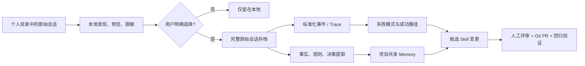

# AI 开发会话与 Memory 开源项目调研

> 面向“用真实开发会话持续改进 Skill”的内部技术分享。项目资料与 Stars 快照核验于 2026-09-03；Stars 会持续变化，本文更看重实现机制、开源边界和试点适配度。

## 先给结论

目前不存在一个成熟开源项目，可以同时完成“扫描员工本地 Claude Code / Codex / Cursor 历史会话、用户逐条预览确认、上传完整原始会话、跨会话分析、提炼业务 Memory、生成候选 Skill 并走 Git 审批”。但已有项目恰好覆盖了这条链路的不同部分，适合组合验证。本页汇总当前目录中的 10 个主清单 Memory 项目、1 个 Memory 边界案例，以及 10 个主清单会话项目、1 个会话边界案例；各项目的证据和限制以对应报告为准。

最重要的架构判断是：**原始会话、Memory、Skill 是三种不同资产，不能互相替代。**

- 原始会话是不可变证据：保留 prompt、response、tool call、文件修改、测试结果及 Agent/模型版本。
- Memory 是经提取和治理的知识：业务术语、规则、决策、约束及其来源和有效期。
- Skill 是经过验证的操作规程：触发条件、步骤、工具、边界、反例和验收方式，最终仍应由人审后合入 Git。



在本次候选中：

- **最贴近原始开发会话采集**：Entire CLI；它把完整 Agent 会话做成与 Git commit 双向关联的 checkpoint。
- **最贴近现有 Claude Code 快速试点**：Cognee；已有 Claude Code 生命周期 Hook，可直接验证“会话 → 知识图”。
- **最适合时序业务知识**：Graphiti；保留 Episode 来源、事实有效期和冲突失效关系。
- **最贴近“经验 → Skill”数据模型**：EverOS 与 MemU；前者把事实源和 Skill 文件化，后者把记忆写作交给宿主 Agent。
- **最成熟的中央评审分析**：Langfuse；session replay、人工评分、数据集和 eval 较完整，但单机部署最重。
- **最轻的中央 Trace 后端**：Phoenix；单进程 SQLite 即可起步，但许可证是 ELv2。

Memory 报告见 [[Memory/index|Memory 项目索引]]，个人会话收集报告见 [[个人会话收集/index|个人会话收集项目索引]]。下文按“项目解决的问题 → Memory/会话实现 → 适配与边界”重组，逐项目事实以对应报告为准。

本轮还为 10 篇主清单 Memory 报告和 1 篇边界案例报告补充了统一的“Memory 实现方式”小节，并保留“向量化与模型接口核验”及 Memory 索引速查表，明确 Embedding 是否必需、官方示例模型、向量后端、OpenAI-compatible/DeepSeek 兼容条件以及更换模型后的重建索引要求。

## 汇总范围与阅读方法

本汇总只保留能从对应项目报告追溯到官方仓库、文档或源码的事实。适配结论是面向本目录需求的静态判断，不是项目排名；“Memory”指经过提取、组织和召回的知识，“会话采集”指原始消息、工具调用、代码变更或执行轨迹的记录。

## 先理解 Claude Code 已经提供的采集入口

Claude Code 会把本地会话以纯文本 JSONL 保存到 `~/.claude/projects/`，内容包括消息和工具调用结果；因此“完整原始会话”并不是从零构造，而是需要做发现、预览、选择、脱敏、上传和权限治理。`SessionEnd` Hook 还会给出 `session_id`、`transcript_path`、工作目录和结束原因，适合作为本地候选上传器的触发点。[^claude-code-sessions][^claude-code-hooks]

Claude Code 也能直接输出 OpenTelemetry traces。内容字段默认收敛，可显式开启用户 prompt、assistant response、tool details、tool content 和 raw API body。这更适合新会话的统一观测，但 OTLP 是标准化视图，不能天然替代原始 JSONL 存档。[^claude-code-otel]

| 路径 | 优势 | 局限 | 适合用途 |
| --- | --- | --- | --- |
| 直接读取本地 JSONL | 信息最完整，可回放、可重解析 | 与 Agent 私有格式耦合，隐私风险最高 | 用户选择后的原始证据存档 |
| `SessionEnd` Hook | 自动得到明确的会话文件路径 | 仍需自己做预览、同意和上传 UI | 新会话候选队列 |
| OTLP / OpenTelemetry | 跨 Agent、跨平台、可扇出到多个后端 | 属性语义可能丢失，完整内容默认关闭 | 聚合分析、指标、评测 |

OpenInference 在 OpenTelemetry 上定义了 LLM、Agent、Tool、Retriever、Evaluator 等 span 语义，是 Phoenix 等平台的共同接口；但 OpenTelemetry GenAI Agent 语义约定目前仍处于 Development 阶段，因此跨 Agent 接入仍要保留自己的规范化层。[^openinference-spec][^otel-genai-agent]

## 第一类：Memory 与业务知识项目

### 项目索引

Memory 项目按“事实 API → 时序图谱 → 文件化/运行时 Memory → 受控 Profile → 检索底座”的认知顺序展开；每个项目小节都明确其写入、组织、召回/更新方式和外部缺口。

### 1. Mem0：成熟的通用 Memory API


图片来源：Mem0 官方仓库。[^mem0-readme]

Mem0 的核心定位是把消息提炼成可检索的长期事实，而不是保存完整 Agent 开发轨迹。当前 OSS 数据流大致为：`add(messages)` → LLM 提取事实 → 实体与 Embedding 生成 → 写入向量存储及历史记录 → `search` 进行语义、BM25、实体匹配与融合排序。新算法以 ADD-only 自动提取为主，避免模型擅自覆盖或删除旧事实；人工 API 仍可更新、删除。核心编排在 `mem0/memory/main.py`，Provider 工厂在 `mem0/utils/factory.py`。[^mem0-readme][^mem0-core]

它用 `user_id`、`agent_id`、`run_id` 表示作用域，适合映射员工、Agent 和会话。SDK 的 LLM、Embedding 与向量库分别可配，Provider Factory 包含 DeepSeek、Ollama、vLLM、LiteLLM 等；但官方 Self-hosted Server 镜像默认只打包有限的 LLM / Embedder Provider。DeepSeek、LiteLLM 或公司 OpenAI-compatible 网关要在 PoC 中验证，必要时扩展 Server 白名单、加入依赖并重建镜像。官方 Server Compose 是 FastAPI、PostgreSQL/pgvector 和 Dashboard 三个服务，一台服务器可承载。[^mem0-config][^mem0-server-providers][^mem0-compose]

**对本目标的静态结论：推荐作为通用 Memory 服务基线，但不能单独承担 Skill 更新。** 它缺少完整开发会话结构、业务知识审批和“重复问题 → 候选规则 → 回归验证”模型。还要注意，Mem0 托管平台包含 OSS SDK 没有的专有优化，当前平台 Graph Memory 不应直接当成 OSS 自部署能力。[^mem0-migration]

### 2. Graphiti：带时间和来源的业务知识图


图片来源：Graphiti 官方仓库。[^graphiti-readme]

Graphiti 把每份原始输入保存为 `EpisodicNode`，再抽取 `EntityNode` 与表示事实的 `EntityEdge`。边记录来源 Episode，以及 `valid_at`、`invalid_at`、`expired_at`；新规则与旧规则冲突时，旧事实被标记失效而不是直接删除。查询同时使用向量、全文、图遍历和重排。关键实现位于 `graphiti_core/graphiti.py`、`nodes.py`、`edges.py` 与 `search/`。[^graphiti-readme][^graphiti-core][^graphiti-search]

`group_id` 可映射项目或团队；Neo4j、FalkorDB 是常用自部署后端。`OpenAIGenericClient` 支持 DeepSeek、Ollama、vLLM、llama.cpp、LM Studio 和公司兼容端点，但结构化抽取质量高度依赖模型 JSON 输出能力。[^graphiti-provider]

**对本目标的静态结论：业务术语、规则、决策和需求变更的首选。** 它能回答“这条规则来自哪次会话、何时生效、后来被什么替代”，但不负责采集完整开发会话，也没有 ACL、候选 Skill 或 Git 审批，需要外层补齐。另需区分 Graphiti OSS 与当前 Zep 托管产品：Zep Community Edition 已进入 legacy，不应作为现行自部署候选。[^zep-boundary]

### 3. Cognee：现成 Claude Code 生命周期接入


图片来源：Cognee 官方仓库。[^cognee-repo]

Cognee 用 Pipeline 和 Task 组织 `remember/add`、分类、切块、实体关系抽取、图构建、向量/摘要生成，再通过 `recall/search` 做向量、图和全文检索。DataPoint 将图节点与向量表示连接起来，Dataset / NodeSet 可承载项目级范围。核心入口包括 `add.py`、`cognify.py` 和 `search.py`。[^cognee-cognify]

它最值得本试点关注的是官方 Claude Code 集成：通过 `SessionStart`、`UserPromptSubmit`、`PostToolUse`、`Stop`、`PreCompact`、`SessionEnd` Hooks 收集 prompt、工具轨迹与回答，再同步到长期知识图。模型层以 LiteLLM 为主要抽象，适合切换公司 API 和 DeepSeek。[^cognee-claude][^cognee-llm]

默认可用 SQLite、LanceDB、Kuzu/Ladybug 在一个容器内起步；团队版可增加 Postgres、Neo4j、Redis、MCP 与前端。需要注意：官方所示“全部 Memory 层落单 PostgreSQL”的 OSS Graph Store 目前定位为 demo，production-ready 版本属于授权产品；若坚持纯 OSS 生产路线，应优先评估 Neo4j 等图原生后端。官方 Compose 给 Cognee 设定 4 CPU / 8 GB 限制，仍在单机范围内。[^cognee-storage][^cognee-compose]

**对本目标的静态结论：最快验证“Claude Code 会话 → 项目知识”的候选。** 它默认产物仍是知识图，不是受治理的 Skill；必须保留原始会话引用，并为候选经验增加支持次数、反例、适用边界和人工状态，否则临时对话会污染业务知识。

### 4. Letta Code：Memory 是可编辑、可版本化的工作区

历史 `letta-ai/letta` 仓库已有 24,569 Stars，但现在主要是入口页；活跃源码迁移到 `letta-ai/letta-code`，后者 3,190 Stars。不能再用旧 Letta Server 的 PostgreSQL/pgvector Compose 描述当前架构。[^letta-repo][^letta-code]

Letta Code 本地模式内嵌有状态 Agent Server，把 Agent、Conversation、Provider、Secret 存在 `~/.letta/lc-local-backend`。默认 Memory Block 模板从内嵌 MDX 加载；启用 MemFS 后，Agent 的 memory workspace 由 Git 跟踪，可 diff、commit、查看历史与同步远端。二者是不同机制，不能把所有运行时 Memory Block 都等同于 Markdown 文件；`skills/` 可以与 Git memory workspace 共存。关键源码是 `src/agent/memory.ts` 与 `memory-git.ts`。[^letta-memory][^letta-memory-git]

本地只需 Node.js 进程和文件存储；也可以运行 Local Backend App Server 供远端客户端连接，不依赖独立数据库。Provider 注册表包含原生 DeepSeek 和 OpenAI-compatible Base URL。[^letta-agent-sdk][^letta-provider]

**对本目标的静态结论：最值得借鉴“Memory/Skill 进入 Git”的治理方式，不适合作为现有多 Agent 会话采集器。** 当前 Shared Memory 的完整团队能力与 Letta Cloud 有边界，本地 Backend 也不是成熟的企业多租户/RBAC 服务；若要求完全内网共享，需要自己补 TLS、身份、隔离和备份。

### 5. Hindsight：Retain、Recall、Reflect 学习链

Hindsight 用 `Retain` 将对话、文档和 Agent 事件提取为事实、实体、关系、时间和经历，按 Memory Bank 隔离；`Recall` 做事实/经历召回，`Reflect` 基于召回结果综合回答，后台继续整理观察和心理模型。它适合研究“记住之后继续学习”的 Memory，但本地会话发现、上传审批、原始回放和 Skill 治理不在核心 API 内。详见 [[Memory/Hindsight：Retain、Recall、Reflect 的学习型 Agent Memory]]。[^hindsight-operations]

### 6. EverOS：Markdown 事实源与 Skill 演化

EverOS 先把会话写成带 frontmatter 的 Episode Markdown，再由 Cascade/OME 异步派生 AtomicFact、Foresight、Profile、Agent Case 和 `SKILL.md`；SQLite/LanceDB 只承担可重建的元数据与混合检索索引。它最贴近“可读 Memory → Git 化 Skill”，但运行成熟度、团队权限和跨 Agent 接入仍需单独验证。详见 [[Memory/EverOS：以 Markdown、Episode 和 Skill 演化的本地 Memory]]。[^everos-how-memory][^everos-ome]

### 7. Supermemory：事实演化图与混合检索

Supermemory 官方描述的链路是：文档/会话进入后抽取事实，处理更新、矛盾与遗忘，形成 Profile，再用语义、关键词和图信号混合检索；`containerTags` 可做项目范围过滤。官方列出的接入包括 Claude Code、OpenCode、OpenClaw、Hermes，以及 Cursor、Windsurf、VS Code 等客户端；不能把性能基准中出现的 Codex 当成现成集成。[^supermemory-readme]

Local 自托管版是单二进制，内嵌图、Embedding 与单数据目录，不需要外部数据库；支持 OpenAI、Anthropic、Gemini、OpenRouter、Ollama 和 OpenAI-compatible Base URL。默认本地 `bge-base-en-v1.5` 偏英文，中文业务应在首次入库前验证并选择多语 Embedding，避免数据入库后再改向量维度。[^supermemory-local][^supermemory-provider]

**对本目标的静态结论：部署最轻，但进入 PoC 前必须确认源码可审计性与开源边界。** 目前公开主仓是 MIT，但主要能看到 SDK、集成、文档和 UI，未清晰定位发布版 `supermemory-server` 对应的核心引擎源码，也已有公开 issue 询问这一边界；因此不能直接推定下载的 Server 二进制与仓库 MIT 源码完全对应。本地版又是单租户/单组织，团队角色和细粒度 Key 属于 Enterprise 边界。[^supermemory-enterprise][^supermemory-server-source]

### 8. LightRAG：图、向量与关键词三路检索

LightRAG 把文档或会话切成文本块，抽取实体和关系写入知识图，同时为文本块、实体和关系建 Embedding，并保留关键词索引；查询按 local/global 模式融合图、向量和关键词结果后交给 LLM。它适合作为业务知识检索底座，不是完整 Agent Memory，因此用户画像、记忆遗忘、会话采集和 Skill 治理需要外部实现。详见 [[Memory/LightRAG：图结构与向量检索的业务知识 Memory]]。[^lightrag-readme][^lightrag-operate]

### 9. Memobase：Profile、Event 与缓冲 flush

Memobase 先按用户/项目把输入写入 Blob buffer，达到 token、空闲或显式 `flush` 条件后，LLM 按 `topic/sub_topic` 生成 Profile Delta，合并为 `UserProfile`，并保存带时间的 `UserEvent`/`Event Gist`；在线通过 Profile、Event 或 Context API 取结构化结果，事件语义检索才需要 Embedding。它适合受控的项目知识槽位和事件时间线，但多 Agent 会话适配、消息级 provenance、权限和 Skill 流程要由外围补齐。详见 [[Memory/Memobase：以 Profile 与事件时间线构建可控用户 Memory]]。[^memobase-repository][^profile-fundamentals]

### 10. MemU：Agent 写作、MemoryService 检索

MemU 将“理解和写作”放在宿主 Agent：Agent/adapter 从会话中生成 Markdown 事实或 Skill；轻量 `MemoryService` 只负责文件、片段、作用域、Embedding 和 SQLite/PostgreSQL/pgvector 持久化，后续通过 `retrieve` 检索原文件。它非常贴近 Skill 候选生成，但记忆质量、事实判断和权限依赖宿主 Agent 与外部治理；MemoryService 本身不做聊天式总结。详见 [[Memory/MemU：面向主动记忆与多 Agent 的记忆编排]]。[^memu-service][^memu-readme]

### 11. Zep：Context Graph 的托管边界案例

Zep Cloud 以用户、线程、Episode/Observation 和时间知识图谱组装上下文，但当前 `getzep/zep` 仓库主要是 Cloud 示例、集成和导入工具，不包含可直接自托管的当前 Context Graph Engine；Community Edition 已进入 legacy。它适合借鉴图谱产品形态，不满足单机内网硬约束，实际开源实现应看 Graphiti。详见 [[Memory/Zep：托管 Context Graph 生态与开源边界案例]]。[^zep-boundary]

## 第二类：开发会话管理与经验沉淀项目

### 项目索引

会话项目按“原始证据 → 本地选择 → 标准化采集 → 中央分析/评估”的链路展开；它们负责记录和分析开发过程，不等同于业务 Memory。

### 1. Entire CLI：会话与代码提交的 Git 原生证据链

Entire 为 Claude Code、Codex、Cursor、Gemini、OpenCode、Factory Droid、Copilot CLI、Pi 等安装 Agent Hook。工作中，代码与会话元数据写入短命 shadow branch；用户提交代码时，把会话压缩成永久 checkpoint，并在业务 commit 上添加 `Entire-Checkpoint: <id>` trailer。每个 checkpoint 是独立的 `refs/entire/checkpoints/<shard>/<ULID>`，指向包含 `metadata.json`、每个 session 的原始 `full.jsonl`、精简 transcript、prompt、hash 和 subagent 记录的树。[^entire-cli][^entire-session-checkpoint][^entire-git-refs]

因此它不仅回答“聊了什么”，还把 prompt、response、tool call、文件触达、token 与最终 commit 关联起来；`checkpoint explain/search` 用于检索，实验性的 `blame/why` 能从代码行回到产生它的会话。`entire import` 可导入既有 Agent 历史，首次 `--import-history` 可导入最近 30 天。

隐私控制比普通全量上报更接近本次设想：`commit_linking` 默认 `prompt`；可用 `--skip-push-sessions` 禁止自动推送，再将 checkpoint 指向独立私有 Git repo。写 checkpoint 前会自动扫描密钥，并可启用 PII、自定义规则和 Privacy Filter。但脱敏是 best-effort；默认 `push_sessions=true`，也没有“逐个会话图形化预览后仅上传这一条”的完整 UX。shadow branch 中代码快照还是原始 blob，只是官方不会推送它。[^entire-security]

**静态部署结论：CLI 与原始数据沉淀很轻，无需新增服务器；可复用公司 Git remote。** 但 Entire 官方跨仓 Dashboard / control plane 的服务端不在该 MIT CLI 仓库中，不能称为可自部署 OSS。纯开源形态依赖 Git refs 与 CLI，中央分析需另接 Langfuse/Phoenix 或自建读取器。项目较新、快速演进，5k Stars 说明关注度已过门槛，但不等同于长期生产成熟度。

### 2. CloudCLI UI：跨 Agent 本地会话发现与预览参考

CloudCLI UI（原 Claude Code UI）通过 Claude、Codex、Cursor、OpenCode 等 Provider Adapter 扫描各 Agent 的原生本地 store，执行 `fetchHistory()` / `normalizeMessage()`，统一成 `NormalizedMessage` 后在 Web UI 展示。SQLite 主要保存 session 索引、metadata 与 `jsonl_path`，完整消息和工具调用仍从原始 JSONL/SQLite 读取。[^cloudcli-repo][^cloudcli-providers]

**静态部署结论：本地 Node.js + SQLite，极轻，最适合借鉴“用户在本机发现、预览并挑选会话”的交互和多 Agent 适配层。** 它的 OSS 自托管并不提供成熟团队共享、中央检索、标注/Eval 或选择上传服务，不能独立完成经验沉淀。许可证是 AGPL-3.0-or-later；若修改后通过网络给团队使用，需要先评估源码开放义务。

### 3. OpenLIT：编码 Agent 原生 Hook 与标准化 OTel

OpenLIT 的 Coding Agent 功能会为 Claude Code、Cursor、Codex 安装 Hooks。各 vendor adapter 解析事件和 transcript，再规范为 `gen_ai.*` 与 `coding_agent.*` spans，送到内置或任意 OTLP Collector，默认落 ClickHouse。源码直接包含 Claude transcript parser 和统一 normalize 层。[^openlit-repo][^openlit-coding]

它能表示 session、prompt、tool call、file edit、subagent spawn 与 code-impact event，并支持 `minimal`、`metadata_only`、`full` 采集模式；`full` 会包含 prompt、response、thought、tool 参数和结果。对隐私敏感的 PoC 不应无审查使用 full，而应由本地同意流程决定是否发送完整内容。

官方 Compose 只有 OpenLIT 与 ClickHouse 两个主要容器，开放 UI 与 OTLP 端口，属于低—中等重量。采集本身不绑定模型供应商，适合公司 API / DeepSeek 以及多 Agent。[^openlit-compose]

**对本目标的静态结论：最适合作为 live 会话的统一采集和标准化层。** 它能快速找出 Skill 未触发、工具重试、上下文膨胀和测试失败，但历史 JSONL 导入与“用户选择完整原始会话”仍需 Entire、CloudCLI UI 或自研 uploader。

### 4. Langfuse：中央回放、标注、数据集和 Eval

Langfuse 的核心模型是 Session → Trace → 嵌套 Observation；Observation 可表示 span、generation、event，以及 LLM、tool、retrieval 等过程，并附 input/output、user、tags、metadata、score、annotation、bookmark。Observations API 可导出原始记录，适合后续构建“优质/问题会话”数据集。[^langfuse-model][^langfuse-sessions][^langfuse-api]

其优势不是读取员工目录，而是把采集端送入的完整消息/工具事件变成可回放、可评分、可评测的团队资产。Claude Code OTLP 可接入，但需要验证属性到 Langfuse session / input-output 的映射；历史 transcript 仍需 converter。

官方单机 Compose 包含 Web、Worker、PostgreSQL、ClickHouse、Redis、MinIO 六个主要服务，是本次候选中较重的一类。核心是 MIT，但 `ee/` 目录与项目 RBAC、审计、SSO、服务端 masking 等能力存在商业许可边界。[^langfuse-license][^langfuse-compose]

**对本目标的静态结论：如果团队要做人工评分、候选数据集和 Skill 回归 Eval，它是最成熟的中央后端；如果只想快速证明能采到会话，它过重。**


图片来源：Langfuse 官方仓库。[^langfuse-model]

### 5. Phoenix：轻量 OpenInference 查询与评测

Phoenix 以 OpenTelemetry + OpenInference 表示 Trace Tree，span kind 覆盖 AGENT、TOOL、LLM、RETRIEVER，`session.id` 聚合多条 trace，并支持 annotation、eval 和 dataset。它的 Python Client 可用 `get_spans_dataframe()` / SpanQuery 直接导出 DataFrame，适合工程团队做二次分析。[^phoenix-docs][^phoenix-sessions][^phoenix-export]

最小形态可 `pip install arize-phoenix` 后以 SQLite 单进程运行，生产化也只需 Phoenix + PostgreSQL，明显轻于 Langfuse。Claude Code OTLP 可以进入，但 Claude GenAI 属性与 OpenInference 富展示不保证完全一致，可能需要 Collector transform；历史 JSONL 同样需要 importer。

**对本目标的静态结论：单机试点最轻的中央分析后端。** 它没有多 Agent 本地采集器，必须搭配 Entire/OpenLIT。Phoenix Server 使用 Elastic License 2.0，不是 Apache/MIT；公司内部使用通常落在许可范围内，但禁止把软件本身作为有实质功能的对外托管服务，正式采用前应过法务。[^phoenix-license][^phoenix-deploy]

### 6. Opik：Trace 到可重复评估

Opik 把 Agent 执行组织成可查询 Trace 树，再将失败观察转成数据集和可重复评估，并把结果反馈到 CI。它适合把“发现会话问题”连接到“验证 Skill/提示修改没有回归”，但仍需外部接入本地 transcript、原始证据和审批。详见 [[个人会话收集/Opik：Agent Trace、评估和 CI 反馈沉淀开发经验]]。[^opik-repository]

### 7. AgentOps：Session Replay 与 Agent Span

AgentOps 以 `SESSION` 为根，向下组织 `AGENT`、`WORKFLOW`、`TASK`、`LLM` 和 `TOOL` Span，再由 OTLP 后端和 Dashboard 提供回放、统计和分析。它适合作为执行过程可视化参考，但自部署组件较多，且没有现成的多 Agent 本地历史解析器。详见 [[个人会话收集/AgentOps（以 Session Replay 和 Agent Span 记录开发经验）]]。[^agentops-selfhost]

### 8. OpenLLMetry：可替换的 OTel 采集层

OpenLLMetry 以 OpenTelemetry 表达 LLM 运行过程，用语义属性补充模型、Token、提示词、响应、工具和检索信息，采集层与后端解耦。它应作为统一 Instrumentation 层，而不是会话管理或 Memory 平台；会话选择、原始归档和中央评审需另行组合。详见 [[个人会话收集/OpenLLMetry：以 OpenTelemetry Instrumentation 作为跨 Agent 采集层]]。[^openllmetry]

### 9. claude-mem：观察压缩与渐进式检索

claude-mem 通过 Claude Code Hook 捕获工具事件，异步压缩为标题、叙事、事实、文件和概念，再用 SQLite/FTS5 与 Chroma 进行渐进式检索。它适合个人 Claude Code 的低成本上下文延续，但 Agent 范围、团队权限、原始证据治理和跨 Agent 适配有限。详见 [[个人会话收集/claude-mem：面向 Claude Code 的本地会话记忆与压缩检索]]。[^claude-mem-architecture]

### 10. Helicone：模型请求边界的 Gateway 日志

Helicone 在模型请求边界提供 Gateway、日志、路由、成本与 Session 分析，接入通常只需切换 base URL 或 header。它能记录请求/响应，却不天然拥有终端、文件修改、测试结果和本地会话发现，因此更适合作为模型调用观测层，而非完整开发会话证据层。详见 [[个人会话收集/Helicone：以 AI Gateway 代理和请求日志沉淀会话|Helicone]]。[^helicone-sessions][^helicone-selfhost]

### 11. Lunary：会话、执行记录与反馈边界案例

Lunary 将可观测性拆成 `thread/message`、`run/trace` 和 `feedback`，通过 SDK 上报后在控制台消费。它适合说明“会话日志 + 人类反馈”的基本模型，但当前目录将其作为社区/开源边界案例，不把它当作可独立完成本地 Agent 采集、Memory 提炼和 Skill 治理的完整方案。详见 [[个人会话收集/Lunary：会话日志、反馈与开源边界案例]]。[^lunary-repository]

## 统一部署评估

这里的资源量级是基于静态依赖关系的工程估算，不是项目官方容量承诺；实际值取决于会话量、保留期、并发和是否本地运行模型。

| 项目 | 主要运行组件 | 静态重量 | 一台服务器 | 最大部署/治理风险 |
| --- | --- | --- | --- | --- |
| Mem0 | API、PostgreSQL/pgvector、Dashboard | 中 | 可 | OSS 与平台能力不要混用 |
| Graphiti | API/MCP、Neo4j 或 FalkorDB | 中 | 可 | 图抽取质量与图库运维 |
| Cognee | 单容器起步；可选图库/关系库/MCP/UI | 低—中 | 可 | 存储组合多，先固定最小配置 |
| Letta Code | Node.js Local Backend + 文件/Git | 低 | 可 | 企业鉴权、多租户需自行补 |
| Hindsight | API、PostgreSQL/pgvector、LLM/Embedding | 中 | 可 | 会话治理与 Memory Bank 权限需外置 |
| EverOS | Node/Python runtime、SQLite、LanceDB、OME | 低—中 | 可 | Markdown 派生链与运行成熟度需验证 |
| Supermemory | 单二进制 + 数据目录 | 低 | 可 | 核心引擎源码与企业边界待确认 |
| LightRAG | API、图存储、向量/关键词索引 | 中 | 可 | 不是完整 Agent Memory，权限需外置 |
| Memobase | API、PostgreSQL/pgvector、Redis | 中 | 可 | Blob 保留、Profile 隔离与 flush 策略 |
| MemU | 本地 CLI/MemoryService、SQLite，或 PostgreSQL/pgvector | 低—中 | 可 | 记忆写作依赖宿主 Agent |
| Zep | Zep Cloud API；当前 OSS 仓库无完整 Engine | 托管 | 不符合 | Community Edition legacy，不能当作自托管候选 |
| Entire CLI | 每人本地 CLI + 现有 Git remote | 很低 | 可 | 官方中央控制面不可自托管；默认会随 push 同步 |
| CloudCLI UI | 本地 Node.js + SQLite | 很低 | 可 | 不是团队中央系统；AGPL |
| OpenLIT | OpenLIT、ClickHouse | 低—中 | 可 | full 模式的隐私与存储量 |
| Langfuse | Web、Worker、Postgres、ClickHouse、Redis、MinIO | 高 | 可，但建议较充足内存 | 运维复杂；高级治理商业边界 |
| Phoenix | 单进程 SQLite，或 Phoenix + Postgres | 低 | 可 | 属性映射与 ELv2 |
| Opik | API/UI、数据库与评估任务组件 | 中 | 可 | 本地 transcript 和原始证据需外接 |
| AgentOps | API、Supabase、ClickHouse、OTel Collector 等 | 中—高 | 可 | 部署依赖较多，缺少本地历史解析器 |
| OpenLLMetry | Agent SDK instrumentation、OTel Collector | 低 | 可 | 只有采集层，不含会话 UI/治理 |
| claude-mem | Claude Code Hook、Node.js、SQLite/FTS5、Chroma | 低 | 可 | 主要面向 Claude Code 个人本地记忆 |
| Helicone | Gateway、Postgres、ClickHouse、MinIO、Redis | 中—高 | 可 | 只覆盖模型请求边界 |
| Lunary | SDK/API、数据库与控制台 | 中 | 可 | 作为边界案例，不承担完整采集闭环 |

不需要为了第一阶段引入 Kubernetes。若选择 Langfuse，建议先限制保留期、并发和数据量，并把它视为“单机验证”，而非生产容量结论。

## 组合建议：留给团队选择，而不是替团队拍板

### 组合 A：最快证明会话材料有价值

**Entire CLI + 公司私有 checkpoint Git 仓库 + 人工抽样流程**

- 新增基础设施几乎为零，覆盖 Claude Code、Codex、Cursor 等多 Agent。
- 先关闭自动 push；开发者用 `checkpoint list/explain` 在本地看清内容，再由包装脚本选择 ref 推送。
- 中央侧先不做大平台，直接对已选择 checkpoint 做离线统计：重复失败、工具重试、测试未执行、成功修复路径。
- 缺点是没有成熟中央 UI、annotation 和 eval；“逐条预览确认上传”仍需一个很薄的本地界面或脚本。

适合回答第一个问题：**真实会话到底能否产生足够多、足够好的 Skill 候选？**

### 组合 B：轻量完整闭环

**Entire CLI / CloudCLI UI（本地选择） + Phoenix（中央分析） + Cognee 或 Graphiti（Memory）**

- Entire 保存原始证据与代码关联；CloudCLI UI 的 Adapter/UI 可借鉴本地会话选择。
- Phoenix 用 SQLite 起步，接收规范化 OpenInference spans，做人审标注、查询和 Eval。
- 要快速接 Claude Code 选 Cognee；更重视业务规则有效期和来源选 Graphiti。
- 需要开发 checkpoint / JSONL → OpenInference importer，并为 Memory 事实保留 session/message/tool-call 引用。

这是当前最平衡、最符合“一台服务器快速验证”的组合。

### 组合 C：成熟评审与 Skill 生命周期探索

**OpenLIT + Langfuse + EverOS/MemU 的 Memory 机制**

- OpenLIT 负责多 Agent live hooks 和 OTel 标准化。
- Langfuse 负责 replay、score、annotation、dataset、eval。
- 借用 EverOS 的 Episode/事实源或 MemU 的 Agent 写作边界，但候选 Skill 只生成 Git PR，不自动发布。
- Langfuse 负责中央回放、标注和 Eval；第一阶段不建议同时部署多个中央控制面。

适合已有明确会话量、评审角色与回归集之后进入第二阶段。

## 建议的最小数据契约

无论选择哪组项目，都建议先锁定一套与平台无关的数据契约，避免未来被某个 UI 绑定：

| 资产 | 最小字段 |
| --- | --- |
| 原始会话 | `session_id`、Agent/版本、模型、项目/commit、起止时间、原始文件、SHA-256、上传人/时间、同意记录、脱敏版本 |
| 标准化事件 | `message_id`、`parent_id`、role、tool_name、tool_args/result、file/command/test、status、latency、token、原始偏移 |
| Memory | 知识类型、正文、项目范围、来源会话/消息、有效期、置信度、支持与反例、审批状态 |
| 候选 Skill | 问题模式、触发条件、建议 diff、适用范围、证据会话、反例、验证用例、owner、评审状态 |

建议的治理链路固定为：

```text
source session → candidate change → human review → Git merge → regression verification
```

Memory 或模型可以提出候选，但不直接改正式 Skill。原始会话与提取后的 Memory 分库存储、分开授权；删除或纠错 Memory 时不篡改原始证据。

## 已评估但不进入主清单

| 项目 | 静态结论 |
| --- | --- |
| OpenMemory | 当前是 Claude Code、Codex、OpenCode 间的本地会话预览/搬运 CLI，方向高度吻合但 Stars 仅几十，作为交互参考，不满足社区门槛。旧版 Mem0 OpenMemory 已 sunset。[^openmemory-current] |
| Helicone | 6,125 Stars、Apache-2.0；模型 gateway 和 request/response 分析强，但不会自动记录终端、文件修改与测试，完整 Compose 又含 Postgres、ClickHouse、MinIO、Redis 等，当前目标下不如 OpenLIT。[^helicone-sessions][^helicone-selfhost] |
| AgentOps | 5,807 Stars；Agent session 语义好，但自部署依赖 Supabase、ClickHouse、OTel Collector 等，且没有现成 Claude/Codex/Cursor 本地历史解析器，当前不优于 OpenLIT + Phoenix。[^agentops-selfhost] |
| claude-replay | 直接读多 Agent 日志、导出 HTML/JSONL 且有 secret redaction，功能贴题，但 822 Stars 低于门槛，只作为回放与脱敏 UX 参考。[^claude-replay] |
| OpenLLMetry | 7,410 Stars、Apache-2.0；是有价值的 OTel instrumentation 库，不是会话管理/评审平台，因此不与平台候选并列。[^openllmetry] |

## 实施边界

本目录中的项目需要组合使用，不能把任何一个项目当作完整闭环：

- 原始会话的本地发现、预览、脱敏、用户同意和独立归档，由 Entire CLI、CloudCLI UI 或自研采集层负责。
- OpenTelemetry/Trace 平台负责规范化事件、回放、标注和评估；它们不会自动把会话变成可信业务知识。
- Memory 项目负责事实、关系、画像、事件或文件化知识的提取、持久化和召回；来源消息、代码 diff、测试结果、有效期和审批记录仍需外围数据契约。
- Skill 必须以候选变更进入 Git 评审和回归验证，不能由 Memory 抽取器或 Agent 直接发布。
- 自托管都要单独核对 LLM、Embedding、向量维度、数据备份、项目隔离和许可证；Zep 当前开源仓库不构成可自托管 Context Graph Engine。

## 参考资料

[^claude-code-sessions]: [Claude Code 官方文档：会话存储与工作方式](https://code.claude.com/docs/en/how-claude-code-works)
[^claude-code-hooks]: [Claude Code 官方 Hooks 文档：SessionEnd 输入字段](https://code.claude.com/docs/en/hooks)
[^claude-code-otel]: [Claude Code 官方监控文档：OpenTelemetry 与内容开关](https://code.claude.com/docs/en/monitoring-usage)
[^openinference-spec]: [OpenInference 官方语义约定](https://github.com/Arize-ai/openinference/blob/main/spec/README.md)
[^otel-genai-agent]: [OpenTelemetry GenAI Agent Spans 语义约定](https://github.com/open-telemetry/semantic-conventions-genai/blob/main/docs/gen-ai/gen-ai-agent-spans.md)
[^mem0-readme]: [Mem0 README：OSS 算法与能力边界](https://github.com/mem0ai/mem0/blob/main/README.md)
[^mem0-core]: [Mem0 Memory 核心编排源码](https://github.com/mem0ai/mem0/blob/main/mem0/memory/main.py)
[^mem0-config]: [Mem0 Provider Factory 源码](https://github.com/mem0ai/mem0/blob/main/mem0/utils/factory.py)
[^mem0-server-providers]: [Mem0 Self-hosted Server 默认支持的 Providers](https://github.com/mem0ai/mem0/blob/main/docs/open-source/setup.mdx#supported-providers)
[^mem0-compose]: [Mem0 Server Docker Compose](https://github.com/mem0ai/mem0/blob/main/server/docker-compose.yaml)
[^mem0-migration]: [Mem0 OSS v2 到 v3 迁移说明](https://github.com/mem0ai/mem0/blob/main/docs/migration/oss-v2-to-v3.mdx)
[^graphiti-readme]: [Graphiti README：数据模型、存储与 Zep 边界](https://github.com/getzep/graphiti/blob/main/README.md)
[^graphiti-core]: [Graphiti 核心编排源码](https://github.com/getzep/graphiti/blob/main/graphiti_core/graphiti.py)
[^graphiti-search]: [Graphiti 混合搜索源码](https://github.com/getzep/graphiti/blob/main/graphiti_core/search/search.py)
[^graphiti-provider]: [Graphiti OpenAI-compatible Client](https://github.com/getzep/graphiti/blob/main/graphiti_core/llm_client/openai_generic_client.py)
[^zep-boundary]: [Zep 官方仓库：Community Edition legacy 边界](https://github.com/getzep/zep)
[^cognee-cognify]: [Cognee Cognify Pipeline 源码](https://github.com/topoteretes/cognee/blob/main/cognee/api/v1/cognify/cognify.py)
[^cognee-repo]: [Cognee 官方仓库](https://github.com/topoteretes/cognee)
[^cognee-claude]: [Cognee 官方 Claude Code 集成](https://github.com/topoteretes/cognee-integrations/tree/main/integrations/claude-code)
[^cognee-llm]: [Cognee LLM 配置源码](https://github.com/topoteretes/cognee/blob/main/cognee/infrastructure/llm/config.py)
[^cognee-storage]: [Cognee README：PostgreSQL Graph Store 的 demo 与授权边界](https://github.com/topoteretes/cognee/blob/main/README.md#run-the-whole-memory-layer-on-postgres)
[^cognee-compose]: [Cognee Docker Compose](https://github.com/topoteretes/cognee/blob/main/docker-compose.yml)
[^letta-repo]: [Letta 历史仓库与源码迁移说明](https://github.com/letta-ai/letta)
[^letta-code]: [Letta Code 当前活跃源码仓库](https://github.com/letta-ai/letta-code)
[^letta-memory]: [Letta Code Memory Block 源码](https://github.com/letta-ai/letta-code/blob/main/src/agent/memory.ts)
[^letta-memory-git]: [Letta Code Git-backed Memory 源码](https://github.com/letta-ai/letta-code/blob/main/src/agent/memory-git.ts)
[^letta-agent-sdk]: [Letta Agent SDK：Local 与 Remote App Server](https://docs.letta.com/agent-sdk/quickstart)
[^letta-provider]: [Letta Code BYOK Provider 注册表](https://github.com/letta-ai/letta-code/blob/main/src/providers/byok-providers.ts)
[^supermemory-readme]: [Supermemory README：数据流与 Agent 集成](https://github.com/supermemoryai/supermemory/blob/main/README.md)
[^supermemory-local]: [Supermemory 本地自部署配置](https://github.com/supermemoryai/supermemory/blob/main/apps/docs/self-hosting/configuration.mdx)
[^supermemory-provider]: [Supermemory LLM Providers](https://github.com/supermemoryai/supermemory/blob/main/apps/docs/self-hosting/providers.mdx)
[^supermemory-enterprise]: [Supermemory Local 与 Enterprise 边界](https://github.com/supermemoryai/supermemory/blob/main/apps/docs/self-hosting/local-vs-enterprise.mdx)
[^supermemory-server-source]: [Supermemory 官方仓库 issue：Server 核心源码边界询问](https://github.com/supermemoryai/supermemory/issues/1299)
[^entire-cli]: [Entire CLI 官方仓库与 README](https://github.com/entireio/cli)
[^entire-session-checkpoint]: [Entire Sessions and Checkpoints 架构](https://github.com/entireio/cli/blob/main/docs/architecture/sessions-and-checkpoints.md)
[^entire-git-refs]: [Entire Ref-Based Checkpoint Backend](https://github.com/entireio/cli/blob/main/docs/architecture/ref-checkpoint-backend.md)
[^entire-security]: [Entire Security & Privacy](https://github.com/entireio/cli/blob/main/docs/security-and-privacy.md)
[^cloudcli-repo]: [CloudCLI UI 官方仓库](https://github.com/siteboon/claudecodeui)
[^cloudcli-providers]: [CloudCLI UI Provider 架构与统一类型](https://github.com/siteboon/claudecodeui/tree/main/server/modules/providers)
[^openlit-repo]: [OpenLIT 官方仓库](https://github.com/openlit/openlit)
[^openlit-coding]: [OpenLIT Coding Agent Hooks 与 Claude Transcript Parser](https://github.com/openlit/openlit/tree/main/cli/internal/coding/hook)
[^openlit-compose]: [OpenLIT Docker Compose](https://github.com/openlit/openlit/blob/main/docker-compose.yml)
[^langfuse-model]: [Langfuse Observability Data Model](https://langfuse.com/docs/observability/data-model)
[^langfuse-sessions]: [Langfuse Sessions](https://langfuse.com/docs/observability/features/sessions)
[^langfuse-api]: [Langfuse Observations API](https://langfuse.com/docs/api-and-data-platform/features/observations-api)
[^langfuse-license]: [Langfuse 开源与 Enterprise 许可边界](https://langfuse.com/self-hosting/license-key)
[^langfuse-compose]: [Langfuse Docker Compose](https://github.com/langfuse/langfuse/blob/main/docker-compose.yml)
[^phoenix-docs]: [Phoenix 官方文档](https://arize.com/docs/phoenix)
[^phoenix-sessions]: [Phoenix Sessions](https://arize.com/docs/phoenix/tracing/tutorial/sessions)
[^phoenix-export]: [Phoenix Span 查询与导出](https://arize.com/docs/phoenix/tracing/how-to-tracing/importing-and-exporting-traces/extract-data-from-spans)
[^phoenix-license]: [Phoenix Elastic License 2.0](https://github.com/Arize-ai/phoenix/blob/main/LICENSE)
[^phoenix-deploy]: [Phoenix 自托管部署](https://arize.com/docs/phoenix/self-hosting/deploying-phoenix)
[^openmemory-current]: [OpenMemory 当前会话搬运 CLI](https://github.com/mem0ai/openmemory)
[^helicone-sessions]: [Helicone Sessions](https://docs.helicone.ai/features/sessions)
[^helicone-selfhost]: [Helicone Docker 自托管](https://docs.helicone.ai/getting-started/self-host/docker)
[^agentops-selfhost]: [AgentOps Self-hosting](https://docs.agentops.ai/v2/self-hosting/overview)
[^claude-replay]: [claude-replay 官方仓库](https://github.com/es617/claude-replay)
[^openllmetry]: [OpenLLMetry 官方仓库](https://github.com/traceloop/openllmetry)
[^hindsight-operations]: [Hindsight 官方文档：Retain、Recall、Reflect](https://hindsight.vectorize.io/developer/api/main-methods)
[^everos-how-memory]: [EverOS 官方文档：How Memory Works](https://github.com/EverMind-AI/EverOS/blob/main/docs/how-memory-works.md)
[^everos-ome]: [EverOS 官方文档：Offline Memory Engine](https://github.com/EverMind-AI/EverOS/blob/main/docs/how-memory-works.md#the-offline-memory-engine-ome)
[^lightrag-readme]: [LightRAG 官方仓库](https://github.com/HKUDS/LightRAG)
[^lightrag-operate]: [LightRAG 官方文档：Operate](https://github.com/HKUDS/LightRAG/tree/main/docs)
[^memobase-repository]: [Memobase 官方仓库](https://github.com/memodb-io/memobase)
[^profile-fundamentals]: [Memobase 官方文档：Profile Fundamentals](https://docs.memobase.io/features/profile/profile)
[^memu-service]: [MemU 官方 MemoryService 源码](https://github.com/NevaMind-AI/memU/blob/main/src/memu/app/service.py)
[^memu-readme]: [MemU 官方仓库](https://github.com/NevaMind-AI/memU)
[^opik-repository]: [Opik 官方仓库](https://github.com/comet-ml/opik)
[^claude-mem-architecture]: [claude-mem 官方架构文档](https://github.com/thedotmack/claude-mem/blob/main/docs/architecture.md)
[^lunary-repository]: [Lunary 官方仓库](https://github.com/lunary-ai/lunary)
