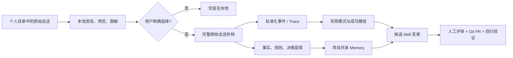

# AI 开发会话与 Memory 开源项目调研

> 面向“用真实开发会话持续改进 Skill”的内部技术分享。项目资料与 Stars 快照核验于 2026-09-03；Stars 会持续变化，本文更看重实现机制、开源边界和试点适配度。

## 先给结论

目前不存在一个成熟开源项目，可以同时完成“扫描员工本地 Claude Code / Codex / Cursor 历史会话、用户逐条预览确认、上传完整原始会话、跨会话分析、提炼业务 Memory、生成候选 Skill 并走 Git 审批”。但已有项目恰好覆盖了这条链路的不同部分，适合组合验证。

最重要的架构判断是：**原始会话、Memory、Skill 是三种不同资产，不能互相替代。**

- 原始会话是不可变证据：保留 prompt、response、tool call、文件修改、测试结果及 Agent/模型版本。
- Memory 是经提取和治理的知识：业务术语、规则、决策、约束及其来源和有效期。
- Skill 是经过验证的操作规程：触发条件、步骤、工具、边界、反例和验收方式，最终仍应由人审后合入 Git。



在本次候选中：

- **最贴近原始开发会话采集**：Entire CLI；它把完整 Agent 会话做成与 Git commit 双向关联的 checkpoint。
- **最贴近现有 Claude Code 快速试点**：Cognee；已有 Claude Code 生命周期 Hook，可直接验证“会话 → 知识图”。
- **最适合时序业务知识**：Graphiti；保留 Episode 来源、事实有效期和冲突失效关系。
- **最贴近“经验 → Skill”数据模型**：MemOS；显式建模轨迹、Episode、Policy、World Model 和 Skill 结晶。
- **最成熟的中央评审分析**：Langfuse；session replay、人工评分、数据集和 eval 较完整，但单机部署最重。
- **最轻的中央 Trace 后端**：Phoenix；单进程 SQLite 即可起步，但许可证是 ELv2。

## 调研范围与评估方法

### 入选原则

1. 核心候选原则上超过 1,000 Stars，并保持活跃；低于门槛但高度吻合的项目只放“方向观察”。
2. 优先官方仓库、官方文档和源码入口，不依据二手测评下结论。
3. 必须能够自托管核心能力，或明确写出“CLI 开源、中央控制面不可自托管”等边界。
4. 以一台公司服务器为试点上限，不把 Kubernetes 当作前提。
5. 关注 Claude Code、Codex、Cursor 等多 Agent 接入，以及公司 OpenAI-compatible API / 外部 DeepSeek API 的切换成本。

### 评分口径

每项 1～5 分，是针对本次目标的静态工程判断，不是项目通用质量排名。

| 维度 | 关注点 |
| --- | --- |
| 目标贴合 | 能否为业务知识或 Skill 更新直接提供材料 |
| 证据完整 | 是否保存原始来源、会话结构、工具调用或事实溯源 |
| 多 Agent / API | 多种编码 Agent，以及公司 API / DeepSeek 的适配成本 |
| 单机友好 | 一台服务器或本地客户端是否能快速运行 |
| 治理能力 | 隔离、权限、审批、版本、导出和审计边界 |

## 先理解 Claude Code 已经提供的采集入口

Claude Code 会把本地会话以纯文本 JSONL 保存到 `~/.claude/projects/`，内容包括消息和工具调用结果；因此“完整原始会话”并不是从零构造，而是需要做发现、预览、选择、脱敏、上传和权限治理。`SessionEnd` Hook 还会给出 `session_id`、`transcript_path`、工作目录和结束原因，适合作为本地候选上传器的触发点。[^claude-code-sessions][^claude-code-hooks]

Claude Code 也能直接输出 OpenTelemetry traces。内容字段默认收敛，可显式开启用户 prompt、assistant response、tool details、tool content 和 raw API body。这更适合新会话的统一观测，但 OTLP 是标准化视图，不能天然替代原始 JSONL 存档。[^claude-code-otel]

| 路径 | 优势 | 局限 | 适合用途 |
| --- | --- | --- | --- |
| 直接读取本地 JSONL | 信息最完整，可回放、可重解析 | 与 Agent 私有格式耦合，隐私风险最高 | 用户选择后的原始证据存档 |
| `SessionEnd` Hook | 自动得到明确的会话文件路径 | 仍需自己做预览、同意和上传 UI | 新会话候选队列 |
| OTLP / OpenTelemetry | 跨 Agent、跨平台、可扇出到多个后端 | 属性语义可能丢失，完整内容默认关闭 | 聚合分析、指标、评测 |

OpenInference 在 OpenTelemetry 上定义了 LLM、Agent、Tool、Retriever、Evaluator 等 span 语义，是 Phoenix 等平台的共同接口；但 OpenTelemetry GenAI Agent 语义约定目前仍处于 Development 阶段，因此跨 Agent 接入仍要保留自己的规范化层。[^openinference-spec][^otel-genai-agent]

## 第一类：Memory 与业务知识项目

### 总览

| 项目 | Stars / 许可证 | 核心机制 | 单机形态 | 目标贴合 | 证据 | 多 Agent/API | 单机 | 治理 | 结论 |
| --- | ---: | --- | --- | :---: | :---: | :---: | :---: | :---: | --- |
| Mem0[^mem0-readme] | 64,571 / Apache-2.0 | 对话事实提取 + 混合检索 | API + PostgreSQL/pgvector + Dashboard | 4 | 3 | 4 | 4 | 3 | 成熟通用 Memory 基线 |
| Graphiti[^graphiti-readme] | 30,523 / Apache-2.0 | 时序知识图 + Episode 溯源 | API/MCP + Neo4j 或 FalkorDB | 5 | 5 | 4 | 3 | 业务规则演化首选 |
| Cognee[^cognee-cognify] | 30,414 / Apache-2.0 | 数据管线 + 向量/知识图 + Claude Hooks | 单容器起步，可加图/关系库 | 5 | 4 | 5 | 4 | 4 | 最快验证会话入知识 |
| Letta / Letta Code[^letta-code] | 24,569 / 3,190 / Apache-2.0 | 可编辑 Memory Block + Git Memory | 本地单进程文件存储 | 4 | 4 | 4 | 5 | 3 | Git 化 Memory/Skill 参考 |
| MemOS[^memos-architecture] | 11,155 / Apache-2.0 | 轨迹 → Policy → Skill 结晶 | 本地插件，或 API + Neo4j + Qdrant | 5 | 5 | 4 | 3 | 4 | 最贴 Skill 模型但较实验性 |
| Supermemory[^supermemory-readme] | 29,193 / 公开仓 MIT；Server 对应关系待核 | 事实演化图 + 混合检索 | 单二进制、本地图与 Embedding | 3 | 3 | 5 | 5 | 2 | 轻量，但先核源码与许可边界 |

### 1. Mem0：成熟的通用 Memory API


图片来源：Mem0 官方仓库。[^mem0-readme]

Mem0 的核心定位是把消息提炼成可检索的长期事实，而不是保存完整 Agent 开发轨迹。当前 OSS 数据流大致为：`add(messages)` → LLM 提取事实 → 实体与 Embedding 生成 → 写入向量存储及历史记录 → `search` 进行语义、BM25、实体匹配与融合排序。新算法以 ADD-only 自动提取为主，避免模型擅自覆盖或删除旧事实；人工 API 仍可更新、删除。核心编排在 `mem0/memory/main.py`，Provider 工厂在 `mem0/utils/factory.py`。[^mem0-readme][^mem0-core]

它用 `user_id`、`agent_id`、`run_id` 表示作用域，适合映射员工、Agent 和会话。SDK 的 LLM、Embedding 与向量库分别可配，Provider Factory 包含 DeepSeek、Ollama、vLLM、LiteLLM 等；但官方 Self-hosted Server 镜像默认只打包有限的 LLM / Embedder Provider。DeepSeek、LiteLLM 或公司 OpenAI-compatible 网关要在 PoC 中验证，必要时扩展 Server 白名单、加入依赖并重建镜像。官方 Server Compose 是 FastAPI、PostgreSQL/pgvector 和 Dashboard 三个服务，一台服务器可承载。[^mem0-config][^mem0-server-providers][^mem0-compose]

**对本目标的静态结论：推荐作为通用 Memory 服务基线，但不能单独承担 Skill 更新。** 它缺少完整开发会话结构、业务知识审批和“重复问题 → 候选规则 → 回归验证”模型。还要注意，Mem0 托管平台包含 OSS SDK 没有的专有优化，当前平台 Graph Memory 不应直接当成 OSS 自部署能力。[^mem0-migration]

### 2. Graphiti：带时间和来源的业务知识图


图片来源：Graphiti 官方仓库。[^graphiti-readme]

Graphiti 把每份原始输入保存为 `EpisodicNode`，再抽取 `EntityNode` 与表示事实的 `EntityEdge`。边记录来源 Episode，以及 `valid_at`、`invalid_at`、`expired_at`；新规则与旧规则冲突时，旧事实被标记失效而不是直接删除。查询同时使用向量、全文、图遍历和重排。关键实现位于 `graphiti_core/graphiti.py`、`nodes.py`、`edges.py` 与 `search/`。[^graphiti-readme][^graphiti-core][^graphiti-search]

`group_id` 可映射项目或团队；Neo4j、FalkorDB 是常用自部署后端。`OpenAIGenericClient` 支持 DeepSeek、Ollama、vLLM、llama.cpp、LM Studio 和公司兼容端点，但结构化抽取质量高度依赖模型 JSON 输出能力。[^graphiti-provider]

**对本目标的静态结论：业务术语、规则、决策和需求变更的首选。** 它能回答“这条规则来自哪次会话、何时生效、后来被什么替代”，但不负责采集完整开发会话，也没有 ACL、候选 Skill 或 Git 审批，需要外层补齐。另需区分 Graphiti OSS 与当前 Zep 托管产品：Zep Community Edition 已进入 legacy，不应作为现行自部署候选。[^zep-boundary]

### 3. Cognee：现成 Claude Code 生命周期接入


图片来源：Cognee 官方仓库。[^cognee-repo]

Cognee 用 Pipeline 和 Task 组织 `remember/add`、分类、切块、实体关系抽取、图构建、向量/摘要生成，再通过 `recall/search` 做向量、图和全文检索。DataPoint 将图节点与向量表示连接起来，Dataset / NodeSet 可承载项目级范围。核心入口包括 `add.py`、`cognify.py` 和 `search.py`。[^cognee-cognify]

它最值得本试点关注的是官方 Claude Code 集成：通过 `SessionStart`、`UserPromptSubmit`、`PostToolUse`、`Stop`、`PreCompact`、`SessionEnd` Hooks 收集 prompt、工具轨迹与回答，再同步到长期知识图。模型层以 LiteLLM 为主要抽象，适合切换公司 API 和 DeepSeek。[^cognee-claude][^cognee-llm]

默认可用 SQLite、LanceDB、Kuzu/Ladybug 在一个容器内起步；团队版可增加 Postgres、Neo4j、Redis、MCP 与前端。需要注意：官方所示“全部 Memory 层落单 PostgreSQL”的 OSS Graph Store 目前定位为 demo，production-ready 版本属于授权产品；若坚持纯 OSS 生产路线，应优先评估 Neo4j 等图原生后端。官方 Compose 给 Cognee 设定 4 CPU / 8 GB 限制，仍在单机范围内。[^cognee-storage][^cognee-compose]

**对本目标的静态结论：最快验证“Claude Code 会话 → 项目知识”的候选。** 它默认产物仍是知识图，不是受治理的 Skill；必须保留原始会话引用，并为候选经验增加支持次数、反例、适用边界和人工状态，否则临时对话会污染业务知识。

### 4. Letta Code：Memory 是可编辑、可版本化的工作区

历史 `letta-ai/letta` 仓库已有 24,569 Stars，但现在主要是入口页；活跃源码迁移到 `letta-ai/letta-code`，后者 3,190 Stars。不能再用旧 Letta Server 的 PostgreSQL/pgvector Compose 描述当前架构。[^letta-repo][^letta-code]

Letta Code 本地模式内嵌有状态 Agent Server，把 Agent、Conversation、Provider、Secret 存在 `~/.letta/lc-local-backend`。默认 Memory Block 模板从内嵌 MDX 加载；启用 MemFS 后，Agent 的 memory workspace 由 Git 跟踪，可 diff、commit、查看历史与同步远端。二者是不同机制，不能把所有运行时 Memory Block 都等同于 Markdown 文件；`skills/` 可以与 Git memory workspace 共存。关键源码是 `src/agent/memory.ts` 与 `memory-git.ts`。[^letta-memory][^letta-memory-git]

本地只需 Node.js 进程和文件存储；也可以运行 Local Backend App Server 供远端客户端连接，不依赖独立数据库。Provider 注册表包含原生 DeepSeek 和 OpenAI-compatible Base URL。[^letta-agent-sdk][^letta-provider]

**对本目标的静态结论：最值得借鉴“Memory/Skill 进入 Git”的治理方式，不适合作为现有多 Agent 会话采集器。** 当前 Shared Memory 的完整团队能力与 Letta Cloud 有边界，本地 Backend 也不是成熟的企业多租户/RBAC 服务；若要求完全内网共享，需要自己补 TLS、身份、隔离和备份。

### 5. MemOS：把经验和 Skill 当作一等数据模型


图片来源：MemOS 官方仓库。[^memos-repo]

MemOS Local Plugin 明确把数据分层：L1 是 Action、Observation、Reflection 轨迹；Episode 是任务归纳；L2 Policy 记录触发条件、步骤、验证方式、边界、支持次数和收益；L3 World Model 是跨策略抽象；Skill 具有 `probationary → active → retired` 生命周期，并保留来源 Policy、支持度与试用结果。系统还建模 Feedback、Decision Repair 和 Audit Event。[^memos-architecture][^memos-data-model]

其链路不是单一的“Policy → World Model → Skill”：回合轨迹经提取、评分和 Episode 聚合后，奖励更新可触发 L2 Policy；L2 Policy 又可触发 L3 World Model 归纳，同时 Skill subscriber 独立监听 L2 Policy / Reward，执行 crystallizer、verifier、packager。World Model 不是生成 Skill 的必经上游。连续工具失败时还会检索正反轨迹生成决策修复。这是候选中最接近“从会话证据更新 Skill”的实现思路。

Local Plugin 使用 SQLite、FTS5 和本地向量，较轻；完整 API 是 FastAPI、Neo4j、Qdrant 三服务，属于中等偏重但仍可单机。LLM 支持 OpenAI-compatible、Anthropic、Gemini、Bedrock、宿主模型等，可接公司 API 和 DeepSeek。[^memos-env]

**对本目标的静态结论：强烈建议作为数据模型参考，谨慎直接作为主底座。** 当前缺少成熟 Claude Code / Codex 适配器，工程成熟度低于 Mem0/Graphiti；默认自动打包 Skill 也不符合本试点的人审要求，应把 packager 输出改成候选 diff / Git PR，禁止自动发布。

### 6. Supermemory：单二进制轻量路线

Supermemory 官方描述的链路是：文档/会话进入后抽取事实，处理更新、矛盾与遗忘，形成 Profile，再用语义、关键词和图信号混合检索；`containerTags` 可做项目范围过滤。官方列出的接入包括 Claude Code、OpenCode、OpenClaw、Hermes，以及 Cursor、Windsurf、VS Code 等客户端；不能把性能基准中出现的 Codex 当成现成集成。[^supermemory-readme]

Local 自托管版是单二进制，内嵌图、Embedding 与单数据目录，不需要外部数据库；支持 OpenAI、Anthropic、Gemini、OpenRouter、Ollama 和 OpenAI-compatible Base URL。默认本地 `bge-base-en-v1.5` 偏英文，中文业务应在首次入库前验证并选择多语 Embedding，避免数据入库后再改向量维度。[^supermemory-local][^supermemory-provider]

**对本目标的静态结论：部署最轻，但进入 PoC 前必须确认源码可审计性与开源边界。** 目前公开主仓是 MIT，但主要能看到 SDK、集成、文档和 UI，未清晰定位发布版 `supermemory-server` 对应的核心引擎源码，也已有公开 issue 询问这一边界；因此不能直接推定下载的 Server 二进制与仓库 MIT 源码完全对应。本地版又是单租户/单组织，团队角色和细粒度 Key 属于 Enterprise 边界。[^supermemory-enterprise][^supermemory-server-source]

## 第二类：开发会话管理与经验沉淀项目

### 总览

| 项目 | Stars / 许可证 | 核心机制 | 单机形态 | 目标贴合 | 证据 | 多 Agent/API | 单机 | 治理 | 结论 |
| --- | ---: | --- | --- | :---: | :---: | :---: | :---: | :---: | --- |
| Entire CLI[^entire-cli] | 5,048 / MIT | Agent Hook + Git checkpoint + commit provenance | 本地 Go CLI + 现有 Git remote | 5 | 5 | 5 | 5 | 4 | 原始开发会话首选 |
| CloudCLI UI[^cloudcli-repo] | 13,545 / AGPL-3.0-or-later | 多 Agent 本地存储适配 + 统一消息 UI | Node.js + SQLite，本地启动 | 5 | 5 | 5 | 5 | 2 | 本地预览/适配层参考 |
| OpenLIT[^openlit-repo] | 2,736 / Apache-2.0 | 编码 Agent Hooks → OTel → ClickHouse | OpenLIT + ClickHouse | 5 | 5 | 5 | 4 | 3 | 轻量统一采集首选 |
| Langfuse[^langfuse-model] | 34,092 / MIT core + 商业 `ee/` | Session/Trace/Observation + 评分/Eval | 6 个主要服务 | 5 | 5 | 5 | 2 | 4 | 最成熟中央评审 |
| Phoenix[^phoenix-docs] | 11,293 / ELv2 | OTel/OpenInference + Query/Eval | 单进程 SQLite 或 Phoenix + Postgres | 4 | 4 | 5 | 5 | 3 | 最轻中央分析 |
| Agenta[^agenta-repo] | 4,675 / MIT core + 商业 `ee/` | 版本化 Agent 配置 + Trace/Feedback/审批 | 约十余服务 | 5 | 4 | 4 | 1 | 4 | Skill 闭环方向参考 |

### 1. Entire CLI：会话与代码提交的 Git 原生证据链

Entire 为 Claude Code、Codex、Cursor、Gemini、OpenCode、Factory Droid、Copilot CLI、Pi 等安装 Agent Hook。工作中，代码与会话元数据写入短命 shadow branch；用户提交代码时，把会话压缩成永久 checkpoint，并在业务 commit 上添加 `Entire-Checkpoint: <id>` trailer。每个 checkpoint 是独立的 `refs/entire/checkpoints/<shard>/<ULID>`，指向包含 `metadata.json`、每个 session 的原始 `full.jsonl`、精简 transcript、prompt、hash 和 subagent 记录的树。[^entire-cli][^entire-session-checkpoint][^entire-git-refs]

因此它不仅回答“聊了什么”，还把 prompt、response、tool call、文件触达、token 与最终 commit 关联起来；`checkpoint explain/search` 用于检索，实验性的 `blame/why` 能从代码行回到产生它的会话。`entire import` 可导入既有 Agent 历史，首次 `--import-history` 可导入最近 30 天。

隐私控制比普通全量上报更接近本次设想：`commit_linking` 默认 `prompt`；可用 `--skip-push-sessions` 禁止自动推送，再将 checkpoint 指向独立私有 Git repo。写 checkpoint 前会自动扫描密钥，并可启用 PII、自定义规则和 Privacy Filter。但脱敏是 best-effort；默认 `push_sessions=true`，也没有“逐个会话图形化预览后仅上传这一条”的完整 UX。shadow branch 中代码快照还是原始 blob，只是官方不会推送它。[^entire-security]

**静态部署结论：CLI 与原始数据沉淀很轻，无需新增服务器；可复用公司 Git remote。** 但 Entire 官方跨仓 Dashboard / control plane 的服务端不在该 MIT CLI 仓库中，不能称为可自部署 OSS。纯开源形态依赖 Git refs 与 CLI，中央分析需另接 Langfuse/Phoenix 或自建读取器。项目较新、快速演进，5k Stars 说明关注度已过门槛，但不等同于长期生产成熟度。

### 2. CloudCLI UI：跨 Agent 本地会话发现与预览参考

CloudCLI UI（原 Claude Code UI）通过 Claude、Codex、Cursor、OpenCode 等 Provider Adapter 扫描各 Agent 的原生本地 store，执行 `fetchHistory()` / `normalizeMessage()`，统一成 `NormalizedMessage` 后在 Web UI 展示。SQLite 主要保存 session 索引、metadata 与 `jsonl_path`，完整消息和工具调用仍从原始 JSONL/SQLite 读取。[^cloudcli-repo][^cloudcli-providers]

**静态部署结论：本地 Node.js + SQLite，极轻，最适合借鉴“用户在本机发现、预览并挑选会话”的交互和多 Agent 适配层。** 它的 OSS 自托管并不提供成熟团队共享、中央检索、标注/Eval 或选择上传服务，不能独立完成经验沉淀。许可证是 AGPL-3.0-or-later；若修改后通过网络给团队使用，需要先评估源码开放义务。

### 3. OpenLIT：编码 Agent 原生 Hook 与标准化 OTel

OpenLIT 的 Coding Agent 功能会为 Claude Code、Cursor、Codex 安装 Hooks。各 vendor adapter 解析事件和 transcript，再规范为 `gen_ai.*` 与 `coding_agent.*` spans，送到内置或任意 OTLP Collector，默认落 ClickHouse。源码直接包含 Claude transcript parser 和统一 normalize 层。[^openlit-repo][^openlit-coding]

它能表示 session、prompt、tool call、file edit、subagent spawn 与 code-impact event，并支持 `minimal`、`metadata_only`、`full` 采集模式；`full` 会包含 prompt、response、thought、tool 参数和结果。对隐私敏感的 PoC 不应无审查使用 full，而应由本地同意流程决定是否发送完整内容。

官方 Compose 只有 OpenLIT 与 ClickHouse 两个主要容器，开放 UI 与 OTLP 端口，属于低—中等重量。采集本身不绑定模型供应商，适合公司 API / DeepSeek 以及多 Agent。[^openlit-compose]

**对本目标的静态结论：最适合作为 live 会话的统一采集和标准化层。** 它能快速找出 Skill 未触发、工具重试、上下文膨胀和测试失败，但历史 JSONL 导入与“用户选择完整原始会话”仍需 Entire、CloudCLI UI 或自研 uploader。

### 4. Langfuse：中央回放、标注、数据集和 Eval

Langfuse 的核心模型是 Session → Trace → 嵌套 Observation；Observation 可表示 span、generation、event，以及 LLM、tool、retrieval 等过程，并附 input/output、user、tags、metadata、score、annotation、bookmark。Observations API 可导出原始记录，适合后续构建“优质/问题会话”数据集。[^langfuse-model][^langfuse-sessions][^langfuse-api]

其优势不是读取员工目录，而是把采集端送入的完整消息/工具事件变成可回放、可评分、可评测的团队资产。Claude Code OTLP 可接入，但需要验证属性到 Langfuse session / input-output 的映射；历史 transcript 仍需 converter。

官方单机 Compose 包含 Web、Worker、PostgreSQL、ClickHouse、Redis、MinIO 六个主要服务，是本次候选中较重的一类。核心是 MIT，但 `ee/` 目录与项目 RBAC、审计、SSO、服务端 masking 等能力存在商业许可边界。[^langfuse-license][^langfuse-compose]

**对本目标的静态结论：如果团队要做人工评分、候选数据集和 Skill 回归 Eval，它是最成熟的中央后端；如果只想快速证明能采到会话，它过重。**


图片来源：Langfuse 官方仓库。[^langfuse-model]

### 5. Phoenix：轻量 OpenInference 查询与评测

Phoenix 以 OpenTelemetry + OpenInference 表示 Trace Tree，span kind 覆盖 AGENT、TOOL、LLM、RETRIEVER，`session.id` 聚合多条 trace，并支持 annotation、eval 和 dataset。它的 Python Client 可用 `get_spans_dataframe()` / SpanQuery 直接导出 DataFrame，适合工程团队做二次分析。[^phoenix-docs][^phoenix-sessions][^phoenix-export]

最小形态可 `pip install arize-phoenix` 后以 SQLite 单进程运行，生产化也只需 Phoenix + PostgreSQL，明显轻于 Langfuse。Claude Code OTLP 可以进入，但 Claude GenAI 属性与 OpenInference 富展示不保证完全一致，可能需要 Collector transform；历史 JSONL 同样需要 importer。

**对本目标的静态结论：单机试点最轻的中央分析后端。** 它没有多 Agent 本地采集器，必须搭配 Entire/OpenLIT。Phoenix Server 使用 Elastic License 2.0，不是 Apache/MIT；公司内部使用通常落在许可范围内，但禁止把软件本身作为有实质功能的对外托管服务，正式采用前应过法务。[^phoenix-license][^phoenix-deploy]

### 6. Agenta 2.0：版本化 Agent 工作区与人审闭环

Agenta 2.0 已从传统 LLMOps 平台转向共享 Agent Workspace：把 `AGENTS.md`、Skills、MCP Tools 和其他文件视为版本化 Agent 配置，每次改变形成版本，同时捕获 trace、feedback 与 test case，并在发布前由人批准。它更像“让团队在平台内运行和迭代 Agent”，不是导入散落个人目录的完整历史。[^agenta-repo][^agenta-2]

模型层支持 OpenAI-compatible / Ollama 等供应商切换；当前官方材料对不同 Harness 的支持范围变化较快，PoC 必须以实际 Claude Code、Codex 版本复核，不宜只依据首页名单。

它的 OSS Compose 包括 Web、API、多个 Worker/Cron、Runner、PostgreSQL、Redis、对象存储/网关、认证等约十余进程或容器，Runner 还涉及 FUSE/SYS_ADMIN 等权限。一台服务器技术上可跑，但不适合最快试点。核心 MIT，`ee/` 中的企业能力为商业许可。[^agenta-license]

**对本目标的静态结论：适合作为“Skill/工具/指令版本化 + Trace/Feedback + 人工批准”的最终形态参考，不建议作为第一阶段采集底座。**

## 统一部署评估

这里的资源量级是基于静态依赖关系的工程估算，不是项目官方容量承诺；实际值取决于会话量、保留期、并发和是否本地运行模型。

| 项目 | 主要运行组件 | 静态重量 | 一台服务器 | 最大部署/治理风险 |
| --- | --- | --- | --- | --- |
| Mem0 | API、PostgreSQL/pgvector、Dashboard | 中 | 可 | OSS 与平台能力不要混用 |
| Graphiti | API/MCP、Neo4j 或 FalkorDB | 中 | 可 | 图抽取质量与图库运维 |
| Cognee | 单容器起步；可选图库/关系库/MCP/UI | 低—中 | 可 | 存储组合多，先固定最小配置 |
| Letta Code | Node.js Local Backend + 文件/Git | 低 | 可 | 企业鉴权、多租户需自行补 |
| MemOS | 本地插件；或 API、Neo4j、Qdrant | 低或中—高 | 可 | 适配器与成熟度 |
| Supermemory | 单二进制 + 数据目录 | 低 | 可 | 核心引擎源码与企业边界待确认 |
| Entire CLI | 每人本地 CLI + 现有 Git remote | 很低 | 可 | 官方中央控制面不可自托管；默认会随 push 同步 |
| CloudCLI UI | 本地 Node.js + SQLite | 很低 | 可 | 不是团队中央系统；AGPL |
| OpenLIT | OpenLIT、ClickHouse | 低—中 | 可 | full 模式的隐私与存储量 |
| Langfuse | Web、Worker、Postgres、ClickHouse、Redis、MinIO | 高 | 可，但建议较充足内存 | 运维复杂；高级治理商业边界 |
| Phoenix | 单进程 SQLite，或 Phoenix + Postgres | 低 | 可 | 属性映射与 ELv2 |
| Agenta | Web/API/Workers/Runner/Postgres/Redis/对象存储/认证等 | 很高 | 勉强可 | 对快速试点过重，Runner 权限较高 |

不需要为了第一阶段引入 Kubernetes。若选择 Langfuse 或 Agenta，建议先限制保留期、并发和数据量，并把它们视为“单机验证”，而非生产容量结论。

## 组合建议：留给团队选择，而不是替团队拍板

### 组合 A：最快证明会话材料有价值

**Entire CLI + 公司私有 checkpoint Git 仓库 + 人工抽样流程**

- 新增基础设施几乎为零，覆盖 Claude Code、Codex、Cursor 等多 Agent。
- 先关闭自动 push；开发者用 `checkpoint list/explain` 在本地看清内容，再由包装脚本选择 ref 推送。
- 中央侧先不做大平台，直接对已选择 checkpoint 做离线统计：重复失败、工具重试、测试未执行、成功修复路径。
- 缺点是没有成熟中央 UI、annotation 和 eval；“逐条预览确认上传”仍需一个很薄的本地界面或脚本。

适合回答第一个问题：**真实会话到底能否产生足够多、足够好的 Skill 候选？**

### 组合 B：轻量完整闭环

**Entire CLI / CloudCLI UI（本地选择） + Phoenix（中央分析） + Cognee 或 Graphiti（Memory）**

- Entire 保存原始证据与代码关联；CloudCLI UI 的 Adapter/UI 可借鉴本地会话选择。
- Phoenix 用 SQLite 起步，接收规范化 OpenInference spans，做人审标注、查询和 Eval。
- 要快速接 Claude Code 选 Cognee；更重视业务规则有效期和来源选 Graphiti。
- 需要开发 checkpoint / JSONL → OpenInference importer，并为 Memory 事实保留 session/message/tool-call 引用。

这是当前最平衡、最符合“一台服务器快速验证”的组合。

### 组合 C：成熟评审与 Skill 生命周期探索

**OpenLIT + Langfuse + MemOS 数据模型（或后续评估 Agenta）**

- OpenLIT 负责多 Agent live hooks 和 OTel 标准化。
- Langfuse 负责 replay、score、annotation、dataset、eval。
- 借用 MemOS 的 Policy/Skill 状态和证据字段，但候选 Skill 只生成 Git PR，不自动发布。
- 若团队后来接受统一 Agent Workspace 和更重部署，再评估 Agenta；第一阶段不建议同时部署 Langfuse 与 Agenta。

适合已有明确会话量、评审角色与回归集之后进入第二阶段。

## 建议的最小数据契约

无论选择哪组项目，都建议先锁定一套与平台无关的数据契约，避免未来被某个 UI 绑定：

| 资产 | 最小字段 |
| --- | --- |
| 原始会话 | `session_id`、Agent/版本、模型、项目/commit、起止时间、原始文件、SHA-256、上传人/时间、同意记录、脱敏版本 |
| 标准化事件 | `message_id`、`parent_id`、role、tool_name、tool_args/result、file/command/test、status、latency、token、原始偏移 |
| Memory | 知识类型、正文、项目范围、来源会话/消息、有效期、置信度、支持与反例、审批状态 |
| 候选 Skill | 问题模式、触发条件、建议 diff、适用范围、证据会话、反例、验证用例、owner、评审状态 |

建议的治理链路固定为：

```text
source session → candidate change → human review → Git merge → regression verification
```

Memory 或模型可以提出候选，但不直接改正式 Skill。原始会话与提取后的 Memory 分库存储、分开授权；删除或纠错 Memory 时不篡改原始证据。

## 已评估但不进入主清单

| 项目 | 静态结论 |
| --- | --- |
| OpenMemory | 当前是 Claude Code、Codex、OpenCode 间的本地会话预览/搬运 CLI，方向高度吻合但 Stars 仅几十，作为交互参考，不满足社区门槛。旧版 Mem0 OpenMemory 已 sunset。[^openmemory-current] |
| Helicone | 6,125 Stars、Apache-2.0；模型 gateway 和 request/response 分析强，但不会自动记录终端、文件修改与测试，完整 Compose 又含 Postgres、ClickHouse、MinIO、Redis 等，当前目标下不如 OpenLIT。[^helicone-sessions][^helicone-selfhost] |
| AgentOps | 5,807 Stars；Agent session 语义好，但自部署依赖 Supabase、ClickHouse、OTel Collector 等，且没有现成 Claude/Codex/Cursor 本地历史解析器，当前不优于 OpenLIT + Phoenix。[^agentops-selfhost] |
| claude-replay | 直接读多 Agent 日志、导出 HTML/JSONL 且有 secret redaction，功能贴题，但 822 Stars 低于门槛，只作为回放与脱敏 UX 参考。[^claude-replay] |
| OpenLLMetry | 7,410 Stars、Apache-2.0；是有价值的 OTel instrumentation 库，不是会话管理/评审平台，因此不与平台候选并列。[^openllmetry] |

## 45～60 分钟分享建议

项目介绍应占约 85%，组合与 Skill 落地控制在 15% 以内：

1. 5 分钟：问题定义——为什么原始会话、Memory、Skill 必须分层。
2. 8 分钟：Claude Code JSONL、SessionEnd Hook、OTLP 三条采集路径。
3. 18 分钟：6 个 Memory 项目的不同数据模型与部署边界。
4. 18 分钟：6 个会话项目从本地采集、Git provenance 到中央 eval 的分工。
5. 6 分钟：三种组合及选择条件。
6. 5 分钟：讨论——团队优先验证“采到材料”“知识可用”还是“Skill 可评审更新”。

## 参考资料

[^claude-code-sessions]: [Claude Code 官方文档：会话存储与工作方式](https://code.claude.com/docs/en/how-claude-code-works)
[^claude-code-hooks]: [Claude Code 官方 Hooks 文档：SessionEnd 输入字段](https://code.claude.com/docs/en/hooks)
[^claude-code-otel]: [Claude Code 官方监控文档：OpenTelemetry 与内容开关](https://code.claude.com/docs/en/monitoring-usage)
[^openinference-spec]: [OpenInference 官方语义约定](https://github.com/Arize-ai/openinference/blob/main/spec/README.md)
[^otel-genai-agent]: [OpenTelemetry GenAI Agent Spans 语义约定](https://github.com/open-telemetry/semantic-conventions-genai/blob/main/docs/gen-ai/gen-ai-agent-spans.md)
[^mem0-readme]: [Mem0 README：OSS 算法与能力边界](https://github.com/mem0ai/mem0/blob/main/README.md)
[^mem0-core]: [Mem0 Memory 核心编排源码](https://github.com/mem0ai/mem0/blob/main/mem0/memory/main.py)
[^mem0-config]: [Mem0 Provider Factory 源码](https://github.com/mem0ai/mem0/blob/main/mem0/utils/factory.py)
[^mem0-server-providers]: [Mem0 Self-hosted Server 默认支持的 Providers](https://github.com/mem0ai/mem0/blob/main/docs/open-source/setup.mdx#supported-providers)
[^mem0-compose]: [Mem0 Server Docker Compose](https://github.com/mem0ai/mem0/blob/main/server/docker-compose.yaml)
[^mem0-migration]: [Mem0 OSS v2 到 v3 迁移说明](https://github.com/mem0ai/mem0/blob/main/docs/migration/oss-v2-to-v3.mdx)
[^graphiti-readme]: [Graphiti README：数据模型、存储与 Zep 边界](https://github.com/getzep/graphiti/blob/main/README.md)
[^graphiti-core]: [Graphiti 核心编排源码](https://github.com/getzep/graphiti/blob/main/graphiti_core/graphiti.py)
[^graphiti-search]: [Graphiti 混合搜索源码](https://github.com/getzep/graphiti/blob/main/graphiti_core/search/search.py)
[^graphiti-provider]: [Graphiti OpenAI-compatible Client](https://github.com/getzep/graphiti/blob/main/graphiti_core/llm_client/openai_generic_client.py)
[^zep-boundary]: [Zep 官方仓库：Community Edition legacy 边界](https://github.com/getzep/zep)
[^cognee-cognify]: [Cognee Cognify Pipeline 源码](https://github.com/topoteretes/cognee/blob/main/cognee/api/v1/cognify/cognify.py)
[^cognee-repo]: [Cognee 官方仓库](https://github.com/topoteretes/cognee)
[^cognee-claude]: [Cognee 官方 Claude Code 集成](https://github.com/topoteretes/cognee-integrations/tree/main/integrations/claude-code)
[^cognee-llm]: [Cognee LLM 配置源码](https://github.com/topoteretes/cognee/blob/main/cognee/infrastructure/llm/config.py)
[^cognee-storage]: [Cognee README：PostgreSQL Graph Store 的 demo 与授权边界](https://github.com/topoteretes/cognee/blob/main/README.md#run-the-whole-memory-layer-on-postgres)
[^cognee-compose]: [Cognee Docker Compose](https://github.com/topoteretes/cognee/blob/main/docker-compose.yml)
[^letta-repo]: [Letta 历史仓库与源码迁移说明](https://github.com/letta-ai/letta)
[^letta-code]: [Letta Code 当前活跃源码仓库](https://github.com/letta-ai/letta-code)
[^letta-memory]: [Letta Code Memory Block 源码](https://github.com/letta-ai/letta-code/blob/main/src/agent/memory.ts)
[^letta-memory-git]: [Letta Code Git-backed Memory 源码](https://github.com/letta-ai/letta-code/blob/main/src/agent/memory-git.ts)
[^letta-agent-sdk]: [Letta Agent SDK：Local 与 Remote App Server](https://docs.letta.com/agent-sdk/quickstart)
[^letta-provider]: [Letta Code BYOK Provider 注册表](https://github.com/letta-ai/letta-code/blob/main/src/providers/byok-providers.ts)
[^memos-architecture]: [MemOS Local Plugin Architecture](https://github.com/MemTensor/MemOS/blob/main/apps/memos-local-plugin/ARCHITECTURE.md)
[^memos-repo]: [MemOS 官方仓库](https://github.com/MemTensor/MemOS)
[^memos-data-model]: [MemOS Local Plugin Data Model](https://github.com/MemTensor/MemOS/blob/main/apps/memos-local-plugin/docs/DATA-MODEL.md)
[^memos-env]: [MemOS 完整环境配置](https://github.com/MemTensor/MemOS/blob/main/docker/.env.example-full)
[^supermemory-readme]: [Supermemory README：数据流与 Agent 集成](https://github.com/supermemoryai/supermemory/blob/main/README.md)
[^supermemory-local]: [Supermemory 本地自部署配置](https://github.com/supermemoryai/supermemory/blob/main/apps/docs/self-hosting/configuration.mdx)
[^supermemory-provider]: [Supermemory LLM Providers](https://github.com/supermemoryai/supermemory/blob/main/apps/docs/self-hosting/providers.mdx)
[^supermemory-enterprise]: [Supermemory Local 与 Enterprise 边界](https://github.com/supermemoryai/supermemory/blob/main/apps/docs/self-hosting/local-vs-enterprise.mdx)
[^supermemory-server-source]: [Supermemory 官方仓库 issue：Server 核心源码边界询问](https://github.com/supermemoryai/supermemory/issues/1299)
[^entire-cli]: [Entire CLI 官方仓库与 README](https://github.com/entireio/cli)
[^entire-session-checkpoint]: [Entire Sessions and Checkpoints 架构](https://github.com/entireio/cli/blob/main/docs/architecture/sessions-and-checkpoints.md)
[^entire-git-refs]: [Entire Ref-Based Checkpoint Backend](https://github.com/entireio/cli/blob/main/docs/architecture/ref-checkpoint-backend.md)
[^entire-security]: [Entire Security & Privacy](https://github.com/entireio/cli/blob/main/docs/security-and-privacy.md)
[^cloudcli-repo]: [CloudCLI UI 官方仓库](https://github.com/siteboon/claudecodeui)
[^cloudcli-providers]: [CloudCLI UI Provider 架构与统一类型](https://github.com/siteboon/claudecodeui/tree/main/server/modules/providers)
[^openlit-repo]: [OpenLIT 官方仓库](https://github.com/openlit/openlit)
[^openlit-coding]: [OpenLIT Coding Agent Hooks 与 Claude Transcript Parser](https://github.com/openlit/openlit/tree/main/cli/internal/coding/hook)
[^openlit-compose]: [OpenLIT Docker Compose](https://github.com/openlit/openlit/blob/main/docker-compose.yml)
[^langfuse-model]: [Langfuse Observability Data Model](https://langfuse.com/docs/observability/data-model)
[^langfuse-sessions]: [Langfuse Sessions](https://langfuse.com/docs/observability/features/sessions)
[^langfuse-api]: [Langfuse Observations API](https://langfuse.com/docs/api-and-data-platform/features/observations-api)
[^langfuse-license]: [Langfuse 开源与 Enterprise 许可边界](https://langfuse.com/self-hosting/license-key)
[^langfuse-compose]: [Langfuse Docker Compose](https://github.com/langfuse/langfuse/blob/main/docker-compose.yml)
[^phoenix-docs]: [Phoenix 官方文档](https://arize.com/docs/phoenix)
[^phoenix-sessions]: [Phoenix Sessions](https://arize.com/docs/phoenix/tracing/tutorial/sessions)
[^phoenix-export]: [Phoenix Span 查询与导出](https://arize.com/docs/phoenix/tracing/how-to-tracing/importing-and-exporting-traces/extract-data-from-spans)
[^phoenix-license]: [Phoenix Elastic License 2.0](https://github.com/Arize-ai/phoenix/blob/main/LICENSE)
[^phoenix-deploy]: [Phoenix 自托管部署](https://arize.com/docs/phoenix/self-hosting/deploying-phoenix)
[^agenta-repo]: [Agenta 官方仓库](https://github.com/Agenta-AI/agenta)
[^agenta-2]: [Agenta 2.0：共享 Agent Workspace](https://agenta.ai/blog/introducing-agenta-2-0)
[^agenta-license]: [Agenta 开源与 Enterprise 许可目录](https://github.com/Agenta-AI/agenta/blob/main/LICENSE)
[^openmemory-current]: [OpenMemory 当前会话搬运 CLI](https://github.com/mem0ai/openmemory)
[^helicone-sessions]: [Helicone Sessions](https://docs.helicone.ai/features/sessions)
[^helicone-selfhost]: [Helicone Docker 自托管](https://docs.helicone.ai/getting-started/self-host/docker)
[^agentops-selfhost]: [AgentOps Self-hosting](https://docs.agentops.ai/v2/self-hosting/overview)
[^claude-replay]: [claude-replay 官方仓库](https://github.com/es617/claude-replay)
[^openllmetry]: [OpenLLMetry 官方仓库](https://github.com/traceloop/openllmetry)
