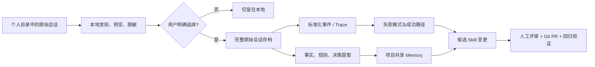

# AI 开发会话与 Memory 开源项目调研

> 面向“用真实开发会话持续改进 Skill”的内部技术分享。各项目的资料、Stars 和维护状态以对应报告中注明的核验日期为准；动态数字会持续变化，本文更看重实现机制、开源边界和需求适配度。

## 1. 目标与需求画像

**本次调研的目标：** 扫描员工本地 Claude Code  历史会话，能够使用户逐条上传完整原始会话，最终跨会话分析、提炼业务 Memory，使开发经验可以被有效的沉淀下来并为后续项目所使用。

**判断结论：** 目前不存在一个成熟开源项目，可以同时完成目标要求的内容。但已有项目恰好覆盖了这条链路的不同部分，可以进行组合验证。

**原始会话、Memory、Skill的定位判断：** 原始会话、Memory、Skill 是三种不同资产，不能互相替代。

- **原始会话是不可变证据：** 保留 prompt、response、tool call、文件修改、测试结果及 Agent/模型版本。
- **Memory 是经提取和治理的知识：** 业务术语、规则、决策、约束及其来源和有效期。
- **Skill 是经过验证的操作规程：** 触发条件、步骤、工具、边界、反例和验收方式。



在本次候选中：

- **最贴近原始开发会话采集**：Entire CLI；它把完整 Agent 会话做成与 Git commit 双向关联的 checkpoint。
- **最贴近现有 Claude Code 快速试点**：Cognee；已有 Claude Code 生命周期 Hook，可直接验证“会话 → 知识图”。
- **最贴近个人 Claude Code 会话派生 Memory**：claude-mem；它把 Hook 事件异步压缩为 observation 和 summary，再通过 MCP 与 SessionStart 注入后续上下文。
- **最适合时序业务知识**：Graphiti；保留 Episode 来源、事实有效期和冲突失效关系。
- **最贴近“经验 → Skill”数据模型**：EverOS 与 MemU；前者把事实源和 Skill 文件化，后者把记忆写作交给宿主 Agent。
- **最贴近团队化 Memory 与 Skill 平台**：TencentDB-Agent-Memory；提供 L0-L3 Chat Memory、Skill、LLM-Wiki、CodeGraph、MemoryProxy 和 Team/Agent/ACL 装配。
- **最成熟的中央评审分析**：Langfuse；session replay、人工评分、数据集和 eval 较完整，但单机部署最重。
- **最轻的中央 Trace 后端**：Phoenix；单进程 SQLite 即可起步，但许可证是 ELv2。

Memory 报告见 [[Memory/index|Memory 项目索引]]，个人会话收集报告见 [[个人会话收集/index|个人会话收集项目索引]]。下文按“项目解决的问题 → 记忆/会话机制 → 编排链路与代码位置 → 适配与边界”重组，逐项目事实以对应报告为准。

## 2. 开源项目调研要点

### Claude Code 已提供的采集入口

Claude Code 会把本地会话以纯文本 JSONL 保存到 `~/.claude/projects/`，内容包括消息和工具调用结果；因此“完整原始会话”并不是从零构造，而是需要做发现、预览、选择、脱敏、上传和权限治理。`SessionEnd` Hook 还会给出 `session_id`、`transcript_path`、工作目录和结束原因，适合作为本地候选上传器的触发点。[^claude-code-sessions][^claude-code-hooks]

Claude Code 也能直接输出 OpenTelemetry traces。内容字段默认收敛，可显式开启用户 prompt、assistant response、tool details、tool content 和 raw API body。这更适合新会话的统一观测，但 OTLP 是标准化视图，不能天然替代原始 JSONL 存档。[^claude-code-otel]

| 路径 | 优势 | 局限 | 适合用途 |
| --- | --- | --- | --- |
| 直接读取本地 JSONL | 信息最完整，可回放、可重解析 | 与 Agent 私有格式耦合，隐私风险最高 | 用户选择后的原始证据存档 |
| `SessionEnd` Hook | 自动得到明确的会话文件路径 | 仍需自己做预览、同意和上传 UI | 新会话候选队列 |
| OTLP / OpenTelemetry | 跨 Agent、跨平台、可扇出到多个后端 | 属性语义可能丢失，完整内容默认关闭 | 聚合分析、指标、评测 |

OpenInference 在 OpenTelemetry 上定义了 LLM、Agent、Tool、Retriever、Evaluator 等 span 语义，是 Phoenix 等平台的共同接口；但 OpenTelemetry GenAI Agent 语义约定目前仍处于 Development 阶段，因此跨 Agent 接入仍要保留自己的规范化层。[^openinference-spec][^otel-genai-agent]

### 2.1 Claude Code 官方 Memory 的实现方式

Claude Code 官方 Memory 采用“**显式指令文件 + 项目级自动记忆**”的文件系统机制，而不是独立的向量数据库或外部 Memory API。`CLAUDE.md` 由用户或组织维护，主要保存项目规范、工作方式和长期指令；auto memory 则由 Claude 根据会话中的纠正、偏好、项目进展和参考资料，写入本地 Markdown 笔记。两者职责不同，但都会在后续会话中作为上下文来源发挥作用。[^claude-code-memory]

- **文件发现与作用域：** `CLAUDE.md` 按 managed、user、project、local 以及目录层级加载；祖先目录中的文件按根目录到当前目录的顺序拼接，嵌套目录的 `CLAUDE.md` 和 path-scoped rules 在访问匹配路径时按需加载。这里的优先级主要体现为上下文加载顺序，并不是配置项式的硬覆盖。[^claude-code-memory][^claude-code-settings]
- **Auto Memory 的存储与召回：** 项目级自动记忆默认存放在 `~/.claude/projects/<project>/memory/`，其中 `MEMORY.md` 是启动时加载的短索引，最多注入前 200 行或 25KB；详细主题文件不在启动时全部加载，而由 Claude 在需要时通过文件工具读取。同一 Git 仓库的 worktree 和子目录共享项目 Memory，也可以通过 `autoMemoryDirectory` 调整目录。[^claude-code-memory][^claude-code-directory]
- **写入与会话生命周期：** Claude 不会机械地保存每次会话，而是自行判断信息是否值得长期保留；用户也可以直接要求“记住”。Memory 文件与本地 transcript 分开持久化，`/compact` 后项目级指令会重新注入，普通 subagent 默认不继承主会话 auto memory，需要通过 `memory: user|project|local` 配置独立的 subagent Memory。`InstructionsLoaded` Hook 可以观察 `CLAUDE.md` 和 rules 的加载，但官方没有定义独立的 auto-memory 写入事件接口。[^claude-code-memory][^claude-code-sessions][^claude-code-hooks][^claude-code-subagents]
- **可借鉴的设计与边界：** 这种“Markdown 真相源、作用域分层、短索引启动、主题文件懒加载”的方式适合个人或单一 Agent 的低运维连续性，但官方没有公开 Memory API、Embedding/向量后端、来源会话字段、成员权限、审批流程或离线模型运行路径。因此它更适合作为文件化 Memory 和会话生命周期的设计参考，不能直接作为目标多 Agent Memory 底座。[^claude-code-memory][^claude-code-repo]

### 2.2 Memory、业务知识与会话派生 Memory 项目

### 项目索引

Memory 项目按“事实 API → 时序图谱 → 会话派生 Memory → 文件化/运行时 Memory → 受控 Profile → 检索底座”的认知顺序展开；每个项目小节都明确记忆机制、编排链路、代码位置和外部缺口。代码位置按各报告核验的版本列出；报告未提供源码路径时会明确说明。

#### 1. [[Memory/Mem0：面向Agent的可插拔长期记忆层|Mem0]]：成熟的通用 Memory API

Mem0 的记忆机制是把消息提炼成可检索的长期事实，而不是保存完整 Agent 开发轨迹。记忆通常按 `user_id`、`agent_id` 和 `run_id` 划分作用域，分别对应用户、Agent/应用和一次运行；这些 ID 可以组合，用来控制跨会话长期记忆与单次任务上下文的边界。

它的编排链路是：`add(messages)` 由 LLM 提取长期有用事实，再生成实体与 Embedding，写入记忆记录、历史记录和向量存储；`search` 将语义、BM25 和实体匹配结果融合排序后返回给 Agent。**自动提取路径主要新增事实，不自动修改或删除旧事实；修改和删除需要应用或管理员调用显式 API。**[^mem0-readme][^mem0-core]

代码位置：核心编排在 `mem0/memory/main.py`，LLM、Embedding 和存储 Provider 工厂在 `mem0/utils/factory.py`；自托管 Server 的服务组合见 `server/README.md` 和 `server/docker-compose.yaml`。SDK 可分别配置 LLM、Embedding 与向量库，但官方 Server 镜像默认只打包有限 Provider，接入 DeepSeek、LiteLLM 或公司兼容网关需要按部署版本核验。[^mem0-config][^mem0-server-providers][^mem0-compose]

**对本目标的静态结论：推荐作为通用 Memory 服务基线，但不能单独承担 Skill 更新。** 它缺少完整开发会话结构、业务知识审批和“重复问题 → 候选规则 → 回归验证”模型；Mem0 托管平台的专有 Graph Memory 能力也不应直接当成 OSS 自部署能力。[^mem0-migration]

#### 2. [[Memory/Graphiti：带时间和来源追踪的上下文知识图谱|Graphiti]]：带时间和来源的业务知识图

Graphiti 的记忆机制是把每份输入保存为 `EpisodicNode`，再抽取 `EntityNode` 和表示事实的 `EntityEdge`。每条边保留来源 Episode、`valid_at`、`invalid_at`、`expired_at` 等时间信息；新规则与旧事实冲突时，旧事实被标记失效而不是直接删除。`group_id` 可映射项目、团队或 Agent 范围。

它的编排链路是：Episode 写入后由 **LLM 抽取实体、关系、摘要和时间信息，随后进行实体去重、关系合并和冲突判断**，并将结果写入图数据库及向量/全文索引；查询阶段融合向量、全文、图遍历和重排，返回带时间与 Episode 来源的上下文。[^graphiti-readme][^graphiti-search]

代码位置：核心写入、图更新和查询编排在 `graphiti_core/graphiti.py`，节点和事实边模型在 `graphiti_core/nodes.py`、`graphiti_core/edges.py`，混合检索在 `graphiti_core/search/` 和 `graphiti_core/search/search.py`；OpenAI-compatible 模型接入在 `graphiti_core/llm_client/openai_generic_client.py`。Neo4j、FalkorDB 是常用自部署后端。[^graphiti-core][^graphiti-provider]

**对本目标的静态结论：业务术语、规则、决策和需求变更的首选。** 它能回答“这条规则来自哪次会话、何时生效、后来被什么替代”，但不负责采集完整开发会话，也没有 ACL、候选 Skill 或 Git 审批，需要外层补齐。另需区分 Graphiti OSS 与当前 Zep 托管产品：Zep Community Edition 已进入 legacy，不应作为现行自部署候选。[^zep-boundary]

#### 3. [[Memory/Cognee：从多源数据构建知识图谱记忆|Cognee]]：现成 Claude Code 生命周期接入

Cognee 的记忆机制由 Dataset/NodeSet、DataPoint、知识图节点和向量表示组成：输入可以先进入按 `session_id` 关联的短期 session memory，长期结果则保存为实体关系图、向量和摘要。它用 Pipeline 和 Task 把会话、工具轨迹与多源资料统一为可召回的项目知识。

它的编排链路是：`add/remember` 登记输入并按 Dataset 归属；`cognify` 负责切块、实体/关系抽取、ontology grounding、Embedding 和图/向量索引；`recall/search` 优先查询会话记忆，必要时回退永久知识图谱，最后由 API、MCP 或 Claude Code 集成注入 Agent。`improve` 可根据反馈异步修正知识。Claude Code 路径通过 `SessionStart`、`UserPromptSubmit`、`PostToolUse`、`Stop`、`PreCompact`、`SessionEnd` Hooks 收集 prompt、工具轨迹和回答。[^cognee-cognify][^cognee-claude]

代码位置：Cognify Pipeline 在 `cognee/api/v1/cognify/cognify.py`，LLM 与 Embedding 配置分别在 `cognee/infrastructure/llm/config.py` 和 `cognee/infrastructure/databases/vector/embeddings/config.py`；Claude Code 集成在独立的 `integrations/claude-code`，MCP 接入在 `cognee-mcp/`。模型层以 LiteLLM 为主要抽象，适合切换公司 API 和 DeepSeek。[^cognee-llm]

默认可用 SQLite、LanceDB、Kuzu/Ladybug 在一个容器内起步；团队版可增加 Postgres、Neo4j、Redis、MCP 与前端。官方所示“全部 Memory 层落单 PostgreSQL”的 OSS Graph Store 目前定位为 demo，production-ready 版本属于授权产品；若坚持纯 OSS 生产路线，应优先评估 Neo4j 等图原生后端。[^cognee-storage][^cognee-compose]

**对本目标的静态结论：最快验证“Claude Code 会话 → 项目知识”的候选。** 它默认产物仍是知识图，不是受治理的 Skill；必须保留原始会话引用，并为候选经验增加支持次数、反例、适用边界和人工状态，否则临时对话会污染业务知识。

#### 4. [[Memory/Letta Code：带持续学习记忆的开发 Agent Harness|Letta Code]]：Memory 是可编辑、可版本化的工作区

Letta Code 的记忆机制是把 Memory 当作 Agent 运行时状态：默认 `persona`/`human` Memory Block 来自内嵌 MDX 资源，Git-backed Memory 则把可编辑的 Memory/Skill 文件放进每个 Agent 的本地 MemoryFS。这样记忆不是一次请求外挂的文本，而是可以被 Agent 修改、提交、回滚和同步的工作区；Server archival passage/Embedding 是另一条路径，不能与 MemoryFS 混为一谈。[^letta-memory-source][^letta-memory-git-source][^letta-docs-memory]

它的编排链路是：启动时加载默认 Block，或对 `~/.letta/agents/{agentId}/memory/` 执行 clone/pull；Harness 将 Memory Block、Skill 和工具上下文组装进 Agent 回合；Agent 执行任务并自编辑记忆文件；MemoryFS 按 pathspec 暂存并 commit，记录 commit SHA，回合结束后可 push 到远端 Memory 仓库，下一次启动再恢复相同状态。[^letta-memory-git-source]

代码位置：默认 Block 加载和进程内缓存位于 `src/agent/memory.ts`，Git-backed Memory 的 clone、pull、commit、push 和 SHA 管理位于 `src/agent/memory-git.ts`；BYOK Provider 注册表在 `src/providers/byok-providers.ts`。本地只需 Node.js 进程和文件存储，也可以运行 Local Backend App Server；Provider 注册表包含原生 DeepSeek 和 OpenAI-compatible Base URL。[^letta-agent-sdk][^letta-provider]

**对本目标的静态结论：最值得借鉴“Memory/Skill 进入 Git”的治理方式，不适合作为现有多 Agent 会话采集器。** 当前 Shared Memory 的完整团队能力与 Letta Cloud 有边界，本地 Backend 也不是成熟的企业多租户/RBAC 服务；若要求完全内网共享，需要自己补 TLS、身份、隔离和备份。

#### 5. [[Memory/Hindsight：Retain、Recall、Reflect 的学习型 Agent Memory|Hindsight]]：Retain、Recall、Reflect 学习链

Hindsight 的记忆机制以 Memory Bank 隔离不同主体或 Agent 的记忆，并维护世界事实、Agent 经历、Observation、Mental Model 和 Knowledge Page 等不同层次的状态。它不仅保存事实，还会在后台 consolidation 中整理观察、合并相关知识并形成可供后续反思的心理模型。[^hindsight-operations]

它的编排链路是：`Retain` 从对话、文档和 Agent 事件中抽取事实、实体、关系、时间和经历；后台 consolidation 生成带证据的 Observation 并刷新 Mental Model/Knowledge Page；`Recall` 并行执行语义、BM25、实体/关系和时间检索，经过 reciprocal-rank fusion、Cross-Encoder 重排和预算裁剪；`Reflect` 再基于召回结果生成综合解释、建议或风险总结。[^hindsight-operations]

代码位置：入口包括 `developer/api/main-methods`、`developer/api/retain`、`developer/api/recall`、`developer/api/reflect`、`developer/observations`、`developer/mental-models` 和 `developer/api/memory-banks`。[^hindsight-operations]

**对本目标的静态结论：适合研究“记住之后继续学习”的 Memory。** 它可依赖 API、PostgreSQL/pgvector 和 LLM/Embedding，但本地会话发现、上传审批、原始回放和 Skill 治理仍需外部补齐。详见 [[Memory/Hindsight：Retain、Recall、Reflect 的学习型 Agent Memory]]。

#### 6. [[Memory/EverOS：以 Markdown、Episode 和 Skill 演化的本地 Memory|EverOS]]：Markdown 事实源与 Skill 演化

EverOS 的记忆机制**以带 frontmatter 的 Episode Markdown 作为事实源**，SQLite/LanceDB 只保存可重建的元数据和混合检索索引。**它把开发经验拆成 Episode、AtomicFact、Foresight、Profile、Agent Case 和 `SKILL.md` 等不同产物，保留从可读事实到可执行规程的演化链**。

它的编排链路是：消息、文件或 Agent 轨迹进入 `/api/v2/memory/add`，先写入 SQLite `unprocessed_buffer`；达到 flush 或边界条件后，LLM 生成结构化 MemCell 并原子写入每日 Episode Markdown；Cascade/watchdog 监听 Markdown 变化并增量更新 LanceDB；OME 再异步派生 AtomicFact、Foresight、Profile、Agent Case 和 Skill，Reflection 可合并 Episode，并用 `deprecated_by` 标记旧条目。[^everos-how-memory][^everos-ome]

代码位置：可核验的接口和配置包括 `/api/v2/memory/add`、`/api/v2/memory/flush`、`/search`、`everos.toml`、`ome.toml`；存储布局包括 `users/<user>/episodes/episode-<date>.md`、`skills/skill_<name>/SKILL.md`、`.index/sqlite/` 和 `.index/lancedb/`。报告主要依据官方文档，未给出 `UserMemoryPipeline`、Cascade、OME 等具体源码模块路径，因此不把文档概念误写成源码位置。[^everos-how-memory][^everos-ome]

**对本目标的静态结论：最贴近“可读 Memory → Git 化 Skill”。** 但其运行成熟度、团队权限和跨 Agent 接入仍需验证，Memory/Skill 发布门禁需外部治理。详见 [[Memory/EverOS：以 Markdown、Episode 和 Skill 演化的本地 Memory]]。

#### 7. [[Memory/Supermemory：事实演化、用户画像与混合检索 Memory|Supermemory]]：事实演化图与混合检索

Supermemory 的记忆机制是把文档、对话或会话转成可演化事实，并处理新增、更新、矛盾和过期关系，进一步形成 static profile、dynamic profile 和相关 Memory。`containerTags`/space 可表达用户、项目、仓库或团队范围；它的主要产物是 Profile、Memory 和混合检索结果，而不是原始会话归档。[^supermemory-readme]

它的编排链路是：输入按 containerTag/space 写入 `add` API，经 ingestion queue 异步完成摘要、上下文切分、事实/偏好抽取和事实演化，再生成 Embedding 并保存来源文档、Memory 关系和本地图引擎索引；`profile` 生成静态/动态画像，`search` 在长期 Memory 与 RAG 文档之间做混合检索，`memories` 则只取长期 Memory，最后由 Agent 注入上下文。[^supermemory-readme]

代码位置：可核验的自托管配置和 Provider 文档包括 `apps/docs/self-hosting/overview.mdx`、`quickstart.mdx`、`configuration.mdx`、`embeddings.mdx`、`providers.mdx` 和 `local-vs-enterprise.mdx`；公开仓库包含 `packages/memory-graph/`，但报告未证明它等于 Local Server 的完整事实演化引擎。`supermemory-server` 主要以 Release 二进制交付，核心引擎源码边界仍需确认，因此不能把整个 `add/profile/search` 编排都指向一个已核验的源码文件。[^supermemory-local][^supermemory-provider][^supermemory-server-source]

**对本目标的静态结论：适合验证事实演化与项目范围隔离。** Local 自托管版是单二进制和单数据目录，支持多种模型/兼容 Base URL；默认 `bge-base-en-v1.5` 偏英文。本地版也是单租户/单组织，团队角色和细粒度 Key 属于外部或 Enterprise 边界。详见 [[Memory/Supermemory：事实演化、用户画像与混合检索 Memory]]。[^supermemory-enterprise]

#### 8. [[Memory/LightRAG：图结构与向量检索的业务知识 Memory|LightRAG]]：图、向量与关键词三路检索

LightRAG 的记忆机制是把文档、决策记录或筛选后的会话材料切成文本块，抽取实体、关系、描述和关键词，分别写入图存储、KV/文档状态、向量存储和关键词索引。`file_paths`、source ID 和 workspace 能提供来源关联与范围隔离，但它没有用户画像、自动遗忘或以会话为中心的生命周期。

它的编排链路是：文本分块后进入插入队列，LLM 抽取实体和关系并生成 Embedding；查询时先抽取关键词，再按 `local`、`global`、`mix` 或 `hybrid` 模式并行取得图邻域、向量和关键词候选，合并后可选 rerank，拼装上下文交给 Query LLM，或通过 `only_need_context` 只返回检索上下文。删除文档时，还会根据仍存活的来源重建实体、关系和向量。[^lightrag-readme][^lightrag-operate]

代码位置：核心插入、索引和查询操作在 `lightrag/operate.py`；编程接口、API Server、LLM Provider、文件处理和部署说明分别见 `docs/ProgramingWithCore.md`、`docs/LightRAG-API-Server.md`、`docs/LLMProviderOptions.md`、`docs/FileProcessingPipeline.md` 和 `docs/DockerDeployment.md`。图和向量后端可选 NanoVectorDB、PostgreSQL/pgvector、Milvus、Qdrant、OpenSearch、Neo4j 等。[^lightrag-operate]

**对本目标的静态结论：适合作为业务知识检索底座。** 它不是完整 Agent Memory；用户画像、记忆遗忘、会话采集和 Skill 治理需要外部实现。详见 [[Memory/LightRAG：图结构与向量检索的业务知识 Memory]]。

#### 9. [[Memory/Memobase：以 Profile 与事件时间线构建可控用户 Memory|Memobase]]：Profile、Event 与缓冲 flush

Memobase 的记忆机制以用户或项目为范围，把输入先保存为 Blob buffer，再由结构化 Profile 和 Event Timeline 控制粒度。长期状态由 `UserProfile`、`UserEvent` 和 `UserEventGist` 组成；Profile 适合稳定偏好和规则，Event 适合带时间的过程记录，Blob 则是待处理输入而不是默认的长期审计档案。[^memobase-repository][^profile-fundamentals]

它的编排链路是：`ChatBlob`、`DocBlob` 或 `CodeBlob` 按用户/项目进入 BufferZone；达到 token、空闲或显式 `flush` 条件后，LLM 按 `topic/sub_topic` 生成 Profile Delta，合并为 `UserProfile`，提取 event tip/tags 后写入 `UserEvent` 并生成 `UserEventGist`；启用事件语义检索时才生成 Embedding，在线由 Profile、Event 或 Context API 组装给 Agent。Blob 默认可能在处理完成后删除，需要审计时显式保留。[^memobase-repository][^profile-fundamentals]

代码位置：Blob 类型和 `BufferZone` 在 `src/server/api/memobase_server/models/blob.py`，`UserProfile`、`UserEvent`、`UserEventGist` 等模型在 `src/server/api/memobase_server/models/database.py`，响应模型在 `src/server/api/memobase_server/models/response.py`，事件处理器在 `src/server/api/memobase_server/controllers/event.py` 和 `src/server/api/memobase_server/controllers/event_gist.py`。报告未给出 Profile 抽取、Buffer flush 和 Profile Delta 合并的完整协调器路径，因此这些模型/控制器不能被误称为完整编排入口。[^memobase-repository]

**对本目标的静态结论：适合受控的项目知识槽位和事件时间线。** 它可依赖 API、PostgreSQL/pgvector 与 Redis；多 Agent 会话适配、消息级 provenance、权限和 Skill 流程要由外围补齐。详见 [[Memory/Memobase：以 Profile 与事件时间线构建可控用户 Memory]]。

#### 10. [[Memory/MemU：面向主动记忆与多 Agent 的记忆编排|MemU]]：Agent 写作、MemoryService 检索

MemU 的记忆机制把“理解、取舍和写作”交给宿主 Agent，把 Markdown memory/skill 文件作为可读事实层，把 `RecallFile`、`RecallFileSegment` 和 Embedding 索引作为检索层。它将记忆写作与存储检索分开，允许 Agent 不修改、修改既有 Skill 或创建新 Skill；MemoryService 本身主要负责保存、向量化和查询，v2 另有 LLM/VLM 处理组件。[^memu-service][^memu-readme]

它的编排链路是：Claude Code 等宿主通过 `record` 按游标读取新增日志并生成 session manifest；`prepare` 创建自包含 job 并提供现有 memory/skill 快照，外部 Agent 执行自演化后写入 Markdown 文件；`commit` 计算文件快照差异，生成 RecallFile/Segment，调用 Embedding 写入 SQLite 或 PostgreSQL/pgvector；后续 `retrieve` 检索，`inject` 将规则写入 `CLAUDE.md`、`AGENTS.md` 等上下文入口。`MemorizeInput` 可携带 message、tool call 和 tool result，但提交后临时 transcript projection 会清理，因此不等于原始归档。[^memu-developer][^memu-agentic]

代码位置：Claude Code bridging 和自演化说明在 `src/memu/hosts/claude_code/BRIDGING_TASK.md`，transcript 增量读取在 `src/memu/hosts/claude_code/sessions.py`；MemoryService 在 `src/memu/app/service.py`，Agentic commit/retrieve 在 `src/memu/app/agentic.py`，prepare/commit 生命周期在 `src/memu/app/memorize/lifecycle.py`，输入模型在 `src/memu/app/memorize/input.py`，RecallFile/Segment 模型在 `src/memu/database/models.py`。`SKILL.md` 负责 record/inject 安装路由，配置在 `src/memu/app/settings.py`。[^memu-service][^memu-agentic][^memu-developer]

**对本目标的静态结论：非常贴近 Skill 候选生成。** 它可用 SQLite 或 PostgreSQL/pgvector，但原始 transcript 归档、权限、审计和人工发布仍需外部治理。详见 [[Memory/MemU：面向主动记忆与多 Agent 的记忆编排]]。

#### 11. [[Memory/claude-mem：面向 Claude Code 的本地会话记忆与压缩检索|claude-mem]]：Claude Code 原生的会话派生 Memory

claude-mem 的记忆机制不是保存完整原始 transcript，而是把 Claude Code 的提示、工具事件、文件上下文和会话边界异步压缩为 observation 与 session summary。Observation 包含标题、叙事、事实、文件和概念；SQLite 保存 sessions、prompts、observations、summaries，并用 FTS5 提供关键词检索，Chroma 可选索引 narrative 和 facts。它的主要持久化资产是可召回的结构化 Memory，Hook 只是输入适配层。[^claude-mem-architecture][^database-architecture]

它的编排链路是：Claude Code Hooks 和 transcript watcher 接收事件，在边缘剥离 `<private>` 内容并跳过低价值工具；事件经本地 HTTP fire-and-forget 进入 Worker 的 `SessionMessageBuffer`，由模型异步生成 observation 或 session summary；结果写入 SQLite/FTS5，并由 `ChromaSync` 按 observation 拆分 narrative/facts 写入可选 Chroma。MCP 的 `search`、`timeline`、`get_observations` 按“索引 → 时间线 → 详情”渐进召回，`SessionStart` 再把近期结果格式化为 `additionalContext` 注入后续会话。[^hooks-json][^hooks-architecture][^claude-mem-buffer][^claude-mem-transcript][^chroma-sync][^search-architecture]

代码位置：Hook 入口和事件映射在 `plugin/hooks/hooks.json`，活动消息缓冲在 `src/services/worker/SessionMessageBuffer.ts`，transcript watcher/事件处理在 `src/services/transcripts/processor.ts`，Chroma 同步和运行时管理在 `src/services/sync/ChromaSync.ts`、`src/services/sync/ChromaMcpManager.ts`；生成 Provider 的 OpenAI-compatible 路径在 `src/services/worker/OpenRouterProvider.ts`。[^hooks-json][^claude-mem-buffer][^claude-mem-transcript][^chroma-sync][^chroma-manager][^openrouter-provider]

**对本目标的静态结论：应归入“会话派生 Memory”，而不是原始会话收集项目。** 它适合个人 Claude Code 的连续使用和跨会话上下文注入；完整原始 transcript、逐会话选择上传、团队治理和 Skill 发布仍需外部补齐。详见 [[Memory/claude-mem：面向 Claude Code 的本地会话记忆与压缩检索]]。

#### 12. [[Memory/TencentDB-Agent-Memory：面向 Agent 团队的长期记忆与 Skill 平台|TencentDB-Agent-Memory]]：团队化 Memory 与 Skill 平台

TencentDB-Agent-Memory 面向多 Agent 团队提供四类可复用资产：Chat Memory、Skill、LLM-Wiki 和 CodeGraph。它不是单纯的聊天记录仓库，而是把对话经验、可执行流程、文档知识和代码关系分别管理，再通过 Team、Agent、User、Task、Owner、ACL 和固定装配控制哪些资产进入某个 Agent 的上下文。[^tdai-readme-assets][^tdai-readme-hub]

它的核心链路由 MemoryCore、Memory Hub/Panel 和 MemoryProxy 组成：Chat Memory 按 L0 Conversation → L1 Atom → L2 Scenario → L3 Core/Persona 分层提取，使用 BM25、向量或混合检索；Proxy 兼容 Anthropic Messages、OpenAI Chat Completions 和 Codex Responses API，在请求前注入已绑定的 Memory/Skill，在会话后回流对话并触发 Memory 或 Skill 提取。官方提供 Claude Code、Codex 等接入文档。[^tdai-memorycore][^tdai-proxy][^tdai-agent-claude][^tdai-agent-codex]

LLM-Wiki 和 CodeGraph 作为独立知识资产异步构建，Agent 通过工具按需查询文档页面、符号、调用关系和影响范围。最小部署可由 `memory-core`、`memory-hub` 和 `proxy` 三个 Docker 服务组成，以 SQLite 和本地文件卷持久化；TCVDB、COS、Redis 等属于可选的服务化扩展。仓库许可证为 MIT，LLM、Embedding Base URL、模型和向量维度均可配置。[^tdai-knowledge][^tdai-deploy][^tdai-license]

**对本目标的静态结论：条件匹配。** 它比普通 Memory API 更接近“开发会话 → 业务 Memory/Skill”的团队基础层，已经具备会话回流、分层记忆、Skill 提取、版本和权限基础；但候选审批队列、Git/CI 回归发布、原始会话授权与完整保留、上传前脱敏、私有 SSH CodeGraph 和组织级审计仍需外部补齐。详见 [[Memory/TencentDB-Agent-Memory：面向 Agent 团队的长期记忆与 Skill 平台]]。

#### 13. [[Memory/Zep：托管 Context Graph 生态与开源边界案例|Zep]]：Context Graph 的托管边界案例

Zep Cloud 的记忆机制是以用户、线程、Episode/Observation 和时间知识图谱组装上下文，但这是 Cloud 产品路径，不是当前 OSS 仓库的可部署实现。Context Graph Engine 负责抽取实体、事实、关系和 Observation，维护时间有效性与 Ontology，再按用户/线程组装个性化上下文。

它的编排链路是：用户、线程、消息和业务数据经 Zep ingestion/SDK 写入 Episode，专有 Context Graph Engine 进行抽取、时间维护和索引，随后由图、向量和全文检索组成线程上下文，交给 Agent 消费。当前 `getzep/zep` 仓库主要提供 Cloud 示例、集成、批量导入和评估工具；Community Edition 已进入 legacy。[^zep-boundary]

代码位置：当前 `getzep/zep` 仓库没有受支持的 Context Graph Engine/Server 源码；报告只核验到 `zepctl` 的 `graph`、`episode`、`observation`、`ontology`、`thread-summary` 等 CLI/API 概念。若需要开源自部署实现，应转向 Graphiti 的 `graphiti_core/` 图谱、Episode 和检索代码，而不能把 Zep Cloud 的产品架构当作 OSS 代码位置。[^zep-boundary]

**对本目标的静态结论：适合借鉴图谱产品形态，但不满足单机内网硬约束。** 当前仓库不包含可直接自托管的 Context Graph Engine，实际开源实现应看 Graphiti。详见 [[Memory/Zep：托管 Context Graph 生态与开源边界案例]]。

### 2.3 开发会话采集、回放与评估项目

### 项目索引

会话项目按“原始证据 → 本地选择 → 标准化采集 → 中央分析/评估”的链路展开；它们主要负责保存、规范化、回放和评估开发过程，不等同于以派生知识召回和上下文注入为主要产物的 Memory。

#### 1. [[个人会话收集/Entire CLI：用 Git Checkpoint 连接 AI 会话与代码变更|Entire CLI]]：会话与代码提交的 Git 原生证据链

Entire 为 Claude Code、Codex、Cursor、Gemini、OpenCode、Factory Droid、Copilot CLI、Pi 等安装 Agent Hook。工作中，代码与会话元数据写入短命 shadow branch；用户提交代码时，把会话压缩成永久 checkpoint，并在业务 commit 上添加 `Entire-Checkpoint: <id>` trailer。每个 checkpoint 是独立的 `refs/entire/checkpoints/<shard>/<ULID>`，指向包含 `metadata.json`、每个 session 的原始 `full.jsonl`、精简 transcript、prompt、hash 和 subagent 记录的树。[^entire-cli][^entire-session-checkpoint][^entire-git-refs]

因此它不仅回答“聊了什么”，还把 prompt、response、tool call、文件触达、token 与最终 commit 关联起来；`checkpoint explain/search` 用于检索，实验性的 `blame/why` 能从代码行回到产生它的会话。`entire import` 可导入既有 Agent 历史，首次 `--import-history` 可导入最近 30 天。

隐私控制比普通全量上报更接近本次设想：`commit_linking` 默认 `prompt`；可用 `--skip-push-sessions` 禁止自动推送，再将 checkpoint 指向独立私有 Git repo。写 checkpoint 前会自动扫描密钥，并可启用 PII、自定义规则和 Privacy Filter。但脱敏是 best-effort；默认 `push_sessions=true`，也没有“逐个会话图形化预览后仅上传这一条”的完整 UX。shadow branch 中代码快照还是原始 blob，只是官方不会推送它。[^entire-security]

**静态部署结论：CLI 与原始数据沉淀很轻，无需新增服务器；可复用公司 Git remote。** 但 Entire 官方跨仓 Dashboard / control plane 的服务端不在该 MIT CLI 仓库中，不能称为可自部署 OSS。纯开源形态依赖 Git refs 与 CLI，中央分析需另接 Langfuse/Phoenix 或自建读取器。项目较新、快速演进，5k Stars 说明关注度已过门槛，但不等同于长期生产成熟度。

#### 2. [[个人会话收集/CloudCLI UI：跨 Agent 本地会话发现与预览|CloudCLI UI]]：跨 Agent 本地会话发现与预览参考

CloudCLI UI（原 Claude Code UI）通过 Claude、Codex、Cursor、OpenCode 等 Provider Adapter 扫描各 Agent 的原生本地 store，执行 `fetchHistory()` / `normalizeMessage()`，统一成 `NormalizedMessage` 后在 Web UI 展示。SQLite 主要保存 session 索引、metadata 与 `jsonl_path`，完整消息和工具调用仍从原始 JSONL/SQLite 读取。[^cloudcli-repo][^cloudcli-providers]

**静态部署结论：本地 Node.js + SQLite，极轻，最适合借鉴“用户在本机发现、预览并挑选会话”的交互和多 Agent 适配层。** 它的 OSS 自托管并不提供成熟团队共享、中央检索、标注/Eval 或选择上传服务，不能独立完成经验沉淀。许可证是 AGPL-3.0-or-later；若修改后通过网络给团队使用，需要先评估源码开放义务。

#### 3. [[个人会话收集/OpenLIT（以 OpenTelemetry、ClickHouse 和 SDK 采集 Agent 会话）|OpenLIT]]：编码 Agent 原生 Hook 与标准化 OTel

OpenLIT 的 Coding Agent 功能会为 Claude Code、Cursor、Codex 安装 Hooks。各 vendor adapter 解析事件和 transcript，再规范为 `gen_ai.*` 与 `coding_agent.*` spans，送到内置或任意 OTLP Collector，默认落 ClickHouse。源码直接包含 Claude transcript parser 和统一 normalize 层。[^openlit-repo][^openlit-coding]

它能表示 session、prompt、tool call、file edit、subagent spawn 与 code-impact event，并支持 `minimal`、`metadata_only`、`full` 采集模式；`full` 会包含 prompt、response、thought、tool 参数和结果。对隐私敏感的场景不应无审查使用 full，而应由本地同意流程决定是否发送完整内容。

官方 Compose 只有 OpenLIT 与 ClickHouse 两个主要容器，开放 UI 与 OTLP 端口，属于低—中等重量。采集本身不绑定模型供应商，适合公司 API / DeepSeek 以及多 Agent。[^openlit-compose]

**对本目标的静态结论：最适合作为 live 会话的统一采集和标准化层。** 它能快速找出 Skill 未触发、工具重试、上下文膨胀和测试失败，但历史 JSONL 导入与“用户选择完整原始会话”仍需 Entire、CloudCLI UI 或自研 uploader。

#### 4. [[个人会话收集/Langfuse：以 Trace、Session 和评估闭环沉淀 Agent 会话|Langfuse]]：中央回放、标注、数据集和 Eval

Langfuse 的核心模型是 Session → Trace → 嵌套 Observation；Observation 可表示 span、generation、event，以及 LLM、tool、retrieval 等过程，并附 input/output、user、tags、metadata、score、annotation、bookmark。Observations API 可导出原始记录，适合后续构建“优质/问题会话”数据集。[^langfuse-model][^langfuse-sessions][^langfuse-api]

其优势不是读取员工目录，而是把采集端送入的完整消息/工具事件变成可回放、可评分、可评测的团队资产。Claude Code OTLP 可接入，但需要验证属性到 Langfuse session / input-output 的映射；历史 transcript 仍需 converter。

官方单机 Compose 包含 Web、Worker、PostgreSQL、ClickHouse、Redis、MinIO 六个主要服务，是本次候选中较重的一类。核心是 MIT，但 `ee/` 目录与项目 RBAC、审计、SSO、服务端 masking 等能力存在商业许可边界。[^langfuse-license][^langfuse-compose]

**对本目标的静态结论：如果团队要做人工评分、候选数据集和 Skill 回归 Eval，它是最成熟的中央后端；如果只想快速证明能采到会话，它过重。**

#### 5. [[个人会话收集/Phoenix：以 OpenTelemetry 轨迹和评估数据集分析 Agent 会话|Phoenix]]：轻量 OpenInference 查询与评测

Phoenix 以 OpenTelemetry + OpenInference 表示 Trace Tree，span kind 覆盖 AGENT、TOOL、LLM、RETRIEVER，`session.id` 聚合多条 trace，并支持 annotation、eval 和 dataset。它的 Python Client 可用 `get_spans_dataframe()` / SpanQuery 直接导出 DataFrame，适合工程团队做二次分析。[^phoenix-docs][^phoenix-sessions][^phoenix-export]

最小形态可 `pip install arize-phoenix` 后以 SQLite 单进程运行，生产化也只需 Phoenix + PostgreSQL，明显轻于 Langfuse。Claude Code OTLP 可以进入，但 Claude GenAI 属性与 OpenInference 富展示不保证完全一致，可能需要 Collector transform；历史 JSONL 同样需要 importer。

**对本目标的静态结论：单机试点最轻的中央分析后端。** 它没有多 Agent 本地采集器，必须搭配 Entire/OpenLIT。Phoenix Server 使用 Elastic License 2.0，不是 Apache/MIT；公司内部使用通常落在许可范围内，但禁止把软件本身作为有实质功能的对外托管服务，正式采用前应过法务。[^phoenix-license][^phoenix-deploy]

#### 6. [[个人会话收集/Opik：Agent Trace、评估和 CI 反馈沉淀开发经验|Opik]]：Trace 到可重复评估

Opik 把 Agent 执行组织成可查询 Trace 树，并将失败观察转为数据集和可重复评估。Trace 经过 annotation/dataset、evaluation 和 CI feedback，形成可回归的评估结果。[^opik-repository]

**对本目标的静态结论：适合连接会话问题与 Skill/提示修改的回归验证。** 它可依赖 API/UI、数据库和评估任务组件，但仍需外部接入本地 transcript、原始证据和审批。详见 [[个人会话收集/Opik：Agent Trace、评估和 CI 反馈沉淀开发经验]]。

#### 7. [[个人会话收集/AgentOps（以 Session Replay 和 Agent Span 记录开发经验）|AgentOps]]：Session Replay 与 Agent Span

AgentOps 以 `SESSION` 为根，组织 `AGENT`、`WORKFLOW`、`TASK`、`LLM` 和 `TOOL` Span。事件经 OTLP 后端进入 Dashboard，形成 Session Replay、统计和分析记录。[^agentops-selfhost]

**对本目标的静态结论：适合作为执行过程可视化参考。** 它可依赖 API、Supabase、ClickHouse 和 OTel Collector，但没有现成的多 Agent 本地历史解析器，SDK 与自托管 app 的许可证边界也需分开核对。详见 [[个人会话收集/AgentOps（以 Session Replay 和 Agent Span 记录开发经验）]]。

#### 8. [[个人会话收集/OpenLLMetry：以 OpenTelemetry Instrumentation 作为跨 Agent 采集层|OpenLLMetry]]：可替换的 OTel 采集层

OpenLLMetry 用 OpenTelemetry 语义属性表达模型、Token、提示词、响应、工具和检索信息，解耦采集层与后端。Agent SDK instrumentation 产生 spans，经 OTel Collector 发送到任意后端，形成可查询 Trace。[^openllmetry]

**对本目标的静态结论：它是统一 Instrumentation 层，而不是会话管理或 Memory 平台。** 它可依赖 SDK、Collector 和后端；会话选择、原始归档、回放和中央评审需另行组合。详见 [[个人会话收集/OpenLLMetry：以 OpenTelemetry Instrumentation 作为跨 Agent 采集层]]。

#### 9. [[个人会话收集/Helicone：以 AI Gateway 代理和请求日志沉淀会话|Helicone]]：模型请求边界的 Gateway 日志

Helicone 在模型请求边界提供 Gateway、日志、路由、成本与 Session 分析，通常通过 base URL 或 header 接入。请求/响应经 Gateway 进入日志、Session 和成本分析后端。[^helicone-sessions][^helicone-selfhost]

**对本目标的静态结论：适合作为模型调用观测层，但不能替代完整开发会话证据层。** 它可依赖 Gateway、Postgres、ClickHouse、MinIO 和 Redis，却不天然记录终端、文件修改、测试结果或本地会话发现。详见 [[个人会话收集/Helicone：以 AI Gateway 代理和请求日志沉淀会话|Helicone]]。

#### 10. [[个人会话收集/Lunary：会话日志、反馈与开源边界案例|Lunary]]：会话、执行记录与反馈边界案例

Lunary 将可观测性拆成 `thread/message`、`run/trace` 和 `feedback`，通过 SDK 上报后在控制台消费。输入形成线程、执行记录和人工反馈，供基础会话分析使用。[^lunary-repository]

**对本目标的静态结论：仅适合作为开源/社区对照案例。** 当前公开代码仓库和历史官方仓库的身份、社区规模与维护状态存在边界；它不应被视为可独立完成本地 Agent 采集、Memory 提炼和 Skill 治理的方案。详见 [[个人会话收集/Lunary：会话日志、反馈与开源边界案例]]。

### 项目实施限制概览

Memory 项目通常需要运行时、LLM/Embedding 和 SQLite、PostgreSQL/pgvector 或图数据库。

会话采集项目通常需要本地 Hook/CLI、OTel Collector 或 Worker，再按需要增加中央数据库、ClickHouse、对象存储或评估 UI。Zep 和 Lunary 的托管/边界能力不应计入自托管主路径。

## 3. 主流设计思想

### 3.1 Memory 的主流思路

- **原始证据与派生知识分层。** Entire CLI 和 CloudCLI UI 体现了先在本地发现、预览或保存开发会话，再把经授权的材料交给分析层的思路；Graphiti、Cognee、MemU 和 EverOS 则说明 Memory 应保存为可追溯的事实、关系、Episode 或可读文件。因此，原始 transcript、标准化事件、派生 Memory 和候选 Skill 应使用不同的数据模型与授权边界，不能用一条摘要替代原始证据。[^entire-session-checkpoint][^cloudcli-providers][^graphiti-core][^memu-service][^everos-how-memory]

- **以来源、范围和时间维护知识状态。** Graphiti 的 Episode、事实有效期和冲突失效关系，Cognee 的 Dataset/Session 归属，以及 Mem0、Supermemory 等项目的 user/project/container scope，共同表明 Memory 不只是相似文本集合，还需要记录来源会话、适用范围、有效期、冲突关系和生命周期，才能支撑业务规则的持续演化。[^graphiti-search][^cognee-cognify][^mem0-core][^supermemory-readme]

- **采用混合检索和渐进式上下文。** Mem0、Graphiti、Cognee、LightRAG 和 claude-mem 都体现了组合向量、关键词、全文、实体关系或时间过滤的检索方式，并倾向于先返回紧凑索引，再按需取回详情、事实或关系。这样既能控制上下文成本，也能降低一次性注入大量低相关内容的风险；但检索结果仍应保留原始事件偏移和项目语义，不能假设不同 Agent 的属性天然等价。[^mem0-core][^graphiti-search][^cognee-cognify][^lightrag-operate][^search-architecture]

- **让知识保持可读、可修改和可审计。** Letta Code 的 Git-backed Memory、EverOS 的 Markdown/Skill 派生链和 MemU 的 Agent 主导写作，都把记忆或 Skill 保留为可读、可 diff 的资产；这有利于人工理解、版本回滚和来源追踪。Memory 可以提出新事实、修订建议或候选 Skill，但正式知识和操作规程仍应经过人工评审、Git 合并与回归验证，而不能由抽取器或 Agent 直接发布。[^letta-memory-git][^everos-ome][^memu-agentic]

### 3.2 开发会话收集的主流思路

- **本地发现、预览和授权优先。** Claude Code 原生 JSONL、Entire CLI 的 checkpoint 以及 CloudCLI UI 的多 Agent Adapter 共同体现了本地优先路径：先发现本机历史会话，允许用户预览、筛选和脱敏，再把明确授权的会话交给分析层。完整原始会话应作为不可变证据保存，不能只保留摘要或默认全量上传。[^claude-code-sessions][^entire-session-checkpoint][^cloudcli-providers][^entire-security]

- **原始会话与标准化事件并存。** OpenLIT、OpenLLMetry、Phoenix 和 Langfuse 体现了使用 OpenTelemetry/OpenInference 统一 Agent、LLM、Tool、Retriever 和 Evaluator 事件，再由中央系统查询、回放和评估的路径；但标准化事件只是分析视图，仍需保留原始文件、消息偏移、工具参数/结果和文件变更引用，便于复核、重解析和处理语义丢失。[^openinference-spec][^openlit-telemetry][^openllmetry][^phoenix-sessions][^langfuse-model]

- **按事件流和生命周期增量采集。** Claude Code Hooks、OpenLIT 的 Coding Agent Hooks、claude-mem 的 Worker/Buffer 以及 Entire 的 checkpoint 机制，都不是等到最后再拼接一份日志，而是在 prompt、tool call、文件编辑、测试结果和会话边界出现时逐步记录。事件采集应具备幂等标识、顺序或父子关系、失败重试和会话结束补偿，避免因为进程中断而丢失关键开发证据。[^claude-code-hooks][^openlit-coding][^hooks-architecture][^entire-session-checkpoint]

- **从回放走向标注、数据集和评估。** Langfuse、Phoenix、Opik 和 AgentOps 说明，会话收集的价值不止于“保存聊天记录”，还包括按 session/trace 回放、标注问题模式、筛选高质量样本、构造评估数据集，并验证 Skill 或提示词变更是否改善了后续任务。采集层本身不应直接把一次成功对话当成通用规则，必须结合重复支持、反例、人工状态和回归结果判断是否值得沉淀。[^langfuse-model][^langfuse-datasets][^phoenix-export][^opik-repository]

- **隐私和治理是采集链路的一部分。** 完整 prompt、response、tool 内容、文件路径和测试输出可能包含密钥、个人信息或业务机密，因此应将采集模式、脱敏规则、用户同意、访问权限、保留期限和上传范围设计为显式字段与流程；观测平台的 `full` 模式、自动推送和商业版治理能力不能直接视为满足内网或团队合规要求。[^entire-security][^openlit-coding][^langfuse-license][^phoenix-license]

## 4. 基于调研结果归纳的方案

### 4.1 主推荐方案

#### 本地选择、轻量中央分析与业务 Memory

**Entire CLI / CloudCLI UI（本地选择） + Phoenix（中央分析） + Cognee 或 Graphiti（Memory）**

- Entire 保存原始证据与代码关联；CloudCLI UI 的 Adapter/UI 提供本地发现和预览参考。
- Phoenix 用 SQLite 起步，接收规范化 OpenInference spans，承接查询、标注和 Eval。
- Cognee 适合已有 Claude Code 接入的会话 Memory；Graphiti 适合强调事实来源、有效期和冲突失效的业务知识。
- 组合仍需一个 checkpoint/JSONL → OpenInference importer，并为 Memory 事实保留 session、message 和 tool-call 引用；这些是外部适配边界。[^entire-session-checkpoint][^cloudcli-providers][^phoenix-sessions][^cognee-claude][^graphiti-search]

该组合把本地隐私控制、中央分析和业务知识层分开，符合单机优先与后续可扩展的约束；其成立前提是团队接受为不同 Agent 编写事件适配器，并自行实现 Skill 评审门禁。

### 4.2 备选方案

#### 低基础设施的会话证据方案

**Entire CLI + 公司私有 checkpoint Git 仓库 + 人工抽样流程**

该方案几乎不增加服务器基础设施，覆盖多种编码 Agent；开发者可在本地查看 checkpoint，再由外部流程选择并授权共享。它没有成熟的中央 UI、annotation 或 Eval，适合只需要 Git 原生会话证据的约束，不应被描述为完整 Memory 平台。[^entire-security][^entire-session-checkpoint]

#### 评审与 Skill 生命周期方案

**OpenLIT + Langfuse + EverOS/MemU 的 Memory 机制**

OpenLIT 负责多 Agent Hook 和 OTel 标准化，Langfuse 负责 replay、score、annotation、dataset 和 eval；EverOS 的 Episode/事实源或 MemU 的 Agent 写作边界可作为可读 Memory/Skill 机制参考。候选 Skill 仍只进入 Git 评审和回归验证，不由采集或 Memory 组件直接发布。[^openlit-coding][^langfuse-model][^everos-ome][^memu-agentic]

### 4.3 统一数据契约

本汇总建议使用与 UI 和具体后端无关的数据契约；字段来源借鉴项目报告，治理字段属于本汇总的外部组合建议：

| 资产 | 最小字段 | 主要来源或依据 |
| --- | --- | --- |
| 原始会话 | `session_id`、Agent/版本、模型、项目/commit、起止时间、原始文件、SHA-256、上传人/时间、同意记录、脱敏版本 | Entire CLI、CloudCLI UI；完整归档与授权为外部治理 |
| 标准化事件 | `message_id`、`parent_id`、role、tool_name、tool_args/result、file/command/test、status、latency、token、原始偏移 | OpenLIT、OpenLLMetry、OpenInference |
| Memory | 知识类型、正文、项目范围、来源会话/消息、有效期、置信度、支持与反例、审批状态 | Graphiti、Cognee、MemU、EverOS |
| 候选 Skill | 问题模式、触发条件、建议 diff、适用范围、证据会话、反例、验证用例、owner、评审状态 | EverOS、MemU、Langfuse、Phoenix、Opik；Git 治理为外部建议 |

本汇总建议的治理链路为：

```text
source session → candidate change → human review → Git merge → regression verification
```

Memory 或模型可以提出候选，但不直接改正式 Skill。原始会话与提取后的 Memory 分库存储、分开授权；删除或纠错 Memory 时不篡改原始证据。

## 实施边界

本目录中的项目需要组合使用，不能把任何一个项目当作完整闭环：

- 原始会话的本地发现、预览、脱敏、用户同意和独立归档，由 Entire CLI、CloudCLI UI 或自研采集层负责。
- OpenTelemetry/Trace 平台负责规范化事件、回放、标注和评估；它们不会自动把会话变成可信业务知识。
- Memory 项目负责事实、关系、画像、事件或文件化知识的提取、持久化和召回；来源消息、代码 diff、测试结果、有效期和审批记录仍需外围数据契约。
- Skill 必须以候选变更进入 Git 评审和回归验证，不能由 Memory 抽取器或 Agent 直接发布。
- 自托管都要单独核对 LLM、Embedding、向量维度、数据备份、项目隔离和许可证；Zep 当前开源仓库不构成可自托管 Context Graph Engine。

<!-- 参考资料：以下脚注定义属于本汇总的来源区，不构成额外章节。 -->

[^claude-code-sessions]: [Claude Code 官方文档：会话存储与工作方式](https://code.claude.com/docs/en/how-claude-code-works)
[^claude-code-hooks]: [Claude Code 官方 Hooks 文档：SessionEnd 输入字段](https://code.claude.com/docs/en/hooks)
[^claude-code-memory]: [Claude Code 官方文档：Memory](https://code.claude.com/docs/en/memory)
[^claude-code-directory]: [Claude Code 官方文档：`.claude` 目录](https://code.claude.com/docs/en/claude-directory)
[^claude-code-settings]: [Claude Code 官方文档：Settings](https://code.claude.com/docs/en/settings)
[^claude-code-subagents]: [Claude Code 官方文档：Subagents](https://code.claude.com/docs/en/sub-agents)
[^claude-code-repo]: [Anthropic 官方 GitHub 仓库：anthropics/claude-code](https://github.com/anthropics/claude-code)
[^claude-code-otel]: [Claude Code 官方监控文档：OpenTelemetry 与内容开关](https://code.claude.com/docs/en/monitoring-usage)
[^openinference-spec]: [OpenInference 官方语义约定](https://github.com/Arize-ai/openinference/blob/main/spec/README.md)
[^otel-genai-agent]: [OpenTelemetry GenAI Agent Spans 语义约定](https://github.com/open-telemetry/semantic-conventions-genai/blob/main/docs/gen-ai/gen-ai-agent-spans.md)
[^mem0-readme]: [Mem0 README：OSS 算法与能力边界](https://github.com/mem0ai/mem0/blob/main/README.md)
[^mem0-core]: [Mem0 Memory 核心编排源码](https://github.com/mem0ai/mem0/blob/main/mem0/memory/main.py)
[^mem0-config]: [Mem0 Provider Factory 源码](https://github.com/mem0ai/mem0/blob/main/mem0/utils/factory.py)
[^mem0-server-providers]: [Mem0 Self-hosted Server 默认支持的 Providers](https://github.com/mem0ai/mem0/blob/main/docs/open-source/setup.mdx#supported-providers)
[^mem0-compose]: [Mem0 Server Docker Compose](https://github.com/mem0ai/mem0/blob/main/server/docker-compose.yaml)
[^mem0-migration]: [Mem0 OSS v2 到 v3 迁移说明](https://github.com/mem0ai/mem0/blob/main/docs/migration/oss-v2-to-v3.mdx)
[^graphiti-readme]: [Graphiti README：数据模型、存储与 Zep 边界](https://github.com/getzep/graphiti/blob/main/README.md)
[^graphiti-core]: [Graphiti 核心编排源码](https://github.com/getzep/graphiti/blob/main/graphiti_core/graphiti.py)
[^graphiti-search]: [Graphiti 混合搜索源码](https://github.com/getzep/graphiti/blob/main/graphiti_core/search/search.py)
[^graphiti-provider]: [Graphiti OpenAI-compatible Client](https://github.com/getzep/graphiti/blob/main/graphiti_core/llm_client/openai_generic_client.py)
[^zep-boundary]: [Zep 官方仓库：Community Edition legacy 边界](https://github.com/getzep/zep)
[^cognee-cognify]: [Cognee Cognify Pipeline 源码](https://github.com/topoteretes/cognee/blob/main/cognee/api/v1/cognify/cognify.py)
[^cognee-repo]: [Cognee 官方仓库](https://github.com/topoteretes/cognee)
[^cognee-claude]: [Cognee 官方 Claude Code 集成](https://github.com/topoteretes/cognee-integrations/tree/main/integrations/claude-code)
[^cognee-llm]: [Cognee LLM 配置源码](https://github.com/topoteretes/cognee/blob/main/cognee/infrastructure/llm/config.py)
[^cognee-storage]: [Cognee README：PostgreSQL Graph Store 的 demo 与授权边界](https://github.com/topoteretes/cognee/blob/main/README.md#run-the-whole-memory-layer-on-postgres)
[^cognee-compose]: [Cognee Docker Compose](https://github.com/topoteretes/cognee/blob/main/docker-compose.yml)
[^letta-repo]: [Letta 历史仓库与源码迁移说明](https://github.com/letta-ai/letta)
[^letta-code]: [Letta Code 当前活跃源码仓库](https://github.com/letta-ai/letta-code)
[^letta-memory]: [Letta Code Memory Block 源码](https://github.com/letta-ai/letta-code/blob/main/src/agent/memory.ts)
[^letta-memory-git]: [Letta Code Git-backed Memory 源码](https://github.com/letta-ai/letta-code/blob/main/src/agent/memory-git.ts)
[^letta-agent-sdk]: [Letta Agent SDK：Local 与 Remote App Server](https://docs.letta.com/agent-sdk/quickstart)
[^letta-provider]: [Letta Code BYOK Provider 注册表](https://github.com/letta-ai/letta-code/blob/main/src/providers/byok-providers.ts)
[^supermemory-readme]: [Supermemory README：数据流与 Agent 集成](https://github.com/supermemoryai/supermemory/blob/main/README.md)
[^supermemory-local]: [Supermemory 本地自部署配置](https://github.com/supermemoryai/supermemory/blob/main/apps/docs/self-hosting/configuration.mdx)
[^supermemory-provider]: [Supermemory LLM Providers](https://github.com/supermemoryai/supermemory/blob/main/apps/docs/self-hosting/providers.mdx)
[^supermemory-enterprise]: [Supermemory Local 与 Enterprise 边界](https://github.com/supermemoryai/supermemory/blob/main/apps/docs/self-hosting/local-vs-enterprise.mdx)
[^supermemory-server-source]: [Supermemory 官方仓库 issue：Server 核心源码边界询问](https://github.com/supermemoryai/supermemory/issues/1299)
[^entire-cli]: [Entire CLI 官方仓库与 README](https://github.com/entireio/cli)
[^entire-session-checkpoint]: [Entire Sessions and Checkpoints 架构](https://github.com/entireio/cli/blob/main/docs/architecture/sessions-and-checkpoints.md)
[^entire-git-refs]: [Entire Ref-Based Checkpoint Backend](https://github.com/entireio/cli/blob/main/docs/architecture/ref-checkpoint-backend.md)
[^entire-security]: [Entire Security & Privacy](https://github.com/entireio/cli/blob/main/docs/security-and-privacy.md)
[^cloudcli-repo]: [CloudCLI UI 官方仓库](https://github.com/siteboon/claudecodeui)
[^cloudcli-providers]: [CloudCLI UI Provider 架构与统一类型](https://github.com/siteboon/claudecodeui/tree/main/server/modules/providers)
[^openlit-repo]: [OpenLIT 官方仓库](https://github.com/openlit/openlit)
[^openlit-coding]: [OpenLIT Coding Agent Hooks 与 Claude Transcript Parser](https://github.com/openlit/openlit/tree/main/cli/internal/coding/hook)
[^openlit-compose]: [OpenLIT Docker Compose](https://github.com/openlit/openlit/blob/main/docker-compose.yml)
[^langfuse-model]: [Langfuse Observability Data Model](https://langfuse.com/docs/observability/data-model)
[^langfuse-sessions]: [Langfuse Sessions](https://langfuse.com/docs/observability/features/sessions)
[^langfuse-api]: [Langfuse Observations API](https://langfuse.com/docs/api-and-data-platform/features/observations-api)
[^langfuse-license]: [Langfuse 开源与 Enterprise 许可边界](https://langfuse.com/self-hosting/license-key)
[^langfuse-compose]: [Langfuse Docker Compose](https://github.com/langfuse/langfuse/blob/main/docker-compose.yml)
[^phoenix-docs]: [Phoenix 官方文档](https://arize.com/docs/phoenix)
[^phoenix-sessions]: [Phoenix Sessions](https://arize.com/docs/phoenix/tracing/tutorial/sessions)
[^phoenix-export]: [Phoenix Span 查询与导出](https://arize.com/docs/phoenix/tracing/how-to-tracing/importing-and-exporting-traces/extract-data-from-spans)
[^phoenix-license]: [Phoenix Elastic License 2.0](https://github.com/Arize-ai/phoenix/blob/main/LICENSE)
[^phoenix-deploy]: [Phoenix 自托管部署](https://arize.com/docs/phoenix/self-hosting/deploying-phoenix)
[^helicone-sessions]: [Helicone Sessions](https://docs.helicone.ai/features/sessions)
[^helicone-selfhost]: [Helicone Docker 自托管](https://docs.helicone.ai/getting-started/self-host/docker)
[^agentops-selfhost]: [AgentOps Self-hosting](https://docs.agentops.ai/v2/self-hosting/overview)
[^claude-replay]: [claude-replay 官方仓库](https://github.com/es617/claude-replay)
[^openllmetry]: [OpenLLMetry 官方仓库](https://github.com/traceloop/openllmetry)
[^hindsight-operations]: [Hindsight 官方文档：Retain、Recall、Reflect](https://hindsight.vectorize.io/developer/api/main-methods)
[^everos-how-memory]: [EverOS 官方文档：How Memory Works](https://github.com/EverMind-AI/EverOS/blob/main/docs/how-memory-works.md)
[^everos-ome]: [EverOS 官方文档：Offline Memory Engine](https://github.com/EverMind-AI/EverOS/blob/main/docs/how-memory-works.md#the-offline-memory-engine-ome)
[^lightrag-readme]: [LightRAG 官方仓库](https://github.com/HKUDS/LightRAG)
[^lightrag-operate]: [LightRAG 官方文档：Operate](https://github.com/HKUDS/LightRAG/tree/main/docs)
[^memobase-repository]: [Memobase 官方仓库](https://github.com/memodb-io/memobase)
[^profile-fundamentals]: [Memobase 官方文档：Profile Fundamentals](https://docs.memobase.io/features/profile/profile)
[^memu-service]: [MemU 官方 MemoryService 源码](https://github.com/NevaMind-AI/memU/blob/main/src/memu/app/service.py)
[^memu-readme]: [MemU 官方仓库](https://github.com/NevaMind-AI/memU)
[^opik-repository]: [Opik 官方仓库](https://github.com/comet-ml/opik)
[^claude-mem-architecture]: [claude-mem 官方架构文档](https://github.com/thedotmack/claude-mem/blob/main/docs/architecture.md)
[^lunary-repository]: [Lunary 当前公开代码仓库](https://github.com/appl-team/lunary)
[^openlit-telemetry]: [OpenLIT Telemetry 文档](https://docs.openlit.io/latest/openlit/observability/telemetry/overview)
[^langfuse-datasets]: [Langfuse Dataset 文档](https://langfuse.com/docs/datasets/overview)
[^search-architecture]: [claude-mem 搜索架构与渐进式检索](https://docs.claude-mem.ai/architecture/search-architecture)
[^memu-agentic]: [MemU Agentic 提交与检索源码](https://github.com/NevaMind-AI/memU/blob/main/src/memu/app/agentic.py)
[^memu-developer]: [MemU Developer Memorize API](https://github.com/NevaMind-AI/memU/blob/main/docs/developer.md)
[^claude-mem-cloud]: [claude-mem Cloud Sync 文档](https://github.com/thedotmack/claude-mem/blob/main/docs/public/cloud-sync.mdx)
[^claude-mem-server]: [claude-mem Server-beta 文档](https://github.com/thedotmack/claude-mem/blob/main/docs/server.md)
[^letta-memory-source]: [Letta Code memory.ts：默认 Memory Block 加载源码](https://github.com/letta-ai/letta-code/blob/main/src/agent/memory.ts)
[^letta-memory-git-source]: [Letta Code memory-git.ts：Git-backed Memory 源码](https://github.com/letta-ai/letta-code/blob/main/src/agent/memory-git.ts)
[^letta-docs-memory]: [Letta Memory 官方文档](https://docs.letta.com/concepts/memory)
[^tdai-readme-assets]: [TencentDB-Agent-Memory 官方 README：Memory assets](https://github.com/TencentCloud/TencentDB-Agent-Memory/blob/feat/server_team/README_CN.md)
[^tdai-readme-hub]: [TencentDB-Agent-Memory 官方 README：Memory Hub 与权限装配](https://github.com/TencentCloud/TencentDB-Agent-Memory/blob/feat/server_team/README_CN.md)
[^tdai-memorycore]: [TencentDB-Agent-Memory MemoryCore README 与 API](https://github.com/TencentCloud/TencentDB-Agent-Memory/blob/feat/server_team/MemoryCore/v3-api-memorycore-doc.md)
[^tdai-proxy]: [TencentDB-Agent-Memory MemoryProxy README 与代理链路](https://github.com/TencentCloud/TencentDB-Agent-Memory/blob/feat/server_team/MemoryProxy/README_CN.md)
[^tdai-agent-claude]: [TencentDB-Agent-Memory Claude Code 接入文档](https://github.com/TencentCloud/TencentDB-Agent-Memory/blob/feat/server_team/agents/claude-code/README.md)
[^tdai-agent-codex]: [TencentDB-Agent-Memory Codex 接入文档](https://github.com/TencentCloud/TencentDB-Agent-Memory/blob/feat/server_team/agents/codex/README.md)
[^tdai-knowledge]: [TencentDB-Agent-Memory MemoryKnowledge 文档](https://github.com/TencentCloud/TencentDB-Agent-Memory/blob/feat/server_team/MemoryKnowledge/v3-api-memoryknowledge-doc.md)
[^tdai-deploy]: [TencentDB-Agent-Memory 单机部署文档](https://github.com/TencentCloud/TencentDB-Agent-Memory/blob/feat/server_team/deploy/global-images/README.md)
[^tdai-license]: [TencentDB-Agent-Memory MIT LICENSE](https://github.com/TencentCloud/TencentDB-Agent-Memory/blob/feat/server_team/LICENSE)
[^database-architecture]: [claude-mem 官方数据库架构文档](https://github.com/thedotmack/claude-mem/blob/main/docs/architecture.md)
[^hooks-json]: [claude-mem 官方 Hook 配置](https://github.com/thedotmack/claude-mem/blob/main/plugin/hooks/hooks.json)
[^hooks-architecture]: [claude-mem 官方 Hook/事件架构源码](https://github.com/thedotmack/claude-mem/tree/main/src/services)
[^claude-mem-buffer]: [claude-mem 官方 SessionMessageBuffer 源码](https://github.com/thedotmack/claude-mem/blob/main/src/services/worker/SessionMessageBuffer.ts)
[^claude-mem-transcript]: [claude-mem 官方 transcript processor 源码](https://github.com/thedotmack/claude-mem/blob/main/src/services/transcripts/processor.ts)
[^chroma-sync]: [claude-mem 官方 ChromaSync 源码](https://github.com/thedotmack/claude-mem/blob/main/src/services/sync/ChromaSync.ts)
[^chroma-manager]: [claude-mem 官方 ChromaMcpManager 源码](https://github.com/thedotmack/claude-mem/blob/main/src/services/sync/ChromaMcpManager.ts)
[^openrouter-provider]: [claude-mem 官方 OpenRouterProvider 源码](https://github.com/thedotmack/claude-mem/blob/main/src/services/worker/OpenRouterProvider.ts)
