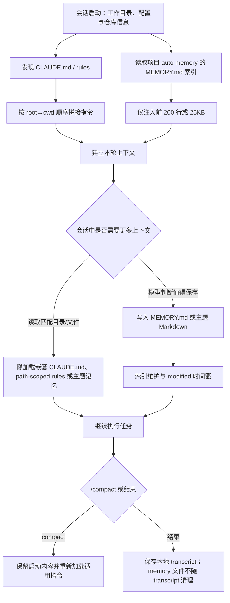

# Claude Code 官方 Memory：文件化、作用域化的会话连续性机制

> **项目快照**：官方文档与官方仓库 `anthropics/claude-code`｜核验日期：2026-09-06｜GitHub 页面约 144.1k Stars、23k Forks、751 commits｜仓库许可证为 Anthropic Commercial Terms（非 MIT/Apache-2.0）｜CHANGELOG 页面当前可核验到 2.1.260，但该文件未在页面内容中提供发布日期。[^cc-repo][^cc-license][^cc-changelog]

> **需求画像**：本 Brief 要找的是可在多个开发 Agent 之间沉淀项目知识、技术决策和经验，并能把经授权会话转化为可追溯 Skill 候选的可组合 Memory 层；优先本地/单机、原始会话与派生知识分离、可切换模型和向量后端，并明确开源边界。[^brief]

> **身份说明**：这里调研的不是一个独立开源 Memory 仓库，而是 Claude Code 产品内置的官方 Memory 机制。公开的 `anthropics/claude-code` 仓库主要提供文档、脚本、示例和插件；官方仓库根目录没有展示 Claude Code CLI 的实现源码，因此以下关于 Memory 的运行机制以官方文档和官方公告为准，不能把公开插件代码等同于 Memory 引擎源码。[^cc-api-root][^cc-repo]

## 1. 项目要解决什么问题

### 目标用户与使用场景

Claude Code 的每个会话都从新的上下文窗口开始。官方将跨会话连续性拆成两种互补机制：由用户维护、用于持久指令的 `CLAUDE.md` 文件，以及由 Claude 自己根据工作过程写入的 auto memory。前者适合项目规范、构建命令和工作流，后者适合用户偏好、纠正、项目进展和无法从代码或 Git 历史直接推导的信息。[^cc-memory]

它面向在终端、IDE 或 GitHub 中持续处理代码库的开发者和团队。其价值不是建立一个独立的语义知识库，而是让同一用户、同一项目及其 worktree 在后续会话中重新获得必要的行为指令和经过筛选的工作笔记。Anthropic 的官方公告也把文件系统记忆描述为适合长期、多会话任务的能力：模型可以在有本地文件访问时记录重要笔记，并在后续任务中使用。[^cc-repo][^anthropic-claude4][^anthropic-opus47]

### 当前问题

- **重复解释和上下文重建**：项目规范、个人习惯和上次会话形成的有效经验若只存在于对话中，新的会话无法自动继承；`CLAUDE.md` 和 `MEMORY.md` 将其中一部分转成可读文件并在启动时重新加载。[^cc-memory]
- **全量注入的上下文成本**：Claude Code 不把所有记忆主题文件都塞进启动上下文，而是只加载 `MEMORY.md` 的前 200 行或 25KB（先达到者为准），详细主题文件按需读取；对大型 `CLAUDE.md` 也有 4MiB 上限，并建议控制在 200 行以内。[^cc-memory]
- **不同范围的规则混杂**：组织、用户、项目和当前项目个人偏好需要有不同作用域；父目录、当前目录、嵌套目录和 path-scoped rules 还需要按工作目录和访问路径加载。官方机制用层级、拼接顺序和懒加载解决这一问题。[^cc-memory][^cc-settings]
- **长会话与压缩后的连续性**：会话会持续保存到本地 transcript，并可能执行 `/compact`；项目根 `CLAUDE.md` 在压缩后重新注入，嵌套指令和路径规则在再次匹配时加载，从而避免把全部历史作为唯一记忆载体。[^cc-sessions][^cc-memory][^cc-context]

### 问题边界

Claude Code Memory 不是公开的 Memory API、向量数据库、团队知识治理系统或 Skill 发布流水线。官方文档没有描述 Embedding、语义检索、相似度排序、跨用户权限、审批队列、原始会话事件导入或离线/内网模型运行时。auto memory 的本体是本地 Markdown 文件，是否写入、写什么以及何时回忆主要由 Claude 在会话中决定；Claude Code 提供读写文件的能力和若干开关，但没有公开一个可由外部系统调用的记忆服务接口。[^cc-memory][^cc-repo]

## 2. 设计的核心思路

### 核心判断

Claude Code 采用“**持久指令文件 + 模型维护的项目笔记索引**”而不是单一数据库记忆。`CLAUDE.md` 是显式、可审阅、可提交的行为上下文；auto memory 是默认开启的、按项目隔离的 Markdown 笔记。两者都在会话启动阶段进入上下文，但职责不同：前者告诉 Claude 应该怎样工作，后者保存 Claude 认为未来有用的学习结果。[^cc-memory]

这一选择把连续性放在文件系统和版本控制可见性上：项目指令可以进入仓库，个人指令可放在用户或 local scope，auto memory 默认留在本机的 `~/.claude/projects/.../memory/` 下。对开发工具而言，文件可直接审阅、编辑和删除，也能通过 `/memory` 和 `/context` 检查；代价是该机制没有内置结构化检索、权限模型和跨机器同步。[^cc-memory][^cc-directory]

### 关键设计选择

- **分离“指令”和“学习笔记”**：`CLAUDE.md` 由用户/组织维护，内容是规则和指令；auto memory 由 Claude 写入，内容是 `user`、`feedback`、`project`、`reference` 四类学习笔记。Claude 官方说明会跳过能够从代码库推导出的信息，也会跳过 CLAUDE.md 已经写出的内容，以减少重复。[^cc-memory]
- **按范围分层而非覆盖式配置**：Managed policy、user、project、local 是主要 `CLAUDE.md` 范围；文件按根目录到当前目录拼接，越靠近工作目录的内容越晚出现，同目录的 `CLAUDE.local.md` 在 `CLAUDE.md` 后出现。用户级 rules 在项目 rules 前加载，项目规则因而具有更高优先级。这里的“优先级”主要是上下文顺序，不是硬覆盖语义：官方明确说所有发现的文件会拼接，不会像配置键那样自动覆盖。[^cc-memory][^cc-settings]
- **启动只注入索引，主题按需读取**：每个项目 auto memory 目录包含 `MEMORY.md` 索引和若干主题文件。启动时只读索引前 200 行/25KB；主题文件不自动启动加载，而由 Claude 在需要时使用标准文件工具读取。超过索引限制时写入仍成功，但 Claude Code 返回错误提示要求重写索引，因为超出部分下次不会加载。[^cc-memory]
- **以模型判断代替固定抽取器**：官方说明 Claude 不会每个会话都保存内容，而是自行判断信息是否值得未来记住；用户也可以用“remember ...”要求保存，或直接编辑 Markdown。没有公开确定性的规则、评分器、Embedding 管线或记忆合并算法，因此“记忆提取”是 Agent 行为，不是可独立复用的后台 ETL。[^cc-memory]
- **把加载接入会话和文件访问生命周期**：祖先目录的指令在启动时加载，子目录中的 `CLAUDE.md` 在 Claude 读取该目录文件时按需加载；path-scoped rules 在匹配文件时加载。`InstructionsLoaded` hook 可观察 `session_start`、`nested_traversal`、`path_glob_match`、`include` 和 `compact` 等原因，但该 hook 的官方定义针对 CLAUDE.md/rules，不是一个 auto-memory 写入事件总线。[^cc-memory][^cc-hooks]

### 代价与取舍

官方事实是：auto memory 默认开启、文件本地持久化、跨同一仓库的 worktree 共享、索引有严格启动预算；主会话 auto memory 不会传给普通 subagent，fork 才继承父会话上下文；自定义 subagent 可配置独立的 `user`、`project` 或 `local` memory。[^cc-memory][^cc-subagents]

调研判断是：这种设计很适合“开发者与 Claude 共同维护少量可读笔记”，但不适合直接作为多个 Agent 的共享知识平面。其一致性依赖模型是否主动读写文件，团队共享边界依赖 Git/文件权限等外部治理，召回质量依赖索引是否保持简洁；如果需求要求事件级授权、来源链、结构化查询和回归验证，就必须在 Claude Code 外增加适配层。

## 3. 项目如何工作

### 工作流概览

### 阶段说明

| 阶段 | 接收什么 | 做什么 | 产生的状态或产物 | 证据 |
| --- | --- | --- | --- | --- |
| 会话发现 | 当前工作目录、仓库状态、配置来源 | 查找受支持作用域的 `CLAUDE.md`、`CLAUDE.local.md` 和 rules；必要时解析 `@path` import | 启动阶段的指令上下文；祖先目录按 root→cwd 排序 | [官方 Memory 文档][^cc-memory] |
| auto memory 启动加载 | `~/.claude/projects/<project>/memory/MEMORY.md` 或 `autoMemoryDirectory` 指定目录 | 读取索引前 200 行或 25KB；主题文件不在启动时自动读入 | 本轮可直接使用的项目记忆索引 | [官方 Memory 文档][^cc-memory] |
| 会话执行与懒加载 | 用户任务、工具访问的目录/文件、已注入指令 | 读取匹配目录中的 nested CLAUDE.md、path-scoped rules 或需要的主题记忆；普通 subagent 默认不继承主会话 auto memory | 扩展后的任务上下文；`InstructionsLoaded` 可记录指令加载事件 | [官方 Memory 文档][^cc-memory]、[Hooks 文档][^cc-hooks] |
| 记忆写入 | 用户明确要求记住的内容、纠正、偏好、项目进展等 | Claude 判断是否值得保存，并以 Markdown 写入索引或主题文件；有 frontmatter 时下次写入可记录 `modified` ISO 8601 时间 | `MEMORY.md` 索引、`user_role.md` 等主题文件；四类 `type` | [官方 Memory 文档][^cc-memory] |
| 压缩/恢复 | 长会话历史、`/compact` 或 `--resume` | 压缩用摘要替换历史；项目根 CLAUDE.md 会重新注入，嵌套指令按再次访问加载；恢复会话时重建对话状态并重新读取标准 settings | 摘要后的上下文、本地 JSONL transcript、仍独立存在的 memory 文件 | [Sessions 文档][^cc-sessions]、[Context window 文档][^cc-context] |

### 关键状态与产物

- **指令上下文**：`CLAUDE.md`/`CLAUDE.local.md` 内容被作为上下文提供给 Claude，而不是客户端强制执行的策略。官方明确指出，若某行为必须被阻止，应使用 `PreToolUse` 等 hook；CLAUDE.md 只影响模型行为。[^cc-memory]
- **auto memory 索引**：`MEMORY.md` 是启动加载的短索引；官方要求每条尽量一行，详细内容放到同目录主题文件。超出 200 行或 25KB 的索引尾部不会进入下一次启动上下文。[^cc-memory]
- **主题记忆文件**：例如 `user_role.md`、`feedback_testing.md`；它们是普通 Markdown，可由 `/memory` 浏览、编辑或删除，也可由 Claude 通过标准文件工具按需读取。[^cc-memory]
- **会话 transcript**：默认位于 `~/.claude/projects/<project>/<session-id>.jsonl`，持续保存消息、工具调用和元数据；官方提醒该 JSONL entry format 属于内部格式，版本间可能变化，不应把直接解析它当稳定 API。[^cc-sessions]
- **加载审计事件**：`InstructionsLoaded` 能记录 CLAUDE.md/rules 的加载原因和公共会话字段，适合建立“哪些指令进入上下文”的审计日志；官方没有把它定义为 auto-memory 变更事件。[^cc-hooks]

### 最终输出

用户最终获得的是一个继续影响后续会话的上下文集合，而不是查询结果对象：显式规则在启动或匹配时注入，`MEMORY.md` 索引在启动时注入，主题文件由 Claude 自主按需读取，记忆写入结果留在本机文件系统。下游若要消费这些内容，应读取 Markdown 文件、使用 `/context` 检查当前加载项，或通过外部适配器把文件变化/会话导出转换为受控的知识记录；官方未提供可承诺稳定性的 Memory API。[^cc-memory][^cc-sessions]

## 4. 与需求画像逐项对照

### 需求矩阵

| 需求项 | 优先级或硬约束 | 项目现有能力 | 证据 | 状态 | 说明 |
| --- | --- | --- | --- | --- | --- |
| 项目级长期 Memory，并按 Agent、成员或项目范围检索 | 必须 | 每个 Git 仓库有项目 auto memory；同仓库 worktree/子目录共享；subagent 可有独立 user/project/local memory | [Memory 文档][^cc-memory]、[Subagent 文档][^cc-subagents] | 部分满足 | 有项目与 Agent 范围的文件隔离，但没有官方语义检索、成员权限、跨 Agent 共享查询 API；“检索”是模型按需读文件。 |
| 从经授权开发会话或外部事件提取知识、经验或 Skill 候选 | 必须 | 用户可要求 Claude 记住；Claude 会按自身判断记录 user/feedback/project/reference 笔记 | [Memory 文档][^cc-memory] | 部分满足 | 没有官方的会话选择器、授权审批、外部事件摄取、来源链或 Skill 候选 Git 流程；需外部治理层补齐。 |
| 可切换 LLM/Embedding 接口，明确端点、模型和向量维度限制 | 必须 | 官方 Memory 文档只描述 Claude Code 与文件系统；未确认可配置 Embedding、向量后端或记忆专用 Base URL | [Memory 文档][^cc-memory]、官方仓库[^cc-repo] | 不满足 | 产品依赖 Claude Code 自身的模型接入；不存在公开的 Memory 抽象接口或向量维度契约。 |
| 单机或一台内网服务器部署，并说明运行组件、持久化和外部依赖 | 必须 | 记忆文件和 transcript 可落在本机/自定义 config 目录；Claude Code 有官方安装路径 | [Sessions 文档][^cc-sessions]、[Memory 文档][^cc-memory]、[官方 README][^cc-repo] | 部分满足 | 本地持久化成立，但官方没有离线或内网自托管 Claude 模型路径；使用仍依赖 Claude Code 产品及其 Anthropic 服务/账号环境。 |
| 明确开源核心、商业/SaaS 边界 | 必须 | 官方仓库公开插件、文档、脚本和示例；许可证为“All rights reserved”，CLI 实现未公开展示 | [仓库根目录][^cc-api-root]、[LICENSE][^cc-license] | 部分满足 | 边界可以明确，但 Memory/加载器核心不是可按 MIT/Apache 使用的开源核心。 |
| 原始会话与派生 Memory 分开、上传前有明确授权 | 硬约束 | transcript 与 memory 目录是不同文件；auto memory 机器本地，保留期清理排除 memory 文件 | [Memory 文档][^cc-memory]、[Sessions 文档][^cc-sessions] | 部分满足 | 存储分离成立；官方未确认原始会话在每次请求中的上传控制、记忆条目的逐条授权或脱敏策略，不能视作满足隐私治理。 |
| 优先可读、可重建、可追溯知识载体 | 期望 | Markdown 文件、人可直接编辑；`MEMORY.md` 索引指向主题文件；frontmatter 可记录 `type` 与 `modified` | [Memory 文档][^cc-memory] | 部分满足 | 可读和可重建较强，但没有强制来源、会话 ID、提交哈希或证据引用字段。 |
| 可通过 SDK、HTTP、MCP 或 Agent Hook 接入多个 Agent | 期望 | hooks 可观察指令加载；subagent 有独立 memory；公开仓库含插件、命令、agents、hooks、skills 和 MCP 配置示例 | [Hooks 文档][^cc-hooks]、[Subagent 文档][^cc-subagents]、[插件 README][^cc-plugins] | 部分满足 | 能通过文件、插件和 hook 外接，但官方没有 Memory 服务协议；多 Agent 统一写入、冲突解决、权限需自研。 |
| 不以不可替代托管服务为必要组件 | 硬约束 | 文件存储可本地，配置可指定目录 | [Memory 文档][^cc-memory] | 不满足 | 官方资料没有可核验的离线/完全自托管运行路径；Claude Code 的核心 CLI/模型能力也不是本仓库以 OSI 许可证公开的实现。 |

### 对照归纳

Claude Code 天然匹配的是“本地、可读、低运维的项目连续性”：项目 auto memory 按仓库隔离，同一仓库 worktree 共享；`CLAUDE.md` 层级清晰，`MEMORY.md` 通过小索引控制上下文成本，主题文件可以人工审计。对个人开发者或单一 Agent 的长期 coding session，这些能力足够实用。[^cc-memory]

与 Brief 的核心目标相比，缺口集中在“可治理的多 Agent Memory 层”：没有公开的外部记忆接口、向量检索、会话授权/来源元数据、团队成员权限、Skill 候选审批和离线模型部署。故其不是可直接替代目标系统的开源底座，而是一个值得借鉴的文件布局、作用域和会话生命周期设计案例。

## 5. 开源与能力边界

### 边界清单

| 能力 | 开源核心 | 商业版或 SaaS | 外部依赖 | 证据 |
| --- | --- | --- | --- | --- |
| Claude Code CLI 的 Memory 加载器、写入决策和会话编排 | 未确认/公开仓库未展示 | Claude Code 产品能力 | Claude Code 安装与 Anthropic 模型/服务环境 | [官方仓库根目录][^cc-api-root]、[README][^cc-repo] |
| `CLAUDE.md`/rules 的文件发现、拼接和懒加载 | 文档公开；实现源码未公开 | 由 Claude Code CLI 执行 | 本地文件系统、工作目录和配置 | [Memory 文档][^cc-memory] |
| auto memory Markdown 文件与索引结构 | 文件格式公开，可人工编辑 | 由 Claude Code 管理其加载/写入行为 | 本机 `~/.claude` 或 `autoMemoryDirectory` | [Memory 文档][^cc-memory] |
| `/memory`、`/context` 等管理入口 | 官方产品命令 | Claude Code 产品界面 | Claude Code CLI | [Commands 文档][^cc-commands]、[Memory 文档][^cc-memory] |
| `InstructionsLoaded` 观察 hook | 接入方式和事件名公开 | 执行由 Claude Code 生命周期提供 | 外部脚本/HTTP hook、项目 settings | [Hooks 文档][^cc-hooks] |
| subagent persistent memory | frontmatter、目录和加载规则公开 | 执行由 Claude Code subagent harness 提供 | `.claude/agent-memory*` 或 `~/.claude/agent-memory` | [Subagent 文档][^cc-subagents] |
| 插件中的 commands、agents、hooks、skills、MCP 配置示例 | 官方仓库公开示例 | 插件运行依赖 Claude Code | MCP 服务和外部工具按插件需要提供 | [插件 README][^cc-plugins] |
| 底层模型、Embedding、向量数据库、团队治理、Memory API | 未确认/官方资料未声明 | Claude Code/Anthropic 服务边界 | 模型服务、账号和组织配置 | [官方 Memory 文档][^cc-memory]、[官方仓库][^cc-repo] |

### 边界判断

GitHub 仓库公开可见不等于 Claude Code CLI 或其 Memory 引擎采用开源许可证。官方 `LICENSE.md` 只有“© Anthropic PBC. All rights reserved. Use is subject to Anthropic's Commercial Terms of Service.”；仓库根目录公开的是 `.claude`、plugins、examples、scripts、文档和发布材料，没有展示常规 CLI `src`/`lib` 实现目录。[^cc-license][^cc-api-root]

因此，本报告把官方文档中描述的文件格式和配置方法视作可核验的产品契约，把加载器、写入触发、模型提示和内部持久化实现视作闭源/未公开边界。官方公告证明 Anthropic 认可文件系统记忆这一产品方向，但不提供可供用户替换的 Memory 引擎或独立开源服务。[^anthropic-claude4][^anthropic-opus47]

## 6. 用户如何接入和使用

### 接入前提

- **Claude Code 运行环境**：官方 README 提供 macOS/Linux 安装脚本、Homebrew、Windows PowerShell 安装脚本和 WinGet 路径；本次调研未安装或运行。启动后需在项目目录运行 `claude`。[^cc-repo]
- **本地配置目录**：默认使用用户目录下的 `~/.claude`；可用 `CLAUDE_CONFIG_DIR` 改变配置/项目存储根目录。`CLAUDE_CODE_PROJECT_DIR_NAME` 可在同时设置 `CLAUDE_CONFIG_DIR` 时为项目目录指定稳定名称。[^cc-sessions][^cc-env]
- **项目指令文件**：可创建根目录 `CLAUDE.md` 或 `.claude/CLAUDE.md`；个人项目偏好可放 `CLAUDE.local.md` 并加入 `.gitignore`；更大项目可使用 `.claude/rules/`。[^cc-memory]
- **凭据和网络**：官方资料要求按 Claude Code 产品的登录/账号环境使用；本机制没有记录可替换的本地 LLM 或 Embedding 端点，也没有官方离线验证路径。[^cc-repo][^cc-memory]
- **信任与外部导入**：项目级 `@path` import 若解析到工作目录外，首次遇到时可能需要用户批准；`--add-dir` 默认不会加载其 CLAUDE.md，需设置 `CLAUDE_CODE_ADDITIONAL_DIRECTORIES_CLAUDE_MD`。[^cc-memory][^cc-env]

### 最快验证路径

以下是官方资料支持的最短验证路径；本次没有实际执行：

1. 按官方 README 安装并在目标仓库启动 Claude Code。[^cc-repo]
2. 在仓库根目录创建简短的 `CLAUDE.md`，写入一条可验证的项目指令；再次启动后用 `/context` 查看 **Memory files**，确认该文件进入上下文。[^cc-memory]
3. 在会话中明确要求 Claude“记住”一条不会从代码推导出的偏好；用 `/memory` 查看 auto memory 文件夹，确认 `MEMORY.md` 或主题 Markdown 出现，随后新开会话检查索引是否加载。[^cc-memory][^cc-commands]
4. 如需审计加载顺序，在项目 settings 中配置 `InstructionsLoaded` hook，并记录 stdin JSON；可确认 session start、nested traversal、path glob、include 或 compact 的指令加载事件。该 hook 不能据此证明 auto-memory 写入事件。[^cc-hooks]

### 日常使用方式

用户通常把常驻规范写入 `CLAUDE.md`，把一次次纠正和偏好以“记住……”交给 Claude；`/memory` 用于浏览、编辑和开关 auto memory，`/context` 用于检查当前会话实际加载的文件。详细 auto-memory 主题由 Claude 在需要时读取，用户也可以直接用编辑器维护 Markdown。[^cc-memory][^cc-commands]

团队可以把项目 `CLAUDE.md`、无 path frontmatter 的 rules 和插件配置提交到仓库；个人偏好留在 user/local scope。若要让多个 subagent 形成稳定的专业记忆，需要在 agent frontmatter 中设置 `memory: user|project|local`，并在提示中明确要求其读取或更新自己的 memory；这与主会话 auto memory 是分离的。[^cc-memory][^cc-subagents]

### 接入限制

- 没有官方的 `remember/search/list` HTTP/SDK 接口，也没有可替换的 Embedding/向量后端配置；外部系统必须读文件或借助会话/插件适配。
- 主会话 auto memory 不自动传给普通 subagent；不同 subagent name 的 memory 也不是通用共享存储。fork 会继承父上下文，但仍受配置的 memory 字段控制。[^cc-subagents]
- `MEMORY.md` 只有前 200 行/25KB 进入启动上下文，主题文件按需加载；索引过大将导致尾部不加载，并触发整理提示。[^cc-memory]
- `CLAUDE.md` 是模型上下文，不是硬性策略；必须阻止工具行为时要用 hook/权限设置，而非把约束只写在 Memory 文件中。[^cc-memory]
- 官方未确认记忆条目的细粒度授权、敏感信息脱敏、来源元数据、跨机器同步、团队冲突解决和回归验证机制。

## 7. 部署构成

### 运行组件

| 组件 | 必需或可选 | 职责 | 持久化数据 | 与其他组件的关系 | 证据 |
| --- | --- | --- | --- | --- | --- |
| Claude Code CLI / harness | 必需 | 启动会话、发现指令、执行工具、调用模型并管理压缩/恢复 | 会话状态、配置读取结果 | 读取本地文件，连接 Claude Code 所需的模型/账号环境 | [官方 README][^cc-repo]、[Sessions 文档][^cc-sessions] |
| `CLAUDE.md` / `.claude/CLAUDE.md` / `.claude/rules/` | 按需 | 提供组织、用户、项目和路径范围的显式指令 | Markdown，可提交到仓库或留在本地 | 在启动、目录遍历或路径匹配时加载 | [Memory 文档][^cc-memory] |
| auto memory 目录 | 默认启用；可关闭或改路径 | 保存 `MEMORY.md` 索引与主题笔记 | 默认 `~/.claude/projects/<project>/memory/`；可由 `autoMemoryDirectory` 改变 | 启动加载索引，Claude 按需读写主题文件 | [Memory 文档][^cc-memory]、[Settings Reference][^cc-settings-ref] |
| Claude Code 配置/设置 | 必需的默认配置层；可按范围覆盖 | 控制 `autoMemoryEnabled`、`autoMemoryDirectory`、`claudeMdExcludes` 等 | `~/.claude/settings.json`、项目 settings、local/managed settings | 决定 Memory 是否启用、目录和排除项 | [Settings 文档][^cc-settings]、[Settings Reference][^cc-settings-ref] |
| 本地 transcript 存储 | 默认启用 | 持续保存消息、工具调用和元数据，支持 resume | `~/.claude/projects/<project>/<session-id>.jsonl` | 与 auto memory 分离；cleanupPeriodDays 清理旧 transcript，但排除 memory 文件 | [Sessions 文档][^cc-sessions]、[Memory 文档][^cc-memory] |
| Claude 模型/账号/网络环境 | 必需（官方未提供离线替代） | 生成响应、判断是否保存/回忆内容、执行 Agent 行为 | 具体服务端状态由产品管理；Memory 文件仍在本地 | CLI harness 将文件上下文和会话内容提供给模型 | [官方 README][^cc-repo]、[Memory 文档][^cc-memory] |
| `InstructionsLoaded` hook | 可选 | 记录 CLAUDE.md/rules 何时及因何加载 | 外部脚本决定，例如项目日志 | 由生命周期事件触发，不等于 Memory 写入总线 | [Hooks 文档][^cc-hooks] |
| Subagent memory 目录 | 可选 | 为命名 subagent 维护独立持久记忆 | `~/.claude/agent-memory/<name>/`、`.claude/agent-memory/<name>/` 或 `.claude/agent-memory-local/<name>/` | 普通 subagent 不读主会话 auto memory；按 memory scope 使用自己的目录 | [Subagent 文档][^cc-subagents] |

### 最小部署路径

官方资料支持的最小组合是：一台运行 Claude Code CLI 的机器、一个工作目录、可选的项目 `CLAUDE.md`、默认开启的 `~/.claude/projects/.../memory/`，以及 Claude Code 所需的账号/模型服务环境。无需 PostgreSQL、pgvector、图数据库、队列或 Embedding 服务；这些也不是官方 Memory 机制提供的扩展点。[^cc-memory][^cc-repo]

如果把它部署到单台内网服务器，文件组件可以放在该服务器的本地磁盘或由 `autoMemoryDirectory` 指定的目录；但官方材料没有证明模型调用可以完全留在内网，也没有给出 Claude Code CLI 的完全自托管/离线运行模式。因此“本地文件落盘”不能扩大解释为“满足内网闭环部署”。

## 8. 适配结论与能力缺口

### 适配结论

**仅供借鉴。**

该结论由需求矩阵推导：Claude Code 在文件化记忆、项目/worktree 作用域、启动索引预算、按需读取、`CLAUDE.md` 层级和会话压缩接入方面有直接可借鉴的设计；但它没有满足本 Brief 要求的开源核心、可切换 LLM/Embedding、独立可自托管 Memory 服务、来源追踪、授权会话提取、成员权限和 Skill 候选治理。其本身不能作为目标多 Agent Memory 层直接落地。[^cc-memory][^cc-license][^cc-api-root]

### 已满足能力

- **可读、可编辑、可重建的载体**：`CLAUDE.md`、`MEMORY.md` 和主题文件都是普通 Markdown，支持用户检查、修改和删除。[^cc-memory]
- **项目作用域和 worktree 连续性**：同一 Git 仓库的 worktrees 与子目录共享项目 auto memory；可用 `autoMemoryDirectory` 或项目目录命名配置改变存储位置。[^cc-memory][^cc-sessions]
- **低成本启动加载**：索引前 200 行/25KB 注入，主题文件按需读取；这为“短索引 + 详细记录”的记忆组织提供了明确范式。[^cc-memory]
- **指令层级与懒加载**：managed/user/project/local 作用域、根到当前目录的拼接顺序、nested 文件懒加载和 path-scoped rules 可直接参考。[^cc-memory]
- **会话生命周期接入**：启动、目录遍历、路径匹配、include 和 compact 等指令加载原因可由 `InstructionsLoaded` 观察；transcript 与 memory 文件分离，清理策略也分开。[^cc-hooks][^cc-sessions][^cc-memory]
- **Agent 隔离记忆的概念**：subagent 的 `user`、`project`、`local` memory scope 和独立目录可作为多 Agent 隔离设计的参考。[^cc-subagents]

### 能力缺口

- **缺口：不是开源可嵌入核心**。官方仓库许可证为 Anthropic Commercial Terms，公开树没有 CLI/Memory 引擎源码；无法把其加载器、写入策略或模型提示直接移植为 MIT/Apache 依赖。[^cc-license][^cc-api-root]
- **缺口：没有外部 Memory API 或语义检索**。官方只定义 Markdown 文件、索引读取和标准文件工具，没有 HTTP/SDK、Embedding、向量维度或排序契约。[^cc-memory]
- **缺口：没有来源追踪与原始证据模型**。`type` 和 `modified` 能表达粗粒度类别与更新时间，但官方未定义会话 ID、消息范围、提交哈希、授权人或证据引用字段。[^cc-memory]
- **缺口：没有授权会话/外部事件摄取**。用户可通过对话要求“记住”，但没有官方的会话筛选、批准、外部事件 webhook 或 Skill 候选提交流程。[^cc-memory][^cc-hooks]
- **缺口：没有团队治理**。项目文件可通过 Git 共享，auto memory 默认机器本地；没有成员级 ACL、冲突解决、审核队列、敏感信息扫描或跨机器同步。[^cc-memory]
- **缺口：没有离线/完全内网路径**。官方没有说明可替换 Anthropic 模型服务，也没有证明 Memory 机制能脱离 Claude Code 产品的账号/模型环境运行。[^cc-repo][^cc-memory]

### 需要自研或外部补齐

- **会话适配器**：通过官方 session/export 或 hook 可观测接口选择经过授权的会话，保存原始 transcript 与派生记录的关联；不要直接依赖官方声明为内部且可能变化的 JSONL entry format。[^cc-sessions]
- **来源与治理层**：为每条 Memory 增加来源会话、消息范围、创建者/审批者、时间、仓库提交和置信度；对原始证据、派生 Memory、Skill 候选使用不同存储和权限。
- **检索层**：保留 Markdown 作为人工可读真相源，按需要增加 SQLite/PostgreSQL/pgvector 或单机向量库；LLM/Embedding Base URL、模型和维度必须由外部适配器明确声明，不能从 Claude Code 官方 Memory 文档推断。
- **多 Agent 适配器**：把项目、Agent、成员范围映射到独立目录或数据库命名空间，并处理并发写入、冲突、删除和回滚；可借鉴 Claude Code 的“短索引 + 主题文件”布局。
- **Skill 候选流程**：把经授权会话中的经验先写成带证据的候选，再经过人工审批、Git diff、回归验证后发布到 Skill/规则，而不是把 auto memory 文件直接视为已批准规范。
- **硬约束执行**：对于必须阻止的外发、写文件或危险操作，使用 hook/权限/网络治理，而不是依赖 CLAUDE.md 或 auto memory 这类模型可解释上下文。[^cc-memory]

### 否决风险

- **当前对作为目标开源底座的否决风险**：闭源/非 OSI 许可证、没有官方离线或完全内网路径、没有可替换 LLM/Embedding 接口；这三项直接触碰 Brief 的硬约束。[^cc-license][^cc-api-root][^cc-memory]
- **当前未发现对“借鉴其设计”的硬性否决项**：文件化载体、作用域顺序、索引预算、懒加载和 compact 后重载都具有明确官方证据，适合在自研或开源 Memory 层中作为设计参考。

---

[^brief]: [本项目 research brief](../research-brief.md)
[^cc-memory]: [Claude Code 官方文档：How Claude remembers your project](https://code.claude.com/docs/en/memory)
[^cc-directory]: [Claude Code 官方文档：Explore the `.claude` directory](https://code.claude.com/docs/en/claude-directory)
[^cc-settings]: [Claude Code 官方文档：Claude Code settings](https://code.claude.com/docs/en/settings)
[^cc-settings-ref]: [Claude Code 官方文档：Settings reference](https://code.claude.com/docs/en/settings-reference)
[^cc-env]: [Claude Code 官方文档：Environment variables](https://code.claude.com/docs/en/env-vars)
[^cc-commands]: [Claude Code 官方文档：Commands](https://code.claude.com/docs/en/commands)
[^cc-subagents]: [Claude Code 官方文档：Subagents](https://code.claude.com/docs/en/sub-agents)
[^cc-hooks]: [Claude Code 官方文档：Hooks](https://code.claude.com/docs/en/hooks)
[^cc-sessions]: [Claude Code 官方文档：Manage sessions](https://code.claude.com/docs/en/sessions)
[^cc-context]: [Claude Code 官方文档：Context window](https://code.claude.com/docs/en/context-window)
[^cc-repo]: [Anthropic 官方 GitHub 仓库：anthropics/claude-code](https://github.com/anthropics/claude-code)
[^cc-api-root]: [Anthropic 官方 GitHub API：anthropics/claude-code 根目录清单](https://api.github.com/repos/anthropics/claude-code/contents)
[^cc-license]: [Anthropic 官方 GitHub 仓库许可证：LICENSE.md](https://raw.githubusercontent.com/anthropics/claude-code/main/LICENSE.md)
[^cc-changelog]: [Anthropic 官方 GitHub 仓库变更记录：CHANGELOG.md](https://raw.githubusercontent.com/anthropics/claude-code/main/CHANGELOG.md)
[^cc-plugins]: [Anthropic 官方 GitHub 仓库：plugins/README.md](https://raw.githubusercontent.com/anthropics/claude-code/main/plugins/README.md)
[^anthropic-claude4]: [Anthropic 官方公告：Introducing Claude 4](https://www.anthropic.com/news/claude-4)
[^anthropic-opus47]: [Anthropic 官方公告：Introducing Claude Opus 4.7](https://www.anthropic.com/news/claude-opus-4-7)
